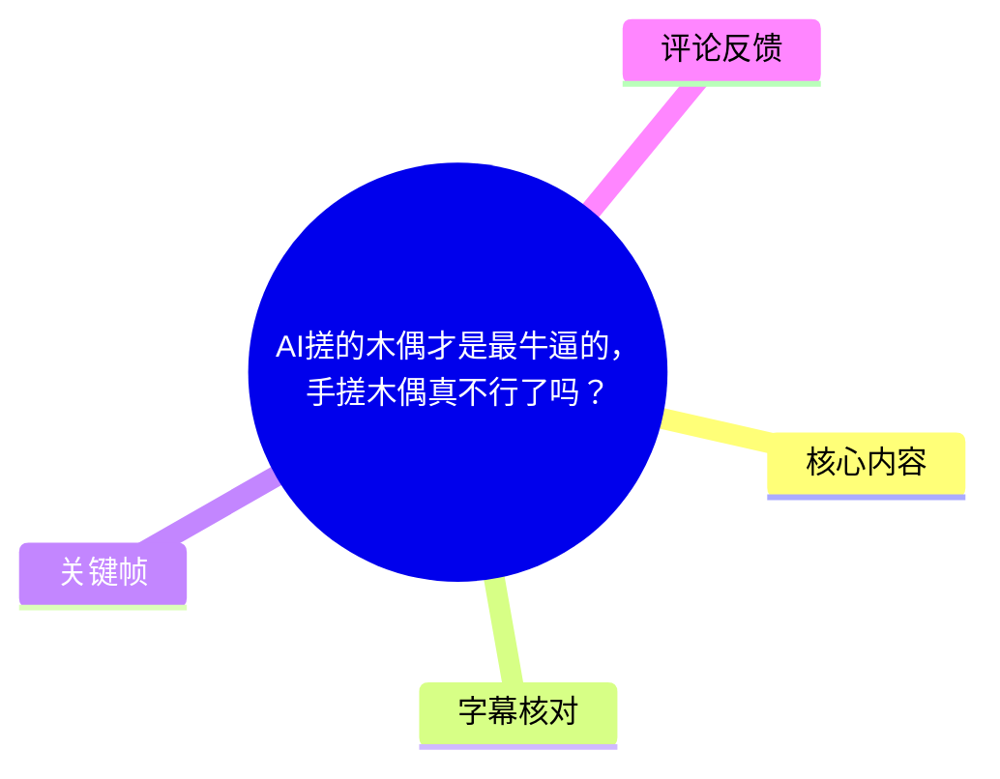
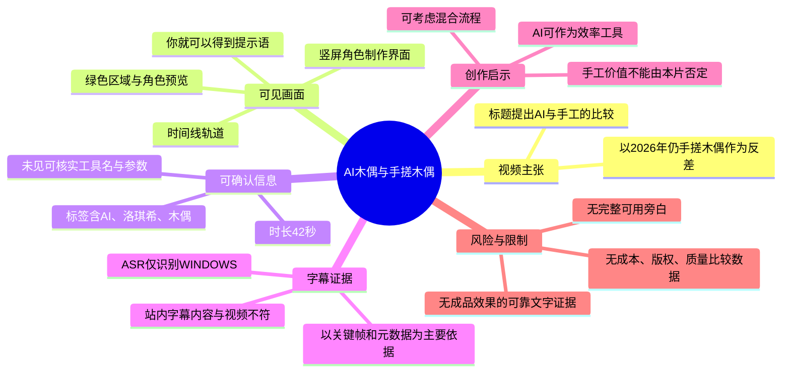
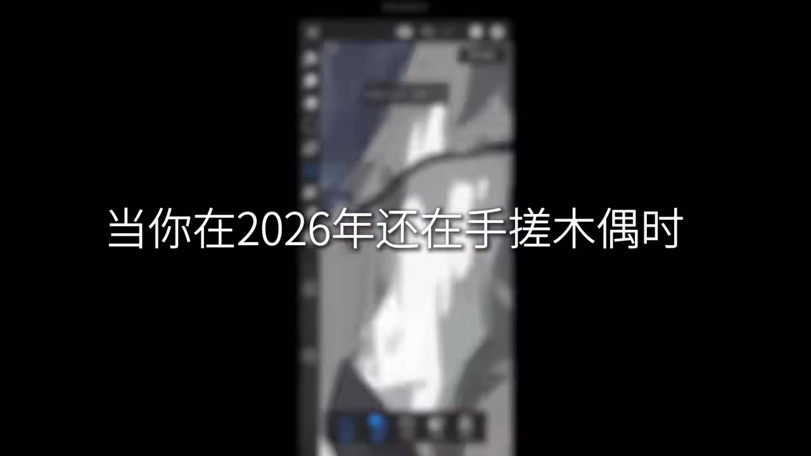
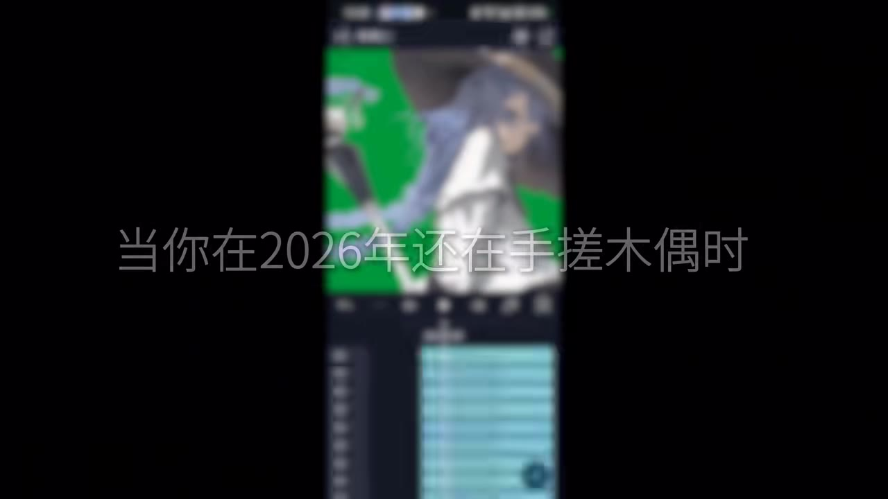
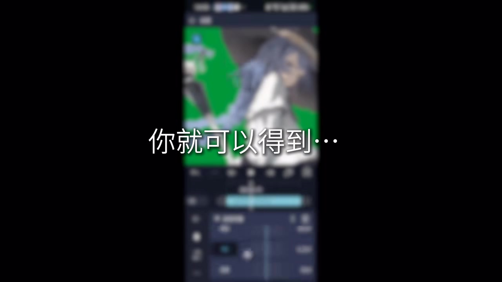

# AI搓的木偶才是最牛逼的，手搓木偶真不行了吗？

> 来源：[Bilibili 视频](https://www.bilibili.com/video/BV15eV36dExu) 
> UP 主：隺鳥子71｜时长：42 秒｜分辨率：3840×2160｜标签：AI、洛琪希、木偶、无职转生

## 小结

视频标题以“AI 搓的木偶”与“手搓木偶”作对比，提出一个偏调侃但具有创作流程讨论意味的问题：当 AI 生成或辅助制作的角色木偶效果更快出现时，传统手工木偶是否仍有价值。

可确认的画面信息显示，视频前段展示了一个竖屏软件界面中的角色/木偶制作过程，并以大字叠加“当你在2026年还在手搓木偶时”。后续画面切换到带绿色背景区域、时间线轨道及角色预览的编辑界面，并出现“你就可以得到……”字样。这表明视频至少在视觉上构造了“传统手工制作较慢”与“软件/AI 辅助流程可快速得到角色效果”的对照。

不过，现有文字素材存在严重冲突：站内字幕完整讲述的是“新车被鸡血涂满”的另一个视频，和本视频标题、标签及关键帧均不相符；本次 ASR 仅识别出 0—1.02 秒的英文“WINDOWS”，语音覆盖率仅 2.43%。因此，不能根据两份字幕扩写视频旁白、工具名称、具体提示词、模型、生成参数或成品质量。

视频可供借鉴的核心并不是一套已被完整展示和验证的 AI 木偶教程，而是一个流程层面的创作命题：软件化/AI 化能够压缩角色素材制作或动画预览的时间，但这不等同于已经证明“手搓木偶不行”。画面没有提供成本、时长、可控性、版权来源、成品稳定性等比较数据。

该视频的发布与素材抓取时间均处于 2026 年语境，AI 工具的功能、价格、工作流和输出品质可能迅速变化。对其中隐含的“AI 更快”判断，应限定为该短视频的表达和评论区讨论，不应视为对行业效率的普遍结论。

## 思维导图

## 目录

- [素材背景与证据边界](#素材背景与证据边界)
- [画面中的“手搓”与软件流程对照](#画面中的手搓与软件流程对照)
- [可见工作流与可迁移经验](#可见工作流与可迁移经验)
- [参数、技术信息与未证实事项](#参数技术信息与未证实事项)
- [结论、限制与时效性](#结论限制与时效性)
- [字幕比对](#字幕比对)
- [评论分析](#评论分析)
- [处理记录](#处理记录)

## 素材背景与证据边界 [00:00](https://www.bilibili.com/video/BV15eV36dExu?t=0)

本片时长为 42 秒，标题为“AI搓的木偶才是最牛逼的，手搓木偶真不行了吗？”。UP 主简介中注明“老一辈艺术家还在手搓”“素材来源于网络”“如侵删”，并提到“原图是 dino 画的，p 和 x 都有”。其中，“dino”“p”“x”的具体指代在现有材料中没有解释，不能擅自认定为某个绘图软件、模型或平台。

元数据标签包括“AI”“洛琪希”“木偶”“无职转生”。这使得视频主题可合理界定为：围绕动漫角色素材、木偶形象或木偶式动画制作的 AI/数字化讨论。但关键帧中的软件界面文字模糊，未能识别出软件产品名；视频也没有提供可验证的模型名称、操作入口或项目文件。

视频核心证据应分为三层：

1. **可直接确认**：标题、标签、时长、画面叠字、角色预览、绿色背景区域、编辑时间线界面。
2. **可谨慎推断**：画面意在强调数字工具或 AI 工具对“木偶”角色制作/动效制作的效率优势。
3. **不能确认**：是否使用了特定 AI 模型、是否完全由 AI 生成、角色是否为最终导出成品、实际耗时、是否替代传统手工艺、画面中软件的准确名称。

> 图：关键帧中央叠加“当你在2026年还在手搓木偶时”，背景为模糊的竖屏角色编辑画面。它直接支撑了视频用“手搓木偶”建立反差的叙事起点，但不足以证明具体工具或制作方法。

## 画面中的“手搓”与软件流程对照 [00:00](https://www.bilibili.com/video/BV15eV36dExu?t=0)

### 1. 开场设定：将手工制作置于“2026 年”的效率语境

画面中的“当你在2026年还在手搓木偶时”并非中立的工艺史陈述，而是一种带有网络调侃风格的对比性文案。它把“手搓”描述为相对于数字化、AI 化工作流而言更慢的一端，借此为后续软件界面展示制造期待。

这里的“手搓木偶”可能泛指人工完成角色素材、立绘拆分、骨骼绑定、动态处理或实体木偶制作中的某些环节；但视频没有定义该词的技术范围。因此，不应将其狭义等同于实体木偶雕刻，也不能将其直接理解为传统动画绑定的全部流程。

### 2. 画面呈现：角色预览、色块背景与时间线

后续关键帧可见一名蓝发角色预览，左侧或背景区域出现大面积绿色，界面下方存在多条浅蓝色横向轨道，形式上接近视频剪辑、动画编辑或角色动效编辑中的时间线/图层列表。画面仍被压缩和虚化，无法从中可靠读出按钮、菜单、软件标识或轨道名称。

> 图：画面出现蓝发角色、绿色区域和多条横向时间线轨道，说明视频不只是静态展示角色图，而是把重点放在编辑流程或动画效果的呈现上。由于界面细节模糊，不能据此确认具体软件。

### 3. 结果承诺：以“你就可以得到……”制造转折

另一帧使用“你就可以得到……”作为大字叠加，背景仍是角色和编辑轨道。这是典型的短视频悬念式转场：先提出手工制作的效率问题，再暗示通过前述数字流程可以获得某种角色木偶或动画效果。

但素材中没有可用字幕描述“得到”的具体结果，也没有独立、清晰的最终成品帧可供核验。因此，严谨表述只能停留在：**视频暗示软件/AI 辅助流程能够产出与角色木偶相关的结果**，不能进一步断言成品具有“高质量”“一键生成”“完全自动绑定”或“优于手工”的特征。

> 图：该帧记录了视频从问题设定转向结果展示的文案节点。其价值在于说明视频采用“流程—结果”的叙事结构；其限制是“结果”文字之后的内容在现有可靠字幕中缺失。

## 可见工作流与可迁移经验 [00:00](https://www.bilibili.com/video/BV15eV36dExu?t=0)

> 本节只整理关键帧能够支持的流程结构，不把画面未写明的操作补成教程。

### 可见的流程结构

从画面顺序和叠字逻辑可整理出以下抽象工作流：

1. **提出传统流程的时间成本问题**  
   开场以“还在手搓木偶”作为对照对象，强调人工制作可能涉及重复性工作。

2. **进入数字编辑环境**  
   画面展示角色预览和编辑软件界面。可以确认的是，作者使用了某种能同时呈现角色素材与时间线/轨道的数字环境；无法确认是 AI 图像工具、视频编辑器、Live2D 类工具、骨骼动画软件还是其他应用。

3. **调整角色与时间线内容**  
   下方轨道的存在提示画面可能涉及时间维度上的编辑，例如片段、图层、关键帧或音视频轨道。但“轨道”具体承载什么信息不可辨认，不能写成已完成的骨骼绑定、口型驱动或表情控制。

4. **展示或预告结果**  
   文案“你就可以得到……”表明创作者将前面的编辑过程导向某个结果。成品的具体形式、动作数量、导出格式与质量均未在可用文字证据中出现。

### 对创作者有用的经验

- **先界定要自动化的环节。** “AI 木偶”不是单一技术：可能包括角色图生成、局部补图、素材分层、动作生成、背景去除、时间线合成等。若没有明确目标，单纯追求“AI 一键完成”通常难以评估效率。
- **保留人工审核位置。** 即使视频表达了 AI 速度优势，角色一致性、肢体合理性、素材版权、审美选择和最终剪辑仍需要人工判断。现有画面不足以支持“AI 已不需要人工制作”的结论。
- **把角色素材、编辑工程和导出结果分开管理。** 画面可见角色预览与时间线并存，提示创作过程至少包含素材层和编辑层。实际工作中应保存源素材、工程文件及导出版本，便于回溯修改。
- **比较效率时使用可复核指标。** 若要回答“手搓真不行了吗”，应至少比较准备时间、修改次数、角色一致性、可控动作数量、输出分辨率、成本及授权风险。本片未提供这些指标，无法完成定量比较。

## 参数、技术信息与未证实事项 [00:00](https://www.bilibili.com/video/BV15eV36dExu?t=0)

### 已知技术信息

| 项目 | 可确认内容 |
| --- | --- |
| 视频时长 | 42 秒 |
| 成片分辨率 | 3840 × 2160 |
| 画面形态 | 横版成片中嵌入竖屏软件/手机界面，周围为黑色区域 |
| 可见编辑元素 | 角色预览、绿色区域、下方多条横向轨道、叠加文字 |
| 视频关联标签 | AI、洛琪希、木偶、无职转生 |
| 音频识别结果 | ASR 在 00:00—00:01.020 仅识别到“WINDOWS” |

### 未提供或无法可靠识别的参数

以下信息没有出现在可用的可靠证据中，不应编造：

- AI 模型、服务名称、版本号和调用方式；
- 提示词、负面提示词、采样器、步数、随机种子、CFG 等生成参数；
- 图像或视频生成的尺寸、帧率、时长、导出编码；
- 角色是否经过骨骼绑定、表情参数化、抠像、绿幕合成或逐帧动画；
- 实际人工制作时长与 AI 流程耗时；
- 使用素材的版权状态、角色原画授权范围；
- AI 输出是否完全由模型生成，或只是用于局部补图、合成或编辑。

### 使用与传播限制

UP 主描述中含“素材来源于网络”“如侵删”，说明素材来源并非在本片中被完整交代。对角色图、原画、模型输出或二次创作工程进行复用前，应另行确认原作者授权、角色 IP 使用规则、平台条款及训练/生成工具的商用政策。

## 结论、限制与时效性 [00:00](https://www.bilibili.com/video/BV15eV36dExu?t=0)

视频通过“2026 年还在手搓木偶”的文案和角色编辑界面，表达了 AI/数字工作流可能加快木偶式角色制作的观点。它适合作为“AI 是否会改变角色动画或木偶创作流程”的讨论引子，而不是一份可直接复现的技术教程。

最可迁移的结论是：AI 可以被放入角色创作流程中，用于压缩重复性的素材处理或生成环节；但是否优于手工，取决于项目目标。若强调独特质感、精准可控、实体表演或长期版权可追溯，手工制作仍可能具有不可替代的价值。若强调快速试错、内容更新频率和低门槛预览，数字/AI 辅助可能更有优势。

本片存在三项主要限制：

1. **字幕不可用。** 站内字幕明显错配，ASR 几乎未捕捉到有效语音，无法还原完整观点。
2. **界面不可辨识。** 关键帧模糊，无法确认具体工具、菜单、模型和技术参数。
3. **没有量化比较。** 未展示成本、耗时、精度、稳定性、授权与成品质量的对照实验，标题中的优劣判断不能视为已证实事实。

时效性方面，视频文本明确使用“2026 年”作为语境。AI 生成、图像驱动和动画编辑工具的能力及价格变化很快；即使后续能识别出所用软件，其操作界面、可用功能和效果也可能已发生变化。复现时应以工具当前官方文档、授权政策和实际测试结果为准。

## 字幕比对

| 字幕来源 | 完整性 | 专有名词 | 时间轴 | 主要问题 |
| --- | --- | --- | --- | --- |
| Bilibili 站内字幕 `p01-ai-zh.srt` | 形式上覆盖 00:00.040—00:33.560，但内容不适用 | 出现“车主”“丈母娘”“鸡血”等，与本片标题及画面无关 | 分段精确、可直接换算秒数，但对应的是错误内容 | 明显属于另一则“新车开光/鸡血”视频，不能用于本片事实整理 |
| 本次 ASR 字幕 | 极低，仅 1 句 | 仅识别“WINDOWS” | 有 00:00.000—00:01.020 时间戳 | 识别语言为英语，语音覆盖率 2.43%，没有还原本片的中文信息 |

本次 ASR 已被检查：使用 `medium` 模型、自动语言识别，结果判定语言为英语，置信度 0.8642578125；仅在 0—1.02 秒输出“WINDOWS”。诊断显示总语音时长 1.02 秒、有效覆盖率 0.0243，未标记 `noAudioStream=true`，因此不能称视频没有音轨；更准确的说法是：**源文件存在音频提取产物，但本轮 ASR 没有获得可用于内容整理的有效转写。**

最终字幕策略如下：

- **不采用站内字幕内容**，因为其主题与视频完全冲突；
- **不将“WINDOWS”扩展为旁白证据**，因为它无法说明木偶制作流程，也可能是界面声、环境声或识别误差；
- 正文主要依据视频标题、描述、标签、时长和关键帧中的可见文字及界面结构；
- 所有涉及具体软件、AI 模型、参数、成品效果和具体步骤的内容均保留为“未证实”。

关键帧校正结果：可稳定辨认的中文叠字为“当你在2026年还在手搓木偶时”与“你就可以得到……”。角色、绿色区域及时间线轨道可见，但软件名称和控件文字无法可靠辨认。

## 评论分析

仅分析本次可获取的热评前三条；评论反映的是用户观点，不构成对视频技术路线或效果的验证。

### 1. “AI 生成快，但手动制作速度慢”——刀月你好香（240 赞）

评论原文以玩笑口吻指出：“豆包虽然生成速度快，但是手动制作的速度慢啊。”它补充了一个常被忽略的效率维度：即使 AI 生成阶段很快，后续手动制作、筛选、修图、工程整理或动画调整仍可能耗时。

这条评论与视频标题的“AI vs 手搓”对立形成呼应，但没有给出“豆包”在本视频中实际被使用的证据，也没有提供具体耗时数据。因此，它只能作为对 AI 工作流总耗时的提醒，不能证明视频所示工具就是豆包。

### 2. “AI 补图 + 手搓木偶”的混合路线——白嫖王乀（27 赞）

评论认为“ai木偶太假了”，并提出“AI 补图 + 手搓木偶”可能是性价比较高的流程。该观点没有把 AI 与手工视为非此即彼，而是提出混合分工：AI 负责补图等局部效率环节，手工负责更依赖质感和控制力的部分。

这与本片的对比式标题相比更具可操作性，但“太假”“最有性价比”均为主观判断，未提供质量标准、成本模型或案例验证。其价值在于启发流程设计，而非给出已验证的最佳方案。

### 3. 一段包含面部、头发和风场参数的生成描述——一动不动の美咲（16 赞）

该评论给出了一段详细的生成设想，包括“8K 超写实面部建模”“眨眼周期 1.52 秒”“2000+ 发丝独立动力学”“风速 1.2m/s”“比例 3:4、时长 5s”等参数，并要求视角不动、头发飘动、周期性眨眼。

这段内容更像面向图生视频/动图生成的提示词或概念化参数清单，而不是对本片真实操作的转录。评论没有说明使用的模型、平台、参数是否实际生效，也没有证实这些设置与画面中的木偶编辑界面有关。

其中“布料弹性模量升至 200GPa”等数字是否符合常规物理仿真语义，评论未提供来源或验证结果，不宜直接照抄为生产参数。它可作为“希望实现静态角色微动效果”的需求样例，但不是经过视频验证的技术配方。

## 处理记录

- Worker ID：`worker-mrj0wbly-5dc4e50c`
- 模型：`gpt-5.6-terra`
- 素材处理工具与产物：已提供合并视频 `merged.mp4`、音频 `audio/audio.wav`、关键帧目录 `frames/`、ASR 结果 `asr/asr-result.json`、ASR SRT `asr/transcript.srt`、站内字幕 `subtitles/p01-ai-zh.srt`、评论文件 `comments/comments.json`。
- ASR 检查：已检查本次 ASR 诊断及时间轴结果；识别模型为 `medium`，设备为 CUDA，计算类型为 float16。ASR 未标记 `noAudioStream=true`，但有效转写仅为“WINDOWS”。
- 字幕选择：拒绝采用站内字幕作为本片正文证据，原因是其内容为新车鸡血仪式，和视频标题、标签、关键帧完全不符；ASR 覆盖率过低，也不作为叙事主依据。正文改以元数据、画面叠字和多模态关键帧理解为主。
- 时间轴依据：所有正文时间轴均使用 ASR 可确认的起始时间 `00:00:00`，即 [00:00](https://www.bilibili.com/video/BV15eV36dExu?t=0)；未依据文字顺序虚构后续时间点。站内 SRT 虽含精确分段，但内容错配，故不拿它定位本片段落。
- 关键帧选择依据：选用 `frames/frame-001.jpg` 记录“2026 年还在手搓木偶”的主题文案；选用 `frames/frame-003.jpg` 展示角色、绿色区域与时间线；选用 `frames/frame-004.jpg` 展示“你就可以得到……”的结果导向文案。三帧均与正文的可验证视觉论点直接相关。
- 评论范围：仅处理可获取的热评前三条，按赞数为 240、27、16。
- 缓存清理：素材未提供缓存清理执行日志；本次记录不声称已执行删除。保留原始字幕与 ASR 结果以便复核错配问题。
- 未解决问题：无法确认视频实际使用的软件、AI 模型、提示词、具体操作、最终成品、真实耗时及素材授权状态；站内字幕为何错配亦无法仅凭现有材料判定。
