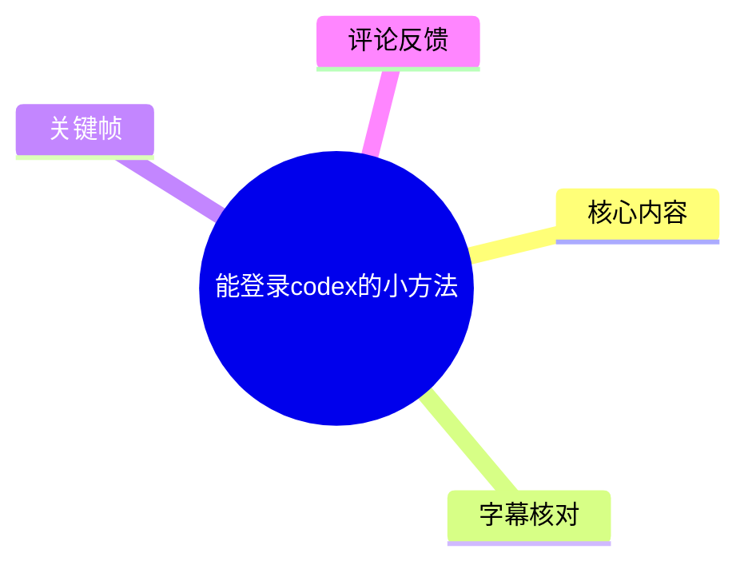
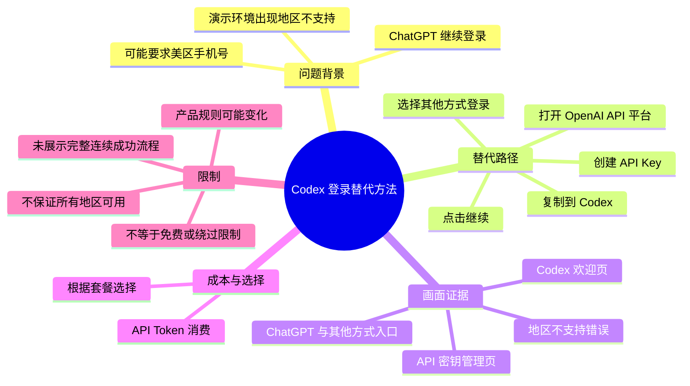
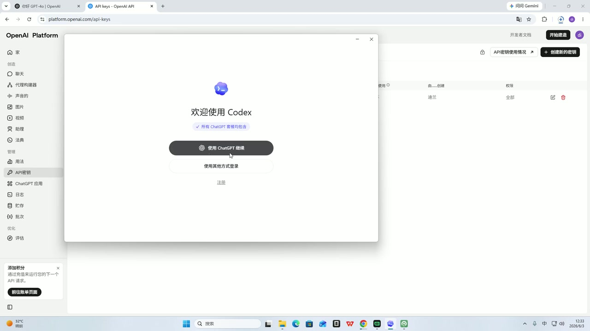
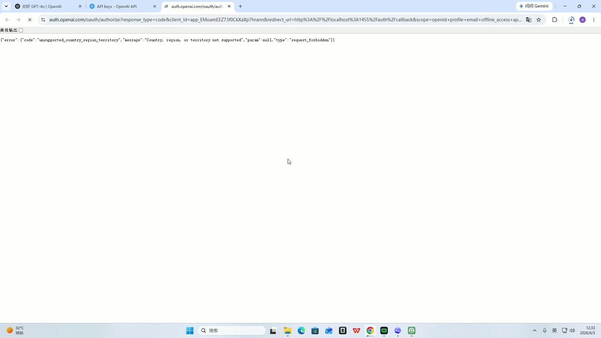
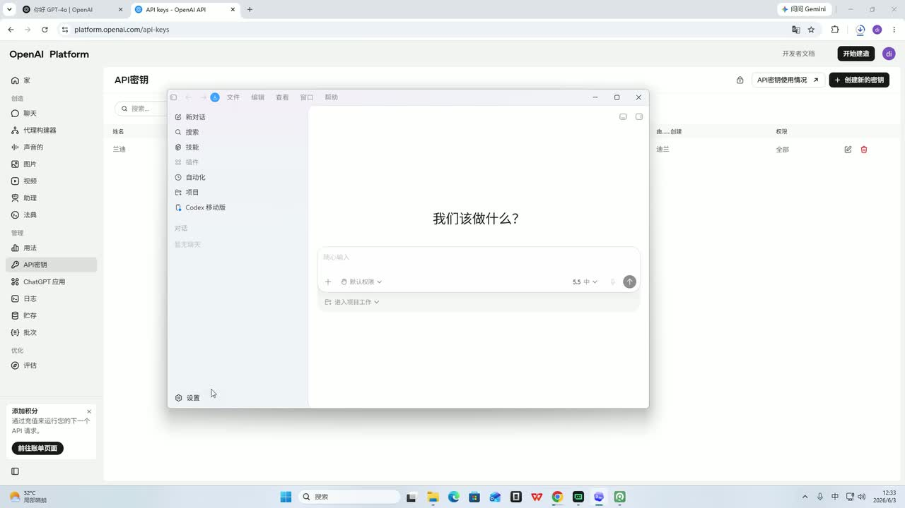
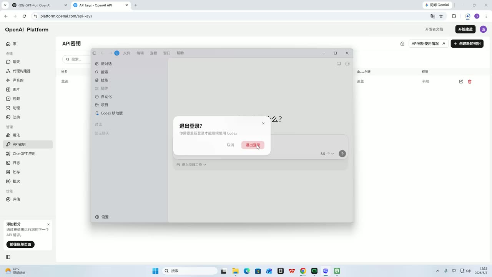

## 小结

视频讲解了一个用于尝试登录 Codex 的替代路径。UP 主称，近期部分用户通过“使用 ChatGPT 继续”登录 Codex 时，会遇到需要美区手机号的问题；其演示环境还出现了地区不支持报错。

核心方法是：**不走 ChatGPT 授权登录，而是在 Codex 中选择“使用其他方式登录”，前往 OpenAI API 平台创建 API 密钥（API Key），再将密钥复制回 Codex 并继续。** 这改变的是登录凭据路径，转为使用 API Key。

视频也明确提示了费用边界：API 调用会产生 Token 消费，使用者需要根据自己的套餐或消费方案选择。该方法不能据此理解为免费登录、绕过所有地区限制，或保证所有账号与版本均可用。

素材中的画面显示，Codex 欢迎页同时提供“使用 ChatGPT 继续”和“使用其他方式登录”；当走前者时，浏览器返回 `unsupported_country_region_territory`，即当前国家、地区或属地不受支持。该报错是 UP 主演示环境中的具体结果，不能外推为所有用户必然遇到的情况。

本视频时长 93 秒，属于快速操作提示。它没有连续展示 API Key 创建表单、密钥粘贴界面、账单配置和最终登录成功后的完整验证，因此实际操作时仍应以 Codex 与 OpenAI 平台当时的页面规则、服务地区和计费政策为准。

## 思维导图





## 目录

- [问题背景：ChatGPT 登录可能遇到手机号或地区限制](#问题背景chatgpt-登录可能遇到手机号或地区限制)
- [核心方案：切换为 API Key 登录](#核心方案切换为-api-key-登录)
- [实操步骤：从 Codex 到 OpenAI API 平台](#实操步骤从-codex-到-openai-api-平台)
- [费用、适用范围与限制](#费用适用范围与限制)
- [关键帧索引与画面价值](#关键帧索引与画面价值)
- [字幕比对](#字幕比对)
- [评论分析](#评论分析)
- [处理记录](#处理记录)

## 问题背景：ChatGPT 登录可能遇到手机号或地区限制 [00:00](https://www.bilibili.com/video/BV11VV16ME86?t=0)

UP 主在 ASR 的首段中说明，最近有较多用户询问：登录 Codex 时若被要求使用“美区手机号”应如何处理。其表述称，过去没有这个问题，但当前通过“使用 ChatGPT 继续”登录时可能出现该情况。

从视频画面可见，Codex 欢迎界面提供以下入口：

1. **使用 ChatGPT 继续**；
2. **使用其他方式登录**；
3. **注册**。

随后，UP 主展示了通过 ChatGPT 相关授权跳转时的浏览器错误页面。页面中可见如下 JSON 信息：

```text
code: unsupported_country_region_territory
message: Country, region, or territory not supported
type: request_forbidden
```

该信息可直译为：当前国家、地区或属地不受支持，且请求被拒绝。它说明在此演示环境中，ChatGPT 授权路径至少遇到了服务地区可用性问题。

需要区分两类问题：

| 问题类型 | 视频中是否提及或展示 | 可从素材确认的范围 |
| --- | --- | --- |
| 手机号要求 | UP 主口述提及“美区手机号” | 未展示具体手机号输入页或验证页 |
| 地区不支持 | 浏览器错误页面直接展示 | 演示环境的授权请求被服务端拒绝 |
| Codex 登录入口选择 | 欢迎页直接展示 | 存在 ChatGPT 继续与其他方式两条路径 |
| 所有用户是否都会失败 | 未证实 | 不能据单次演示推断为普遍结果 |



> 图：该关键帧展示“欢迎使用 Codex”界面，能看到“使用 ChatGPT 继续”与“使用其他方式登录”两个入口。它是理解视频方案为何要切换登录路径的直接画面依据。



> 图：该关键帧显示浏览器返回 `unsupported_country_region_territory` 和 `Country, region, or territory not supported`。它补充了口述中的“美区手机号”问题：演示中还存在地区服务可用性限制。

## 核心方案：切换为 API Key 登录 [00:31](https://www.bilibili.com/video/BV11VV16ME86?t=31)

从 ASR 的 `00:00:31,390 --> 00:00:55,820` 段开始，UP 主给出的操作方向是：

- 不使用“ChatGPT 继续”；
- 选择“使用其他方式进行登录”；
- 搜索并进入 OpenAI 官网；
- 进入 API 平台；
- 申请或注册一个 API 密钥；
- 将密钥复制到 Codex；
- 点击继续。

这里的关键不是修复 ChatGPT OAuth 授权，而是改用 API Key 作为视频所称的登录凭据。视频把这条路径描述为可让 Codex 登录并使用的方法。

画面中的浏览器地址为：

```text
platform.openai.com/api-keys
```

该页面标题为“API 密钥”，右上角可见“创建新的密钥”按钮；左侧导航中也高亮了“API 密钥”。因此，“前往 OpenAI API 平台创建密钥”有明确的画面依据。

| 路径 | 入口 | 视频中的凭据方式 | 视频提到的费用信息 |
| --- | --- | --- | --- |
| ChatGPT 路径 | 使用 ChatGPT 继续 | ChatGPT 授权跳转 | 未说明 |
| 替代路径 | 使用其他方式登录 | OpenAI API Key | Token 消费，需自行按套餐选择 |



> 图：画面显示 OpenAI Platform 的“API 密钥”管理页面，右上角有“创建新的密钥”按钮。这张图为“在 API 平台创建密钥”提供了关键视觉证据；不过视频未展示点击该按钮后的表单细节。

## 实操步骤：从 Codex 到 OpenAI API 平台 [00:31](https://www.bilibili.com/video/BV11VV16ME86?t=31)

### 1. 不选择 ChatGPT 继续，改选其他方式登录 [00:31](https://www.bilibili.com/video/BV11VV16ME86?t=31)

在 Codex 欢迎页中，UP 主建议不走“使用 ChatGPT 继续”这一路径，而选择 **“使用其他方式登录”**。

这一步的目的，是避开视频中所述可能出现手机号要求或地区不支持报错的 ChatGPT 授权流程。需要注意，视频没有展示点击“使用其他方式登录”后出现的具体表单，无法从素材确认不同 Codex 版本中的字段名称、输入要求或额外验证要求。

### 2. 搜索 OpenAI 并进入 API 平台 [00:31](https://www.bilibili.com/video/BV11VV16ME86?t=31)

UP 主口述建议“直接搜索 OpenAI”，找到官网后进入 API 平台。演示中已经打开 API 密钥页面，地址栏对应：

```text
https://platform.openai.com/api-keys
```

UP 主还说明，由于其电脑网络延迟较高，因此提前打开了官网页面。这解释了为何素材没有完整记录实时搜索、网页加载和跳转过程。

### 3. 创建或申请 API 密钥 [00:55](https://www.bilibili.com/video/BV11VV16ME86?t=55)

在 `00:00:55,820 --> 00:01:10,060` 段，UP 主说明：在 OpenAI 中“申请注册一个 API 密钥”，然后复制该密钥。

画面可见 API 密钥管理页及“创建新的密钥”按钮，但未完整展示：

- 创建密钥弹窗；
- 项目、组织或权限的选择；
- 密钥明文显示；
- 密钥命名规则；
- 账单、余额或支付配置；
- 创建完成后的保存步骤。

因此，本视频能够确认的是：UP 主建议使用 OpenAI API 平台中的 API Key；不能据此补充具体创建参数或费用设置。



> 图：该关键帧同时呈现浏览器中的 API 密钥页面与前景中的 Codex 窗口，直观表达视频的操作衔接：从 API 平台获得密钥后，回到 Codex 使用，而非继续停留在 ChatGPT 授权页。

### 4. 将 API Key 复制到 Codex 并继续 [01:11](https://www.bilibili.com/video/BV11VV16ME86?t=71)

在 `00:01:11,490 --> 00:01:30,660` 段，UP 主称，将密钥复制“到 Codex 里面”，再点击继续，就可以登录使用。

这应准确理解为 **UP 主在视频中的操作结论**。给定素材未展示 API Key 输入框、粘贴动作、提交后的成功提示、账户信息、模型选择页或实际任务执行结果。因此无法仅凭该视频独立验证：

- 所有 Codex 客户端版本都支持同样的 API Key 输入方式；
- 所有 OpenAI 账户都具备创建及使用 API Key 的条件；
- 所有地区、网络、账号状态都可通过此路径使用；
- 登录成功后一定拥有相同的模型、额度或功能。

### 密钥使用的安全边界

视频未详细讲解密钥安全，但 API Key 是敏感凭据。以下是与视频流程直接相关的通用安全注意事项：

- 不要在截图、评论、聊天记录、代码仓库或公开文档中泄露完整密钥；
- 只将密钥输入可信、确认来源的 Codex 客户端或官方环境；
- 怀疑泄露时，应在 API 平台撤销旧密钥并重新创建；
- 使用前应确认 API 账户的账单、用量与预算控制设置。

这些安全提醒属于通用凭据管理建议，并非 UP 主在视频中的逐字内容。

## 费用、适用范围与限制 [01:11](https://www.bilibili.com/video/BV11VV16ME86?t=71)

UP 主在结尾明确提醒：Token 消费用哪一种，需要用户“再根据它的套餐什么的去挑”。这是视频中关于成本最明确的信息。

### 视频可确认的费用信息

- 此路径涉及 API Token 消费；
- 用户需要自行根据套餐或消费方案选择；
- 视频没有给出具体价格、模型名称、Token 单价、余额、额度、货币、最低充值金额或账单截图。

因此，不能将视频方案理解为“免费使用 Codex”或“无需考虑 API 成本”。

### 视频已展示或明确说明的限制

- UP 主因网络延迟较高，提前打开网页，未全程展示实时跳转。
- 未展示 API Key 从创建到粘贴提交的完整连续流程。
- 未展示成功登录后的可用模型、功能范围或运行结果。
- 演示中出现国家、地区或属地不受支持的错误。
- 登录入口、服务区域、账号规则与 API 计费均可能随产品更新变化。

### 不应从视频推导出的结论

- 不能断言 API Key 路径能绕过全部手机号验证、地区限制、支付要求或账号风控。
- 不能断言 API 路径比 ChatGPT 订阅更便宜。
- 不能断言所有名为 Codex 的网页端、桌面端或客户端版本都支持 API Key 登录。
- 不能把他人提供、来源不明或共享的 API Key 视为可安全使用的方案。

### 适合尝试的人群

该方法更适合以下用户：

- Codex 当前界面确实提供“使用其他方式登录”入口；
- 能正常访问 OpenAI API 平台；
- 能自行创建和管理 API Key；
- 理解 API 使用可能产生按量 Token 消费；
- 愿意在使用前核对当期官方地区支持与计费说明。

## 关键帧索引与画面价值 [00:31](https://www.bilibili.com/video/BV11VV16ME86?t=31)

| 关键帧 | 画面内容 | 正文使用价值 |
| --- | --- | --- |
| `frames/frame-001.jpg` | OpenAI Platform 的 API 密钥页面 | 证实视频所指向的 API Key 管理位置，以及“创建新的密钥”入口存在 |
| `frames/frame-002.jpg` | API 密钥页面与 Codex 窗口同屏 | 说明操作流程需要在 API 平台与 Codex 客户端之间切换 |
| `frames/frame-003.jpg` | Codex 欢迎页与两种登录入口 | 证实“使用 ChatGPT 继续”和“使用其他方式登录”是视频方案的关键分流点 |
| `frames/frame-004.jpg` | `unsupported_country_region_territory` 错误页面 | 为演示环境中的地区不支持现象提供直接证据 |

其余关键帧虽在素材目录中可用，但本笔记未将它们作为正文证据：给定的可见素材已足以覆盖登录入口、API 密钥页面与地区报错三个核心环节，避免对未核实画面作扩展解释。

## 字幕比对 [00:00](https://www.bilibili.com/video/BV11VV16ME86?t=0)

| 字幕来源 | 完整性 | 专有名词 | 时间轴 | 主要问题 |
| --- | --- | --- | --- | --- |
| Bilibili 站内字幕 | 未提供可用站内字幕，无法进行文本比对 | 无法评价 | 无可用分段 | 素材明确标注“未提供可用站内字幕” |
| 本次 ASR 字幕 | 较完整，共 5 段，语音覆盖约 85.16 秒、覆盖率约 91.81% | 有多处同音或近音误识别 | 可用，具有真实 SRT 起止时间 | `codef`、`ChatGDP`、`API密钦`、`官罐`等识别不准确 |

本次 ASR 使用 `medium` 模型，识别语言为中文，语言概率约为 `0.9956`；源音频时长约 `92.76` 秒。诊断结果**未标记** `noAudioStream=true`，说明源视频具有音轨，本次 ASR 结果可用，且提供了带时间戳的分段。

最终正文采用本次 ASR SRT 的真实起止时间作为时间轴依据：

| ASR 段落 | 真实时间 | 正文对应内容 |
| --- | --- | --- |
| 第 1 段 | 00:00:00,400–00:00:11,600 | 用户询问登录 Codex 时需要美区手机号怎么办 |
| 第 2 段 | 00:00:13,520–00:00:29,640 | 过去未遇到问题；通过 ChatGPT 继续时可能出现问题 |
| 第 3 段 | 00:00:31,390–00:00:55,820 | 选择其他方式登录，寻找 OpenAI 官网/API 平台 |
| 第 4 段 | 00:00:55,820–00:01:10,060 | 创建 API 密钥并复制；UP 主说明网络延迟较高 |
| 第 5 段 | 00:01:11,490–00:01:30,660 | 将密钥放入 Codex，继续登录；提示 Token 与套餐选择 |

结合视频标题、页面文字、地址栏和关键帧，对 ASR 中的重要词汇进行了如下校正：

| ASR 原文 | 正文采用 | 校正依据 |
| --- | --- | --- |
| `codef` | Codex | 视频标题“能登录codex的小方法”、Codex 欢迎页 |
| `ChatGDP` | ChatGPT | Codex 登录按钮文字“使用 ChatGPT 继续” |
| `API密钦` | API 密钥 / API Key | API 密钥管理页与上下文 |
| `官罐` | 官网 | 上下文语义 |
| `OpenAI的官网` | OpenAI 官网/API 平台 | 画面地址为 `platform.openai.com/api-keys` |

由于没有可用的 Bilibili 站内字幕，无法执行站内字幕与 ASR 的逐句一致性比较；本笔记以 ASR 时间轴为主，并以关键帧对专有名词与页面内容作了校正。

## 评论分析 [00:00](https://www.bilibili.com/video/BV11VV16ME86?t=0)

仅分析当前可获取的热评前三条。以下内容反映评论者的个人反馈，不构成对登录方法、价格或适用范围的独立验证。

1. **南驰ccc（11 赞）**：“api登录有什么用，巨贵”  
   - 观点：认为 API 登录成本可能很高，并质疑其实际价值。  
   - 与视频内容的关系：该评论呼应了 UP 主结尾关于 Token 消费和套餐选择的提醒。  
   - 信息边界：评论未提供所用模型、Token 数量、消费账单或时间范围，无法据此量化“巨贵”的具体成本。

2. **早点睡觉呢（8 赞）**：“upup，进不去是咋回事啊”  
   - 观点：该用户尝试后仍无法进入。  
   - 补充价值：说明该路径未必对每位用户都能立即成功。  
   - 信息边界：评论没有说明失败发生在哪一步，无法判断原因是网络、地区、账号、账单、API Key、客户端版本还是其他因素。

3. **四喜_啊丸子（6 赞）**：“有点厉害，上去了。但是这是什么情况”  
   - 观点：评论者似乎成功进入，但仍不理解当前登录状态或背后的机制。  
   - 补充价值：提供了一例正向尝试反馈。  
   - 信息边界：没有操作细节、截图、版本号或后续使用情况，不能作为普适成功证据。

## 处理记录 [00:00](https://www.bilibili.com/video/BV11VV16ME86?t=0)

- Worker ID：`worker-mrj0wbly-5dc4e50c`
- 模型：`gpt-5.6-terra`
- 使用工具与素材产物：
  - 视频元数据；
  - 合并视频：`merged.mp4`；
  - 音频：`audio/audio.wav`；
  - 关键帧目录：`frames/`；
  - ASR 结果：`asr/asr-result.json`；
  - ASR 时间轴字幕：`asr/transcript.srt`；
  - 热评数据：`comments/comments.json`。
- 字幕选择：
  - 已检查站内字幕：未提供可用 Bilibili 站内字幕；
  - 已检查本次 ASR：存在音轨，`noAudioStream=true` 未出现；
  - 最终采用本次 ASR SRT 的真实时间分段作为章节时间轴依据；
  - 结合关键帧、标题、页面可见文字校正了 Codex、ChatGPT、API 密钥等专有名词。
- 关键帧选择依据：
  - `frames/frame-003.jpg`：展示 Codex 两种登录入口，是替代路径的起点；
  - `frames/frame-004.jpg`：展示地区不支持错误，是问题背景的直接证据；
  - `frames/frame-001.jpg`：展示 OpenAI API 密钥页与创建入口；
  - `frames/frame-002.jpg`：展示 API 平台和 Codex 客户端之间的操作关联。
- 缓存清理：提供的任务素材未包含缓存清理执行日志，无法确认是否执行过缓存清理；因此不将其表述为已完成。
- 未解决问题：
  - 未提供 API Key 创建后的完整表单、权限、账单和密钥输入页面；
  - 未提供登录成功后的完整连续画面与实际功能验证；
  - 无法由本视频确认方法在不同国家地区、账户状态、套餐类型或 Codex 版本中的普遍有效性；
  - 产品认证入口、地区可用性和 API 计费具备时效性，应以实际使用时的官方页面为准。

## 评论分析

- 热评 1：api登录有什么用，巨贵
- 热评 2：upup，进不去是咋回事啊
- 热评 3：有点厉害，上去了。但是这是什么情况

以上内容是观众反馈摘录，只用于补充理解视频反响，不作为正文事实依据。
