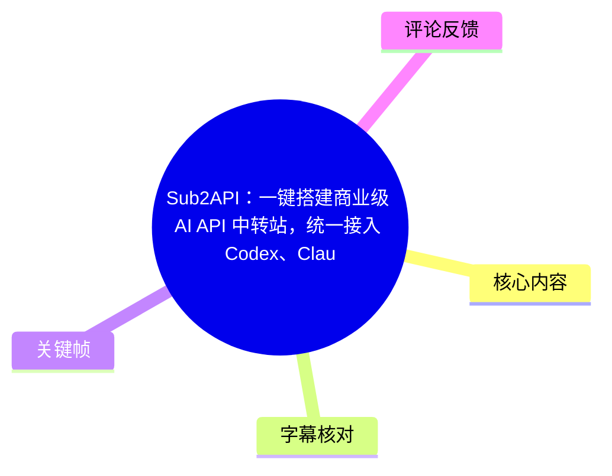
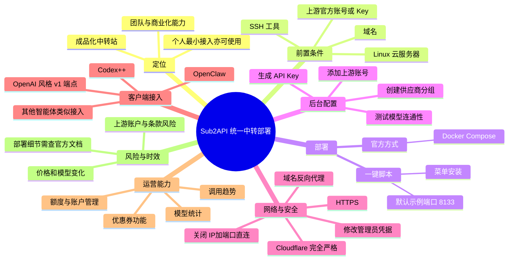
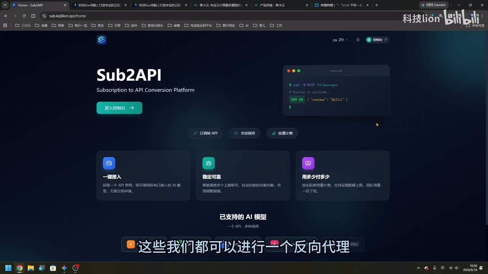
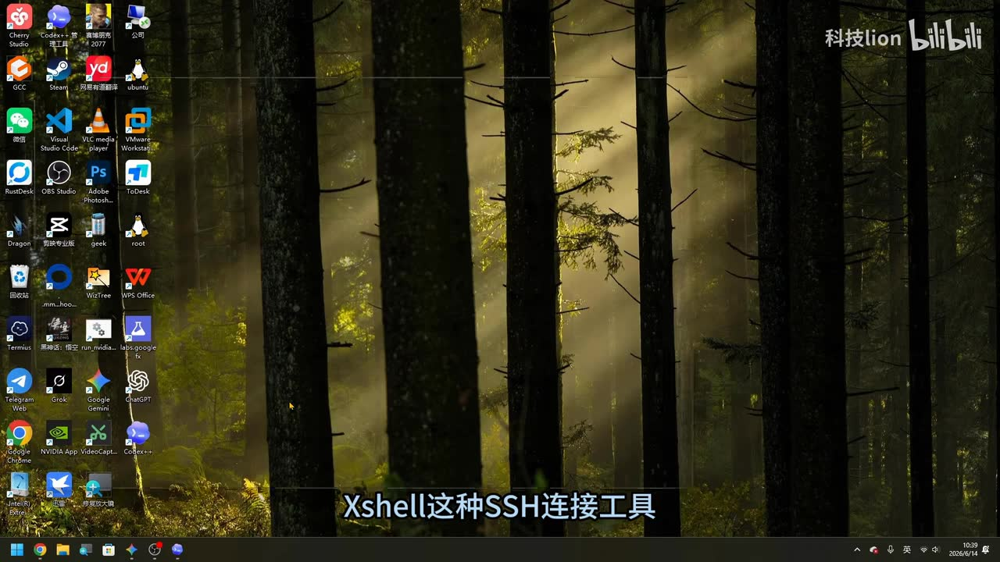
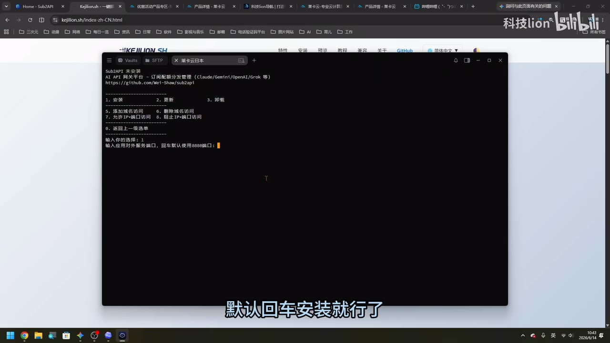
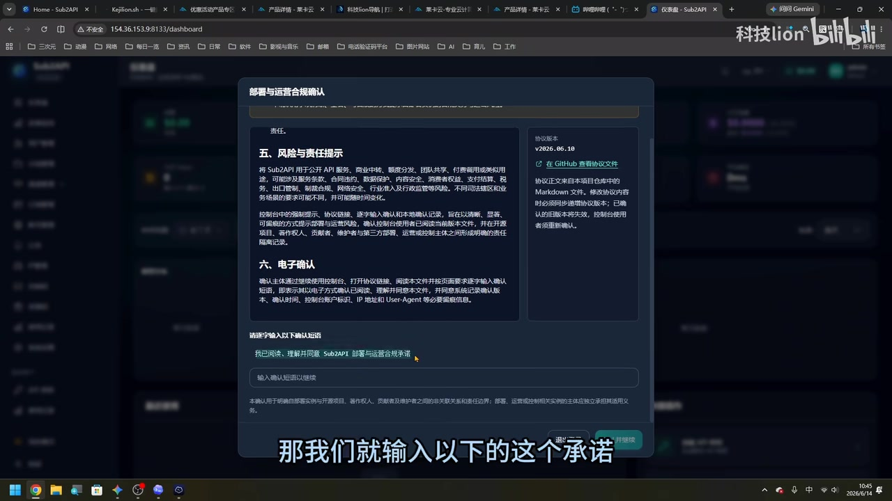

# Sub2API：一键搭建商业级 AI API 中转站，统一接入 Codex、Claude、Gemini，低门槛开启 API 变现

> 来源：[Bilibili 视频](https://www.bilibili.com/video/BV14EJF6fEVY)  
> UP 主：科技lion｜合集：AIcode｜时长：17 分 38 秒  
> 视频描述提供了 Sub2API 图文教程、VPS 优惠页及 Termius 下载页；本文只整理视频及所给素材中实际出现的内容，不对外链内容作额外背书。

## 小结

视频演示了将多个 AI 服务账号或上游能力统一接入 **Sub2API** 的最小部署流程。UP 主将其定位为偏「成品化、团队化、商业化」的 API 中转站，与其此前提及的偏个人极客使用的同类面板（ASR 识别为“CPA/CPACRI”，原名存在误识，以下统称“另一同类面板”）形成定位差异。

核心架构是：在一台 Linux 云服务器上部署 Sub2API，通过后台建立**分组**、添加账号、生成面向客户端的 **API Key**，再使用域名、HTTPS 和反向代理提供统一的 OpenAI 风格 `/v1` 端点。视频实例接入了 OpenAI/Codex，并在 Codex++、OpenClaw 中验证了调用；UP 主还口述 Claude Code、Gemini 和“Amiis/Hemis”（名称存在 ASR 不确定性）可按类似方式接入，但没有逐一完整演示。

部署上，视频提供两条路线：一是通过其一键脚本菜单安装，默认端口示例为 **8133**；二是使用项目官方的 Docker Compose 拉取镜像部署。前者降低 Docker 使用门槛，后者是视频提到的官方方式。视频没有给出完整脚本命令、镜像名、Compose 文件或服务器规格，因此这些关键部署细节不能从本视频还原。

安全是操作中的关键环节：初始的“IP + 端口 + HTTP”访问被 UP 主明确认为不够理想；建议绑定域名、经 Cloudflare 配置 DNS 与 SSL/TLS，并将模式设为“完全（严格）”。在域名访问可用、管理员账号密码已修改后，应关闭 IP 加端口直连，以减少暴露面。视频声称脚本会部署 Nginx、申请证书并处理续签，但具体证书方案、续签机制和防火墙规则未展示，需以实际项目文档及部署日志复核。

对于个人用户，视频展示的最小可行流程是可用的：建立 OpenAI 类型分组 → 添加上游账号并测试 → 建 API Key → 为客户端填写域名 `/v1` 与 Key → 测试模型调用。对于团队或商业化场景，视频展示 Sub2API 还具备账户、额度、调用趋势、模型用量、优惠券等后台能力；但这不等同于其已通过安全、合规、稳定性或上游服务条款验证。

本视频具有明显时效性：录制时展示了协议版本 **v2026.06.10**、示例模型“GPT-5.5”、OpenClaw 菜单项和“17 个模型”的列表；供应商价格、区域、模型名称、管理界面、Cloudflare 选项、项目功能及各上游账号政策均可能已变化。尤其是评论区已有用户报告 Claude 接入后可能被封号，不能将中转部署理解为规避上游规则的方案。

## 思维导图





## 目录

- [背景、定位与前置条件](#背景定位与前置条件)
- [部署路线：一键脚本与 Docker Compose](#部署路线一键脚本与-docker-compose)
- [首次登录、合规承诺与后台对象](#首次登录合规承诺与后台对象)
- [配置上游账号、分组和 API Key](#配置上游账号分组和-api-key)
- [域名、HTTPS 与访问面收敛](#域名https-与访问面收敛)
- [接入 Codex++ 与 OpenClaw](#接入-codex-与-openclaw)
- [监控、商业化能力与产品定位](#监控商业化能力与产品定位)
- [完整实操清单与参数汇总](#完整实操清单与参数汇总)
- [限制、风险与时效性](#限制风险与时效性)
- [关键帧索引](#关键帧索引)
- [字幕比对](#字幕比对)
- [评论分析](#评论分析)
- [处理记录](#处理记录)

## 背景、定位与前置条件

### [统一中转的目标与产品定位（00:00:37）](https://www.bilibili.com/video/BV14EJF6fEVY?t=37)

视频从约 37 秒开始进入正题。UP 主介绍 Sub2API，称其与此前介绍过的某个同类中转面板相似，但认为 Sub2API 更偏向“成品化、团队化”，并具有更强的商业化导向。

视频中描述的目标是将常用的 Codex、Claude Code、Gemini 等能力通过反向代理汇集到一个 Sub2API 实例中，再由 Codex、OpenClaw 等智能体或客户端统一调用，并对调用情况进行统计。



> 图：关键帧展示了 Sub2API 首页，页面英文副标题为“Subscription to API Conversion Platform”，并突出“一键接入”“稳定可靠”“用多少付多少”等卖点。它直观说明视频讨论的是订阅/账号能力转为统一 API 调用入口的平台，而不是直接在客户端逐个配置所有上游。

### [前置资源：服务器、域名与 SSH（00:00:39）](https://www.bilibili.com/video/BV14EJF6fEVY?t=39)

按视频演示，完成这一方案至少需要：

1. **一台云服务器**：UP 主倾向推荐海外节点，并以日本机器演示；其个人建议是美国、日本可选，不建议使用香港节点。该判断是视频中的个人建议，并未给出性能测试、合规依据或跨地区延迟比较。
2. **一个域名**：用于后续将初始的 IP:端口访问升级为 HTTPS 域名访问。
3. **SSH 客户端**：UP 主使用 Termius；也提到 FinalShell、XShell 等工具可替代。
4. **可用的上游账号或官方 Key**：视频中实际演示 OpenAI/Codex 相关接入，之后测试上游额度与模型加载。
5. **基础运维权限**：需能重装服务器系统、使用 root 登录、修改 DNS、操作 Cloudflare，并处理管理员密码与端口访问。

视频以 Debian 13 为系统示例，称重装大约需 3～5 分钟；该时间仅为演示环境中的经验，不应视为服务商承诺。



> 图：画面展示 Windows 桌面及 Termius、Xshell 等 SSH 工具图标，字幕提及“Xshell 这种 SSH 连接工具”。该帧说明安装操作发生在远程 Linux 服务器上，SSH 是视频流程的实际入口。

## 部署路线：一键脚本与 Docker Compose

### [通过 SSH 连接服务器（00:02:01）](https://www.bilibili.com/video/BV14EJF6fEVY?t=121)

视频在 SSH 工具中填写服务器信息：

- Host/IP：云服务器公网 IP；
- Port：演示使用默认 SSH 端口 **22**；
- Username：`root`；
- Password：服务商提供的 root 密码；
- 首次连接：需要确认主机指纹或连接提示。

UP 主提到其网站提供一键脚本入口，并通过“科技lion 拼音 + `.ssh`”的方式进入脚本获取页。由于素材未提供实际域名、完整命令或脚本内容，本文不补写任何命令。使用第三方一键脚本前，应自行审阅来源、脚本内容、仓库地址、权限行为和更新机制。

### [路线一：脚本菜单安装（00:02:49）](https://www.bilibili.com/video/BV14EJF6fEVY?t=169)

视频演示通过一键脚本进入应用市场，选择菜单项 **11**，再在应用列表中找到 Sub2API。UP 主称该应用市场中有“100 多个”应用，且脚本可以代为处理 Docker 安装，因此初学者不必直接理解 Docker 的安装与使用。

进入 Sub2API 安装菜单后，视频展示：

- 选择安装项 **1**；
- 端口可以修改；
- 默认端口示例为 **8133**；
- 如果系统中没有 Docker，脚本会安装相关依赖；
- 之后脚本启动开源项目。



> 图：关键帧展示终端中的“Sub2API 本安装”菜单，顶部可见项目说明及 GitHub 地址，菜单包含“1. 安装”“2. 更新”“3. 卸载”“5. 添加域名访问”“6. 删除域名访问”“7. 关闭 IP+端口访问”“8. 开启 IP+端口访问”等项目。它是视频中部署、域名管理与访问控制都由脚本菜单承载的直接证据。

### [路线二：官方 Docker Compose 部署（00:03:37）](https://www.bilibili.com/video/BV14EJF6fEVY?t=217)

UP 主说明，官方部署方式使用 **Docker Compose** 编排工具，通过拉取镜像进行部署；其脚本方案同样利用 Docker Compose。视频也提到可以让智能体协助安装，但认为这样可能消耗 Token、步骤也可能绕远。

需要注意：

- 视频没有展示 `docker-compose.yml`、环境变量、镜像标签、数据卷、端口映射或升级命令；
- 没有展示数据库、Redis、备份、日志轮转、容器健康检查或资源限制；
- 因此视频足以说明“Docker Compose 是官方路线”，但不足以构成可复制的官方部署文档。

对于生产或团队环境，应以 Sub2API 官方仓库/文档的当前版本为准，确认持久化目录、密码初始化方式、升级与回滚流程。

## 首次登录、合规承诺与后台对象

### [初始访问与合规承诺（00:04:01）](https://www.bilibili.com/video/BV14EJF6fEVY?t=241)

部署后，视频先通过 `IP + 端口` 访问 Sub2API 管理界面，并使用初始用户名和密码登录。UP 主表示这类凭据后续可自行改动。

进入系统时，画面出现“部署与运营合规确认”。UP 主解释这是项目近期增加的合规意愿提示，需要输入承诺文字后才能继续。



> 图：弹窗标题为“部署与运营合规确认”，协议版本显示为 `v2026.06.10`。文本提示不得用于非法用途、遵守上游服务条款和隐私政策，并要求管理员确认。该帧对“视频录制时项目已有合规确认机制”提供了可视化依据，但不代表平台已经完成任何第三方合规认证。

这里应区分两件事：

- **视频事实**：项目页面确实显示了合规确认与责任提示。
- **不能推出的结论**：点击确认不等于部署者或使用者自动满足上游服务条款、数据保护法规、支付/转售规定或地区监管要求。实际责任仍取决于部署地、客户所在地、上游政策和具体业务行为。

### [后台的核心关系：分组—账号—API Key（00:04:50）](https://www.bilibili.com/video/BV14EJF6fEVY?t=290)

UP 主将后台最需要关注的对象归纳为三层：

```text
分组（按供应商/用途分类）
  └─ 上游账号（可添加一个或多个）
       └─ 对外 API Key（关联一个分组供客户端调用）
```

视频开始时后台已有一个被 ASR 识别为“Answerobic”的分组，UP 主称它用于 Claude Code 一侧账号；由于本次不演示该账号，先将其删除。该专有名词的准确拼写无法仅靠 ASR 确定，不能将其当作可靠的产品名称或供应商名称。

这一分层意味着：客户端不是直接持有上游账号，而是使用 Sub2API 为某个分组发放的 Key；同一分组可含多个账号，视频称可用于负载均衡。

## 配置上游账号、分组和 API Key

### [创建 Codex/OpenAI 分组（00:05:14）](https://www.bilibili.com/video/BV14EJF6fEVY?t=314)

视频演示创建一个名为 **Codex** 的分组，操作要点为：

1. 新增分组；
2. 填写分组名称 `Codex`；
3. 描述字段可不填；
4. 将类型设为 **OpenAI**；
5. 继续下一步并完成创建；
6. 后续将相关账号放入该分组，再以该分组关联对外 API Key。

视频中没有展示每一个表单字段的精确名称、默认值、策略选项及保存后的具体配置，因此这里只保留已明确口述的字段和逻辑。

### [添加 OpenAI 账号并测试模型（00:05:38）](https://www.bilibili.com/video/BV14EJF6fEVY?t=338)

在“账号”区域中，UP 主选择添加 OpenAI 账号，并选择默认登录方式。演示说明：

- 需要关联刚才创建的 Codex 分组；
- 如果有多个 Codex/上游账号，可以按同一方式继续添加；
- 多账号可以用于视频所称的“负载均衡”；
- UP 主在浏览器中登录 OpenAI 官网，并将相应官方 Key 接入 Sub2API；
- 后台可以查看当前已用额度和剩余额度；
- 可通过测试连接，以“最小化测试”的方式请求视频中显示的“5.5”模型，演示返回“嗨”后视作连通成功。

视频中的“GPT-5.5 / 5.5”是其录制环境的展示名。本文无法依据素材确认该模型的正式公开命名、可用范围、计费方式及当前可用性。

### [创建面向客户端的 API Key（00:06:50）](https://www.bilibili.com/video/BV14EJF6fEVY?t=410)

UP 主进入“API 额度”相关区域添加 API，并选择之前创建的分组。视频表示系统还有许多可选配置，但演示中使用默认设置作为最小可用 Key。

从操作意义上看，应至少验证：

1. Key 是否绑定到预期分组；
2. Key 是否有额度、限速、到期或权限策略；
3. 上游账号是否可用且余额/订阅状态满足调用；
4. 客户端使用的是 Sub2API 的 Key，而非把上游敏感凭据分发给最终用户；
5. 是否有撤销与轮换 Key 的方案。

第 2、4、5 项属于实际部署中应有的安全检查；视频明确展示了额度及账户管理能力，但未完整演示权限边界、Key 生命周期和审计策略。

## 域名、HTTPS 与访问面收敛

### [为什么不应长期使用 IP:端口（00:07:14）](https://www.bilibili.com/video/BV14EJF6fEVY?t=434)

UP 主明确建议不要一直使用 `IP + 端口` 的 HTTP 方式访问，理由是“不够完美”且存在安全性问题；建议改用绑定域名后的 HTTPS 访问。

视频给出的总体链路是：

```text
域名
  → Cloudflare DNS 解析
  → 服务器公网 IPv4
  → Nginx 反向代理
  → Sub2API 服务端口
```

这里需要补充边界：视频仅展示了该架构的操作意图，没有提供 DNS 记录类型、反代配置、TLS 终止位置、源站防火墙规则、Cloudflare 代理状态与 WebSocket/流式响应兼容性等完整配置。因此部署者应测试 API 流式输出、跨域、认证头透传和错误响应。

### [Cloudflare：SSL/TLS 与 DNS 配置（00:07:39）](https://www.bilibili.com/video/BV14EJF6fEVY?t=459)

视频以一个 `.eu.org` 域名为例，并称其为永久域名；该说法和域名当前申请、续期、可用性政策均具有时效性，不能作为今天仍可无条件获得的保证。

在 Cloudflare 中，UP 主展示的要点为：

- 进入 **SSL/TLS**；
- 将 SSL/TLS 加密模式设为 **完全（严格）**；
- 进入 DNS 记录；
- 添加记录，将服务器 **IPv4 地址**填入；
- 建议先关闭“小云朵”（即 Cloudflare 代理开关），保持 DNS only 状态后再继续。

视频没有解释为何需关闭代理、何时可重新开启，也未展示 CNAME、AAAA、TTL、源站证书、Cloudflare Origin Certificate 或 DNS 生效检查。若选择 Cloudflare 代理，应额外验证 API 的长连接/流式请求、访问控制、真实客户端 IP、速率限制及缓存规则。

### [脚本申请反向代理与证书（00:08:51）](https://www.bilibili.com/video/BV14EJF6fEVY?t=531)

在脚本中输入已配置的域名后，UP 主称脚本会：

1. 为该域名配置反向代理；
2. 将域名请求转发到原来的 IP + 端口服务；
3. 部署新版 Nginx；
4. 向 CA 机构申请证书；
5. 对证书进行“永久续签”。

“永久续签”应理解为 UP 主对自动续签效果的口述，而不是证书永久有效。通常公开 TLS 证书都有有限有效期，自动续签依赖域名解析、网络可达性、服务正常运行和验证流程持续满足条件。视频未展示证书颁发机构、挑战方式、定时任务或续签日志。

### [修改管理员凭据并关闭直连（00:10:05）](https://www.bilibili.com/video/BV14EJF6fEVY?t=605)

域名可访问后，视频处理管理入口安全：

1. 由于脚本已封掉 IP + 端口访问，先在脚本中选择允许 IP + 端口访问；
2. 刷新后台；
3. 进入“用户管理”；
4. 修改用户名和密码。视频中的示例用户名、密码属于演示敏感凭据，不应复用；
5. 更新保存；
6. 在脚本中选择菜单项 **8**，关闭 IP + 端口访问；
7. 验证原 `IP:端口` 无法访问；
8. 改用域名登录，确认服务仍可正常进入。

UP 主将关闭 IP 加端口描述为防止攻击者利用暴露入口。这个做法能缩小直接暴露面，但不替代强密码、多因素认证、访问控制列表、及时更新、日志审计、系统补丁、备份和 WAF/限流等安全措施。

## 接入 Codex++ 与 OpenClaw

### [统一端点的格式（00:11:17）](https://www.bilibili.com/video/BV14EJF6fEVY?t=677)

视频称后续客户端应使用新域名作为 API 端点，并在接入时将地址改为 **`/v1`**，称其为 OpenAI 标准端点输入方式。

可抽象为：

```text
Base URL： https://你的域名/v1
API Key：  Sub2API 后台创建并复制的 Key
模型：      从该分组能加载到的模型列表中选择
```

视频没有展示完整请求示例、HTTP Header、兼容 API 路径、模型映射规则和流式调用参数。因此，`/v1` 仅是视频明确展示的地址结构；具体客户端若要求完整 URL、是否自行附加 `/v1`，应按客户端字段说明验证，避免重复拼接为 `/v1/v1`。

### [Codex++：添加中转并测试（00:11:41）](https://www.bilibili.com/video/BV14EJF6fEVY?t=701)

视频在 Codex++ 中进行如下演示：

1. 添加中转；
2. 选择“中转/纯中转”（界面精确文案以客户端当前版本为准）；
3. 填入 Sub2API 域名地址；
4. 将端点改为 `/v1`；
5. 粘贴 Sub2API 的 API Key；
6. 检查上游模型能否加载；
7. 当模型未加载时，UP 主判断可能因上游“没有钱”，随后为演示账号充值 **100 美元**；
8. 返回后选择“GPT-5.5”，设为默认模型；
9. 保存、重启 Codex；
10. 发送“你好”进行测试，确认调用正常。

这里的“先充一百刀”是视频演示中的个人操作，不是部署 Sub2API 的固定成本或必需金额。上游计费取决于账号类型、地区、模型、支付方式和当时价格。

### [OpenClaw：录入 API、加载模型与验证（00:13:43）](https://www.bilibili.com/video/BV14EJF6fEVY?t=823)

UP 主随后展示 OpenClaw（视频口语称“龙虾”）的接入流程：

1. 在 OpenClaw 菜单中进入 **API 管理**；
2. 添加先前配置的 Sub2API；
3. 为连接命名，如 `Sub2API`；
4. 将地址前部移除/整理后改为以 `/v1` 结尾；
5. 粘贴在 Sub2API 后台复制的 Key；
6. 系统列出模型；
7. 选择菜单项 **14** 将其他模型加入；
8. 重启 OpenClaw；
9. 在模型列表查看 Sub2API 的延迟及模型数量；
10. 视频中显示该连接列出 **17 个模型**；
11. 选择“5.5”做最小测试，确认可以正常对话；
12. 向机器人询问“你是什么模型”，以其返回内容作为当前模型调用成功的验证。

视频称 Claude Code、以及被 ASR 识别为“Amiis”的工具也可以类似接入，但没有完整操作画面，因此不能据此写出其具体菜单、字段或兼容性结论。

## 监控、商业化能力与产品定位

### [数据看板、账号与运营功能（00:15:45）](https://www.bilibili.com/video/BV14EJF6fEVY?t=945)

视频在 Sub2API 数据/仪表盘中展示了以下运营信息：

- 当前使用最多的模型；
- 各模型或调用的趋势；
- 更细的柱状图；
- 谁在使用；
- 账号对应的使用额度；
- 最近调用时间，例如视频演示中显示“一分钟前调用”。

UP 主还提到系统包含兑换优惠券等功能，并认为其更适合有商业化需求、企业级或团队级场景。视频所展示的是后台功能方向，不代表这些能力已经覆盖计费结算、发票税务、租户隔离、SLA、反欺诈、数据保留、风控、客服和法律合规等真实商业运营所需的全部环节。

### [Sub2API 与另一同类面板的选择（00:16:33）](https://www.bilibili.com/video/BV14EJF6fEVY?t=993)

UP 主的结论是：

| 使用情境 | 视频中的建议倾向 |
| --- | --- |
| 个人用户、自己尝试 | 另一同类面板即可，个人使用没有问题 |
| 需要统一管理的团队 | Sub2API 被认为更可控、功能更全面 |
| 面向商业化运营 | Sub2API 更符合企业级/商业化方向 |
| 想接入更多 AI 上游 | 可按分组、账号、API Key 的方式扩展 |

这是 UP 主基于视频版本和个人体验的产品定位判断，而不是基于公开基准测试或第三方审计的比较。选择时还应考察项目维护活跃度、更新安全性、许可证、数据安全、上游授权、备份迁移难度及成本结构。

## 完整实操清单与参数汇总

### [最小可行部署顺序（00:01:37）](https://www.bilibili.com/video/BV14EJF6fEVY?t=97)

以下按视频实际先后整理，未出现的命令和字段不作补充：

1. 准备 Linux 云服务器、域名和 SSH 工具。
2. 以服务器公网 IP、端口 22、`root` 和服务商密码建立 SSH 连接。
3. 选择部署方式：
   - 使用视频中的一键脚本，进入应用市场并选择 Sub2API；
   - 或按官方 Docker Compose 文档部署。
4. 安装时确认端口；视频默认示例为 **8133**。
5. 通过 `http://服务器IP:端口` 登录初始管理后台。
6. 阅读并确认项目展示的部署与运营合规承诺。
7. 创建供应商/用途分组，例如类型为 **OpenAI**、名称为 `Codex`。
8. 向分组中添加上游账号，接入官方 Key 或登录凭据。
9. 使用后台测试连接确认模型有正常响应。
10. 为该分组创建对外 API Key。
11. 在 Cloudflare 或其他 DNS 服务商中为域名添加指向服务器 IPv4 的记录。
12. 按视频设置 Cloudflare SSL/TLS 为“完全（严格）”，并初始关闭代理云朵。
13. 通过脚本添加域名访问，使 Nginx/证书/反向代理生效。
14. 先临时恢复 IP:端口访问，进入用户管理修改默认管理员用户名和密码。
15. 关闭 IP + 端口访问，仅保留域名访问。
16. 在 Codex++、OpenClaw 等客户端填入：
    - `https://你的域名/v1`
    - Sub2API API Key
    - 可用模型名称
17. 重启客户端或刷新模型列表，做最小请求测试。
18. 在仪表盘核对调用记录、模型用量、额度和延迟。

### [视频明确出现的参数与状态](https://www.bilibili.com/video/BV14EJF6fEVY?t=193)

| 项目 | 视频中的值或说法 | 使用时的边界 |
| --- | --- | --- |
| 演示系统 | Debian 13 | 非唯一支持系统；视频称主流 Linux 发行版兼容 |
| SSH 端口 | 22 | 是默认示例，不应假定所有服务器均使用该端口 |
| Sub2API 默认端口示例 | 8133 | 可修改；视频未展示防火墙规则 |
| 官方部署技术 | Docker Compose | 未展示 Compose 内容与版本要求 |
| 对外 API 路径 | `/v1` | 客户端是否需填写完整路径应实际验证 |
| SSL/TLS 模式 | Cloudflare“完全（严格）” | 需要源站证书有效且配置匹配 |
| DNS 代理建议 | 初始关闭“小云朵” | 视频未说明后续启用条件 |
| 客户端示例 | Codex++、OpenClaw | 其他客户端仅口述“类似”，未完整验证 |
| 演示模型 | “GPT-5.5 / 5.5” | 名称、可用性和计费均可能变化 |
| OpenClaw 模型数 | 17 个 | 仅为演示时该账号/分组返回的结果 |
| 演示充值 | 100 美元 | 不是普适成本建议 |
| 合规协议版本 | v2026.06.10 | 仅反映关键帧所示录制版本 |

## 限制、风险与时效性

### [需要在部署前确认的边界（00:16:57）](https://www.bilibili.com/video/BV14EJF6fEVY?t=1017)

1. **上游条款与账号风险**  
   将订阅、账号或 Key 经过中转供其他客户端、用户或团队使用，是否符合上游服务条款，不能由本视频确定。特别是将能力用于对外收费、多人共享或转售时，风险通常更高。

2. **安全风险不止于关闭 IP:端口**  
   域名 HTTPS、关闭直连端口和修改密码只是基础操作。还应评估 SSH 安全、容器更新、凭据加密、日志脱敏、密钥轮换、备份、访问限制、速率限制、DDoS 防护和异常调用告警。

3. **成本与余额依赖**  
   视频中模型未加载后通过充值恢复可用，说明实际调用受上游额度、订阅、余额或授权状态影响。Sub2API 不会消除上游计费与额度限制。

4. **功能展示不等于生产级保证**  
   视频展示了账号、额度、图表与优惠券等能力，但没有展示高并发压测、故障转移、数据隔离、账单准确性、审计、灾备或 SLA。团队生产使用需自行验证。

5. **模型与客户端兼容性会变化**  
   “GPT-5.5”、OpenClaw 版本、菜单编号、模型列表、Cloudflare 页面和项目界面均可能随时间变化。应以部署当天的官方文档、发行说明和客户端版本为准。

6. **专有名词存在识别不确定性**  
   本次 ASR 对项目名识别为“Soup2 API/Super2 API”，结合标题、首页关键帧和 GitHub 画面，本文统一校正为 **Sub2API**。但对其他名称，如“CPACRI/Percy API”“Answerobic”“Amiis/Hemis”等，素材不足以可靠校正，未将其扩写为确定实体。

## 关键帧索引

| 关键帧 | 对应内容 | 正文使用价值 |
| --- | --- | --- |
|  | Sub2API 首页与卖点 | 直接展示产品名称、统一接入定位及首页功能宣传 |
|  | Windows 桌面、Termius/Xshell 等工具 | 说明视频使用 SSH 远程管理服务器，而非本地安装 |
|  | Sub2API 脚本安装与域名管理菜单 | 佐证安装、更新、域名、IP:端口开关均有菜单项 |
|  | 部署与运营合规确认弹窗 | 佐证视频录制时存在协议确认与责任提示机制 |

未使用其余关键帧路径，是因为本次提供的可见关键帧素材中，上述四张已分别覆盖产品定位、服务器连接、安装菜单和合规确认；其余帧未附带可核验画面内容，不据此推断。

## 字幕比对

| 字幕来源 | 完整性 | 专有名词 | 时间轴 | 主要问题 |
| --- | --- | --- | --- | --- |
| Bilibili 站内字幕 `p01-ai-zh.srt` | 与本视频内容完全不匹配 | 内容讲“脑子”“连体人”等，与 Sub2API 无关 | 0:00～4:30 有时间轴，但对应的是错误内容 | 疑似串片/错配字幕，不可用于本文事实或时间轴 |
| 本次 ASR 字幕 | 覆盖约 1016.77 秒语音，占 1057.46 秒视频约 96.15% | 对 Sub2API、Codex、Cloudflare、OpenClaw、Docker Compose 等大体可辨；部分词误识严重 | 37.22 秒至 1056.64 秒均有可用时间段 | 分段偏长，项目名被识别为 Soup2/Super2 API；若干客户端、分组名称和模型名不稳定 |

### 最终字幕选择与校正原则

本次整理**弃用站内字幕**，原因是其内容与视频标题、ASR 和关键帧均明显不一致，不能视为本片字幕。最终以本次 ASR 时间轴作为章节链接依据，首段语音从 **00:00:37.220** 开始；视频开头约 37 秒没有 ASR 语音内容，本文不为其虚构口播内容。

结合视频标题、封面信息、关键帧首页 “Sub2API” 和脚本菜单项目标题，作出以下有限校正：

- `Soup2 API` / `Super2 API` → **Sub2API**；
- `Telemuse` → **Termius**，因视频描述明确给出节目使用的 SSH 工具为 Termius；
- `大便13` → **Debian 13**，符合 Linux 系统名称及语境；
- `NGX` → **Nginx**，符合反向代理语境；
- `Open Cloud` → **OpenClaw**，依据标题及 ASR 上下文中的“龙虾”称呼。

以下名称不能可靠校正，保留不确定性说明：ASR 中的“CPACRI/Percy API”“Answerobic”“Amiis/Hemis”。本文不基于猜测把它们认定为任何特定项目或服务。

ASR 诊断未标记 `noAudioStream=true`；相反，诊断显示源音频存在、识别语言为中文、语音覆盖率约 96.15%，因此不存在“源视频没有音轨”的情况。

## 评论分析

仅处理可获取热评前三条。以下均为用户评论，不作为已验证事实。

1. **数字游民阿龙｜8 赞**  
   评论：“兄弟们，有好用的中转站不？”  
   - 观点：用户在寻找可用的 API 中转方案。  
   - 补充价值：反映该视频受众对替代或比较不同中转站有现实需求。  
   - 可信度边界：这是提问，没有提供具体产品、配置、测试条件或结论。

2. **simplelife7｜4 赞**  
   评论：“claude 只要接上去非常容易被封，被封了很多个……有些号接进去怎么折腾都没事。”  
   - 观点：该用户声称自己在将 Claude 接入中转后遇到多次封号，且结果存在不确定性。  
   - 补充价值：为视频中未深入展开的上游账户风险提供了真实但未经验证的个案提醒。  
   - 可信度边界：没有提供账号类型、地区、调用方式、用量、时间、官方通知或因果证据；不能据此断定“接入必封”或具体封禁原因，但部署者应将其作为风险信号。

3. **别叫熊老sei｜4 赞**  
   评论：“这视频啥时候录的，居然说 plus 还挺便宜的……前天土区涨价，现在还便宜吗。”  
   - 观点：质疑视频中关于 Plus 充值“挺便宜”的时效性，并提到某地区价格变动。  
   - 补充价值：印证了订阅价格、地区政策和支付成本具有快速变化特点。  
   - 可信度边界：评论未给出价格、地区政策来源和日期细节；不能作为当前价格依据。

## 处理记录

- Worker ID：`worker-mrj0wbly-5dc4e50c`
- 模型：`gpt-5.6-terra`
- 使用素材与工具结果：
  - 视频元数据与页面统计；
  - `asr/asr-result.json` 的中文 ASR 分段、诊断与时间戳；
  - `asr/transcript.srt` 所列 ASR 时间轴；
  - 站内字幕 `p01-ai-zh.srt`；
  - 已提供的关键帧路径及可见画面；
  - `comments/comments.json` 中可获取的热评前三条。
- 字幕选择：
  - 已检查站内字幕和本次 ASR；
  - 站内字幕内容与本片完全错配，未采用；
  - 采用本次 ASR 的起止时间生成章节时间轴；
  - 结合标题、关键帧和视频描述，对 Sub2API、Termius、Debian 13、Nginx、OpenClaw 做有限校正。
- 关键帧选择依据：
  - `frame-001`：产品首页，证明主题与定位；
  - `frame-002`：SSH 工具环境，证明远程服务器操作前置；
  - `frame-003`：安装/更新/域名管理脚本菜单，证明操作路径；
  - `frame-004`：合规确认窗口，证明录制时存在协议提示。
- 缓存清理：素材清单未提供缓存清理执行日志；本文未将“已清理缓存”编造为既成事实。
- 未解决问题：
  - 未提供完整安装命令、Docker Compose 文件、镜像名、环境变量和防火墙配置；
  - 若干 ASR 专有名词无法仅凭现有素材可靠校正；
  - 未对项目当前版本、官方文档、许可证、上游条款、计费、性能、安全性或可用性进行联网验证；
  - 关键帧与演示环境仅代表录制当时状态。
