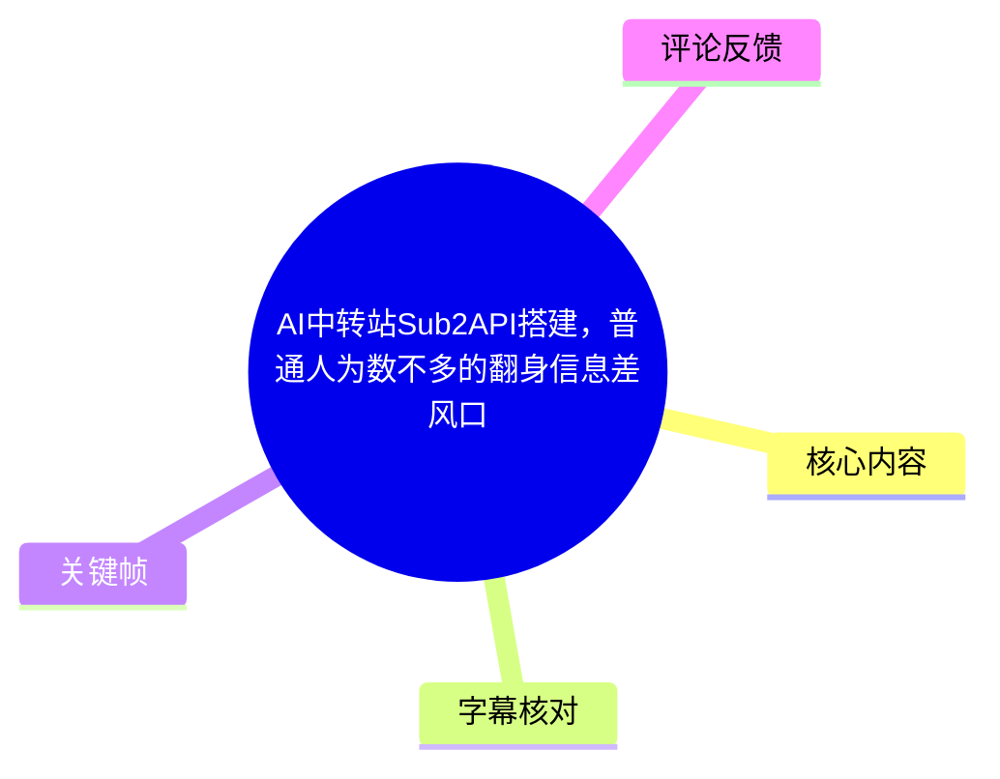
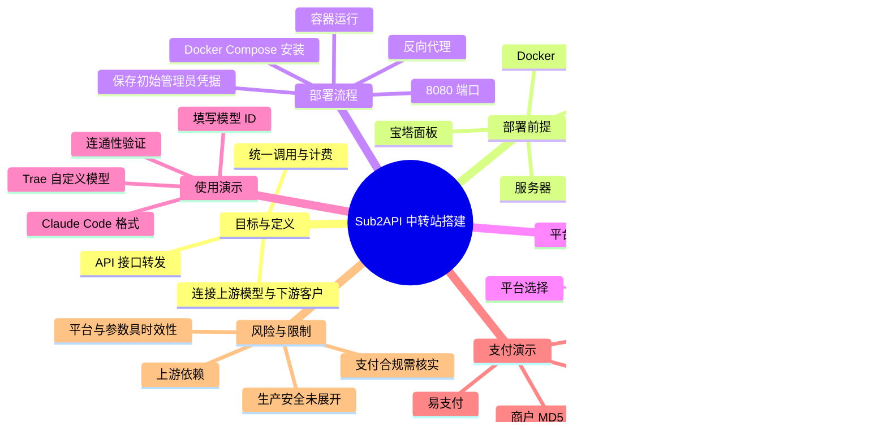
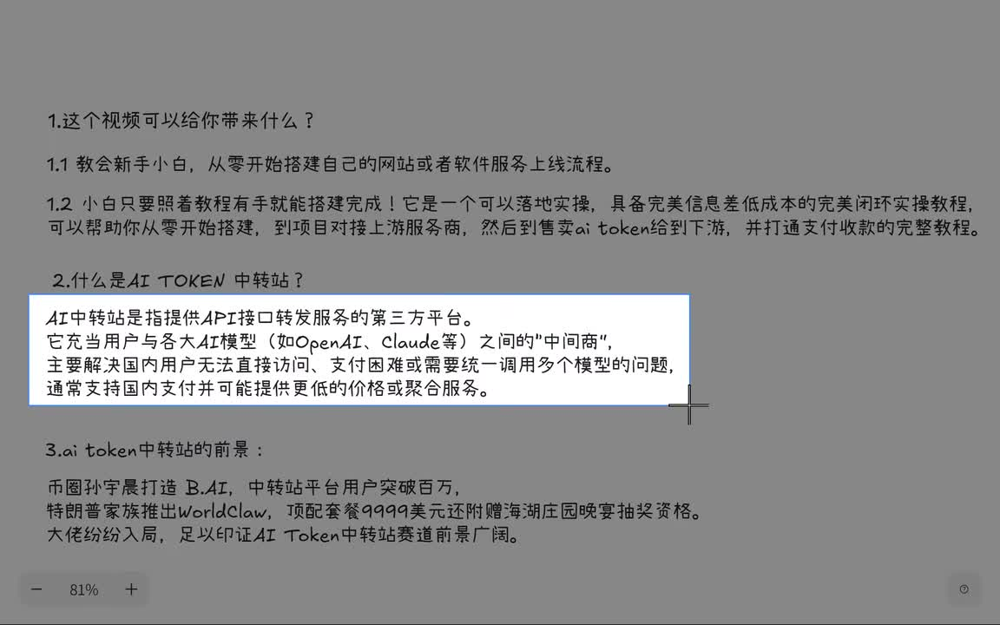
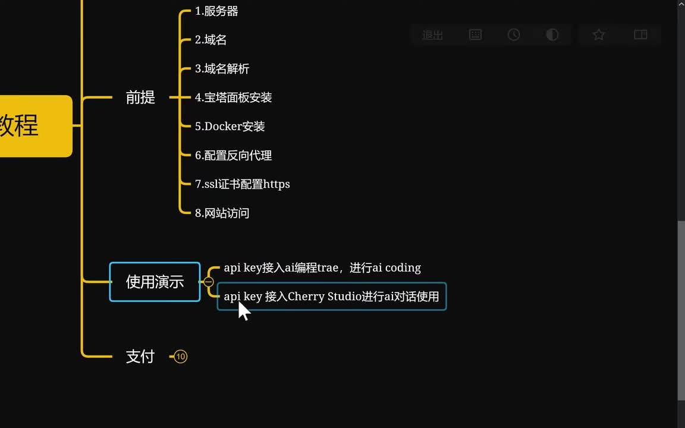
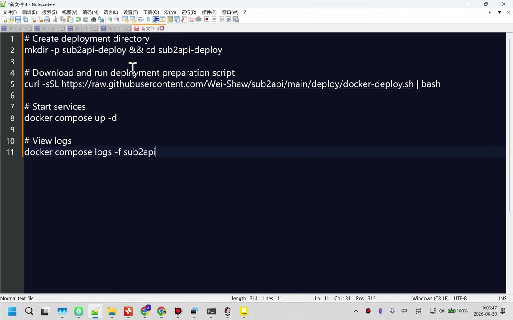
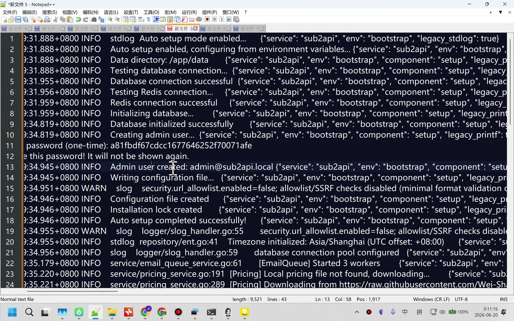

# AI中转站Sub2API搭建，普通人为数不多的翻身信息差风口

> 来源：[Bilibili 视频](https://www.bilibili.com/video/BV1d1Np6BEet)  
> UP 主：sfdota｜时长：19 分 37 秒｜合集：AIcode  
> 视频定位：以 Sub2API 为例，演示从服务器部署、上游模型接入、下游 API Key 分发，到充值支付回调的中转站搭建流程。

## 小结

视频将“AI Token 中转站”定义为提供 API 接口转发服务的第三方平台：它位于用户与 OpenAI、Claude 等模型服务之间，目标是解决访问、支付以及多模型统一调用等问题。UP 主将其包装为面向新手的低成本商业闭环，但“前景广阔”“信息差风口”等属于视频作者的市场判断，而非本视频能够验证的结论。

实操主线是：准备服务器、域名、域名解析、宝塔面板与 Docker；随后以 Docker Compose 安装 Sub2API，并通过二级域名反向代理至本机 `127.0.0.1:8080`，再配置 SSL 证书以 HTTPS 访问。首次启动日志中会生成一次性管理员密码和管理员账号，必须立即保存，并应在登录后更换初始凭据。

Sub2API 的核心配置关系可概括为三层：**分组**决定平台与费率倍率，**账号**对接上游服务商，**API 密钥**提供给下游客户调用。视频示例将一个上游的 Claude Code 接口地址与 API Key 填入账号，移除 Base URL 末尾的 `/v1`，同步到 176 个上游模型、绑定费率为 1.0 的分组，并测试模型连通性。

使用侧，视频将下游 API Key 填入名为 “Trae”（站内字幕误作 train / ASR 误作 Tray）的 AI 编程工具自定义模型配置中：选择 Claude Code 格式，填写请求地址、API Key 和模型 ID，最后通过一次“循环如何编写”的对话确认有正常响应。片头提到 Cherry Studio，但后续给出的实际完整演示仅覆盖 Trae，未见 Cherry Studio 的具体配置画面或结果。

支付侧演示 Sub2API 支持易支付、支付宝官方支付和微信支付；其中使用自建易支付服务商，填写 API 基础地址、商户 ID（PID）与商户 MD5 密钥（PK）。演示设置充值金额为 0.1 元，支付后账户余额从 9.27 变为 9.37，并在“我的订单”中出现成功记录。这只能证明演示环境回调成功，不代表任何支付方案的合规性、稳定性、费率或可持续可用性。

关键限制包括：视频没有展示服务器规格、域名/DNS 服务商、Docker Compose 完整配置文件、生产环境安全加固、备份、限流、审计、退款与异常支付处理；上游服务来自另一个第三方中转站，意味着稳定性、价格、模型权限和合规风险仍依赖上游。视频中提及的平台、模型数、支付支持项与开源项目热度均可能随版本变化，应在部署前以项目官方文档和实际后台为准。

## 思维导图





## 目录

- [背景、定义与视频主张](#背景定义与视频主张)
- [部署前提与整体流程](#部署前提与整体流程)
- [Docker Compose 安装与初始凭据](#docker-compose-安装与初始凭据)
- [反向代理、SSL 与首次登录](#反向代理ssl-与首次登录)
- [Sub2API 配置模型：分组、账号与密钥](#sub2api-配置模型分组账号与密钥)
- [对接上游 Claude Code 接口](#对接上游-claude-code-接口)
- [在 Trae 中使用下游 API Key](#在-trae-中使用下游-api-key)
- [易支付接入与充值回调验证](#易支付接入与充值回调验证)
- [限制、风险与时效性](#限制风险与时效性)
- [关键帧索引](#关键帧索引)
- [字幕比对](#字幕比对)
- [评论分析](#评论分析)
- [处理记录](#处理记录)

## 背景、定义与视频主张 [00:00:25](https://www.bilibili.com/video/BV1d1Np6BEet?t=25)

视频开头提出的目标，是让新手从零搭建网站或软件服务，并完成“对接上游服务商—向下游售卖 AI Token—打通支付收款”的流程。

UP 主对 AI Token 中转站的定义包含以下要点：

1. 它是提供 API 接口转发服务的第三方平台。
2. 它作为用户与多个 AI 模型服务之间的中间层。
3. 视频列举的使用问题包括：国内用户直接访问困难、支付困难、需要统一调用多个模型。
4. 视频称此类平台“通常支持国内支付”，且“可能提供更低价格的聚合服务”。

视频随后援引若干市场案例来支撑赛道前景，包括“B.AI 用户突破百万”以及 “Worldclaw 顶配套餐 9999 美元并附赠海湖庄园晚宴抽奖资格”等说法。上述案例均为视频陈述，素材未附可核验来源，不能据此直接推导行业规模、需求真实性或盈利能力。



> 图：画面直接展示视频对“AI 中转站”的定义、用途和市场前景判断，是区分“技术功能说明”与“作者商业判断”的关键依据。

UP 主自述具有 11 年全栈开发经验，涉及 Web、小程序、Flutter、Android 原生、WordPress、Java、PHP、Python 接口开发等领域，目前从事独立开发。该经历为作者自述，视频未提供外部证明材料。

## 部署前提与整体流程 [01:51](https://www.bilibili.com/video/BV1d1Np6BEet?t=111)

视频在介绍开源项目时，将 Sub2API 描述为“订阅共享商用网关”；还提到 6API、二级聚合网关和浏览器插件，但明确表示后两类内容留待后续视频讲解，因此本片的完整操作对象是 Sub2API。

部署前提被列为八项：

1. 服务器；
2. 域名；
3. 域名解析；
4. 安装宝塔面板；
5. 安装 Docker；
6. 配置反向代理；
7. 配置 SSL 证书；
8. 使网站可正常访问。

在网站能访问后，片头还预告了三项使用内容：API Key 接入 AI 编程工具进行 AI Coding、接入 Cherry Studio 做 AI 对话、以及接入支付。实际演示中，AI 编程工具使用的是 Trae；Cherry Studio 仅在预告中出现，未见后续完整实操。



> 图：该流程图集中展示了服务器、域名、Docker、反向代理、SSL 和网站访问等依赖关系，也显示片头预告了 AI 编程、Cherry Studio 与支付三个方向。

支付方面，视频称易支付可通过个人支付宝、微信收款码进行收款；部署思路是先部署源码，再用手机 APK 或电脑端监听支付消息回调。视频也称可接第三方支付；若有公司营业执照，可以直接申请微信和支付宝官方支付。这里仅是视频的操作性说明，不构成支付通道合规建议。

## Docker Compose 安装与初始凭据 [03:27](https://www.bilibili.com/video/BV1d1Np6BEet?t=207)

视频称 Sub2API 有三种安装方式，并选择 Docker Compose，理由是该方式被项目推荐。画面给出四条命令，核心内容如下：

```bash
# 创建部署目录并进入
mkdir -p sub2api-deploy && cd sub2api-deploy

# 下载并执行部署准备脚本
curl -sSL https://raw.githubusercontent.com/Wei-Shaw/sub2api/main/deploy/docker-deploy.sh | bash

# 启动服务
docker compose up -d

# 查看 sub2api 日志
docker compose logs -f sub2api
```



> 图：关键帧清晰展示了视频实际使用的四条部署命令，包含目录创建、远程脚本执行、服务启动和日志查看，适合作为操作复核依据。

视频的操作步骤为：

1. 将命令复制到文本编辑器；
2. 删除注释后复制命令；
3. 在宝塔面板的网站目录下创建一个专门存放 Docker 文件的目录；
4. 打开终端，粘贴并执行命令；
5. 等待镜像或服务下载、初始化；
6. 在日志中确认初始化成功；
7. 搜索 `password`，记录一次性管理员密码，并记录其下方显示的管理员账号。

日志画面可见下列关键信息：

- 数据库连接成功；
- Redis 连接成功；
- 数据库初始化成功；
- 创建管理员用户；
- `password (one-time)`，即密码只显示一次；
- 管理员账号显示为 `admin@sub2api.local`；
- 日志中还有 `security.url_allowlist.enabled=false; allowlist/SSRF checks disabled` 的警告。



> 图：画面显示初始化成功、数据库和 Redis 连接状态、一次性密码、管理员账号，以及 SSRF 白名单检查关闭的警告。它说明初始凭据必须立即保管，也提示默认安全设置不应被忽略。

### 安全注意事项

视频只演示了“记录密码、随后可更改”的流程，未展开生产安全设置。根据画面可见日志，至少应额外核查：

- 首次登录后是否立即修改管理员密码；
- 是否避免将日志、截图、录屏中的密码或 API Key 暴露给他人；
- `security.url_allowlist.enabled=false` 的默认警告是否适合实际部署场景；
- 是否限制管理端访问来源、启用 HTTPS、设置防火墙与备份；
- 对上游 URL 的输入是否可能造成服务端请求伪造（SSRF）风险。

这些是由日志信息引出的安全核查项，并非视频已完成展示的配置步骤。

## 反向代理、SSL 与首次登录 [05:32](https://www.bilibili.com/video/BV1d1Np6BEet?t=332)

视频在 Docker 容器页面中指出，Sub2API 相关容器共三个：数据库、Redis 与 Sub2API 服务本体；服务本体监听 **8080** 端口。

随后在宝塔面板中配置反向代理，视频的目标地址为：

```text
127.0.0.1:8080
```

操作逻辑为：

1. 创建或选择一个二级域名；
2. 在宝塔的“反向代理”中新增规则；
3. 将二级域名流量代理到本地 `127.0.0.1:8080`；
4. 视频作者称自己此前已完成泛域名解析；
5. 进入 SSL 页面，为当前站点部署证书；
6. 保存后通过域名访问站点。

视频没有提供具体域名、DNS 记录类型、证书颁发机构、续期策略或宝塔反向代理的完整字段。因此，只能确认其演示了“二级域名 → 本机 8080 端口 → SSL 部署”的链路，不能据此补全未展示的 DNS/HTTPS 配置细节。

首次进入 Sub2API 首页后，使用前述日志中记录的账号和密码登录。视频表示登录成功后可以更改密码；该动作在安全上应视为必要，而不是可选优化。

## Sub2API 配置模型：分组、账号与密钥 [08:02](https://www.bilibili.com/video/BV1d1Np6BEet?t=482)

视频的新手引导将功能概括为：

- 分组管理；
- 账号池；
- 密钥分发；
- 计费管理。

其中，视频后续将实际配置重点浓缩为三项：

| 配置项 | 视频中的角色 | 面向对象 |
| --- | --- | --- |
| 分组管理 | 设置平台、下游服务计费倍率 | 下游产品/用户套餐 |
| 账号配置 | 对接上游服务商的账户或 API 接口 | 上游 |
| API 密钥配置 | 创建提供给客户使用的 API Key | 下游 |

### 分组：平台与费率倍率 [08:50](https://www.bilibili.com/video/BV1d1Np6BEet?t=530)

视频演示创建测试分组，初始引导中已有“VIP 专线”和“免费试用”两个分组。创建时需要选择平台；视频称当时界面显示支持四个国外平台，但未在字幕中完整列出所有名称。

费率倍率的示例解释如下：

| 倍率 | 视频解释 | 计费含义 |
| --- | --- | --- |
| `1.0` | 原价/成本价 | 用户消耗 1 美元，扣除 1 美元 |
| `1.5` | 加价 | 用户消耗 1 美元，扣除 1.5 美元 |
| `2.0` | 两倍费率 | 用户消耗 1 美元，扣除 2 美元 |
| `0.8` | 补贴模式 | 平台按低于成本的比例收费，视频称为亏本模式 |

视频建议刚开始吸引用户时可设置 `1.0`，但这只是作者的运营建议。是否盈利还取决于上游实际价格、汇率、支付手续费、模型用量、退款、坏账、带宽和运维成本，视频未计算这些项目。

### 上游账号：优先级与分组归属 [10:06](https://www.bilibili.com/video/BV1d1Np6BEet?t=606)

添加账号时，视频说明：

- 账号可以命名；
- **数字越小，优先级越高**；
- 系统优先使用低数值账号；
- 每个账号必须至少勾选一个分组。

这表明平台可通过多个上游账号构成账号池，并用优先级控制选择顺序；但视频未演示故障切换、额度耗尽、并发分配、重试策略或不同账号间的负载均衡规则。

### 下游 API Key：分发与限制 [10:23](https://www.bilibili.com/video/BV1d1Np6BEet?t=623)

视频在账号配置完成后创建 API Key。示例 Key 名称为“my k1 测试”，并选择刚创建的测试分组。画面中没有启用 IP 限制和额度限制，随后直接创建。

这意味着视频演示的是最宽松的测试配置。若用于真实下游客户，是否应启用 IP 限制、额度限制、有效期、使用审计与异常告警，需要自行评估；视频没有给出生产策略。

## 对接上游 Claude Code 接口 [12:06](https://www.bilibili.com/video/BV1d1Np6BEet?t=726)

视频将完整的快速配置顺序明确为：

1. 创建分组；
2. 添加上游账号；
3. 创建下游 API 密钥。

示例分组名为 `cc test1`，平台选择为 Claude Code，费率使用默认的 `1.0`。

添加上游账号时选择 API Key 方式。视频称需要两个核心参数：

```text
Base URL
API Key
```

具体操作：

1. 在上游服务商文档中复制 API 地址和 API Key；
2. 回到 Sub2API 账号配置页；
3. 将 API 地址填入 Base URL；
4. **将 Base URL 末尾的 `/v1` 去掉**；
5. 粘贴上游 API Key；
6. 清除已有模型；
7. 执行“同步上游支持的模型”；
8. 视频当时同步到 **176 个上游模型**；
9. 删除不需要对下游开放的模型；
10. 将该账号绑定到此前创建的 `cc test1` 分组；
11. 点击创建；
12. 在“更多”中选择一个标注为 “4.6” 的模型进行测试，结果显示成功。

这里的“176 个模型”与测试使用的“4.6”模型均是视频演示当时界面的状态，不应视为 Sub2API 当前固定能力或任一上游服务商的承诺。

上游服务商在该演示中本身也是一个“第三方中转站”。因此，下游调用链实际可能是：

```text
下游客户端
  → 自建 Sub2API
    → 演示所用第三方上游中转站
      → 模型服务提供方
```

该多层转发结构增加了接口兼容、稳定性、数据处理、价格调整、账号封禁和责任边界的不确定性。视频没有展示上游授权来源、服务条款或数据处理约定。

## 在 Trae 中使用下游 API Key [15:01](https://www.bilibili.com/video/BV1d1Np6BEet?t=901)

视频实际演示的 AI 编程工具，站内字幕写作“TRA”，ASR 写作 “Tray”，结合视频语境应记为 **Trae**；这是基于字幕交叉校正的名称规范化，视频画面与字幕均未提供完整产品版本信息。

操作步骤如下：

1. 在 Sub2API 的“使用密钥”说明中，选择 Claude Code 的使用方法；
2. 复制 Sub2API 提供的 Base URL；
3. 复制刚创建的下游 API Key；
4. 打开 Trae；
5. 在右下角的内置模型区域向下滚动；
6. 选择使用自定义模型；
7. 点击添加模型；
8. 在自定义 API 格式中选择 Claude Code 格式；
9. 将复制的请求地址填入自定义请求地址；
10. 填写 API 密钥；
11. 填写模型 ID；
12. 添加模型；
13. 新建对话并选择该自定义模型；
14. 提问“这个循环如何编写”，确认模型能正常回答。

模型 ID 的获取方法，视频给出的是返回 Sub2API 账号管理页面，选择已测试成功的模型，并复制其“使用模型”字段到 Trae 的模型 ID。

视频只验证了单次问答能够返回内容，未展示流式响应、长上下文、工具调用、代码编辑写入、错误码处理或实际项目级编程效果。因此，结论应限定为：**演示环境下该自定义模型配置可产生一次正常文本回答。**

## 易支付接入与充值回调验证 [17:11](https://www.bilibili.com/video/BV1d1Np6BEet?t=1031)

视频在“系统设置 → 支付设置”中查看支付文档，并称当前支持：

- 易支付；
- 支付宝官方支付；
- 微信支付。

演示选择易支付，并为测试临时设置 **0.1 元**金额。视频明确提醒，实际线上金额应按自身情况填写。

### 易支付服务商参数配置 [17:46](https://www.bilibili.com/video/BV1d1Np6BEet?t=1066)

视频在“添加服务商”中填写自建易支付平台的商户参数：

| 字段 | 视频说明 |
| --- | --- |
| API 基础地址 | 从自建易支付平台复制接口地址 |
| PID | 商户 ID |
| PK | 商户 MD5 密钥 |
| 其他字段 | 视频示例中未填写 |

填写后保存，视频显示“易支付测试已经配置成功”。

请注意：商户 MD5 密钥属于高度敏感凭据，不应出现在公开截图、录屏、前端代码、客户端配置或版本控制仓库中。视频未展示回调签名验证、异步通知幂等处理、订单超时、退款、重复支付、风控和对账流程。

### 充值结果 [18:39](https://www.bilibili.com/video/BV1d1Np6BEet?t=1119)

视频的验证步骤为：

1. 进入“充值订阅”；
2. 当前账户余额显示为 **9.27**；
3. 选择微信支付；
4. 输入金额并确认支付；
5. 页面弹出二维码；
6. 扫码完成支付，视频口述微信收款 **0.1 元**；
7. 返回页面后余额由 **9.27** 变为 **9.37**；
8. 在“我的订单”中出现一笔刚才充值的成功记录。

因此，视频完成了“支付发起—扫码—余额变动—订单记录”的演示闭环。但它只是一笔测试订单，不足以证明支付通道可长期稳定使用，也不能替代对当地支付监管、平台规则、税务、消费者权益、数据保护和模型服务条款的核验。

## 限制、风险与时效性 [19:24](https://www.bilibili.com/video/BV1d1Np6BEet?t=1164)

### 视频已覆盖与未覆盖的边界

| 范围 | 视频实际展示 | 视频未展示或未验证 |
| --- | --- | --- |
| 基础部署 | Docker Compose、容器、8080 端口、反向代理、SSL | 服务器规格、系统版本、完整 Compose 配置、升级与回滚 |
| 初始安全 | 记录一次性密码、登录后可改密码 | 防火墙、管理员保护、SSRF 防护、审计、备份、监控 |
| 上游接入 | Base URL、API Key、模型同步、连通测试 | 上游合法授权、SLA、限额、故障转移、数据协议 |
| 下游分发 | 分组、费率、API Key | 用户体系、Key 回收、细粒度权限、滥用检测 |
| 客户端使用 | Trae 自定义模型与单轮问答 | Cherry Studio 实操、其他客户端兼容性、复杂调用 |
| 支付 | 易支付参数和 0.1 元充值回调 | 签名验真、幂等、退款、对账、合规与风控 |

### 需要特别谨慎对待的说法

- “普通人为数不多的翻身信息差风口”“前景广阔”是标题与作者观点，不是视频中的实证结论。
- 视频列举的商业案例及用户量未给出来源，不能直接作为投资、创业或采购依据。
- “支持国内支付”“更低价格”是视频对中转站常见能力的概述，实际可用性依赖地区、支付服务商、上游规则和项目版本。
- 上游模型列表、176 个模型数量、支付插件支持项、项目 Star 数与 UI 字段均具有版本时效性。
- 站内元数据的抓取时间为 2026-07-21；建议使用者在实际部署当天重新核对 Sub2API 官方仓库、部署脚本、发布说明与支付接口文档。

## 关键帧索引

| 关键帧 | 对应内容 | 选择价值 |
| --- | --- | --- |
|  | `frames/frame-001.jpg` | 直观呈现视频对 AI 中转站定义、用途与前景的原始表述。 |
|  | `frames/frame-002.jpg` | 汇总部署前提、使用演示和支付模块，有助于建立全文结构。 |
|  | `frames/frame-003.jpg` | 可核对 Docker Compose 部署所用命令，避免仅依据口述转写。 |
|  | `frames/frame-004.jpg` | 展示数据库、Redis、管理员账号、一次性密码与安全警告，是部署后检查的重要证据。 |

其余关键帧路径虽可用，但本素材中已提供的四张画面足以覆盖概念说明、流程总览、命令执行与初始化安全信息；未将未见具体内容的帧强行纳入正文，以避免超出素材作推断。

## 字幕比对

| 字幕来源 | 完整性 | 专有名词 | 时间轴 | 主要问题 |
| --- | --- | --- | --- | --- |
| Bilibili 站内字幕 `p01-ai-zh.srt` | 高，覆盖 00:00 至 19:35 | 有较多错别字和音译误识别，但整体语义可恢复 | 高，分段起止时间与视频全程一致 | 将 Sub2API、Docker、Trae、Claude Code、宝塔等多处写错；个别句子断裂 |
| 本次 ASR（medium） | 较高，语音覆盖率 84.05%，共 76 段 | 专有名词错误更明显 | 时间戳存在整体错位问题：首段从 00:30 开始，而站内字幕从 00:00 开始 | 将 Sub2API 识别为 Savage API/SAPR API，将宝塔识别为保桃，将 Trae 识别为 Tray；部分文本严重失真 |

### 最终字幕选择

最终以**站内字幕的时间轴**为正文链接依据，并结合本次 ASR 与关键帧修正专有名词和操作含义。

原因如下：

1. 站内 SRT 提供了从 `00:00:00,040` 至 `00:19:35,510` 的连续时间分段，可直接对应视频位置。
2. 本次 ASR 已被检查：其诊断显示有正常音频识别结果，`language=zh`、置信度约 `0.9976`，且**未标记 `noAudioStream=true`**；因此不能将其视为无音轨视频。
3. 但 ASR 的首段从 `00:00:30,040` 起，明显与站内字幕及视频片头内容发生约 30 秒量级的时序冲突，不适合作为本篇章节时间轴的首选来源。
4. ASR 与站内字幕对关键流程的语义总体一致，可作为交叉核对材料；专有名词则优先以关键帧中的命令、日志和上下文进行校正。

### 重要校正

| 原始识别形式 | 本文采用 | 校正依据 |
| --- | --- | --- |
| Savage API / SAPR API / 中软站 | Sub2API / 中转站 | 视频标题、站内字幕上下文、部署命令与日志画面 |
| Vocal Compose / Docker 安裱 | Docker Compose | 关键帧中的 `docker compose up -d` |
| 保桃面板 | 宝塔面板 | 站内字幕语境及界面操作描述 |
| Cloud Code / Clubcode | Claude Code | 站内字幕、模型格式语境 |
| TRA / train / Tray | Trae | 站内字幕、ASR 及“AI 编程工具”上下文交叉判断 |
| AddMeUser | `admin@sub2api.local` | 初始化日志关键帧中的可见文本 |
| HTTPSSSL 赠书 | HTTPS/SSL 证书 | 站内字幕语义与操作流程 |

## 评论分析

仅处理可获取的热评前三条。三条评论点赞数均为 0，且均非对视频技术流程的实质验证。

1. **ys科技疯**
   - 内容：发布一个带推广参数的注册链接，并标注“0.055 倍率”。
   - 补充信息：声称存在低倍率 API 服务。
   - 可信度与风险：这是外部推广链接与价格宣传，视频素材未验证其服务稳定性、模型来源、计费规则或安全性；不应将其视为视频教程的官方配套资源。

2. **乐下心空**
   - 内容：发布个人新站注册链接，宣传 GPT、Plus、Pro 等不同倍率或价格，并招揽商务端口合作。
   - 补充信息：评论者提供了其自行声明的价格/倍率信息。
   - 可信度与风险：该评论具有明显营销性质，且包含大量宣传性文本。关于“官转”“稳定”“特价”等描述没有可验证证据，不应被当作已证实的服务质量、官方授权或合规结论。

3. **QT008**
   - 内容：推荐通过 QQ 群寻找项目队友、接外包，并给出群号。
   - 补充信息：反映评论者对协作和接单渠道的个人经验。
   - 可信度与风险：该内容与 Sub2API 技术搭建没有直接验证关系。群内人员、项目机会和安全性无法由本素材确认，加入外部社群前应自行辨别招募、诈骗和隐私风险。

## 处理记录

- Worker ID：worker-mrj0wjed-b0c290ad
- 模型：gpt-5.6-terra
- 使用的素材与工具结果：Bilibili 元数据、站内字幕 `p01-ai-zh.srt`、本次 ASR 结果 `asr/asr-result.json` 与 SRT、热评前三条、已提供关键帧。
- 字幕选择：以站内字幕作为章节时间轴主依据；已检查本次 ASR。ASR 存在专有名词误识别和约 30 秒起始时间错位，故仅用于语义交叉验证与诊断，不作为主时间轴。
- 音频诊断：ASR 有正常中文语音识别结果，未出现 `noAudioStream=true`；并非无音轨源视频。
- 关键帧依据：选择 `frame-001` 至 `frame-004`，分别对应概念与前景、全流程图、部署命令、启动日志及安全提示；其画面信息可直接支撑正文关键事实。
- 缓存清理：未提供可执行的缓存清理记录或结果；本文不虚构清理状态。
- 未解决问题：
  - 未提供 Sub2API 完整 Docker Compose 文件、服务器配置、域名/DNS 配置与项目版本号；
  - 视频预告 Cherry Studio，但素材未展示其完整接入步骤；
  - 上游中转站的授权、价格、稳定性与数据处理规则未验证；
  - 支付方案的合规、回调安全、退款与对账能力未展示；
  - 视频中的市场案例、用户量与“风口”判断均缺少视频内可核验来源。
