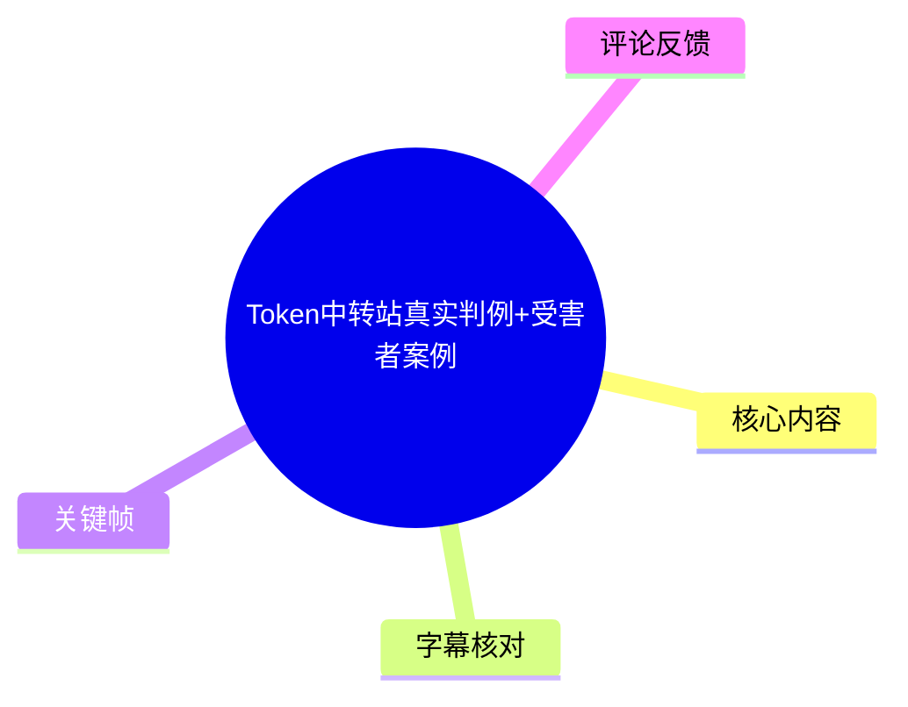
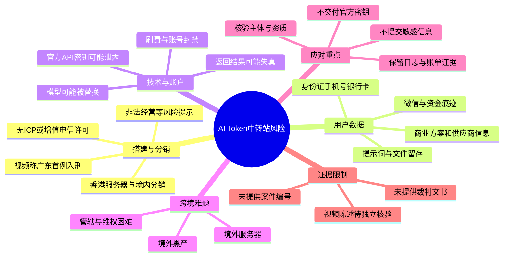
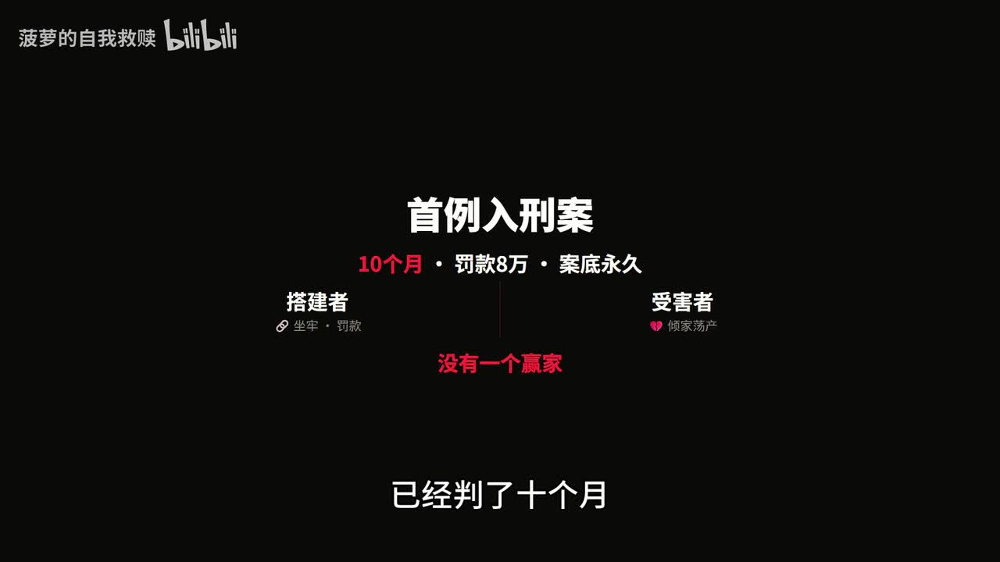
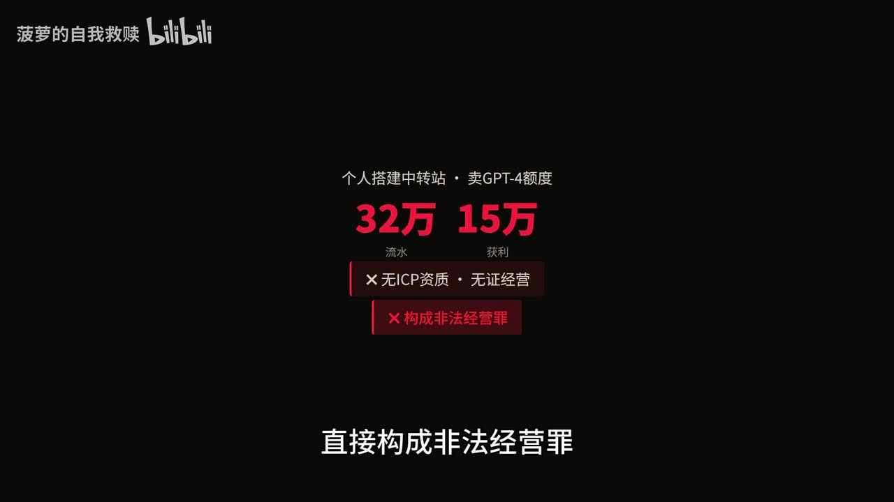
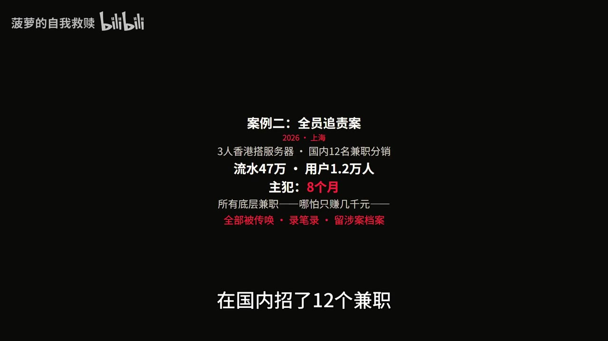
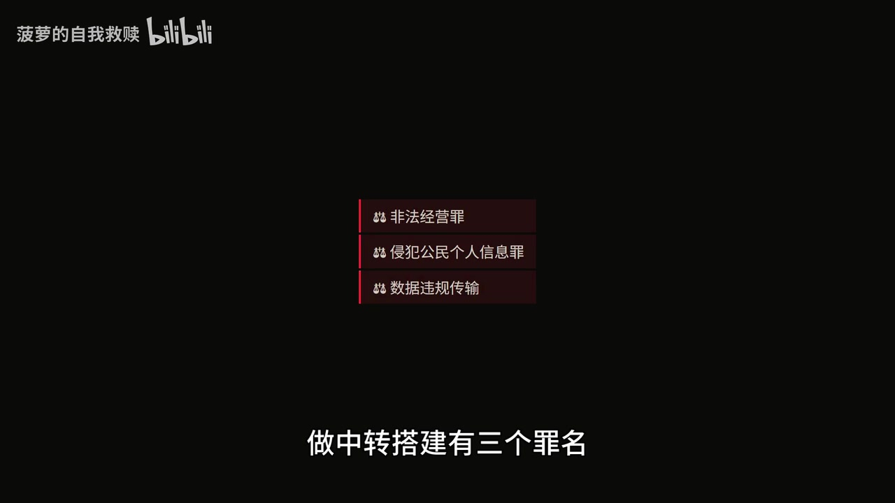

# Token中转站真实判例+受害者案例

> 来源：[Bilibili 视频](https://www.bilibili.com/video/BV1c8Lu6BEdj)  
> UP 主：菠萝的自我救赎｜视频时长：03:27｜合集：AIcode  
> **重要提示**：本视频以“真实判例”“真实案例”表述多项刑事、财产与数据泄露事件，但素材未提供案件编号、裁判文书、警方通报、企业公告或媒体来源链接。下文会准确记录视频的说法，但不将其自动视作已独立核验的法律事实。

## 小结

视频聚焦所谓 AI Token 中转站／中转服务的风险，核心观点是：低价转售大模型额度、代搭中转站或把敏感任务交给不明中转服务，可能同时暴露经营合规、个人信息、商业机密、API 密钥与跨境维权风险。

在搭建者侧，视频列举两组被称为“判例”的情形：一组涉及个人搭建中转站、销售 GPT-4 额度，画面与口述给出“流水 32 万元、获利 15 万元、判刑 10 个月、罚款 8 万元、违法所得没收”等数字；另一组称 3 人在香港部署服务器、在中国境内招募 12 名兼职分销，流水 47 万元、用户 1.2 万人，主犯获刑 8 个月，兼职人员被传唤并留下涉案档案。由于缺少可供核验的案号与原始文书，这些应视为**视频的单方陈述**。

在用户侧，视频用商业数据泄露、账户与资金被盗、个人资料遭精准诈骗、科研数据被劣质模型或虚假结果污染、官方 API Key 被倒卖刷费等故事说明风险。其重点不在“服务是否好用”，而是中转环节有能力接触用户提示词、上传文件、密钥和返回结果；一旦后台留存、转发、替换模型或被黑产控制，用户可能难以追责。

视频最后给出五条强烈警示，包括“没有合规的 AI Token 中转站”“用户数据百分百裸奔”等绝对化结论。这些是作者立场，不应替代逐项的资质审查、供应商安全评估、合同审查和专业法律意见。尤其“百分百”“所有”等绝对表述，素材中未给出证明范围。

适合阅读者包括：正在使用低价 API 中转服务的个人、跨境电商和出境频繁人群、处理个人信息或商业资料的团队，以及考虑代搭／分销模型额度的人。可迁移的实际经验是：**不要把中转服务只当作价格工具，而应按一个可读取和处理数据、可产生费用、可能跨境的第三方供应商来评估。**

视频的时效性较强：其叙事涉及“2025 年广东首例”与“2026 年上海”案例，且平台资质、模型服务条款、跨境数据规则和案件信息可能变化。截至本素材范围，未附外部可核验材料，不能据此确认案件细节、定性或数字。

## 思维导图

## 目录

- [视频定位、术语与证据边界](#视频定位术语与证据边界)
- [搭建者案例：经营、分销与涉嫌罪名](#搭建者案例经营分销与涉嫌罪名)
- [用户案例：数据、资金、身份与科研风险](#用户案例数据资金身份与科研风险)
- [从视频案例提炼的排查与使用步骤](#从视频案例提炼的排查与使用步骤)
- [关键参数与风险清单](#关键参数与风险清单)
- [结论、限制与时效性](#结论限制与时效性)
- [字幕比对](#字幕比对)
- [评论分析](#评论分析)
- [处理记录](#处理记录)

## 视频定位、术语与证据边界 [00:35](https://www.bilibili.com/video/BV1c8Lu6BEdj?t=35)

本片的可识别语音从 **00:35.720** 开始，前约 35 秒没有 ASR 语音文本。视频主题是“Token 中转站真实判例+受害者案例”，但视频没有对“中转站”作技术定义。结合其叙述语境，指向的应是：第三方以自身或上游的模型访问能力，向用户转售额度、提供兼容 API 接口，或代理用户请求至模型服务商的服务形态。

这类架构的关键不只是“请求从哪里发出”，而是中间服务理论上可能接触到：

- 用户输入的提示词、文件和上下文；
- 返回的模型内容；
- 用户账户标识、IP、设备或调用日志；
- 用户自行提交的上游官方 API Key；
- 用量、计费和支付相关信息。

视频将风险集中表述为三层：

1. **经营／分销风险**：搭建、售卖额度、招兼职分销等行为可能触及监管与刑事风险；
2. **数据与账户风险**：中转后台可能留存、泄露或滥用对话、业务资料和密钥；
3. **跨境救济风险**：服务器、经营主体或犯罪人员处在境外时，追责、立案和追回资金可能更困难。

> 本文中的“可能”“应当核验”是风险管理表述；视频中的案件事实、罪名和金额均没有原始司法材料支撑，不能仅凭本片认定某一服务或某一行为必然违法。

## 搭建者案例：经营、分销与涉嫌罪名 [00:35](https://www.bilibili.com/video/BV1c8Lu6BEdj?t=35)

### 案例一：视频所称“广东首例入刑案” [00:35](https://www.bilibili.com/video/BV1c8Lu6BEdj?t=35)

视频开头称，2025 年广东出现“首例 AI Token 中转非法经营案”，并强调“搭建者坐牢、用户倾家荡产、没有一个赢家”。其口述与画面列出的案件要素为：

| 视频列举事项 | 视频所称内容 |
| --- | --- |
| 行为 | 个人在中国境内搭建中转站，销售 GPT-4 额度 |
| 流水 | 32 万元 |
| 获利 | 15 万元 |
| 资质问题 | “无 ICP 资质、无增值电信业务许可” |
| 视频所称定性 | 非法经营罪 |
| 刑罚 | 有期徒刑 10 个月 |
| 罚金 | 8 万元 |
| 财产处理 | 全部所得没收 |
| 加重情节 | 后台私自留存 12 万条用户隐私对话 |
| 视频所称叠加罪名 | 侵犯公民个人信息罪 |

> 图：画面集中呈现“首例入刑案”“10 个月”“罚款 8 万”“案底永久”等视频主张，适合用于定位该片的警示基调；但图中文字本身不是裁判文书或官方通报。

> 图：该帧将“流水 32 万”“获利 15 万”“无 ICP 资质／无证经营”与“构成非法经营罪”并置，是理解视频论证链条的关键视觉证据；它反映的是作者的归纳，而非对法律构成要件的完整证明。

这里需要严格区分三个层次：

- **视频陈述**：上述金额、刑期、罚金、对话数量和罪名均来自视频；
- **画面可见信息**：画面确实展示了“32 万”“15 万”“无 ICP 资质”“无证经营”等文字；
- **无法由素材确认之处**：案件编号、审判法院、判决日期、适用的具体法条、是否一审生效、留存数据的性质及数量计算口径，均未提供。

因此，不能从这段视频直接推出“未持 ICP 资质即当然构成非法经营罪”或“所有中转站均符合该案情”。具体法律结论取决于实际业务模式、主体资质、服务内容、数据处理方式、获利规模及司法机关认定。

### 案例二：香港服务器与中国境内兼职分销 [01:00](https://www.bilibili.com/video/BV1c8Lu6BEdj?t=60)

视频接着称，2026 年上海有 3 人在香港搭建服务器、在中国境内招募 12 名兼职人员分销，流水为 47 万元、用户为 1.2 万人；主犯判刑 8 个月，底层兼职即使只赚数千元也被传唤、做笔录并留下涉案档案。

> 图：该帧明确展示“2026·上海”“3 人香港搭服务器”“国内 12 名兼职分销”“流水 47 万”“用户 1.2 万人”“主犯 8 个月”等要素，便于对照口述内容并识别该案例涉及跨境基础设施与分销网络。

视频随后把搭建者风险概括为三项：“非法经营罪、侵犯公民个人信息罪、数据违规传输”。

> 图：画面以列表形式给出“非法经营罪、侵犯公民个人信息罪、数据违规传输”，直观呈现作者的归类；其中“数据违规传输”在画面中是风险标签，视频未进一步说明对应何种具体违法类型、法律依据或案件事实。

本段可提炼出的经验不是“境外部署能够规避责任”，恰恰相反，视频意在提示：服务器位置、招募分销人员的位置和用户所在地区不同，不会自动消除合规、刑事或数据处理责任。不过，视频没有提供该案的任何公开编号或文书，因而“全员追责”“留下涉案档案”等表述同样需要进一步核查。

## 用户案例：数据、资金、身份与科研风险 [01:00](https://www.bilibili.com/video/BV1c8Lu6BEdj?t=60)

### 商业资料泄露与跨境维权困境 [01:00](https://www.bilibili.com/video/BV1c8Lu6BEdj?t=60)

视频称，深圳一家跨境电商公司长期通过低价中转站处理产品方案和供应商清单；中转站后台留存并泄露核心商业数据后，竞品针对性窃取信息，新产品被抄袭、核心供应链被挖走，直接亏损 280 万元，项目作废。

视频所说的维权难点是：服务器和主体在境外，因而在中国境内“无法立案”。这一点应谨慎理解：跨境案件能否受理、由谁管辖，取决于案件性质、犯罪地／结果地、证据与合作机制等诸多因素，不能用该视频的单一叙述推导为“境外服务器就必然无法立案”。

对团队而言，这个故事的技术启示明确：产品规划、报价、供应商、客户名单、源代码、投标材料及未公开研究资料，均不应因为“只是文本提示词”而降低密级；它们一旦进入中转 API，就可能进入供应商日志、监控系统、备份或后续数据处理链路。

### 账户接管与境外资金盗转 [01:24](https://www.bilibili.com/video/BV1c8Lu6BEdj?t=84)

视频还称，另一名跨境电商从业者长期使用中转服务，手机号、隐私微信数据与资金痕迹被爬取；当事人飞往菲律宾途中，黑产利用“全套信息”破解微信并远程转走 30 多万元。视频称涉案人员在境外，内地称案发地在境外、菲律宾称无管辖权，最终损失未追回。

该案例的可迁移警示是账户安全，而不应把“使用中转站”简单等同于所有账户失窃的充分原因。视频没有展示攻击链路，例如是否存在钓鱼、SIM 卡风险、终端感染、弱口令、验证码泄露、社工攻击或密钥外泄。因此，视频仅能证明其**声称存在关联**，不能从素材确认因果链。

应特别避免向不可信服务提交以下内容：

- 账户密码、短信验证码、Cookie、会话令牌；
- 钱包助记词、私钥、支付凭据；
- 身份证件、银行卡号与完整简历；
- 含客户、供应商或员工个人信息的表格；
- 用于访问官方模型平台的长期有效 API Key。

### 个人资料诈骗 [01:48](https://www.bilibili.com/video/BV1c8Lu6BEdj?t=108)

视频称，北京一位从业者使用中转站写简历并填写个人资料，身份证、手机号、银行卡信息泄露，后遭精准诈骗 12 万元，征信出现不良记录，进而影响求职和贷款。

从安全操作角度，写简历、润色文案等任务应采用“最小必要信息”原则：把姓名、证件号码、手机号码、住址、银行卡号、公司名称、客户名称等替换为占位符；如确需处理真实材料，也应优先使用已完成组织审查、数据协议和权限管理的正式服务。

### 科研结果失真与 API Key 刷费 [02:12](https://www.bilibili.com/video/BV1c8Lu6BEdj?t=132)

视频在最后一组案例中提出两类技术风险：

1. 某高校实验室通过低价中转站做“顶级会议论文实验”，中转站被指“偷换劣质模型、返回虚假数据”，导致上百篇实验数据无法复现、十几万元科研经费浪费、科研进度断层；
2. 有用户相信“无限额度套餐”，将官方 API 密钥提交给中转站，视频称密钥被倒卖刷费，产生“百万计人民币账单”，账号被永久封禁且无人赔付。

视频中前后表述为“五个真实案例”，但按叙事单元可辨认出至少以下六项：两项搭建／分销案例、商业泄密、资金盗转、个人资料诈骗、科研／API Key 风险。其中科研实验和密钥刷费也可能被视频合并为一个大类。素材未解释计数方法，这是内容内部存在的不一致。

这两类风险尤其值得用技术措施控制：

- **模型一致性**：保存模型名称、版本、请求参数、时间、响应哈希、原始输出与实验环境；对关键实验进行抽样复跑和交叉验证，避免仅依赖中转服务声称的模型标识。
- **密钥最小权限**：不要把主账号或长期高额度 Key 交给不明第三方；为不同项目创建隔离密钥，设置预算、限速、来源限制与告警；一旦怀疑泄露，立即撤销并轮换。

## 从视频案例提炼的排查与使用步骤 [02:36](https://www.bilibili.com/video/BV1c8Lu6BEdj?t=156)

> 本节是根据视频风险情境整理的**防护性流程**，不是视频演示过的具体操作，也不构成法律意见。视频本身没有提供中转站搭建、购买或规避监管的技术步骤。

### 1. 先划分任务数据等级

在调用任何第三方模型接口前，区分任务是否包含：

- 个人信息：身份证号、手机号、银行卡、履历、员工或客户信息；
- 商业秘密：产品路线图、报价、供应商、合同、源代码、未公开经营数据；
- 科研与知识产权材料：未发表论文、实验数据、专利内容；
- 账户凭据：API Key、访问令牌、Cookie、验证码、密码或私钥。

一旦属于上述类别，应避免投递到主体、数据处理方式和权限边界不清楚的中转服务。

### 2. 核验服务主体与数据处理边界

视频反复强调资质与境外主体风险。实际评估时，至少应取得或核对：

1. 服务提供方的明确主体名称、联系方式、服务协议与隐私政策；
2. 数据是否记录、保留多久、是否用于训练、是否共享给上游或其他第三方；
3. 服务端、日志、备份及子处理者的大致地域与处理安排；
4. 是否有故障、泄露、滥用、争议处理与退款机制；
5. API 的实际模型、计费规则、限额规则是否可审计。

无法回答这些基础问题时，不能仅以低价、无限额度或“兼容官方接口”作为可信依据。

### 3. 对敏感输入做脱敏与最小化

将真实信息替换为占位符，例如：

- `客户A`、`供应商B`、`项目X`；
- `身份证号：已脱敏`；
- `订单金额：区间值`；
- `API_KEY=<不提供>`。

处理完成后，再在本地或受控系统中回填。这样不能消除全部风险，但可以减少中转服务接触到可直接利用数据的范围。

### 4. 不共享官方主密钥，并建立费用护栏

针对视频所称“API Key 被倒卖刷费”情形，可采用以下顺序：

1. 不在聊天框、表单、工单或第三方后台提交主密钥；
2. 按项目、环境、人员创建隔离凭据；
3. 设置可承受的预算上限、日／月用量阈值和异常告警；
4. 定期检查调用来源、模型、Token 用量和账单；
5. 发现异常时先撤销相关 Key，再轮换凭据、保全日志并联系官方平台。

### 5. 为可复现实验保留独立证据链

针对视频所称“模型偷换、数据失真”风险，科研或生产评测不应只保存最终结论。应留存：

| 应保留内容 | 用途 |
| --- | --- |
| 模型标识与版本 | 判断是否发生模型变化 |
| 请求体与关键参数 | 支持复跑与审计 |
| 调用时间、响应原文与哈希 | 识别响应是否被篡改或不一致 |
| 实验数据版本与随机种子 | 支持结果复现 |
| 账单、日志与服务协议快照 | 争议发生时保全证据 |

### 6. 出现疑似泄露或异常扣费时的处置顺序

- 立即停止向可疑端点发送新数据；
- 撤销可疑 API Key、令牌和登录会话，修改关联账户密码；
- 保存账单、调用日志、邮件、聊天记录、网页协议截图和时间线；
- 通知受影响的组织安全、法务或财务人员；
- 对涉及资金、身份信息或账户控制的事件，尽快联系相应平台、支付机构和执法／监管渠道；
- 跨境情形尤其需要保留完整时间、IP、账户、资金流和服务主体信息，以便后续咨询专业人士。

## 关键参数与风险清单 [03:00](https://www.bilibili.com/video/BV1c8Lu6BEdj?t=180)

### 视频中出现的量化信息

以下数字均为视频口述或画面内容，未获素材内外部文书核验：

| 时间段 | 视频所称事项 | 数字／结果 |
| --- | --- | --- |
| 00:35—01:00 | 个人中转站卖 GPT-4 额度 | 流水 32 万元；获利 15 万元 |
| 00:35—01:00 | 视频所称刑罚与数据留存 | 判刑 10 个月；罚款 8 万元；留存 12 万条隐私对话 |
| 01:00—01:24 | 香港服务器与境内分销 | 3 人；12 名兼职；流水 47 万元；用户 1.2 万人；主犯 8 个月 |
| 01:00—01:24 | 跨境电商商业损失 | 直接亏损 280 万元 |
| 01:24—01:48 | 资金盗转 | 30 多万元 |
| 01:48—02:12 | 精准诈骗 | 12 万元 |
| 02:12—02:36 | 科研与 API Key 风险 | 上百篇实验数据无法复现；十几万元科研经费；“百万计人民币账单” |

### 作者的五条结论及边界

视频在结尾提出五句“实话”：

1. “没有合规的 AI Token 中转站，所有中转服务是灰色违法服务”；
2. “做代理、做搭建，轻则罚款留案底，重则坐牢”；
3. 用户面临的不是好不好用，而是“百分百数据裸奔”；
4. 跨境从业者、电商、经常出境者是黑产高优先级对象；
5. 境外出事会形成司法管辖真空，受骗被盗等于“彻底打水漂”。

这些结论的风险提醒价值在于强调低价服务背后的数据、费用和救济成本；但其中“没有”“所有”“百分百”“等于”等措辞超出了素材可证明范围。合规性与责任认定应以服务主体、业务模式、资质、数据流、适用法律、合同与实际行为为依据，不能以视频口号一概而论。

## 结论、限制与时效性 [03:25](https://www.bilibili.com/video/BV1c8Lu6BEdj?t=205)

视频最有价值的部分，是将中转站风险从“省钱与否”扩展到了完整链条：

- 对搭建或分销者：经营模式、资质、数据留存和跨境部署都可能引发合规问题；
- 对普通用户：提示词与文件不是无害文本，可能包含可被利用的个人、商业或科研信息；
- 对技术用户：把官方 API Key 交给第三方，可能使费用控制和账号安全失去边界；
- 对跨境人群：出现账户、资金或数据事件后，证据、主体与管辖问题会提升维权成本。

但本片的事实基础存在明显限制：没有案件编号、判决书、官方公告、新闻出处或可供复核的技术取证材料。因此，所有具体案情、金额、罪名、刑期、数据量与损失数字都应标记为“视频称”，而非已证实事实。

此外，视频发布日期对应 2026 年，所述 2025—2026 年案例、平台规则、模型产品、跨境数据要求和执法实践都可能在后续变化。若读者需要据此作采购、产品上线、跨境业务或法律决策，应补充查验官方政策、裁判文书、供应商合同与专业意见。

## 字幕比对

| 字幕来源 | 完整性 | 专有名词 | 时间轴 | 主要问题 |
| --- | --- | --- | --- | --- |
| Bilibili 站内字幕 | 未提供可用字幕 | 无法评估 | 无法使用 | 素材记录显示字幕工具报 `Invalid URL`，未获得站内字幕文件 |
| 本次 ASR 字幕 | 覆盖 00:35.720—03:25.640，语音覆盖约 169.92 秒／总长约 206.31 秒 | 较差，多个词存在明显误识别 | 可用，提供 9 个真实 SRT 时间段 | 开头约 35.72 秒无 ASR 文本；“AI”“Token”“中转站”“GPT-4”“ICP”等被多次识别错误；部分长句缺少断句 |

### 最终字幕选择与校正原则

最终采用**本次 ASR 的真实 SRT 时间轴**作为章节链接依据；站内字幕不可用，无法进行逐句对照。ASR 诊断显示存在音频并完成识别，`noAudioStream` 未标记为 `true`，因此不能将无站内字幕视为无音轨或工具失败。

结合标题、标签、上下文与关键帧，进行了以下有限校正：

| ASR 原文或近似误识别 | 正文采用写法 | 校正依据 |
| --- | --- | --- |
| `AAI`、`AI Token 中轢站`、`中软站`、`中轢站` | AI Token 中转站／中转服务 | 标题、标签“中转站”“token”及上下文 |
| `GPT次恶度` | GPT-4 额度 | 关键帧文字“卖GPT-4额度” |
| `非法禁营罪` | 非法经营罪 | ASR 上下文及关键帧可见文字 |
| `监制分销`、`监职` | 兼职分销／兼职人员 | 关键帧写有“国内12名兼职分销”“所有底层兼职” |
| `核心商业数损`、`新产体` | 核心商业数据、新产品 | 依据句义作最小化文字修正 |
| `菲力宾` | 菲律宾 | 常用地名校正 |
| `刷料` | 刷费 | 结合“账单”“账号永久封禁”语境校正 |

未能通过关键帧或素材可靠确认的专名、法律细节与因果关系，均未擅自补全。

## 评论分析

仅处理可获取的热评前三条；评论是用户观点，不构成案件事实或法律意见。

1. **bili_43608269354（7 赞）**  
   评论认为“非法经营”属于“口袋罪”，并提出也可能涉及非法控制或获取计算机信息相关问题。该评论反映出观众对视频所列罪名的法律适用存疑，也提示不能把视频的罪名归纳直接当作结论。评论没有给出法条、案号或案情证据，不能据此确认更准确的定性。

2. **tallien（6 赞）**  
   评论要求 UP 主公布“案件编号和网页通告”。这与本素材的主要证据限制高度一致：视频没有展示可检索的裁判文书编号、法院名称或公告来源。该评论没有补充案件材料，但提出了合理的核验要求。

3. **你永远的Q爸爸（4 赞）**  
   评论以调侃方式称“请给我 5000 万，我发毒誓再也不用便宜 ai 了”。其表达的是低价 AI 服务的现实吸引力与风险警示之间的张力，并未提供新的事实信息，也不宜作严肃法律或安全结论解读。

## 处理记录

- Worker ID：`worker-mrj0wbly-5dc4e50c`
- 模型：`gpt-5.6-terra`
- 使用素材／工具结果：视频元数据、关键帧清单与画面、ASR SRT、ASR 诊断、热评 JSON；ASR 模型为 `medium`，语言识别为中文，运行设备为 CUDA，计算类型为 float16。
- 字幕选择：站内字幕未提供可用文件，且素材记录有 `Invalid URL` 警告；已检查本次 ASR，采用其 9 个带真实起止时间的 SRT 分段作为时间轴基础，并对可由标题、关键帧和语境确认的误识别作最小化修正。
- 音轨判断：ASR 成功识别出 00:35.720—03:25.640 的语音；诊断中未出现 `noAudioStream=true`，故按“存在音轨”处理。
- 关键帧选择依据：选用 `frame-001.jpg` 至 `frame-004.jpg`，因为其画面分别直接呈现首例入刑概览、32 万／15 万及资质主张、香港服务器与兼职分销数字、三类风险标签；这些帧可核对视频自身的文本主张，但不能替代外部证据。
- 评论范围：仅使用可获取热评前三条，未扩展至更多评论。
- 缓存清理：提供的素材中没有缓存清理日志或执行结果，无法确认是否已清理；不将其虚构为已完成。
- 未解决问题：缺少站内字幕；缺少案件编号、裁判文书、官方公告及新闻来源；无法独立验证视频所称案件、罪名、金额、刑期、数据规模、损失和跨境管辖结论。
