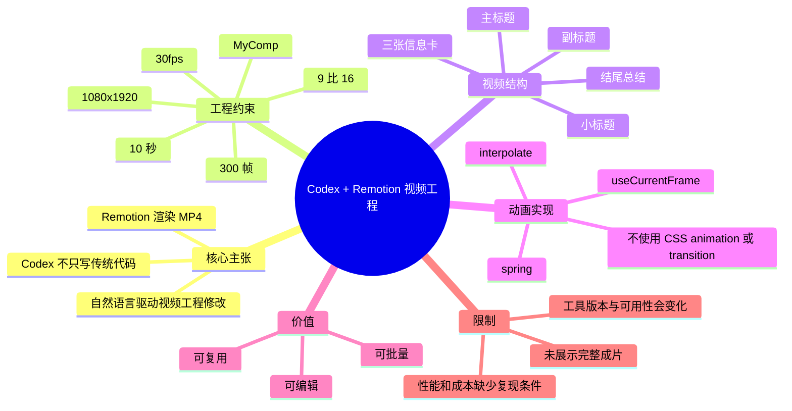
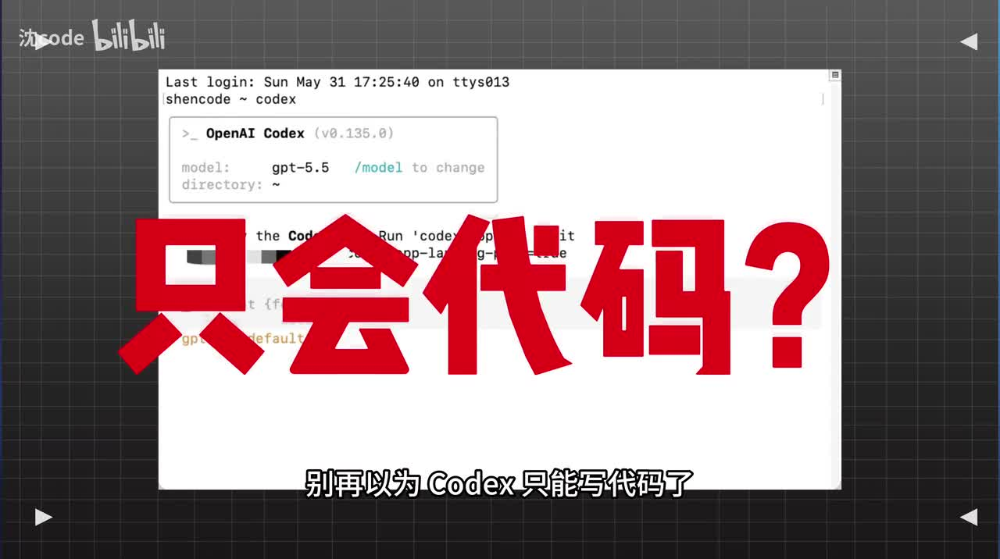
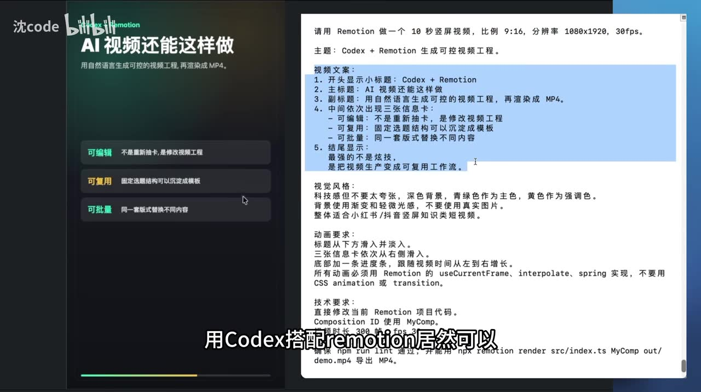
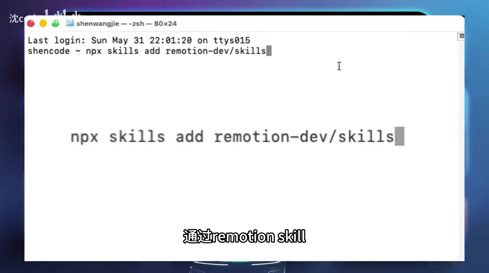

# 谁再说 Codex 只能写代码？我用它直接生成视频！

> 来源：[Bilibili 视频](https://www.bilibili.com/video/BV1qg7D6JEnM)<br>
> UP 主：沈code｜发布时间：2026-06-07（按元数据 `pubdate` 换算）｜视频时长：42 秒｜画面规格：3854×2160

## 小结

视频提出的核心做法是：将 **Codex** 用于生成和修改 **Remotion** 视频工程代码，再由 Remotion 将工程渲染为 MP4，从而获得一种“由代码定义”的、相对可控的视频生产方式。UP 主刻意将其与随机生成画面的生成式 AI 视频区分开，强调可编辑、可复用与可批量替换内容。

关键帧中的实际提示词给出了一个完整的小型项目约束：制作 **10 秒、9:16、1080×1920、30fps** 的竖屏视频；使用 `MyComp` 作为 Composition ID；总长度为 **300 帧**；动画应使用 Remotion 的 `useCurrentFrame`、`interpolate`、`spring`，而非 CSS animation 或 transition。按 30fps 计算，300 帧对应 10 秒，与提示词的时长要求一致。

视频画面还展示了通过 `npx skills add remotion-dev/skills` 添加 Remotion 相关 skill 的命令。此处“skill”可理解为给 Codex 提供特定工作流/知识约束的扩展入口；视频没有展示该命令的执行输出、安装成功状态或具体配置内容，因此不能据此推断其完整安装流程。

UP 主的口播声称：其尝试制作了一个 10 秒视频，“从生成到渲染全程不到一分钟”，成本“只要几分钱”。这是作者个人演示结论，素材没有给出机器配置、模型计费、项目复杂度、渲染日志或成片对照，因此不应外推为所有项目的稳定性能与成本指标。

该方法适合已经或愿意使用前端工程化工具的人：例如需要制作信息卡片、数据可视化短片、系列化口播包装、模板化社媒视频的人。它并不是“只说一句话就获得任意高质量成片”的证据；真正的可控性来自对工程结构、素材、排版、动画及渲染参数的明确约束。

## 思维导图




## 目录

- [背景：从“写代码”到“生成可控视频工程”](#背景从写代码到生成可控视频工程)
- [核心方案：Codex 驱动 Remotion 工程](#核心方案codex-驱动-remotion-工程)
- [提示词中的视频规格与内容结构](#提示词中的视频规格与内容结构)
- [安装与渲染：画面中出现的命令](#安装与渲染画面中出现的命令)
- [可迁移实践步骤](#可迁移实践步骤)
- [参数、限制与时效性](#参数限制与时效性)
- [字幕比对](#字幕比对)
- [评论分析](#评论分析)
- [处理记录](#处理记录)

## 背景：从“写代码”到“生成可控视频工程” [00:00:30](https://www.bilibili.com/video/BV1qg7D6JEnM?t=30)

视频以“别再以为 Codex 只能写代码了”为切入点。作者的观点不是 Codex 直接替代视频生成模型，而是让 Codex 把自然语言需求转为 **Remotion 项目代码**，进一步由可编程的视频渲染框架输出视频。

从 ASR 可确认的口播内容包括：

- 使用 Codex 搭配 Remotion，可以生成“完全可控”的 AI 视频；
- 用户描述想要的视频后，Codex 自动生成完整代码；
- 剩下的步骤交给 Remotion 渲染；
- 这种方式不同于随机生成画面的 AI 视频；
- 用户可以通过一句话修改视频中的细节，作者将其类比为“改 PPT 一样简单”。

这里的“完全可控”应理解为作者的表达，而非已被视频严格证明的技术结论。基于关键帧可验证的部分是：画面确实展示了针对画面内容、风格、动画技术和渲染命令的细化约束；这些约束使视频工程具备较强的可编辑基础。



> 图：画面展示 OpenAI Codex 终端界面，并以“只会代码？”强调视频的选题。它有助于理解作者讨论的并非传统剪辑软件工作流，而是以 Codex 参与工程创建与修改的工作流。


> 图：画面标题为“Codex + Remotion / AI 视频还能这样做”，并列出“可编辑、可复用、可批量”三项价值。这是视频核心判断的直接画面证据。

## 核心方案：Codex 驱动 Remotion 工程 [00:00:30](https://www.bilibili.com/video/BV1qg7D6JEnM?t=30)

作者描述的链路可整理为：

1. 用自然语言描述目标视频；
2. 让 Codex 生成或修改 Remotion 项目代码；
3. 使用 Remotion 对 Composition 执行渲染；
4. 得到 MP4 文件；
5. 后续通过修改内容、主题或参数来更新视频。

视频中强调的不是“随机抽取一段生成画面”，而是将视频拆成工程中可定义的元素，例如标题、信息卡、文字样式、进场方式、进度条和渲染配置。只要这些元素由代码或可替换的数据驱动，理论上就能在保持模板结构的前提下替换内容。

### 作者归纳的三项价值

| 价值 | 画面文字 | 可从素材确认的含义 |
| --- | --- | --- |
| 可编辑 | “不是重新制作，是修改视频工程” | 可通过修改工程代码调整已有视频的文字、布局、动画等。 |
| 可复用 | “固定选题结构可以沉淀成模板” | 同类视频可以共享结构与视觉规则。 |
| 可批量 | “同一套版式替换不同内容” | 在模板与数据分离的前提下，可批量生产同构内容。 |

需要注意：这些是工作流层面的潜在收益。素材没有展示批量输入数据、自动化脚本、素材管理、失败重试或队列渲染，因此“可批量”不能被解读为已展示的一键量产系统。

## 提示词中的视频规格与内容结构 [00:00:30](https://www.bilibili.com/video/BV1qg7D6JEnM?t=30)

关键帧展示了一段用于要求 Remotion 生成视频工程的中文提示词。以下内容按画面可辨识信息整理，不补充未展示的实现代码。

### 1. 基础输出参数

```text
请用 Remotion 做一个 10 秒竖屏视频，比例 9:16，分辨率 1080x1920，30fps。
主题：Codex + Remotion 生成可控视频工程。
```

关键参数如下：

| 参数 | 画面给出的值 | 含义 |
| --- | ---: | --- |
| 时长 | 10 秒 | 成片目标时长。 |
| 画幅 | 9:16 | 竖屏社媒比例。 |
| 分辨率 | 1080×1920 | 对应常见竖屏 Full HD 输出。 |
| 帧率 | 30fps | 每秒 30 帧。 |
| 总帧数 | 300 帧 | 与 10 秒 × 30fps 相匹配。 |
| Composition ID | `MyComp` | 渲染命令中指定的合成标识。 |
| 输出文件 | `out/demo.mp4` | 画面中给出的 MP4 输出路径。 |

### 2. 内容结构

画面中的“视频文案”部分要求：

1. 开头显示小标题：`Codex + Remotion`；
2. 主标题：`AI 视频还能这样做`；
3. 副标题：`用自然语言生成可控的视频工程，再渲染成 MP4。`；
4. 中间依次出现三张信息卡：
   - **可编辑**：不是重新制作，是修改视频工程；
   - **可复用**：固定选题结构可以沉淀成模板；
   - **可批量**：同一套版式替换不同内容；
5. 结尾显示：
   - `最强的不是炫技，`
   - `是把视频生产变成可复用工作流。`

这份结构体现了一个实用提示词的写法：不止说“做一个科技感视频”，还明确了镜头的文本层级、出现顺序和最终希望强调的结论。对代码生成工具而言，这类约束比抽象形容词更容易落到具体组件和时间线实现上。

### 3. 视觉与动画约束

画面给出的风格要求包括：

- 科技感，但不要太夸张；
- 深色背景；
- 背景色以青绿色为主色、黄色为强调色；
- 背景使用渐变和轻微噪点；
- 不要使用真实图片；
- 整体适合小红书、抖音竖屏知识类短视频。

动画要求包括：

- 标题从下方滑入并淡入；
- 三张信息卡依次从右侧滑入；
- 底部增加进度条，并随视频时间从左到右增长；
- 所有动画使用 Remotion 的 `useCurrentFrame`、`interpolate`、`spring` 实现；
- 不使用 CSS `animation` 或 `transition`。



> 图：该帧同时展示视频规格、文案结构、视觉风格、动画要求和技术要求，是本视频最有信息密度的证据。它说明“说一句话”的实际含义是给出一组包含参数与规则的具体需求，而非仅提供一个宽泛主题。

### 4. 技术要求与渲染检查

画面中的技术要求可读为：

```text
直接修改当前 Remotion 项目代码。
Composition ID 使用 MyComp。
视频总时长 300 帧。
确保 npm run lint 通过，并能用
npx remotion render src/index.ts MyComp out/demo.mp4
导出 MP4。
```

其中：

- `npm run lint`：要求项目通过既有 lint 脚本。视频未展示 `package.json`，因此无法确认实际使用的是 ESLint、Biome 或其他检查器。
- `npx remotion render src/index.ts MyComp out/demo.mp4`：指定入口 `src/index.ts`、Composition ID `MyComp` 和输出文件 `out/demo.mp4`。
- “直接修改当前 Remotion 项目代码”意味着提示词假设工作目录中已有可用的 Remotion 项目；视频未展示从零初始化项目的命令。

## 安装与渲染：画面中出现的命令 [00:00:30](https://www.bilibili.com/video/BV1qg7D6JEnM?t=30)

关键帧展示终端中输入的命令：

```bash
npx skills add remotion-dev/skills
```

画面字幕将其称为“通过 remotion skill”。结合画面，应将 ASR 中识别成“remotion scale”的部分校正为 **Remotion skill(s)**：关键帧能直接看到 `skills`、`add` 与 `remotion-dev/skills`。

素材没有提供以下信息：

- 命令的完整执行日志；
- 所安装 skill 的版本号；
- 是否需要登录、网络代理或额外权限；
- Codex 如何自动发现并调用该 skill；
- `remotion-dev/skills` 的具体内容、授权或兼容性。

因此，以下命令仅应作为视频中展示的操作记录，而不是在所有环境中均可直接复现的保证。



> 图：终端画面清晰显示 `npx skills add remotion-dev/skills`。该图是校正 ASR 专有名词、确认视频展示过具体命令的关键依据；但画面未包含命令执行结果。

## 可迁移实践步骤 [00:00:30](https://www.bilibili.com/video/BV1qg7D6JEnM?t=30)

以下步骤是基于视频明确展示的工程要素整理出的实践清单。它们区分了“视频已展示的要求”与“实践时应自行验证的部分”。

### 步骤 1：准备已有的 Remotion 项目

视频提示词明确要求“直接修改当前 Remotion 项目代码”，因此前提是已经存在一个能够被 Remotion 识别的项目，并且项目中有或将注册一个名为 `MyComp` 的 Composition。

实践检查项：

- 确认项目能够安装依赖；
- 确认入口文件路径是否真为 `src/index.ts`；
- 确认 Composition ID 是否真为 `MyComp`；
- 确认 lint 脚本是否存在。

这些检查项是由画面中的渲染和 lint 要求推出的必要验证，并非视频演示了具体检查过程。

### 步骤 2：可选地添加 Remotion 相关 skill

按照视频画面，执行：

```bash
npx skills add remotion-dev/skills
```

执行前应注意：

- 先确认 `npx skills` 在本机环境可用；
- 查看包来源、版本、许可和权限说明；
- 不应仅因视频画面展示该命令，就在生产环境中无审查地执行第三方包安装；
- 如命令失败，应保留报错信息，不能仅依赖视频中的宣传结论。

### 步骤 3：以“结构化需求”描述视频

视频的示例提示词可抽象成如下模板：

```text
目标：
- 时长：{duration}
- 比例：{aspect_ratio}
- 分辨率：{width}x{height}
- 帧率：{fps}
- 输出：{output_path}

内容：
- 开场：{opening}
- 标题：{headline}
- 副标题：{subheadline}
- 信息卡：{cards}
- 结尾：{ending}

视觉：
- 背景：{background}
- 主色与强调色：{colors}
- 素材限制：{asset_constraints}

动画：
- 各元素入场方式：{motion_rules}
- 时间指示：{progress_rule}
- 实现限制：使用 {remotion_apis}；不使用 {forbidden_apis}

工程：
- Composition ID：{composition_id}
- 总帧数：{total_frames}
- 质量检查：{lint_command}
- 渲染命令：{render_command}
```

经验要点：将“成片意图”拆分为画布参数、文字内容、时间顺序、视觉规则、动画实现约束和可执行命令，比只输入“帮我做一条科技感视频”更容易得到可维护的工程结果。

### 步骤 4：用帧而非模糊时间描述动画

Remotion 的典型方式是以当前帧驱动动画。视频明确提出应使用：

- `useCurrentFrame`
- `interpolate`
- `spring`

这意味着动画状态应基于帧序号计算。例如，300 帧的总时长、进度条从左到右推进等需求，都适合表达为帧数上的插值关系。视频没有提供具体代码，因而不能还原其实际实现；但它给出了明确的技术方向和禁止项：不要将 CSS animation 或 transition 作为动画主实现。

### 步骤 5：先检查，再渲染

视频要求先通过：

```bash
npm run lint
```

再执行：

```bash
npx remotion render src/index.ts MyComp out/demo.mp4
```

应把渲染是否成功、输出是否存在、成片时长和分辨率是否符合预期作为独立验收项。视频只呈现了命令文本，没有提供运行结果或输出成片，因此这些验收需要在实际环境中完成。

## 参数、限制与时效性 [00:00:30](https://www.bilibili.com/video/BV1qg7D6JEnM?t=30)

### 已明确给出的参数

| 项目 | 值或要求 | 证据 |
| --- | --- | --- |
| 视频目标时长 | 10 秒 | 关键帧提示词、ASR 口播 |
| 画幅比例 | 9:16 | 关键帧提示词 |
| 分辨率 | 1080×1920 | 关键帧提示词 |
| 帧率 | 30fps | 关键帧提示词 |
| 总帧数 | 300 帧 | 关键帧提示词 |
| Composition ID | `MyComp` | 关键帧提示词 |
| 输出路径 | `out/demo.mp4` | 关键帧提示词 |
| lint 命令 | `npm run lint` | 关键帧提示词 |
| 渲染命令 | `npx remotion render src/index.ts MyComp out/demo.mp4` | 关键帧提示词 |
| skill 命令 | `npx skills add remotion-dev/skills` | 关键帧终端画面 |

### 重要限制

1. **未展示最终生成的视频样片。**  
   视频展示了需求文档和命令，但提供的素材中没有可供评估的“Codex + Remotion 生成成片”完整画面。热评中也有观众指出这一点。

2. **“不到一分钟”和“几分钱”缺少复现条件。**  
   影响耗时与成本的变量至少包括：模型与计费策略、提示词长度、项目初始状态、依赖安装情况、CPU/GPU、分辨率、帧率、特效复杂度、素材加载和渲染并发度。视频没有给出这些数据。

3. **“一句话生成”是高度压缩的表达。**  
   关键帧中的实际输入不是一句极短描述，而是一段包含文案、风格、动画和技术规范的详细提示。因此，更准确的理解是“自然语言驱动工程修改”，而不是完全没有规格设计工作。

4. **对工具版本敏感。**  
   画面中的 Codex 界面显示版本 `v0.135.0`，模型栏显示 `gpt-5.5`；`npx skills`、`remotion-dev/skills`、Remotion CLI 参数以及 Codex 的能力都可能随版本变化。本文仅记录视频画面所示状态，不保证在其他时间或环境中保持一致。

5. **没有真实图片的限制适用于该示例。**  
   提示词要求“不要使用真实图片”，这属于本视频示例的视觉风格约束，并不代表 Remotion 本身不能使用图片、视频或其他素材。

### 时效性说明

视频元数据标注发布时间为 2026-06-07，素材抓取时间为 2026-07-16。关于 Codex、skill 安装命令、包名、模型名称及价格的内容均具有时效性，应在实际使用前以当前官方文档、CLI 帮助信息和本机执行结果为准。

## 字幕比对 [00:00:30](https://www.bilibili.com/video/BV1qg7D6JEnM?t=30)

| 字幕来源 | 完整性 | 专有名词 | 时间轴 | 主要问题 |
| --- | --- | --- | --- | --- |
| Bilibili 站内字幕 | 无可用字幕 | 无法评估 | 无法评估 | 素材明确标注“未提供可用站内字幕”。 |
| 本次 ASR 字幕 | 较低：仅覆盖 30.000–41.160 秒，诊断语音覆盖率 27.03% | 存在误识别 | 有真实 SRT 时间戳 | 将 `Codex` 识别为“扣带”，将 Remotion skill 识别为“remotion scale”，将“代码”识别为“代砝”；首段文本过度合并。 |

### 本次 ASR 检查结果

本次 ASR 使用 `medium` 模型，识别语言为中文，语言概率为 `0.99853515625`，音频总长约 `41.285` 秒。ASR 结果具有时间戳，提供了两段真实 SRT 分段：

- `00:00:30,000 --> 00:00:30,420`
- `00:00:30,420 --> 00:00:41,160`

ASR 诊断未标记 `noAudioStream=true`，因此不能将低覆盖率归因于“源视频没有音轨”。实际情况是：本次 ASR 只在最后约 11.16 秒识别到连续口播，覆盖约 27.03% 的视频时长；其余内容需依赖关键帧中的屏幕文字与多模态画面理解，不能虚构未被识别或显示的口播内容。

### 最终字幕与事实选择

- **主时间轴依据**：采用本次 ASR 的真实 SRT 时间戳，因此正文涉及口播的章节统一链接至 30 秒。
- **专有名词校正**：
  - “扣带”校正为 **Codex**，依据视频标题、封面/画面中的 `OpenAI Codex` 与元数据标签；
  - “remotion scale”校正为 **Remotion skill(s)**，依据终端画面中的 `npx skills add remotion-dev/skills`；
  - “代砝”校正为“代码”，依据上下文及视频主题。
- **画面文字使用**：提示词中的参数、命令和结构来自关键帧可见文字，而不是由 ASR 补写。
- **未作校正的部分**：没有站内字幕可用于交叉验证，也没有完整人工转录；因此未对未出现在关键帧或 ASR 中的内容作扩展性补全。

## 评论分析 [00:00:30](https://www.bilibili.com/video/BV1qg7D6JEnM?t=30)

本次仅获取到 2 条热评，少于请求上限 3 条；以下仅分析可获得评论，不将其视作已验证事实。

| 评论者 | 获赞 | 评论观点 | 分析 |
| --- | ---: | --- | --- |
| yyccz | 1 | “你好歹把CODEX+REMOTION生成的视频放出来，让人看看效果啊” | 该评论指出视频证据链的关键缺口：展示了思路、提示词和命令，却未展示最终成片供观众判断画面质量、字幕排版、动画效果与渲染稳定性。这与现有素材情况一致，但评论本身不是对技术不可行的证明。 |
| 几何漫游者 | 1 | “住下了先！” | 表达了对该主题的关注或收藏意愿，没有提出可核验的技术信息，也未构成对效果、成本或流程的独立验证。 |

## 评论分析

- 热评 1：你好歹把CODEX+REMOTION生成的视频放出来，让人看看效果啊
- 热评 2：住下了先！

以上内容是观众反馈摘录，只用于补充理解视频反响，不作为正文事实依据。

## 处理记录

- Worker ID：`worker-mrj0wbly-5dc4e50c`
- 模型：`gpt-5.6-terra`
- 已检查的素材与工具产物：视频元数据、关键帧列表与所给关键帧画面、`asr/transcript.srt`、`asr/asr-result.json` 诊断、热评数据。
- ASR 模型与运行信息：`medium`；中文识别；CUDA；`float16`；ASR 具有时间戳。
- 字幕选择：站内字幕不可用；检查并采用本次 ASR 的两段真实 SRT 时间戳作为口播时间轴。画面参数、命令和提示词以关键帧文字为准，并对 ASR 的 `Codex`、`Remotion skill(s)` 等专有名词进行基于画面的校正。
- 关键帧选择依据：
  - `frames/frame-001.jpg`：展示 Codex 与视频标题问题，说明主题切入；
  - `frames/frame-002.jpg`：展示“可编辑、可复用、可批量”三项主张；
  - `frames/frame-003.jpg`：展示最完整的提示词、参数、动画和渲染要求；
  - `frames/frame-004.jpg`：展示 `npx skills add remotion-dev/skills` 的具体终端命令。
- 关键帧时间依据：素材仅提供帧文件路径，未提供各关键帧的精确时间戳；因此未为关键帧自行猜测时间位置，正文时间轴只使用 ASR SRT 的真实 30 秒起始点。
- 缓存清理：未提供缓存清理执行记录；为避免编造，不声称已完成清理。
- 未解决问题：
  - 未提供可用站内字幕；
  - ASR 仅覆盖约 27.03% 的音频时长，且存在专有名词误识别；
  - 未展示 skill 安装输出、代码生成过程、lint 结果、渲染日志与最终 MP4 成片；
  - “不到一分钟”“几分钱”的性能与成本主张缺少可复现环境和计费数据。
