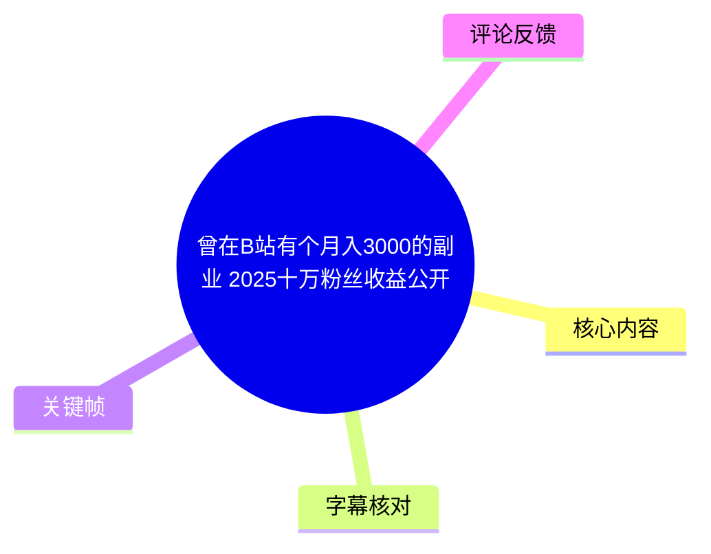
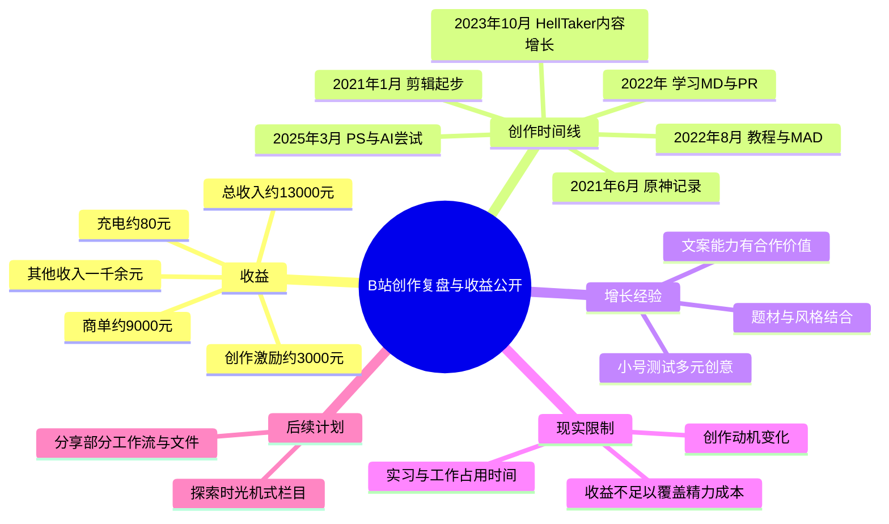
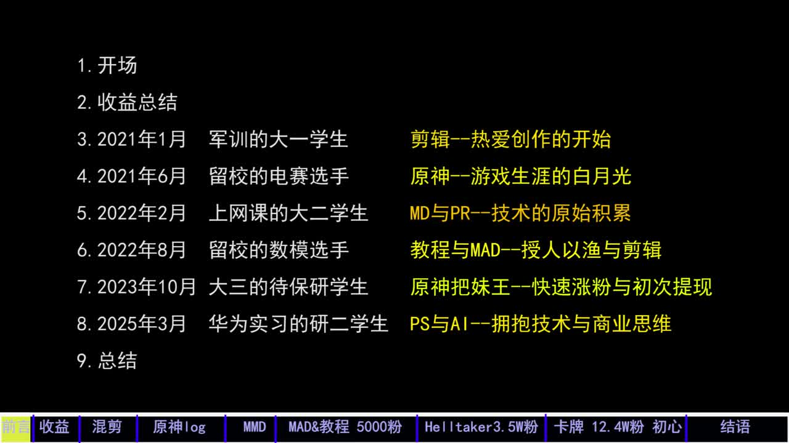
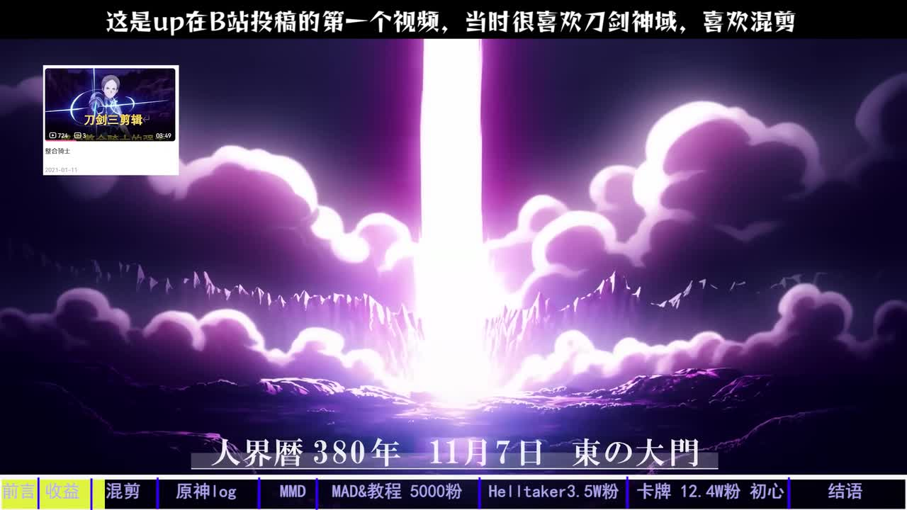
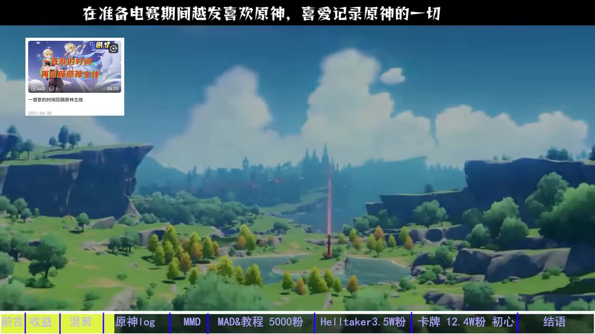
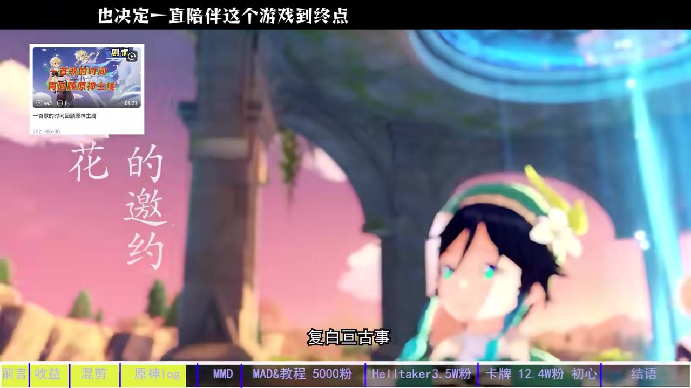

# 曾在B站有个月入3000的副业 2025十万粉丝收益公开

> 来源：[Bilibili 视频](https://www.bilibili.com/video/BV1LT6SBAEgD) 
> UP 主：三月七七_｜发布时间：2026-01-10｜视频时长：11 分 21 秒 
> 数据抓取时视频统计：21,112 播放、682 点赞、523 收藏、74 投币、63 评论（抓取于 2026-07-15；会随时间变化）。

## 小结

视频是一份创作者年终复盘：UP 主“三月七七_”先公开其所述的 2025 年 B 站相关收入构成，再按创作阶段回顾从大一开始剪辑、制作《原神》内容、学习 MD/PR、制作 MAD 与教程、以 HellTaker 风格内容增长、再转向 PS 与 AI 相关尝试的过程。

最明确的收益信息是：UP 主称其公开的总收入约为 **13,000 元**；其中约 **9,000 元来自商单**、约 **3,000 元来自创作激励**，另有一千余元其他收入；充电收入约 80 元。收入高峰主要在 6—9 月，且与商单集中有关。该数字是单个创作者在特定题材、粉丝规模、接单条件与时间段下的自述，不能直接视为同类账号的行业均值或可复制收益承诺。

视频的经验重点不在某个剪辑软件的具体操作，而在内容路径：早期以兴趣和技术积累为主；一次将既有题材与特定视觉风格结合的尝试获得增长；后续合作方看重的并不只是 PR 或 AI 技术，也包括文案能力。创作者还提到，大号定位不宜过杂，可将不同创意先放在小号试行。

视频同时呈现了副业的限制：当实习、工作与奖学金等现实安排占据时间后，创作的边际收益、心理回报和休息需求会发生变化。UP 主表示自己曾从“热爱剪辑与分享”转为“为了收入而工作”，最终因工作繁忙而逐渐淡出；本片则是其自 6 月以来首次自发创作。

信息具有明显时效性。标题中的“2025”对应其复盘年度，而页面元数据显示视频发布于 **2026-01-10**；平台激励规则、商单价格、内容热度、个人粉丝数及收入结构都可能已变化。文中涉及的收入、播放量、粉丝数均应理解为视频中的个人回顾，而非当前实时数据。

## 思维导图

## 目录

- [开场：复盘范围与三个问题](#开场复盘范围与三个问题)
- [收益公开：约 1.3 万元的构成与边界](#收益公开约-13-万元的构成与边界)
- [创作时间线：从剪辑兴趣到 PS 与 AI](#创作时间线从剪辑兴趣到-ps-与-ai)
- [增长节点：HellTaker、文案与内容合作](#增长节点helltaker文案与内容合作)
- [从涨粉到淡出：时间、动机与机会成本](#从涨粉到淡出时间动机与机会成本)
- [可复用的创作步骤与适用条件](#可复用的创作步骤与适用条件)
- [结论、限制与时效性](#结论限制与时效性)
- [字幕比对](#字幕比对)
- [评论分析](#评论分析)
- [处理记录](#处理记录)

## 开场：复盘范围与三个问题 [00:00](https://www.bilibili.com/video/BV1LT6SBAEgD?t=0)

UP 主表示自己已经两个月未更新，本期以“年终总结”的形式回应三个问题：

1. 公开收入，供游戏、动漫与 AI 区创作者参考；
2. 将创作经历按时间线、粉丝数、视频分类相互对应地回顾；
3. 解释自己为何逐渐淡出，以及之后是否还会更新、会更新什么内容。

视频采用“走马灯”式的阶段回顾，而非单纯的收益晒单。其真正讨论的是：一个学生创作者在兴趣、技能增长、流量、商单、实习与工作之间如何不断重新分配时间。

> 图：画面直接列出九个段落及底部阶段轴，包括“2021 年 1 月”“2021 年 6 月”“2022 年 2 月”“2022 年 8 月”“2023 年 10 月”“2025 年 3 月”等节点，并把阶段概括为剪辑、原神、MD/PR、MAD/教程、HellTaker、PS/AI。这是梳理整期叙事结构与年份关系的核心依据。

## 收益公开：约 1.3 万元的构成与边界 [00:28](https://www.bilibili.com/video/BV1LT6SBAEgD?t=28)

### 收入构成

UP 主在对比网友预测后，给出自己的收入汇总。按 ASR 可辨识内容整理如下：

| 收入项目 | 视频中的金额表述 | 说明 |
| --- | ---: | --- |
| 总收入 | 约 13,000 元 | UP 主自述的汇总数 |
| 商单 | 约 9,000 元 | 占收入主要部分 |
| 创作激励 | 约 3,000 元 | 平台创作相关激励 |
| 其他零散收入 | 一千余元 | 原话为“乱七八糟的”，未逐项展开 |
| 充电 | 约 80 元 | UP 主以自嘲口吻表示充电支持很少 |

各分项采用“约数”表述，且“其他零散收入”没有细目；因此不宜据此进行严格的会计加总。视频表达的重点是收入结构：**商单是主要来源，平台激励居次，充电贡献很小。**

### 粉丝规模、时间区间与收入关系 [00:52](https://www.bilibili.com/video/BV1LT6SBAEgD?t=52)

UP 主称自己到当年 4 月才达到 5 万粉丝，收入的大头来自 6—9 月。该期间其一边上班、一边面对较多商单，甚至表示商单多到难以接完。

这说明视频中的收入不是“粉丝数达到某个门槛后自动获得”的固定回报，而是至少受以下变量共同影响：

- 是否有商单机会，以及商单数量；
- 创作者是否有时间承接、沟通和交付；
- 内容赛道及账号受众的商业匹配度；
- 平台创作激励及播放表现；
- 个人是否愿意以休息时间换取额外创作与商务工作量。

UP 主建议希望坚持做动漫、游戏区内容的人将其作为参考，但这只是其个人样本。尤其是其收入高峰集中在几个月内，不能把总额简单折算为稳定月薪。

## 创作时间线：从剪辑兴趣到 PS 与 AI [00:00](https://www.bilibili.com/video/BV1LT6SBAEgD?t=0)

> 本节的年份与阶段名称主要以目录关键帧中的画面文字为依据。该段回顾存在较长的 ASR 空白，不能将未被语音覆盖的每个视觉节点精确定位到视频秒数。

### 2021 年 1 月：军训时期的大一学生——剪辑兴趣的起点

目录画面将第一个阶段概括为“剪辑——热爱创作的开始”。画面还展示了 UP 主在 B 站投稿的第一个视频：其内容与《鬼灭之刃》相关，UP 主在画面文字中说明自己当时喜欢《刀剑神域》，也喜欢混剪。

> 图：画面展示首个投稿的视频卡片，并明确写有“这是 up 在 B 站投稿的第一个视频，当时很喜欢刀剑神域，喜欢混剪”。它说明账号最初的生产动力是作品兴趣与剪辑表达，而非变现。

### 2021 年 6 月：留校电赛选手——《原神》记录

目录将这一阶段概括为“原神——游戏生涯的白月光”。画面文字显示，UP 主在准备电赛期间越来越喜欢《原神》，并希望记录游戏中的一切；所示投稿卡片标题为“一首歌的时间带你回顾原神主线”，发布日期显示为 2021-06-30。

> 图：画面将电赛准备、对《原神》的喜爱与“记录原神一切”的动机并置，说明早期游戏内容不仅是追热点，也来自个人游戏经历。

另一个画面继续表达其“决定一直陪伴这个游戏到终点”的情感取向。这类长期投入有利于积累内容素材和受众认同，但也会使账号与特定游戏生命周期、个人兴趣变化产生较强绑定。

> 图：画面文字写有“也决定一直陪伴这个游戏到终点”，并展示游戏角色与场景。该帧有助于理解该阶段的内容选择带有强烈的个人兴趣导向。

### 2022 年：网课与数模阶段——MD、PR、教程和 MAD

目录将 2022 年 2 月标为“上网课的大二学生”，对应“MD 与 PR——技术的原始积累”；2022 年 8 月标为“留校的数模选手”，对应“教程与 MAD——授人以渔与剪辑”。

这里的“MD”“PR”“MAD”是目录中的原始写法。视频未在可用 ASR 中完整解释 MD 的具体含义，不能据此扩展为某个确定软件或流程；但 PR 通常指 Adobe Premiere Pro，MAD 则是动画、游戏等素材再创作的常见视频类型。后文叙述能够确认的是，UP 主逐步积累了剪辑与内容制作技能，并开始尝试教程、MAD 等更具方法分享性质的内容。

### 2023 年 10 月与 2025 年 3 月：题材突破与技术结合

目录将 2023 年 10 月定位为“大三的待保研学生”，标注“原神把妹王——快速涨粉与初次提现”；2025 年 3 月定位为“华为实习的研二学生”，标注“PS 与 AI——拥抱技术与商业思维”。

这两行是视频对后期转折的高度概括：

- 前者对应某类结合《原神》与 HellTaker 风格的内容，带来快速涨粉和早期收益；
- 后者对应 PS 与 AI 的结合，并明确提到商业思维；
- 两个阶段之间并非单纯“软件升级”，而是从技术学习转向题材包装、受众反馈、合作与变现的综合能力。

## 增长节点：HellTaker、文案与内容合作 [06:39](https://www.bilibili.com/video/BV1LT6SBAEgD?t=399)

### 从 AI 绘画学习到题材组合

UP 主回顾称，在学校饭菜相关视频之后、调研和阅读文献期间，自己开始学习 AI 绘画。当时原本在做与 HellTaker 有关的 MAD，随后想到把《原神》与这一风格结合的创意，并迅速制作发布。

这里可确认的并非某个可复制的 AI 绘图提示词或软件参数——视频没有提供这些细节——而是一次创意决策过程：

1. 先有既有题材积累：游戏内容与 HellTaker/MAD 内容；
2. 再补充新技术能力：学习 AI 绘画；
3. 将题材、画风和既有受众兴趣重新组合；
4. 快速做出作品验证，而不是长期停留在构想阶段；
5. 发布初期数据平静后继续观察，第二周才出现增长。

UP 主称该视频第一周没有明显动静，第二周突然出现数百人同时观看，播放量快速增长到 10 万级。这个案例提醒创作者：首周表现不一定能完整代表内容的最终分发结果，但它只是个人经历，不能推导出所有视频都应等待或必然在第二周起量。

### 播放、粉丝与收益节点 [07:30](https://www.bilibili.com/video/BV1LT6SBAEgD?t=450)

UP 主在回顾中给出若干阶段数据：

| 指标 | 视频中的表述 |
| --- | --- |
| 视频数量 | 65 个 |
| 最高播放 | 110 万 |
| 平均播放 | 12 万 |
| 首个百万播放 | 此阶段达成 |
| 粉丝数 | 到达约 3.5 万 |

这些数据均为 UP 主口述回顾，视频未给出逐条作品链接、统计截图或统计口径，因此应作为其个人叙事中的自述数据使用。尤其“平均播放”是否按全部投稿、某一系列还是特定时期计算，素材中未见明确说明。

UP 主还表示，单个视频曾带来“两三百”的收益，但 ASR 对具体单位、前后语境识别不够稳定，无法据此确定是创作激励、单期结算还是其他收入。因此不将其作为精确收益参数。

### 合作方看重文案能力 [07:04](https://www.bilibili.com/video/BV1LT6SBAEgD?t=424)

UP 主称，自己原本以为他人会因为 PR 技术或 AI 技术来寻求合作，但实际合作方更看重其写文案的能力。这个经验的可迁移部分是：

- 技术工具是内容交付能力的一部分，而不是全部；
- 对于短视频、二创和风格化内容，选题、结构、台词、梗的组合与节奏可能直接影响作品辨识度；
- 当技术门槛因模板、AI 工具或教程下降后，文字策划与创意判断仍可能成为差异化环节。

UP 主还提到自己的一个视频曾登上“热门”，但随即提醒“大家不要看，因为太色情了”。该句反映的是其对早期内容尺度的自我评价；视频没有提供该作品的名称、链接、平台处理情况或具体尺度标准，不能据此判断其是否违反平台规则。

### 从《败犬女主太多了！》到风格化尝试 [07:59](https://www.bilibili.com/video/BV1LT6SBAEgD?t=479)

UP 主表示，后续创作与动画《败犬女主太多了！》有关。其原本希望制作偏“委屈风格”的视频；此前的 65 期视频大体维持了较好的更新频率。之后由于自己在初中时期就有设计、打印角色卡片收藏的习惯，且难以找到同一画风的原图，便想起了 HellTaker 式画风，并称这种尝试“火得一塌糊涂”。

从这一段可提炼出的做法是：

1. 从长期个人偏好中提取内容方向，而非只依赖即时热点；
2. 明确素材供给问题：想要统一画风但缺少合适原图；
3. 寻找已有、可识别的视觉语言作为替代方案；
4. 将角色喜好、画风与受众熟悉的梗结合；
5. 用实际发布验证，而非仅凭主观判断决定内容价值。

视频没有提供具体的 PS 工程、AI 模型、图生图参数、版权授权状况或素材来源，因此不能把该路径简化为“套用某画风即可涨粉”的技术配方。

## 从涨粉到淡出：时间、动机与机会成本 [08:56](https://www.bilibili.com/video/BV1LT6SBAEgD?t=536)

UP 主称，之后账号开始持续涨粉，达到 5 万粉丝；同时收入持续增长。但其在华为实习，时间不再充裕，并获得较高奖学金，因此对 B 站激励和播放量奖励逐渐“脱敏”。

### 创作动机的变化 [09:22](https://www.bilibili.com/video/BV1LT6SBAEgD?t=562)

UP 主对淡出原因的解释是本片最重要的限制信息之一：

- 初期动力是热爱剪辑、热爱分享；
- 后期创作逐渐带有“被迫工作”的感受；
- 坐在电脑前不再能从播放量增长、被喜欢和被认可中获得原先的快乐；
- 为获得“千把块钱”而投入一天，在工资参照下显得不那么重要；
- 虽然其表示做视频比公司工作“开心 10 倍”，但工作很忙，也想享受周末，于是逐渐淡出。

这不是“创作没有价值”的结论，而是个体在不同人生阶段对时间价值的重新计算。对于将内容创作视为副业的人，收益评估至少还应加上：

- 选题、写稿、制作、修改、沟通等隐形工时；
- 实习、工作或学业的排期冲突；
- 睡眠、休息、社交与周末的机会成本；
- 作品反馈不确定性造成的心理消耗；
- 当爱好被收入目标绑架后，创作动机可能产生的变化。

## 可复用的创作步骤与适用条件 [10:20](https://www.bilibili.com/video/BV1LT6SBAEgD?t=620)

### 视频中实际呈现的工作思路

UP 主称，自己无法再持续进步或同时完成很多事，但可以分享此前的一部分工作流和工作文件。素材没有给出具体文件地址、模板、软件版本或下载方式，因此当前只能整理其已表达的思路，不能虚构为完整教程。

可按视频中的经验归纳为以下流程：

1. **保留长期兴趣素材**  
   从喜欢的游戏、动画、角色、画风或旧梗中积累选题，不必只追逐即时热点。

2. **积累基础制作能力**  
   目录明确提到 MD、PR、MAD、PS 和 AI 等阶段；这些能力在不同内容时期被组合使用。

3. **从“技术展示”转向“内容包装”**  
   UP 主的合作经历说明，文案与创意组织可能比单一工具能力更受重视。

4. **以小成本作品尽快测试创意**  
   HellTaker 风格内容的案例显示，先做出成品发布，再根据真实反馈判断；同时不以首周数据作为唯一结论。

5. **维持大号主题边界**  
   UP 主明确说大号不能“做得太杂”。这意味着账号定位、既有受众期待与内容试错之间需要取舍。

6. **用小号试行差异化想法**  
   UP 主表示曾把不适合大号的想法放在小号试行，并称小号成功涨到 1 万粉、赚到数千元。该结果为其自述，未提供账号、周期和收入明细，不能外推为普遍结果。

7. **将工作量纳入决策，而不是只看播放量**  
   当实习和工作加重时，创作频率下降并不必然代表能力下降，而可能是主动选择更合理的时间分配。

### 后续可探索的栏目想法 [10:45](https://www.bilibili.com/video/BV1LT6SBAEgD?t=645)

UP 主提出过一个尚未实施的构想：搜集 10 年前“热门”的事件与梗，每周做一期“时光机”式内容；其认为该栏目可能有流量、涨粉与变现空间。

这属于创作者的设想，而非已经验证的方法。其潜在难点包括：

- 旧素材和旧梗的出处、版权与可用范围；
- 历史事件的事实核验与语境还原；
- 每周稳定检索、选题、制作的时间成本；
- 怀旧受众与当前平台推荐机制是否匹配；
- “能火、能涨粉、能变现”仍需以实际内容测试验证。

## 结论、限制与时效性 [09:56](https://www.bilibili.com/video/BV1LT6SBAEgD?t=596)

UP 主称本片是其自 6 月以来首次自发创作，并表示重新找到了做视频的热情。其创作生涯贯穿大一到研二；即便无法继续高频投入，仍可能通过分享旧工作流、文件或在小号试验来延续创作。

### 可迁移结论

- **收入结构比总额更有参考价值。** 本例中，商单明显高于激励和充电；“有多少粉”不是唯一决定变量。
- **流量增长常来自组合创新。** 将已有游戏受众、视觉风格、梗与新技术结合，可能比孤立学习工具更有效。
- **文案是技术之外的竞争力。** 合作机会不必然由软件熟练度决定，内容表达与创意结构同样重要。
- **副业应按总工时而不是单笔收入评估。** 当工作、实习、奖学金与休息需求变化时，继续高频创作未必是最优选择。
- **账号定位需要边界。** 大号维持垂直性，小号承担试错功能，是视频中被实践过的分层思路。

### 不能据此得出的结论

- 不能得出“5 万粉一定能年入 1.3 万元”；
- 不能得出“使用 AI 绘画或 HellTaker 风格必然爆款”；
- 不能得出“商单收入可稳定按月复制”；
- 不能得出视频中提及的内容一定符合当下平台规则、版权要求或商业合作规范；
- 不能将评论中的猜测、建议当作 UP 主已经执行的事实。

### 时效说明

页面元数据显示本视频发布于 2026-01-10，收入复盘指向 2025 年；抓取到的视频统计则来自 2026-07-15。B 站激励政策、商单报价、账号表现、热门题材、AI 工具能力与平台内容规范都可能在此后变化。涉及收益和平台机制时，应以当前官方规则、合同条款和实际后台数据为准。

## 字幕比对

| 字幕来源 | 完整性 | 专有名词 | 时间轴 | 主要问题 |
| --- | --- | --- | --- | --- |
| Bilibili 站内字幕 | 未提供可用字幕 | 无法评估 | 无法评估 | 素材中没有可用站内字幕文件或文本 |
| 本次 ASR 字幕 | 有效语音覆盖约 246.44 秒，占全片约 36.22% | 多处识别不稳定 | 有 19 个带毫秒时间戳的分段，可直接定位 | 存在 6 段明显长空白，最大空白约 192.35 秒；部分词语、人名、金额单位和语句断句失真 |

最终采用 **本次 ASR 的真实时间戳** 作为章节定位依据，并以关键帧的可见文字校正创作阶段信息。站内字幕未提供，因此不存在可与 ASR 逐句合并的官方文本。

本次 ASR 未标记 `noAudioStream=true`，且素材中提供了 `audio/audio.wav`、识别语言为中文、置信度约 0.9824，说明源视频存在可供识别的音频；ASR 不完整主要表现为语音覆盖不足和长时间空白，而不是“无音轨”或工具失败。

经关键帧及上下文确认、或保留谨慎表述的重点包括：

- 目录中的 **HellTaker** 为画面可见英文；ASR 中出现“地狱把妹王”等近似称呼时，正文优先使用画面可验证的英文名；
- 目录中的 **MD、PR、MAD、PS、AI** 为可见原文；其中仅 PR 的常见含义可推测为 Premiere Pro，但视频素材未对 MD 作完整解释；
- ASR 中“箱单”“创作几率”等词结合上下文整理为“商单”“创作激励”，但金额均以“约”表述；
- ASR 在若干位置的叙述不连贯，正文不以其补写未出现的制作参数、合作细节或平台规则。

## 评论分析

以下仅处理可获取的热评前三条；评论是观众观点或建议，不构成经验证事实。

1. **不良少女虎视虎子**（82 赞）  
   评论：“喜欢就坚持吧，你所热爱的就是你的生活[doge]加油”。  
   该评论呼应视频末尾“重新找到做视频热情”的情绪，鼓励 UP 主持续创作。它提供的是价值取向支持，没有补充收益或技术层面的可验证信息。

2. **PileMars**（21 赞）  
   评论：“有些东西看看白嫖的就行了，深入进去，我可能就换软件了”。  
   评论暗示观众对视频中某些内容尺度、题材或平台体验存在保留态度，但没有明确指出具体视频片段、软件或规则依据。它可视为个体偏好表达，不应解读为平台处罚、侵权或内容违规的证据。

3. **憨斯季默**（17 赞）  
   评论：“主播没开网盘的推广吗？那个好像赚挺多的”。  
   评论提出“网盘推广”可能是另一种变现路径，但“好像赚挺多”只是推测，且 UP 主没有在本视频中确认自己参与过此类推广。是否适合、收益多少、是否合规，均需以平台规则、推广协议和实际数据单独核验。

## 处理记录

- **Worker ID**：worker-mrj0wbly-5dc4e50c
- **模型**：gpt-5.6-terra
- **调用工具与素材**：视频元数据读取、音频提取结果 `audio/audio.wav`、ASR 结果 `asr/asr-result.json` 与 `asr/transcript.srt`、关键帧目录 `frames/`、评论文件 `comments/comments.json`、站内字幕目录检查。
- **ASR 模型与配置**：识别模型 `medium`；语言自动识别为中文（`zh`），语言置信度约 0.9824；CUDA / float16；ASR 时长 680.448 秒。
- **字幕选择**：站内字幕未提供可用内容；使用本次 ASR 的带时间戳分段作为时间轴依据。由于 ASR 覆盖约 36.22%、存在长空白，对专有名词和阶段信息以关键帧可见文字交叉校正，并对不确定词汇保守转述。
- **关键帧选择依据**：  
  - `frames/frame-001.jpg`：含完整目录、年份和阶段标签，用于建立创作时间线；  
  - `frames/frame-002.jpg`：展示第一个投稿及剪辑起点；  
  - `frames/frame-003.jpg`：展示电赛期间的《原神》记录动机；  
  - `frames/frame-004.jpg`：展示长期陪伴游戏的表达。  
  其余关键帧路径虽在清单中列出，但未提供可供本次正文核验的画面内容，故未擅自引用。
- **评论处理范围**：仅分析已获取的热评前三条，未扩展至其他评论。
- **缓存清理**：未提供缓存清理的执行日志，无法确认是否已清理；不虚构清理结果。
- **未解决问题**：ASR 在 01:08—04:20、04:20—06:39 等区间存在长空白；站内无可用字幕，无法为这些区间补充逐句转写。视频未提供具体软件版本、AI 工作流参数、商单合同、完整收益截图或小号账号信息，因此未作延伸推断。
