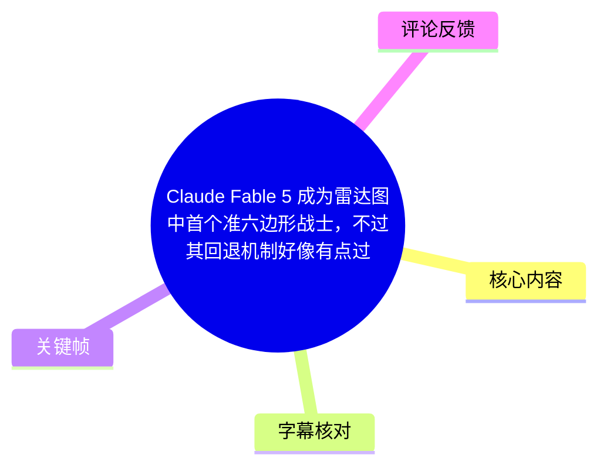
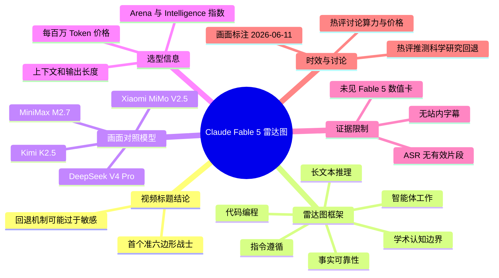
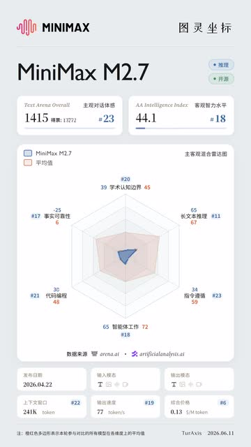
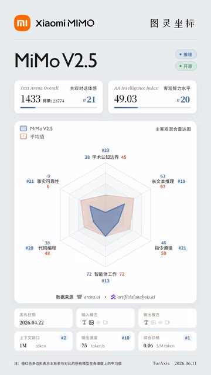
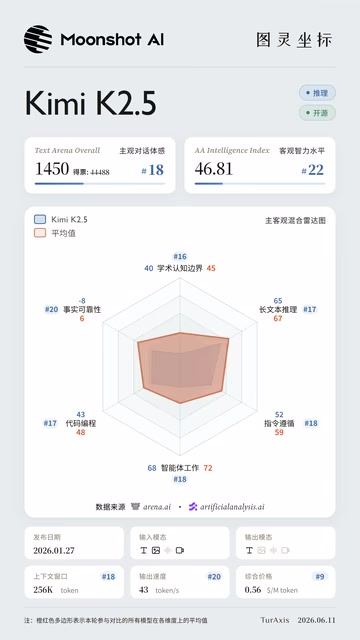
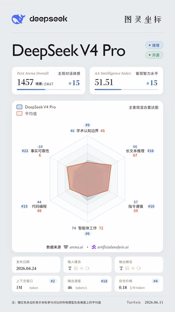

# Claude Fable 5 成为雷达图中首个准六边形战士，不过其回退机制好像有点过于敏感 | 浪浪妈雷达图

> 来源：[Bilibili 视频](https://www.bilibili.com/video/BV1VkEv6TEJ2)  
> UP 主：图灵坐标｜时长：3 分 58 秒｜合集：AIcode  
> 注意：本次未提供可用站内字幕；ASR 虽检测到音频文件，但未识别出任何语音片段。因此，以下内容严格以视频标题、元数据、可见关键帧与热评为依据，不将无法核实的口播内容补写为事实。

## 小结

视频标题聚焦 **Claude Fable 5** 在“浪浪妈雷达图”体系中的表现：其被描述为首个接近“准六边形战士”的模型，即在六个能力维度上可能呈现较均衡的雷达图形状。同时，标题明确保留了一个限制：其“回退机制”似乎过于敏感。由于没有可用字幕或有效 ASR 文本，视频并未能从现有素材中还原出该机制的具体触发条件、行为形式及测试案例。

所提供的关键帧展示了同一雷达图体系下的 MiniMax M2.7、Xiaomi MiMo V2.5、Kimi K2.5 与 DeepSeek V4 Pro。图表以学术认知边界、事实可靠性、长文本推理、指令遵循、智能体工作、代码编程六项能力构成雷达图，并同时列出 Text Arena Overall、AA Intelligence Index、发布日期、上下文窗口、输出长度和价格等信息。

从这些对照卡片可见，该雷达图不是只比较单一总分，而是把能力结构、榜单名次、上下文长度、输出上限与单价放在一起。对模型选型而言，重要的不只是“六边形是否饱满”，还包括模型是否在特定维度明显短板、价格是否可接受，以及其能力是否能稳定释放。

题目中关于 Claude Fable 5 的“准六边形”与“敏感回退”均属于视频标题直接表达的判断；现有关键帧并未包含 Claude Fable 5 的具体数值卡片，不能据其他模型的图表反推出 Fable 5 的分数、价格、上下文窗口或排名。

本视频及图表具有明显时效性。关键帧底部标注 `TurAxis 2026.06.11`，说明画面所示数据至少以该日期为基准；模型榜单、API 定价、上下文规格与产品策略均可能随后变化。热评中出现的“8.2 刀每 M token”仅为评论者说法，未由画面或字幕证实。

## 思维导图

## 目录

- [资料范围与阅读边界](#资料范围与阅读边界)
- [标题中的核心判断：准六边形与回退机制](#标题中的核心判断准六边形与回退机制)
- [雷达图指标与读取方法](#雷达图指标与读取方法)
- [关键帧中的模型对照](#关键帧中的模型对照)
  - [MiniMax M2.7](#minimax-m27)
  - [Xiaomi MiMo V2.5](#xiaomi-mimo-v25)
  - [Kimi K2.5](#kimi-k25)
  - [DeepSeek V4 Pro](#deepseek-v4-pro)
- [模型选型步骤、参数与限制](#模型选型步骤参数与限制)
- [时效性与结论](#时效性与结论)
- [字幕比对](#字幕比对)
- [评论分析](#评论分析)
- [处理记录](#处理记录)

## 资料范围与阅读边界 [00:00](https://www.bilibili.com/video/BV1VkEv6TEJ2?t=0)

本视频总时长为 238 秒。由于站内字幕未提供，且本次 ASR 结果为空，无法依据 ASR/SRT 的真实时间分段定位各个模型画面或口播论证位置。因此，本整理仅使用视频起点 `00:00` 作为全片资料入口，不把关键帧文件顺序误当作真实播放时间轴。

可以直接确认的材料包括：

1. **视频标题**：Claude Fable 5 被称为雷达图中首个“准六边形战士”，但回退机制“好像有点过于敏感”。
2. **四张可见的模型雷达图卡片**：MiniMax M2.7、MiMo V2.5、Kimi K2.5、DeepSeek V4 Pro。
3. **画面指标结构**：六项能力、两个综合榜单指标、发布日期、输入/输出长度、价格与数据来源。
4. **三条可获取热评**：分别讨论算力基础设施、每百万 Token 价格，以及科学研究场景中的“降智/回退”推测。

不能直接确认的材料包括：

- Claude Fable 5 的六项分数、排名、价格、上下文长度、发布日期；
- “回退机制”的产品定义、触发阈值、官方解释与复现步骤；
- 画面中各模型卡片在视频中的实际出现秒数；
- 热评中关于厂商动机、模型价格与算力建设的事实准确性。

## 标题中的核心判断：准六边形与回退机制 [00:00](https://www.bilibili.com/video/BV1VkEv6TEJ2?t=0)

### 1. “准六边形战士”的含义

“六边形战士”是对多维能力均衡、雷达图轮廓接近完整六边形的通俗说法。结合关键帧的图表结构，这里至少涉及六个维度：

- 学术认知边界；
- 事实可靠性；
- 长文本推理；
- 指令遵循；
- 智能体工作；
- 代码编程。

标题使用的是“**准**六边形”，而不是“六边形”，表明这更像一个对能力分布形状的评价，而非证明 Claude Fable 5 在所有项目上均排名第一。现有材料没有提供 Fable 5 的雷达图数值，故不能将其扩展为“六项均第一”或“整体最强”。

### 2. “回退机制过于敏感”的信息边界

标题中“好像”表明该判断带有观察性和保留性。现有素材只能确认视频提出了如下问题：

> Claude Fable 5 的回退机制可能过于敏感。

但无法从现有字幕、ASR 或关键帧确认：

- “回退”是指模型拒答、能力降级、路由到其他模型、上下文缩减，还是其他产品行为；
- 哪些提示词、任务类型或安全边界会触发回退；
- 回退后性能以何种基准衡量；
- 该现象是稳定复现、偶发问题，还是某个版本/套餐/地区下的特定行为。

因此，这一判断应被视作视频作者的主题性观点，而不是可独立验证的机制说明。

## 雷达图指标与读取方法 [00:00](https://www.bilibili.com/video/BV1VkEv6TEJ2?t=0)

关键帧中的图表以蓝色区域表示当前模型、浅红色区域表示“平均值”。每条轴旁同时提供模型数值、平均数值和部分排名信息。画面还在顶部给出两类综合指标：

| 信息区 | 画面标签 | 可用于判断什么 | 不应据此直接推出什么 |
| --- | --- | --- | --- |
| 综合竞技表现 | `Text Arena Overall` | 模型在该榜单中的总体表现及名次 | 不等同于六项任务能力的平均值 |
| 智能水平指数 | `AA Intelligence Index` | 另一套综合评价中的分数与名次 | 不等同于真实业务稳定性 |
| 六轴雷达图 | 六项能力维度 | 能力结构、偏科与短板 | 不足以说明全部场景效果 |
| 规格信息 | 输入长度、输出长度 | 上下文容量与单次输出上限 | 不等于实际可用上下文或稳定输出量 |
| 价格 | `$ / M token` | 按百万 Token 计的成本参考 | 未展示输入/输出分别计费、地区与套餐条件 |

> 图：该关键帧是理解图表方法的代表性样本。它将六轴能力轮廓与 Text Arena Overall、AA Intelligence Index、上下文窗口、最大输出和价格并列呈现，说明该系列评估关注的是“能力—规格—成本”的组合，而非单一跑分。

### 建议的图表阅读步骤

以下是根据画面结构整理的阅读流程，并非已核实的视频口播操作教程：

1. **先看六维轮廓是否均衡**：蓝色区域若在某一轴明显向内收缩，意味着该维度相对短板更明显。
2. **再看各轴的绝对数值与平均线**：模型值高于画面标注平均值，通常意味着在该维度超过图表所采用的对照均值。
3. **核对综合榜单**：使用 Text Arena Overall 与 AA Intelligence Index 观察不同评价体系下的位置，避免只看单一榜单。
4. **检查业务规格**：长上下文和高输出上限适合长文档、代码库或多轮 Agent 任务，但会影响延迟与成本。
5. **最后比较价格与稳定性风险**：低价不自动等于更适合生产；若模型存在敏感回退或任务中断现象，实际可用性需要用目标任务复测。

## 关键帧中的模型对照 [00:00](https://www.bilibili.com/video/BV1VkEv6TEJ2?t=0)

以下数值均为关键帧中可见文字的转录，仅描述该图表在其标注日期下呈现的信息。图中排名、均值和价格的评价口径未在现有字幕材料中解释，不能视为跨平台统一标准。

### MiniMax M2.7 [00:00](https://www.bilibili.com/video/BV1VkEv6TEJ2?t=0)

> 图：该卡片显示 MiniMax M2.7 的雷达图明显不是均匀六边形；其长文本推理和智能体工作相对更突出，而事实可靠性、代码编程和指令遵循的可见数值较低。这有助于理解“能力均衡”与“单项突出”是不同问题。

画面可见信息如下：

| 项目 | 关键帧可见值 |
| --- | --- |
| Text Arena Overall | 1415，#23 |
| AA Intelligence Index | 44.1，#18 |
| 学术认知边界 | 39；画面平均值 45 |
| 事实可靠性 | 25；画面平均值 45 |
| 长文本推理 | 65，#11；画面平均值 67 |
| 指令遵循 | 34，#23；画面平均值 59 |
| 智能体工作 | 65，#18；画面平均值 72 |
| 代码编程 | 30，#21；画面平均值 48 |
| 发布日期 | 2026.04.22 |
| 上下文长度 | 241K token，#22 |
| 输出长度 | 77 token，#19 |
| 价格 | 0.13 美元 / M token，#6 |

从图形上看，MiniMax M2.7 的蓝色区域在“长文本推理”和“智能体工作”方向延伸较多，而“事实可靠性”“指令遵循”“代码编程”相对收缩。这是典型的能力轮廓不均衡案例：综合使用时，需要先确认任务是否主要依赖其相对优势方向。

### Xiaomi MiMo V2.5 [00:00](https://www.bilibili.com/video/BV1VkEv6TEJ2?t=0)

> 图：该帧的关键价值在于同时展示了较大的 1M Token 上下文长度与较低价格。它提醒比较模型时，不能把雷达图能力与上下文容量、价格割裂开来。

| 项目 | 关键帧可见值 |
| --- | --- |
| Text Arena Overall | 1433，#21 |
| AA Intelligence Index | 49.03，#20 |
| 学术认知边界 | 38；画面平均值 45 |
| 事实可靠性 | 21，#21；画面平均值 45 |
| 长文本推理 | 63，#19；画面平均值 67 |
| 指令遵循 | 46，#21；画面平均值 59 |
| 智能体工作 | 72，#13；画面平均值 72 |
| 代码编程 | 38，#20；画面平均值 48 |
| 发布日期 | 2026.04.22 |
| 上下文长度 | 1M token，#2 |
| 输出长度 | 75 token，#10 |
| 价格 | 0.06 美元 / M token，#1 |

画面中 MiMo V2.5 的“智能体工作”为 72，与该图标示的平均值相同；“事实可靠性”为 21、“学术认知边界”为 38，均低于对应平均标注。其卡片最显著的规格信息是 `1M token` 上下文和 `0.06 美元 / M token` 价格。是否适合生产，仍需结合任务质量、调用限制、输出长度口径及实际 API 条款验证。

### Kimi K2.5 [00:00](https://www.bilibili.com/video/BV1VkEv6TEJ2?t=0)

> 图：该帧适合用于观察“接近平均轮廓”不代表所有指标领先。Kimi K2.5 的六轴数值在画面中较为完整，但多个维度仍低于相应平均线。

| 项目 | 关键帧可见值 |
| --- | --- |
| Text Arena Overall | 1450，#18 |
| AA Intelligence Index | 46.81，#22 |
| 学术认知边界 | 40，#16；画面平均值 45 |
| 事实可靠性 | 20，#20；画面平均值 45 |
| 长文本推理 | 65，#17；画面平均值 67 |
| 指令遵循 | 52，#18；画面平均值 59 |
| 智能体工作 | 68，#18；画面平均值 72 |
| 代码编程 | 43，#17；画面平均值 48 |
| 发布日期 | 2026.01.27 |
| 上下文长度 | 256K token，#18 |
| 输出长度 | 43 token，#20 |
| 价格 | 0.56 美元 / M token，#9 |

就画面显示的六轴数值而言，Kimi K2.5 的“指令遵循”52、“代码编程”43，较前两张卡片在这些方向上的轮廓更外扩；但它在图示平均线上仍有差距。价格栏显示 `0.56 美元 / M token`，在这四张可见卡片中高于 MiniMax M2.7、MiMo V2.5 和 DeepSeek V4 Pro 的画面价格。

### DeepSeek V4 Pro [00:00](https://www.bilibili.com/video/BV1VkEv6TEJ2?t=0)

> 图：该帧展示了更接近均衡的能力轮廓：长文本推理、指令遵循、智能体工作和代码编程方向相对突出。它可作为理解标题中“准六边形”概念的对照参考，但不能替代 Claude Fable 5 本身的图表。

| 项目 | 关键帧可见值 |
| --- | --- |
| Text Arena Overall | 1454，#15 |
| AA Intelligence Index | 51.51，#15 |
| 学术认知边界 | 46，#22；画面平均值 45 |
| 事实可靠性 | 10，#22；画面平均值 45 |
| 长文本推理 | 66，#16；画面平均值 67 |
| 指令遵循 | 57，#16；画面平均值 59 |
| 智能体工作 | 74，#16；画面平均值 72 |
| 代码编程 | 44，#15；画面平均值 48 |
| 发布日期 | 2026.04.24 |
| 上下文长度 | 46M token，#2 |
| 输出长度 | 46 token，#18 |
| 价格 | 0.18 美元 / M token，#4 |

DeepSeek V4 Pro 卡片中，“学术认知边界”46 高于图中平均值 45，“智能体工作”74 高于平均值 72；其余可见维度中，长文本推理 66、指令遵循 57、代码编程 44 均接近但低于对应平均标注。值得注意的是，画面中“事实可靠性”显示为 10，显著低于标注平均值 45；这也说明即使雷达图整体轮廓较大，仍需逐轴检查，而不能只凭面积或视觉印象判断。

## 模型选型步骤、参数与限制 [00:00](https://www.bilibili.com/video/BV1VkEv6TEJ2?t=0)

### 面向实际任务的选择流程

依据关键帧所展示的比较结构，可采用以下审查顺序：

1. **定义任务权重**  
   明确任务更依赖事实可靠性、代码编程、Agent 执行、长文本推理还是指令遵循。六维雷达图的价值在于显示取舍，而不是宣布唯一冠军。

2. **逐项看能力，不只看总榜**  
   Text Arena Overall 和 AA Intelligence Index 都是综合指标；若业务是检索增强问答、金融分析、代码代理或多工具自动化，应重点核验对应的关键维度。

3. **核对输入与输出约束**  
   关键帧同时使用“上下文长度”和“输出长度”两类参数。前者影响可一次性放入的资料范围，后者影响单轮可生成内容的规模。图中“77 token”“75 token”等单位与通常产品说明是否完全同口径，未有字幕解释，接入前应查阅官方文档。

4. **按百万 Token 比较成本，但确认计费口径**  
   图中价格单位为 `$ / M token`。在实际预算中，至少还需核实输入与输出是否分别计费、缓存命中是否折扣、批量接口是否不同价、是否有地区/套餐差异。

5. **对高风险任务做回退与拒答测试**  
   对标题所提出的“回退机制敏感”问题，应建立任务集，记录正常回答、拒答、降级输出、重试成功率与上下文变化。由于视频现有资料未给出触发条件，不能预先假定问题只发生在科学研究或任何特定领域。

### 图表本身的限制

- 图表底部标注的数据来源为 `arena.ai` 与 `artificialanalysis.ai`，但现有材料未说明数据抓取日期、指标融合方式、样本规模或排名计算方法。
- 雷达图的“平均值”只说明该图采用了一组平均基准，未说明样本集合、均值类型或是否随版本更新。
- 关键帧未展示 Claude Fable 5 的卡片，不能用其他四个模型的参数代替其参数。
- 标题中的“回退机制”未有画面或字幕定义，不能把它等同于安全拒答、推理降级或模型路由。
- 画面为竖屏信息卡，个别数字和排名虽可辨认，但缺少原始数据表，适合用于趋势观察，不宜作为采购合同或性能承诺的唯一依据。

## 时效性与结论 [00:00](https://www.bilibili.com/video/BV1VkEv6TEJ2?t=0)

本视频最值得保留的观点是：评价模型不应只看单项榜单，而应看六维能力是否均衡，并把性能、上下文、输出能力、成本和稳定性放入同一个决策框架。视频标题将 Claude Fable 5 定位为“准六边形战士”，说明其核心卖点是综合能力结构；同时，“回退机制过于敏感”提示稳定性和策略行为可能构成实际使用中的限制。

不过，现有证据不足以验证该结论的具体程度。没有 Claude Fable 5 的数值画面、无可用站内字幕、ASR 无任何有效转写，故不能重建作者的测试样本、方法、对手模型和结论推导过程。

画面统一标注 `TurAxis 2026.06.11`。即便模型卡片所列发布日期较早，榜单名次、价格、上下文上限和模型版本仍可能在之后发生更新。阅读或引用本文时，应把图中的数值视为该画面日期附近的快照，并以模型官方文档、API 控制台及可复现测试作为最新决策依据。

## 字幕比对 [00:00](https://www.bilibili.com/video/BV1VkEv6TEJ2?t=0)

| 字幕来源 | 完整性 | 专有名词 | 时间轴 | 主要问题 |
| --- | --- | --- | --- | --- |
| Bilibili 站内字幕 | 未提供可用字幕 | 无法核验 | 无可用时间分段 | 无法用于还原口播、术语和章节位置 |
| 本次 ASR 字幕 | 为空，0 个语音片段 | 无法识别 | ASR 虽启用时间戳，但没有输出分段 | 语言识别为英语的置信度为 0.5410；诊断提示未识别到语音片段 |

本次 ASR 使用 `medium` 模型、CUDA 与 `float16` 推理，输入音频时长约为 `237.397` 秒，与视频 238 秒总时长基本一致。ASR 诊断显示：

- `sentenceCount: 0`
- `speechSeconds: 0`
- `speechCoverage: 0`
- 无首段、末段及时间戳片段
- 警告为“未识别到语音片段，请核验是否存在可听语音并使用正确音轨重试”

诊断中**没有** `noAudioStream=true` 标记，因此不能断言源视频没有音轨；只能如实记录为：本次提取到了音频文件，但 ASR 未能识别出语音内容。最终未采用任何字幕文本，而采用视频标题、元数据、可见关键帧与热评进行有限整理。

通过关键帧可以核对的专有名称包括：MiniMax M2.7、Xiaomi MiMo V2.5、Moonshot AI Kimi K2.5、DeepSeek V4 Pro、Text Arena Overall、AA Intelligence Index、arena.ai、artificialanalysis.ai 与 TurAxis。标题中的 `Claude Fable 5` 亦保留原写法；现有画面不足以校正其官方产品命名或版本拼写。

## 评论分析 [00:00](https://www.bilibili.com/video/BV1VkEv6TEJ2?t=0)

仅处理可获取热评前三条。评论是用户观点，不构成视频事实或独立验证结论。

### 1. 摩尔罗斯｜658 赞

> “明年OpenAI和A家模型会更恐怖，老黄计算卡迭代速度太猛了，现在这两家甚至还在大规模用gb200和gb300，A家算力基建其实不如OpenAI”

**观点概括：** 评论者认为未来 OpenAI 与“A 家”模型会因 NVIDIA 计算卡快速迭代而增强，并进一步判断 A 家算力基础设施弱于 OpenAI。  

**补充价值：** 该评论将模型能力竞争延伸到训练和推理基础设施，提示模型表现可能受算力供给、芯片代际与部署规模影响。  

**可信度与限制：** 评论没有提供数据来源，也没有定义“A 家”、GB200/GB300 的具体部署规模或比较口径；“基础设施不如 OpenAI”属于未证实判断，不能据此推导任何模型的实际能力高低。

### 2. mapleleaf-x｜331 赞

> “8.2刀每mtoken？我的妈”

**观点概括：** 评论者对“每百万 Token 8.2 美元”的价格表达了明显的成本担忧。  

**补充价值：** 它反映出观众高度关注 API 单价，尤其在 Agent、多轮推理或长上下文任务中，单位 Token 价格会直接影响可用性。  

**可信度与限制：** 现有关键帧展示的四个对照模型价格为 0.06、0.13、0.18、0.56 美元 / M token，未出现 8.2 美元数值；无法确认评论所指是否为 Claude Fable 5、输入价、输出价、特殊套餐，或其他计费单位。因此不能将“8.2 刀”写作已验证的 Fable 5 定价。

### 3. fumakeqin｜246 赞

> “fable有一点被诟病，是因为在进行科学研究的时候会降智，降智的原因是A家不希望别人用他家大模型去改进自己家的大模型”

**观点概括：** 评论者声称 Fable 在科学研究任务中会“降智”，并推测原因是厂商不希望模型被用于改进其他模型。  

**补充价值：** 该观点与视频标题中的“回退机制可能过于敏感”形成关联，提出了一个可能需要测试的场景：科学研究或高技术任务。  

**可信度与限制：** 这是对产品行为和厂商意图的双重推测。评论未给出提示词、模型版本、复现记录、官方政策或对照实验；现有视频素材同样无法验证其因果解释。它最多可作为后续测试假设，而不能作为结论。

## 评论分析

- 热评 1：明年OpenAI和A家模型会更恐怖，老黄计算卡迭代速度太猛了，现在这两家甚至还在大规模用gb200和gb300，A家算力基建其实不如OpenAI
- 热评 2：8.2刀每mtoken？我的妈
- 热评 3：fable有一点被诟病，是因为在进行科学研究的时候会降智，降智的原因是A家不希望别人用他家大模型去改进自己家的大模型

以上内容是观众反馈摘录，只用于补充理解视频反响，不作为正文事实依据。

## 处理记录

- Worker ID：`worker-mrj0wbly-5dc4e50c`
- 模型：`gpt-5.6-terra`
- 可用 ASR 模型与运行参数：`medium` / CUDA / `float16` / 自动语言识别；识别语言为英语，置信度 `0.541015625`
- 使用的素材工具产物：视频元数据、音频文件 `audio/audio.wav`、关键帧目录 `frames/`、ASR 诊断与空转写结果、热评 JSON、封面与页面信息。
- 字幕选择：站内字幕未提供可用内容；本次 ASR 输出为空且无时间片段，故未采用字幕文本。正文改由标题、元数据、可见关键帧和热评交叉整理。
- 关键帧选择依据：
  - `frames/frame-001.jpg`：MiniMax M2.7，清楚呈现整套雷达图的字段结构与能力—成本组合；
  - `frames/frame-002.jpg`：Xiaomi MiMo V2.5，突出 1M Token 上下文与低价信息；
  - `frames/frame-003.jpg`：Kimi K2.5，用于展示六维能力与平均线的逐轴比较；
  - `frames/frame-004.jpg`：DeepSeek V4 Pro，用于说明较均衡轮廓仍需检查单项短板。
- 时间轴依据：没有可用站内 SRT 或 ASR 分段时间，不能合法推定各内容段的出现时刻；所有章节链接仅定位视频真实起点 `00:00`，不伪造关键帧时间。
- 缓存清理：未提供缓存清理日志，无法确认是否已执行清理。
- 未解决问题：
  1. Claude Fable 5 的具体雷达图、规格、价格和排名未出现在所提供关键帧中；
  2. “回退机制”的定义、触发场景和可复现证据缺失；
  3. 音频存在但 ASR 无识别结果，无法还原视频口播论据；
  4. 图表数据源、指标计算口径、价格计费口径及排名更新时间未在现有资料中说明。
