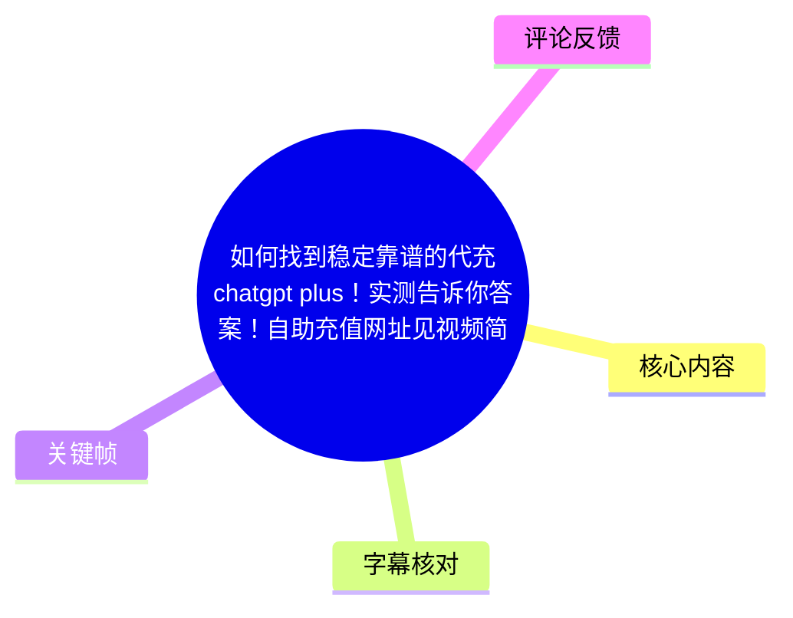
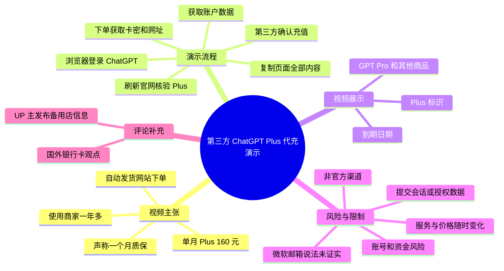
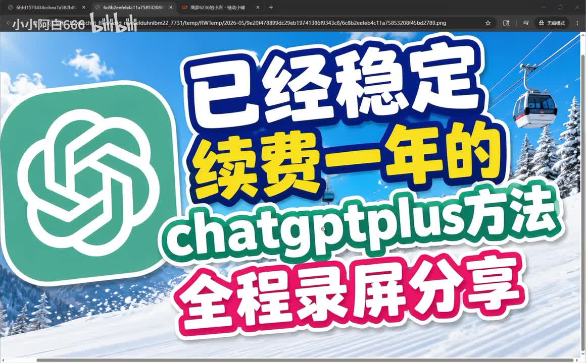
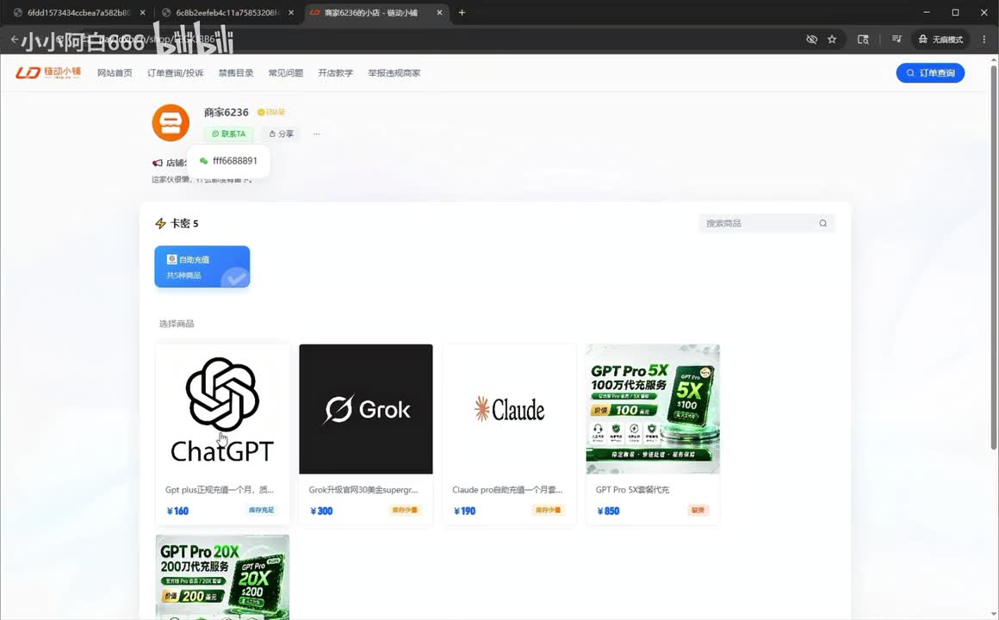

# 如何找到稳定靠谱的代充chatgpt plus！实测告诉你答案！自助充值网址见视频简介

> 来源：[Bilibili 视频](https://www.bilibili.com/video/BV1Aew9z2EXr) 
> UP 主：小小阿白666｜时长：04:15｜分区合集：AIcode  
> 视频简介包含一个第三方“24 小时自动发货”链接；本文不将其视为官方渠道或安全背书。

## 小结

视频是一则第三方 ChatGPT Plus 代充/自助充值服务的推广与录屏演示。UP 主称自己已使用该商家“一年多”，并称其从淘宝、闲鱼转至独立自动发货网站下单；这些均为视频发布者的陈述，素材未提供独立验证。

视频给出的价格信息是：第三方页面中，ChatGPT Plus 单月充值标价为 **160 元**，UP 主声称“带一个月质保”。录屏还展示了同一商家页面上的 ChatGPT、Grok、Claude 及 GPT Pro 等商品，但页面存在的商品、价格和库存均可能随时调整，不能据此推断当前仍可购买或服务有效。

操作演示的关键环节是：用户在第三方充值页选择登录/获取数据，并将跳转页面中的“全部内容”复制、粘贴到代充页面后确认充值。这一流程涉及向第三方提交与账户会话或授权相关的数据，存在账号接管、会话泄露、违反平台条款、资金损失及服务中断等显著风险。视频没有说明该数据的具体类型、保存期限、权限范围、撤销机制或商家安全措施。

UP 主特别提醒使用微软邮箱注册 ChatGPT 的用户换绑邮箱，理由是“最近微软邮箱被官网针对、会频繁封号”。这是一项未被视频证据或官方公告佐证的单方说法；不能将其当作 OpenAI 或微软的正式政策。若需管理账户邮箱，应仅在服务官方账户设置中操作，并先核实官方支持文档。

视频最终以“Plus 已激活”和到期日展示作为一次录屏结果；它不能证明该方式对其他账号、地区、支付状态或后续续费都稳定可靠。对于重视账户安全、长期可用性或合规性的用户，更稳妥的原则是优先使用官方订阅入口与本人可控的支付方式，避免向非官方页面提交登录态、页面源码、Cookie、令牌或验证码。

## 思维导图

## 目录

- [视频定位、来源与时效性](#视频定位来源与时效性)
- [第三方服务的主张与页面信息](#第三方服务的主张与页面信息)
- [录屏中的充值流程及安全边界](#录屏中的充值流程及安全边界)
- [演示结果、邮箱换绑与扩展商品](#演示结果邮箱换绑与扩展商品)
- [结论与限制](#结论与限制)
- [关键帧索引](#关键帧索引)
- [字幕比对](#字幕比对)
- [评论分析](#评论分析)
- [处理记录](#处理记录)

## 视频定位、来源与时效性 [00:00](https://www.bilibili.com/video/BV1Aew9z2EXr?t=0)

视频标题将内容定位为“稳定靠谱的代充 ChatGPT Plus”实测，实际内容为 UP 主对某第三方商家的推荐、其独立下单页面展示，以及一次自助充值录屏。视频总时长约 255 秒，本次 ASR 检出有效中文音频，覆盖约 221.31 秒，占视频时长约 86.89%。

需要区分以下三类信息：

1. **视频可直接观察到的内容**：网页中有第三方商品卡片、录屏中有“Plus”标识及一个到期日期、流程中要求粘贴页面内容。
2. **UP 主的个人陈述**：使用时长、商家稳定性、质保、淘宝和闲鱼销售状态、微软邮箱容易被封等。
3. **不能由素材验证的外部事实**：第三方服务的合法性、是否获得官方授权、是否真正安全、能否长期续费、是否适用于所有国家/地区与账号。

元数据显示视频简介提供第三方自动发货地址；这类外链与商品状态高度时效化。视频中还提及“今天是 5 月 10 号、6 月 10 号到期”，但该画面时间与元数据发布时间存在时间线不一致，且无法从现有素材确认截图的实际年份，因此仅能视为该次录屏中的显示结果。

> 图：封面直接概括了视频的营销主张。它有助于识别视频主题是第三方充值方式展示，而非 OpenAI 官方订阅教程。

## 第三方服务的主张与页面信息 [00:25](https://www.bilibili.com/video/BV1Aew9z2EXr?t=25)

UP 主在 [00:00–00:50](https://www.bilibili.com/video/BV1Aew9z2EXr?t=0) 表示，自己使用 ChatGPT 已有较长时间，并一直在该商家下单；其称商家此前曾在淘宝销售，后来淘宝“不让卖”，闲鱼也“几乎找不到”，目前通过自动发货网站下单。上述平台销售状态仅为口述，视频没有展示平台规则、店铺历史或官方公告。

在 [00:25–00:50](https://www.bilibili.com/video/BV1Aew9z2EXr?t=25)，UP 主称：

- ChatGPT Plus“正规充值”单月价格为 **160 元**；
- 商家提供“一个月质保”；
- 链接在视频简介和置顶评论中可找到，且提醒置顶评论可能消失。

这里的“正规”“质保”均没有在素材中给出定义、协议条款、赔付条件或执行证据。尤其是“质保”至少需要明确覆盖场景、起止时间、提交材料、处理时限、退款方式与免责条款；视频未展示这些内容。

关键帧中的第三方店铺页面可见多个商品卡片，包括 ChatGPT、Grok、Claude 和 GPT Pro 类商品。ChatGPT 商品卡显示价格 **¥160**；Grok、Claude 等商品也展示各自价格，但这些是截图时页面信息，不能视为当前报价或官方定价。

> 图：该帧是理解视频商业模式的关键证据：演示并非在 OpenAI 官方订阅页面直接付款，而是在聚合多个 AI 产品的第三方商品页内选择服务。页面商品存在不等于这些服务获得官方授权。

## 录屏中的充值流程及安全边界 [01:23](https://www.bilibili.com/video/BV1Aew9z2EXr?t=83)

### 视频演示的顺序

以下是视频描述的实际流程，用于风险识别与审阅；**不建议将账户会话、页面全部内容、Cookie、令牌、验证码或其他登录凭据提交给任何非官方页面**。

1. **下单并获取信息**  
   [01:23–01:31](https://www.bilibili.com/video/BV1Aew9z2EXr?t=83)，UP 主称下单后会收到“卡密”和“自助充值网址”。

2. **在浏览器中登录 ChatGPT 账户**  
   [01:40–01:59](https://www.bilibili.com/video/BV1Aew9z2EXr?t=100)，视频称若当前浏览器没有登录 ChatGPT，需要先前往登录；若已登录，则点击“已登录获取数据”。UP 主说明其演示账号当时为免费版。

3. **复制跳转页面中的全部内容并粘贴**  
   [01:40–02:06](https://www.bilibili.com/video/BV1Aew9z2EXr?t=100)，这是全片风险最高的步骤。UP 主明确说“把这个页面里面的全部复制下来，然后给它粘贴到这里”。  
   素材未解释这些内容是否含有会话凭据、浏览器存储数据、账户标识、临时授权信息或其他敏感数据，也未展示最小权限范围。

4. **发起并确认第三方充值**  
   [01:59–02:06](https://www.bilibili.com/video/BV1Aew9z2EXr?t=120)，在代充页点击“开始充值”，确认是自己的账号后再点击“确认充值”。

5. **返回官网刷新并检查状态**  
   [02:15–02:32](https://www.bilibili.com/video/BV1Aew9z2EXr?t=135)，UP 主返回 ChatGPT 页面刷新，并以左下角出现 Plus 标识及账户中显示到期日作为到账依据。

### 为什么该流程需要高度谨慎

视频将流程描述为“没有任何操作难度”，但操作难度与安全性并不等同。第三方要求用户复制“页面全部内容”时，用户通常无法凭直觉判断所交出的信息是否可用于重放会话、修改账户设置或在其他设备访问账户。

视频未展示或说明以下关键问题：

- 第三方收集的信息字段、传输方式与加密机制；
- 数据是否持久化保存、保存多久、谁可访问；
- 是否会请求或间接获取 Cookie、会话令牌、OAuth 授权码或 MFA 相关数据；
- 账户异常、订阅被撤销、付款争议时的责任主体；
- 与 ChatGPT/OpenAI 服务条款、地区限制及支付政策的兼容性；
- 如何撤销授权、退出全部会话、修改密码与恢复账户。

因此，视频展示的是一次成功案例，不是可证明安全、合规或可复制的充值方案。若用户已经向非官方站点提交过潜在登录态数据，应优先在官方账户安全设置中检查活跃会话和第三方授权、修改密码、启用多因素认证，并留意异常登录或账户设置变更。

## 演示结果、邮箱换绑与扩展商品 [02:15](https://www.bilibili.com/video/BV1Aew9z2EXr?t=135)

### 单次到账展示 [02:15](https://www.bilibili.com/video/BV1Aew9z2EXr?t=135)

UP 主在操作后展示“GPT Plus 已激活”，并称返回官网刷新即可看到左下角 Plus 标识。其还称账户设置页面显示到期日：画面口述为“今天是 5 月 10 号”，显示“6 月 10 号到期”，据此判断为一个月。

这个结果可以证明录屏中该账号当时显示了 Plus 状态，但存在边界：

- 无法确认该订阅最终资金来源、支付路径或是否符合官方政策；
- 无法确认该 Plus 状态会否被后续撤销；
- 无法确认质保是否实际履行；
- 无法证明其他账户、地区、浏览器环境或时间点均能复现；
- 画面所称日期与视频元数据时间存在不一致，不能据此建立准确的事件日期。

### 微软邮箱换绑说法 [02:58](https://www.bilibili.com/video/BV1Aew9z2EXr?t=178)

在 [00:52–01:22](https://www.bilibili.com/video/BV1Aew9z2EXr?t=52) 和 [02:58–03:24](https://www.bilibili.com/video/BV1Aew9z2EXr?t=178)，UP 主两次建议微软邮箱注册的用户换绑邮箱，声称微软邮箱“被官网针对”且会频繁封号；并展示路径概念为“设置 → 账户 → 电子邮件”，称可换为 QQ、163 或 Google 邮箱等非微软邮箱。

应注意：

- 视频没有给出 OpenAI、微软或其他官方来源来支持“被针对”的说法；
- 账户封禁通常可能涉及多种因素，不能仅根据邮箱域名归因；
- 即使需要更换邮箱，也应在官方服务的账户设置中完成，避免通过第三方页面操作；
- 可否换绑、允许的邮箱类型、验证要求和地区可用性都可能随产品规则更新而变化。

### 视频提及的其他产品 [03:26](https://www.bilibili.com/video/BV1Aew9z2EXr?t=206)

在 [03:26–04:06](https://www.bilibili.com/video/BV1Aew9z2EXr?t=206)，UP 主称若 Plus 不够用，该商家还提供 GPT Pro 的“100 美金”与“200 美金”档位；还提到 Google Cloud 与“Gemini”（ASR 将其误识别为“Dimini”），并称其中部分产品同样采用自助充值加网址的形式。

这部分是商品推广信息，并非关于 GPT Pro、Google Cloud 或 Gemini 官方购买方式的说明。视频没有交代：

- 这些档位的实际权益、使用限制、地区资格；
- 第三方价格是否与官方定价一致；
- 是账号共享、礼品兑换、代付、余额充值还是其他履约模式；
- 各服务的官方条款是否允许此类操作。

> 图：该帧补充说明该店铺并非只提供 ChatGPT Plus，而是同时售卖多个 AI 产品相关服务。它提示用户应逐项核验产品来源、履约方式和条款，不能因为某一次录屏成功而泛化信任全部商品。

## 结论与限制 [04:08](https://www.bilibili.com/video/BV1Aew9z2EXr?t=248)

视频最有价值的信息不是“某店一定可靠”，而是揭示了一类第三方代充的常见交互模式：外部商品页下单、获得卡密/链接、基于浏览器登录状态提取或提交数据、由第三方完成订阅变更、再回官方页面检查结果。

但该模式的风险也恰恰集中在账户数据交接环节。视频没有提供独立的安全审计、用户协议、服务资质、官方授权、隐私政策、长期履约记录或争议处理证据。因此，不应把 UP 主的“一年多使用”“稳定靠谱”“带质保”等描述提升为经验证结论。

### 可迁移的核验清单

面对任何第三方 AI 订阅服务，可先检查：

- 是否要求复制网页“全部内容”、导出 Cookie、提交令牌、验证码或远程控制设备；
- 是否明确说明付款与订阅的实际履约主体；
- 是否能在服务官方页面直接完成购买、查看账单并管理订阅；
- 是否有可核验的条款、隐私政策、退款机制与客服责任主体；
- 是否存在明显低于官方价格但没有解释来源的报价；
- 是否要求规避地区、支付或账户限制；
- 是否有账户被收回、权益消失、订阅撤销时的处理规则。

### 时效性说明

- 视频元数据、商品页价格、第三方库存、链接可用性和平台规则均可能变化。
- 视频中的单月 **160 元**、一个月“质保”、GPT Pro 档位及其他商品均仅代表录屏/口述时信息。
- 微软邮箱相关观点没有官方佐证，后续产品规则也可能调整。
- 本文根据素材整理，不对任何第三方链接、商家或操作方式作推荐。

## 关键帧索引

| 关键帧 | 对应内容 | 使用价值 |
| --- | --- | --- |
|  | `frames/frame-001.jpg` | 展现视频的核心宣传语：“稳定一年”“全程录屏分享”，帮助识别其推广性质。 |
|  | `frames/frame-003.jpg` | 展示第三方店铺中的 ChatGPT、Grok、Claude、GPT Pro 等商品卡及 ChatGPT 的 ¥160 页面标价。 |
|  | `frames/frame-004.jpg` | 与前一帧共同佐证该页面是多产品聚合销售页，而不是单一官方订阅界面。 |

## 字幕比对

| 字幕来源 | 完整性 | 专有名词 | 时间轴 | 主要问题 |
| --- | --- | --- | --- | --- |
| Bilibili 站内字幕 `p01-ai-zh.srt` | 与视频主题完全不匹配 | 出现健身训练术语，如“一分化、三分化、五分化、渐进超负荷” | 分段完整覆盖约 00:00–03:45，但内容对应另一条健身视频 | 不能用于本视频事实整理或时间定位。 |
| 本次 ASR 字幕 | 覆盖约 221.31 秒，约占 254.70 秒的 86.89% | ChatGPT、Plus、GPT Pro、Google Cloud、Gemini 等可结合画面与上下文校正 | 15 段带真实起止时间；存在两段约 8–9 秒空白 | 自动识别将 ChatGPT、充值、换绑等词多次误识别；将 Gemini 识别为“Dimini”。 |

### 最终字幕选择与校正原则

本次采用 **ASR 时间轴** 作为章节定位依据，因为其内容与视频录屏主题一致，且 `asr-result.json` 显示源文件存在音频流、语言为中文、未标记 `noAudioStream=true`。站内字幕虽有完整时间轴，但内容实际是健身训练讲解，与本视频无关，已排除。

结合标题、画面文字、元数据和语义上下文，对 ASR 的主要校正如下：

| ASR 识别结果 | 本文采用表述 | 校正依据 |
| --- | --- | --- |
| “恰GP”“XGT”“GPt” | ChatGPT | 视频标题、封面和商品卡均出现 ChatGPT。 |
| “充职”“冲置” | 充值 | 全片语义为第三方订阅充值。 |
| “换榜”“换保” | 换绑 | 语境为账户电子邮箱变更。 |
| “Dimini” | Gemini | UP 主在 Google Cloud 后提及谷歌 AI 产品，结合常见产品名称作最小必要校正。 |
| “再编ference到期日期” | 到期日期 | 后文明确口述 5 月 10 日至 6 月 10 日。 |

ASR 在 [01:31–01:40](https://www.bilibili.com/video/BV1Aew9z2EXr?t=91) 与 [02:06–02:15](https://www.bilibili.com/video/BV1Aew9z2EXr?t=126) 存在较大未识别间隔；本文没有将这些时段补写为具体操作事实。

## 评论分析

仅获取到 2 条热评，未获得第 3 条可分析内容；以下评论均为用户表达，不构成事实验证。

1. **Sherry丶雪莉｜206 赞**  
   评论：“有个国外的银行卡。随便充[doge]”。  
   该评论表达了拥有境外银行卡即可直接充值的看法，隐含的替代方向是使用可用支付卡走常规支付渠道。评论没有说明适用国家/地区、卡种、支付失败情形或官方可用性，不能据此认定“随便充”。

2. **小小阿白666｜173 赞**  
   评论：“卖家备用店：芒果味的秋风2店”。  
   这是 UP 主发布的备用店信息，说明其推荐服务存在多个店铺入口或店铺迁移安排。该信息是推广补充，不提供商家安全性、授权资质或履约能力的独立证据；对用户而言反而增加了辨别仿冒、账号与支付风险的必要性。

## 处理记录

- **Worker ID**：worker-mrj0wbly-5dc4e50c
- **模型**：gpt-5.6-terra
- **ASR 模型与运行信息**：`medium`，中文识别，CUDA / float16；音频时长约 254.70 秒。
- **使用的素材工具产物**：视频元数据、`asr/asr-result.json`、`asr/transcript.srt`、站内字幕 `p01-ai-zh.srt`、关键帧目录 `frames/`、热评数据 `comments/comments.json`。
- **字幕选择**：已检查站内字幕和本次 ASR。站内字幕内容为健身训练，和视频不匹配；采用本次 ASR 的真实分段时间作为时间轴，并以标题、画面和上下文校正专有名词。
- **关键帧选择依据**：选用封面帧说明内容定位，选用店铺商品页帧核验视频确实展示第三方多产品页面及当时可见标价；未从画面无法辨识之处延伸推断服务真实性。
- **缓存清理**：素材中未提供缓存删除或清理日志，无法确认是否执行缓存清理，故不作已清理声明。
- **未解决问题**：无法从素材验证第三方商家身份、服务授权、数据处理方式、质保兑现、订阅资金来源、长期稳定性和链接当前可用性；视频内日期与元数据发布时间存在不一致，无法判定录屏具体日期。
