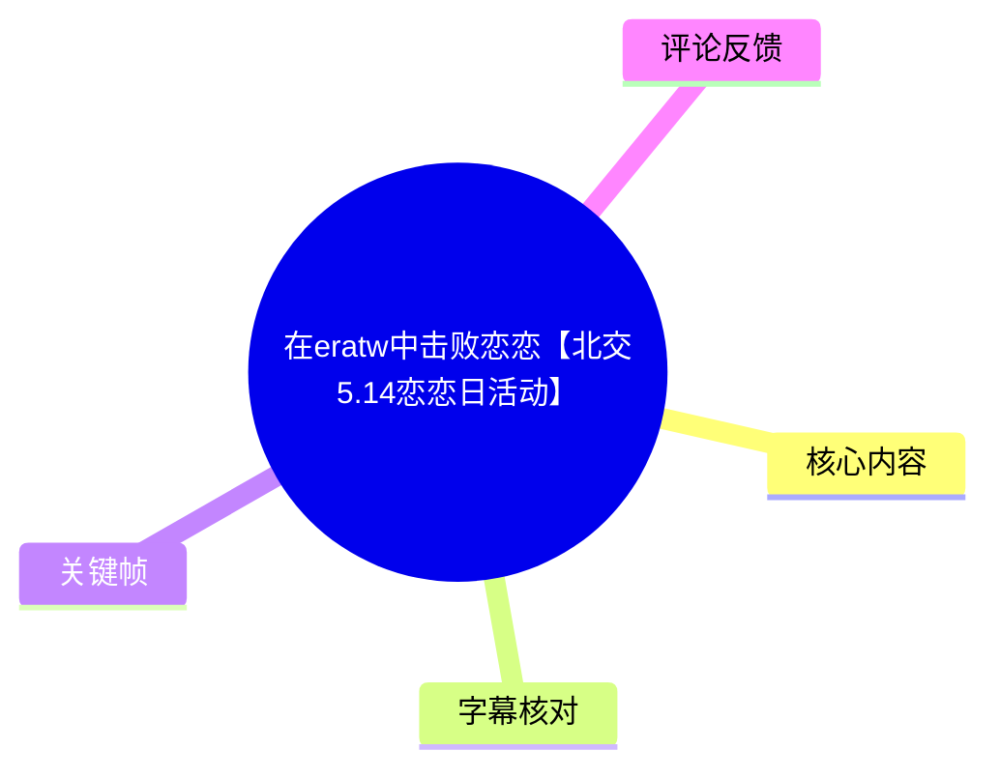
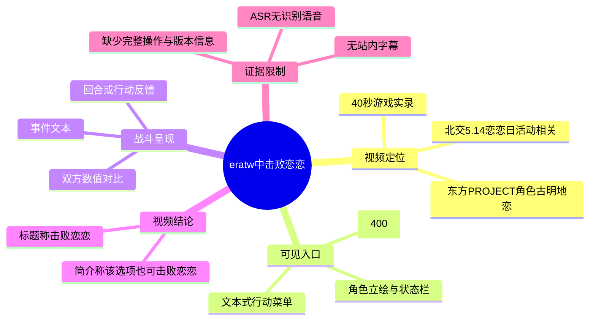
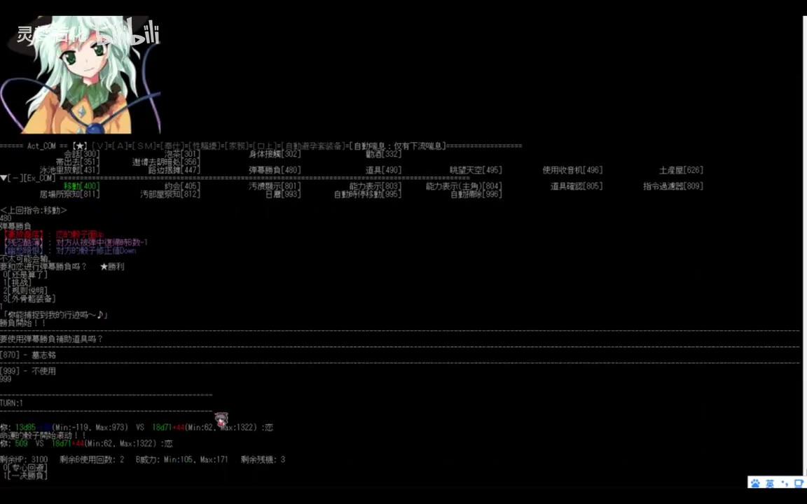
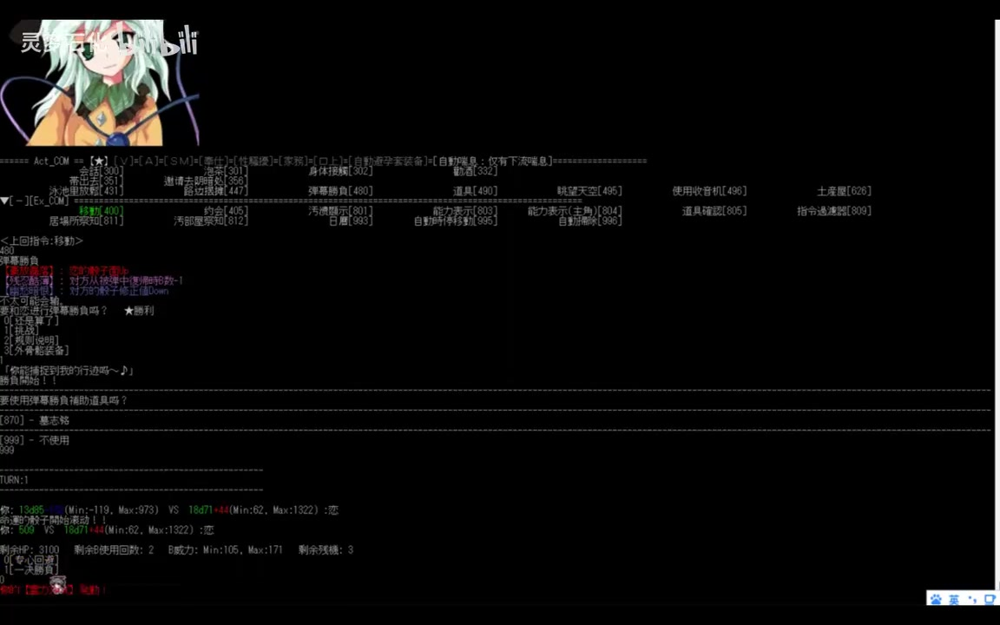

# 在eratw中击败恋恋【北交5.14恋恋日活动】

> 来源：[Bilibili 视频](https://www.bilibili.com/video/BV11BVrzyEtY)  
> UP 主：灵梦石化｜发布于：2025-05-05｜时长：00:40｜合集：AIcode  
> 视频简介：`eratw中有打弹幕游戏的选项，这个也可以击败恋恋（`

## 小结

这是一段时长 40 秒的《eratw》游戏实录。视频标题与简介明确表达的核心信息是：在《eratw》中进入“弹幕射击”选项，可以以弹幕游戏的方式与古明地恋（恋恋／Koishi）对战，并达成“击败恋恋”的结果。

画面显示《eratw》采用以文本、状态栏、菜单编号和数值反馈为核心的界面。开头处可见角色立绘、行动菜单与“弹幕射击[400]”项目；随后画面进入事件/战斗文本与双方数值对比界面，说明视频并非展示传统全屏弹幕射击游戏，而是展示《eratw》内部的相关选项及其结果流程。

对想确认“《eratw》中是否存在可用于与恋恋战斗的弹幕射击功能”的观众而言，这段视频提供了直接的界面证据。其价值主要在于指出功能入口与玩法形式，而不是给出完整攻略、角色养成方案或稳定复现的详细配置。

需要注意，视频没有可用的站内字幕；本次 ASR 也未识别出任何语音片段。因此，本文对具体菜单、状态及结果的整理主要依据视频标题、简介和关键帧中的可见文字。无法从素材中确认完整的前置条件、角色数值来源、胜利判定规则、操作按键与每项菜单的精确含义。

该视频发布于 2025-05-05，标签关联“北交5.14恋恋日活动”。活动、游戏版本、菜单编号、数值平衡与可选角色均可能在后续版本中变化，不能将本片画面视为长期有效的完整规则文档。

## 思维导图

## 目录

- [视频背景与可验证范围](#视频背景与可验证范围-0000)
- [界面入口：弹幕射击选项](#界面入口弹幕射击选项-0000)
- [战斗/事件界面的数值反馈](#战斗事件界面的数值反馈-0000)
- [结果、经验与复现边界](#结果经验与复现边界-0000)
- [关键帧说明](#关键帧说明-0000)
- [字幕比对](#字幕比对-0000)
- [评论分析](#评论分析-0000)
- [处理记录](#处理记录-0000)

## 视频背景与可验证范围 [00:00](https://www.bilibili.com/video/BV11BVrzyEtY?t=0)

视频标题为“在eratw中击败恋恋【北交5.14恋恋日活动】”，UP 主为“灵梦石化”。元数据标签包括“东方PROJECT”“古明地恋”“东方”“【北交5.14恋恋日活动】”“514”“弹幕射击游戏”“koishi”“eratw”。

从视频简介可确认的作者说明只有一句：

> `eratw中有打弹幕游戏的选项，这个也可以击败恋恋（`

因此，以下两点属于作者明确表达、且与画面相互支持的信息：

1. 《eratw》中存在“打弹幕游戏”的选项；
2. 作者将该选项用于与恋恋相关的对抗，并以“击败恋恋”作为视频标题结论。

视频本身没有旁白，也没有可用字幕来补充背景设定。故“eratw”的完整版本、模组来源、角色初始状态、活动具体规则，以及“击败”的系统判定条件，都不能仅凭本素材补全。

## 界面入口：弹幕射击选项 [00:00](https://www.bilibili.com/video/BV11BVrzyEtY?t=0)

视频开头是以文字为主的游戏界面：左侧显示浅绿色头发角色立绘，顶端与中部密集展示日期、地点、状态、菜单与编号等信息；底部为可选行动列表。

在菜单区域中，可见绿色高亮的“弹幕射击[400]”条目。这是本视频最关键的可见功能入口。方括号中的 `400` 看起来是该界面用于标识行动或菜单项目的编号；素材没有说明它是否同时代表消耗、优先级、脚本编号或其他系统参数，因此不应将其解释为资源数值。

![《eratw》文本式主界面与“弹幕射击[400]”菜单入口](frames/frame-001.jpg)

> 图：关键帧展示了角色立绘、状态信息与底部行动菜单，其中“弹幕射击[400]”以绿色显示。它直接支撑“游戏内存在弹幕射击选项”这一视频简介中的说法。

从可见界面结构可整理出操作层面的最小流程：

1. 进入《eratw》的主界面或角色互动界面；
2. 在下方行动菜单中定位“弹幕射击[400]”；
3. 选择该项，进入后续事件或对战流程；
4. 观察事件文本、双方数值和系统反馈。

不过，素材未展示清晰的输入过程，无法确认操作是键盘快捷键、鼠标点击，还是通过输入菜单编号完成。

## 战斗/事件界面的数值反馈 [00:00](https://www.bilibili.com/video/BV11BVrzyEtY?t=0)

后续关键帧中，主界面下半区域出现更多事件文本、彩色文字和数值行。画面可见双方数值以 `VS` 形式对照，旁边还出现类似最小值、最大值、剩余次数或回合信息的字段。

这表明该玩法至少包含以下可见要素：

- **对战对象或事件对象**：界面中有角色图标及相应文本反馈；
- **双方数值对比**：存在 `VS` 结构，体现一次行动或战斗结算中的两方数值；
- **动态变化**：数值后方可见带正负号的彩色变化标记，说明系统会记录结果变化；
- **次数/回合类信息**：下方存在“剩余”相关字段，但因画面字体小且缺少字幕，不能可靠还原其完整名称与确切规则。

> 图：该帧显示了菜单上方的事件文本区域，以及下方可见的双方数值对比和结果反馈。它的价值在于说明视频所称“弹幕游戏”在《eratw》中通过文本与数值系统呈现，而非仅是标题中的口头描述。

> 图：该帧继续保留数值对比和状态反馈区域，可用于观察系统在行动后的数值变化。由于图中文字分辨率有限，本文不将其中细小数字或字段名作为精确参数引用。

### 可确认与不可确认的信息边界

| 项目 | 结论 | 依据 |
| --- | --- | --- |
| 存在“弹幕射击”入口 | 可确认 | 关键帧菜单中的“弹幕射击[400]” |
| 可通过该玩法与恋恋相关地对战 | 作者明确声称 | 视频标题、简介、标签“古明地恋 / koishi” |
| 视频的最终结论为“击败恋恋” | 作者明确声称 | 视频标题 |
| 战斗存在数值结算反馈 | 可确认 | 关键帧中的 `VS`、数值和颜色变化 |
| 每个数值的具体含义 | 无法确认 | 无清晰规则说明、无字幕、无旁白 |
| 获胜所需数值或概率公式 | 无法确认 | 素材未展示 |
| 可复制的操作按键与完整路线 | 无法确认 | 素材未展示完整输入过程 |

## 结果、经验与复现边界 [00:00](https://www.bilibili.com/video/BV11BVrzyEtY?t=0)

### 视频给出的经验

本片最可迁移的经验是：当《eratw》的常规互动界面中存在“弹幕射击”菜单时，不能只把它视为装饰性小游戏；根据作者的展示与结论，它可以成为与恋恋发生对抗、并可能达成击败结果的路径。

对于寻找相关玩法的玩家，优先检查文本菜单中的同名项目，比仅在角色互动、好感度或常规事件中寻找战斗入口更有效。

### 基于素材可写出的复现步骤

以下步骤仅整理为**界面导航思路**，不是经完整验证的攻略：

1. 打开包含古明地恋相关内容的《eratw》游戏环境。
2. 进入出现角色立绘与行动菜单的界面。
3. 查找菜单中的“弹幕射击[400]”。
4. 选择该选项并进入事件。
5. 根据画面中出现的文本、双方 `VS` 数值与状态反馈继续处理。
6. 以游戏自身的结果文本或状态变化判断是否达成目标。

### 不能省略的限制

- 视频仅 40 秒，没有完整展示从准备、选择到胜利结算的每一步。
- 画面虽有数值，但无法可靠辨认所有字段，不能据此提供配装、阈值、成功率或伤害公式。
- 标题中的“击败恋恋”是作者结论；所提供关键帧未包含可清晰辨认的独立“胜利”大字结算画面。
- “北交5.14恋恋日活动”是标题/标签中的活动语境，素材没有活动起止日期、参与条件或奖励信息。
- 游戏版本与扩展内容未提供。不同版本中菜单位置、编号 `[400]`、可用角色和结算逻辑都可能不同。

## 关键帧说明 [00:00](https://www.bilibili.com/video/BV11BVrzyEtY?t=0)

本次选取的关键帧均来自提供的 `frames/` 目录。由于素材清单未提供每张关键帧对应的独立提取时间戳，且 ASR 没有可用于锚定的语音分段，正文统一链接到视频起点；这避免了基于画面顺序虚构具体秒数。

| 关键帧 | 画面价值 | 正文用途 |
| --- | --- | --- |
| `frames/frame-001.jpg` | 清楚呈现角色立绘、文本式界面与“弹幕射击[400]”入口。 | 证明玩法入口的存在。 |
| `frames/frame-003.jpg` | 呈现事件/战斗文本以及双方数值对比区域。 | 说明玩法带有文本结算与数值对抗。 |
| `frames/frame-004.jpg` | 延续显示数值与状态变化反馈。 | 用于说明行动后存在动态结果，而非静态菜单。 |

未选用其余帧作为正文插图，并不表示其内容无效，而是上述三张已分别覆盖“入口—过程反馈—数值变化”三个最关键的信息节点。

## 字幕比对 [00:00](https://www.bilibili.com/video/BV11BVrzyEtY?t=0)

| 字幕来源 | 完整性 | 专有名词 | 时间轴 | 主要问题 |
| --- | --- | --- | --- | --- |
| Bilibili 站内字幕 | 不可用 | 无法评估 | 无 | 素材明确说明“未提供可用站内字幕”。 |
| 本次 ASR 字幕 | 空 | 未识别出任何专有名词 | 无可用分段 | ASR 使用 `medium` 模型、自动语言识别；结果语言为 `en`、置信度约 `0.541`，但 `segments` 为空，语音覆盖率为 `0`。诊断提示未识别到语音片段。 |

本次 ASR 已被检查，结果为空；诊断信息**未标记** `noAudioStream=true`。同时，素材清单中存在 `audio/audio.wav`，因此不能将本片描述为“没有音轨”，也不能将空 ASR 直接归因为工具故障。更准确的表述是：在本次识别设置下，没有识别出可用语音内容。

最终未采用字幕文本，而是采用以下证据组合：

1. 视频标题中的“在eratw中击败恋恋”；
2. 视频简介中“eratw中有打弹幕游戏的选项”的明确说明；
3. 标签中的“古明地恋”“koishi”“弹幕射击游戏”“eratw”；
4. 关键帧中可见的“弹幕射击[400]”、文本事件区和数值对比界面。

其中，“eratw”“恋恋/古明地恋（Koishi）”的对应关系来自标题、标签与评论中的写法；菜单条目“弹幕射击[400]”来自关键帧可见文字。

## 评论分析 [00:00](https://www.bilibili.com/video/BV11BVrzyEtY?t=0)

以下仅分析可获取的热评前三条。评论体现观众理解和社区玩梗，不作为游戏规则或视频事实的独立证据。

1. **一点空墨TH｜61 赞**  
   评论：“原来是在tw里玩弹幕游戏打赢恋恋，我还以为是（）”  
   这条评论确认该观众将视频理解为“在 TW/eratw 内玩弹幕游戏并战胜恋恋”，与标题和简介的表层含义一致。后半句以括号留白制造双关，说明标题可能引发其他联想；它不补充可验证的玩法机制。

2. **dwsgaaaq｜48 赞**  
   评论：“摸头好感度+，捏脸好感度+，膝枕好感度+，然后带回家”  
   该评论以“好感度”式互动流程进行角色向玩梗，暗示评论者关注恋恋角色互动内容。评论未说明这些互动是否真实存在于当前视频所示版本，不能据此写入操作步骤或规则。

3. **墨竹514｜15 赞**  
   评论：“这真的是能在B站放的游戏吗？[夜雀食堂_囧]”  
   该评论是对游戏内容观感的调侃，可能源于文字事件或角色互动的联想。它不构成对视频存在违规内容、特定机制或角色剧情的事实证明。

整体而言，热评的共同点是将视频视为围绕恋恋的《eratw》游戏内容，并突出标题可能带来的玩笑式歧义；没有评论提供可核验的版本号、数值配置或完整攻略。

## 处理记录 [00:00](https://www.bilibili.com/video/BV11BVrzyEtY?t=0)

- **Worker ID**：`worker-mrj0wbly-5dc4e50c`
- **模型**：`gpt-5.6-terra`
- **素材与工具结果**：读取视频元数据、关键帧目录、ASR 诊断结果、ASR 输出、站内字幕状态及热评数据；ASR 记录显示模型为 `medium`、设备为 `cuda`、计算类型为 `float16`。
- **字幕选择**：站内字幕不可用；本次 ASR 已检查但输出为空，未采用任何字幕文本。正文依赖标题、简介、标签、关键帧可见信息和有限的多模态画面理解。
- **时间轴依据**：ASR 没有 `HH:MM:SS,mmm --> HH:MM:SS,mmm` 可用分段，站内 SRT 亦未提供；因此没有虚构细分秒数。各章节链接统一锚定视频真实起点 `t=0`，关键帧的独立时间点未在素材中提供。
- **关键帧选择依据**：`frame-001` 用于确认菜单入口；`frame-003` 用于确认事件文本与双方数值对比；`frame-004` 用于确认数值/状态反馈的延续。仅陈述画面可见内容，不对模糊小字和数值公式作推断。
- **评论范围**：仅使用可获取热评前三条，未扩展至普通评论或后续回复。
- **缓存清理**：未提供缓存清理执行日志；本文不声称已完成本地文件、音频、帧图或下载缓存的删除。
- **未解决问题**：缺少游戏版本、活动规则、完整操作过程、胜利结算文字、菜单编号含义、数值字段定义及可复现的角色配置。

## 评论分析

- 热评 1：原来是在tw里玩弹幕游戏打赢恋恋，我还以为是（）
- 热评 2：摸头好感度+，捏脸好感度+，膝枕好感度+，然后带回家
- 热评 3：这真的是能在B站放的游戏吗？[夜雀食堂_囧]

以上内容是观众反馈摘录，只用于补充理解视频反响，不作为正文事实依据。
