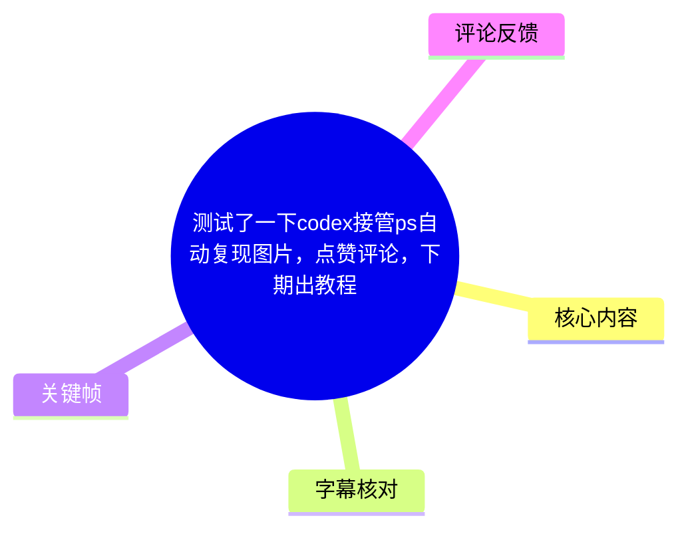
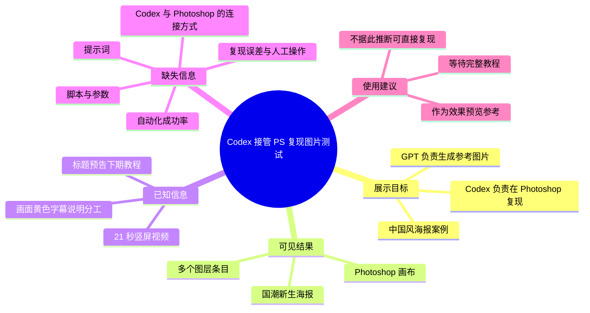
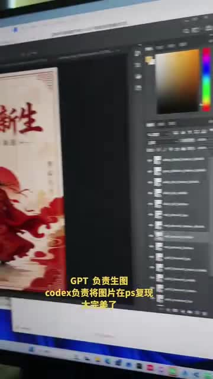
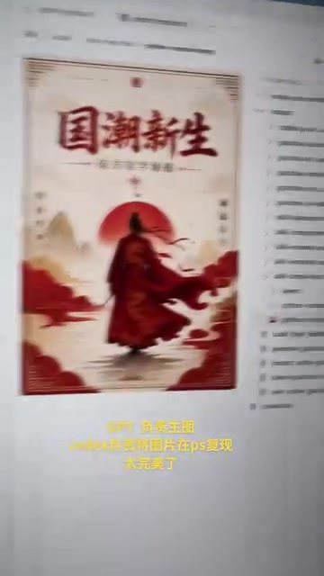
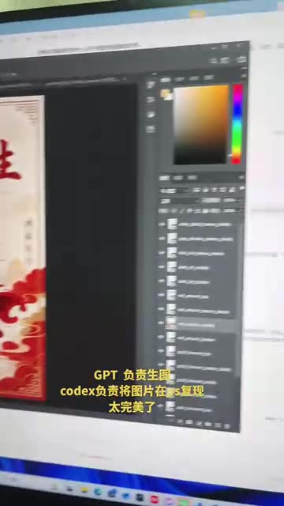
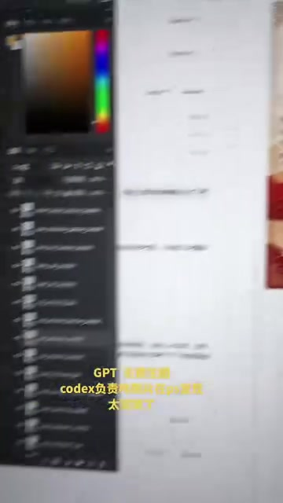

# 测试了一下 codex 接管 PS 自动复现图片，点赞评论，下期出教程

> 来源：[Bilibili 视频](https://www.bilibili.com/video/BV1P77S6dEVc) 
> UP 主：TokenFlux词元流动｜合集：AIcode｜视频时长：21 秒｜画面规格：1080×1920（竖屏）  
> 标签：图片、PS、教程、#codex  
> 注：元数据抓取时间为 2026-07-15；视频所演示的软件、模型与工作流能力可能随版本更新而变化。

## 小结

视频是一次时长 21 秒的工作流展示：画面字幕明确写出“GPT 负责生图，codex 负责将图片在 ps 复现”，UP 主以一张中国风招贴式图片为例，展示了 Photoshop 中的复现结果与图层面板。

从画面可确认，目标图是一张以米白、红色为主的海报：中间为红衣人物与红日，上方有“国潮新生”文字，周边包含山、水纹、边框及竖排文字等装饰。画面一侧的 Photoshop 图层面板出现大量图层条目，说明展示结果至少不是单一扁平图层；但视频没有展示具体脚本、提示词、图层命名、执行过程或人工修正步骤。

视频的核心信息是一个职责分工设想：GPT 产出原始视觉参考图，Codex 参与在 Photoshop 中复现该图。标题中的“接管 PS 自动复现”与画面字幕构成该演示的主要主张，但短片未提供可复现实验条件，不能据此确认其自动化程度、所使用的 Photoshop 接口、Codex 版本、成功率或与原图的像素级一致性。

UP 主在标题中表示“点赞评论，下期出教程”。因此，本期更接近效果预览与后续教程预告，而不是完整教学。希望实践的读者需要等待后续公开的操作细节，尤其是 Photoshop 自动化接口、指令文本、资产输入与异常处理方案。

本视频没有可用的站内字幕；本次 ASR 也未识别出语音片段。正文对画面内黄色字幕和软件界面的整理，基于关键帧的可见信息，而非凭空补全的口播内容。所有章节时间链接统一锚定视频起点，因为现有素材不包含可用的逐句带时间字幕，无法对画面中的具体文字做更细粒度的可靠切分。

## 思维导图

## 目录

- [视频定位与时效性](#视频定位与时效性)
- [画面展示：GPT 生图与 Codex 在 PS 复现](#画面展示gpt-生图与-codex-在-ps-复现)
- [可见的图层化结果与图片构成](#可见的图层化结果与图片构成)
- [可复用的工作流框架与实际缺口](#可复用的工作流框架与实际缺口)
- [限制、验证边界与后续教程](#限制验证边界与后续教程)
- [字幕比对](#字幕比对)
- [评论分析](#评论分析)
- [处理记录](#处理记录)

## [视频定位与时效性](https://www.bilibili.com/video/BV1P77S6dEVc?t=0)

该视频标题为“测试了一下codex接管ps自动复现图片，点赞评论，下期出教程”，发布者为 TokenFlux词元流动。标题、标签和画面共同指向 AI 辅助设计／图像复现主题，涉及 GPT、Codex 与 Photoshop（PS）。

这是一个测试展示而非完整技术发布：

- **已展示的命题**：GPT 生成图片，Codex 将图片在 Photoshop 中复现。
- **已展示的结果形态**：Photoshop 画布中的国潮风格海报，以及包含多个项目的图层面板。
- **尚未展示的技术条件**：GPT 的具体模型与提示词、Codex 的运行环境、是否实际控制 Photoshop、使用何种插件或脚本接口、输入输出文件格式、执行耗时、失败处理和人工参与程度。
- **教程状态**：标题仅表示“下期出教程”，并非已经提供教程内容或确定发布日期。

视频时长仅 21 秒，且没有可用口播转写。因此，它能够支持“作者展示了这一效果”的结论，不能支持“该方案已被完整验证、可被任何人稳定复现”的进一步结论。

## [画面展示：GPT 生图与 Codex 在 PS 复现](https://www.bilibili.com/video/BV1P77S6dEVc?t=0)

画面中的黄色叠加字幕为：

> GPT 负责生图  
> codex 负责将图片在 ps 复现  
> 太完美了

这段文字是视频中最直接的流程说明。按其字面意思，工作流分为两个角色：

1. **GPT：生成图像**  
   负责产出待复现的参考图或设计稿。
2. **Codex：在 Photoshop 中复现图片**  
   负责把参考图对应为 Photoshop 中的设计结果。画面中可见 Photoshop 的色彩面板、图层面板与画布。

> 图：关键帧同时呈现 Photoshop 画布、右侧色彩选择区域及长图层列表，并显示“GPT 负责生图 / codex 负责将图片在 ps 复现”的黄色字幕。其价值在于直接建立了视频声称的工具分工与最终软件载体之间的对应关系。

需要严格区分画面事实与推断：

| 类型 | 内容 |
| --- | --- |
| 画面可见事实 | Photoshop 中打开了一张红、米白配色的海报，右侧有多个图层条目。 |
| 画面可见事实 | 黄色字幕将 GPT 与 Codex 分别对应为“生图”和“在 PS 复现”。 |
| 标题陈述 | 作者称其在测试 Codex“接管 PS 自动复现图片”。 |
| 无法由本片确认 | Codex 是否直接通过官方 API、插件、脚本、键鼠自动化或人工中转操作 Photoshop。 |
| 无法由本片确认 | “太完美了”是作者主观评价，不能替代误差、对比图或可复现测试数据。 |

## [可见的图层化结果与图片构成](https://www.bilibili.com/video/BV1P77S6dEVc?t=0)

画布中的海报主体可辨识为“国潮新生”，整体是中国风／国潮视觉风格：

- **主标题**：顶部可见红色大字“国潮新生”。
- **中心主体**：一名身穿红色服饰的人物站在画面中下部。
- **背景元素**：红日、浅色山体、云／水纹式的红色装饰，以及细线边框。
- **色彩倾向**：以米白为背景，深红和朱红作为主色，并用深色文字或轮廓增强层次。
- **版式方向**：竖版招贴，符合视频 1080×1920 的竖屏展示形式，但不能据此确认原始设计文件尺寸。

> 图：该帧较完整地显示“国潮新生”海报的画面构成，包括标题、人物、红日、山景和红色装饰。它有助于判断视频中的“复现”所针对的是多元素版式设计，而非仅替换一张单独图片。

> 图：该帧突出显示 Photoshop 右侧的图层区域和局部画布。图层列表中可见多个独立条目，但画面清晰度不足，无法可靠读取图层名称、图层类型、混合模式、参数或层级关系；其价值仅在于证明作者展示了多层编辑界面。

从图层面板的可见长度可作出谨慎判断：展示的成品至少呈现为多条图层记录，而不是仅将参考图作为一个单层位图放置在画布中。但以下细节均未能从现有画面确认：

- 每个视觉元素是否均由 Codex 独立创建；
- 图层是否为文本、形状、智能对象、位图、调整层或导入素材；
- 是否包含图层组、蒙版、滤镜、混合模式和矢量路径；
- 这些图层是否由自动化一次性生成，还是已有设计文件的既有内容；
- 成品与 GPT 原图之间是否存在局部差异、遗漏或人工修图。

## [可复用的工作流框架与实际缺口](https://www.bilibili.com/video/BV1P77S6dEVc?t=0)

视频可提炼出的流程框架很短，但只覆盖到概念层：

1. **生成视觉参考图**  
   根据画面字幕，此阶段由 GPT 负责。
2. **将参考图拆解为可编辑设计要素**  
   从海报形态看，可能涉及文字、人物、背景、装饰、边框和色彩等元素；这是对成品视觉构成的分析，不是视频展示的实际执行步骤。
3. **在 Photoshop 内建立复现结果**  
   画面可见 Photoshop 画布与多条图层记录。字幕将该职责归于 Codex。
4. **查看整体成品与图层状态**  
   视频展示了成图和图层面板，并以“太完美了”表达作者对结果的正面评价。
5. **等待后续教程**  
   标题请求点赞、评论，并预告下期介绍教程。

若要把这一框架发展为真正可执行的流程，仍需作者在后续教程中至少补全下列信息：

| 所需信息 | 本视频是否提供 | 影响 |
| --- | --- | --- |
| GPT 模型、图像输入方式与提示词 | 未提供 | 无法复现参考图来源与风格控制。 |
| Codex 的版本、调用入口和权限 | 未提供 | 无法判断其是否能实际操控本地 Photoshop。 |
| Photoshop 版本与自动化接口 | 未提供 | 无法判断兼容性；不同版本、插件和脚本能力可能不同。 |
| 图层生成逻辑 | 未提供 | 无法知道文字、人物、背景如何被分解和还原。 |
| 脚本、命令或项目文件 | 未提供 | 无法复现实操。 |
| 时间成本与人工介入比例 | 未提供 | 无法评估自动化的效率和可靠性。 |
| 对比标准 | 未提供 | 无法客观评价“复现”精度。 |

因此，对实践者而言，当前最稳妥的使用方式是把视频视为**工作流方向与效果展示**：先以生成图取得视觉参考，再尝试通过代码代理、脚本或其他 Photoshop 自动化机制构建可编辑文件。不要将其误解为已公开的一键式通用方案。

## [限制、验证边界与后续教程](https://www.bilibili.com/video/BV1P77S6dEVc?t=0)

### 视频已给出的限制

- 视频长度只有 21 秒，没有演示从输入到输出的完整过程。
- 未提供可用站内字幕，也没有成功识别出的 ASR 语音文本。
- 没有展示任何命令、脚本、提示词、插件界面、控制台日志或报错信息。
- 没有原图与复现图的并列对照，无法量化复现质量。
- 画面模糊且拍摄角度倾斜，图层名称和参数不可可靠辨认。

### 技术与版权边界

“根据图片在 Photoshop 中复现”可能涉及文字、人物、素材、字体和参考图的权利问题。本视频未说明素材来源、授权状态或商用边界。若将类似流程用于公开发布或商业项目，应另行确认参考图、字体、人物素材和生成内容的使用权；这属于通用实践提醒，并非视频中已经给出的授权结论。

### 时效性

视频发布元数据显示为 2026 年 6 月。GPT、Codex、Photoshop 及其自动化能力都可能迭代，后续教程即使发布，也可能与本期演示时的软件版本不同。当前不能从视频确定其所依赖工具的精确版本，实践前应以作者后续教程及所用软件的当期文档为准。

> 图：该帧将 Photoshop 的局部面板、海报边缘与画面字幕并置。其价值在于保留作者对流程结果的原始文字说明，同时也显示出画面信息不足以读取具体设置，因此不能将展示效果扩展解释为已验证的技术参数。

## [字幕比对](https://www.bilibili.com/video/BV1P77S6dEVc?t=0)

| 字幕来源 | 完整性 | 专有名词 | 时间轴 | 主要问题 |
| --- | --- | --- | --- | --- |
| Bilibili 站内字幕 | 不可用；素材明确标注“未提供可用站内字幕” | 无法评估 | 无可用 SRT 分段 | 无法作为正文事实或时间轴依据。 |
| 本次 ASR 字幕 | 空；识别结果 `segments: []`、`sentenceCount: 0`、`speechCoverage: 0` | 无法识别 GPT、Codex、PS 等词 | ASR 虽标记具备时间戳输出能力，但无任何实际分段 | 诊断提示未识别到语音片段；语言自动判断为英语、置信度 0.541015625，但没有形成文本。 |

本次 ASR 使用 `medium` 模型，在 CUDA 与 `float16` 配置下处理约 20.78 秒音频，结果为空。诊断信息只说明“未识别到语音片段”，**并未**标记 `noAudioStream=true`；因此不能表述为源视频没有音轨，也不能将其简单归因为工具失败。基于现有结果，更准确的说法是：素材存在导出的音频文件，但 ASR 未从中识别出可转写语音。

最终未采用任何逐句字幕。正文中的“GPT”“codex”“ps”及“太完美了”来自关键帧中可见的黄色画面字幕；“国潮新生”来自海报画面中的可见标题。由于没有站内 SRT 或 ASR 的真实分段时间，所有章节仅使用视频起点 `t=0` 作为可验证锚点，不对具体画面字幕的出现秒数作推测。

## [评论分析](https://www.bilibili.com/video/BV1P77S6dEVc?t=0)

可获取热评不足三条：素材仅返回 1 条，因此只分析这一条，不虚构其余评论。

| 评论者 | 点赞 | 评论内容 | 分析 |
| --- | ---: | --- | --- |
| TokenFlux词元流动（UP 主） | 0 | “私信可以一起学习” | 这是一条由 UP 主本人发布的互动回复，表明其愿意通过私信与感兴趣的观众交流或共同学习。它可作为作者开放交流态度的补充，但没有提供具体教程、代码、软件版本或已验证技术细节，不能视为工作流可用性的证据。 |

现有评论中没有出现关于复现精度、操作难点、教程需求细节或技术争议的第三方反馈。视频元数据中的回复数为 1，与当前可获取评论数量一致。

## [处理记录](https://www.bilibili.com/video/BV1P77S6dEVc?t=0)

- **Worker ID**：`worker-mrj0wjed-b0c290ad`
- **模型**：`gpt-5.6-terra`
- **ASR 模型与运行配置**：`medium`；自动语言识别为 `en`（概率 `0.541015625`）；CUDA；`float16`；音频时长约 `20.781875` 秒。
- **使用的素材与工具产物**：视频元数据、关键帧目录 `frames/`、音频文件 `audio/audio.wav`、ASR 诊断与结果、评论文件 `comments/comments.json`、站内字幕可用性检查结果。
- **字幕选择**：站内字幕未提供可用内容；本次 ASR 结果为空且无分段。最终不采用逐句字幕，以关键帧画面文字、视频标题和元数据作为事实来源；时间轴统一锚定 `t=0`，避免伪造细粒度时间位置。
- **关键帧选择依据**：选用 `frame-001.jpg` 说明 Photoshop、画布、图层面板与流程字幕的同屏关系；选用 `frame-003.jpg` 说明海报整体构成；选用 `frame-002.jpg` 佐证多图层界面；选用 `frame-004.jpg` 说明局部界面与字幕可见、参数不可读的限制。
- **评论处理范围**：仅处理可获取的热评前 3 条；实际仅获取 1 条。
- **缓存清理**：未提供缓存清理执行记录，无法确认是否已清理；不作未证实的清理声明。
- **未解决问题**：Codex 的具体接入方式、Photoshop 版本和接口、GPT 提示词、项目文件、图层结构、自动化成功率、人工参与程度、复现精度与后续教程发布时间均未在现有素材中披露。

## 评论分析

- 热评 1：私信可以一起学习

以上内容是观众反馈摘录，只用于补充理解视频反响，不作为正文事实依据。
