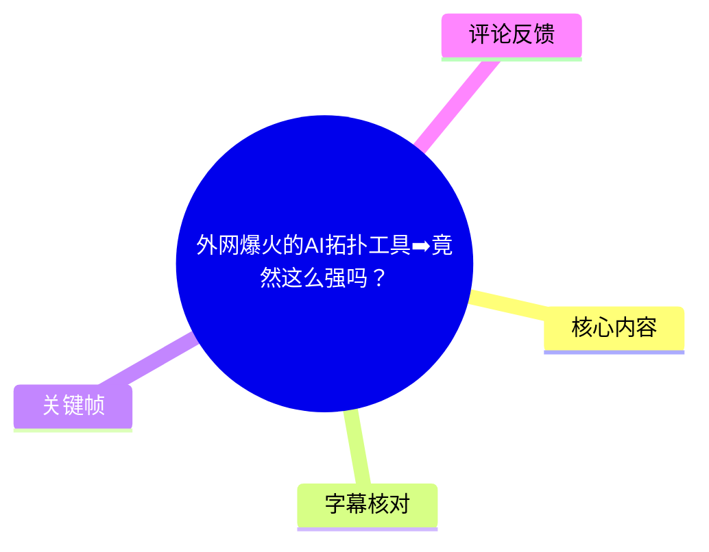
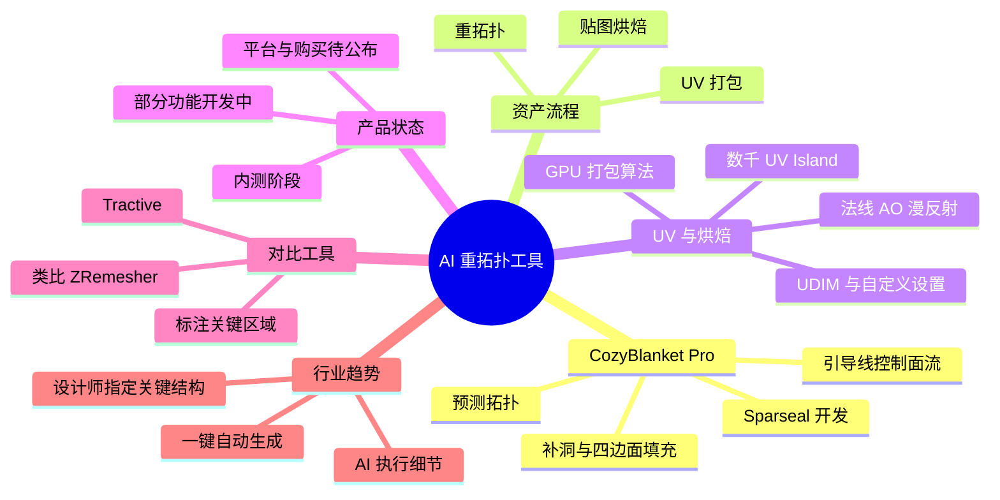
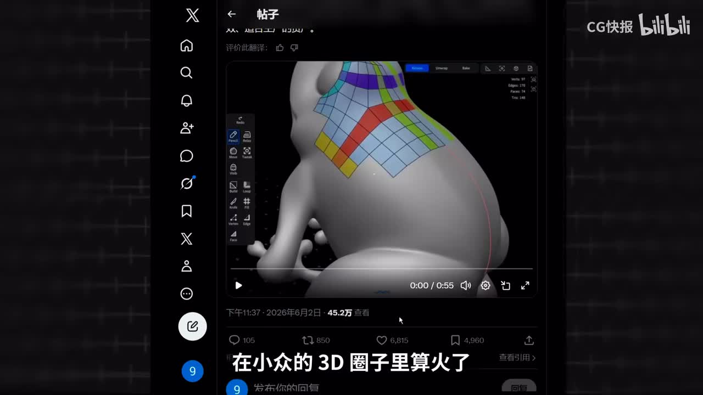
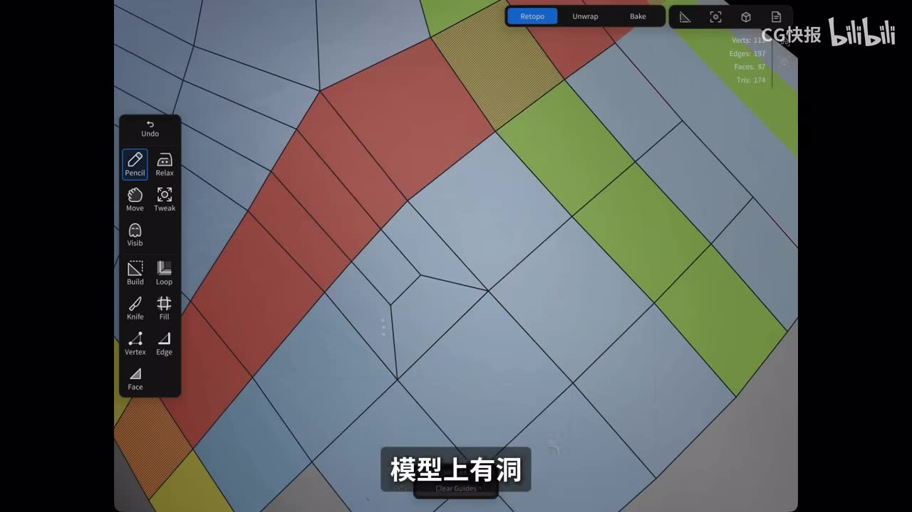
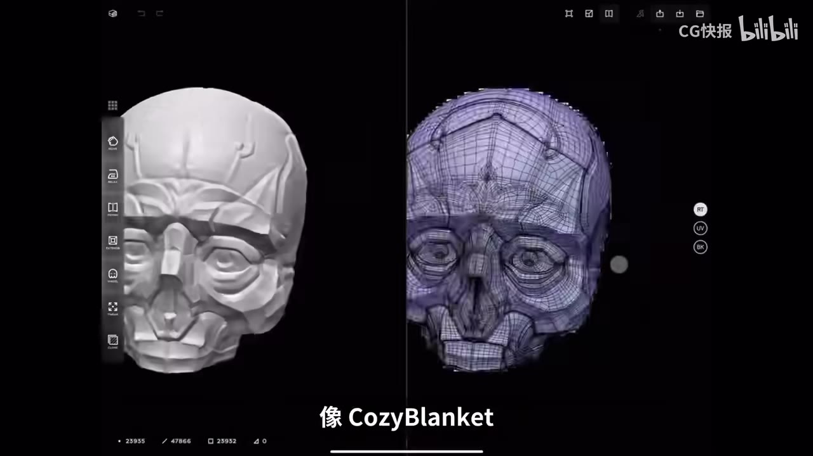
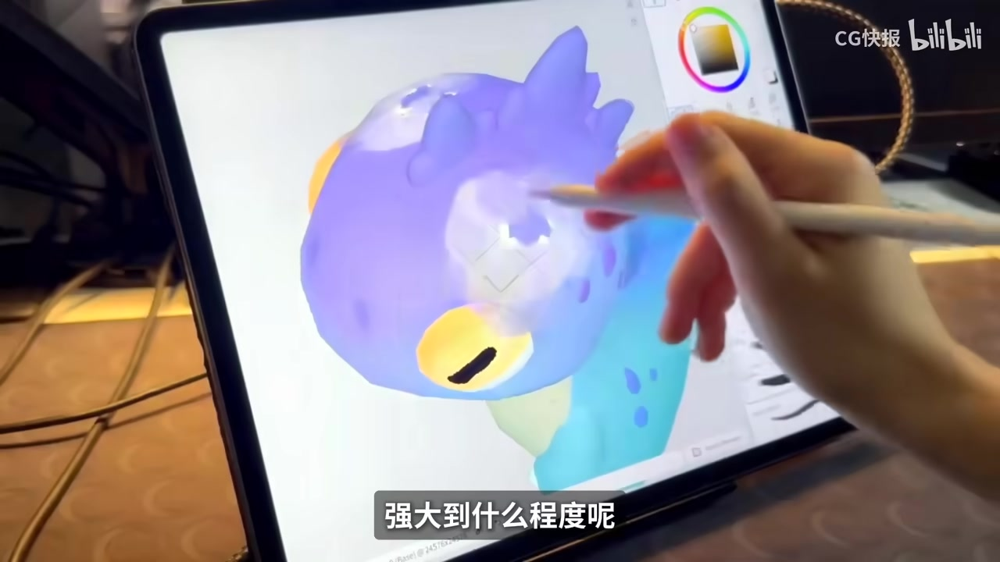

# 外网爆火的AI拓扑工具➡️竟然这么强吗？

> 来源：[Bilibili 视频](https://www.bilibili.com/video/BV1MmEg6dEFU) 
> UP 主：CG快报｜时长：03:28｜合集：AIcode  
> 视频简介提供的官网链接：[Sparseal / CozyBlanket Pro](https://sparseal.com/cozyblanket-pro/)

## 小结

视频介绍了 Sparseal 正在展示中的 **CozyBlanket Pro**：一款以重拓扑为核心、并覆盖 UV 与烘焙流程的工具。视频称其最突出的交互方式是：用户直接在模型表面绘制引导线，工具据此生成或调整四边面拓扑的走向。

从演示与视频陈述看，CozyBlanket Pro 的能力包括：预测拓扑结构、同时分析高模与低模、填补大面积缺口、修复模型孔洞，以及依据引导线实时调整面流方向。其目标不是替代建模本身，而是减少高模完成后、为动画或生产制作可用低模时的重拓扑负担。

视频还把它放到完整资产整理流程中理解：UV 环节宣称有基于 GPU 的打包算法，可处理数千个 UV Island，并在每秒评估大量布局组合后选取较优结果；烘焙环节则提到法线、AO、漫反射贴图、UDIM、自定义烘焙设置及高低模烘焙分配。

但这不是已可直接进入生产线的成熟产品。视频明确说明 **CozyBlanket Pro 当时仍处于内测阶段，部分功能仍在开发中，且仅公开过预告内容**。PC、macOS、iPadOS 等平台支持以及首发和购买平台，均需等待后续官方公告。若需要立即在 iPad 上做重拓扑或 UV，视频建议考虑普通版 CozyBlanket，而非 Pro 版。

视频也提及另一款名为 **Tractive** 的 AI 拓扑工具，并将其与 ZBrush 的 ZRemesher 作类比。两者在视频中的定位差异是：CozyBlanket Pro 更偏向“画引导线—生成对应面流”；Tractive 更偏向“先标注关键结构区域—让系统计算适用于动画和生产的拓扑”。不过 Tractive 同样公开资料有限，视频未能验证其具体 AI 算法。

适合阅读本文的人包括：角色、道具、游戏资产与动画资产制作人员；需要理解重拓扑、UV、烘焙关系的 3D 学习者；以及关注 AI 如何介入 3D 生产流程的人。需要注意，视频中的功能、性能和上线计划均具有新闻时效性，不能据此推断当前版本一定已上线、可购买或满足生产质量要求。

## 思维导图

## 目录

- [背景：为什么重拓扑是痛点？](#背景为什么重拓扑是痛点)
- [CozyBlanket Pro 的核心演示](#cozyblanket-pro-的核心演示)
- [Sparseal 工具生态与定位](#sparseal-工具生态与定位)
- [从预测拓扑到引导线控制](#从预测拓扑到引导线控制)
- [UV 打包与烘焙能力](#uv-打包与烘焙能力)
- [产品状态、平台与使用限制](#产品状态平台与使用限制)
- [Tractive 对比与 AI 拓扑趋势](#tractive-对比与-ai-拓扑趋势)
- [可复用的工作流经验](#可复用的工作流经验)
- [字幕比对](#字幕比对)
- [评论分析](#评论分析)
- [处理记录](#处理记录)

## 背景：为什么重拓扑是痛点？ [00:00](https://www.bilibili.com/video/BV1MmEg6dEFU?t=0)

视频首先将 CozyBlanket Pro 放在 3D 从业者的典型生产难题中讨论：高模雕刻完成后，仍需将模型整理为适合后续绑定、动画、游戏或贴图工作的拓扑结构。视频用“高模雕完了很爽，到了拓扑人就开始沉默了”概括这一环节的工作阻力。

这里的核心概念包括：

- **重拓扑（Retopology）**：为高面数雕刻模型重新构建更规整、可控的低面数拓扑，通常追求较合理的四边面分布、边线流向和可变形性。
- **面流 / 拓扑方向**：边线与面围绕关节、五官、折痕或物体轮廓的走向。合理面流会影响模型变形、后续编辑与贴图便利性。
- **高模与低模**：高模保留雕刻细节；低模承载生产所需的动画结构或实时渲染结构。两者之间通常还需 UV 与烘焙来转移视觉细节。
- **四边面（Quad）**：视频多次强调补出“规整的四边面”。这反映出其目标偏向可编辑、可继续加工的网格，而不只是视觉上封闭孔洞。

视频称 CozyBlanket Pro 在 X 平台获得数十万级播放，并在较小的 3D 社群中引起关注。这是视频的新闻背景陈述，不等同于该工具已完成独立性能或生产稳定性验证。

> 图：画面展示了 X 平台中的模型拓扑演示：模型背部覆盖规则网格，并以不同颜色标记局部区域。它直观说明视频为什么把“局部面流控制”和“规整四边面”视为重点。

## CozyBlanket Pro 的核心演示 [00:10](https://www.bilibili.com/video/BV1MmEg6dEFU?t=10)

### 在模型表面绘制引导线 [00:10](https://www.bilibili.com/video/BV1MmEg6dEFU?t=10)

视频描述的第一项能力是：在模型上直接画一条引导线，指定希望面流经过的方向；AI 随后依据该线，自动生成对应的拓扑方向。

按视频中的交互逻辑，可整理为：

1. 导入或打开待处理的模型。
2. 在需要控制拓扑方向的位置直接绘制引导线。
3. 用引导线表达期望的面流方向。
4. 由工具生成与该方向匹配的拓扑结构。
5. 结果可在交互中继续调整；视频称其为“实时调整”。

这类交互的重要性在于：它并非完全黑箱式地“一键出网格”，而是保留了设计者对结构方向的明确输入。视频最后提出的行业趋势，也正是从全自动计算转向“人指定关键结构、AI 执行细节”。

### 缺面填补与孔洞修复 [00:18](https://www.bilibili.com/video/BV1MmEg6dEFU?t=18)

视频给出的第二类案例是：高模中间缺失一大片面时，工具可直接补出一片规整的四边面；模型存在孔洞时，也可协助修复。

需要区分视频展示与尚未证实的能力边界：

- 视频明确提到：**大面积区域可被填补为对应的四边面结构**。
- 视频明确提到：**模型孔洞可修复**。
- 视频没有提供复杂角色关节、极端薄壳、非流形网格、自交网格或生产级变形测试的结果。
- 因此，不能据此推断其在所有网格问题上均能自动生成可直接用于绑定或游戏生产的拓扑。

> 图：关键帧聚焦于模型局部网格与孔洞区域，画面中可见四边面边线和颜色区块。该画面直接对应视频“模型上有洞、可协助修复”的演示语境。

## Sparseal 工具生态与定位 [00:31](https://www.bilibili.com/video/BV1MmEg6dEFU?t=31)

视频称 CozyBlanket Pro 来自开发者 **Sparseal**，并列出了其已有或相关的三项工具：CozyBlanket、Uniform、Wafer。

| 工具 | 视频中的定位 | 主要工作内容 |
| --- | --- | --- |
| CozyBlanket | iPad 上的重拓扑、UV 与烘焙工具 | 重拓扑、UV 展开 / 打包、烘焙 |
| Uniform | iPad 上的 3D 软件 | 建模、雕刻、渲染等 |
| Wafer | 面向 iPad 与桌面端的 PBR 贴图工具 | PBR 贴图绘制 |

这里需要进行字幕校正：中文站内字幕对产品名存在大量语音识别错误，例如“cos black cut pro”“cospbracket pro”“spicy”“VIVO”等；结合英文、阿拉伯语、西班牙语等站内字幕的拼写，可确认视频指向的是 **CozyBlanket Pro、Sparseal、Wafer**，而不是中文 ASR 中出现的近音写法。

视频将 CozyBlanket Pro 描述成模型整理工具，意味着其覆盖范围不止“自动布线”一个点，而是试图连接：

**高模 / 低模关系 → 重拓扑 → UV → 贴图烘焙**

> 图：画面左右对比雕刻形态与覆盖在模型上的网格结构，并显示“像 CozyBlanket”的字幕。它有助于理解视频所说的重拓扑并不是生成一个新外形，而是在既有高模上构建可用网格。

## 从预测拓扑到引导线控制 [00:56](https://www.bilibili.com/video/BV1MmEg6dEFU?t=56)

### 预测拓扑：同时分析高模和低模 [00:56](https://www.bilibili.com/video/BV1MmEg6dEFU?t=56)

视频称 CozyBlanket Pro 有“预测拓扑 AI”功能，其描述如下：

- 工具会预测拓扑结构；
- 可同时分析高模与低模；
- 对待补全区域提供实时建议；
- 可在模型中不知如何干净、规整地填补大面积区域时，生成相应四边面结构。

这里的“预测”是视频使用的产品描述。视频没有解释模型训练数据、网络结构、几何算法、是否使用传统四边形重网格算法与机器学习混合方案，因而不能从视频推导其具体技术路线。

### 引导线驱动的实时面流调整 [01:12](https://www.bilibili.com/video/BV1MmEg6dEFU?t=72)

视频在此重复强调其关键交互：用户在模型表面画引导线，AI 根据线条生成指定方向的拓扑，结果甚至可实时调整。

对于实际生产，可以把视频中的方法理解成以下“人机协作边界”：

| 由设计者决定 | 由工具尝试完成 |
| --- | --- |
| 哪些区域重要 | 局部网格结构的生成 |
| 面流希望如何绕过形体 | 依据引导线延展面流 |
| 哪些部位要保留结构控制 | 区域填补与网格连通 |
| 最终是否可用于绑定 / 项目 | 重复计算与候选结果生成 |

视频的价值不在于证明“AI 已经能无监督解决所有重拓扑”，而在于提出了一种更直接的控制接口：让创作者通过画线表达拓扑意图，而不必从零开始手工逐面搭建。

> 图：画面展示手写笔在 iPad 上操作彩色模型，说明该工具的演示重点包含触控笔交互与移动端 3D 工作方式；这也呼应视频对 iPad 端定位的介绍。

## UV 打包与烘焙能力 [01:38](https://www.bilibili.com/video/BV1MmEg6dEFU?t=98)

视频认为 CozyBlanket Pro 不仅针对重拓扑，还涵盖 UV 与烘焙的后续步骤。

### UV 打包参数与视频宣称 [01:38](https://www.bilibili.com/video/BV1MmEg6dEFU?t=98)

视频提到一套基于 GPU 的新型 UV Packing 算法，并给出两项量化描述：

| 项目 | 视频陈述 |
| --- | --- |
| 可处理规模 | 数千个 UV Island |
| 布局搜索量 | 每秒评估数万亿种布局组合 |
| 输出逻辑 | 选取较优结果完成 UV 打包 |

UV Island 指经 UV 展开后被切分出的独立二维片段；打包的目标通常是在纹理空间内尽可能高效、合理地排布这些岛屿。

但这些数字属于视频转述的产品能力，视频没有展示测试模型规模、硬件规格、UV 岛形状、时间限制、纹理分辨率、填充率、边距设置或与其他工具的对比基准。因此不应把“每秒数万亿组合”直接等同于任何实际项目都能获得的打包速度或质量。

### 烘焙支持范围 [01:47](https://www.bilibili.com/video/BV1MmEg6dEFU?t=107)

视频提及的烘焙能力如下：

- 法线贴图（Normal Map）烘焙；
- 环境光遮蔽贴图（AO）烘焙；
- 漫反射贴图（Diffuse Map）烘焙；
- UDIM；
- 自定义烘焙设置；
- 高模与低模之间的烘焙分配。

这些功能如能按视频所述整合到同一环境，意味着用户理论上能把“网格整理—UV—贴图转移”串为较连续的流程。但视频未展示贴图精度、投射错误处理、笼体（Cage）控制、法线空间选项、边缘扩展、抗锯齿与异常几何处理，因此仍需要等待正式版文档或实测确认。

## 产品状态、平台与使用限制 [02:01](https://www.bilibili.com/video/BV1MmEg6dEFU?t=121)

视频在介绍功能后明确提出限制，这部分是评估工具时最重要的信息。

### 当时处于内测，不能视作成熟生产工具 [02:03](https://www.bilibili.com/video/BV1MmEg6dEFU?t=123)

视频明确说明：

1. CozyBlanket Pro 当时仍处于**内测阶段**。
2. 部分功能仍在开发中。
3. 公开内容主要是预告片，而不是完整产品的长期实测。
4. 不应急于把它视为可立即投入项目的成熟软件。

因此，视频中“看起来像完整的模型整理工具”是对预告内容的判断，并不等于正式版功能已经全部发布或稳定可用。

### 当前需求与未来平台支持 [02:07](https://www.bilibili.com/video/BV1MmEg6dEFU?t=127)

对于“现在就想在 iPad 做模型拓扑或 UV”的用户，视频给出的建议是：可先尝试 **普通版 CozyBlanket**，而不是 Pro 版本。

视频还称 Pro 版后续将支持：

- PC；
- macOS；
- iPadOS；
- 其他常见系统。

但是，首发平台、可购买平台和具体时间仍需官方后续公布。由于视频发布于 2026 年 6 月，任何下载资格、平台支持、价格与功能清单均可能在之后变化；本文不将视频中的计划性表达写成当前已验证事实。

## Tractive 对比与 AI 拓扑趋势 [02:32](https://www.bilibili.com/video/BV1MmEg6dEFU?t=152)

### Tractive 的视频定位 [02:37](https://www.bilibili.com/video/BV1MmEg6dEFU?t=157)

视频提到另一款名为 **Tractive** 的工具，并称它有点类似 ZBrush 中的 **ZRemesher**。

按视频描述，Tractive 的大致步骤是：

1. 用导流线区分各结构区域及其走向。
2. 在高模上完成标注。
3. 让 AI 根据这些标注生成拓扑结构。
4. 由系统计算更适用于动画和生产项目的拓扑。

视频同时提醒：该工具当时也只有简短的产品介绍，具体使用何种 AI 算法，公开资料不多。

### CozyBlanket Pro 与 Tractive 的差异 [02:49](https://www.bilibili.com/video/BV1MmEg6dEFU?t=169)

| 对比维度 | CozyBlanket Pro | Tractive |
| --- | --- | --- |
| 视频中的主要输入 | 直接在模型上绘制引导线 | 标注拓扑关键区域与结构信息 |
| 视频中的生成侧重点 | 按线条方向生成每一段面 / 面流 | 计算更适合动画和生产的整体拓扑 |
| 类比对象 | 视频未给出明确传统工具类比 | 视频称有点类似 ZBrush ZRemesher |
| 信息完整度 | 已展示预告，但仍为内测 | 仅有简短产品介绍，算法公开信息较少 |

上述差异来自视频讲述，不能替代两款工具的官方技术文档或上手测试。

### 视频提出的趋势判断 [03:16](https://www.bilibili.com/video/BV1MmEg6dEFU?t=196)

视频最后的判断是：新一代 AI 拓扑正从“**一键自动计算结构**”转向“**设计师标注关键结构，AI 接手执行细节**”。

这是一个具备实践意义的判断。对于需要动画变形、机械结构控制、角色五官环线或游戏资产规范的模型，完全无约束自动化往往难以表达项目意图；通过引导线、区域标注等方式保留人类决策，可能比单纯追求一键生成更适合进入工作流。

不过这仍是视频基于两个产品方向得出的趋势性观点，而非对整个行业技术成熟度的统计结论。

## 可复用的工作流经验 [00:10](https://www.bilibili.com/video/BV1MmEg6dEFU?t=10)

以下内容是依据视频演示整理出的实践框架，不是视频提供的逐步软件教程，也不保证对应功能已在当前版本开放。

### 1. 先判断是否需要重拓扑

适合优先考虑重拓扑的场景包括：

- 高模面数高、结构杂乱，难以直接绑定或导出至实时引擎；
- 角色关节、面部、衣褶等部位需要明确边线流向；
- 需要在高模和低模之间烘焙法线、AO 或漫反射信息；
- 需要为贴图绘制整理 UV。

若模型只是静态展示且不需要低模、绑定或贴图转移，重拓扑的投入程度可能不同。

### 2. 用引导线表达“不可交给自动化的意图”

按视频的工具设计思路，手工输入应集中到最关键的地方：

- 关节弯折区域；
- 眼睛、嘴部等表情变形区域；
- 硬表面切线、边缘环线；
- 需要保持连续流向的大面积表面；
- 需要明确隔离的结构区域。

视频的经验可概括为：**不要只要求“自动生成”，而要先向工具表达什么样的拓扑才是正确的。**

### 3. 检查自动生成结果，而不是直接信任

即使工具能够补洞、填补四边面或自动布线，仍应检查：

- 四边面是否出现不合理拉伸；
- 极点是否落在高变形或高可见区域；
- 环线是否符合关节、五官或硬表面结构；
- 局部补面是否与周边网格密度衔接；
- 是否存在孔洞、自交、非流形边或法线问题；
- 生成后的低模是否仍能正确投射高模细节。

视频展示的是能力方向，未展示上述质量检查的完整过程；因此人工审阅仍是必要环节。

### 4. 把 UV、烘焙视为同一条链路

视频的一个有用提醒是：重拓扑不是孤立步骤。实际流程可按下列顺序理解：

1. 完成高模或导入高模；
2. 生成、调整低模拓扑；
3. 检查面流、密度与结构；
4. 展开并打包 UV；
5. 设置高低模关系；
6. 烘焙法线、AO、漫反射等贴图；
7. 将结果导入贴图、渲染、动画或游戏引擎流程。

只要其中任一环节不稳定，例如低模未整理好、UV 岛边距不合适或烘焙投射出现错误，前面的“自动拓扑”优势就无法直接转化为可用生产结果。

## 字幕比对

| 字幕来源 | 完整性 | 专有名词 | 时间轴 | 主要问题 |
| --- | --- | --- | --- | --- |
| Bilibili 站内中文字幕 `p01-ai-zh.srt` | 覆盖 00:00–03:25，接近全片 | 错误较多，如 CozyBlanket、Sparseal、Wafer、Tractive 被识别为近音词 | 分段细，起止时间可直接使用 | 中文语音识别错字明显，UV、烘焙和产品名部分混乱 |
| Bilibili 站内英文字幕 `p01-ai-en.srt` | 覆盖 00:00–03:26，接近全片 | CozyBlanket Pro、Sparseal、Uniform、Wafer、Tractive 拼写较可靠 | 时间轴完整，但少数条目合并过长或极短 | 个别语句断句不自然，不能完全代替中文语义核对 |
| 本次 ASR `medium` | 诊断覆盖 87.03%，标记语音时长 180.58 秒 | 专有名词误识别严重，如 “Cosy Black Card Pro”“Spicy”“Refo” | 首段错误地从 00:25.680 开始，且每段过长 | 虽识别语言为中文且置信度 0.9995，但时间边界和术语可靠性不足 |

### 最终字幕选择

正文以 **站内中文字幕的真实时间轴** 为主，并使用站内英文字幕校正专有名词和技术术语；本次 ASR 已完成检查，但未作为主要时间轴依据。

重点校正如下：

| 误识别形式 | 本文采用名称 | 校正依据 |
| --- | --- | --- |
| cos black cut pro / cospbracket pro / Cosy Black Card Pro | CozyBlanket Pro | 英文、阿拉伯语、西班牙语等站内字幕一致 |
| spicy / Spicy | Sparseal | 英文站内字幕明确拼写 |
| Refo / VIVO / LumaFusion | Wafer | 英文、西班牙语、阿拉伯语字幕均指向 Wafer；日语字幕该处出现异常名称，不采用 |
| attractive / 未完整识别 | Tractive | 英文、西班牙语、阿拉伯语字幕一致 |
| 拓普、拓补、拖补 | 拓扑 / 重拓扑 | 结合中文语境与英文 `topology`、`retopology` 校正 |

本次 ASR 的 `asr-result.json` 未标记 `noAudioStream=true`，说明源视频存在音轨；ASR 问题是识别质量、分段和首段时间异常，而不是无音轨或工具失败。

## 评论分析

以下仅分析可获取的热评前三条，评论内容代表评论者观点，不作为已验证技术事实。

### 1. “这些功能不需要 AI，也可用传统算法实现”——猪肘牛腩（67 赞）

评论认为，引导线、补洞、拓扑整理等功能未必需要 AI；如果程序员要解决，传统算法同样可能实现。评论还提出疑问：为何如此明显的用户痛点长期未被充分解决。

这一观点对视频的“AI”叙事形成了有效提醒。几何处理、自动重网格、四边面重构与引导线控制本就存在传统算法路径，因此仅从演示效果不能判断底层一定依赖生成式 AI 或机器学习。视频也确实没有公开具体算法。

但评论没有提供算法实现、产品对比或性能测试，故只能作为技术质疑与行业观察，不能据此断言该产品“不是 AI”。

### 2. “看起来像 3DCoat 的引导线”——大谎话时代（43 赞）

评论将视频中的功能与 3DCoat 的引导线机制相比较，并怀疑其是否属于 AI 驱动。

该评论补充了一个重要视角：**“用户画线控制网格走向”并不是必然由 AI 才能实现的交互范式。** 对观看者而言，真正需要比较的可能是控制精度、自动补全质量、拓扑可编辑性、复杂模型稳定性与生产结果，而不是只看是否贴上 AI 标签。

不过视频没有演示 3DCoat 的对应功能，也没有进行横向测试；两者是否相似、差异有多大，仍需基于实际版本和案例验证。

### 3. “自动 UV、AI 拓扑仍要手搓”——出家人的小秘密（40 赞）

评论感叹即使 AI 已进入工作流，自动 UV 与 AI 拓扑仍无法完全消除人工操作。

这与视频最后的结论高度呼应：更可能的方向不是“人完全退出”，而是人先标注关键结构，AI 再承担细节执行。对于需要动画变形或生产规范的模型，人工定义约束本身就是质量控制的一部分。

评论属于经验性感叹，没有给出具体项目和失败案例；但作为对“全自动化预期”的提醒，具有现实参考价值。

## 处理记录

- Worker ID：`worker-mrj0www4-e8d79408`
- 模型：`gpt-5.6-terra`
- 使用工具与素材：Bilibili 元数据、站内多语言 SRT、`asr/asr-result.json`、ASR SRT、关键帧 `frames/`、热评 `comments/comments.json`
- 字幕选择：以站内中文 SRT 的逐段真实时间轴作为章节定位依据；以站内英文 SRT 校正产品名与英文技术术语；本次 ASR 已检查，但因首段时间偏移、分段过长及专有名词误识别严重，仅作交叉参考。
- ASR 检查结论：识别语言为中文，置信度 `0.99951171875`；存在音轨，未发现 `noAudioStream=true`；ASR 标称覆盖率为 `87.03%`，但首个语音片段从 `00:25.680` 开始，与站内字幕从 `00:00.040` 开始不一致。
- 关键帧选择依据：
  - `frames/frame-001.jpg`：展示 X 平台传播与带有彩色网格的拓扑演示，对应视频新闻背景和核心卖点。
  - `frames/frame-002.jpg`：展示局部网格、孔洞与四边面结构，对应补洞和修复能力。
  - `frames/frame-003.jpg`：展示高模与网格化结果的并置，对应重拓扑的概念说明。
  - `frames/frame-004.jpg`：展示手写笔在 iPad 上操作模型，对应 iPad 端工具和引导线交互语境。
- 缓存清理：素材清单未提供缓存清理执行结果；本文未将“已清理”作为事实记录。
- 未解决问题：
  - 未提供 CozyBlanket Pro 内测资格、正式发布日期、售价或当前可购买状态。
  - 视频未披露其具体 AI / 几何算法、硬件基准和复杂生产模型测试。
  - Tractive 的公开资料、算法细节与当前产品状态在视频素材中不足，无法进一步验证。
