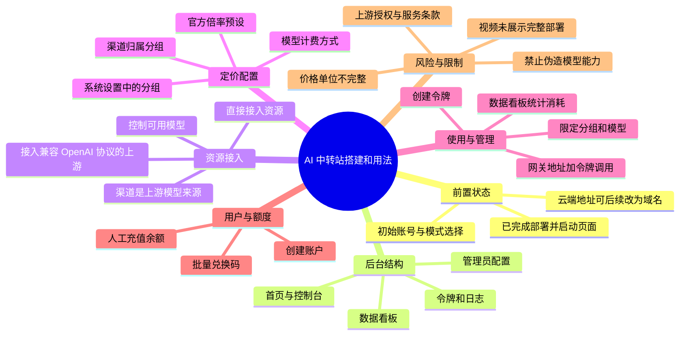
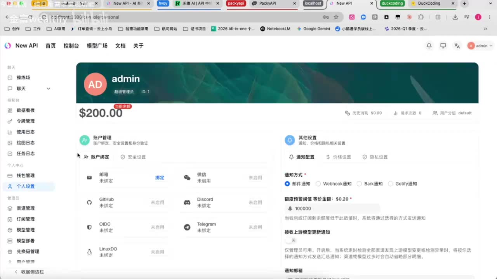
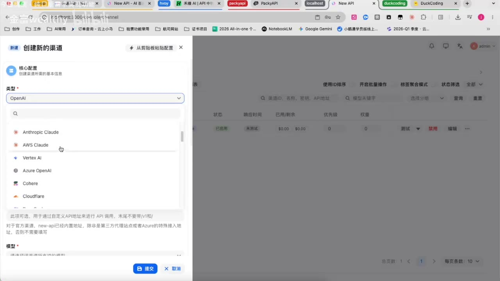
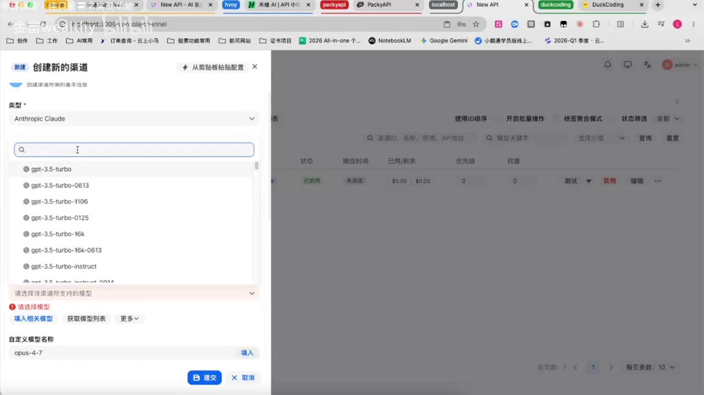

# 中转站搭建和用法

> 来源：[Bilibili 视频](https://www.bilibili.com/video/BV1bd526HEjE)<br>
> UP 主：金富wealthy｜发布时间：2026-05-13｜视频时长：21:22｜分辨率：1920×1080  
> 视频简介：搭建一个专属于你自己的 AI 中转站吧。

## 小结

视频以一个已部署完成的 **New API 类大模型接口网关**为例，讲解如何把多个模型来源接入统一控制台，再通过渠道、模型、分组倍率、令牌、用户余额与兑换码等机制进行管理。其核心不是从零部署服务器，而是部署后的后台配置与使用方法；开头仅提到问题由 Codex 解决、页面已启动，没有展示部署命令、服务器规格或完整排障过程。

UP 主将“渠道”解释为模型或额度的上游来源：既可以配置自己取得的官方/直接资源，也可以接入其他中转站提供的、兼容 OpenAI 协议的 API。创建渠道时需要控制可售模型，并可用自定义模型名称区分不同来源；但视频中的模型名称、接口字段存在 ASR 误识别，应以后台实际支持的模型 ID 和上游文档为准。

定价的关键机制是“**分组倍率**”：先在系统设置中建立分组及倍率，再为模型配置计费方式/官方倍率预设，最后把渠道放入相应分组。视频用“官方价 75，2 倍后 150；0.5 倍后 37.5”的界面示例说明倍率会改变最终展示或计费价格。这里的“75”“150”“37.5”未说明货币、计费单位和输入/输出 token 区分，不能直接作为真实报价参数。

在使用层面，视频展示了接入国内模型、创建限制分组或模型范围的令牌、用“网关地址 + 新建令牌”调用，以及通过数据看板查看消耗记录。对于共享给他人使用，UP 主演示了创建用户、人工充值余额，以及批量生成兑换码并通过外部平台发码的思路。

需要特别注意，视频多次讨论“对外卖”“赚钱”和二级转售，但这只是 UP 主的操作建议，不构成平台、模型供应商或支付渠道的许可。转售上游 API、共享订阅账号、伪造模型身份、处理用户数据均可能违反供应商条款、平台规则、消费者保护或数据合规要求。UP 主也明确反对把本地小模型伪装成高价模型出售。实际使用应先核验上游授权、模型标识、价格、税务与隐私责任。

## 思维导图




## 目录

- [前置状态与网关后台概览](#前置状态与网关后台概览)
- [渠道：接入上游模型来源](#渠道接入上游模型来源)
- [模型、分组与倍率定价](#模型分组与倍率定价)
- [创建令牌、统一调用与统计](#创建令牌统一调用与统计)
- [账户余额与兑换码流程](#账户余额与兑换码流程)
- [风险、限制与时效性](#风险限制与时效性)
- [字幕比对](#字幕比对)
- [评论分析](#评论分析)
- [处理记录](#处理记录)

## [前置状态与网关后台概览](https://www.bilibili.com/video/BV1bd526HEjE?t=0)

### [1. 已启动后的初始化选择](https://www.bilibili.com/video/BV1bd526HEjE?t=0)

视频开头的系统已经能访问。UP 主称其刚用 Codex 解决问题后“起来了”，随后进入初始化页面，点击“下一步”，填写账号密码并确认。这里展示的是**初始化阶段的页面操作**，但没有给出：

- 使用的操作系统、云服务器或本地运行环境；
- 容器编排、安装脚本、代码仓库地址或部署命令；
- Codex 实际执行的修复内容；
- 反向代理、HTTPS、数据库、备份或安全配置。

因此，本视频不能单独作为完整的从零部署教程。

接着，系统提供若干用途模式。UP 主的表述为：若要“对外运营”则选对外运营；自用则选择自用；演示用途选择演示。视频选择了面向对外运营的路径，并说明初始化过程中底层会自动进行系统设置，用户无需干预。

### [2. 首页、域名与管理控制台](https://www.bilibili.com/video/BV1bd526HEjE?t=79)

初始化完成后，UP 主认为已完成“部署的一半”。首页是统一大模型接口网关，画面展示的地址为本地 `localhost:3000`，并在页面调用示例中显示 `/v1/responses` 路径。UP 主说明：

- 当前示例位于本地环境；
- 若部署在云端，可使用“云端 IP + 端口”访问；
- 后续可以再以域名替换 IP 与端口；
- 许多中转站前端外观相近，UP 主认为这是因为它们基于相近的开源工具进行搭建。


> 图：该帧直接展示了视频所称的“统一大模型接口网关”首页、`http://localhost:3000` 地址及接口路径。它有助于区分“网关入口”与具体上游模型服务；但画面只能证明演示环境的本地地址，不能证明公网部署已经完成。

在控制台中，UP 主提到常见模块包括聊天、操练场、数据看板、令牌管理和使用日志。其中数据看板被强调为查看余额、请求量和消耗量的位置。真正面向站长的重点则是管理员配置，因为普通中转站使用者通常没有权限看到渠道、模型与分组等设置。



> 图：该帧的侧栏与账户设置页显示了后台的功能边界：它不仅是 API 调用页面，还涉及渠道、模型、用户和兑换码等管理能力。这解释了后文为何要先配置上游、分组与计费。

## [渠道：接入上游模型来源](https://www.bilibili.com/video/BV1bd526HEjE?t=164)

### [1. “渠道”的含义与两种来源](https://www.bilibili.com/video/BV1bd526HEjE?t=164)

UP 主对渠道的定义是：**获得模型能力或额度的来源**，即“货从哪里来”。按视频演示，它分为两类思路：

1. **直接拥有或取得上游资源**：例如可取得某些模型服务后，在渠道中配置对应来源，并选择该来源允许使用的模型。
2. **采购其他中转站的上游接口**：若自己没有能力维护多种资源池，可以购买其他中转站的服务作为供货方。UP 主称这类中转站接口通常兼容 OpenAI 协议。

第二种只是视频的经验性描述，不代表任意 API 都真的兼容 OpenAI 协议，也不代表上游允许转售。接入前仍需核实：

- API 基础地址与具体路径；
- 身份验证格式；
- 模型 ID、请求/响应字段与流式输出兼容性；
- 上游服务稳定性、限流与余额规则；
- 是否允许代理、再分发或向最终用户收费。

### [2. 创建渠道并限制模型范围](https://www.bilibili.com/video/BV1bd526HEjE?t=215)

UP 主在“创建新的渠道”面板中选择渠道类型，画面中可见选项包含 `OpenAI`、`Anthropic Claude`、`AWS Claude`、`Vertex AI`、`Azure OpenAI`、`Cohere`、`Cloudflare` 等。这说明该后台尝试支持多类上游，而非仅一种 API。



> 图：该帧体现“渠道类型”是独立配置项。不同类型的鉴权、地址和模型能力可能不同，因此不能把视频中“接口通用”的口语表述理解为所有供应商均可无差别替换。

演示中，UP 主强调只保留自己想对外提供的模型，而不是把上游所有模型都暴露给下游用户。创建渠道时可以：

1. 选择渠道类型；
2. 填写渠道名称，名称可自定义；
3. 填写从第三方上游取得的密钥；
4. 填写第三方中转站/API 地址；
5. 选择或清理模型列表，仅保留计划提供的模型；
6. 提交渠道。

画面还出现“自定义模型名称”字段，UP 主示例中使用了类似 `opus-4-7` 的名称。该名称应视为演示用别名：它不是对某一官方模型真实存在或能力的证明，也不应通过别名误导用户模型来源与能力。



> 图：该帧说明配置中同时存在“上游类型”“实际可选模型”和“自定义模型名称”。模型别名可便于内部管理，却也是最需要防止虚假标注的环节。

## [模型、分组与倍率定价](https://www.bilibili.com/video/BV1bd526HEjE?t=373)

### [1. 分组倍率是视频中的核心定价机制](https://www.bilibili.com/video/BV1bd526HEjE?t=393)

创建两个渠道后，UP 主进入“系统设置—分组价格/模型”相关位置设置价格。他认为多数中转站通过“可用令牌分组”的**倍率**控制价格，通常以官方价格为基准乘以倍率。

视频列出的示例包括：

| 视频中的示例描述 | 倍率 | 视频呈现的结果 | 说明 |
| --- | ---: | ---: | --- |
| 官方价格示例 | 1 倍 | 75 | 单位未交代 |
| “官方”分组 | 2 倍 | 150 | `75 × 2` |
| 另一渠道分组 | 0.5 倍 | 37.5 | `75 × 0.5` |
| 画面中提及的模型官方倍率 | 5 倍 | 未给最终完整计费结构 | 仅为后台演示 |

可抽象为：

```text
展示/计费价格 = 上游或官方基准价格 × 分组倍率
```

但这只是视频所示的概念模型。真实账单通常还受输入与输出 token 单价、缓存 token、图像/音频、工具调用、币种换算、预付费折扣、上下游计量差异和税费影响。视频未给出完整计费公式，不能据此计算利润或报价。

### [2. 配置顺序：分组、模型价格、渠道归属](https://www.bilibili.com/video/BV1bd526HEjE?t=487)

视频呈现的关键操作顺序如下：

1. 在系统设置中新增分组，例如一个“官方”分组、一个用于特定渠道的分组；
2. 给分组填写倍率，例如 `2` 或 `0.5`；
3. 描述字段可填可不填；
4. **保存分组设置**。UP 主特别提醒，不保存不会生效；
5. 返回模型广场/模型管理，发现仅有分组而尚未出现模型；
6. 在模型管理的“计费方式”中，为模型设定价格；
7. 若不清楚价格，可尝试同步上游渠道或选择官方倍率预设；UP 主建议在上游支持时选择官方倍率同步；
8. 搜索并选择目标模型；
9. 回到渠道管理，为每个渠道编辑并选择对应分组；
10. 在模型广场检查模型是否出现在正确分组、倍率是否已应用。

视频中出现了一个实际排错过程：模型开始虽已创建，但没有进入对应分组，故展示价格仍是官方价；之后返回渠道编辑，把渠道放到相应分组，价格才随倍率变化。这个过程说明“模型存在”不等于“分组计费已经生效”。

### [3. 参数与验证清单](https://www.bilibili.com/video/BV1bd526HEjE?t=803)

配置完成后，建议不要仅凭模型广场上的数字上线，而应逐项验证：

- 分组是否已保存；
- 每个渠道是否归属到正确分组；
- 每个模型是否已配置计费方式；
- 上游同步的价格是否包含输入、输出、缓存等维度；
- 后台显示的模型名是否与实际请求模型 ID 对应；
- 用测试令牌发起小额请求后，调用是否成功；
- 看板记录的消耗是否与上游账单、响应中的 usage 字段相符；
- 多渠道同名模型时，是否可能被路由到非预期来源。

视频没有展示具体 API 请求、响应样例或计费日志对账，因此上述验证是根据其后台流程整理的实践检查项，而非视频已经完成证明的结果。

## [创建令牌、统一调用与统计](https://www.bilibili.com/video/BV1bd526HEjE?t=849)

### [1. 汇集模型并创建访问令牌](https://www.bilibili.com/video/BV1bd526HEjE?t=873)

UP 主表示，除国外模型外，也可把已有的国内模型服务纳入统一后台，并举例提到智谱、文心一言、腾讯、MiniMax、火山/字节等。视频的核心主张是：接入后可以统一管理、统一维护和统一观察消耗。

创建令牌时，视频展示可设置：

- 令牌所属或可使用的分组；
- 令牌只可使用哪些模型；
- 不作限制时采用默认配置；
- 点击创建后复制令牌。

随后，客户端可使用首页展示的网关地址，加上刚创建的令牌进行调用。视频未明确给出完整 HTTP 请求、请求头或 SDK 初始化代码，因此不能补写为确定命令。至少应从实际后台文档确认：

```text
Base URL：后台首页或文档中给出的网关地址
API Key：令牌管理中创建的令牌
Endpoint：后台及上游兼容性实际支持的路径
Model：渠道中已正确暴露、且名称与路由一致的模型 ID
```

### [2. 数据看板与统一管理价值](https://www.bilibili.com/video/BV1bd526HEjE?t=920)

视频把中转站的价值归纳为两点：

1. **方便管理**：将多个模型服务或套餐集中到一个入口；
2. **便于共享和回收权限**：不再需要让使用者分别接触每个供应商后台，而是由管理员创建、发放或回收令牌。

调用记录可在数据看板中统计，帮助管理员查看消耗和日花费。这里也意味着运营者要承担更多安全责任：

- 不将主账号 API Key 或上游密钥直接发给最终用户；
- 为不同用户使用独立令牌，设置最小可用范围；
- 设置余额、额度、速率、异常使用告警与密钥轮换；
- 记录日志时避免保存不必要的敏感提示词、个人数据和密钥；
- 在用户协议和隐私告知中说明数据会经过网关及其上游。

## [账户余额与兑换码流程](https://www.bilibili.com/video/BV1bd526HEjE?t=1052)

### [1. 手动开户与余额充值](https://www.bilibili.com/video/BV1bd526HEjE?t=1052)

在完成渠道和令牌配置后，UP 主演示为他人提供额度的后台路径：

1. 在用户管理中添加账户；
2. 示例账户名称为 `User1`，并以“张三”作为用户标识示意；
3. 新建账户后初始没有余额；
4. 用户在外部交易平台完成付款后，管理员在后台手动为账户充值；
5. 视频示例填入 `100`，充值后该用户即可使用余额。

视频主张前期不必立刻搭建支付系统，因为支付配置复杂且可能有手续费；可先采用外部平台成交、后台人工加余额的方式。这是简化运营流程的建议，**不是安全、合规或自动化结算方案**。实际收款、退款、争议、发票、用户实名、反洗钱、消费者权益和平台规则均未在视频中处理。

### [2. 批量兑换码及自动发码构想](https://www.bilibili.com/video/BV1bd526HEjE?t=1156)

若不想人工为每个账户充值，视频还演示了兑换码思路：

1. 在兑换码管理中填写兑换金额；
2. 视频例子中金额填写 `100`；
3. 设置生成数量，UP 主从较大的数字改为 `50` 个作示例；
4. 生成兑换码；
5. 用户注册后，在充值页输入兑换码兑换额度；
6. UP 主提出可让外部交易平台在付款后自动发送兑换码和注册链接。

需要区分视频提到的单位：它先把示例称为“100 元”，后面又说“100 刀额度”。这很可能是口语或 ASR 混淆，素材没有给出后台实际币种定义，**不能确定兑换码金额究竟对应人民币、美元、站内虚拟余额，还是其他计价单位**。上线前必须在 UI、订单页和账单中明确单位与兑换规则。

## [风险、限制与时效性](https://www.bilibili.com/video/BV1bd526HEjE?t=996)

### [1. UP 主反对伪造模型能力](https://www.bilibili.com/video/BV1bd526HEjE?t=996)

视频后段提到自己曾在闲鱼购买低价、标称为某高端模型的服务，但使用体验很差，且导致其任务出现问题。UP 主认为有些卖家可能是在本地运行小模型，再把它挂成高端模型名出售；他明确表示不建议这样做，也不会教授这种方式。

这一点可归纳为可信服务的底线：

- 不将低能力模型伪装为高能力模型；
- 不以虚假的上游、模型版本、上下文长度或并发能力进行营销；
- 真实标注模型来源、版本、计费与限制；
- 对模型不可用、降级、限流、替换渠道建立明确告知机制。

视频中的个案是个人体验与推测，不能据此断言特定卖家或平台存在欺诈；但模型身份校验确实是接入第三方渠道时的重要风险控制点。

### [2. 合规、成本与时效性边界](https://www.bilibili.com/video/BV1bd526HEjE?t=1228)

UP 主将中转站描述为可以快速搭建、可用于副业的工具，并建议在不维护上游资源时选择“便宜、稳定”的上游。但这类判断高度依赖时间与具体供应商，尤其要注意：

- **模型与价格会变化**：模型名称、官方单价、倍率预设、接口路径和供应商政策可能随时调整；
- **“兼容 OpenAI 协议”不等于全功能兼容**：工具调用、Responses API、视觉、多模态、流式传输、缓存计费等可能不一致；
- **低价并非稳定性保证**：还需考察服务可用性、限流、隐私、安全、账单透明度与售后；
- **转售需要授权**：官方 API、第三方网关、订阅账号和企业资源的使用范围不同，不应默认允许转售或多人共享；
- **隐私链路增加**：用户输入会先到自建网关，再到上游服务；应配置 HTTPS、访问控制、日志脱敏、密钥管理与数据保留策略；
- **视频并未展示生产部署**：缺少域名绑定、TLS、数据库备份、灾备、监控、支付风控、并发压测和完整权限策略；
- **运营建议不是收益承诺**：视频没有提供成本、毛利、退款率、获客成本、税务或长期稳定性的可验证数据。

视频元数据抓取时间为 2026-07-16，发布时间为 2026-05-13。本文仅整理该时间点可见素材；涉及模型价格、上游可用性和商业规则时，应以当前官方文档、合同和平台政策复核。

## [字幕比对](https://www.bilibili.com/video/BV1bd526HEjE?t=0)

| 字幕来源 | 完整性 | 专有名词 | 时间轴 | 主要问题 |
| --- | --- | --- | --- | --- |
| Bilibili 站内字幕 `p01-ai-zh.srt` | 与本视频完全不匹配 | 内容谈兴趣爱好、外语、艺术等，未出现本视频后台配置主题 | 0:00—7:56，且明显短于 21:22 视频 | 应为错误关联或错配字幕，不能用于本视频事实与定位 |
| 本次 ASR 字幕 | 覆盖约 1061.51 秒语音，占视频时长约 82.81%；末段覆盖至 21:21 | 可辨识 New API、Codex、OpenAI 协议、Anthropic Claude、MiniMax 等，但多处模型名/术语失真 | 有真实分段起止时间，可对应本视频 0:00—21:21 | 存在长静音/操作间隙；“渠道、分组、模型、地址”等词偶有误识别；若干模型名、货币和计价单位不可靠 |

最终采用**本次 ASR 的时间轴**作为章节链接依据，并结合关键帧画面和上下文进行有限校正；未采用站内字幕，因为其语义与时长均不对应本视频。

本次 ASR 诊断显示：语言为中文，置信概率约 `0.9980`，存在音频流，`noAudioStream` **并非** `true`。ASR 中约有 5 个较大间隙，最大间隙为 11:41—12:11（约 30.22 秒），与视频中操作、等待或画面切换相符。

已通过画面和上下文校正/保留不确定性的词语包括：

- 将 ASR 中反复出现的“中轢站/中软站”等归并为“中转站”；
- 将“处置化/处理化”理解为“初始化”，但后台具体按钮文案未能完全确认；
- 将“OPS/OBS/奥卡”等 ASR 片段保留为演示中的模型或渠道别名，不认定为准确的官方模型名称；
- 将“OpenAI 协议”作为 UP 主所称兼容协议，不延伸为实际兼容性保证；
- 对 `75`、`150`、`37.5`、`100` 等数字仅按视频展示记录，不擅自确定币种、单位或真实市场价格。

## [评论分析](https://www.bilibili.com/video/BV1bd526HEjE?t=0)

仅处理当前可获取的热评前三条，均为 0 赞；评论内容不作为已验证事实。

1. **流光飞舞_不夜天**：“个人搭建这个中转站成本大概是多少”  
   - 观点：关注自建成本，是本视频最关键但未被解答的实际问题之一。  
   - 视频关联：视频展示了后台配置，却没有给出服务器、域名、带宽、数据库、监控、上游 API、支付手续费或人工运维成本。  
   - 结论：该问题无法从素材中得出金额，需按部署规模、地区、流量与上游计费另行核算。

2. **是白不是柏呀**：“up麻烦看下私信[打call]”  
   - 观点：请求 UP 主处理私信。  
   - 补充信息：没有提供技术细节、成本数据或使用反馈。  
   - 结论：无法用于验证视频教程效果或补充操作步骤。

3. **憨憨不晗晗**：推广“5.5 满血极速，1 块 10 刀”、支持 image2 和多并发生图，并称可私信获取链接。  
   - 观点：在评论区提供第三方模型服务推广与试用承诺。  
   - 可信度与风险：这是用户自行发布的营销信息，未给出模型来源、服务条款、计费单位、稳定性、数据处理方式或性能验证；不应视为视频推荐、官方背书或可靠报价。  
   - 结论：如考虑使用任何第三方渠道，应独立核验模型真实性、授权范围、隐私处理、退款政策和实际账单。

## [处理记录](https://www.bilibili.com/video/BV1bd526HEjE?t=0)

- Worker ID：`worker-mrj0wbly-5dc4e50c`
- 模型：`gpt-5.6-terra`
- 调用工具与素材：视频元数据、站内 SRT `p01-ai-zh.srt`、本次 ASR 结果与 SRT、ASR 覆盖诊断、关键帧、热评 JSON。
- 使用的应用工具：素材读取与对照整理；未执行视频中提及的 Codex、部署命令、渠道创建或 API 调用。
- 字幕选择：检查站内字幕与本次 ASR 后，确认站内字幕内容错配；以本次 ASR 的真实时间段为主要时间轴依据，并以关键帧和上下文校正明显术语错误。
- 关键帧选择依据：
  - `frame-001.jpg`：展示 New API 网关首页、本地地址与接口路径；
  - `frame-002.jpg`：展示后台控制台及管理模块；
  - `frame-003.jpg`：展示创建渠道时的上游类型选项；
  - `frame-004.jpg`：展示模型选择与自定义模型名称配置。
- 缓存清理：未提供缓存清理执行记录；本文不声称已执行缓存删除。
- 未解决问题：
  - 视频没有给出完整部署命令、服务器环境和 Codex 修复内容；
  - ASR 对模型名称、渠道别名、货币和单位存在明显误识别；
  - 无法从视频确认任何第三方上游的授权、价格、稳定性、模型真实性或转售许可；
  - 关键帧清单虽含 12 帧路径，但素材仅提供了前 4 帧的可见画面内容，故未对其余帧作未经验证的描述。

## 评论分析

- 热评 1：个人搭建这个中转站成本大概是多少
- 热评 2：up麻烦看下私信[打call]
- 热评 3：没招了，如图5.5满血极速，1块10刀，支持image2多并发生图，来就送10刀试用，用舒服了再做决定，发链接会被举报，私我吧[生病]

以上内容是观众反馈摘录，只用于补充理解视频反响，不作为正文事实依据。
