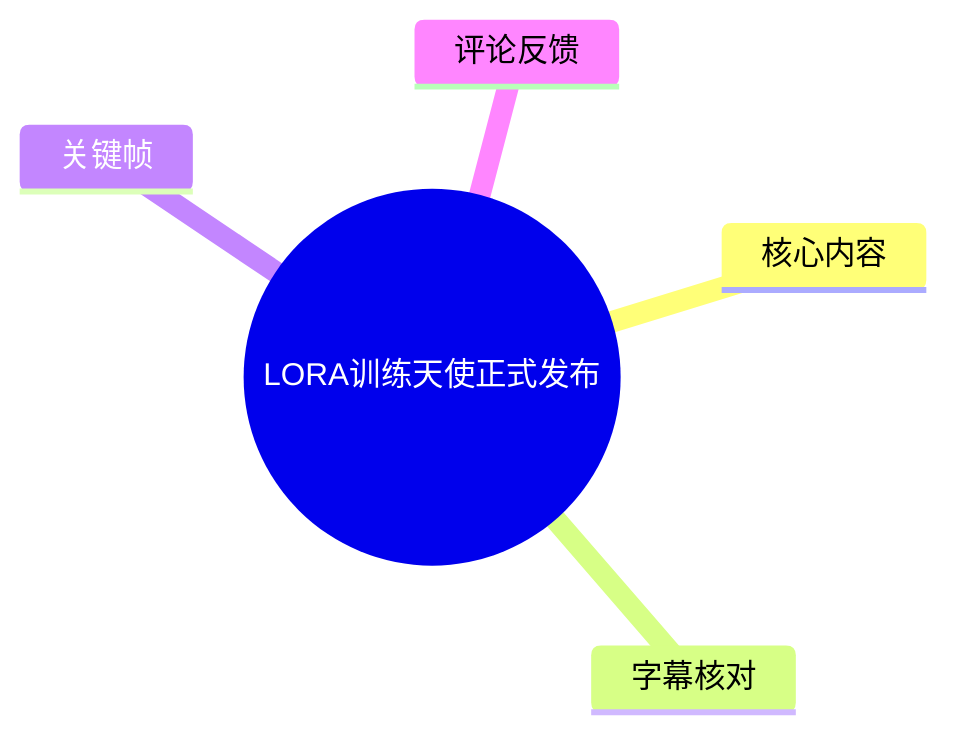
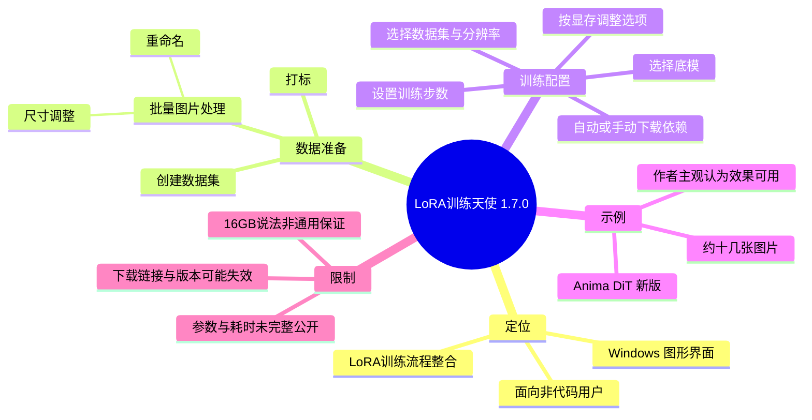
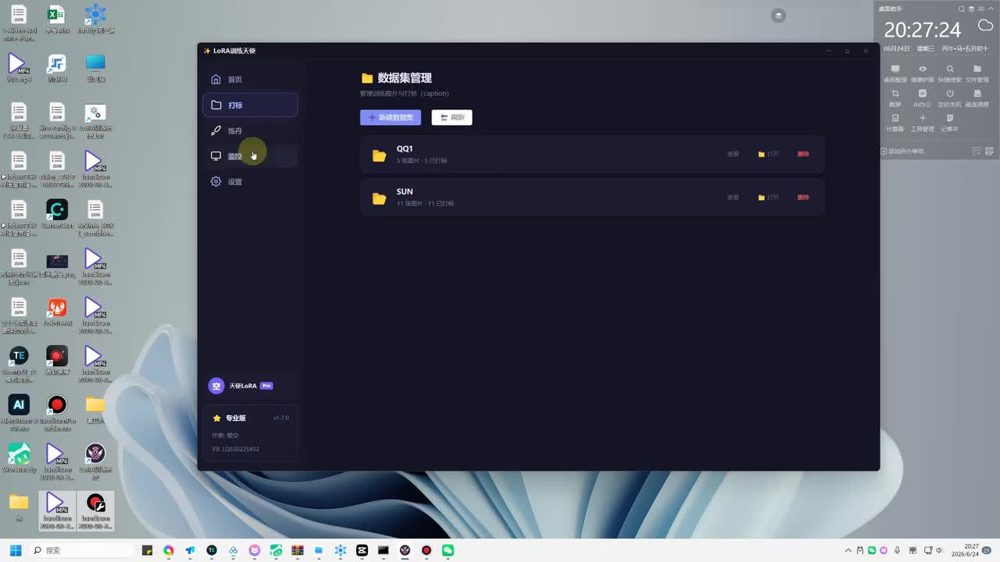
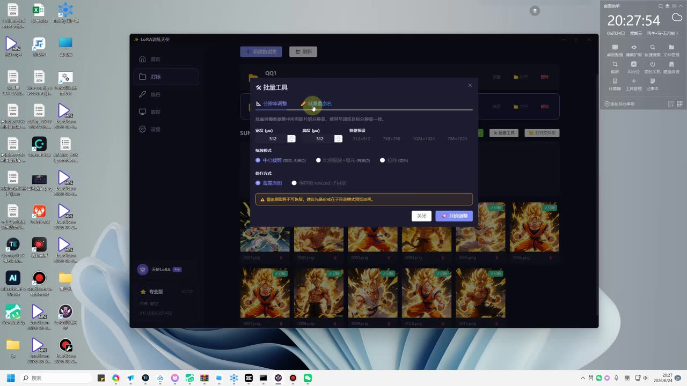
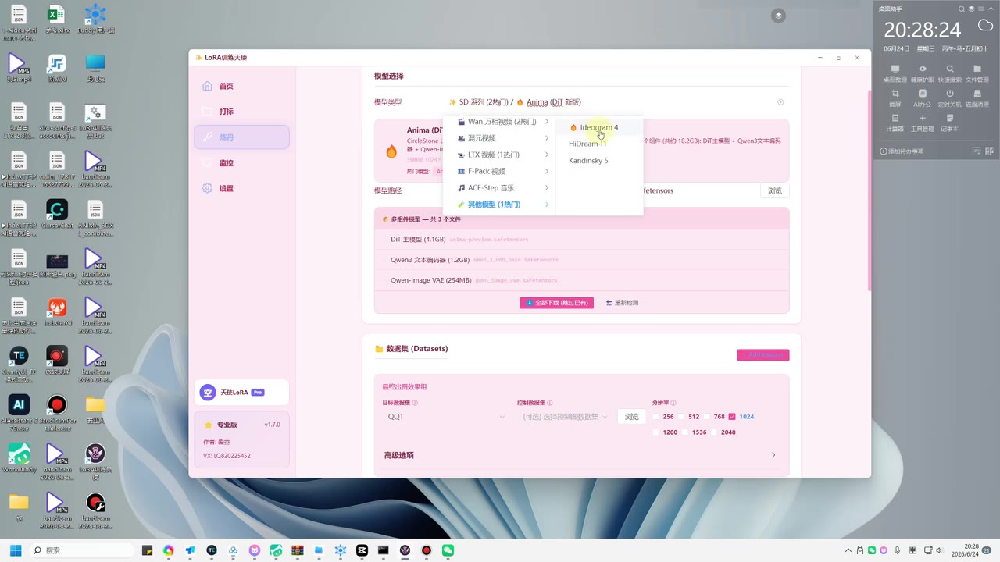
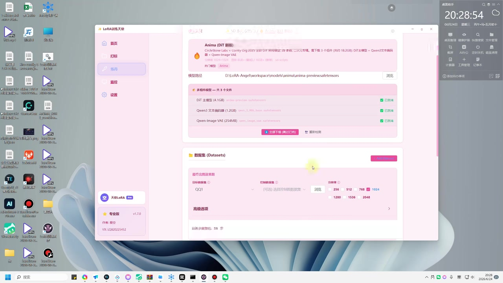

# LORA训练天使正式发布

> 来源：[Bilibili 视频](https://www.bilibili.com/video/BV1PAjZ6LEzP)  
> UP 主：LoRA训练天使｜分区合集：AIcode｜视频时长：4 分 41 秒  
> 视频简介称：该工具面向不会写代码的用户，提供 LoRA 模型训练；获取方式包括私信回复“lora训练天使”，以及一个百度网盘链接。

## 小结

视频发布并演示了 Windows 桌面端工具“LoRA训练天使”1.7.0。作者将其定位为面向 AI 绘画新手的 LoRA 训练整合工具，重点是把数据集管理、图片预处理、打标、底模选择与下载、训练参数设置、训练过程监控等环节集中到图形界面中，降低手动安装、配置与命令行操作的门槛。

演示流程可概括为：先在“打标”页创建数据集；再通过批量处理工具处理图片尺寸、命名等；进入“练丹/训练”页选择底模、确认或下载相关依赖；选择数据集和分辨率，并按显存条件配置训练步数与高级选项；最后启动训练并在监控区域查看结果或信息。

视频画面可确认软件提供多个模型类别与模型项，训练示例选择的是 **Anima（DiT 新版）**。其依赖区域列出了 DiT 主模型（4.1GB）、Qwen3 文本编码器（1.2GB）与 Qwen-Image VAE（254MB）；画面还显示训练分辨率选项为 256、512、768、1024、1280、1536、2048。作者口述称 16GB 显存可以进行训练，但并未在视频中给出所有模型、分辨率、批大小组合下的显存表或耗时测试，因此不能将其理解为普遍保证。

效果展示中，作者称自己用约十几张图片训练了一个动漫模型 LoRA，并认为加入 LoRA 后生成效果明显优于未使用 LoRA 的结果。该结论属于作者单次演示体验，视频未展示完整数据集、提示词、随机种子、训练步数、学习率或可复现实验对照，适合当作功能示例，不应据此推导稳定质量。

时效上，本视频所示版本为 **v1.7.0**，发布信息与视频抓取时间均指向 2026 年 6—7 月期间；模型目录、依赖下载源、授权/机器码机制、分享链接和软件功能均可能后续变化。使用前应优先以作者当期发布页、安装包内说明与实际界面为准。

## 思维导图

## 目录

- [发布背景与工具定位](#发布背景与工具定位-0000)
- [功能界面与数据集管理](#功能界面与数据集管理-0020)
- [图片预处理与打标](#图片预处理与打标-0045)
- [选择模型、下载依赖与训练配置](#选择模型下载依赖与训练配置-0120)
- [训练、监控与路径设置](#训练监控与路径设置-0250)
- [作者的效果示例、经验与限制](#作者的效果示例经验与限制-0340)
- [字幕比对](#字幕比对-0400)
- [评论分析](#评论分析-0420)
- [处理记录](#处理记录-0440)

## [发布背景与工具定位](https://www.bilibili.com/video/BV1PAjZ6LEzP?t=0) {#发布背景与工具定位-0000}

视频开头宣布“LoRA训练天使”正式推出，并说明其目标是让不写代码的用户也能完成 LoRA 训练。作者强调工具将国内外方案的一些优点做了整合，采用更简化的操作路径；按其口述，用户无需自行进行传统环境安装，可通过点击操作使用。

从视频简介可获得以下发布与获取信息：

- 工具面向“AI 绘画训练”场景，标签为“lora训练器”“训练天使”“lora”。
- 作者建议用户私信回复“lora训练天使”获取信息。
- 简介中还提供了百度网盘链接及提取码 `aiko`。
- 作者称因粉丝数不足，无法开通自动回复，因此私信回复不代表即时自动发放。
- 热评中出现“机器码”相关请求，提示该软件可能存在设备识别、授权或分发流程；但视频没有完整解释其机制，不能据此断言具体授权规则。

> **适用前提**：视频操作发生在 Windows 桌面环境中；画面虽展示了本地磁盘路径、模型文件与显存相关设置，但未给出系统版本、显卡型号、CUDA/Python 环境要求或安装包校验信息。

## [功能界面与数据集管理](https://www.bilibili.com/video/BV1PAjZ6LEzP?t=20) {#功能界面与数据集管理-0020}

软件左侧导航在画面中可见“首页”“打标”“练丹”“监控”“设置”等入口。作者先进入“打标”区域，界面标题为“数据集管理”，可创建并管理数据集文件夹；演示中已有名为 `QQ1` 与 `SUN` 的数据集条目。

> 图：该帧直观确认软件不是仅提供训练启动页，而是将数据集管理放在流程前端。左侧导航与“打标—练丹—监控—设置”的结构，说明视频所述工作流具有明确的步骤划分。

作者的操作逻辑是先创建一个用于 LoRA 训练的数据集，再对其中的图片进行标签与预处理。视频没有讲解图片筛选标准、最小样本数量、版权来源、人物肖像授权或标签格式规范，因此这些内容仍需使用者自行控制。

## [图片预处理与打标](https://www.bilibili.com/video/BV1PAjZ6LEzP?t=45) {#图片预处理与打标-0045}

作者表示打标区域集成了两个打标相关能力，但 ASR 对具体工具名称识别不清，无法据此可靠还原两个组件的准确名称。可以确认的是，界面还提供图片批量处理能力，用于在训练前统一图片规格。

画面中打开的“批量工具”窗口展示了以下可辨识选项：

1. **分辨率调整**：包含宽度、高度输入框；演示值为 `512 × 512`。
2. **快捷预设**：界面列出 `512×512`、`768×768`、`1024×1024`、`768×1024` 等预设或比例选项。
3. **缩放模式**：可见“中心裁剪”等选项；其余模式文字不够清晰，不作延伸解释。
4. **保存方式**：可选择直接覆盖或另存处理后的图片，具体全部选项以软件实际界面为准。
5. **警告提示**：窗口底部提示图片会按设置处理，用户应注意源图片与输出结果的保存策略。
6. **执行按钮**：“开始调整”。

> 图：该帧是理解“训练前数据标准化”的关键证据。它明确呈现了尺寸输入、预设尺寸、缩放方式和保存策略，而非仅依赖作者口述。

### 建议的实际操作顺序

1. 在“打标”页创建新数据集。
2. 将待训练图片导入对应数据集。
3. 检查图片内容是否一致、清晰且符合预期训练主题。
4. 打开批量工具，按目标底模与训练计划选择分辨率。
5. 明确选择裁剪/缩放策略，避免主体在处理后被裁掉。
6. 选择覆盖或另存；重要原图建议保留独立备份。
7. 执行批量处理并抽样检查输出图片。
8. 再进行打标或复核标签。

> 视频没有展示标签文本的具体写法、触发词规则、反标/去重方式，也没有展示自动打标结果的准确率。因此，批量打标结果应视为初稿，尤其是角色特征、服装、姿态和风格词，应人工抽查。

## [选择模型、下载依赖与训练配置](https://www.bilibili.com/video/BV1PAjZ6LEzP?t=120) {#选择模型下载依赖与训练配置-0120}

进入“练丹”页后，作者演示选择训练底模。其口述称市面常见模型基本都已包含，并提到动漫相关模型与新模型；这是作者对软件模型覆盖范围的描述，视频未提供完整支持清单，不能将“基本都有”理解为兼容所有模型。

关键帧中的下拉菜单可辨识出模型分类/项目，包括：

- `SD 系列（2种）`
- `Anima（DiT 新版）`
- 菜单中可见 `Ideogram 4`
- 其他条目因画面字号较小或遮挡，不作为准确清单记录

> 图：该帧用于校正 ASR 中含混的模型名。画面可见 “Ideogram 4”，而不是 ASR 所转写的“ID Glow 4”；因此正文以画面文字为准。

作者选择 `Anima（DiT 新版）` 后，界面列出“多组件模型——共 3 个文件”，并显示依赖状态。可从画面读取到的文件与大小如下：

| 组件 | 画面显示大小 | 说明 |
| --- | ---: | --- |
| DiT 主模型 | 4.1GB | Anima 所需组件之一 |
| Qwen3 文本编码器 | 1.2GB | Anima 所需组件之一 |
| Qwen-Image VAE | 254MB | Anima 所需组件之一 |

界面提供“全部下载（推荐）”按钮以及路径/下载相关操作。作者口述表示，若本地没有对应模型，可在工具内下载；若已经下载，则可直接使用。实际下载速度受网络、源站、文件体积和本地磁盘状态影响，视频中“蛮快”的评价仅代表作者体验。

> 图：该帧记录了本视频最具体的技术参数：Anima 的三项依赖、各自大小、已安装状态、模型路径、数据集选择与可选分辨率。这些信息比笼统的“选择模型即可训练”更具可操作价值。

### 视频所示训练配置项

训练页中可确认或由作者明确提及的配置维度包括：

| 配置项 | 视频信息 | 使用含义与注意点 |
| --- | --- | --- |
| 模型类型 | 选择底模，如 Anima（DiT 新版） | LoRA 通常需与目标基础模型体系匹配；跨体系兼容性未在视频验证。 |
| 模型路径 | 可浏览本地路径 | 需保证路径指向正确文件，且磁盘可用空间充足。 |
| 依赖组件 | Anima 示例为 3 个文件 | 缺少依赖时需下载；总占用至少应预留组件体积之外的训练空间。 |
| 数据集 | 示例选择 `QQ1` | 应与前一步创建、预处理和打标的数据集一致。 |
| 训练分辨率 | 256/512/768/1024/1280/1536/2048 | 更高分辨率通常对显存与训练时间要求更高；视频未给出每档推荐值。 |
| 训练步数 | 作者称可在界面设定、显示 | 视频未展示其示例训练的确切步数。 |
| 显存/显卡设置 | 作者要求用户按自己显卡情况选择 | 这是是否能启动与稳定训练的重要限制。 |
| 高级选项 | 画面存在“高级选项”入口 | 未展开完整参数，无法记录学习率、batch size、rank 等具体默认值。 |

作者还提到“交换块”“FP8”等高级设置或选项，但 ASR 对这段存在明显误识别，且关键帧未显示相关设置详情。仅能确认软件存在与显存/训练优化相关的可调项，不能确认具体开关名称、默认状态或作用机制。

## [训练、监控与路径设置](https://www.bilibili.com/video/BV1PAjZ6LEzP?t=170) {#训练监控与路径设置-0250}

完成模型、依赖、数据集与训练参数配置后，作者表示可直接开始训练；训练结束后，软件会给出相关信息。左侧导航中有“监控”入口，说明该工具设计上包含训练过程或结果信息查看区域，但视频没有持续录制一次完整训练任务，因此以下内容未被实际展示：

- 单次训练实际用时；
- 训练日志格式；
- 进度、损失值、显存占用的展示方式；
- 中断与断点续训机制；
- 成功/失败的判定条件；
- 输出 LoRA 文件的固定命名和目录规则。

作者称自己的电脑为 16GB 显存，并表示在示例条件下可以训练；同时提到更小显存与相关优化选项。对此应作严格区分：

- **视频事实**：作者以其 16GB 显存环境说明可以进行演示中的训练。
- **未被视频证实的部分**：16GB 是否适用于所有支持模型、所有分辨率、所有数据规模和全部高级选项。
- **实践结论**：应先以较小数据集与较低分辨率试跑，并观察实际显存占用，再提高分辨率或训练规模。

作者还说明，若模型较大而系统盘或安装盘空间不足，可在“设置”中调整路径、搜索或指定模型位置。此项设计的实际价值在于将大型模型与训练输出迁移至空间更充足的磁盘，避免系统盘被依赖文件、缓存、训练中间文件或输出模型占满。

视频还提到一个基于 DeepSeek 的 AI 辅助能力/API 设置入口，作者认为其可用于将问题显示出来或提供辅助；但视频未演示具体提问、返回结果、联网范围、计费方式、隐私处理或 API 配置步骤。不要将该功能视为可替代训练日志诊断和人工排错的确定性方案。

## [作者的效果示例、经验与限制](https://www.bilibili.com/video/BV1PAjZ6LEzP?t=220) {#作者的效果示例经验与限制-0340}

作者在结尾分享了自己的测试经验：其训练了一个动漫模型 LoRA，使用的数据约为十几张图片；在其生成对比中，未加载 LoRA 的结果较差，加载 LoRA 后的结果“效果蛮炸裂”，并认为已经可以使用、没有明显问题。

这一示例可提炼出的经验是：

1. 少量图片也可能得到可观察到的风格或主体迁移效果。
2. 数据集与目标底模匹配时，LoRA 可显著改变基础模型输出。
3. 面向新手的图形界面工作流能减少准备环节的操作复杂度。
4. 模型依赖、显存、分辨率与本地路径是训练前必须检查的现实条件。

但视频没有给出足以复现或评价该结果的完整信息，至少缺少：

- 原始图片及其清洗、裁剪、标注方式；
- 精确底模版本与校验值；
- LoRA 的 rank、alpha、学习率、优化器、批大小、epoch/步数；
- 提示词、负面提示词、采样器、采样步数、CFG、随机种子；
- 未加载与加载 LoRA 对比时是否保持其他生成参数一致；
- 多提示词、多姿势与不同权重下的泛化测试；
- 过拟合、人物一致性、版权与肖像权评估。

作者还谈到开发成本：称使用 AI 修复 Bug 消耗了“2 亿 token”，并表示免费分享后意识到工具开发和维护有成本，希望“回一点血”。这些均为作者自述，视频没有提供 token 账单、成本计算方法、收费方案或正式服务条款，不能据此量化其实际支出或判断后续商业模式。

## [字幕比对](https://www.bilibili.com/video/BV1PAjZ6LEzP?t=240) {#字幕比对-0400}

本次任务已执行 ASR。站内字幕与视频主题严重不符，内容是音乐歌词与“开学前赶作业”片段，显然不能用于本视频的知识整理。

| 字幕来源 | 完整性 | 专有名词 | 时间轴 | 主要问题 |
| --- | --- | --- | --- | --- |
| Bilibili 站内字幕 | 与本视频内容不对应 | 无法覆盖 LoRA、模型、训练等术语 | 未提供可用逐句时间信息 | 字幕内容为无关歌词和其他视频对白，属于错误或错配字幕。 |
| 本次 ASR 字幕 | 覆盖了主要讲解顺序与结尾经验分享 | 能识别 LoRA、Anima、DeepSeek、Qwen 等部分术语 | 素材中未提供逐句时间戳，仅能按视频流程分段定位 | 存在同音误识别、断句混乱和术语错误，例如“Lola”“电单”“ID Glow”。 |

### 最终字幕选择与校正原则

正文以**本次 ASR**作为主要文本来源，并以关键帧界面文字、视频上下文和元数据进行有限校正；站内字幕不予采用。重要校正如下：

| ASR 原文/疑似误识别 | 正文处理 | 校正依据 |
| --- | --- | --- |
| “Lola训练天使” | LoRA训练天使 | 视频标题、UP 主名称与软件窗口标题一致。 |
| “电单/练单” | 训练页或“练丹”页 | 软件左侧菜单与作者语境均指向训练流程。 |
| “ID Glow 4” | Ideogram 4 | 模型下拉菜单关键帧中可见英文 `Ideogram 4`。 |
| “Anima八锥显存” | 保留为显存相关口述，不给出具体数值结论 | ASR 不可靠，画面未显示可核验的完整句子。 |
| “deep sea” | DeepSeek | 作者口述上下文为 AI/API 功能，ASR 存在常见音近误识别。 |
| “YOLO” | LoRA | 视频始终围绕 LoRA 训练，且作者在效果对比处语义应为加载 LoRA。 |

## [评论分析](https://www.bilibili.com/video/BV1PAjZ6LEzP?t=260) {#评论分析-0420}

素材接口请求热评前三条，但实际仅获取到 **2 条**，因此以下只分析可获取内容，不补写不存在的第三条评论。

1. **华文爱研究**（获赞 2）：“大佬 加你了 通过下 发你机器码”  
   - 观点/诉求：评论者已尝试添加作者，希望获得机器码。  
   - 补充信息：侧面表明部分用户可能需要通过机器码完成使用、授权或激活相关流程。  
   - 可信度与限制：这是单个用户的请求，不足以证明软件的完整授权方式、收费状态、机器码用途或作者是否会发放。

2. **萌皇驾到**（获赞 1）：“我去，又更新了吗[打call]”  
   - 观点/诉求：评论者认为该工具可能已有此前版本，并对更新表示积极态度。  
   - 补充信息：与画面显示的 v1.7.0 相互呼应，说明视频可能处于持续迭代背景。  
   - 可信度与限制：评论未说明更新内容、旧版版本号或实际使用体验，不能作为版本变更记录。

评论区未出现对训练质量、稳定性、安全性、收费规则或下载可用性的可验证技术测评。使用者仍应以软件当前版本的官方说明和本地测试为准。

## [处理记录](https://www.bilibili.com/video/BV1PAjZ6LEzP?t=280) {#处理记录-0440}

- **Worker ID**：`worker-mrj0wjed-b0c290ad`
- **模型**：`gpt-5.6-terra`
- **工具与素材**：使用任务提供的视频元数据、视频素材清单、站内字幕、已执行的 ASR 字幕、热评接口结果与关键帧进行整理；未对缺失信息作外部推断或补全。
- **字幕选择**：已比较站内字幕与本次 ASR。站内字幕与视频内容明显错配，弃用；采用 ASR 为主，并以关键帧可见文字校正模型名、软件名和部分术语。
- **关键帧选择依据**：
  - `frames/frame-001.jpg`：展示数据集管理和左侧流程导航；
  - `frames/frame-002.jpg`：展示图片批量尺寸调整工具及 512×512 参数；
  - `frames/frame-003.jpg`：展示模型选择菜单，用于校正 `Ideogram 4` 名称；
  - `frames/frame-004.jpg`：展示 Anima 依赖文件、大小、模型路径、数据集和分辨率选项。
- **评论处理范围**：按“热评前三条”要求请求数据；实际可获取 2 条，仅分析这 2 条。
- **缓存清理**：素材清单未提供缓存清理执行日志；本整理未声明或假设缓存已被清理。
- **未解决问题**：
  - 未提供精确逐句 ASR 时间戳，章节时间为依据视频讲解流程的近似定位；
  - 无法从素材确认完整模型支持列表、收费/授权机制、机器码用途、下载稳定性及 API 配置细节；
  - 未展示完整训练日志与可复现生成参数，作者效果示例不能独立复验。

## 评论分析

本次流程未获取到可用热评，因此不推断观众态度或额外结论。
