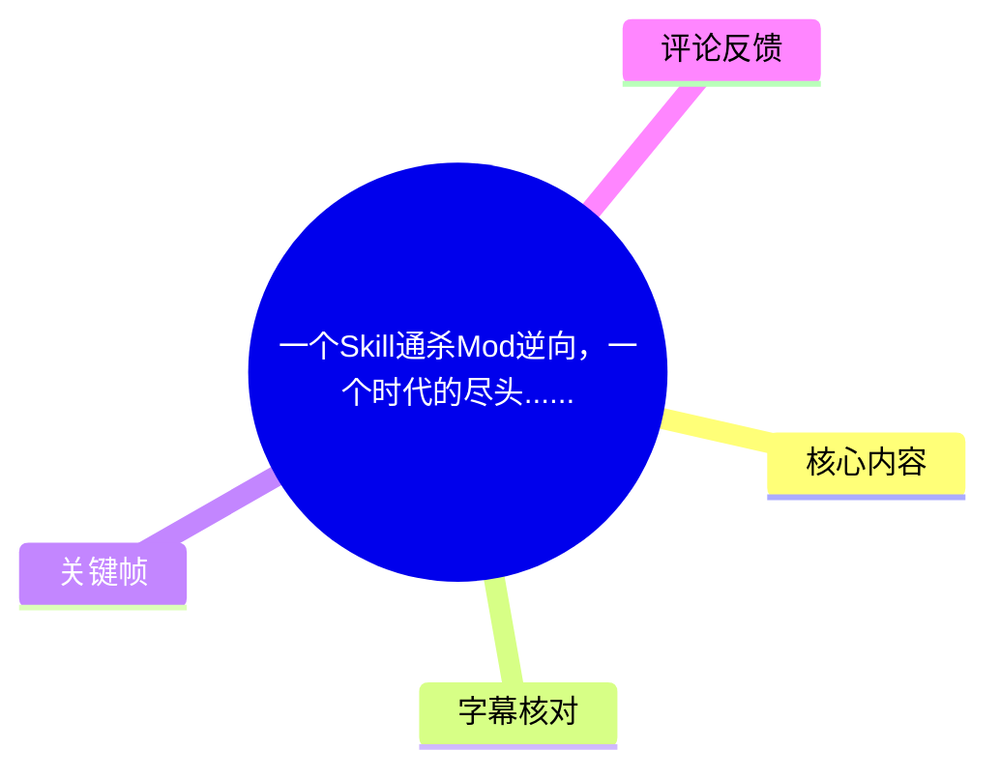
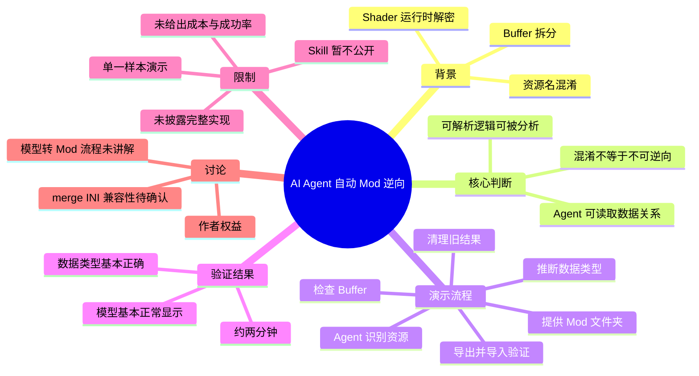
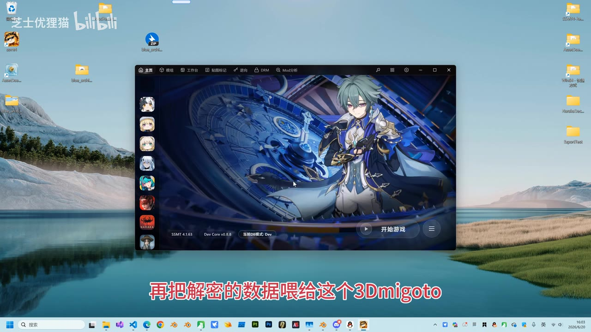
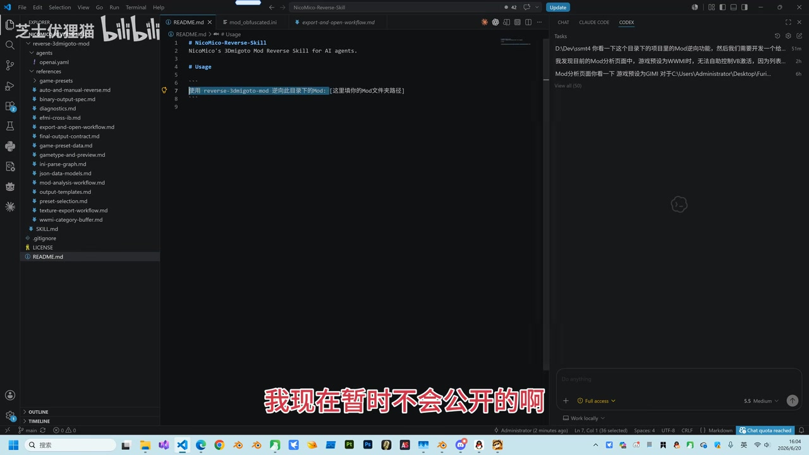
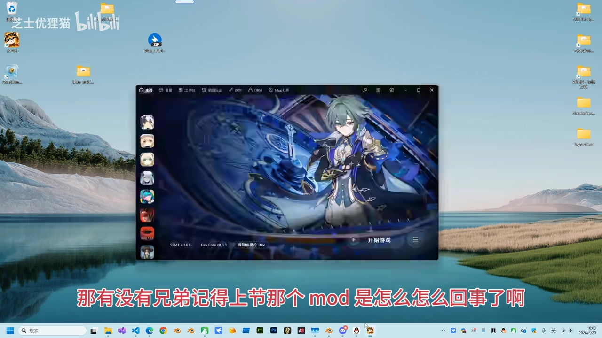

## 小结

视频演示了一个面向 AI Agent 的 3Dmigoto Mod 逆向 Skill。UP 主的核心判断是：对于仍然**可解析**的 Mod，即便作者通过 Shader/HLSL 对 Buffer 进行拆分、混淆或运行时解密，Agent 仍可通过读取文件、分析逻辑、检查实际数据并生成处理流程，完成模型相关数据的逆向与导出。

演示使用的是上期出现过的“资源名混淆”Mod。UP 主先清理旧测试结果，再将“逆向指定 Mod”的任务和 Mod 文件夹路径交给 Agent。Agent 随后识别 Mod、检查 Buffer、组织 VB（Vertex Buffer，顶点缓冲区）与 IB（Index Buffer，索引缓冲区）、匹配顶点数据类型，并写出结果。

UP 主称，本次样本大约两分钟左右完成逆向；随后将结果导入 SSMT 相关工具验证，画面中的模型能够基本正常显示，且数据类型被评价为“基本正确”。这说明该样本获得了可用结果，但不等于所有 Mod、游戏、资源结构或加密方案都能稳定自动逆向。

视频最重要的限制是：**Skill 暂不公开**。UP 主明确表示，出于不希望“赶尽杀绝”Mod 作者的考虑，只展示这种能力的存在及简化用法，不提供完整 Skill、规则文件、实现代码、详细提示词或可复现环境。

该视频属于特定时间、特定样本和特定工具环境下的演示。模型能力、Agent 工具链、SSMT/3Dmigoto 工作流、Mod 文件结构及混淆策略都可能变化；同时，视频未披露成功率、失败样本、实际成本、输入文件规模、支持范围和授权边界，不能将其视为普适性能基准。

## 思维导图

## 目录

- [视频背景：混淆与运行时解密设想](#视频背景混淆与运行时解密设想)
- [Skill 的定位与不公开策略](#skill-的定位与不公开策略)
- [AI Agent 自动逆向流程](#ai-agent-自动逆向流程)
- [结果验证：导入与模型显示](#结果验证导入与模型显示)
- [技术要点、参数与实践经验](#技术要点参数与实践经验)
- [结论、限制与时效性](#结论限制与时效性)
- [字幕比对](#字幕比对)
- [评论分析](#评论分析)
- [处理记录](#处理记录)

## 视频背景：混淆与运行时解密设想 [00:08](https://www.bilibili.com/video/BV199jJ6REts?t=8)

视频围绕 3Dmigoto Mod 的逆向与模型数据提取展开。UP 主先回顾此前的 Mod 分析场景，并提出 Mod 作者可能采用的保护思路：

1. 将原本可直接读取的 Buffer 数据拆成多个部分；
2. 对 Buffer 进行混淆或加密；
3. 使本地落盘文件保持加密状态；
4. 在 Mod 运行时，通过 Shader、HLSL 等逻辑解密数据；
5. 将解密后的数据交给 3Dmigoto，供模型显示链路继续使用。

UP 主明确表示，这种方案在实现层面“可行”。也就是说，静态文件中的模型数据可以不再是直接可读状态，而是依赖运行时逻辑恢复。

> 图：画面显示 SSMT 界面、角色模型和“再把解密的数据喂给这个 3Dmigoto”的字幕。它对应视频提出的数据路径：落地数据经 Shader/HLSL 解密后，仍需进入 3Dmigoto 相关渲染或 Mod 工作流。

### 视频对混淆方案的判断 [00:35](https://www.bilibili.com/video/BV199jJ6REts?t=35)

UP 主的观点是：如果混淆、拆分或加密逻辑本身仍然可以被分析，那么它们未必能阻止具备相应 Skill 的 AI Agent 进行逆向；更多可能增加的是实现复杂度、运行开销或 Mod 卡顿，而非形成绝对不可逾越的障碍。

视频中的论述可以拆分为两层：

- **视频展示的主张**：Agent 可以像人工逆向者一样读取逻辑、检查数据关系，并在必要时写出恢复或解密数据的小程序/处理过程。
- **视频没有证明的结论**：任何加密或混淆都必然无效；所有 Mod 都能在短时间内自动逆向；AI 在每一种场景下都优于人工分析。

因此，视频应被理解为“一个可用能力与样本演示”，而不是对 Mod 保护强度的通用定理。

## Skill 的定位与不公开策略 [01:04](https://www.bilibili.com/video/BV199jJ6REts?t=64)

### 画面可见的 Skill 项目结构 [01:04](https://www.bilibili.com/video/BV199jJ6REts?t=64)

UP 主将演示能力称为用于 3Dmigoto Mod 逆向的 Skill。画面中的代码编辑器显示一个名为 `NicoMico-Reverse-Skill` 的项目，README 标题可辨认为：

> NicoMico's 3Dmigoto Mod Reverse Skill for AI agents.

项目目录中可见以下内容：

- `agents`
- `references`
- `SKILL.md`
- `README.md`
- 自动/手动逆向相关文档
- 二进制输出、诊断、导出与打开等工作流文档
- INI 解析、JSON 数据模型、Shader 分析、纹理导出等参考资料
- WWMI 分类 Buffer 相关文档

> 图：该帧同时展示了 Skill 工程目录、README 中的简化调用说明和右侧 Agent 面板。它说明视频展示的并非一句泛化提示词，而是由 Skill 文档、参考资料和 Agent 执行环境组成的工作流。

从画面可合理确认：该 Skill 至少包含任务说明与参考资料集合，用于帮助 Agent 处理 3Dmigoto Mod 的识别、分析、导出和验证。但视频没有公开全部文件内容，因此无法据此复原完整工作流或具体实现。

### 简化用法与公开限制 [01:18](https://www.bilibili.com/video/BV199jJ6REts?t=78)

视频展示的使用方式很简化：要求 Agent 使用名为 `reverse-3dmigoto-mod` 的能力逆向指定目录中的 Mod，并提供目标 Mod 文件夹路径。

UP 主强调，用户侧不需要逐项手动执行传统工具操作；操作模式是：

1. 描述逆向任务；
2. 指定待处理 Mod 的目录；
3. 让 Agent 根据 Skill 读取文件、分析并执行工作流；
4. 最后对输出进行人工验证。

不过，UP 主也多次明确表示该 Skill **暂时不公开**。其给出的理由是希望给 Mod 作者留出空间，不愿意将作者“赶尽杀绝”。视频简介和置顶热评也与这一立场一致。

因此，本视频不是完整复现教程；其中没有披露：

- 完整的 `SKILL.md`；
- 全部参考文档与规则；
- 具体 Agent 权限和工具调用配置；
- 输入目录实例；
- 解密或恢复脚本；
- 输出文件格式细节；
- 可复制的提示词与环境配置。

## AI Agent 自动逆向流程 [01:43](https://www.bilibili.com/video/BV199jJ6REts?t=103)

### 1. 清理旧测试结果，选定混淆样本 [01:43](https://www.bilibili.com/video/BV199jJ6REts?t=103)

UP 主首先要求删除此前测试产生的逆向结果，再选用上期出现过的、资源名称经过混淆的 Mod 进行演示。

清理旧结果的目的，是避免旧输出与本次输出混在一起，影响后续导入验证和结果判断。这个细节反映出逆向实践中应尽量做到：

- 原始 Mod 与输出目录分离；
- 每次测试有清晰的输出位置；
- 避免历史结果造成误判；
- 保留必要日志，以便排查失败原因。

### 2. 提交任务与 Mod 文件夹路径 [02:00](https://www.bilibili.com/video/BV199jJ6REts?t=120)

UP 主将输入概括为“逆向此 Mod”以及对应的 Mod 文件夹路径。视频口述称使用了一个标为“5.5”的普通/Medium 模式，而没有开启最高模式。

由于 ASR 对模型名称和模式名称存在误识别，且视频未提供可独立核验的产品信息，本文只保留以下事实表述：

- 视频展示了在 Agent 面板中执行任务；
- 画面可见模式标记为 `5.5 Medium`；
- UP 主称未使用最高档位；
- 无法仅根据素材确认准确模型产品名、版本号、订阅级别、上下文上限或调用参数。

### 3. 识别 Mod、检查 Buffer 与组织数据 [02:19](https://www.bilibili.com/video/BV199jJ6REts?t=139)

在 Agent 执行过程中，UP 主观察到它已经识别 Mod，并开始验证 Buffer。视频提到了以下处理方向：

- 识别 Mod 的基本结构；
- 检查模型相关资源和 Buffer；
- 将数据分类；
- 组织 VB；
- 处理或统一写出 IB；
- 匹配顶点数据类型；
- 检查顶点数据；
- 将结果导出到目标目录。

术语说明：

| 术语 | 视频中的作用 |
| --- | --- |
| Buffer | Mod 模型数据的承载对象，可能被拆分、混淆或加密 |
| VB | Vertex Buffer，顶点缓冲区，包含位置、法线、UV、权重等顶点相关属性的可能载体 |
| IB | Index Buffer，索引缓冲区，用于定义顶点组成面片的索引关系 |
| Shader / HLSL | 视频假设中负责运行时解密或恢复 Buffer 数据的逻辑位置 |
| 3Dmigoto | 视频所讨论的 Mod 工作流相关工具生态 |
| SSMT | 视频中用于后续导入与模型显示验证的工具界面 |

ASR 中存在“统一写成某个具体格式/数值”等片段，但具体数字与格式无法从已提供素材可靠确认，因此不将其整理为确定参数。

### 4. 对拆分、混淆和加密逻辑的处理主张 [02:46](https://www.bilibili.com/video/BV199jJ6REts?t=166)

UP 主认为，若作者将 Buffer 分拆多次，或者通过 Shader/HLSL 对其加密、解密，AI Agent 仍可以通过阅读全部逻辑、检查实际数据和理解处理链路来恢复结果。

视频中的关键判断是：

> 只要逻辑仍可解析，且 Skill 写得足够好，AI 可以像人工分析者一样继续完成逆向。

这一段可迁移的经验不是“保护必然无效”，而是：

1. **文件表面的混淆不等于逻辑不可分析。**  
   若运行时必须恢复数据供程序或渲染链路使用，则恢复逻辑本身可能成为分析入口。

2. **自动化能力依赖 Skill 覆盖范围。**  
   Agent 的效果并不只取决于基础模型，也取决于 Skill 是否包含目标文件格式、资源关系、错误诊断和验证流程。

3. **复杂度可能转化为成本。**  
   UP 主明确说“成本问题先不说”。因此，视频只说明“能否做到”的主张，没有说明复杂保护下的时间、Token、API 费用、工具调用次数或稳定性。

4. **结果需要实测闭环验证。**  
   即使逻辑推断看似正确，仍需导入模型工具检查顶点、索引、材质、骨骼及显示情况。

### 5. 中间变量冲突与等待过程 [03:23](https://www.bilibili.com/video/BV199jJ6REts?t=203)

演示中，Agent 遇到了“已有变量名冲突”一类问题。UP 主认为这是一个无需过度关注的小问题，并继续等待流程完成。

这至少说明：

- 自动化流程并非没有中间异常；
- Agent 执行中会出现变量、命名或处理链路层面的冲突；
- 视频未完整展示报错详情、修复动作、重试次数或是否存在人工干预。

因此，不能把这段表述为“Agent 已自动修复所有问题”；较准确的说法是：视频展示了存在小问题，但最终流程继续推进到输出与验证阶段。

## 结果验证：导入与模型显示 [04:09](https://www.bilibili.com/video/BV199jJ6REts?t=249)

### 输出结果与耗时表述 [04:09](https://www.bilibili.com/video/BV199jJ6REts?t=249)

UP 主在此阶段表示逆向“基本完成”，并查看 Agent 写出的输出目录。其口述称，AI 大约在两分钟左右给出了结果。

这个耗时只能作为本次演示样本的观察结果，不能视为通用性能指标，因为视频未披露：

- 待处理 Mod 的文件体积；
- Buffer 数量和顶点规模；
- 纹理、骨骼、权重等资源复杂度；
- 是否使用缓存；
- 模型上下文长度；
- Agent 实际调用的工具数量；
- 网络或本地磁盘性能；
- 是否有重复运行；
- 多次测试下的时间波动；
- Token、API 或订阅成本。

### 导入验证与显示结果 [04:39](https://www.bilibili.com/video/BV199jJ6REts?t=279)

UP 主随后在 SSMT 相关界面中进行一键导入，并称导入后的数据类型“基本上都是正确的”；继续查看模型后，给出“基本正常”的评价。

> 图：该帧展示 SSMT 中的角色模型界面。它的价值在于说明视频并非只停留在 Agent 输出文本或文件，而是将结果带入模型工具进行可视化检查。

可从视频确认与不能确认的内容应区分如下：

| 视频中已展示或口述 | 素材未提供，不能确认 |
| --- | --- |
| 特定 Mod 已完成一次逆向输出 | 是否逐顶点完全还原原始模型 |
| 输出结果已尝试导入工具 | 骨骼、权重、形态键是否完整正确 |
| UP 主认为数据类型基本正确 | 材质、纹理、贴图路径是否全部正确 |
| 模型画面基本正常显示 | 是否存在隐藏面、破面、法线错误等问题 |
| 样本为资源名混淆 Mod | 对其他游戏和其他保护方案的成功率 |

> 图：该帧用于补充说明视频是在本地 Windows 桌面和 SSMT 环境中进行操作。它不证明 Skill 的完整配置，但能帮助读者理解验证不是纯云端聊天，而是涉及本地文件与工具链。

## 技术要点、参数与实践经验 [02:19](https://www.bilibili.com/video/BV199jJ6REts?t=139)

### 视频实际展示的最小操作链 [01:18](https://www.bilibili.com/video/BV199jJ6REts?t=78)

在不补造未公开 Skill 内容的前提下，视频展示的操作顺序可以整理为：

1. **准备测试环境**  
   选定待分析的 3Dmigoto Mod 文件夹；清理之前的测试输出。

2. **提交自然语言任务**  
   向 Agent 说明要逆向指定 Mod，并提供其文件夹路径。

3. **由 Agent 读取与分析**  
   Agent 根据 Skill 和参考资料读取 Mod 文件，识别资源、检查 Buffer，并分析数据关系。

4. **推断模型数据组织方式**  
   对顶点、索引等数据分类，组织 VB 与 IB，并匹配顶点属性的数据类型。

5. **处理可解析的混淆/解密链路**  
   若存在拆分、混淆或运行时解密逻辑，则按视频主张，Agent 可理解逻辑并尝试生成恢复数据的处理步骤。

6. **导出逆向结果**  
   Agent 将处理后的结果写入输出目录。

7. **在工具中导入验证**  
   使用 SSMT 或视频展示的相关工具导入结果，检查数据类型及模型显示。

8. **人工复核**  
   以模型是否能正常显示作为最低层级验证；在更严格的实践中，还应检查骨骼、权重、材质、贴图、法线与拓扑。

### 可确认的参数与不可确认的参数 [02:00](https://www.bilibili.com/video/BV199jJ6REts?t=120)

| 项目 | 可从素材确认的内容 | 不可确认或未披露的内容 |
| --- | --- | --- |
| 视频总时长 | 408 秒，即 6 分 48 秒 | 无 |
| 演示对象 | 上期的资源名混淆 Mod | Mod 名称、游戏名称、文件规模 |
| Agent 模式 | 画面可见 `5.5 Medium`；UP 主称非最高档位 | 准确模型产品名、版本、计费方式、上下文参数 |
| 耗时 | UP 主称约两分钟左右 | 精确起止时间、重复测试方差 |
| 输入方式 | 任务描述 + Mod 文件夹路径 | 完整提示词、权限配置、命令行参数 |
| 输出验证 | 一键导入后，数据类型基本正确、模型基本正常 | 全量资源完整性与误差指标 |
| Skill | 存在 `reverse-3dmigoto-mod` 调用方式 | 完整 Skill 内容与实现 |

### 可迁移的实践经验 [02:46](https://www.bilibili.com/video/BV199jJ6REts?t=166)

- **建立“分析—导出—导入—显示”的验证闭环。**  
  逆向不能以“生成了文件”作为唯一完成标准；至少应在目标工具中导入并观察可视化结果。

- **隔离输入与输出。**  
  视频先删除旧测试结果。实际操作中应进一步保留原始文件副本、输出目录、日志和版本记录，避免覆盖导致无法回溯。

- **优先分析数据恢复逻辑。**  
  文件名、资源名和 Buffer 名称的混淆可能增加理解成本，但若数据在运行时仍需恢复并供渲染链路使用，逻辑关系仍值得分析。

- **将耗时视为样本数据。**  
  “约两分钟”与文件规模、保护强度、Skill 完整度、模型能力、工具权限和运行环境强相关，不能直接套用到其他 Mod。

- **明确授权与权益边界。**  
  视频作者以“给 Mod 作者留生机”为由暂不公开 Skill。分析、提取、二次使用或发布第三方 Mod 资源前，应取得必要授权，并遵守游戏、平台、Mod 作者和所在地区适用的规则。

## 结论、限制与时效性 [05:33](https://www.bilibili.com/video/BV199jJ6REts?t=333)

### 视频的趋势判断 [05:33](https://www.bilibili.com/video/BV199jJ6REts?t=333)

视频表达的核心趋势是：逆向工具的工作形态可能从人工逐项操作，转向由 AI Agent 结合 Skill、参考文档和自然语言任务自动编排流程。

针对资源名混淆，以及存在可解析 Shader/HLSL 解密链路的 Buffer 处理方案，UP 主认为 AI Agent 可以显著降低逆向的人工操作门槛。视频演示的重点不在某一条手工命令，而在于“将任务和目录交给 Agent 后，由 Agent 完成多步工具链工作”。

### 必须保留的边界 [05:47](https://www.bilibili.com/video/BV199jJ6REts?t=347)

- **Skill 未公开**：无法依据视频完整复现实验。
- **样本量有限**：视频展示的是一个资源名混淆 Mod，而非跨游戏、跨格式、跨保护方案的系统测试。
- **结果使用“基本正确”“基本正常”等表述**：这不等同于完整、无误差、可生产使用的验证结论。
- **成本被主动略过**：视频未讨论复杂混淆或多层解密下的运行时间与模型调用成本。
- **模型环境未完整披露**：无法严谨确认所用模型的准确名称、版本、上下文、权限、工具集和配置。
- **支持范围未知**：视频未列出可支持的游戏、Mod 格式、Shader 类型、INI 组织方式或失败条件。
- **合规问题未展开**：视频表达了保护 Mod 作者的态度，但没有给出版权、授权、平台规范或二次分发的具体方案。

### 时效性说明 [06:20](https://www.bilibili.com/video/BV199jJ6REts?t=380)

按元数据 Unix 时间戳换算，视频发布时间为 **2026-06-20 08:24:06 UTC**；素材抓取时间为 **2026-07-13**。视频时长为 408 秒。

AI Agent 的模型能力、IDE 集成方式、Skill 格式、SSMT/3Dmigoto 工具版本、Mod 文件组织方式和对抗策略都可能随时间变化。本文仅记录该视频及其所附素材所能支持的内容，不将演示效果外推为后续版本或其他环境下的保证。

## 字幕比对 [00:00](https://www.bilibili.com/video/BV199jJ6REts?t=0)

本次任务**已执行 ASR**。站内字幕也可获取，但其内容几乎完整描述“济南烧烤”“羊肉串”“厦门”等探店对话，与视频标题、关键帧、技术界面和 ASR 所呈现的 Mod 逆向主题完全不符，属于明显的字幕错配，不能用于正文事实整理。

| 字幕来源 | 完整性 | 专有名词 | 时间轴 | 主要问题 |
| --- | --- | --- | --- | --- |
| Bilibili 站内字幕 | 对本视频主题无效 | 不包含 3Dmigoto、SSMT、Shader、HLSL、Buffer 等关键技术词 | 未提供可用于本视频的有效分段时间 | 内容为烧烤探店对话，与技术演示完全错配 |
| 本次 ASR 字幕 | 覆盖视频主要口述流程 | 可识别 Mod、Shader、HLSL、3Dmigoto、Buffer、VB、IB、SSMT 等，但有音近字错误 | 原始 ASR 文本未提供逐句时间戳，本文按视频结构和关键帧进行章节定位 | 模型名称、Skill 名称、部分工具操作和数据格式存在误识别或断句混乱 |

### 最终字幕选择 [00:00](https://www.bilibili.com/video/BV199jJ6REts?t=0)

正文以**本次 ASR 字幕为主**，并使用视频标题、简介、标签、关键帧画面和上下文进行校正；站内字幕仅作为“存在明显错配”的质量记录，不参与技术内容提取。

关键校正如下：

| ASR 中的表现 | 正文处理方式 | 校正依据 |
| --- | --- | --- |
| “3D米高通货”“三里没头目”等 | 按 3Dmigoto Mod 相关语境整理 | 标题、标签、画面字幕及 README |
| “scale” | 仅表述为视频所说的 Skill，不断言该英文拼写准确 | 画面可见 Skill 工程，但无法完整确认发音对应拼写 |
| “ChatGBT 5.5”“Media” | 仅保留“画面可见 5.5 Medium、UP 主称普通模式” | 关键帧右下角模式显示与 ASR 相互印证 |
| “八法文件”“八百节口”等 | 归入 Buffer 讨论，不保留无法确认的格式参数 | 上下文持续讨论 Buffer、VB、IB 与顶点数据 |
| 导入阶段杂乱转写 | 保留“导入验证、数据类型基本正确、模型基本正常” | 后续口述与模型显示画面 |

## 评论分析 [06:48](https://www.bilibili.com/video/BV199jJ6REts?t=408)

仅分析可获取的热评前三条。评论反映的是作者或观众的观点、计划与疑问，不作为已验证技术事实。

1. **芝士优狸猫（23 赞）**  
   评论内容：  
   > 暂时不发skill赶尽杀绝了，如果市面上大量出现混淆mod的话再喊我公开[doge]

   该评论补充确认了视频中的公开策略：Skill 当前不会发布；若未来市场中出现大量混淆 Mod，UP 主可能考虑公开。这里的“可能公开”属于作者的未来意向，不等于已有确定的发布日期或发布承诺。

2. **胡萝卜花之王_（0 赞）**  
   评论内容：  
   > 大佬你好，我刚接触ssmt4还有逆向提取模型，想问问要具备什么条件才能将模型生成为mod？提示没有蓝图，但是我也不懂蓝图是什么[笑哭]

   该评论说明观众需求不止于“提取模型”，还包括将模型组织为可用 Mod 的后续制作流程，以及对“蓝图”概念的理解。视频本身主要演示自动逆向、Buffer 处理和导入验证，并未解释“蓝图”定义，也未提供从模型到完整 Mod 的制作教学，因此不能依据本视频给出确定答案。

3. **法外狂徒王老三（0 赞）**  
   评论内容：  
   > 有的模型好像只有一个merge的ini，也能读取吗

   该评论提出兼容性问题：部分 Mod 可能只有一个 merge 的 INI 文件，是否仍可读取。视频没有直接测试这种文件组织方式，也没有提供格式支持清单，因此无法确认该 Skill 是否支持该场景；这应视为需要作者回复或通过实际测试验证的问题。

## 处理记录 [00:00](https://www.bilibili.com/video/BV199jJ6REts?t=0)

- **Worker ID**：`worker-mrj0wbly-5dc4e50c`
- **模型**：`gpt-5.6-terra`
- **视频信息**：BV `BV199jJ6REts`；标题《一个Skill通杀Mod逆向，一个时代的尽头......》；UP 主“芝士优狸猫”；时长 408 秒；合集 `AIcode`。
- **使用素材与工具**：基于已提供的视频元数据、素材产物清单、站内字幕、已执行的 ASR 字幕、热评 JSON 数据与关键帧进行整理；素材清单包含 `merged.mp4`、`audio/audio.wav`、`frames/`、`comments/comments.json`、`subtitles/`、`asr/` 等产物。
- **字幕选择**：站内字幕可获取但与视频内容明显错配；本次 ASR 已执行，作为正文主文本来源，并由标题、简介、关键帧和上下文校正专有名词与语义。
- **关键帧选择依据**：
  - `frames/frame-001.jpg`：展示本地 Windows 桌面与 SSMT 启动环境，补充说明演示涉及本地工具链。
  - `frames/frame-002.jpg`：字幕明确出现“再把解密的数据喂给这个 3Dmigoto”，用于说明运行时解密后的数据流。
  - `frames/frame-003.jpg`：展示 SSMT 中的角色模型，适合对应导入后模型显示验证。
  - `frames/frame-004.jpg`：展示 `NicoMico-Reverse-Skill` 项目目录、README、`reverse-3dmigoto-mod` 用法和 Agent 面板，是 Skill 定位与未公开策略的关键画面证据。
- **未使用关键帧说明**：素材列出 `frame-001.jpg` 至 `frame-012.jpg`，但当前可见并可核实内容的画面集中于前四帧。正文仅引用与技术论点直接相关的帧，避免引用无法确认内容的图片。
- **评论范围**：严格仅处理可获取热评前三条，未延伸分析其他评论。
- **缓存清理**：素材清单未提供缓存目录、清理命令或清理结果日志；因此无法确认是否已执行缓存清理，记录为**未提供清理结果，无法核验**。
- **未解决问题**：完整 Skill 内容、完整提示词、精确模型产品信息、Agent 权限、输入 Mod 大小、运行成本、成功率、失败条件、支持游戏/格式清单、`merge` INI 兼容性及具体授权规则，均未在现有素材中充分披露。

## 评论分析

本次流程未获取到可用热评，因此不推断观众态度或额外结论。
