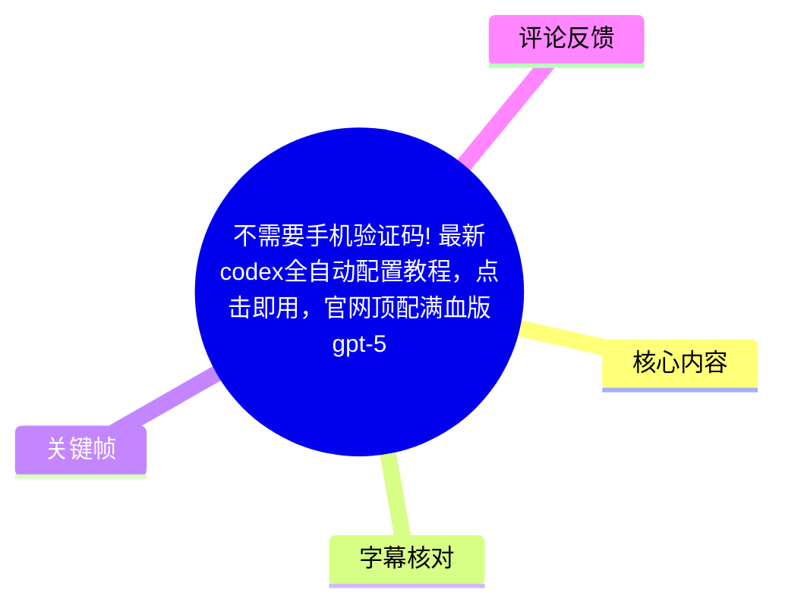
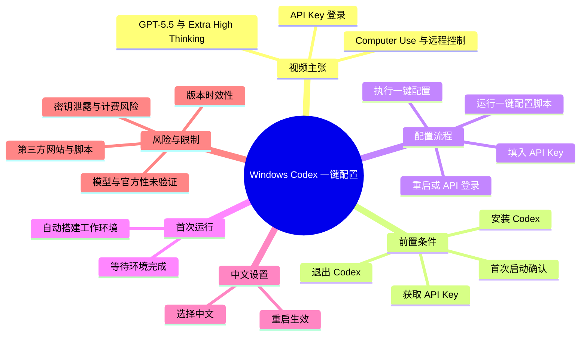
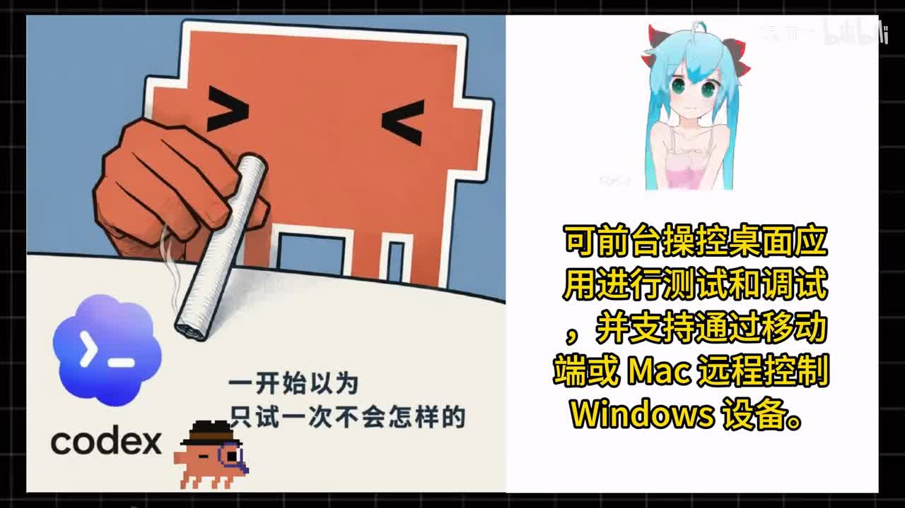
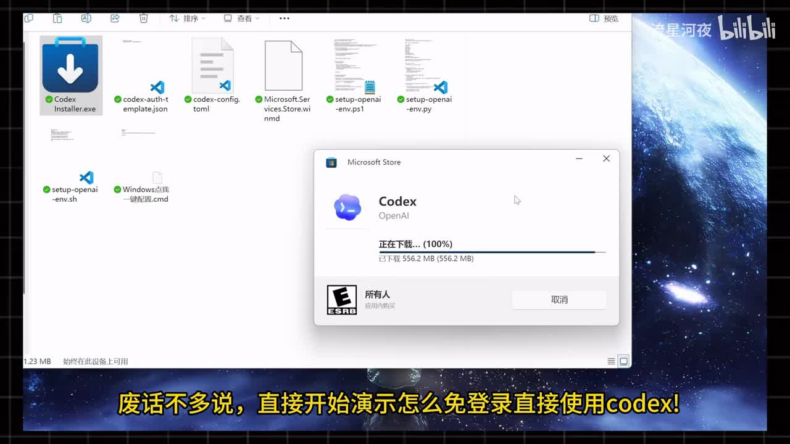
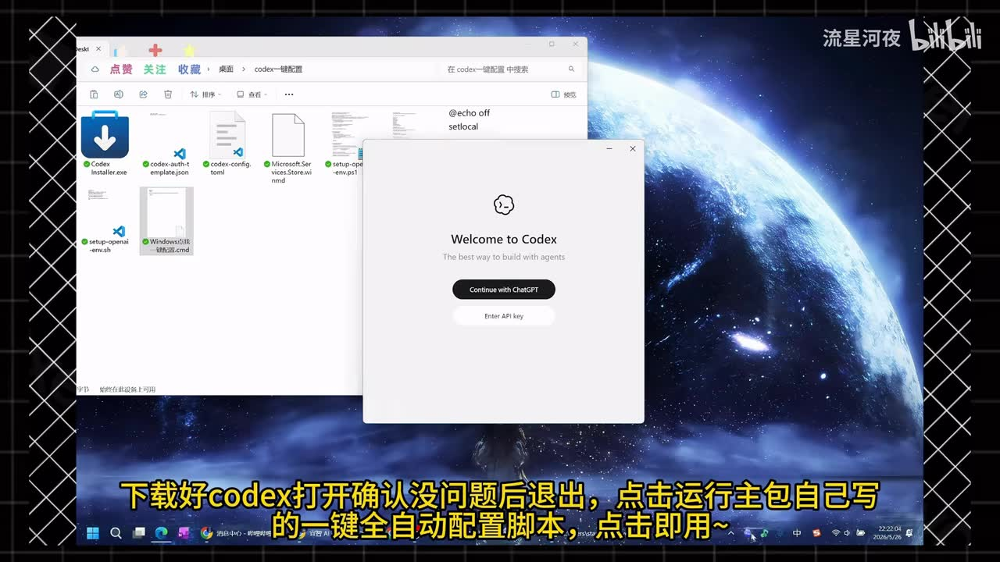
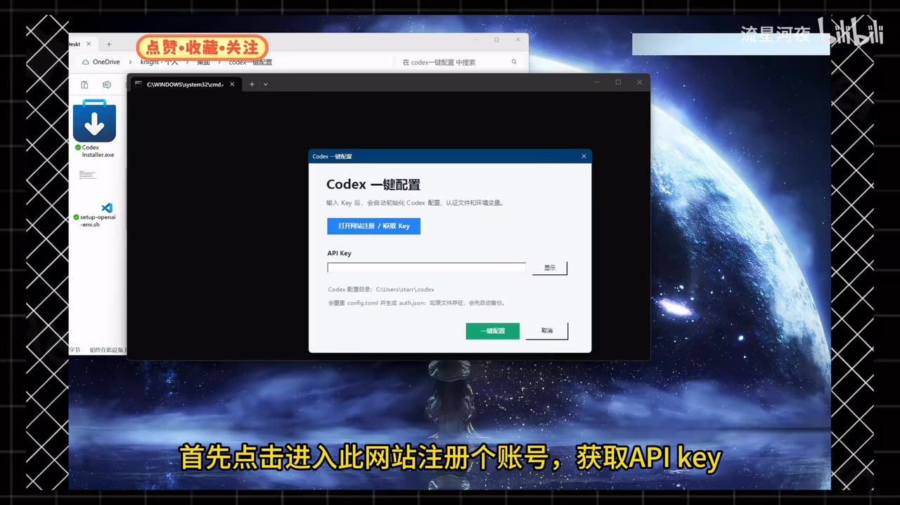

# 不需要手机验证码! 最新codex全自动配置教程，点击即用，官网顶配满血版gpt-5.5!

> 来源：[Bilibili 视频](https://www.bilibili.com/video/BV1vj7D6LEyc) 
> UP 主：流星河夜｜时长：1 分 43 秒｜分辨率：1920×1080  
> 本文仅整理视频演示和素材中可见信息，不将 UP 主、评论区或脚本的宣传性说法视为官方承诺。

## 小结

视频演示的是一套 Windows 上的 Codex 配置流程：先安装并确认 Codex 能启动，再退出程序，运行 UP 主提供的“Codex 一键配置”脚本；用户需要到视频指定的网站注册并取得 **API Key**，将其填入脚本后执行“一键配置”，最后重新启动 Codex 或在程序内选择 API 登录。

视频的核心方法并非真正“无需凭证”或“跳过授权”，而是把默认的 ChatGPT 登录入口替换/补充为 API Key 登录路径。关键帧显示，Codex 欢迎页同时有“Continue with ChatGPT”和“Enter API key”两个入口；一键配置工具提示会处理 `config.toml` 并生成 `auth.json`。这意味着该流程会把第三方获取的密钥写入本机 Codex 配置，账号、密钥、服务质量和费用责任仍由使用者承担。

UP 主称该方案可以使用“官方满血 GPT”“GPT-5.5”及“Extra High Thinking”模式，但视频没有给出官方产品页面、模型 ID、计费规则、请求日志、版本号或实测结果。尤其“GPT-5.5”“官网原版”“顶配”等均应视为视频及评论中的宣传性表述，不能据此确认模型真实名称、权限层级或可用性。

操作层面，视频明确演示了：安装包、若干配置文件、Windows 批处理脚本和一键配置界面；首次使用还要等待 Codex 自动搭建工作环境。后段补充了中文界面设置：在设置中选择语言后重启生效，但 ASR 与已提供关键帧均未呈现具体菜单层级，因此不能补写未展示的路径。

该内容适合希望了解“API Key 登录型 Codex 配置流程”界面结构的 Windows 用户。它不适合作为验证服务官方性、绕过账号验证、获取免费权益或安全使用第三方 API 的依据。视频发布后的客户端版本、认证机制、模型命名、API 兼容性和脚本行为均可能变化。

## 思维导图

## 目录

- [背景、视频主张与适用边界](#背景视频主张与适用边界-0000)
- [安装包与一键配置工具结构](#安装包与一键配置工具结构-0018)
- [获取 API Key 并执行配置](#获取-api-key-并执行配置-0024)
- [重启登录与首次工作环境](#重启登录与首次工作环境-0046)
- [中文设置与能力宣称](#中文设置与能力宣称-0111)
- [完整操作步骤与参数清单](#完整操作步骤与参数清单-0018)
- [限制、风险与时效性](#限制风险与时效性-0120)
- [字幕比对](#字幕比对-0000)
- [评论分析](#评论分析-0127)
- [处理记录](#处理记录)

## 背景、视频主张与适用边界 [00:00](https://www.bilibili.com/video/BV1vj7D6LEyc?t=0)

视频开头将 Codex 描述为 Windows 端已上线 “Computer Use” 与远程控制功能的产品：可在前台操作桌面应用来测试、调试，也可从移动端或 Mac 远程控制 Windows 设备。随后以“新手也能写代码”为卖点，转入安装与一键配置演示。

这里需要区分三类信息：

1. **视频陈述**：UP 主称 Codex 具备上述 Windows、桌面操控和远程控制能力。
2. **画面可确认内容**：后续确实出现了 Windows 上的 Codex 安装器、欢迎页和 API Key 入口。
3. **尚未由素材验证的内容**：Computer Use 的具体版本、远程控制的连接条件、可控制的设备范围、权限模型及安全策略，视频未进行实际功能展示，不能仅由开场字幕确认。

> 图：画面以大字说明“可前台操控桌面应用进行测试和调试，并支持通过移动端或 Mac 远程控制 Windows 设备”。它用于界定视频开场的功能主张，但并非该功能实际运行的证据。

## 安装包与一键配置工具结构 [00:18](https://www.bilibili.com/video/BV1vj7D6LEyc?t=18)

UP 主的顺序是：下载 Codex，打开确认软件无异常后退出，然后运行其提供的“一键全自动配置脚本”。视频强调“点击即用”，但实际仍要求用户提供 API Key。

从文件夹画面可见，该资源包至少包含以下名称或近似名称的文件：

| 画面所示文件/项目 | 可见用途或推测 |
| --- | --- |
| `Codex Installer.exe` | Codex 安装程序。 |
| `codex-auth-template.json` | 认证配置模板，名称表明可能与认证信息有关。 |
| `codex-config.toml` | Codex 配置文件。 |
| `Microsoft.Store...` | 名称被截断，画面无法确认完整文件名与用途。 |
| `setup-openai-env.ps1` | PowerShell 脚本，按文件名推测用于设置 OpenAI 环境变量；视频未展示脚本内容。 |
| `setup-openai-env.py` | Python 脚本，按文件名推测也涉及环境配置；未展示源代码。 |
| `setup-openai-env.sh` | Shell 脚本，按后缀适用于类 Unix 环境；其实际内容未展示。 |
| `Windows点击一键配置.cmd` | Windows 批处理入口，视频用它启动一键配置窗口。 |

文件夹和安装窗口表明资源包并不只是单一安装器，而是同时分发了认证模板、配置文件和多种脚本。由于视频没有展示脚本源码、下载校验值、发布者签名或网络请求，因此不能判断这些文件是否安全，也无法确认它们对系统、环境变量及 Codex 配置所做的全部修改。

> 图：资源包所在文件夹内可见安装器、`codex-auth-template.json`、`codex-config.toml` 及 `.ps1`、`.py`、`.sh`、`.cmd` 文件；前景为 Microsoft Store 的 Codex 下载窗口。这说明视频流程依赖一个包含多脚本的外部资源包，而非仅在客户端内点击设置。

首次打开 Codex 时，欢迎页显示两个身份验证选项：

- `Continue with ChatGPT`：通过 ChatGPT 继续；
- `Enter API key`：输入 API Key。

UP 主要求先确认 Codex 能正常启动再退出，意图应是确保客户端已安装，并使后续脚本可以处理对应配置位置。

> 图：Codex 欢迎页同时显示“Continue with ChatGPT”和“Enter API key”。它直接佐证了视频后续所说的 API Key 登录入口，也说明所谓“免登录”实际是改走密钥认证，而非不认证。

## 获取 API Key 并执行配置 [00:24](https://www.bilibili.com/video/BV1vj7D6LEyc?t=24)

视频在此处要求用户“进入此网站注册账号，获取 API Key”，并称该网站已使用很久；但素材没有提供网站 URL、网站主体、服务条款、模型供应商信息、价格、隐私政策或密钥权限范围。因此，无法确认该站是否为 OpenAI 官方服务，也无法验证其“官方满血 GPT”的说法。

随后的视频操作是：

1. 在目标网站的控制台页面进入与 API 有关的页面；
2. 复制一个 API Key；
3. 在“Codex 一键配置”窗口的 `API Key` 输入框粘贴密钥；
4. 点击“一键配置”。

关键帧显示，一键配置工具界面写有“输入 Key 后，会自动初始化 Codex 配置，以便文件和环境变量”。在输入框下方还显示：

- **Codex 配置目录**：画面中显示为 `C:\Users\starr\.codex`（用户名部分仅按画面读取，因分辨率与压缩不应外推为所有用户的固定路径）；
- **处理内容提示**：会覆盖 `config.toml` 并生成 `auth.json`；如果文件已经存在，会先自动备份。

这几个界面提示是流程中最重要的技术细节：脚本会触及认证文件和配置文件。即使脚本提供备份，使用者仍应在执行前自行保留原始配置副本，并确认配置中不会写入不可信的 API 基址、代理地址或其他环境变量。

> 图：窗口标题为“Codex 一键配置”，包含“打开网站注册 / 获取 Key”、`API Key` 输入框、“显示”按钮和“一键配置”按钮；底部提示将覆盖 `config.toml`、生成 `auth.json` 并尝试备份。这是理解脚本实际影响范围的关键画面。

## 重启登录与首次工作环境 [00:46](https://www.bilibili.com/video/BV1vj7D6LEyc?t=46)

视频称点击配置后“稍等片刻”，出现配置成功提示后重新打开 Codex。如果没有直接进入，则使用欢迎页下方的“通过 API 登录”方式，再次输入刚才的 API Key。

该处可以整理出两条进入路径：

| 情况 | 视频给出的处理 |
| --- | --- |
| 脚本配置完成后，Codex 可直接进入 | 直接开始使用。 |
| 重开后未直接进入 | 在 Codex 欢迎页选择 API Key 登录，并再次输入先前复制的 Key。 |

视频在约 00:56 宣布“成功配置好 Codex”，但未展示任何实际提问、代码生成、工具调用、模型信息或成功请求回显。因此，“配置成功”在素材中最多表示脚本或登录流程完成，不能等同于 API 可用、账户有余额、模型权限已验证或所有功能可正常运行。

约 01:01，UP 主特别提醒首次启动需要等待 Codex 自动搭建工作环境，完成后才能开始使用。视频没有说明环境构建会下载哪些组件、占用多少磁盘、是否需要管理员权限、耗时多久，或失败时怎样恢复；这些参数均不能从现有素材得出。

## 中文设置与能力宣称 [01:11](https://www.bilibili.com/video/BV1vj7D6LEyc?t=71)

UP 主在 01:11 后补充“怎么改成中文”，并称按视频步骤操作、选择完成后重启即可生效。当前提供的 ASR 仅记录了“选择完成后，重启生效”，关键帧也未覆盖语言菜单。因此可确认的操作只有：

1. 在某个设置界面选择中文；
2. 重启 Codex；
3. 语言设置生效。

具体应进入哪个菜单、选项的精确文字、是否需要安装语言包，素材均未给出，不能编造。

约 01:20 起，视频宣称配置完成后可直接使用“官网原版的 GPT-5.5”，还可开启“Extra High Thinking”模式。这里存在多重限制：

- ASR 对模型名识别为“GBT5.5”，结合视频标题和语境，本文统一转写为视频宣称的“GPT-5.5”，但**不代表已确认其为官方正式模型名**。
- 视频未展示模型下拉菜单、API 响应、账单页面、客户端版本或功能实际输出。
- “Extra High Thinking”仅作为视频口述出现，素材没有给出其设置入口、可用条件、耗费额度、性能差异或是否由官方提供。
- 经由第三方网站获得的 API Key 即使可被客户端接受，也不能由此推出其服务端模型、数据处理或计费与官方完全一致。

## 完整操作步骤与参数清单 [00:18](https://www.bilibili.com/video/BV1vj7D6LEyc?t=18)

以下按视频实际时间顺序归纳；其中“需要用户自行核验”的事项是基于视频未展示细节提出的安全边界，不是视频内额外操作。

1. **安装 Codex 并首次打开确认**（00:18–00:24）  
   运行资源包中的 `Codex Installer.exe` 或视频所示安装方式；启动 Codex，确认欢迎页可正常出现后退出。

2. **启动 Windows 一键配置入口**（00:18–00:24）  
   在资源包文件夹中运行 `Windows点击一键配置.cmd`，视频由此打开“Codex 一键配置”窗口。  
   - 视频未说明是否需要管理员权限；不要自行以管理员身份运行未知脚本，除非可确认脚本内容和必要性。

3. **注册并获取 API Key**（00:24–00:43）  
   点击配置窗口内“打开网站注册 / 获取 Key”，在目标网站注册并在控制台进入 API 相关页面，复制 API Key。  
   - 视频没有公开该站地址与合规信息。  
   - API Key 属于高敏感凭据，不应发送到评论区、聊天群、截图或不可信表单。

4. **填入密钥并一键配置**（00:43–00:46）  
   将复制的 Key 粘贴至 `API Key` 输入框，点击“一键配置”。从画面可见，该动作预期会处理本机 Codex 目录中的 `config.toml` 与 `auth.json`。  
   - 配置窗口声称若已有文件会自动备份；仍建议人工备份。  
   - 在不审查脚本前，不应假设它只写入本地配置。

5. **等待成功并重启客户端**（00:46–00:56）  
   等待界面显示配置成功，再重新打开 Codex。

6. **必要时改走 API 登录**（00:50–00:56）  
   若没有自动进入，在欢迎页点击 `Enter API key`（视频口述为“通过 API 登录”），再输入同一 API Key。

7. **等待首次工作环境构建**（01:01–01:08）  
   首次启动时等待 Codex 自动搭建工作环境。视频未给出等待时长和异常处理方案；若失败，应优先查看客户端官方文档及本机日志，而不是反复执行未知脚本。

8. **设置中文并重启**（01:11–01:19）  
   按视频中的语言选择操作选择中文，然后重启客户端。现有素材未包含完整菜单路径。

### 素材中出现的关键参数与文件

| 项目 | 视频/画面信息 | 可确认程度 |
| --- | --- | --- |
| 操作系统 | Windows | 高：画面为 Windows 文件资源管理器与 Microsoft Store。 |
| 客户端 | Codex（OpenAI 标识可见） | 高：安装窗口和欢迎页可见。 |
| 登录方式 | ChatGPT 登录、API Key 登录 | 高：欢迎页两个按钮可见。 |
| 凭据字段 | `API Key` | 高：配置窗口字段可见。 |
| 配置目录 | `C:\Users\starr\.codex`（画面示例） | 中：仅为演示机器路径，用户名不可迁移。 |
| 配置文件 | `config.toml` | 高：配置窗口文字可见。 |
| 认证文件 | `auth.json` | 高：配置窗口文字可见。 |
| 备份行为 | 已有文件时声称自动备份 | 中：来自工具界面文字，未展示备份结果。 |
| 模型能力 | “GPT-5.5”“Extra High Thinking” | 低：仅口述/标题主张，未给出模型 ID 或实测。 |

## 限制、风险与时效性 [01:20](https://www.bilibili.com/video/BV1vj7D6LEyc?t=80)

### 认证与合规边界

标题中的“不需要手机验证码”和口述中的“免登录”容易造成误解。根据画面，实际方案仍依赖 API Key；只是从 ChatGPT 账号登录转向 API 认证。API Key 的来源、账户实名或验证要求、地区可用性、付款机制及服务条款，不会因为本地脚本而消失。

若某个第三方服务宣称“免梯直连官方”“官网原版”或要求用关注、私信、自动回复获取地址，应将其视为未验证的营销信息，而不是官方身份验证。不要把主账号凭据、支付信息或生产环境密钥交给来源不明的网站或脚本。

### 脚本与密钥安全

一键脚本可提高操作便利性，也会集中风险：

- 脚本可能修改 `config.toml`、`auth.json` 或环境变量；
- 资源包中同时出现 `.cmd`、`.ps1`、`.py` 和 `.sh` 文件，但未展示代码；
- API Key 若被写入明文配置、日志、备份或截图，可能导致未授权调用与费用损失；
- 如需停用，应在对应服务端撤销该 Key，而不只是删除本地文件；
- 不应把视频评论区提供的“破解词”“指令合集”等视作安全或合规工具。

### 证据不足处

视频没有展示以下内容，因此本文不作结论：

- 所谓“Computer Use”“远程控制”功能是否已对演示账户开放；
- 第三方 API 是否实际转发到官方接口；
- “GPT-5.5”是否为正式、准确的产品名；
- “Extra High Thinking”的真实设置位置、模型权限、成本与效果；
- 自动配置脚本的完整代码、网络访问目的与可复现性；
- 服务费用、速率限制、上下文限制及数据留存策略。

### 时效性

视频元数据显示发布时间为 2026-06-06（按 Unix 时间戳换算），素材抓取时间为 2026-07-15。软件客户端、认证页、模型命名、站点规则和脚本下载内容均可能在此后改变。执行前应以 Codex/OpenAI 的当期官方文档、客户端内信息与 API 服务商正式条款为准；本视频不应作为长期有效的配置规范。

## 字幕比对 [00:00](https://www.bilibili.com/video/BV1vj7D6LEyc?t=0)

站内未提供可用字幕。本次素材包含音频文件 `audio/audio.wav`，ASR 结果也有 19 个有效语音分段、覆盖约 89.62 秒（总时长约 102.74 秒），因此**不存在 `noAudioStream=true` 的标记，也没有理由将字幕缺失归因为无音轨或工具失败**。

| 字幕来源 | 完整性 | 专有名词 | 时间轴 | 主要问题 |
| --- | --- | --- | --- | --- |
| Bilibili 站内字幕 | 未提供，无法使用 | 无从核对 | 无 | 素材明确说明无可用站内字幕。 |
| 本次 ASR 字幕 | 较完整，共 19 段，语音覆盖约 87.23% | 存在多处同音/识别误差 | 完整，SRT 起止时间可直接使用 | 将若干产品、按钮和术语识别错写，末尾约 95.24–102.74 秒无语音转写。 |

最终以**本次 ASR 的真实 SRT 时间戳**作为章节定位依据，并以关键帧中可见的英文按钮、文件名和配置提示校正文字。主要校正如下：

| ASR 原文 | 本文处理 | 依据与说明 |
| --- | --- | --- |
| `API-T` | API Key | 配置窗口清楚标注 `API Key`。 |
| `API逆样` | API 相关页面/控制台页面 | ASR 含义不清，画面未给出完整菜单文字，故不虚构具体菜单名。 |
| `点凹一键配置` | 点击“一键配置” | 关键帧中绿色按钮文字为“一键配置”。 |
| `满写的GPT` | “官方满血 GPT”（视频宣传语） | 结合标题与语境修正，但不验证其真实性。 |
| `GBT5.5` | 视频宣称的“GPT-5.5” | 标题写作 GPT-5.5；保留其未经验证属性。 |
| `搭件好`、`唱完Codex` | 工作环境搭建完成后开始使用 Codex | 按上下文修正明显识别错误。 |
| `通过API登录` | `Enter API key` / API Key 登录 | 欢迎页实际可见按钮为 `Enter API key`。 |

## 评论分析 [01:27](https://www.bilibili.com/video/BV1vj7D6LEyc?t=87)

素材仅获取到 2 条热评，未达到“前三条”的数量；以下仅分析可获取评论，不补造第 3 条。

1. **流星河夜（59 赞，UP 主置顶式宣传内容）**  
   评论称 Codex 比 Claude Code 更好用，声称可通过关注后自动回复获取“直达地址”和指令合集，并使用“免梯直连官方”“官网原版 ChatGPT”等措辞，还提及“破解词”。  
   - **补充信息**：资源/地址并未直接出现在视频素材中，而是被引导至关注后的自动回复。  
   - **可信度与风险**：这是发布者自身营销性表述，未提供可独立核验的官方链接、模型证明、价格信息或安全审计；“破解词”等描述尤其不应被当作合规或安全建议。  
   - **结论**：可作为理解 UP 主资源分发方式的线索，不能作为服务官方性或功能质量的证据。

2. **糖大帅帅（4 赞）**  
   评论仅称“已三连”。  
   - **补充信息**：没有提供安装结果、可用性、费用、故障排查或安全性信息。  
   - **结论**：属于互动反馈，不构成对视频方法有效性的验证。

3. **第 3 条热评**  
   - 素材接口仅返回两条，无法获取第三条，故不分析。

## 评论分析

- 热评 1：ChatGPT的重磅更新直接杀死了比赛，codex可比claude code好用多了，想体验官网原版ChatGPT的关注主包看自动回复领取哦~免梯直连官方!ヾ(•ω•`)o 各位想要的内容，都在视频中~请仔细看完视频哦! ヾ(•ω•`)o三联关注UP即可获取直达地址➕指令合集~网站自带使用攻略和各种指令教程! 还附带up自己整理的各种破解词以及焚决，复制黏贴就能让AI满足你的任何怪要求~[脱单doge][打call]懂的都懂。一定要关注才能自动获取哦(。・∀・)ノ
- 热评 2：已三连

以上内容是观众反馈摘录，只用于补充理解视频反响，不作为正文事实依据。

## 处理记录

- Worker ID：`worker-mrj0www4-e8d79408`
- 整理模型：`gpt-5.6-terra`
- ASR 模型：`medium`，语言识别为中文（概率 `0.986328125`），CUDA / `float16`
- 使用的素材与工具产物：视频元数据、`audio/audio.wav`、`asr/transcript.srt`、`asr/asr-result.json`、关键帧目录 `frames/`、评论文件 `comments/comments.json`
- 字幕选择：站内无可用字幕；已检查本次 ASR，采用其 19 个带时间戳分段作为时间轴基础，并以关键帧校正明显术语误识别。
- 音轨判断：ASR 诊断未标记 `noAudioStream=true`；同时存在音频文件和有效语音转写，按“存在音轨”处理。
- 关键帧选择依据：  
  - `frame-001.jpg`：用于记录开场对 Computer Use 与远程控制的功能宣称；  
  - `frame-002.jpg`：用于识别资源包由安装器、配置文件与多种脚本组成；  
  - `frame-003.jpg`：用于确认 Codex 欢迎页确有 ChatGPT 与 API Key 两种入口；  
  - `frame-004.jpg`：用于确认一键工具包含 API Key、配置目录、`config.toml`、`auth.json` 与备份提示。  
- 缓存清理：素材未提供缓存清理执行日志，无法确认是否已清理；本文不虚构清理结果。
- 未解决问题：第三方网站 URL 与身份、脚本源码、模型实际 ID、计费与限额、中文设置菜单路径、远程控制功能的真实可用性，均未在给定素材中得到验证。
