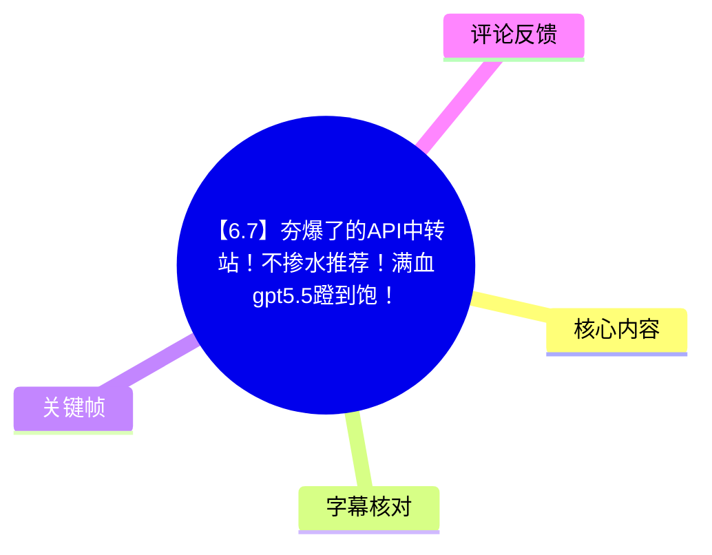
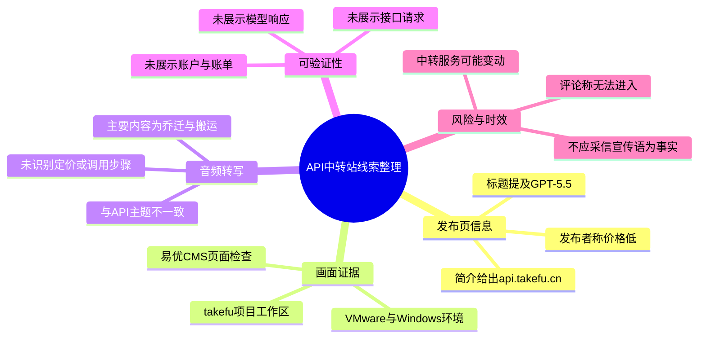
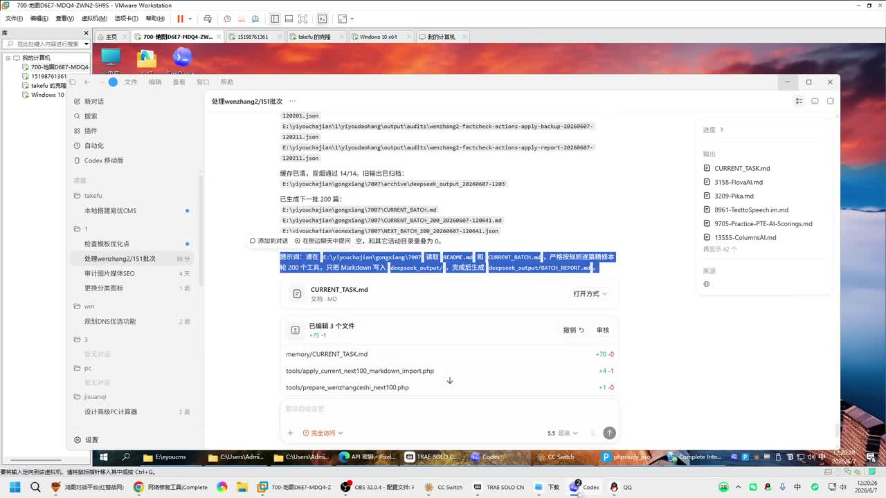
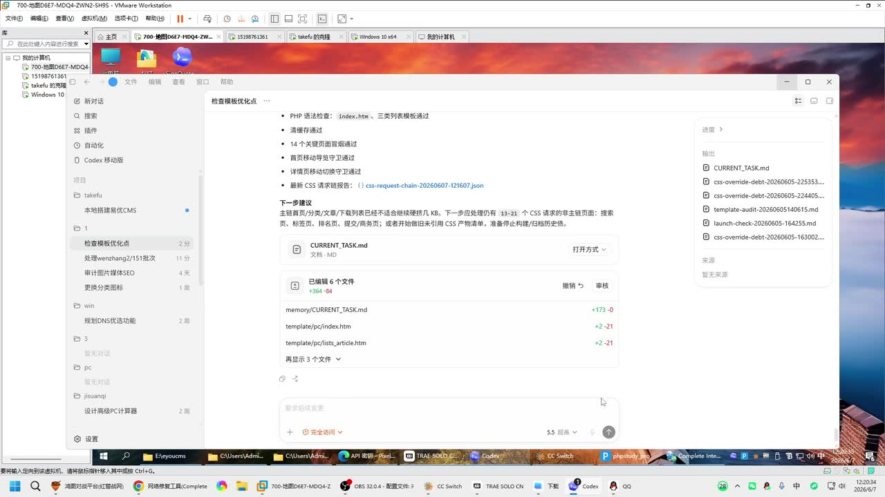
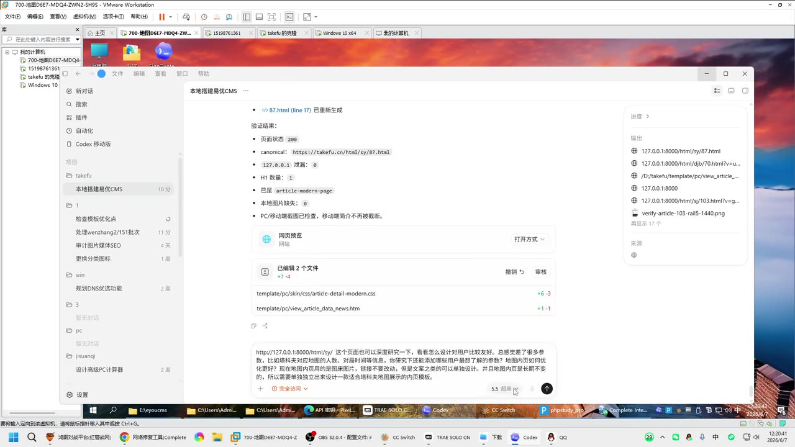
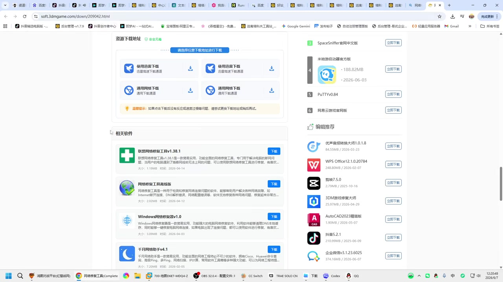

# 【6.7】夯爆了的API中转站！不掺水推荐！满血gpt5.5蹬到饱！

> 来源：[Bilibili 视频](https://www.bilibili.com/video/BV1fMEs6UERz) 
> UP 主：生于忧患死于忧患｜视频时长：1 分 36 秒｜分类收藏：AIcode  
> 视频简介中给出的注册链接为：`api.takefu.cn`；简介还称该服务“因太便宜被举报”。这些均为发布者自述，未在本次素材中独立验证。

## 小结

视频标题和简介将主题定位为一个 API 中转站推荐，并提及 `api.takefu.cn`，标题还使用了“满血 gpt5.5”等宣传性表述。现有关键帧确实出现了名为 `takefu` 的项目/页面环境，以及在虚拟机中编辑与检查网页内容的画面，因此可以确认视频画面与该名称存在关联。

但本次 ASR 音频转写与标题主题明显不一致：可识别语音主要谈论室内温差、风扇、搬运二手沙发床、取回行李以及“乔迁”，没有识别到 API 地址、模型名称、价格、调用方式、密钥配置、并发限制或充值规则。因此，不能根据标题将“GPT-5.5 可用”“满血”“便宜”等营销语扩写为已经演示或验证的技术事实。

从可见画面看，视频至少展示了一个 Windows/VMware 环境中的 `takefu` 工作区，包含“本地搭建易优CMS”“检查模板优化点”等任务记录；其中一帧显示了本地页面的验证结果，包括页面状态码 `200`、canonical 地址、H1 数量和本地图片缺失数等。这些属于网页/CMS 开发现场，而不是可直接证明 API 模型能力的调用测试。

对想使用 API 中转服务的读者而言，本视频只能作为一个待自行核验的线索：应优先检查站点可访问性、真实模型返回、计费口径、密钥与数据安全政策，以及服务持续性。评论中已有用户反馈“进不去了”，说明可用状态具有时效性，不能仅凭视频标题或简介作采购、生产接入决策。

## 思维导图

## 目录

- [素材主题、证据范围与时效性](#素材主题证据范围与时效性)
- [发布信息与画面中的 takefu 线索](#发布信息与画面中的-takefu-线索)
- [音频实际内容：与标题不一致](#音频实际内容与标题不一致)
- [可整理的实践核验步骤](#可整理的实践核验步骤)
- [参数、缺失信息与限制](#参数缺失信息与限制)
- [关键帧索引](#关键帧索引)
- [字幕比对](#字幕比对)
- [评论分析](#评论分析)
- [处理记录](#处理记录)

## 素材主题、证据范围与时效性 [00:00](https://www.bilibili.com/video/BV1fMEs6UERz?t=0)

本视频总时长为 96 秒，发布页标题为“【6.7】夯爆了的API中转站！不掺水推荐！满血gpt5.5蹬到饱！”，标签为“api”“中转站”。简介仅提供以下可直接记录的信息：

- 注册地址：`api.takefu.cn`
- 发布者自述：“因太便宜被举报”
- 对举报行为的情绪化回应

这些信息反映的是发布页上的推荐与立场，不构成对服务能力、价格、模型来源或合规性的独立证明。

尤其需要区分以下三类信息：

| 类型 | 本次可记录内容 | 不应据此推导的结论 |
| --- | --- | --- |
| 发布者宣传 | 标题提到“GPT-5.5”“满血”，简介称便宜 | 不能确认实际可调用模型、性能、上下文、稳定性或官方授权关系 |
| 画面线索 | 出现 `takefu` 项目与网页检查界面 | 不能确认该项目就是 API 平台后端，或页面已对外稳定上线 |
| ASR 语音 | 内容主要为搬家、家具和乔迁 | 不能将错误/无关转写补写成 API 教程内容 |

页面抓取时间为 2026-07-16，而视频发布时间元数据对应 2026-06-07。API 中转站的域名状态、模型菜单、价格、可用额度和政策都可能在这段时间内变化；评论中的可访问性反馈也强化了这一风险。

## 发布信息与画面中的 takefu 线索 [00:00](https://www.bilibili.com/video/BV1fMEs6UERz?t=0)

关键帧展示的主要是 Windows 桌面和 VMware Workstation 环境。前几张画面中可见名为 `takefu` 的工作区/项目，并出现若干与网站维护有关的任务名称，例如：

- “本地搭建易优CMS”
- “检查模板优化点”
- “处理 wenzhang2/15 批次”
- `CURRENT_TASK.md`
- `README.md`
- `CURRENT_BATCH.md`

其中一张画面展示了本地页面检查结果，能辨认出的项目包括：

- 页面状态：`200`
- canonical：`https://takefu.cn/html/sy/87.html`
- H1 数量：`1`
- 本地图片缺失：`0`
- PC/移动端标题已检查，移动端暂不再被截断

这说明画面中至少存在与 `takefu.cn` 相关的网页开发、CMS 页面或 SEO/模板检查活动。需要注意，域名 `takefu.cn` 与简介中的 `api.takefu.cn` 属于同一主域名下的不同子域名，但素材没有展示二者之间的部署关系、账户体系或 API 路由关系，不能据此断言它们必然由同一产品直接提供。

> 图：画面显示 VMware Workstation 内的 `takefu` 工作区及 `CURRENT_TASK.md` 等文件，任务涉及文章处理与批处理记录。它的价值在于提供了“takefu”名称出现在实际工作环境中的视觉线索，但没有显示 API 请求或模型返回。

> 图：画面显示“检查模板优化点”相关任务，文本涉及 PHP 语法检查、面包屑、移动端页面等网页模板事项。该帧有助于判断视频可见操作偏向网站/CMS 维护，而非 API 接入演示。

> 图：画面显示“本地搭建易优CMS”的验证清单，可见 HTTP 状态码、canonical、H1 数量等检查项。它为页面状态与网站配置提供了有限的视觉证据，但不包含 API 的端点、鉴权或计费信息。

## 音频实际内容：与标题不一致

### 室内温差、风扇与沙发床 [00:01](https://www.bilibili.com/video/BV1fMEs6UERz?t=1.82)

ASR 在 `00:00:01,820—00:00:21,590` 识别到的内容，谈及从室外进入室内能感到温差、室内较凉快、一个电风扇足够，以及前一天刚清理完空间后又被弄乱；随后提到垫子与准备放置沙发床。

这段语音没有出现 API、中转、接口、模型、价格、账户、密钥或 `takefu` 等词。由于站内字幕不可用，无法用人工字幕反向确认该段是否为视频原声、混入音频，或 ASR 对音轨作出了语义错误识别；因此只应按“ASR 原始识别结果”记录。

### 无法可靠判定的短句 [00:38](https://www.bilibili.com/video/BV1fMEs6UERz?t=38.4)

`00:00:38,400—00:00:41,180` 的 ASR 结果为“每天都能看东南亚自由波及”。该句语义不通，且与视频标题和已见画面均没有可靠对应关系。

在没有站内字幕、没有更清晰人工听写、且关键帧未附带精确时间戳的情况下，不对该短句进行强行校正，也不将其作为视频的有效技术观点。

### 搬回“老刘” [00:59](https://www.bilibili.com/video/BV1fMEs6UERz?t=59.23)

`00:00:59,230—00:01:06,890` 的 ASR 内容称：先前来得着急，忘记把“老刘”带回来，今天过去将其带回。“老刘”是人、物品、宠物或昵称，素材不足以判断，故保留 ASR 原词，不作实体解释。

### 二手沙发床、桌子与行李搬运 [01:09](https://www.bilibili.com/video/BV1fMEs6UERz?t=69.36)

`00:01:09,360—00:01:23,600` 的 ASR 内容称，淘到的二手沙发床附送一张小桌子，当天要一起搬运；行李也要从“村长家”取回。这仍然是生活搬迁叙述，与 API 服务无直接关联。

### “真正的乔迁”与聚餐计划 [01:24](https://www.bilibili.com/video/BV1fMEs6UERz?t=84.85)

`00:01:24,850—00:01:34,410` 的 ASR 内容称当天是“真正的乔迁”，并提到“四荤四素”。“绑一桌”等词可能受口语、方言或识别误差影响，不能据此抽取具体操作步骤。

## 可整理的实践核验步骤

本视频素材**没有提供可照抄的 API 接入步骤**，例如 Base URL、模型 ID、鉴权请求头、SDK、请求体、价格表或错误码。以下流程不是视频已演示的操作，而是面对简介所给 API 域名时，基于素材限制整理出的最低核验清单：

1. **确认域名与页面可访问性**
   - 访问简介中的 `api.takefu.cn`。
   - 记录访问时间、HTTP 状态、是否需要登录、是否存在清晰的服务说明。
   - 不要把主站 `takefu.cn` 的页面状态等同于 `api.takefu.cn` 的接口可用状态。

2. **查找正式 API 文档**
   - 应明确核对 Base URL、认证方式、支持的模型列表、请求/响应格式、速率限制与错误码。
   - 若没有公开文档，或文档与控制台展示不一致，应避免用于关键生产任务。

3. **使用低风险测试密钥进行最小调用**
   - 仅在服务明确授权、且理解数据处理规则的前提下测试。
   - 测试时不提交真实个人信息、商业机密、源代码机密或生产凭据。
   - 保存原始请求、响应、耗时、HTTP 状态和实际扣费记录，验证“可用”与“宣传中模型名称”是否一致。

4. **核对计费与模型真实性**
   - 标题中的“满血 gpt5.5”不是技术规格文档；需要以平台实际文档、模型标识、响应行为和账单为准。
   - 核对输入、输出、缓存、图片/工具调用等是否采用不同计费口径。
   - 检查余额、充值、退款、发票、限额及异常扣费的处理规则。

5. **评估持续性与迁移能力**
   - 评论中有“进不去了”的反馈，至少说明应准备替代服务或直连方案。
   - 在应用中使用环境变量或密钥管理服务保存凭据；将 Base URL、模型名和超时配置参数化，避免服务不可用时无法切换。
   - 不应把未经核验的中转服务作为唯一生产依赖。

## 参数、缺失信息与限制

### 素材中能够确认的技术参数

| 项目 | 值 | 来源 |
| --- | ---: | --- |
| 视频时长 | 96 秒 | 视频元数据 |
| 画面分辨率 | 1920 × 1080 | 视频元数据 |
| ASR 语言 | 中文（`zh`） | ASR 诊断 |
| ASR 模型 | `medium` | ASR 诊断 |
| ASR 计算设备/精度 | CUDA / `float16` | ASR 诊断 |
| ASR 音频时长 | 95.424 秒 | ASR 诊断 |
| ASR 有语音覆盖 | 54.01 秒，约 56.6% | ASR 诊断 |
| 最大 ASR 无语音间隔 | 18.05 秒（41.18—59.23 秒） | ASR 诊断 |

### 与 API 服务有关但素材未提供的关键参数

以下内容均未在站内字幕、ASR 文本或提供的关键帧中得到可靠展示：

- API Base URL 与具体路径；
- API Key 的创建、权限范围、轮换与撤销方式；
- 支持的模型 ID，以及“gpt5.5”是否为实际可选模型；
- 上下文窗口、最大输出、温度、工具调用、流式输出等请求参数；
- 输入/输出单价、充值门槛、余额有效期、退款规则；
- 并发数、RPM/TPM、排队、超时、封禁或风控策略；
- 数据是否留存、是否用于训练、日志保存时长及隐私条款；
- 服务与上游模型提供方的授权关系；
- 面向生产环境的 SLA、状态页、故障公告与技术支持渠道。

因此，本条视频不应被整理为“API 教程”或“已验证的模型评测”。更准确的定位是：**带有站点线索的短视频发布页，画面中存在相关网站开发环境，但音频字幕证据与标题主题冲突，无法复原其宣称的产品使用流程。**

## 关键帧索引

| 关键帧 | 内容概述 | 正文使用价值 |
| --- | --- | --- |
| `frame-001.jpg` | VMware Workstation、`takefu` 工作区、批处理/任务文档 | 证明“takefu”名称出现在可见工作环境中 |
| `frame-002.jpg` | 模板优化任务与网页维护检查项 | 说明画面偏向网站/CMS 工作流 |
| `frame-003.jpg` | 本地易优CMS验证结果，含状态码与 canonical 等项目 | 提供有限的页面检查细节 |
| `frame-004.jpg` | 浏览器中的软件下载/下载页面 | 与 API 中转主题的直接关联无法从画面确认 |
| `frame-005.jpg`—`frame-012.jpg` | 已提取但未附带可验证时间戳与可用文字说明 | 为避免把无法确认的视觉细节写成事实，未在正文作具体技术论据 |

> 图：画面为软件下载/下载页面，未见可确认的 API 调用信息。保留该帧用于说明视频画面中还存在与主题关联不明的浏览行为，而非将其误判为 API 配置步骤。

## 字幕比对

| 字幕来源 | 完整性 | 专有名词 | 时间轴 | 主要问题 |
| --- | --- | --- | --- | --- |
| Bilibili 站内字幕 | 不可用 | 无法评估 | 无法评估 | 字幕抓取工具报错 `Invalid URL`，素材中未提供可用站内字幕 |
| 本次 ASR 字幕 | 有 5 个带时间戳片段，语音覆盖约 56.6% | 对“老刘”“村长”“东南亚自由波及”等词存在不确定性；未识别 API 相关专名 | 可用，范围 00:01.820—01:34.410 | 语义与标题、简介及画面主题严重不一致；有两段超过 16 秒的无语音间隔 |

### 最终字幕选择

最终采用本次 ASR 的**时间轴**记录音轨中实际识别到的内容，并明确标注其与视频标题主题不一致；未用标题、简介或主观推测去填补 ASR 未识别到的 API 技术细节。

本次 ASR 诊断中**未标记** `noAudioStream=true`，且识别到 54.01 秒语音，因此不能将问题归因于“源视频没有音轨”。实际情况是：视频存在可供 ASR 处理的音频，但识别内容与发布页主题不匹配，且站内字幕不可用，导致无法完成可靠的人声校对。

通过关键帧可做出的校正仅限于视觉层面：

- 可见 `takefu` 作为项目/工作区名称；
- 可见 `takefu.cn` 相关页面检查文字；
- **不能**从画面校正出 `api.takefu.cn` 的具体接口参数；
- **不能**验证“gpt5.5”“满血”“便宜”等标题用语。

## 评论分析

仅获取到 2 条热评，少于“三条”的部分不补写。

1. **TQ188：**“`okgpt.cc` 每次处理请求，仿佛都在重复一句‘放心’”
   - 该评论提到了另一个域名 `okgpt.cc`，并以调侃口吻表达对其请求处理或话术的不信任。
   - 评论未说明与本视频所述 `api.takefu.cn` 的关系，也未提供请求日志、价格截图或错误信息。
   - 因此它只能反映评论者态度，不能作为对任何 API 服务的性能、隐私或可靠性的事实证明。

2. **ethereal-cafun：**“进不去了[藏狐]”
   - 该评论直接反馈无法访问，但未说明访问的具体 URL、时间、网络环境、HTTP 状态、登录状态或是否为临时故障。
   - 结合本视频简介给出的注册链接，这是一条值得优先复核的可用性线索。
   - 但在缺乏复现证据时，不能将其升级为“服务已关闭”或“站点不可用”的确定结论。

## 处理记录

- Worker ID：`worker-mrj0wjed-b0c290ad`
- 模型：`gpt-5.6-terra`
- 调用工具与模型：素材编排流程提供的视频元数据、关键帧、ASR 结果、ASR SRT 与热评数据；ASR 模型为 `medium`，CUDA / `float16`。
- 使用的应用工具：视频素材提取、关键帧导出、音频转写、站内字幕抓取、评论抓取。
- 字幕选择：站内字幕不可用；已检查本次 ASR，并采用其真实 SRT 时间段作为时间轴依据。ASR 未标记 `noAudioStream=true`。
- 站内字幕状态：字幕工具返回 `Invalid URL`；没有可用站内字幕文本可供比较。
- 关键帧选择依据：`frame-001` 至 `frame-003` 含有可辨识的 `takefu`、任务记录、网页/CMS 检查信息，能支撑有限的画面事实；`frame-004` 用于说明存在关联不明的浏览画面。其余帧缺少可靠的文字或时间对应信息，未用于技术结论。
- 缓存清理：提供的素材清单未包含缓存清理执行结果；本记录不虚构清理状态。
- 未解决问题：
  - ASR 内容为何与标题/简介主题不一致，无法仅凭现有素材判断；
  - 无法验证 `api.takefu.cn` 当前是否可访问；
  - 无法验证模型名称、价格、额度、上游来源、接口格式与数据政策；
  - 关键帧未提供逐帧时间戳，不能将其精确绑定至视频内某一秒。
