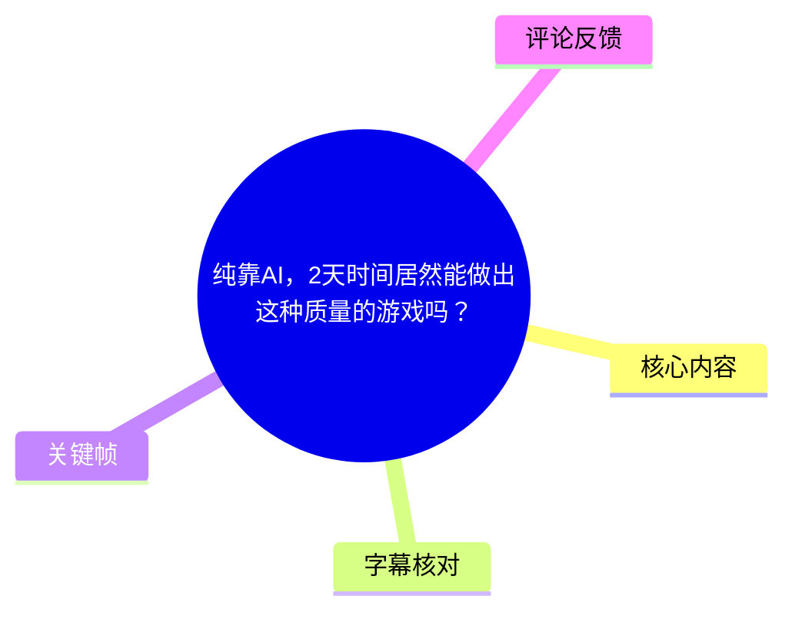
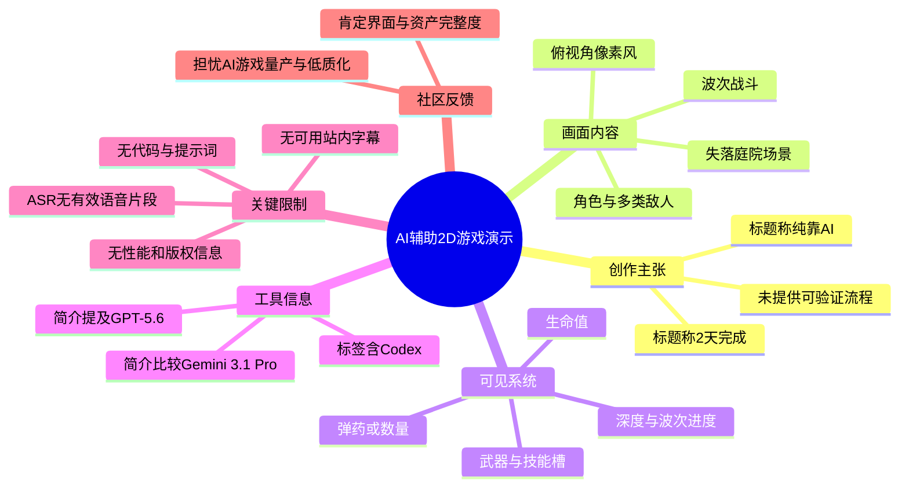
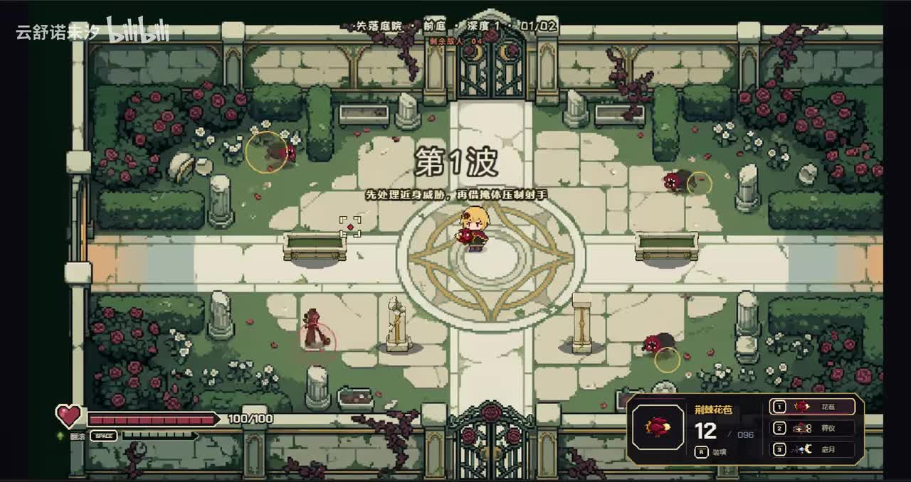
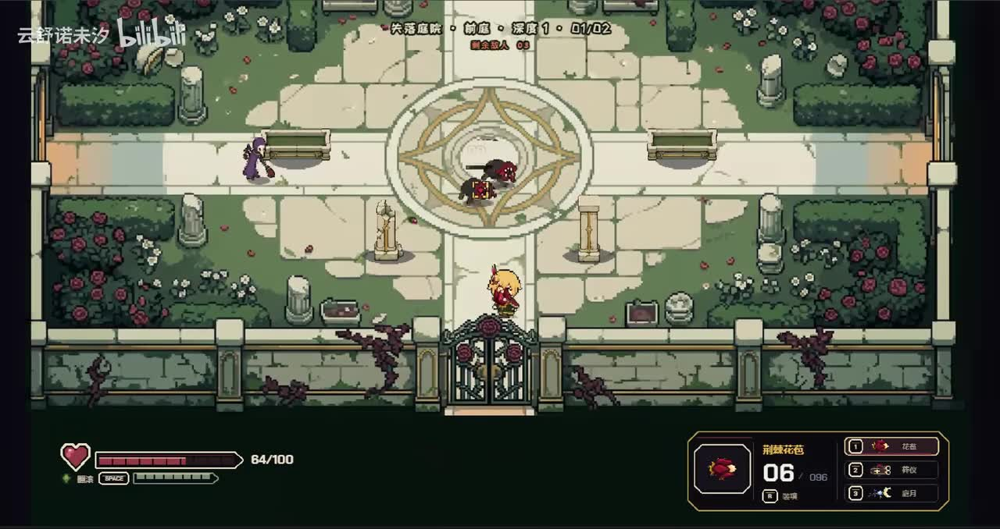
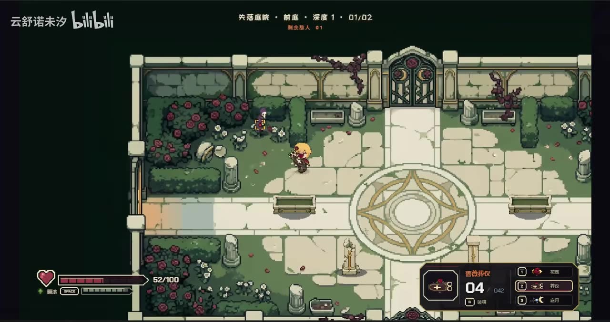
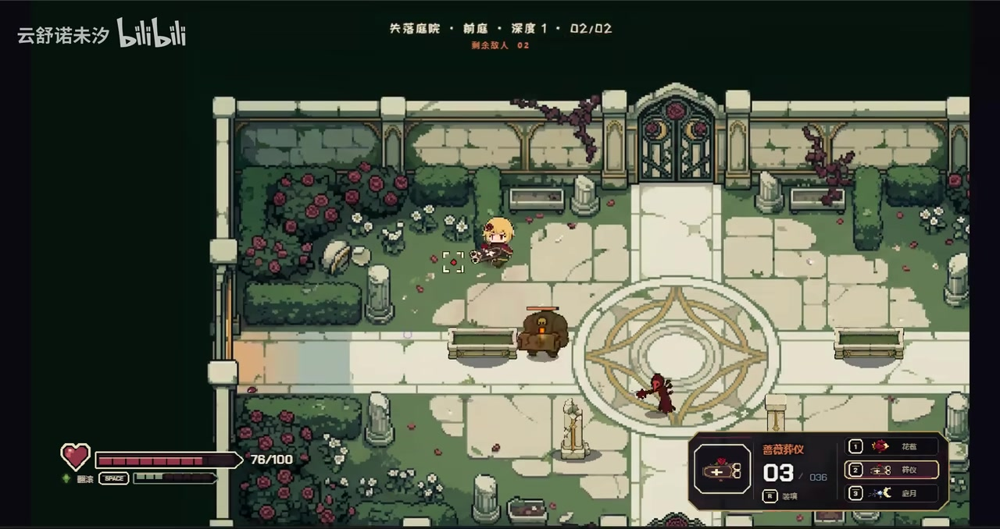

# 纯靠AI，2天时间居然能做出这种质量的游戏吗？

> 来源：[Bilibili 视频](https://www.bilibili.com/video/BV1eNKK6REBw) 
> UP 主：云诺羲｜发布时间：2026-07-18｜视频时长：02:20 
> 标签：游戏、游戏开发、AI、RPG、演示、Codex

## 小结

该视频展示了一款俯视角 2D 像素风战斗游戏的实机画面。视频标题提出“纯靠 AI、2 天完成”的创作主张；简介进一步表示，UP 主认为 GPT-5.6 的审美表现有所提升，制作 2D 游戏时“很出效果”，并将其与 Gemini 3.1 Pro 作比较。这里的开发周期、工具效果与“纯靠 AI”范围均属于作者主张，现有素材不足以独立验证。

从画面可确认，游戏已具备相对完整的单局战斗呈现：庭院式地图场景、可操控的角色、多个敌方单位、波次与深度信息、生命值、弹药/数量显示、武器或技能槽位，以及战斗引导文本。画面中的关卡名为“失落庭院”，可见深度为 1、波次进度为 `01/02` 或 `02/02`。

视觉层面，作品采用统一的复古像素画风：石板庭院、花丛、长椅、铁门、藤蔓与中央法阵组成场景；角色、敌人、UI 边框和图标在色调与轮廓上保持一致。它说明 AI 辅助流程至少可以较快地产出具有统一观感的 2D 游戏演示素材，但并不能据此推导出游戏的代码质量、商业可用性、素材版权状态、完整内容量或长期可维护性。

对游戏开发者而言，视频的价值主要在于观察“短周期 AI 辅助原型”可达到的可视化完成度；对准备直接上架产品的人而言，则更应关注热评提到的风险：量产式 AI 游戏可能造成质量参差、缺乏可玩性或同质化。视频没有提供提示词、代码仓库、引擎配置、资产生成流程或性能测试数据，因此不能将其视为可复现教程。

时效性方面，视频发布于 2026-07-18，涉及的 GPT-5.6、Gemini 3.1 Pro 等模型能力会随版本、配额、产品策略及上下文配置变化而变化。简介中的模型比较仅代表发布者当时的个人判断，不应视为通用基准测试结论。

## 思维导图

## 目录

- [视频背景与信息边界](#视频背景与信息边界)
- [可见游戏演示与战斗界面](#可见游戏演示与战斗界面)
- [场景、关卡与敌人状态](#场景关卡与敌人状态)
- [可提炼的制作经验与复现边界](#可提炼的制作经验与复现边界)
- [参数、限制与时效性](#参数限制与时效性)
- [字幕比对](#字幕比对)
- [评论分析](#评论分析)
- [处理记录](#处理记录)

## 视频背景与信息边界 [00:00](https://www.bilibili.com/video/BV1eNKK6REBw?t=0)

视频时长为 140 秒，标题为“纯靠AI，2天时间居然能做出这种质量的游戏吗？”。标题中的“纯靠 AI”与“2 天时间”是创作者的核心表达，但素材中没有提供项目文件、录屏制作过程、模型对话记录、代码提交记录或第三方验证材料。因此，本文将其标记为**作者自述**，不将其扩展为已验证的生产效率结论。

视频简介给出的信息包括：

- 作者认为 **GPT-5.6** 的审美效果“好不少”；
- 作者认为其适合做 2D 游戏，能够“很出效果”；
- 作者主张其在该用途上“基本上可以平替 Gemini 3.1 Pro”。

此外，视频标签包含“Codex”，但标签只能说明视频与该主题有关，**不能证明具体采用了哪一个 Codex 产品、模型版本、调用方式或代码占比**。同样，画面中没有足够信息用以确认游戏使用的引擎、编程语言、资源许可或发布平台。

由于站内没有提供可用字幕，而本次 ASR 也没有识别出有效语音分段，无法根据真实 SRT/ASR 起止时间进一步划分视频内的精确片段。下文各章节统一锚定视频起点 `00:00`，用于回看整段演示；不会把画面顺序臆测为精确时间点。

## 可见游戏演示与战斗界面 [00:00](https://www.bilibili.com/video/BV1eNKK6REBw?t=0)

画面呈现的是一款俯视角 2D 动作/射击式战斗原型。主角位于被墙体围合的庭院区域中，通过瞄准标记或朝向与周围敌人交战。敌人至少包括体型较小的红黑色单位、持武器的人形单位，以及后续出现的较大型单位。

从 UI 可读到的可见信息包括：

| 区域 | 画面可见内容 | 可确认的作用或含义 |
| --- | --- | --- |
| 顶部中央 | “失落庭院”“前庭”“深度 1”“01/02”或“02/02” | 显示关卡/区域名称、层级或深度、当前波次进度。具体系统规则未展示。 |
| 顶部文字 | “剩余敌人 03”“剩余敌人 01”“剩余敌人 02”等 | 表示当前尚未消灭的敌人数量。 |
| 中央 | “第1波”及战斗提示 | 表明游戏具有波次推进结构。 |
| 左下角 | 心形图标、生命条、`100/100`、`64/100`、`52/100`、`76/100` 等 | 可见角色生命值数值与血条会随战斗变化。 |
| 左下角次级区域 | “回蓝”文字、`SPACE` 键提示及格状条 | 存在与能量、回复或冲刺相关的机制，但具体功能未由字幕说明。 |
| 右下角 | 物品/武器名称、数量、`1`、`2`、`3` 等快捷键、图标 | 至少存在多槽位武器或技能配置。 |
| 右下角数值 | 如 `12/096`、`06/096`、`04/042`、`03/036` | 可能是当前数量与储备数量的组合；因缺少说明，不能断言为弹药。 |

> 图：该帧显示“第1波”提示、庭院中央法阵、周边小型敌人以及完整 HUD。它直观证明演示并非单张概念图，而是至少包含波次文本、生命系统、武器/技能槽和敌人数量等可交互战斗界面元素。

在画面中，“第1波”下方还出现“先处理近身威胁，再留……”的战斗建议文字，但后半句受画面清晰度限制无法可靠辨认，故不转写或延伸解释。能够确认的是：游戏在战斗开始时提供了策略性文字提示。

> 图：该帧中左下角生命值为 `64/100`，右下角显示 `06/096`，场地中仍有多个敌对单位。它说明生命值和右下角的数量类数值会在战斗过程中动态变化，而非静态装饰。

## 场景、关卡与敌人状态 [00:00](https://www.bilibili.com/video/BV1eNKK6REBw?t=0)

### 场景设计

“失落庭院”的可见构成包括：

- 大面积浅色石板地面与中央圆形法阵；
- 上、下方金属栅门；
- 墙体、石柱、长椅与破损痕迹；
- 两侧成片的玫瑰、灌木和白色花朵；
- 沿墙生长的深色藤蔓；
- 低饱和绿色、灰白石材与暗红花朵构成的统一配色。

这些元素共同建立了“废弃但仍具观赏性”的庭院气氛。这里可以确认的是**美术呈现结果**；是否由 AI 生成、人工绘制、购买素材后再编辑，或多种来源混合，现有材料均无法判断。

### 波次与关卡状态

不同关键帧显示了 `01/02` 与 `02/02` 两种波次进度，以及不同的“剩余敌人”计数。这可以支持以下较谨慎的结论：

1. 单局战斗至少分为两段或两波，画面中的格式为 `当前/总数`；
2. 敌人数量在推进中改变；
3. 玩家会在不同波次面对不同构成的敌人；
4. “深度 1”是一个状态或层级标签，但是否影响难度、掉落或地图生成，视频素材没有说明。

> 图：该帧顶部显示“失落庭院・前庭・深度 1・01/02”，并可见“剩余敌人 01”。主角与一名人形单位处于同一场地，左下角生命值为 `52/100`。它有助于确认关卡标识、波次计数、敌人剩余数和生命值反馈同时存在。

> 图：该帧顶部进度为 `02/02`，中央附近出现体型明显更大的敌人，同时还存在一名较小的人形敌人。该画面支持“后续阶段敌人构成发生变化”的判断，但不能据此断言大型敌人一定是 Boss 或精英怪。

### 可观察到的操作与反馈

从角色位置、敌人朝向、准星样式标记和数值变化来看，游戏至少具有实时移动与攻击交互的视觉反馈。右下角区域可见三个编号为 `1`、`2`、`3` 的槽位，配有不同图标；其中画面可辨识到“花蕾”“静夜”“皓月”等文字，但受分辨率和字体影响，不能保证全部名称准确无误。

可见的武器/道具面板名称则包括“荆棘花苞”与“雷霆斧仪”。它们是画面中实际显示的文本；但它们究竟是主武器、技能、道具、升级项还是敌方能力，尚无字幕或操作说明佐证。右下角同时出现 `R` 键提示，能确认存在与 `R` 键相关的功能入口，但无法确定其是换弹、重置、切换或其他操作。

## 可提炼的制作经验与复现边界 [00:00](https://www.bilibili.com/video/BV1eNKK6REBw?t=0)

### 从演示结果可提炼的经验

尽管没有展示开发过程，画面仍反映出短周期原型若要显得“完整”，重点不只是生成角色立绘或地图，而是需要让多个层次具有一致性：

1. **确立单一视觉基调**  
   场景石材、植被、人物、敌人与 UI 都使用像素化轮廓、有限色板和暗色描边。即使各资产来源不同，统一的色彩与边框规则也能降低拼贴感。

2. **优先构建最小完整战斗循环**  
   本作可见循环至少包含：进入战斗区域 → 波次提示 → 敌人出现 → 玩家受伤与数值变化 → 剩余敌人数减少 → 波次推进。相比单独展示角色或场景，这种闭环更能体现“游戏感”。

3. **用 HUD 为系统提供可读性**  
   生命值、敌人剩余数、波次进度、快捷键和数量显示，使观众能快速理解当前战斗状态。即使不了解具体规则，也能从 `64/100`、`06/096`、`01/02` 等变化判断局势。

4. **让关卡美术承担导航功能**  
   中央法阵、门、长椅与墙体不仅构成背景，也帮助玩家识别场地中心、边界和可活动区域。对于小规模 2D 战斗场景，这类空间锚点比堆砌高密度装饰更重要。

### 无法从视频补齐的关键步骤

若要真正复现此类作品，通常还需要明确以下内容；但它们**没有在本视频素材中公开**：

- 使用的游戏引擎及版本；
- 项目目录、场景组织和状态机设计；
- 角色移动、碰撞、敌人寻路、攻击判定的实现方式；
- AI 生成资产时的提示词、尺寸、透明背景处理和精灵图切分方法；
- UI 的适配规则、字体授权与本地化方案；
- 音效与音乐来源、授权和打包方式；
- 自动生成代码后的测试、调试、性能分析与人工审查流程；
- 2 天周期中人类实际投入的策划、筛选、修改、集成与测试时间。

因此，视频更适合被理解为**成果展示**，而非完整教学。将其直接转化为“只要输入提示词，任何人两天都能完成同等质量游戏”的方法论，超出了素材能够支持的范围。

## 参数、限制与时效性 [00:00](https://www.bilibili.com/video/BV1eNKK6REBw?t=0)

### 可核对的参数与元数据

| 项目 | 信息 |
| --- | --- |
| BV 号 | `BV1eNKK6REBw` |
| 视频时长 | 140 秒（素材音频诊断时长为 139.4346875 秒） |
| 分辨率 | 2556 × 1356 |
| 视频发布时间 | 2026-07-18 |
| UP 主 | 云诺羲 |
| 收藏数（抓取时） | 537 |
| 点赞数（抓取时） | 275 |
| 评论数（抓取时） | 160 |
| 标签 | 游戏、游戏开发、AI、RPG、演示、Codex |
| 简介提及模型 | GPT-5.6、Gemini 3.1 Pro |

上述播放、互动数据为抓取时快照，会持续变化，不应视为永久统计值。

### 展示内容的限制

- 没有可用的站内字幕，也没有 ASR 语音文本可供交叉验证，因此无法可靠转录作者口述、工具调用步骤或精确时间节点。
- 关键帧能证明画面中出现的 UI、角色、敌人与地图元素，不能证明其背后的实现技术。
- “纯靠 AI”“2 天完成”缺乏过程性证据，不能据此衡量所有开发者的平均效率。
- 视频未披露资产、音乐、字体、模型输出及训练数据的版权/许可情况。
- 视频没有展示失败案例、Bug、帧率、加载时间、不同设备适配、存档、数值平衡或完整关卡内容。
- 右下角的数值结构、键位功能、技能规则等缺少文字说明，本文只记录可见文本，不将不确定信息当作游戏机制事实。

### 工具能力的时效性

视频简介中有关 GPT-5.6 与 Gemini 3.1 Pro 的评价属于作者在发布时的经验判断。模型的代码生成、图像审美、长上下文稳定性、价格、API 可用性与内容政策都可能变化。若以此作为工具选型参考，应补充进行：

- 在同一任务说明、相同上下文与相同验收标准下的对照测试；
- 对生成代码进行人工审查、运行测试与安全检查；
- 对 AI 资产进行风格一致性和商业授权审查；
- 对实际项目周期统计人类修改、调试、整合与测试耗时，而不只统计生成耗时。

## 字幕比对 [00:00](https://www.bilibili.com/video/BV1eNKK6REBw?t=0)

| 字幕来源 | 完整性 | 专有名词 | 时间轴 | 主要问题 |
| --- | --- | --- | --- | --- |
| Bilibili 站内字幕 | 未提供可用字幕 | 无法核验 | 无 | 素材明确标记为“未提供可用站内字幕” |
| 本次 ASR 字幕 | 无有效内容 | 无法识别 | 无可用分段 | ASR 使用 `medium` 模型，识别语言推断为英语（置信度 0.541015625），结果 `segments` 为空，语音覆盖率为 0 |

本次 ASR 已完成检查：诊断显示未识别出任何语音分段，警告为“未识别出语音片段，应确认源文件是否包含可听语音并以正确音轨重试”。诊断中**没有** `noAudioStream=true` 标记，因此不能将其表述为“源视频没有音轨”；现有素材只能够确认：导出的音频文件存在，但本次识别未获得可用语音文本。

最终未采用任何字幕文本作为正文事实来源。本文以以下可见画面信息与元数据为依据：

- 视频标题、简介、标签及基础统计；
- 关键帧中的“失落庭院”“前庭”“深度 1”“01/02”“02/02”“剩余敌人”等可辨识界面文本；
- 生命值与右下角数量显示的可见变化；
- 热评中明确标为用户观点的内容。

由于缺少带时间戳的站内字幕或 ASR SRT 分段，不能依据文字顺序虚构章节发生时间；所有章节链接仅指向真实且确定的视频起点 `t=0`。

## 评论分析 [00:00](https://www.bilibili.com/video/BV1eNKK6REBw?t=0)

本次素材请求热评前三条，但仅返回 2 条可获取热评；以下只分析这两条，不补造第三条。

1. **吐槽不得劲｜25 赞**  
   评论认为，Steam 和 App Store 上出现的大量低质量 AI 游戏，可能与 AI 生产门槛下降、产量提升有关，并以“量大管饱（难吃的一批）”表达对成品质量的批评。  
   - **补充价值**：提出了从“能快速做出”到“是否值得玩、是否足够好”的质量问题。  
   - **可信度边界**：这是评论者的概括性判断，没有给出具体作品、平台统计或评价指标，不能当作行业规模的已验证数据。  
   - **与视频的关系**：它提醒观看者，演示中较完整的视觉包装不等同于游戏的整体品质。

2. **中二的小生｜47 赞**  
   评论认可两天内完成该演示的效率，并认为作品有完整 UI 与资产；评论者还称作者“甚至用了 suno 做音乐”，并指出 UI、资产和音乐是最花时间的部分。  
   - **补充价值**：从创作实践角度肯定了作品的界面、资产和音频层面的完成度，并提出音频生产可能参与其中。  
   - **可信度边界**：关于使用 Suno 做音乐的说法仅来自评论，视频元数据、字幕与关键帧均未独立证实，不能写作已确认事实。  
   - **与视频的关系**：该评论支持“作品观感完整”的主观评价，但无法验证“2 天”具体包括哪些工作、由何种工具完成。

总体来看，可获取评论形成了两种互补视角：一类关注 AI 降低生产门槛后可能带来的低质化与同质化风险；另一类关注 AI 在 UI、资产、音乐等耗时环节上的提效潜力。两者均为社区观点，而非对视频开发过程的证据。

## 评论分析

- 热评 1：怪不得现在steam和appstore上那么多劣质AI游戏[笑哭][笑哭][笑哭][笑哭]，原来真的是量大管饱（难吃的一批）
- 热评 2：这个2天有点猛，但无论是不是真的2天，我都觉得你很厉害。我自己也在做，你这个算是比较完整的了，有完整的UI和资产，甚至你还用了suno做音乐，因为这些都是最花时间的东西，加油～

以上内容是观众反馈摘录，只用于补充理解视频反响，不作为正文事实依据。

## 处理记录

- Worker ID：`worker-mrj0www4-e8d79408`
- 模型：`gpt-5.6-terra`
- 调用工具与模型信息：素材处理结果提供了音频导出、关键帧提取、ASR、元数据与评论文件；ASR 模型为 `medium`，运行于 CUDA、`float16`。
- 使用的素材：视频元数据、视频简介、关键帧目录、ASR 覆盖诊断、ASR 空输出说明、热评返回结果。
- 字幕选择：站内字幕未提供可用内容；本次 ASR 已检查但 `segments` 为空，未采用任何字幕文本。未检测到 `noAudioStream=true`，故不将问题归因为无音轨。
- 时间轴依据：无可用 SRT/ASR 分段时间；为避免根据文字顺序猜测时间位置，正文仅使用确定的起点链接 `t=0`，并明确说明无法做精细时间定位。
- 关键帧选择依据：选用 `frame-001.jpg` 至 `frame-004.jpg`，分别用于呈现第 1 波与整体 HUD、生命值/数量变化、`01/02` 波次状态，以及 `02/02` 与大型敌人同屏状态；图片均用于支撑正文中可直接观察的界面与战斗描述。
- 缓存清理：提供的素材中未包含缓存清理执行日志，无法确认是否已清理；本文不虚构清理结果。
- 未解决问题：未能确定游戏引擎、AI 工具链、提示词、代码实现、实际开发耗时构成、音乐来源、资产授权、右下角数值的具体含义，以及完整玩法规则。
