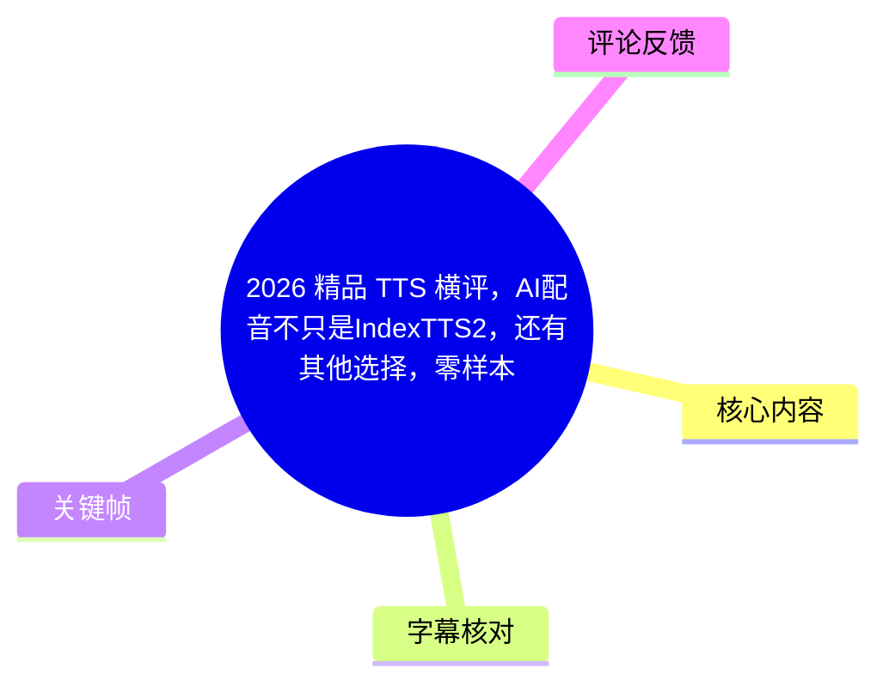
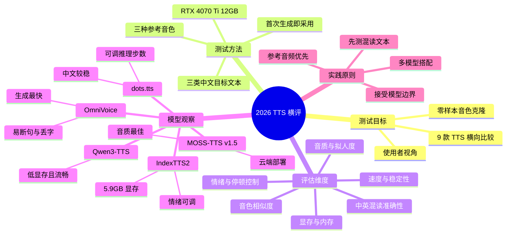
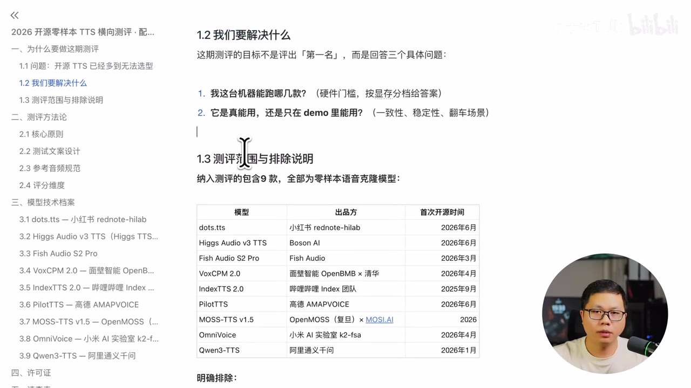
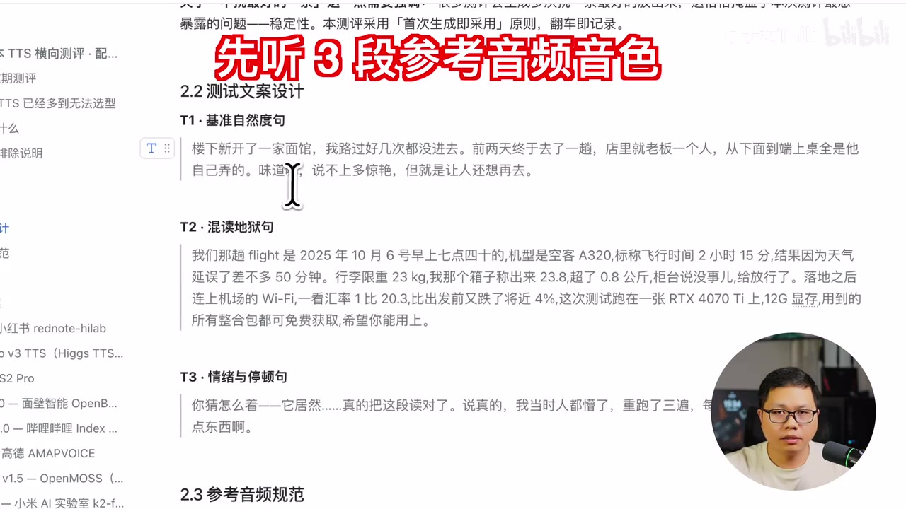
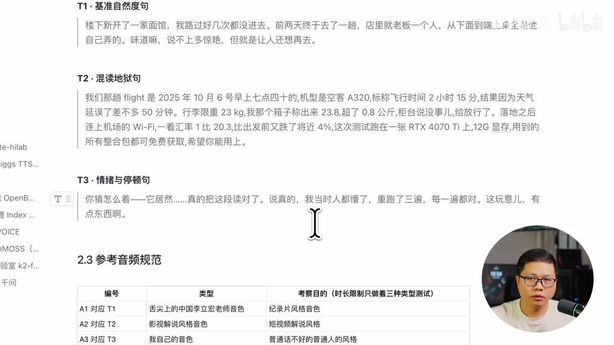

# 2026 精品 TTS 横评：9 款零样本语音克隆 / AI 配音工具实测

> 来源：[Bilibili 视频](https://www.bilibili.com/video/BV17x3g6xEZm) 
> UP 主：余子越Talk｜发布时间：2026-07-25｜视频时长：16 分 39 秒 
> 测试对象：IndexTTS2、Fish Audio S2 Pro、VoxCPM 2.0、MOSS-TTS v1.5、OmniVoice、dots.tts、PilotTTS、Qwen3-TTS、Higgs Audio v3

## 小结

这是一份从实际使用者视角出发的开源（及一款云端）TTS 横向测试。视频没有试图评出绝对“第一名”，而是围绕零样本音色克隆的真实使用问题，对 9 款工具的音质、音色复刻、情绪控制、中文与中英混读稳定性、方言/多语言能力、显存和内存占用、生成速度进行了对比。

测试使用三类中文目标文本：日常自然叙述、含英文/数字/单位/百分比等元素的中英混读“地狱句”，以及带明显情感和停顿的文本；并以三段不同风格的参考音频进行声音克隆。整套测试运行在 RTX 4070 Ti 12GB 显存显卡上，因此视频中的显存、内存数字应理解为该环境下的实测记录，而不是所有硬件、版本和推理参数下的通用结论。

视频作者的总体推荐是：若重点需要灵活调整情绪，可优先考虑 **IndexTTS2**；若最看重成品音质和拟人韵律，作者认为 **MOSS-TTS v1.5 云端版**最突出；若希望在中文准确率与音色相似度之间获得较稳妥的开源方案，**dots.tts**表现均衡；如果生产需求是大量、快速克隆且可接受准确率波动，**小米 OmniVoice**具有近乎秒生成的速度优势。

横评也显示，所有模型都有明确短板：数字、英文、缩写、中英混读、断句、音量衰减、多音字和情绪标签有效性仍可能出错。作者建议不要将单一模型视为全能工具，而应针对具体场景并用多款模型；尤其要重视参考音频质量——干净、无背景声、响度足够、情绪饱满的参考音频，比单纯更换模型更关键。

本片发布于 2026 年 7 月，工具迭代非常快；模型版本、权重开放程度、部署方式、显存需求、推理速度和许可证均可能在后续发生变化。本文仅整理视频内的实测陈述与画面信息，不将其扩展为对模型当前版本的保证。

## 思维导图

## 目录

- [测试背景、范围与时效性](#测试背景范围与时效性)
- [测试设计：文本、参考音频与环境](#测试设计文本参考音频与环境)
- [九款 TTS 横评总览](#九款-tts-横评总览)
- [IndexTTS2：音色与情绪的组合控制](#indextts2音色与情绪的组合控制)
- [Fish Audio S2 Pro：自然语言情绪标签](#fish-audio-s2-pro自然语言情绪标签)
- [VoxCPM 2.0：音色复刻、方言与声音设计](#voxcpm-20音色复刻方言与声音设计)
- [MOSS-TTS v1.5：音质与拟人韵律优先](#moss-tts-v15音质与拟人韵律优先)
- [OmniVoice：超快生成与准确性取舍](#omnivoice超快生成与准确性取舍)
- [dots.tts：中文准确率与电音问题处理](#dotstts中文准确率与电音问题处理)
- [PilotTTS：中文可用，但中英混读较弱](#pilottts中文可用但中英混读较弱)
- [Qwen3-TTS：低显存、流畅但多音字较弱](#qwen3-tts低显存流畅但多音字较弱)
- [Higgs Audio v3：标签控制的实际限制](#higgs-audio-v3标签控制的实际限制)
- [选择建议、限制与可迁移经验](#选择建议限制与可迁移经验)
- [字幕比对](#字幕比对)
- [评论分析](#评论分析)
- [处理记录](#处理记录)

## 测试背景、范围与时效性 [00:00:00](https://www.bilibili.com/video/BV17x3g6xEZm?t=0)

作者认为，开源 TTS 正处在快速爆发期：大厂、高校和创业团队持续开源新模型，模型数量多且定位接近，普通使用者难以仅通过宣传判断哪些工具可部署、可稳定使用。因此，本期不是单纯试听展示，而是明确比较：

1. 各模型所需显存与内存；
2. 实际音色克隆和文本朗读效果；
3. 情绪、方言、语言和声音设计能力；
4. 常见错误和适用边界；
5. 在相同测试文本和参考音频下的实际表现。

视频简介明确列出的 9 款对象为：IndexTTS2、Fish Audio S2 Pro、VoxCPM 2.0、MOSS-TTS 1.5（云端）、小米 OmniVoice、小红书 dots.tts、高德 PilotTTS、Qwen3-TTS、Higgs Audio v3。作者提供的资料获取方式为“关注、三连后私信关键词 `tts测评`”；这属于发布者提供的分发信息，并非本文对资源可用性或许可证状态的独立验证。

> 图：关键帧展示了作者准备的横评文档目录、测试目标及 9 个纳入模型的清单。它的价值在于确认本片不是单模型教程，而是有范围约束的比较测试；画面也提示部分工具有不同出品方和开源时间，说明结论具有明显版本时效性。

### 范围限制

- 本次主要测试中文效果；即使部分模型支持其他语言，作者也明确表示**非中文评测不在本片范围内**。
- 测试中的资源占用和表现依赖于作者的系统、整合包、模型版本、参考音频、文本预处理及推理参数。
- MOSS-TTS v1.5 是唯一以云端方式体验的模型，不能与本地模型的硬件开销完全等价比较。
- 视频为一次横评试听与使用体验记录，不包含客观 MOS 分数、标准化错误率、批量统计或多轮随机采样的完整实验数据。

## 测试设计：文本、参考音频与环境 [00:00:24](https://www.bilibili.com/video/BV17x3g6xEZm?t=24)

作者准备了三段中文目标文本，并以三种不同风格的参考音频测试。这种设计的核心目的，是避免仅用一段“纯中文、无数字、无情绪”的容易文本得出过于乐观的结论。

| 测试文本 | 目标 | 文本特征 | 用于暴露的问题 |
| --- | --- | --- | --- |
| T1：自然度文本 | 测试日常叙述的自然感 | 面馆经历、口语表达 | 音质、停顿、自然语调 |
| T2：混读地狱句 | 测试复杂内容的准确率 | `Flight`、日期、时间、空客 A320、`23kg`、小数、Wi-Fi、汇率、`4%`、RTX 4070 Ti、12G 显存 | 英文、字母数字、单位、缩写、百分比、中英混读 |
| T3：情绪与停顿句 | 测试表达和韵律 | 带有惊讶、强调、停顿的口语文本 | 情感表现、断句和语速 |

作者说明三段参考音频对应不同声音风格：慢节奏纪录片风格、快节奏影视解说风格，以及作者自身普通话不够标准的声音。通过第三段参考音频，可观察模型面对非标准普通话参考时的克隆表现。

> 图：关键帧直接列出 T1“基准自然度句”、T2“混读地狱句”和 T3“情绪与停顿句”。其中 T2 同时包含英文、日期、型号、单位、数值、小数与百分比，是本片判断实际可用性的关键压力测试，而不是普通纯中文朗读测试。

> 图：关键帧显示三段测试文本下方的“参考音频规范”表格区域。它说明横评不仅更换文本，也结合不同风格的音色参考；但视频未提供每段参考音频的完整时长、录音设备和音频处理参数，因此不能据此复现实验的全部条件。

### 硬件与使用原则

作者在测试文本中说明，本次测试使用一张 **RTX 4070 Ti，12GB 显存**。视频中每款模型的“显存占用最高值”和“内存占用”均应放在这一前提下理解。

对于稳定性，画面文字强调采用“**首次生成即采用**”的原则，翻车则如实记录。这意味着视频反映了首次输出的实际风险，而不是经过反复抽样、挑选最优音频后的展示效果。

## 九款 TTS 横评总览 [00:01:32](https://www.bilibili.com/video/BV17x3g6xEZm?t=92)

下表汇总视频作者在各段中给出的能力、资源占用和主观结论。数值均为视频实测口径；“未说明”不代表模型不支持，只表示本片没有给出对应信息。

| 模型 | 视频所述能力/定位 | 最高显存 | 内存 | 作者观察到的主要问题 | 视频内适用判断 |
| --- | --- | ---: | ---:| --- | --- |
| IndexTTS2 | 音色与情绪结合；参考音频/情感向量/文本描述控制情绪；支持多音字与中英双语 | 5.9GB | 22.2GB | `A320`、千克等读错；音色相似度非最佳 | 情绪可调，整体效果好 |
| Fish Audio S2 Pro | 自然语言标签控制韵律和情绪；81 种语音；无方言 | 10.6GB | 38.1GB | 生成偏慢；千克读错；整体偏急促 | 适合重视丰富情绪标签者 |
| VoxCPM 2.0 | 声音克隆与声音设计；30 种语言、9 种中文方言 | 7.4GB | 15.1GB | 偶发断句错误、声音变小、背景造声 | 音色复刻突出，方言/电影感明显 |
| MOSS-TTS v1.5 | 31 种语言与粤语；拼音控制；可精确到秒控制停顿 | 未给出本地数值 | 未给出本地数值 | `4%` 等个别内容读错；本地部署困难 | 音质、拟人韵律最佳；云端使用 |
| 小米 OmniVoice | 600 种以上语言；方言、声音设计；生成最快 | 9.1GB | 13.3GB | 断句错误、可能丢字 | 高吞吐量、大量克隆 |
| dots.tts | 24 种语言、方言；中文错误率与音色相似度处于顶尖开源水平 | 6.6GB | 23.5GB | 可能出现电音 | 中文相对稳定、综合均衡 |
| PilotTTS | 14 种方言、副语言标签；极简架构与数据工程路线 | 8.1GB | 14GB | 中英混读明显不佳，音效不好 | 纯中文相对可用 |
| Qwen3-TTS | 10 种语言、方言、声音设计；显存要求低 | 5.9GB | 12GB | 多音字不够擅长 | 流畅、低资源需求 |
| Higgs Audio v3 | 100 多种语言；可插入情绪、风格、语速、停顿、音效标签 | 9.4GB | 24.1GB | 混读错误较多；“显存”误读；标签有时无效 | 纯中文尚可，标签控制需实测 |

## IndexTTS2：音色与情绪的组合控制 [00:01:32](https://www.bilibili.com/video/BV17x3g6xEZm?t=92)

作者将 IndexTTS2 作为第一款介绍。视频中的核心说法是：它可同时实现音色与情感结合，即“让任何人的声音表达任何情绪”。

### 控制能力

视频列出的情感来源有三种：

1. **参考音频**：从参考声音中获取表达方式；
2. **情感向量**：通过向量方式控制情感；
3. **文本描述**：使用文字描述情绪。

作者还提到其支持多音字、中英双语。该模型在本轮实测中的最高显存占用为 **5.9GB**，内存为 **22.2GB**。

### 实测结果与问题 [00:02:44](https://www.bilibili.com/video/BV17x3g6xEZm?t=164)

作者认为其整体效果“非常不错”，但指出了混读测试中的具体失败点：

- “空客 A320”被读错。作者的解释是模型将 `A3` 按拼音或中文发音逻辑处理；视频建议可通过“专业术语”方式解决，但没有展示具体标签或输入格式。
- “千克”也出现误读。
- 音色相似度不是本次所有模型中最好的。

**适用结论：** 如果目标是“同一个克隆音色能表达不同情绪”，IndexTTS2 是作者最主要推荐的模型之一；但上线前仍需对型号、英文、数字和单位进行针对性试听。

## Fish Audio S2 Pro：自然语言情绪标签 [00:03:11](https://www.bilibili.com/video/BV17x3g6xEZm?t=191)

站内 ASR 将名称识别为“Fish Audio SR Pro”，但视频标题、简介以及画面模型清单显示应为 **Fish Audio S2 Pro**。作者将其定位为最擅长“情绪导演”的 TTS。

### 能力与资源占用

- 可在文本任意位置插入**自然语言标签**，控制韵律和情绪；
- 支持 **81 种语音**；
- 不支持方言；
- 最高显存占用 **10.6GB**；
- 内存占用 **38.1GB**；
- 生成速度相对较慢。

### 实测观察 [00:04:30](https://www.bilibili.com/video/BV17x3g6xEZm?t=270)

作者认为整体效果“还行”，但听感上略急促；混读中“千克”读错。其突出点不在资源效率或默认朗读稳定性，而在于具有较丰富的情绪标签库，用户可以自行调节。

**适用结论：** 适合需要在文本细粒度地加入情绪和韵律指令、并能够接受较高内存占用与较慢生成速度的场景。对于追求默认输出稳定、批量快速生成的场景，本片没有给出它优于其他模型的结论。

## VoxCPM 2.0：音色复刻、方言与声音设计 [00:04:55](https://www.bilibili.com/video/BV17x3g6xEZm?t=295)

站内 ASR 将名称转写为“Vox CPMR”，但视频标题、简介和关键帧清单均对应 **VoxCPM 2.0**。作者强调其“可以克隆声音、设计声音”，并称支持用参考音频控制情绪的声音设计。

### 视频列出的能力

- 支持 **30 种语言**；
- 支持 **9 种中文方言**；
- 支持声音克隆与声音设计；
- 可基于参考音频控制情绪；
- 最高显存占用 **7.4GB**；
- 内存占用 **15.1GB**。

### 实测结果 [00:05:45](https://www.bilibili.com/video/BV17x3g6xEZm?t=345)

作者的关键判断是“音色完美复刻”，但也发现稳定性问题：

- 有时断句错误；
- 有时声音会越来越小；
- 在声音设计和方言上，“电影感比较明显”；
- 存在背景造声现象。

**适用结论：** 若音色相似度和方言表现优先，VoxCPM 2.0 是值得优先试听的候选；但正式交付前要监听每条结果，避免断句、尾段音量衰减或非预期背景声音进入成品。

## MOSS-TTS v1.5：音质与拟人韵律优先 [00:06:09](https://www.bilibili.com/video/BV17x3g6xEZm?t=369)

视频将该模型称为 **MOSS-TTS 1.5 4B**，而画面模型清单中写作 **MOSS-TTS v1.5**。这里保留版本歧义，不额外确认其准确参数量。

### 视频列出的能力与部署限制

- 支持 **31 种语言**和粤语；
- 面向高保真、高表现力与复杂真实场景；
- 支持拼音控制；
- 支持精确到秒的停顿控制；
- 虽然开源，但作者表示其本地部署的原版权重“基本不可能”；
- 作者实际使用云端版本；
- 它是本次横评中**唯一使用云端部署**的模型。

### 实测结论 [00:07:48](https://www.bilibili.com/video/BV17x3g6xEZm?t=468)

作者认为，在所有测试模型中，它的：

- **音质最好**；
- **韵律最像人**；
- 整体效果较出色。

其不足是仍有个别内容读错，例如 `4%` 被读错。由于本次采用云端部署，视频没有给出可与其他本地模型直接对应的显存和内存测量值。

**适用结论：** 适合优先追求高质量成品、自然韵律和可控停顿的情形；但要接受云端依赖、本地可部署性弱，以及仍需要对数字与符号进行质检的现实限制。

## OmniVoice：超快生成与准确性取舍 [00:08:01](https://www.bilibili.com/video/BV17x3g6xEZm?t=481)

站内 ASR 识别为“Amni Voice”，但视频简介和模型清单表明此处为小米 **OmniVoice**。

### 视频列出的能力

- 支持 **600 种语言以上**；
- 支持方言；
- 支持声音设计；
- 生成速度是作者测试的所有 TTS 中最快。

资源占用为最高显存 **9.1GB**、内存 **13.3GB**。

### 实测结果与取舍 [00:09:17](https://www.bilibili.com/video/BV17x3g6xEZm?t=557)

作者指出：

- 多次出现断句错误；
- 可能丢字；
- 生成速度很快，几乎可以秒生成。

**适用结论：** 适合准确率要求不是极高、但需要大量克隆或高吞吐生产的场景。对于长文本、数字密集、需要严格逐字准确的配音任务，应增加文本切分、逐条校验和失败重跑机制。

## dots.tts：中文准确率与电音问题处理 [00:09:17](https://www.bilibili.com/video/BV17x3g6xEZm?t=557)

作者介绍，小红书开源的 **dots.tts** 支持 24 种语言和方言。视频称其最大特点是绕开主流“扩散 Token 路线”；该说法是作者对技术路线的概述，视频没有展开模型结构细节。

### 视频评价

- 中文错误率与音色相似度被作者评价为“顶尖开源水平”；
- 最高显存占用 **6.6GB**；
- 内存占用 **23.5GB**；
- 音质在线、中规中矩；
- 本次测试中没有出现很明显的错误。

### 电音问题处理建议 [00:10:57](https://www.bilibili.com/video/BV17x3g6xEZm?t=657)

作者给出明确的排障建议：如果输出出现“电音”问题，可尝试：

1. 调高推理步数；
2. 同时提高参考音频质量；
3. 再次生成试听。

这是一条具体且可迁移的经验：模型输出异常不必立即归因于模型本身，也应检查推理质量设置和输入参考音频。

**适用结论：** 对以中文为主、希望在音色复刻、准确率和资源占用之间取得均衡的用户，dots.tts 是本片中较稳健的选择之一；但电音问题需通过推理参数和音频素材质量处理。

## PilotTTS：中文可用，但中英混读较弱 [00:11:21](https://www.bilibili.com/video/BV17x3g6xEZm?t=681)

PilotTTS 由高德团队开源。作者介绍其支持 **14 种方言**和副语言标签，技术思路为使用极简架构与精细数据工程，且训练采用公开开源组件搭建。

### 资源占用与实测

- 最高显存占用：**8.1GB**
- 内存占用：**14GB**

作者对其混读表现的判断较明确：

- 对中英文混合句子“不感冒”；
- 音效不好；
- 中文效果还不错。

在 T2 混读地狱句的 ASR 转写中，英文、日期、型号、单位和百分比呈现了大量非预期读法，这与作者的判断相互印证；不过 ASR 对合成音频也会发生识别误差，因此不能仅凭 ASR 文字量化实际发音错误率。

**适用结论：** 若主要任务是纯中文、特别是方言相关文本，可以进一步测试；包含英文产品名、型号、日期、金额、单位和缩写的文案，需进行严格的预处理和人工验收。

## Qwen3-TTS：低显存、流畅但多音字较弱 [00:12:42](https://www.bilibili.com/video/BV17x3g6xEZm?t=762)

站内 ASR 把模型名称误识别为“千万三 TTS”，结合视频标题、简介和画面清单应校正为 **Qwen3-TTS**。

### 视频列出的能力

- 支持 **10 种语言**；
- 支持方言与声音设计；
- 有类似的音色控制能力；
- 显存需求相对较低。

作者实测的最高显存占用是 **5.9GB**，内存为 **12GB**，是视频列出内存占用最低的一款。

### 作者评价 [00:13:51](https://www.bilibili.com/video/BV17x3g6xEZm?t=831)

- 效果相当不错；
- 没有明显错误；
- 输出非常流畅；
- 但对多音字似乎不够擅长。

**适用结论：** 对显存和内存较敏感、且希望获得流畅中文输出的用户，可将 Qwen3-TTS 作为优先试用对象。若文案含大量多音字、专有名词或依赖精确语境消歧，应事先制作测试集验证读音。

## Higgs Audio v3：标签控制的实际限制 [00:13:51](https://www.bilibili.com/video/BV17x3g6xEZm?t=831)

站内 ASR 识别为“Hicks Audio V3”，但简介和画面清单显示为 **Higgs Audio v3**。作者称它支持 100 多种语言，定位不是机械朗读文本，而是“像人一样说话”。

### 标签体系

其核心卖点是行内控制标签体系：用户可在文本任意位置插入：

- 情绪；
- 风格；
- 语速；
- 停顿；
- 音效等控制信息。

资源占用方面，最高显存 **9.4GB**，内存 **24.1GB**。

### 实测问题 [00:15:27](https://www.bilibili.com/video/BV17x3g6xEZm?t=927)

作者的实际使用结论比宣传更保守：

- 中英混读出现不少错误；
- “显存”一词被读错；
- 纯中文表现还不错；
- 官方宣称的情绪标签控制，实际使用中效果不稳定，部分情况下不起作用。

**适用结论：** 不能因为标签功能丰富就默认它能够稳定服从复杂指令。若项目依赖情绪、风格和音效标签，必须用自身脚本和目标参考音频做 A/B 测试，并设计无效时的回退策略。

## 选择建议、限制与可迁移经验 [00:15:49](https://www.bilibili.com/video/BV17x3g6xEZm?t=949)

作者的最终结论是：没有一款 TTS 完美，每款都存在一点问题。实际生产中应同时使用多款模型，根据任务特点进行选择，而不是执着于唯一“最佳模型”。

### 按需求选择

| 实际需求 | 视频内可优先考虑的模型 | 原因与注意点 |
| --- | --- | --- |
| 自由调整情绪 | IndexTTS2 | 作者主推；情感可来自参考音频、向量或文本描述，但需处理型号/单位等混读问题。 |
| 音质、拟人韵律优先 | MOSS-TTS v1.5 | 作者认为音质最佳、韵律最像人；但本片使用云端版，个别数字仍可能读错。 |
| 音色复刻和方言 | VoxCPM 2.0 | 作者认为音色复刻突出，支持 9 种中文方言；需防范断句、音量变小和背景声。 |
| 高速批量生成 | OmniVoice | 几乎秒生成；但断句、丢字风险更高。 |
| 中文综合稳定性 | dots.tts | 本片无明显错误，中文准确率和音色相似度评价高；出现电音时可增大推理步数。 |
| 低资源部署 | Qwen3-TTS | 5.9GB 显存、12GB 内存，流畅；多音字需要重点验证。 |
| 中文方言尝试 | PilotTTS | 支持 14 种方言，纯中文尚可；中英混读表现不佳。 |
| 行内标签实验 | Higgs Audio v3、Fish Audio S2 Pro | 都强调标签控制；Higgs 标签实效不稳定，Fish 内存和生成速度成本较高。 |

### 推荐的落地步骤

1. **先按目标文案建立测试集。**  
   至少加入自然中文、数字日期、单位、英文品牌/型号、百分比、专有名词、多音字、情绪台词和长句。

2. **统一参考音频条件。**  
   尽量使用干净、无背景声、响度充足、发音清楚的音频；不要用压缩严重、混响明显或情绪过于平淡的素材。

3. **先做短样本试听，再做长文本生成。**  
   先确认音色、韵律和专业术语读法；确认后再生成整段，降低重做成本。

4. **为混读内容设置人工验收。**  
   对 `A320`、`RTX 4070 Ti`、`Wi-Fi`、`kg`、百分比、日期、汇率等内容逐项检查。模型“整体流畅”不等于信息传递正确。

5. **按模型问题设计修复路径。**  
   - 电音：提高 dots.tts 推理步数、改善参考音频；
   - 数字/英文读错：调整文本写法、使用模型支持的专业术语/控制方式；
   - 断句或丢字：切短文本、重跑并人工复核；
   - 情绪标签无效：换标签表述、减少复合控制，或切换模型。

6. **保留多模型工作流。**  
   同一项目中，可将情绪复杂句交给 IndexTTS2 或 Fish Audio S2 Pro，将高质量旁白交给 MOSS-TTS，将批量草稿或高吞吐任务交给 OmniVoice，再以中文稳定性较好的模型作备选。

### 最重要的输入经验 [00:16:13](https://www.bilibili.com/video/BV17x3g6xEZm?t=973)

作者特别强调：**高质量参考音频比什么都重要。**

参考音频建议具备：

- 无背景声；
- 声音经过适度增强、清晰饱满；
- 朗读时情感丰富；
- 声音有足够能量和表现力。

其原因是零样本克隆通常要求模型从十几秒的音频中学习音色、口音、节奏、情绪和表达方式；输入音频本身信息不足或质量不佳，模型难以稳定还原目标特征。

## 字幕比对

| 字幕来源 | 完整性 | 专有名词 | 时间轴 | 主要问题 |
| --- | --- | --- | --- | --- |
| Bilibili 站内字幕 | 严重不完整，仅覆盖约 00:00:00—00:01:28，且内容与本视频主题无关 | 不可用 | 有真实 SRT 时间轴，但对应的是“日本女友 / JK”等无关内容 | 疑似错误关联字幕，不能用于本片知识整理 |
| 本次 ASR 字幕 | 较完整，48 段，语音覆盖约 961.98 秒，覆盖率约 96.31% | 存在可校正误识别 | 有真实分段时间轴，覆盖 00:00:00.300—00:16:35.710 | 英文名、模型名、专业词、数字和单位误识别较多 |

### 最终字幕选择

最终以**本次 ASR 时间轴字幕**作为时间定位依据。ASR 诊断结果显示：

- 识别模型：`large-v3-turbo`
- 识别语言：中文
- 语言置信度：`0.99755859375`
- 音频时长：`998.848` 秒
- 语音覆盖率：`0.9631`
- `noAudioStream` 未标记为 `true`，说明源视频存在音轨；本次 ASR 是对实际音频的有效识别，不是无音轨情况下的工具失败。

站内字幕虽带有真实 SRT 时间轴，但其内容明显不是本视频内容，因此不能采用。本文对以下关键 ASR 误识别，结合视频标题、简介、画面模型清单与上下文进行了校正：

| ASR 转写 | 本文采用名称 | 校正依据 |
| --- | --- | --- |
| TDS | TTS | 上下文均为文字转语音工具比较 |
| Fish Audio SR Pro | Fish Audio S2 Pro | 视频标题、简介、画面清单 |
| Vox CPMR | VoxCPM 2.0 | 视频标题、简介、画面清单 |
| MOS CTS / MOSS CTS | MOSS-TTS v1.5 | 视频简介、画面清单与上下文 |
| Amni Voice | 小米 OmniVoice | 视频简介、画面清单 |
| 千万三 TTS | Qwen3-TTS | 视频简介、画面清单 |
| Hicks Audio V3 | Higgs Audio v3 | 视频简介、画面清单 |
| 显成 / 显纯 | 显存 | 资源占用上下文 |
| 生存速度 | 生成速度 | 上下文语义 |
| 泥散投肯路线 | 扩散 Token 路线 | 模型技术路线语境 |

需要保留的谨慎点是：诸如 “MOSS-TTS 1.5 4B”、部分语言数、技术路线描述等，ASR 与画面/简介不完全一致时，本文优先采用视频简介和画面中可见的名称，不额外补充未出现的官方信息。

## 评论分析

本次仅获取到 2 条热评，少于“热评前三条”的上限；以下仅分析可获取内容，不补造第三条。

### 热评 1：小米速度最快，VoxCPM 2.0 综合质量最好

- 评论者：`mofeielva`
- 点赞：5
- 核心观点：评论者自行下载并尝试了视频中的模型，认为小米 OmniVoice 的速度“最快，没有之一”，但质量“看脸”；综合质量上更倾向 VoxCPM 2.0。
- 补充信息：评论者称 VoxCPM 2.0 无法控制语音间隔；其在 3080 与 3080 Ti 上观察到最大 CUDA 均为 13.3，未见差异。
- 与视频的关系：  
  - “小米速度最快”与视频作者“几乎秒生成”的结论方向一致；  
  - 对 VoxCPM 2.0 的较高评价，也与作者“音色完美复刻、声音设计与方言电影感明显”的观察相呼应；  
  - 但“综合质量最好”“无法控制语音间隔”以及 CUDA 数值均为单一用户环境下的经验，视频未验证，不能视为通用事实。

### 热评 2：作者提供整合包与常见问题文档

- 评论者：`余子越Talk`
- 点赞：3
- 核心内容：UP 主说明可通过“关注 + 三连 + 私信关键词 `tts测评`”获取视频涉及的整合包，并附有常见问题文档链接。
- 价值：为希望复现体验的观众提供了资源入口。
- 限制：资源链接、整合包版本、模型权重来源、许可范围和长期可访问性会随时间变化；使用者仍应自行检查模型许可协议、商用限制、隐私与声音授权问题。

## 处理记录

- Worker ID：`worker-mrj0wbly-5dc4e50c`
- 调用模型：`gpt-5.6-terra`
- ASR 模型：`large-v3-turbo`，CUDA 推理，`int8_float16`
- 使用素材与工具：视频元数据、站内 SRT、ASR 时间轴 SRT、ASR 分段诊断、热评 JSON、40 张关键帧及提供的关键帧画面信息。
- 字幕选择：检查了站内字幕与本次 ASR。站内字幕内容与视频完全不符，弃用；采用本次 ASR 的真实时间戳作为章节链接依据，并以标题、简介、关键帧和上下文修正模型专名。
- 关键帧选择依据：
  - `frames/frame-001.jpg`：展示横评目标、目录及 9 款模型清单，用于说明测试范围；
  - `frames/frame-002.jpg`：展示三类目标文本，直接支撑测试方法说明；
  - `frames/frame-004.jpg`：展示参考音频规范区域，用于说明声音素材在横评中的作用。
- 时间轴依据：所有章节跳转链接均取自 ASR SRT 中的实际起始时间并换算为秒，未根据文本顺序臆测时间位置。
- 缓存清理：未提供可执行的缓存清理工具或清理结果；本记录不虚构清理操作。
- 未解决问题：
  - 未提供完整的模型版本号、推理参数、参考音频文件和批量测试日志，无法严格复现各项结果；
  - MOSS-TTS 的版本命名与参数量在 ASR、画面中存在表述差异；
  - 热评仅获取 2 条，未获得可分析的第 3 条热评；
  - 本文未独立验证各模型当前代码仓库、权重可用性、许可证或后续版本表现。
