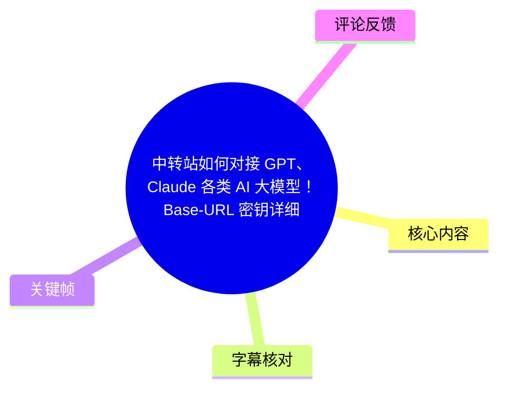
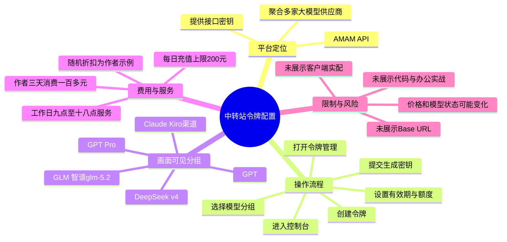
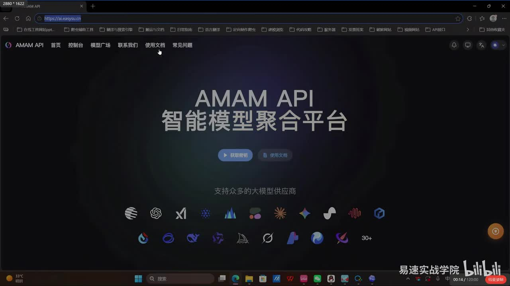
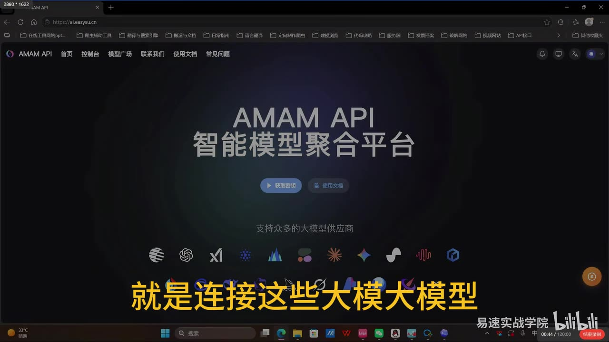
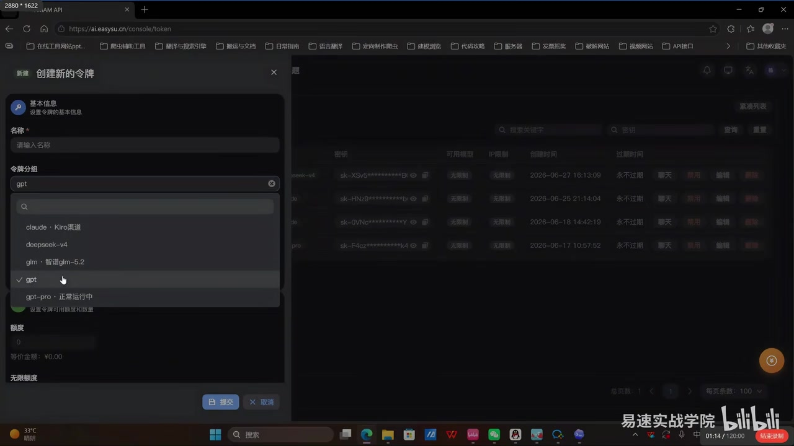
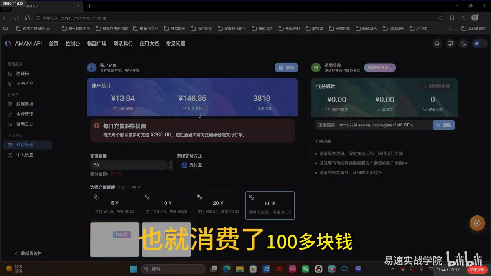

## 小结

视频介绍了一个名为 **AMAM API** 的“智能模型聚合平台”（画面地址栏显示为 `ai.easysu.cn`）。作者将其定位为连接不同大模型供应商的中转服务：用户可在该平台控制台创建令牌（密钥），再将密钥用于所需的 AI 模型接口。

实操主线集中于控制台的**令牌管理**：进入“添加/创建新的令牌”，填写名称，选择令牌分组或模型渠道，例如画面中可见 `claude · Kiro渠道`、`deepseek-v4`、`glm · 智谱glm-5.2`、`gpt` 与 `gpt-pro · 正常运行中`，然后设置额度、有效期等项目并提交。作者口述称可设置“永不过期”，但画面同时显示额度和费用字段，说明密钥生命周期与消费额度是两个不同维度。

收费方面，作者自述其在三天内多次请求，消费“一百多块钱”；平台充值页面显示“每个号最多可充值 ¥200.00”的每日限额。作者还口述每日存在随机折扣，并以“充值 200 元、实付 190 元”的 95 折作为示例。上述价格、折扣与额度均属于视频中的平台展示或作者个人陈述，不能视为当前仍然有效的价格承诺。

标题声称覆盖 Base URL、GPT、Claude、多模型切换、办公与写代码，但本次可识别的语音和关键帧**没有展示具体 Base URL 字符串、第三方客户端配置界面、请求代码、办公任务或编程任务的实际输出**。因此，本文只记录已出现的中转站入口、令牌创建和充值信息，不补写未展示的配置参数。

适合希望理解“聚合 API 平台如何发放不同渠道密钥”的读者。实际接入前应自行核验模型名称、接口兼容性、计费规则、服务状态、数据处理政策以及密钥安全机制；尤其不应仅因“便宜”“稳定”的作者评价而将生产流量或敏感数据直接交由第三方中转。

## 思维导图





## 目录

- [视频定位与信息边界](#视频定位与信息边界)
- [平台首页：聚合模型服务](#平台首页聚合模型服务)
- [令牌创建：模型分组、额度与有效期](#令牌创建模型分组额度与有效期)
- [充值、折扣与服务支持](#充值折扣与服务支持)
- [可复现操作清单与配置缺口](#可复现操作清单与配置缺口)
- [经验、限制与时效性](#经验限制与时效性)
- [字幕比对](#字幕比对)
- [评论分析](#评论分析)
- [处理记录](#处理记录)

## 视频定位与信息边界 [00:00](https://www.bilibili.com/video/BV15sTe6zEhK?t=0)

视频时长的元数据为 **194 秒**，UP 主为“易速实战学院”，标题围绕中转站对接 GPT、Claude 等模型，以及 Base URL 和密钥配置展开。

但应区分标题承诺与实际素材：

| 项目 | 素材中可确认的内容 | 素材中未确认的内容 |
| --- | --- | --- |
| 平台身份 | AMAM API；浏览器地址栏可见 `ai.easysu.cn` | 平台与各模型官方之间的授权、代理或合作关系 |
| 模型聚合 | 首页写有“支持众多的大模型供应商”；令牌分组含 Claude、DeepSeek、GLM、GPT | 每种模型的准确版本、上下文窗口、速率限制、区域可用性 |
| 密钥配置 | 控制台令牌管理、创建令牌、选分组、提交 | 生成后的完整密钥值、保存方式、撤销流程 |
| Base URL | 标题提及 | 视频画面与 ASR 均未给出可抄录的 Base URL |
| 应用实战 | 标题提及办公、写代码、多模型切换 | 未见 IDE、聊天客户端、curl、SDK、办公文档或代码结果演示 |

因此，下面将“视频所述”和“需要用户自行核验的事项”明确分开。

## 平台首页：聚合模型服务 [00:14](https://www.bilibili.com/video/BV15sTe6zEhK?t=14)

作者打开 AMAM API 首页。页面导航可见“首页、控制台、模型广场、联系我们、使用文档、常见问题”；主视觉文案为“AMAM API 智能模型聚合平台”，下方标示“支持众多的大模型供应商”，并排列多个供应商或模型图标。

作者口述将“中转站”的作用概括为：连接这些大模型，并以 API 接口的形式为用户提供密钥。这里的“中转站”可理解为：用户并非在演示中直接进入每一家模型供应商的后台，而是通过一个统一的控制台创建和管理访问凭据。



> 图：该帧显示 AMAM API 首页、地址栏域名和“智能模型聚合平台”定位。它用于确认视频所演示的平台入口与功能定位，而非证明平台实际支持的全部模型或实时可用状态。



> 图：该帧将首页的多模型图标与“就是连接这些大模型”的讲解字幕同时呈现，有助于理解作者对中转站功能的定义：统一连接多家模型，而不是单一模型官网。

### 视频中的接口表述

作者口述中提到“API 模型的一个接口”“提供一个密钥”。由于 ASR 对专有名词识别存在误差，不能可靠确认其在这一段列举的全部接口名称。结合标题和后续令牌分组画面，能确认的重点是：平台提供按模型/渠道分组的令牌管理入口。

**注意：**“获得密钥”不等于已经完成任何客户端接入。一个可用的调用配置通常还需要 Base URL、接口协议兼容性、模型 ID、鉴权格式和具体客户端字段；这些信息没有在本视频素材中完整展示。

## 令牌创建：模型分组、额度与有效期 [01:14](https://www.bilibili.com/video/BV15sTe6zEhK?t=74)

作者进入控制台的“令牌管理”，点击添加令牌。关键帧中弹出“创建新的令牌”窗口，内容可识别为：

- **名称**：必填输入框，提示“请输入名称”；
- **令牌分组**：下拉选择；
- **额度**：画面中显示为 `0`；
- **等价金额**：画面中显示为 `¥0.00`；
- **无限额度**：画面下方可见该选项文字；
- **提交 / 取消**：窗口底部操作按钮。

下拉列表可见的分组包括：

| 画面中的文字 | 可作出的谨慎解读 |
| --- | --- |
| `claude · Kiro渠道` | Claude 相关的渠道分组；“Kiro”具体含义未由视频解释。 |
| `deepseek-v4` | DeepSeek 相关分组；不能据此确认官方模型版本或 API 名称。 |
| `glm · 智谱glm-5.2` | GLM/智谱相关分组；具体版本标识以画面为准。 |
| `gpt` | GPT 分组。 |
| `gpt-pro · 正常运行中` | GPT Pro 分组，画面在录制时显示“正常运行中”；仅代表该时点页面状态。 |



> 图：该帧是本视频最关键的操作证据：它直观显示创建令牌的字段及可选分组。相较于仅凭口述，可据此确认视频确实演示了在令牌管理中按渠道/模型分组创建密钥。

### 按视频顺序整理的操作步骤

1. 打开作者展示的中转站网站，并进入**控制台**。
2. 在侧边栏选择**令牌管理**。
3. 点击添加令牌，打开“创建新的令牌”窗口。
4. 在“名称”字段填写用于识别该令牌的名称。
5. 在“令牌分组”中选择拟使用的模型/渠道分组，例如 GPT、Claude、DeepSeek 或 GLM 相关分组。
6. 根据界面可用选项设置额度；画面存在“无限额度”文字，实际是否启用及其含义需要以平台当时说明为准。
7. 作者口述称可将有效期设置为“永不过期”；应在提交前核对界面的实际过期策略。
8. 点击**提交**生成令牌。

### 关于“免费生成密钥”的准确理解

ASR 中出现“点击提交就能免费……生成一个密钥”的表述，但该句存在明显重复和识别不稳定；同时视频后段明确介绍充值与按请求消费。更稳妥的记录是：

- 视频演示的是通过提交表单**创建令牌**；
- 令牌是否“免费创建”与使用接口是否收费是不同问题；
- 画面中的额度、等价金额和充值页表明，实际调用存在账户额度/计费维度；
- 不应将“可生成密钥”推论为“模型调用永久免费”。

## 充值、折扣与服务支持 [01:44](https://www.bilibili.com/video/BV15sTe6zEhK?t=104)

作者随后展示“账户充值”页。画面可见账户统计卡片、充值数量输入、支付宝支付方式、不同充值面额，以及醒目的“每日充值限额提醒”。

### 可从画面与口述确认的费用信息

| 信息 | 来源 | 边界说明 |
| --- | --- | --- |
| 三天多次请求消费“一百多块钱” | 作者口述 | 是作者个人使用描述，未给出请求量、模型、输入输出 Token 或账单明细，不能外推单价。 |
| 每日有随机折扣 | 作者口述 | 未见折扣规则、适用条件或有效期。 |
| “200 块钱 95 折，190 块钱充 200 块额度” | 作者举例 | 是讲解示例，非可验证的固定活动。 |
| 每个账号每日最多充值 `¥200.00` | 充值页画面及作者口述 | 反映录屏时页面提示，可能被平台后续调整。 |
| 可选面额 | 画面 | 页面可见 `5 元、10 元、20 元、50 元` 等档位。 |
| 服务时间为周一至周五 9:00—18:00 | 作者口述 | 未说明时区、节假日规则或服务渠道的具体响应级别。 |
| 有官方联系群 | 作者口述 | 视频称展示了群号，但本次 ASR 未可靠提取具体号码，本文不臆测或转写。 |



> 图：该帧直接显示“每日充值限额提醒”、充值选项及页面账户数据，是核对费用相关说法的主要依据。它同时说明视频中的“低价”评价应放在预充值、限额和实际用量的背景下理解。

### 作者的主观评价

作者将该中转站评价为自己接触过的中转站中“收费相当便宜”的一个，并称日常使用中很少出现中断，服务器“比较稳定”。这些属于作者的经验性判断，不是独立测试结论。视频未提供：

- 延迟、吞吐、成功率或可用性监控数据；
- 不同模型的价格表与 Token 计费口径；
- 故障记录、SLA 或退款规则；
- 对比的中转站名单与统一测试条件。

## 可复现操作清单与配置缺口 [02:00](https://www.bilibili.com/video/BV15sTe6zEhK?t=120)

若目标只是复现视频中**创建令牌**这一动作，可按下表核对：

| 阶段 | 视频已展示的动作 | 实操时应自行补齐/核验 |
| --- | --- | --- |
| 账户入口 | 打开平台并进入控制台 | 注册、登录、身份验证及账户合规要求 |
| 令牌创建 | 令牌管理 → 添加令牌 → 填名称 → 选分组 → 提交 | 令牌权限范围、IP 限制、额度含义、失效与撤销方式 |
| 模型选择 | 在下拉列表中选 Claude、DeepSeek、GLM、GPT 等相关分组 | 客户端应填写的准确模型 ID，以及该分组是否仍可用 |
| 费用准备 | 充值页选择金额，页面有日限额 | 计费单位、输入/输出价格、缓存价格、失败请求收费与退款规则 |
| 实际调用 | 视频仅讲述密钥生成 | Base URL、API 路径、HTTP 请求格式、鉴权 Header、SDK 配置与错误处理 |

### Base URL 与客户端配置：本视频未提供的关键参数

标题强调“Base-URL 密钥详细配置流程”，但现有画面和 ASR 没有给出 Base URL，也未展示在 OpenAI 兼容客户端、Claude 客户端、IDE 插件或代码中的配置页面。因此，以下字段均不能从本视频推导：

```text
Base URL = 视频未展示，不能补写
API Key = 视频未展示具体值，且不应公开
Model ID = 仅见分组名称，未见调用用精确 ID
API Path = 视频未展示
Authentication Header = 视频未展示
SDK / IDE 配置项 = 视频未展示
```

在第三方聚合服务中，最重要的安全操作是：

1. **不要把密钥贴入截图、公开仓库、聊天记录或前端代码。**
2. 为不同项目和环境创建不同令牌，便于单独撤销与审计。
3. 优先设置合理额度或限额；即使界面提供“无限额度”，也要先理解其实际作用。
4. 在正式使用前，用少量非敏感测试请求验证模型名、调用格式、响应质量和账单。
5. 将 Base URL、模型名称、费率与隐私条款直接从平台“使用文档”或官方支持渠道获得，不以标题、ASR 或截图猜测替代。

## 经验、限制与时效性 [03:00](https://www.bilibili.com/video/BV15sTe6zEhK?t=180)

### 可迁移的经验

- **统一令牌管理有助于多模型试用。** 视频展示的按分组建令牌方式，适用于希望在 GPT、Claude、DeepSeek、GLM 等渠道间切换的需求，但前提是先确认各分组对应的真实模型和协议。
- **先看额度和计费，再扩大使用量。** 创建令牌页出现额度字段，充值页有每日限额；这提示用户在调用前应明确预算边界。
- **把“稳定、便宜”当作待验证假设。** 作者的使用体验可以作为寻找资料的线索，不能替代自己的连通性、成本和隐私测试。
- **模型名称与渠道名称不等于官方直连。** 下拉框中的文字反映平台分组，不能单独证明底层服务提供者、模型版本或转发链路。

### 主要限制

1. **Base URL 缺失。** 无法依据本视频完成任何第三方客户端的完整接入。
2. **没有端到端调用证据。** 视频未展示令牌创建后的 API 请求、返回内容、模型自由切换效果或报错处理。
3. **没有成本可复算数据。** “三天一百多元”缺少模型、Token、请求次数和账单细目。
4. **没有安全与隐私说明。** 视频未说明请求日志保留、数据是否用于训练、密钥加密、访问控制或服务条款。
5. **素材时长存在显示差异。** 元数据时长为 194 秒；部分关键帧播放器底部可见的总时长显示为 `120:00`，两者不一致。本文以任务元数据的 194 秒为视频总时长依据，并将截图内播放器显示视为录屏画面信息，而非重新校正后的时长。
6. **信息具时效性。** 元数据发布时间为 2026-07-01，素材抓取时间为 2026-07-13。平台可用模型、渠道状态、充值上限、折扣、价格和联系支持均可能随时改变。

## 字幕比对 [00:00](https://www.bilibili.com/video/BV15sTe6zEhK?t=0)

本次任务中**站内字幕与本次 ASR 均已提供，且本次 ASR 已执行**。两份文本质量差异显著。

| 字幕来源 | 完整性 | 专有名词 | 时间轴 | 主要问题 |
| --- | --- | --- | --- | --- |
| Bilibili 站内字幕 | 与视频主题严重不符 | 将内容识别为“闪电麦昆”“华强北”“插卡版手表”等 | 未提供可用分段时间戳 | 实际是一段关于手表续航、导航等内容的文本，不能用于本视频。 |
| 本次 ASR 字幕 | 覆盖平台介绍、令牌、充值、服务时间等主要段落 | 可识别“Claude”“DeepSeek”“GPT”“GLM”等，但存在“中展站”“Close”“closed code”等误识 | 未提供逐句时间戳；依据关键帧和视频流程定位章节 | 断句与重复较多，部分模型/渠道词不稳定，未覆盖可用的 Base URL 或调用配置。 |

### 最终字幕选择与校正原则

本文以**本次 ASR 为主**，并通过关键帧和上下文进行有限校正：

| ASR 原文或疑似误识 | 本文采用的写法 | 校正依据 |
| --- | --- | --- |
| “中展站”“中转针” | 中转站 | 标题、上下文与视频主题一致。 |
| “Close”“closed code” | 不作为确定模型名转写 | ASR 不稳定；关键帧明确可见的是 `claude · Kiro渠道`，而非 ASR 中的完整词组。 |
| “deep thick” | 不直接采用 | 关键帧可见 `deepseek-v4`，故正文按画面转写。 |
| “GPGP” | 不直接采用 | 关键帧可见 `gpt` 与 `gpt-pro` 分组。 |
| “网池/网区” | 平台网站/入口 | 语境是作者展示网站，ASR 词形不可靠。 |

站内字幕与实际视频无关，未被用于事实提取。对于无法由画面或语境可靠校正的专有名词，本文保留不确定性，而不进行猜测性扩写。

## 评论分析 [03:10](https://www.bilibili.com/video/BV15sTe6zEhK?t=190)

任务提供的热评抓取结果中，`items` 为空；虽然视频元数据显示回复数为 4，但没有可获取的热评文本。

因此，**可分析的热评数量为 0 条**，未达到“热评前三条”的可获取条件。本文不根据回复总数推测评论内容，也不将不存在的评论观点视为用户反馈。

## 评论分析

本次流程未获取到可用热评，因此不推断观众态度或额外结论。

## 处理记录

- **Worker ID**：`worker-mrj0wbly-5dc4e50c`
- **模型**：`gpt-5.6-terra`
- **调用工具与素材**：视频元数据、素材清单、关键帧、Bilibili 站内字幕、本次 ASR 字幕、热评抓取结果。
- **使用的应用工具**：素材下载/合并输出（`merged.mp4`）、音频导出（`audio/audio.wav`）、关键帧提取（`frames/`）、字幕获取（`subtitles/`）、ASR 转写（`asr/`）及评论抓取（`comments/comments.json`）；本记录仅据提供的产物清单整理，未额外声称执行未提供日志的操作。
- **字幕选择**：站内字幕内容与视频主题不符，弃用；采用本次 ASR 作为主要语音依据，并以关键帧校正“中转站”、`deepseek-v4`、`gpt` 等可见文字。无法可靠校正的专有名词不作断言。
- **关键帧选择依据**：选用 `frame-001`、`frame-002` 证明平台入口与聚合定位；选用 `frame-003` 记录创建令牌与模型分组；选用 `frame-004` 记录充值页面和每日充值限额。其余帧未在提供的可视素材说明中呈现额外可核验信息，未强行引用。
- **评论处理**：按“仅处理可获取热评前三条”执行；结果无可获取热评，故未编造评论分析。
- **缓存清理**：提供的素材清单未附缓存清理日志或清理结果，无法确认是否执行过缓存清理；本记录不将其标记为已完成。
- **未解决问题**：真实 Base URL、API 路径、模型精确 ID、令牌完整权限与额度规则、实际请求样例、价格表、隐私政策、联系群号码及平台当前可用性均未能从所给素材可靠取得。
