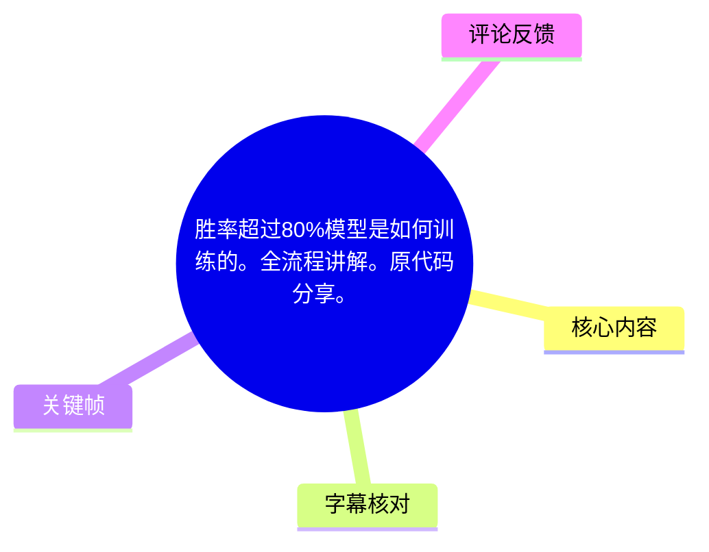
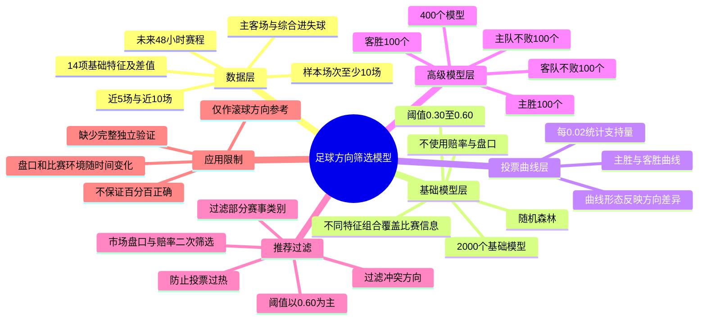
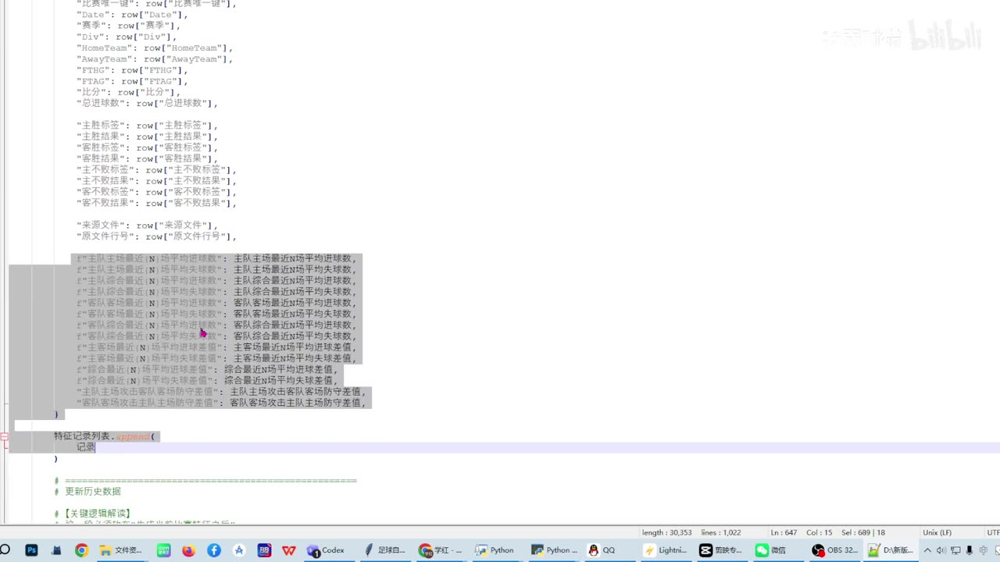
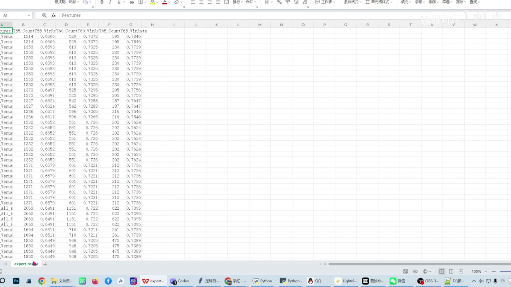
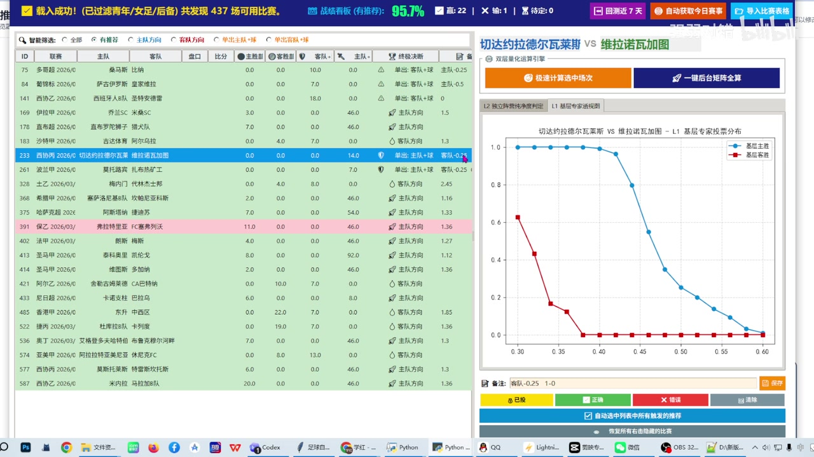

# 胜率超过80%模型是如何训练的。全流程讲解。原代码分享。

> 来源：[Bilibili 视频](https://www.bilibili.com/video/BV14Eji69EiT)  
> UP 主：强弱对错｜时长：30 分 28 秒｜分辨率：1920×1080  
> 标签：世界杯、模型、足球、比赛、胜率、流程

## 小结

视频讲解了一套用于足球比赛方向筛选的两层模型流程：先以近期比赛进失球相关数据构造大量基础模型，再将不同阈值下的模型投票曲线作为特征，训练第二层“高级模型”进行筛选。UP 主称，系统运行时加载 **2,000 个基础模型**与 **400 个高级模型**。

基础数据以未来 48 小时赛程为范围，收集双方近 5 场、近 10 场，以及主客场、综合进球与失球等指标；视频明确称模型**不使用赔率和盘口作为训练特征**。画面中的代码还显示，特征记录包含主队/客队近期进失球、主客场近期均值、综合均值及双方差值等字段。

UP 主的核心思路不是直接用一两个统计量判断胜负，而是让不同特征组合的基础模型投票；随后把主胜、客胜等方向在 `0.30—0.60`、步长 `0.02` 的各阈值投票量绘制成曲线，再由第二层模型学习哪些曲线形态对应较稳定的结果。

视频中“胜率超过 80%”需要谨慎理解：UP 主实际展示和口述的基础模型最佳结果约为 **78%**，并称将阈值提得更高可使历史命中率超过 80%，但推荐场次数会明显下降。其选择 `0.60` 作为主要阈值，是在命中率与可推荐场次之间取折中；UP 主另称最近半个月推荐 110 场、命中 86 场，约为 **78%**。这些均为视频作者自述，素材未提供完整回测样本、时间切分、赔率收益、独立验证或可复现实验，不能视为已经验证的投资或博彩收益结论。

模型输出被定位为“滚球参考”或方向参考，而非直接等同于赛前下注指令。UP 主特别说明，由于模型不看赔率、盘口，模型方向可能与赛前盘口不匹配，因此需要等待滚球盘口变化，或在后续增加市场盘口与赔率过滤。视频涉及体育博彩盘口讨论，存在资金风险；历史命中率不等于未来结果，也不构成任何投注建议。

## 思维导图





## 目录

- [系统规模、数据范围与特征构造](#系统规模数据范围与特征构造-0001)
- [基础模型：随机森林与阈值投票](#基础模型随机森林与阈值投票-0236)
- [投票曲线与高级模型的二次学习](#投票曲线与高级模型的二次学习-0610)
- [阈值、命中率与推荐数量的权衡](#阈值命中率与推荐数量的权衡-0819)
- [滚球参考：模型方向如何面对市场盘口](#滚球参考模型方向如何面对市场盘口-1400)
- [投票区间、过热保护与赛事过滤](#投票区间过热保护与赛事过滤-2023)
- [市场匹配、发布与结果结算](#市场匹配发布与结果结算-2355)
- [代码分享与视频明确边界](#代码分享与视频明确边界-2817)
- [关键参数速查](#关键参数速查-2023)
- [结论、限制与时效性](#结论限制与时效性-2817)
- [字幕比对](#字幕比对-0001)
- [评论分析](#评论分析-0001)
- [处理记录](#处理记录-0001)

## 系统规模、数据范围与特征构造 [00:01](https://www.bilibili.com/video/BV14Eji69EiT?t=1)

UP 主表示，此次视频是对此前零散讲解的流程化整理。系统启动后会加载：

- **2,000 个基础模型**
- **400 个高级模型**
- 模型文件总体积约“十几、二十多个 G”（原话表述不够精确，不能据此确定具体大小）

系统首先获取**未来 48 小时内的比赛数据**，然后收集两队近期数据。根据口述和代码画面，可确认重点信息包括：

1. 双方最近 **5 场**与最近 **10 场**的数据；
2. 主队的主场表现、客队的客场表现；
3. 双方综合进球数、综合失球数；
4. 近期主客场进失球均值、综合近况均值；
5. 主队与客队对应指标之间的差值特征。

UP 主称初始数据中只使用“14 个数据特征”，其中部分差值由前述原始统计计算得来。由于 ASR 对“14 个数值特征”周边语句有一定错字，具体 14 个字段名应以画面代码为准；可从画面确认其特征构造并非单一的进球数，而是覆盖主队、客队、主客场、综合表现和两队差异。



> 图：画面展示 Python 代码中的比赛记录与特征字段，包括日期、联赛、主客队、进失球及主客场近期平均数据等。这是判断视频模型输入来源的重要依据：输入是基于历史赛果统计构造的结构化特征，而非单纯主观判断。

### 数据有效性要求 [03:28](https://www.bilibili.com/video/BV14Eji69EiT?t=208)

UP 主强调，参与计算的数据必须保证样本量有效，口述为“必须得大于等于十”，即不能在所需历史样本不足时，用 9 场等不足数量的数据替代。可整理为以下规则：

- 数据窗口使用近 5 场、近 10 场；
- 对需要 10 场数据的指标，历史记录至少达到 10 场；
- 数据不足的比赛不应进入对应特征计算或模型流程。

这一约束的作用是避免因比赛记录不足导致近期均值或差值失真。但视频未展示缺失值处理、赛事延期、跨赛季、换帅、伤停、红牌等变量的处理方式。



> 图：表格画面展示名为 `Features` 的数据导出结果，包含计数、阈值胜率等列。它说明作者会将组合特征及相应表现导出查看，但画面没有展示全部字段定义、训练/测试集划分及统计口径。

## 基础模型：随机森林与阈值投票 [02:36](https://www.bilibili.com/video/BV14Eji69EiT?t=156)

UP 主称基础层使用**随机森林**训练模型，并说明模型仅使用近期比赛进球、失球及其派生特征；**不使用任何赔率和盘口**。这意味着模型试图从赛果统计本身推断比赛方向，而不直接把市场预期作为输入。

基础模型的关键设计是“多模型、多特征组合”：

- 不同基础模型使用的特征组合不同；
- 有的模型侧重主队特征；
- 有的模型侧重客队特征；
- 有的模型侧重双方差值；
- 大量组合共同覆盖同一场比赛可利用的统计信息。

UP 主认为，只根据“主队主场进了几个球、客队客场进了几个球”就直接得出结论过于片面；其做法是用随机组合的特征集合，交给大量模型分别判断，再以集体投票替代单一指标判断。

### 阈值扫描与投票含义 [03:52](https://www.bilibili.com/video/BV14Eji69EiT?t=232)

基础模型输出会在 `0.30` 到 `0.60` 的阈值范围内扫描，步长为 `0.02`。据视频口述，可写作：

```text
阈值集合 = {0.30, 0.32, 0.34, ..., 0.60}
```

对于每个阈值，统计有多少基础模型支持某一方向。例如：

- 在主胜阈值 `0.30` 下，有多少模型支持主胜；
- 将阈值升至 `0.32`、`0.34` 等后，支持数量如何变化；
- 对客胜方向重复相同统计；
- 最终形成主胜与客胜的两条投票曲线。

UP 主用“把每个小模型当成一个人”来解释：在给定阈值下，统计有多少“人”支持某种结果。此处的“支持量”是模型数量，不等同于真实概率，也不等同于赔率隐含概率。

### 曲线示例与方向判断 [04:30](https://www.bilibili.com/video/BV14Eji69EiT?t=270)

视频举例说明：某场比赛中，主胜方向在低阈值时支持比例很高，随着阈值上升逐步下降；客胜方向则在阈值升高后支持量迅速降低甚至归零。UP 主据此将比赛归为主胜倾向。

随后，视频展示了一场市场盘口与模型方向不一致的案例：作者口述市场给出“客队让 0.25”，而模型给出主队方向，最终比分为 1:0。该案例仅是单场展示，不能据此推导该系统整体有效性。



> 图：画面左侧为比赛列表，右侧为“基层专家投票分布”图。蓝、红两条曲线在多个阈值点呈现不同投票比例，是理解“先形成曲线、再由高级模型识别曲线”的核心视觉证据。顶部还显示“已过滤青年/女足/后备”等字样，和后文的赛事过滤规则相互印证。

## 投票曲线与高级模型的二次学习 [06:10](https://www.bilibili.com/video/BV14Eji69EiT?t=370)

UP 主指出，每场比赛的投票曲线形态并不相同：有的曲线偏向主胜，有的偏向客胜，不能只凭单一形态规则判断。因此，系统在基础层之上又训练了第二层模型，让机器继续识别哪些主、客方向投票分布更稳定。

高级层共有 **400 个模型**，分为四个方向，每个方向 **100 个模型**：

| 高级模型方向 | 数量 |
| --- | ---: |
| 主胜 | 100 |
| 客胜 | 100 |
| 主队不败 | 100 |
| 客队不败 | 100 |
| 合计 | 400 |

高级模型输入不是原始进失球数据本身，而是基础模型在不同阈值下的投票量。也就是说，其层次结构为：

```text
近期比赛统计
  → 构造基础特征
  → 2,000 个基础模型投票
  → 各阈值下的主/客方向投票曲线
  → 400 个高级模型识别曲线分布
  → 形成方向筛选结果
```

这属于视频所述的“两次学习”：第一层从比赛统计学习方向；第二层从第一层的投票分布学习哪些信号形态更稳定。视频未提供高级模型的具体算法、训练标签、特征维度、交叉验证方案或模型随机种子，因此无法在本素材基础上完整复现。

## 阈值、命中率与推荐数量的权衡 [08:19](https://www.bilibili.com/video/BV14Eji69EiT?t=499)

UP 主在此处明确讨论“高胜率”与“推荐量”的冲突：

- 基础模型在阈值 `0.60` 附近，视频口述其胜率大致可到 **70%—78%**；
- UP 主表示，基础模型中“最好的”约为 **78%**，并非画面中已经稳定超过 80%；
- 若把阈值进一步提高到 `0.65`、`0.70` 或更高，可能获得“80%以上”的历史表现；
- 但阈值越高，通过的比赛越少，可能一天没有可推荐比赛，或只出现一场，实用性下降；
- 因此，后续推荐主要采用 `0.60` 阈值，并以达到约 `70%` 胜率作为可推荐的基本目标；
- 在 `0.55` 阈值下，推荐量会更大，但UP 主称胜率仅“60 多”。

这里需要区分三个概念：

1. **模型阈值**：决定多少基础模型信号才被纳入；
2. **命中率/胜率**：视频中未说明是按何种赛果、盘口结算方式、样本区间或是否剔除走盘计算；
3. **推荐量**：阈值提高通常减少样本数，也会使统计波动更大。

UP 主后续称高级模型在 `0.60` 阈值下，理论和实际都达到“70 多”的水平；并口述最近半个月推荐 110 场、命中 86 场，约 `86 / 110 = 78.18%`。但视频未提供这 110 场的逐场清单、结果定义、是否包含进行中比赛、复盘数据和独立审计，故只能记录为作者阶段性自报成绩。

## 滚球参考：模型方向如何面对市场盘口 [14:00](https://www.bilibili.com/video/BV14Eji69EiT?t=840)

UP 主称网站中的结果定位为“滚球参考”。原因是基础训练不使用赔率、盘口，所以模型虽然给出方向，但赛前市场给出的盘口深度可能已不适合直接执行。

### 情形一：模型给“主队不败”，赛前主队已让较深盘口 [14:31](https://www.bilibili.com/video/BV14Eji69EiT?t=871)

视频举例：模型判断主队不败，但市场给出主队让 `0.75`。此时模型只表达方向，未说明应该选择主队让 `0.75`、让 `0.5` 还是其他盘口，赛前直接执行会产生选择问题。

UP 主给出的处理思路是等待滚球：

- 等到半场结束；
- 或等待 20—30 分钟；
- 若未进球，原本主队让 `0.5` 的盘口可能降至主队 `0`；
- 也可能出现更符合模型方向的受让机会；
- 只有当盘口与方向的匹配更合理时才考虑。

这是一种盘口时点策略，而非模型本身的预测能力证明。实际滚球盘口会受进球、红牌、控球、伤停、流动性等因素影响，视频未提供正式的盘口变化概率或执行纪律。

### 情形二：模型与市场方向明显冲突 [16:18](https://www.bilibili.com/video/BV14Eji69EiT?t=978)

UP 主举例称，某场模型计算为客胜，而市场却给客队受让 `0.75`。作者称此类模型与市场“明确有分歧”的场景可作为关注点，并提到一场世界杯比赛曾据此选择客队受让 `0.75`，结果获胜；紧接着也承认另一个案例“没打出来”。

这里的信息边界是：

- 视频展示的是作者自己的案例叙述；
- 单场命中与单场失误都不能估计长期期望；
- 模型与市场分歧可能来自模型发现的信号，也可能来自遗漏了伤停、战意、赛程、阵容、市场信息等变量；
- 在没有长期、盲测、含赔率收益率数据的情况下，不能把“与市场分歧”直接视为优势信号。

### 原始数据展示的用途 [17:09](https://www.bilibili.com/video/BV14Eji69EiT?t=1029)

UP 主表示，网页展示模型原始计算结果，是为了让用户在滚球中捕捉可能的盘口机会。例如：

- 模型为“主队不败”，市场却让主队受让 `0.5`：作者认为赛前就可能存在可关注的方向；
- 模型为“主队不败”，市场为平手：风险偏好高时可考虑平手方向，较保守时等待主队受让 `0.25`；
- 模型为主队方向，但赛前主队让 `0.25` 或 `0.5`：可等待 20—30 分钟无进球，观察盘口是否变化为主队平手；
- 模型为客胜而市场为平手：作者提到激进做法与保守做法不同，但未给出固定仓位、止损和赔率阈值。

视频并没有提供可直接执行的风险管理框架，如单场资金比例、凯利公式上限、连续亏损处理、最大回撤、关闭条件等。因此即使研究其模型结构，也不能将其视为完整的交易系统。

## 投票区间、过热保护与赛事过滤 [20:23](https://www.bilibili.com/video/BV14Eji69EiT?t=1223)

UP 主说明，高级模型在 `0.60` 阈值下还会使用支持模型数区间进行筛选。ASR 在具体数字处存在明显识别混乱，以下仅记录可较稳定辨认的规则框架，**不把不清晰数字当成精确配置**：

- 某一方向的支持票数需要落在指定区间；
- 主队方向、客队方向以及“主队不败”“客队不败”使用不同区间；
- UP 主口述客队方向相关条件会允许相对更大的投票量，理由是主场优势可能使方向分布不对称；
- 票数上限不能设为接近所有模型都通过，因为这可能反映“比赛过热”而非稳健信号。

### 为什么要避免过热 [21:39](https://www.bilibili.com/video/BV14Eji69EiT?t=1299)

UP 主解释，一队如果近期连续遇到实力很弱的对手，出现 `4:0`、`5:0`、`6:0` 等大比分，模型会把这支队伍识别得过强；但这不一定代表其与正常强度对手交手时仍有同等优势。

视频将这种风险归因为：

- 模型依赖历史进失球数据；
- 模型不纳入球员、赔率、盘口等信息；
- 极端比分会放大近期均值和双方差异；
- 因而可能把赛程难度或偶然大比分误认成真实实力差距。

UP 主提出，当 `0.60` 阈值下仍有大量模型一致支持某个方向时，应怀疑基础数据被极端赛果扭曲。其后又称投票超过 30 的情况不推荐，但前段口述有“80、90、50、60”等混乱数字，无法从 ASR 准确还原所有方向的完整上下限；应以原代码或原始配置文件为准。

### 赛事类型与冲突过滤 [23:55](https://www.bilibili.com/video/BV14Eji69EiT?t=1435)

在模型输出后，UP 主称会过滤以下比赛或情形：

- 女足；
- 青年队；
- 后备队、预备队；
- `U` 系列赛事；
- 主队与客队方向同时出现投票、即方向冲突的比赛；
- 在 `0.60` 阈值下单一方向票数过高的比赛。

作者的理由是这些赛事类别的不稳定因素更多，且女足与男足比赛风格不同。需要注意：这是视频作者的策略性排除，不等于这些赛事无法建模；若要验证，应比较过滤前后的样本量、命中率、赔率收益和置信区间。

## 市场匹配、发布与结果结算 [25:26](https://www.bilibili.com/video/BV14Eji69EiT?t=1526)

在模型过滤以后，UP 主还会用市场盘口、赔率进行二次筛选。该步骤与“模型训练不使用赔率盘口”并不矛盾：赔率盘口不作为第一层模型训练输入，但会作为最终推荐发布前的执行条件。

### 主胜/客胜方向的赔率门槛 [25:26](https://www.bilibili.com/video/BV14Eji69EiT?t=1526)

对于模型判断为主胜的比赛，UP 主称正式推荐要求主胜赔率**大于 1.5**，以放弃“低水”或回报过低的比赛。其口述中将这一范围与亚洲盘主队让 `0.75` 至让 `1` 附近关联。

作者的基本逻辑是：

```text
模型给出主胜
  + 市场赔率大于 1.5
  + 对应盘口深度通过筛选
  → 才可能正式发布
```

客胜方向按类似原则处理。需要注意，赔率 `>1.5` 并不自动意味着正期望；是否有长期优势还取决于模型的真实校准度、实际成交赔率、抽水、结算规则和样本外表现。

### 让球/受让方向的处理 [26:13](https://www.bilibili.com/video/BV14Eji69EiT?t=1573)

对于主队受让、客队受让等亚洲盘方向，UP 主称会结合盘口深度与赔率做过滤；其认为亚洲盘两侧赔率通常接近 `1.9`，不会像部分独赢盘那样出现特别低水，因此筛选重点是方向与盘口深度是否匹配。

视频结尾进一步概括了市场匹配思路：

- 模型给出主队受让，但市场给客队让球，属于更明显的方向差异；
- 模型给出客队受让，而市场给主队让球或平手，也属于需观察的市场状态；
- 胜负方向的比赛，会优先筛出赔率高于 `1.5` 的场次；
- 任一模型条件或市场筛选条件未通过，则不在网页端发布。

### 发布与结算 [27:52](https://www.bilibili.com/video/BV14Eji69EiT?t=1672)

完整运行流程可整理为：

1. 获取未来 48 小时赛程；
2. 收集双方近期比赛数据；
3. 校验历史样本是否满足要求；
4. 构造基础统计特征和差值特征；
5. 由 2,000 个基础模型形成多阈值投票；
6. 用 400 个高级模型判断主胜、客胜、主队不败、客队不败等方向；
7. 过滤过热票数、方向冲突和指定赛事类别；
8. 使用赔率、盘口深度进行二次匹配；
9. 全部条件通过后，在网页端发布；
10. 赛后将比赛结果与推荐方向对比，进行胜率结算。


> 图：界面顶部显示载入成功、推荐筛选与胜负统计信息，左侧为待选比赛，右侧显示选中比赛的投票曲线。该图的价值在于展示模型并非只输出一个标签，而是经由列表筛选、曲线查看与结果记录构成应用流程。

## 代码分享与视频明确边界 [28:17](https://www.bilibili.com/video/BV14Eji69EiT?t=1697)

UP 主称，如观众希望研究模型训练源代码，可以联系其并留下联系方式；同时表达对部分索取代码后又投诉行为的不满。视频没有直接展示可公开下载的仓库地址、许可证、依赖版本、数据来源授权或运行说明，因此不能据此认定代码已经公开发布。

UP 主同时明确表示：

- 不保证系统完美；
- 不保证“百分之百正确”；
- 观众可将其代码作为研究参考并形成自己的研究方向。

这也是理解标题中“超过 80%”时必须保留的边界：作者自己并未承诺稳定、持续或无条件的 80% 以上结果。

## 关键参数速查 [20:23](https://www.bilibili.com/video/BV14Eji69EiT?t=1223)

| 项目 | 视频中的说法 | 备注 |
| --- | --- | --- |
| 基础模型数量 | 2,000 个 | 系统启动时加载 |
| 高级模型数量 | 400 个 | 4 个方向各 100 个 |
| 基础训练方法 | 随机森林 | 口述为“随机森林” |
| 赛程范围 | 未来 48 小时 | 用于收集待分析比赛 |
| 历史窗口 | 近 5 场、近 10 场 | 含主场、客场与综合数据 |
| 初始特征数 | 14 个 | ASR 有错字，具体字段应以代码为准 |
| 数据最低要求 | 至少 10 场 | 防止用不足样本计算 |
| 基础层阈值扫描 | 0.30 至 0.60，步长 0.02 | 用于生成投票曲线 |
| 主用阈值 | 0.60 | 在命中率与推荐量间取折中 |
| 视频称最佳基础模型表现 | 约 78% | 作者口述，未见完整验证资料 |
| 视频称阶段性结果 | 半个月 110 场中 86 场 | 约 78.18%，作者自述 |
| 高胜率阈值说法 | 0.65、0.70 等可能超过 80% | 同时会大幅减少可推荐场次 |
| 主胜正式发布门槛 | 赔率大于 1.5 | 后续仍需盘口筛选 |
| 过热过滤 | 单方向高票数不推荐；后段提及大于 30 | 前段具体数字 ASR 不清，勿视作精确配置 |
| 排除赛事 | 女足、青年、后备、预备、U 系列等 | 作者自身策略，并非普遍事实 |
| 市场数据角色 | 不参与模型训练；参与最终筛选 | 是本系统的重要分层设计 |

## 结论、限制与时效性 [28:17](https://www.bilibili.com/video/BV14Eji69EiT?t=1697)

这套系统最有价值的可迁移思路，是将“原始比赛统计 → 多模型投票 → 阈值曲线 → 二层筛选 → 市场执行过滤”拆分为不同层次，而不是把一个预测模型的单次输出直接当成最终决策。

可借鉴的工程经验包括：

- 对历史数据设置样本量下限；
- 用多种特征组合覆盖不同视角；
- 不只看单模型结果，也观察模型群体投票分布；
- 对极端数据、方向冲突和不稳定比赛类别设置过滤；
- 将预测层与执行层区分：即使训练不使用市场信息，实际发布前仍可评估市场条件；
- 在高命中率与低覆盖率之间明确权衡，而不是只展示最优阈值。

但视频未解决或未提供证据的问题也很关键：

1. **数据来源与质量未知**：没有说明数据接口、数据清洗、缺失处理、赛季边界和赛事覆盖范围。
2. **训练与验证方案未知**：没有展示训练集/测试集划分、滚动回测、交叉验证、样本外表现或防止数据泄漏的方法。
3. **标签与结算口径未知**：主胜、客胜、不败、让球方向的命中如何定义，走盘与延期如何处理，视频没有完整说明。
4. **缺乏收益验证**：高命中率不代表可盈利；需要结合实际成交赔率、抽水、赔率漂移、投注限额、资金管理和最大回撤。
5. **市场信息被排除在训练之外**：这可能减少市场噪声，也可能遗漏阵容、伤停、战意及集体信息；优劣必须由严格样本外比较决定。
6. **参数存在 ASR 不确定性**：投票区间的部分具体数字识别不稳定，不能直接据此复刻。
7. **时效性强**：赛程、球队状态、数据源、盘口、水位和网页端规则均会变化；视频所述的阶段性成绩只对应其当时的数据与流程环境。
8. **博彩风险**：视频讨论盘口与滚球，仅能作为模型研究材料。任何资金决策均有损失风险，且不同地区对相关活动的法律与平台规则不同。

## 字幕比对 [00:01](https://www.bilibili.com/video/BV14Eji69EiT?t=1)

| 字幕来源 | 完整性 | 专有名词/数字准确性 | 时间轴 | 主要问题 |
| --- | --- | --- | --- | --- |
| Bilibili 站内字幕 | 未提供可用字幕 | 无法比较 | 无 | 素材明确标注“未提供可用站内字幕” |
| 本次 ASR 字幕 | 较完整：117 段，语音覆盖约 1,566.18 秒，占视频约 85.7% | 一般：存在“组队/客阔”“随机生灵”“约代码”等明显错识别 | 可用：含精确 SRT 起止时间 | 口语重复较多；部分盘口、票数区间及特征名称识别不稳定；存在 6 段较大静音/无语音间隔 |

本次工作已检查 ASR 结果。ASR 使用 `medium` 模型、中文识别，语言置信度约 `0.9966`，时间戳可用；其诊断中**没有**标记 `noAudioStream=true`，且素材提供了 `audio/audio.wav`，因此源视频存在可识别的音轨。

最终采用策略为：

- 以本次 ASR 的 SRT 时间戳作为章节定位依据；
- 对明显错字按上下文和关键帧进行有限校正，例如将“随机生灵”校正为“随机森林”、“约代码”理解为“源代码”；
- 对无法由音频或画面可靠确认的精确数值，不擅自补全；
- 对“14 个特征”、基础模型/高级模型数量、阈值 `0.30—0.60`、步长 `0.02`、`0.60` 主用阈值、110 场/86 场等多处反复出现且语义稳定的内容予以保留；
- 投票区间的若干具体上下限受 ASR 干扰较大，仅记录其筛选逻辑，不宣称为精确可复现参数。

## 评论分析 [00:01](https://www.bilibili.com/video/BV14Eji69EiT?t=1)

仅获取到热评前三条，三条均为观众表示已“三连”并留下联系方式，希望获得源代码或进一步联系 UP 主。为保护评论者隐私，不复述其邮箱或其他联系方式。

| 热评 | 核心观点 | 可提供的信息 | 可信度与边界 |
| --- | --- | --- | --- |
| 热评 1（2 赞） | 表示支持视频并希望联系作者 | 佐证评论区存在索取代码的需求 | 只是个人联系请求，不证明代码已交付，也不验证模型表现 |
| 热评 2（0 赞） | 表示已三连并留下联系方式 | 与 UP 主口述“留下联系方式获取源代码”的方式相呼应 | 未提供模型、数据或结果的独立补充信息 |
| 热评 3（0 赞） | 表示已三连并希望联系 | 同样反映观众对源码的兴趣 | 仅代表个体意愿，不能作为系统可信度证据 |

评论区前三条没有提出具体技术质疑、回测复核、盈利证明或代码使用反馈，因此无法从中获得对模型有效性的独立验证。

## 处理记录 [00:01](https://www.bilibili.com/video/BV14Eji69EiT?t=1)

- **Worker ID**：`worker-mrj0wbly-5dc4e50c`
- **模型**：`gpt-5.6-terra`
- **素材与工具产物**：视频元数据、关键帧、`audio/audio.wav`、`asr/transcript.srt`、`asr/asr-result.json`、评论数据 `comments/comments.json`
- **ASR 工具信息**：ASR 模型为 `medium`；语言为中文；运行设备为 CUDA；计算类型为 float16；ASR 含可用时间戳。
- **字幕选择**：站内字幕未提供可用版本，因此使用本次 ASR SRT 作为唯一时间轴来源；结合画面与上下文修正少量明显错识别，但未臆造不清晰参数。
- **关键帧依据**：
  - `frames/frame-002.jpg`：代码画面，能够验证比赛数据与特征字段的结构；
  - `frames/frame-003.jpg`：系统界面与投票曲线，能够验证基础投票分布、比赛列表和过滤流程；
  - `frames/frame-004.jpg`：特征导出表，能够辅助理解特征统计与阈值表现。
- **关键帧使用限制**：仅根据提供画面说明可见内容；未对未展示的代码逻辑、表格列含义或隐藏参数作超出素材的推断。
- **缓存清理**：未提供缓存清理执行日志或结果；本记录不声称已完成缓存删除。
- **未解决问题**：
  - 无可用站内字幕，无法进行逐句官方字幕核验；
  - 投票区间的部分具体数字在 ASR 中失真；
  - 视频未给出完整源代码、数据集、回测清单、赔率收益和独立测试资料；
  - 标题所称“超过 80%”与视频中“最佳约 78%”及“提高阈值可超过 80%”之间，应以作者具体统计口径和原始数据进一步核对。

## 评论分析

- 热评 1：2744316398@qq.com一键三连，感谢博主
- 热评 2：已三连，290708842@qq.com
- 热评 3：1634857912@qq.com 已三连

以上内容是观众反馈摘录，只用于补充理解视频反响，不作为正文事实依据。
