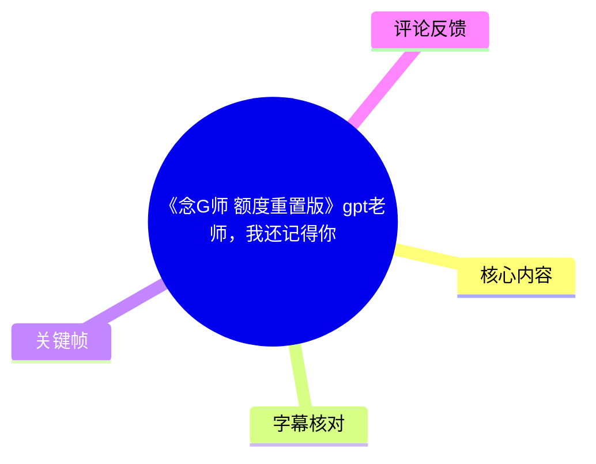
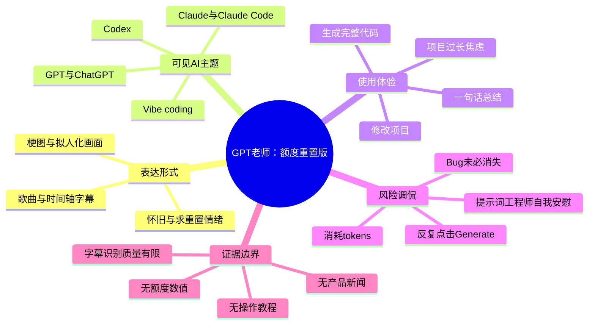
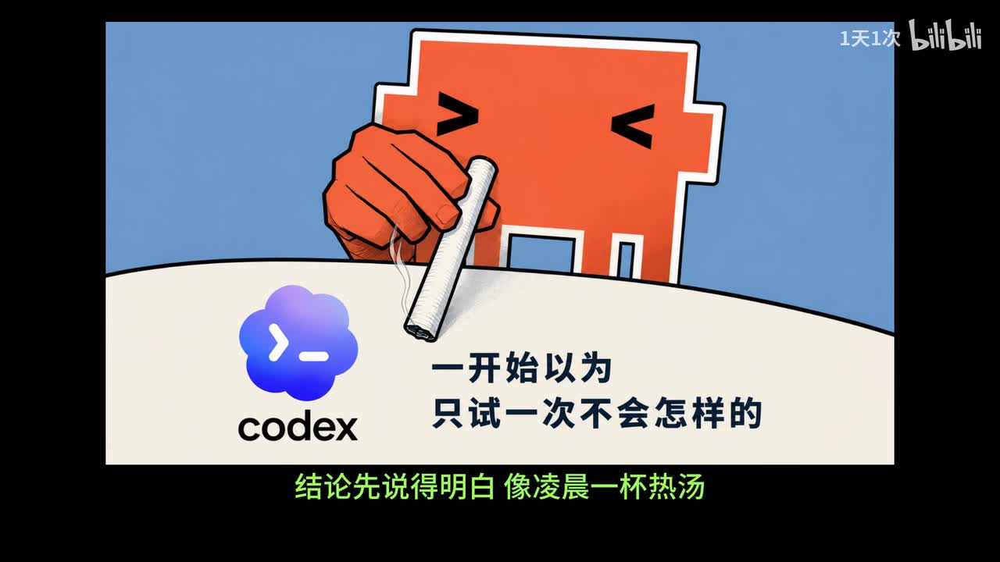
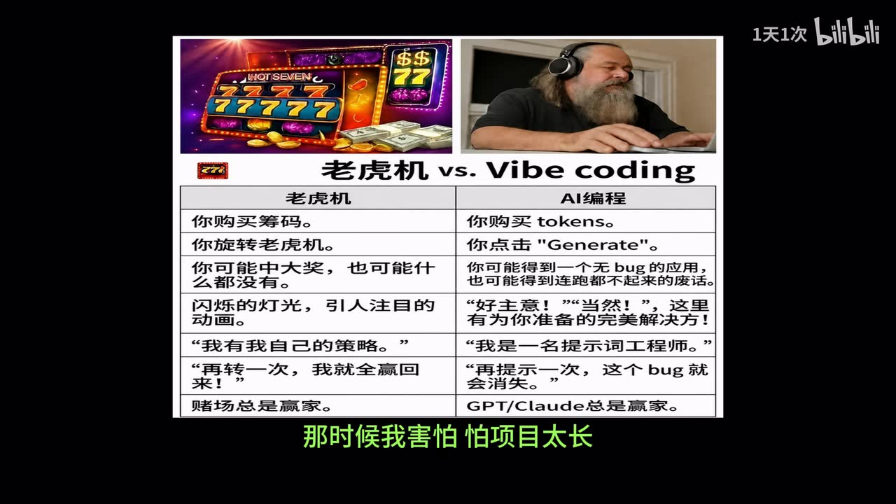

# 《念G师 额度重置版》gpt老师，我还记得你

> 来源：[Bilibili 视频](https://www.bilibili.com/video/BV1RUET6tE7o) 
> UP 主：1天1次｜时长：04:22｜分辨率：1920×1080｜合集：AIcode  
> 视频简介：`我们的GPT，究竟会变成什么样……😭 再带我们重置一次吧`  
> 标签：Claude、ChatGPT、Claude Code、Codex 等。

## 小结

这是一支以歌曲、字幕和梗图组成的 AI 编程怀旧/调侃向视频，而非产品教程或新闻解读。其叙事对象是被拟人化为“GPT老师”的生成式 AI：创作者借“记得你”“再带我们重置一次”等表达，回望自己使用 AI 协助编程、整理结论和修改项目的体验。

视频传达的核心经验并不是某个确定的提示词或配置，而是对 AI 编程使用过程的双重感受：一方面，画面将 Codex/GPT 描绘为能快速给出“完整代码”、帮助把结论先说明白的助手；另一方面，画面也以“老虎机 vs. Vibe coding”的对照，调侃不断点击生成、投入 token、反复尝试修复 bug 的不确定性和沉没成本。

从可见画面可确认，视频涉及 **Codex、GPT/ChatGPT、Claude、Claude Code、Vibe coding、token、Generate、bug、提示词工程师** 等概念；但它没有给出模型版本、价格、额度数值、API 参数、命令行命令、代码仓库或可复现的操作流程。因此，不应把它解读为针对这些产品能力、稳定性或计费规则的权威测试。

视频标题中的“额度重置版”与简介中的“重置”表达了创作者希望恢复使用体验的情绪性诉求；素材中未提供任何官方公告或实测证据，无法据此推断 Codex、ChatGPT、Claude 或 Claude Code 的真实额度政策发生过何种变化。

适合将本片作为 AI 编程文化、用户情绪和 Vibe coding 风险意识的轻量记录阅读。涉及的产品、额度、模型和功能都具有强时效性；视频发布时间为 2026-06-08，后续平台策略、模型名称与资费均可能变化。

## 思维导图

## 目录

- [定位、背景与时效性](#定位背景与时效性)
- [从 Codex 试用到“结论先说清楚”](#从-codex-试用到结论先说清楚)
- [Vibe coding：老虎机式风险隐喻](#vibe-coding老虎机式风险隐喻)
- [“GPT老师”的拟人化回忆](#gpt老师的拟人化回忆)
- [可提炼的使用经验与缺失步骤](#可提炼的使用经验与缺失步骤)
- [结论、限制与时效性](#结论限制与时效性)
- [字幕比对](#字幕比对)
- [评论分析](#评论分析)
- [处理记录](#处理记录)

## 定位、背景与时效性

### 视频性质与证据范围 [00:00:15](https://www.bilibili.com/video/BV1RUET6tE7o?t=15)

站内字幕从 **00:00:15.160** 才开始，持续至 **00:04:07.080**；全片总时长为 262 秒。因此，00:00:00—00:00:15 之间没有可用的站内字幕文本，不能据此补写开场内容。

从站内字幕的音符标记 `♪`、分段节奏以及关键帧中的底部绿色歌词可判断，视频主体是配乐/演唱式表达。站内字幕的多个词句存在明显错识，例如将产品名、术语和完整语义识别为不通顺文本；故下文仅将其时间段作为可靠时间锚点，再以关键帧中可直接读到的文字校正可确认的信息。

元数据中的发布时间戳对应 2026-06-08；素材抓取时间为 2026-07-15。这里的时间仅用于说明资料版本，不表示视频中提及的任何产品政策在此后仍有效。

## 从 Codex 试用到“结论先说清楚”

### 画面中的 Codex 与低门槛尝试 [00:00:32](https://www.bilibili.com/video/BV1RUET6tE7o?t=32)

在站内字幕 **00:00:32.610—00:00:42.950** 所在段落，关键帧展示一个带终端符号的 Codex 标识及一段可辨识的文案：

> “一开始以为  
> 只试一次不会怎样的”

同一画面底部绿色文字可读为“结论先说得明白 像凌晨一杯热汤”。这说明创作者将 AI 辅助编程体验关联到两类价值：

1. **降低第一次尝试的心理门槛**：先“只试一次”的预期较轻；
2. **快速获得可理解的结论**：强调答案先给出结论、减少摸索感。

这不是对 Codex 实际产品功能、免费次数或额度机制的说明。“只试一次不会怎样”是画面中的修辞，不能据此推导试用次数、计费方式或使用后果。

> 图：该帧直接呈现 Codex 标识、“一开始以为只试一次不会怎样的”以及“结论先说得明白”的绿色歌词。它是确认视频把 Codex 与初次尝试、快速给结论联系起来的关键视觉证据。

### “完整代码”与项目推进的愿望 [00:00:39](https://www.bilibili.com/video/BV1RUET6tE7o?t=39)

站内字幕在 **00:00:39.070—00:00:42.950** 的文本中可辨认出“给我生成完整代码”。这与视频标签中的 ChatGPT、Claude、Claude Code、Codex 共同构成一个明确语境：创作者关注的是让生成式 AI 直接参与代码产出和项目推进。

但视频没有呈现：

- 所使用的提示词；
- 输入的需求、代码上下文或项目规模；
- 生成代码是否可运行；
- 测试、审查或部署结果；
- 任何模型版本、上下文窗口、token 用量或额度数值。

所以，“生成完整代码”在本片中应理解为使用者的期待和情绪化表达，而不是可保证的工程工作流。

## Vibe coding：老虎机式风险隐喻

### “老虎机 vs. Vibe coding”的画面对照 [00:00:43](https://www.bilibili.com/video/BV1RUET6tE7o?t=43)

站内字幕 **00:00:43.350—00:00:57.390** 对应的关键帧给出了全片最具体的技术文化对照：标题为“老虎机 vs. Vibe coding”，以左右表格比较赌博机与 AI 编程。

> 图：该帧以并列表格展示“老虎机”和“AI编程”的类比，是视频对 Vibe coding 风险进行直接、可核验表达的核心画面；底部歌词同时出现“那时候我害怕 怕项目太长”。

表格中可直接辨识的对应关系包括：

| 老虎机侧 | AI 编程侧 | 可谨慎提炼的含义 |
| --- | --- | --- |
| 你购买筹码 | 你购买 tokens | 使用 AI 可能对应持续的资源/费用投入。 |
| 你旋转老虎机 | 你点击 “Generate” | 用户以反复请求生成的方式追求结果。 |
| 你可能中大奖，也可能什么都没有 | 你可能得到一个无 bug 的应用，也可能得到连电脑都开不起来的废话 | 生成结果存在质量与可用性的不确定性。 |
| 闪烁的灯光、引人注目的动画 | “好主意！”“当然！”以及“为你准备的完美解决方案” | 模型自信、积极的表述不等于结果正确。 |
| “我有我自己的策略。” | “我是一名提示词工程师。” | 对提示技巧的信心可能被用来调侃式自我安慰。 |
| “再转一次，我就全赢回来了！” | “再提示一次，这个 bug 就会消失。” | 反复尝试可能形成循环，并不能保证问题解决。 |
| 赌徒总是赢家。 | GPT/Claude 总是赢家。 | 这是讽刺性结论，指向平台/工具提供方可能持续获得使用量，而非事实性的商业结算结论。 |

这一段最有价值的经验是：**将生成请求当作需要验证的假设，而不是把模型的肯定语气当作成功信号。** 当项目变长、问题复杂时，应特别警惕连续追加提示却不检查运行结果的行为。

不过，画面对照是讽刺漫画，不是对 GPT、Claude、Codex 商业模式或实际代码质量的统计研究。表格中“购买 tokens”等说法只能反映作者的表达，不能替代各平台的官方计费文档。

## “GPT老师”的拟人化回忆

### 从“一句话总结”到进入代码世界 [00:01:01](https://www.bilibili.com/video/BV1RUET6tE7o?t=61)

站内字幕 **00:01:01.750—00:01:14.370** 处出现反复的“……老师，我还记得你”句式；虽然其自动转写把产品名误为“记PPT老师”等，但结合标题中的“gpt老师”、画面中的 OpenAI 标志，以及底部清晰可见的绿色文字，可将这一段主题谨慎概括为：创作者把 GPT 拟人化为曾帮助自己理解、总结并进入代码实践的“老师”。

> 图：该帧中人物发饰带有 OpenAI 标志，底部文字为“一句总结 带我走进代码里”。它为“GPT老师”并非传统教师、而是生成式 AI 的拟人化称呼提供了直接画面依据。

画面所呈现的“一句总结”具有可迁移的工作方式含义：在面对陌生代码或问题时，先要求助手给出简短的目标、结构和下一步摘要，再进入细节。但这只是从画面表达提炼出的阅读/协作策略；视频未展示任何实际对话，因此无法验证其是否能稳定适用于复杂工程。

### “改项目”与“额度重置”的情绪语境 [00:01:45](https://www.bilibili.com/video/BV1RUET6tE7o?t=105)

站内字幕 **00:01:45.300—00:01:59.560** 中可辨认出“看你改我的项目”，而标题明确使用“额度重置版”。两者共同勾勒出创作者对 AI 介入项目修改的依赖、感激与焦虑：希望工具继续可用，并希望它能帮助接住项目中的复杂问题。

需要严格区分以下两层：

- **视频可证实的层面**：创作者通过歌曲、字幕和画面表达对 GPT/AI 编程助手的怀念，以及对项目修改、代码生成、额度重置的关注。
- **视频不能证实的层面**：是否存在某项额度下调、额度重置功能、模型变更，或者任一工具曾实际误删、修复特定项目。

## 可提炼的使用经验与缺失步骤

### 可迁移的审查流程 [00:02:00](https://www.bilibili.com/video/BV1RUET6tE7o?t=120)

站内字幕从 **00:02:00.250** 进入后半段，仍以歌曲式叙述为主，并未提供可执行教程。结合前述“老虎机 vs. Vibe coding”画面，能从视频主题中提炼的，是一套**对视频观点的延伸性整理**，而非原视频逐步教学：

1. **先限定任务，再请求生成**：不要只给出宽泛的“生成完整代码”；应明确目标、输入输出、语言/框架、现有约束和验收方式。
2. **先获取摘要，再深入细节**：对应画面中的“一句总结”，先让工具说明方案、文件影响和潜在风险，再决定是否采纳。
3. **对生成结果做运行与测试验证**：画面明确调侃“可能得到无 bug 的应用，也可能得到……废话”，因此不能仅凭自然语言解释判断正确性。
4. **避免“再提示一次就会消失”的循环**：当 bug 连续未解决时，应暂停堆叠提示，回到报错日志、最小复现、依赖版本和测试用例。
5. **控制资源消耗**：画面把 token 与筹码类比。无论实际是否按 token 计费，都应关注连续请求带来的成本、时间和上下文混乱。

以上流程中的“运行、测试、最小复现”等工程做法并未被视频逐项展示，是基于其风险隐喻作出的实践性补充；不能归因于 UP 主已在视频中演示。

### 视频未给出的参数与操作条件 [00:03:09](https://www.bilibili.com/video/BV1RUET6tE7o?t=189)

站内字幕 **00:03:09.810—00:03:40.530** 再次进入“……老师，我还记得你”的重复段落。即使站内字幕中出现了疑似“生成”“误删”等片段，这些片段识别质量不可靠，且没有对应的可读代码界面或系统记录。

因此，以下关键信息均为缺失状态：

| 信息类别 | 素材是否提供 | 结论 |
| --- | --- | --- |
| GPT/Claude/Codex 的具体模型版本 | 否 | 无法比较能力。 |
| 额度上限、重置周期、订阅价格 | 否 | 无法确认“额度重置版”的事实指向。 |
| token 数量、上下文长度 | 否 | 不可量化成本。 |
| 提示词、命令、代码 | 否 | 不具备复现条件。 |
| bug 样例及修复前后结果 | 否 | 无法验证修复有效性。 |
| 官方新闻或公告来源 | 否 | 不构成产品新闻证据。 |

## 结论、限制与时效性

### 结尾的“我还记得你” [00:03:55](https://www.bilibili.com/video/BV1RUET6tE7o?t=235)

站内字幕 **00:03:55.870—00:04:07.080** 为可用字幕的最后一段，仍围绕“我还记得你”的情感表达展开。全片的稳定结论是：它借“GPT老师”这一称呼，记录了 AI 编程助手在用户日常代码工作中带来的陪伴感、效率期待和不确定性。

视频的价值主要在于三点：

- 用“一句话总结”“生成完整代码”等表达，呈现用户对 AI 助手的效率期待；
- 用老虎机隐喻指出 Vibe coding 中反复生成、持续消耗和结果不可控的风险；
- 以怀旧式歌曲提醒读者：对工具的情感依赖不应替代工程验证。

限制同样明确：这不是产品评测、额度公告、模型横评或编码教程；没有可复现案例，也没有官方来源。尤其是“GPT/Claude 总是赢家”“购买 tokens”等文字均属于讽刺表达，不能当作商业事实引用。

时效性方面，视频发布于 2026-06-08，且涉及的生成式 AI 产品政策变化频繁。若读者需要了解实际额度、订阅、模型可用性或 Codex/Claude Code 功能，应以观看当日的官方产品页、账户内用量页面和服务条款为准。

## 字幕比对

| 字幕来源 | 完整性 | 专有名词 | 时间轴 | 主要问题 |
| --- | --- | --- | --- | --- |
| Bilibili 站内字幕 `p01-ai-zh.srt` | 覆盖约 00:15—04:07，主体段落齐全，但开头及结尾少量时段未覆盖 | 较差；“GPT老师”等多处误识，部分歌词不通顺 | 良好；提供毫秒级起止时间，可作为章节定位依据 | 歌词听写错误较多，不能逐字作为事实转录 |
| 本次 ASR | 无有效文本；`segments` 为空 | 无法识别 | 无可用时间轴文本；虽任务输出标记支持时间戳，但未产出分段 | 自动检测语言为英语，置信度 `0.541015625`；语音覆盖率为 0，诊断提示未识别到语音段 |

本次 ASR 已实际检查，结果为空，并非未执行。其诊断中**没有** `noAudioStream=true` 标记，因此不能断言源视频没有音轨；更准确的表述是：音轨素材已被抽取为 `audio/audio.wav`，但 ASR 未识别出语音分段。结合站内字幕的 `♪` 标记，较合理的原因是内容以歌曲/演唱为主且识别条件不匹配，但这只是诊断性判断，不等同于音轨不存在。

最终字幕策略如下：

1. **时间轴**：采用站内 SRT 的真实毫秒级起止时间，并按其起点换算为链接秒数；
2. **文字内容**：不逐字采用站内字幕中的明显错识部分；
3. **术语校正**：以标题、标签与关键帧可见文字为准，确认使用“GPT老师”“Codex”“Vibe coding”“token”“Generate”“GPT/Claude”等；
4. **无法校正处**：保留为“歌曲式/情绪性表达”，不补造完整歌词。

关键校正依据包括：`frames/frame-002.jpg` 中的 “codex” 与“只试一次不会怎样的”；`frames/frame-003.jpg` 中的“老虎机 vs. Vibe coding”、`tokens`、`Generate`、`GPT/Claude`；`frames/frame-004.jpg` 中的 OpenAI 标志与“一句总结 带我走进代码里”。

## 评论分析

以下仅处理可获取的热评前三条；评论反映的是观众解读，不是经视频或官方材料验证的事实。

1. **福尔亚（31 赞）：“表达了作者的思乡之情”**  
   该评论以反讽方式把视频的怀念情绪概括为“思乡之情”。它没有提供关于 AI 产品、额度或创作背景的事实补充，但说明观众能够感受到作品的怀旧、失落与召唤“回归”的情绪。

2. **星紡_Hoshitsumu（15 赞）：“本期视频由大D老师赞助播出[doge]”**  
   这是一条带 `[doge]` 表情的玩笑式评论。“大D老师”在给定素材中没有被解释，也没有任何赞助信息可供核验；因此不能将其理解为实际商业赞助或视频事实。

3. **梏权（15 赞）：“GPT老师[大哭]”**  
   该评论直接呼应标题和视频的拟人化称呼，并以哭泣表情强化情感共鸣。它不含新技术信息，但与视频将 GPT 称为“老师”、表达记忆与不舍的主题一致。

## 处理记录

- Worker ID：`worker-mrj0wbly-5dc4e50c`
- 模型：`gpt-5.6-terra`
- 调用工具与素材：视频元数据、站内字幕 `p01-ai-zh.srt`、本次 ASR 诊断与结果、关键帧目录、热评数据。
- 本次 ASR 检查：ASR 模型为 `medium`，设备为 CUDA，计算类型 `float16`；自动语言检测为英语（置信度 `0.541015625`），结果 `segments=[]`、语音覆盖率为 0。
- 字幕选择：以站内 SRT 提供的时间轴为准；由于其歌词/专名错识明显，正文仅引用关键帧可直接确认的文字，并对无法确认的歌词不作补写。ASR 无有效文本，未纳入正文转录。
- 关键帧选择依据：选用 `frame-002` 证明 Codex 与“只试一次”文案；选用 `frame-003` 呈现“老虎机 vs. Vibe coding”的具体对照；选用 `frame-004` 确认 OpenAI 标志、“GPT老师”拟人化及“一句总结”主题。其余关键帧未在给定可见素材中提供可稳定校验的额外文字信息，故不强行引用。
- 热评范围：仅分析可获取的前三条，未扩展至其他评论。
- 缓存清理：给定素材未提供缓存清理执行日志；本文不声称已执行删除或清理操作。
- 未解决问题：站内歌词存在大面积错识；本次 ASR 未产出文本；无法仅凭现有素材确认“额度重置”所指的具体产品规则、模型版本或实际事件。
