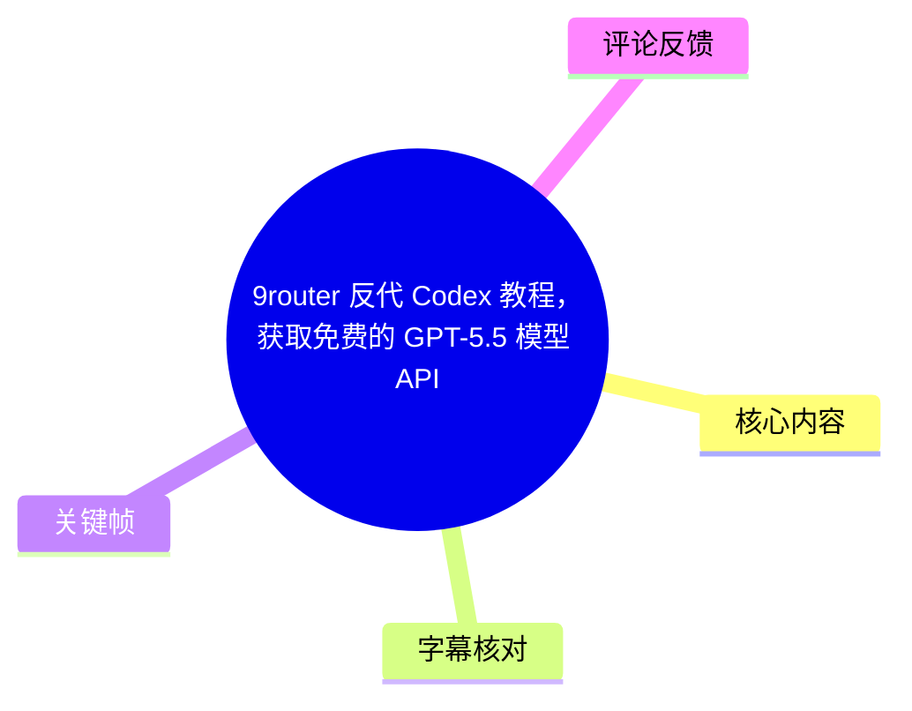
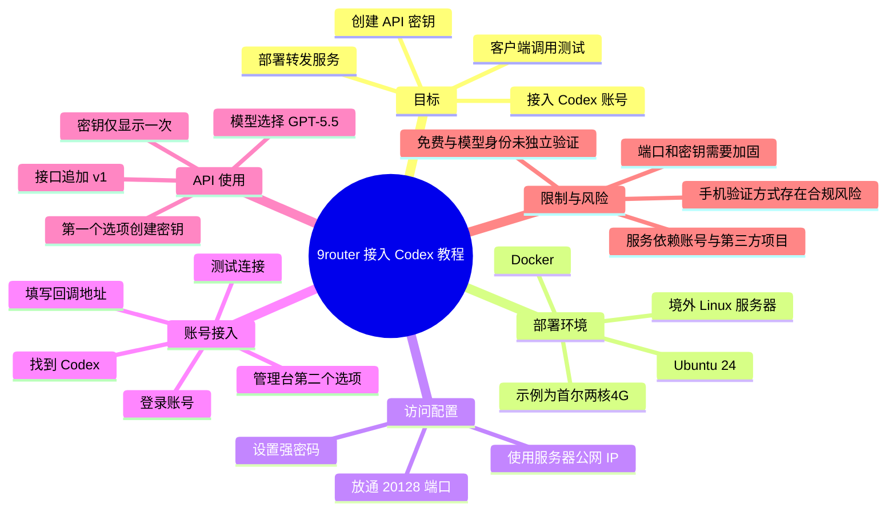
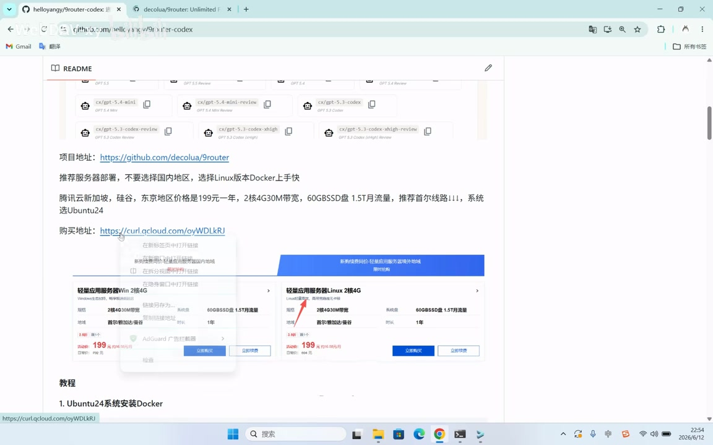
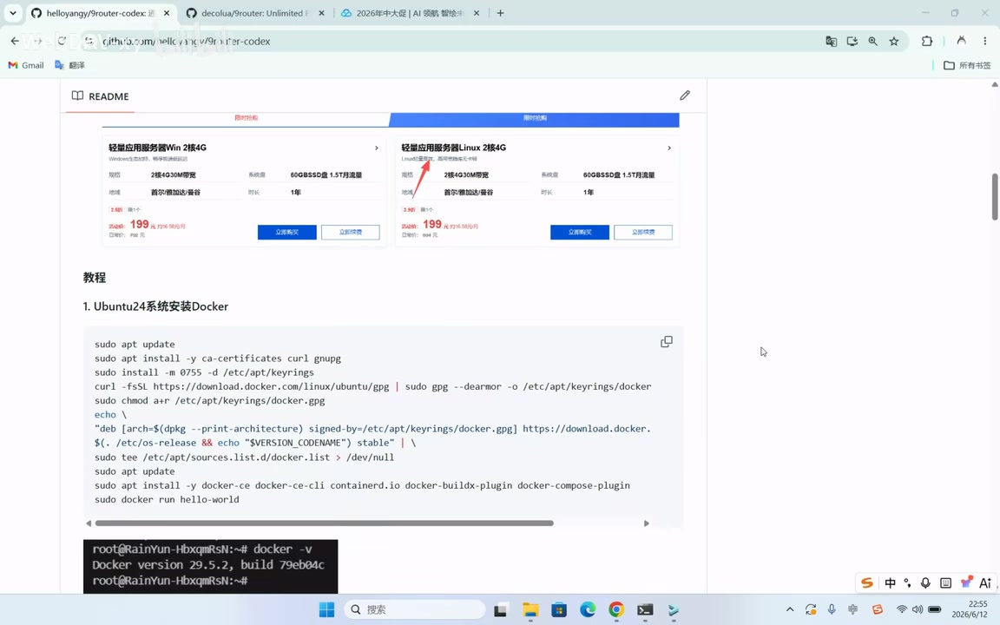
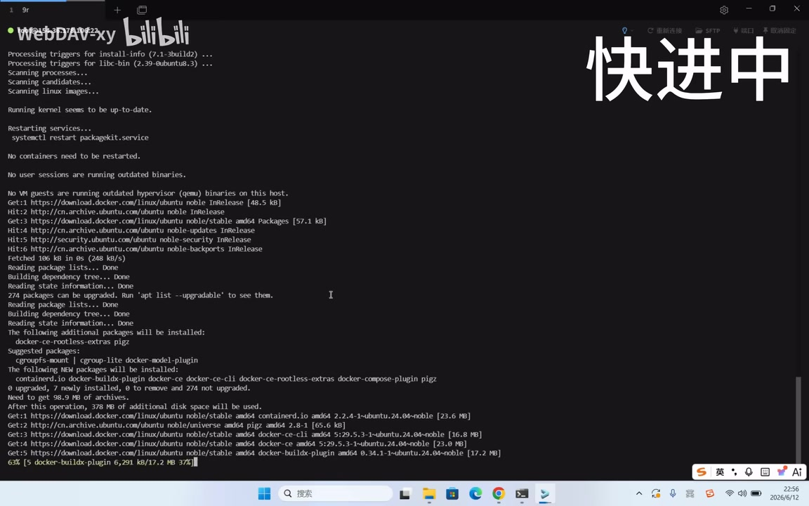

## 小结

这是一段桌面录屏部署教程。作者演示如何在 Linux 云服务器上通过 Docker 部署 9router 相关项目，进入管理页面接入 Codex 账号、创建密钥，并在一个被口述为“龙虾”的客户端中配置自定义模型。视频标题称该路径可“获取免费的 GPT-5.5 模型 API”，但素材只证明作者录制时的一次部署与测试成功，**未提供模型官方身份、额度、计费、长期稳定性或服务条款的独立证明**。

作者推荐使用境外 Linux 服务器，示例为腾讯云首尔地域、Ubuntu 24、Linux 两核 4G，并通过 Docker 部署。视频给出的关键网络参数是管理服务需放通公网端口 **`20128`**；访问时将教程地址中的占位 IP 换成服务器真实 IP。

账号接入流程包括：登录管理台、进入第二个选项中的 Codex、点击添加、在弹出的窗口登录账号、复制回调地址并填回管理台，然后执行测试。作者称测试成功后，可在第一个选项创建 API 密钥，并强调**密钥仅显示一次**。

客户端侧，作者在“龙虾”中进入“设置 → 自定义模型”，将接口设为“服务器 IP 加端口，再添加 `/v1`”，填写新建密钥，并选择“GPT-5.5”。最后通过询问“现在的时间”展示响应速度和结果。该测试只覆盖基础连通性与一次简单问答，不代表模型能力、并发、稳定性或接口长期可用。

视频中以 `123456` 作为部署密码示例，但作者明确建议改为强密码。视频还提到手机号验证可通过“接码网站”等其他方式处理；这不是官方验证说明，可能涉及账号、隐私和服务规则风险，本文仅如实记录，不作为推荐做法。

## 思维导图





## 目录

- [视频定位、信息边界与时效性](#视频定位信息边界与时效性)
- [项目页面与服务器选择](#项目页面与服务器选择)
- [Docker 安装与项目部署](#docker-安装与项目部署)
- [端口放行与管理台登录](#端口放行与管理台登录)
- [添加 Codex 账号与连通性测试](#添加-codex-账号与连通性测试)
- [创建 API 密钥](#创建-api-密钥)
- [客户端配置与请求验证](#客户端配置与请求验证)
- [限制、风险与经验](#限制风险与经验)
- [字幕比对](#字幕比对)
- [评论分析](#评论分析)
- [处理记录](#处理记录)

> 视频：[BV1k8JV6ZEJ3](https://www.bilibili.com/video/BV1k8JV6ZEJ3)  
> UP 主：WebDAV-xy｜合集：AIcode｜时长：5 分 26 秒  
> 视频简介提供的文字教程：<https://github.com/helloyangy/9router-codex>  
> 元数据标签：模型、教程、Linux

## 视频定位、信息边界与时效性 [00:00](https://www.bilibili.com/video/BV1k8JV6ZEJ3?t=0)

视频开场主题为“反代 Codex，获取免费的 GPT-5.5 模型 API”。从内容形式看，这是部署演示，不是对模型、产品或商业规则的新闻报道。

需要区分三类信息：

1. **可由视频直接确认的事实**  
   作者展示了项目页面、云服务器购买页、Docker 安装过程、服务管理页面、Codex 账号添加、密钥创建以及客户端请求测试。

2. **作者的主张与界面命名**  
   “免费 API”“GPT-5.5”来自视频标题、口述和演示中的模型选择；“响应快”“时间完全正确”来自作者在一次测试后的判断。

3. **素材无法独立确认的内容**  
   包括模型是否为官方模型、实际模型版本、免费额度、限流规则、账号资格、服务期限、数据处理路径、项目代码与镜像安全性、云服务器实际费用，以及是否符合上游账号服务规则。

这类方案同时依赖 GitHub 项目、Docker 镜像、云服务器网络、账号授权和上游模型服务，因此时效性高。项目文档、镜像标签、端口、管理界面、模型名称和账号验证要求都可能在录制后改变。

## 项目页面与服务器选择 [00:05](https://www.bilibili.com/video/BV1k8JV6ZEJ3?t=5)

作者先展示项目地址，随后在约 00:24 开始说明部署建议：

- 推荐使用服务器部署；
- 建议不要选择国内地区；
- 选择 Linux；
- 使用 Docker，作者给出的理由是“上手快”；
- 以腾讯云为例推荐首尔线路；
- 系统选择 Ubuntu 24；
- 在购买页示例中选择境外地域、Linux 两核 4G、首尔地区；
- 作者称示例配置“可以同价续费”，然后提示立即购买。



> 图：该关键帧直接展示了 README 中的项目地址、部署建议和购买示意图。画面可核对“境外地域”“Linux”“Docker”“Ubuntu24”及“两核 4G”等信息；其中价格、带宽、流量和续费条件属于录制时页面信息，不能视为当前报价或普遍规则。

| 项目 | 视频信息 | 适用边界 |
| --- | --- | --- |
| 部署方式 | Docker | 视频使用 Docker；未演示裸机或其他容器编排方式。 |
| 操作系统 | Ubuntu 24 | 作者的演示环境，不代表其他发行版一定不可用。 |
| 服务器地区 | 推荐非国内地区，示例首尔 | 属于作者建议；素材未给出网络原理或地域兼容性清单。 |
| 示例规格 | Linux 两核 4G | 购买示例，不是项目最低配置或性能基准。 |
| 外部端口 | `20128` | 视频明确要求放通，否则无法访问。 |
| 管理密码 | 示例为 `123456` | 仅用于演示，作者要求改成强密码。 |

## Docker 安装与项目部署 [01:02](https://www.bilibili.com/video/BV1k8JV6ZEJ3?t=62)

### 在 Ubuntu 24 安装 Docker [01:02](https://www.bilibili.com/video/BV1k8JV6ZEJ3?t=62)

作者进入“Ubuntu24 系统安装 Docker”部分，复制教程中的命令并连接服务器执行。视频特别强调：腾讯云 Ubuntu 服务器的用户名是 **`ubuntu`**，不是 `root`；如果使用错误用户名，可能无法连接。



> 图：关键帧展示了 README 的“Ubuntu24 系统安装 Docker”章节及代码块，能够确认作者采用的是教程页面中的命令流程。由于字幕和现有素材无法可靠、完整地转录所有命令，本文不补写未核实的命令；实际执行应以仓库当前 README 与 Docker 官方文档为准。

作者粘贴安装命令后回车，约在 01:32 表示 Docker 已安装完成。



> 图：该画面显示终端正在下载和安装 Docker 相关组件，且右上角标注“快进中”。它用于佐证视频展示过安装过程，但快进画面不能证明每一条终端输出都无错误，也不能替代版本检查、服务状态检查与安全更新。

### Docker 部署项目 [01:36](https://www.bilibili.com/video/BV1k8JV6ZEJ3?t=96)

Docker 安装完成后，作者进入“Docker 部署项目”步骤：

1. 在教程中找到项目部署命令；
2. 使用部署参数设置管理密码；
3. 视频示例密码为 `123456`；
4. 作者提醒将该示例替换为强密码；
5. 复制部署命令；
6. 回到服务器终端粘贴并回车；
7. 约 01:59，作者表示项目部署完成。

视频没有以可稳定复核的字幕形式给出完整启动命令、镜像标签、容器名、卷挂载、环境变量或重启策略。因此不能根据画面推断或补写这些配置；部署时应检查项目当前文档，而不是直接套用视频录制时的命令。

### 部署中的关键经验

- **先确认 SSH 用户名**：视频明确给出腾讯云 Ubuntu 用户名为 `ubuntu`。
- **示例密码必须替换**：`123456` 是公开视频中的演示值，不应出现在任何公网部署中。
- **分阶段验证**：建议将“SSH 连接”“Docker 可用”“容器启动”“端口可达”“管理台登录”作为独立检查点。
- **关注供应链**：视频依赖第三方仓库和 Docker 部署，但未展示代码审计、镜像签名、版本固定或更新策略。

## 端口放行与管理台登录 [02:03](https://www.bilibili.com/video/BV1k8JV6ZEJ3?t=123)

项目部署后，作者反复强调要在防火墙中放通 **`20128`** 端口，否则无法访问。

视频中的访问流程为：

1. 在云服务商安全组或服务器防火墙中放通 `20128` 端口；
2. 复制教程给出的访问地址；
3. 将其中的服务器 IP 占位内容替换为真实公网 IP；
4. 在浏览器中打开该地址；
5. 输入部署阶段设置的密码；
6. 点击登录。

作者在演示中输入的是 `123456`，这是前一步的示例密码，不是安全配置建议。

视频仅证明“放行端口后可访问”，未展示 HTTPS、反向代理、域名、来源 IP 白名单、额外身份验证、登录失败限制、日志审计、容器权限收敛或网络隔离。因此，如果将管理服务暴露到公网，至少应避免弱密码，并进一步评估访问控制与加密需求。

## 添加 Codex 账号与连通性测试 [02:59](https://www.bilibili.com/video/BV1k8JV6ZEJ3?t=179)

登录管理台后，作者展示了接入 Codex 账号的过程：

1. 点击管理页面的**第二个选项**；
2. 找到 **Codex**；
3. 打开 Codex 项；
4. 点击“添加”按钮；
5. 系统自动打开登录窗口；
6. 登录自己的账号；
7. 点击“继续”；
8. 复制窗口中的**回调地址**；
9. 可缩小登录窗口；
10. 将回调地址填写回管理台；
11. 点击确定；
12. 作者显示“账号添加成功”。

随后作者提到自己已提前完成手机号码验证；其他用户可寻找“其他的方法”，并举例“接码网站”，然后进行授权。

该段仅记录作者说法。视频没有给出账号服务商的官方验证说明，也没有展示第三方接码服务的安全、授权或合规条件。使用来源不明的账号、电话验证或接码服务可能导致账号被限制、个人信息暴露、支付风险或违反服务规则。

回到项目页面后，作者点击测试按钮，并在约 04:11 表示“测试成功，没有问题”。这证明录制时管理端与该已添加账号之间的基础连通性测试通过；不等于模型能力、权限、可持续性或免费额度均已验证。

## 创建 API 密钥 [04:11](https://www.bilibili.com/video/BV1k8JV6ZEJ3?t=251)

测试成功后，作者创建 API 密钥，操作顺序为：

1. 点击管理界面的**第一个选项**；
2. 向下滚动；
3. 找到创建密钥的位置；
4. 点击创建按钮；
5. 输入一个名称；
6. 点击确定；
7. 保存生成的密钥。

视频中的重点提示是：**密钥只会出现一次**。

这意味着密钥应被作为敏感凭据处理：

- 创建后立即保存到密码管理器或安全的密钥管理系统；
- 不要将密钥写入公开仓库、截图、前端代码或公共聊天记录；
- 若怀疑泄露，应撤销旧密钥并创建新的密钥；
- 不要依赖网页再次显示明文密钥。

素材未展示密钥的格式、权限范围、有效期、撤销机制或调用配额。

## 客户端配置与请求验证 [04:39](https://www.bilibili.com/video/BV1k8JV6ZEJ3?t=279)

作者随后在一个口述为“龙虾”的客户端中进行测试。视频没有提供该客户端的正式产品名称，因此以下沿用视频口述，不将其擅自对应到其他软件。

配置步骤如下：

1. 确认“龙虾”中测试正常；
2. 点击“设置”；
3. 找到“自定义模型”；
4. 填写接口地址；
5. 作者口述接口为“你的服务器 IP 加上端口”；
6. 添加 `/v1`；
7. 填写此前创建的密钥；
8. 模型选择“GPT-5.5”；
9. 执行测试。

根据作者口述，可整理为下列**格式示意**：

```text
接口基础地址：http://<服务器公网IP>:20128/v1
密钥：<管理台创建后仅显示一次的密钥>
模型：GPT-5.5
```

> 该格式是对视频口述“服务器 IP 加端口”“添加 v1”“填写密钥”“选择 GPT-5.5”的结构化整理。视频未明确协议必须为 `http` 或 `https`，也未完整展示实际 API 路径与客户端字段名；应以项目管理台、当前项目文档和客户端要求为准。

约 05:07，作者向模型提问“现在的时间”；约 05:18，作者评价其响应很快、时间正确。

这属于一次简单的可用性演示，只能确认录制时该服务器、账号、服务和客户端组合能够完成该请求。它不能证明：

- 模型真实身份或版本；
- 复杂推理、代码生成、长上下文能力；
- 高并发与长时间稳定性；
- API 限流、额度和价格；
- 对隐私数据或敏感代码的处理安全性。

## 限制、风险与经验 [05:23](https://www.bilibili.com/video/BV1k8JV6ZEJ3?t=323)

### 视频明确呈现的限制

- 只展示 Ubuntu 24、Docker、云服务器和一个客户端的组合；
- 未完整展示部署命令、镜像版本、环境变量、数据卷或容器重启策略；
- 未展示 HTTPS、域名、备份、升级、日志与监控；
- “免费 API”“GPT-5.5”未附官方模型说明、免费规则或服务条款；
- 账号验证过程未完整展示；
- 客户端仅进行了基础测试与一次时间问答。

### 风险清单

| 风险类别 | 视频对应内容 | 应如何理解 |
| --- | --- | --- |
| 账号与规则风险 | 通过 Codex 账号授权；提及接码网站 | 优先遵循官方账号规则；第三方验证或账号来源不明时风险更高。 |
| 密钥泄露风险 | 密钥仅显示一次；接口对外使用 | 采用强随机密钥、妥善保存、定期轮换并具备撤销能力。 |
| 公网暴露风险 | 需放通 `20128` | 端口开放不等于安全；应评估来源限制、加密和额外认证。 |
| 供应链风险 | GitHub 项目与 Docker 部署 | 部署前应核查仓库、镜像来源、许可证、网络行为和更新机制。 |
| 成本与可用性风险 | 云服务器、账号、上游服务均可能变化 | 云资源通常有费用；“免费”不能推导为零成本、无限额度或长期可用。 |
| 数据安全风险 | 请求经自建服务及上游服务处理 | 未明确数据路径前，不应传输敏感代码、密钥或个人信息。 |

### 可迁移的实践经验

1. **将部署拆成可检查阶段**：SSH 登录、Docker 可用、服务启动、端口放行、管理台登录、账号测试、客户端请求分别验证。  
2. **不要沿用公开视频凭据**：演示密码仅用于说明字段位置，部署时必须换成强随机密码。  
3. **只显示一次的密钥要立即保存**：同时建立轮换和撤销预案。  
4. **区分连通性与能力验证**：一次“测试成功”只代表当前链路通，不证明模型来源、能力或服务品质。  
5. **区分标题说法与可验证事实**：对“免费”“官方”“某模型版本”等表述，应单独核对项目文档、上游规则与实际账单。  

## 字幕比对 [00:00](https://www.bilibili.com/video/BV1k8JV6ZEJ3?t=0)

| 字幕来源 | 完整性 | 专有名词与参数 | 时间轴 | 主要问题 |
| --- | --- | --- | --- | --- |
| 站内字幕 `p01-zh.srt` | 覆盖全片主要口述，分段细 | `Codex`、`Docker`、`Ubuntu 24`、`20128`、`/v1`、`GPT-5.5`较清晰 | 有精确起止时间，适合正文时间轴 | 个别口语断句不自然；“龙虾”未给出正式软件名。 |
| 站内字幕 `p01-ai-zh.srt` | 覆盖主要内容 | 存在“CODEATH”“GBT5.5”等错误 | 同样有逐段时间轴 | 专有名词误识别多，不作为主文本依据。 |
| 本次 ASR `medium` | 26 段，语音覆盖 220.79 秒，占总时长约 67.74% | 多处将 Docker 识别为“多可”、Ubuntu 识别为“无般图”、回调识别为“回教”、GPT 识别为“GBT” | 有真实时间戳，首段从 00:00.050 开始，末段到 05:25.400 | 分段较粗、文本错字较多；存在两处较大操作间隙，最大约 10.49 秒。 |

### 最终字幕选择

正文以 **站内 `p01-zh.srt`** 为主要依据：该字幕分段更细，术语与参数正确率更高；正文中的时间轴链接均按其真实起始时间换算为秒数。

本次 ASR 已按要求核查，且可与站内字幕交叉确认主要流程顺序和大致时间范围。ASR 诊断显示：

- 识别模型：`medium`
- 识别语言：`zh`
- 语言置信度：`0.99755859375`
- 音频时长：`325.9385` 秒
- 推理设备与精度：CUDA / `float16`
- 未标记 `noAudioStream=true`

因此，本视频**存在音轨**；并非无音轨视频，也不是 ASR 工具失败。ASR 中的错词通过站内字幕和关键帧语境作如下校正：

- “板代”统一为：**反代**
- “多可”统一为：**Docker**
- “无般图”统一为：**Ubuntu 24**
- “CODEATH”统一为：**Codex**
- “回教地址”统一为：**回调地址**
- “GBT5.5”统一为：**GPT-5.5**
- “20128”保留为：**端口 `20128`**

## 评论分析 [00:00](https://www.bilibili.com/video/BV1k8JV6ZEJ3?t=0)

以下仅处理本次可获取的热评前三条。评论属于用户观点、需求或推广信息，不视为已验证事实。

1. **apioai｜3 赞**  
   评论称可批量提供已接码的“free 账号”，提及约 0.6～0.8 元一个号且价格浮动。  
   **补充信息**：反映部分用户对免费账号额度和手机号验证存在需求，与视频提到的接码方式形成呼应。  
   **可信度与风险**：这是账号交易或推广性质的信息，未提供可验证授权、来源或保障；可能存在账号回收、欺诈、隐私泄露、支付和服务规则风险，不应当作可靠账号获取渠道。

2. **涛涛侠ATM｜3 赞**  
   评论希望作者制作 GLM 5.2 的国内网页反代方案，并称此前使用 `chat2api`、`glm2api` 时遇到“反代出来一直在网页里面运行，不是在本地沙盒运行”的问题。  
   **补充信息**：说明观众关注的不只是接口能否调用，也关心运行位置、网页环境与本地沙盒之间的差异。  
   **可信度与边界**：这是未获视频回应的个人需求与问题描述。本视频没有展示 GLM、`chat2api`、`glm2api` 或沙盒配置，无法根据当前素材判断问题成因。

3. **Mingo03｜2 赞**  
   评论为“这个还行”。  
   **补充信息与可信度**：只表达了简短正面感受，没有提供部署环境、模型效果、成本、稳定性或安全细节，不能作为方案有效性的证据。

## 处理记录 [00:00](https://www.bilibili.com/video/BV1k8JV6ZEJ3?t=0)

- **Worker ID**：`worker-mrj0wjed-b0c290ad`
- **模型**：`gpt-5.6-terra`
- **使用素材与工具结果**：任务提供的 Bilibili 元数据、视频简介、站内字幕 `p01-zh.srt` 与 `p01-ai-zh.srt`、本次 ASR 结果 `asr/asr-result.json` 与 `asr/transcript.srt`、热评 JSON、关键帧列表及已提供的关键帧画面。
- **字幕选择**：主用站内 `p01-zh.srt`；站内 `p01-ai-zh.srt` 与本次 ASR 用于交叉比对。主选理由是站内 `p01-zh.srt` 的分段更细、专有名词和参数更准确。
- **时间轴依据**：所有正文时间轴均基于站内 `p01-zh.srt` 或与其对应的真实 ASR 分段起点换算。例如 Docker 部署起点 `00:01:36,933` 对应链接参数 `t=96`，端口放通起点 `00:02:03,700` 对应 `t=123`。
- **关键帧选择依据**：  
  - `frames/frame-002.jpg`：展示 README、部署偏好和服务器购买示意，支撑服务器选择章节；  
  - `frames/frame-003.jpg`：展示 Ubuntu 24 安装 Docker 的教程命令区域，支撑安装来源说明；  
  - `frames/frame-004.jpg`：展示终端安装 Docker 的过程，支撑“视频实际演示过安装”的事实。  
  未对缺乏可核对画面说明的其余关键帧强行引用。
- **缓存清理**：未执行文件系统删除操作；本次仅使用已提供的结构化素材和关键帧生成文档，未新增下载缓存或推理缓存。
- **未解决问题**：仅凭现有素材无法确认项目镜像与代码安全性、Codex 授权机制、视频所称 GPT-5.5 的官方身份和能力、免费额度与长期可用性、客户端“龙虾”的正式名称，以及视频提及的手机验证方式是否符合服务规则。

## 评论分析

- 热评 1：额度不够用？批量出free账号已接码[doge]帮你对接源头商家，6～8毛一个号，价格会有浮动，一个号只赚1毛
- 热评 2：能不能搞一个反代glm5.2的国内网页，你之前哪个chat2api是国外的那个网站，我在github上面找的glm2api，那个问题很尴尬，反代出来，一直是在网页里面运行，不是在本地沙盒运行
- 热评 3：这个还行

以上内容是观众反馈摘录，只用于补充理解视频反响，不作为正文事实依据。
