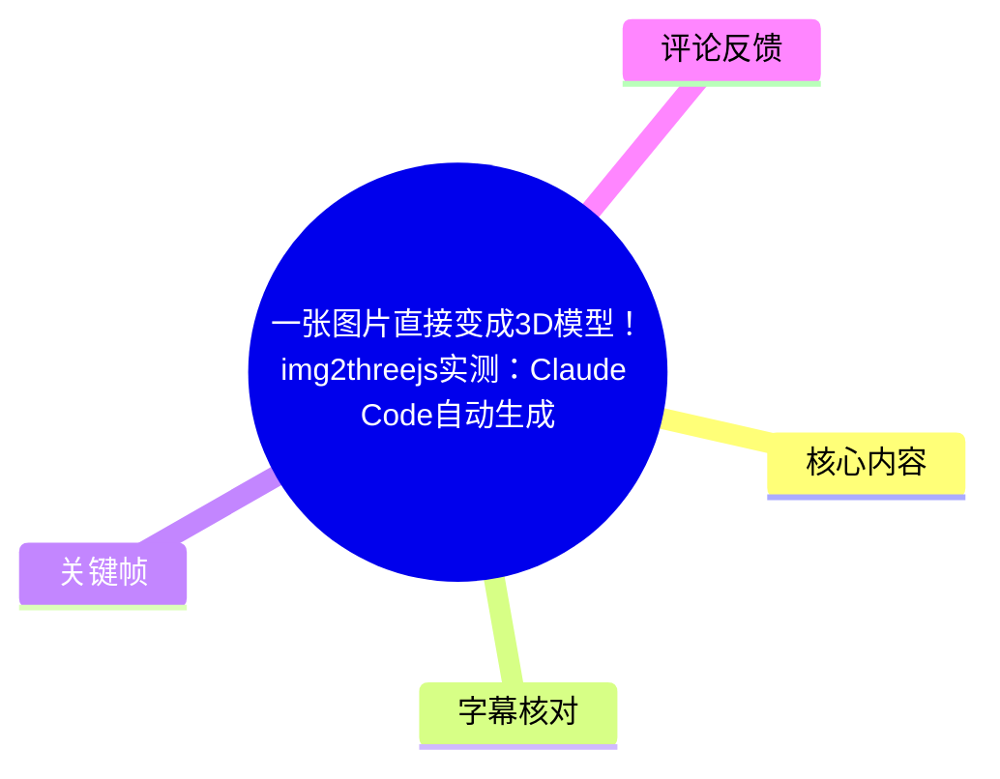
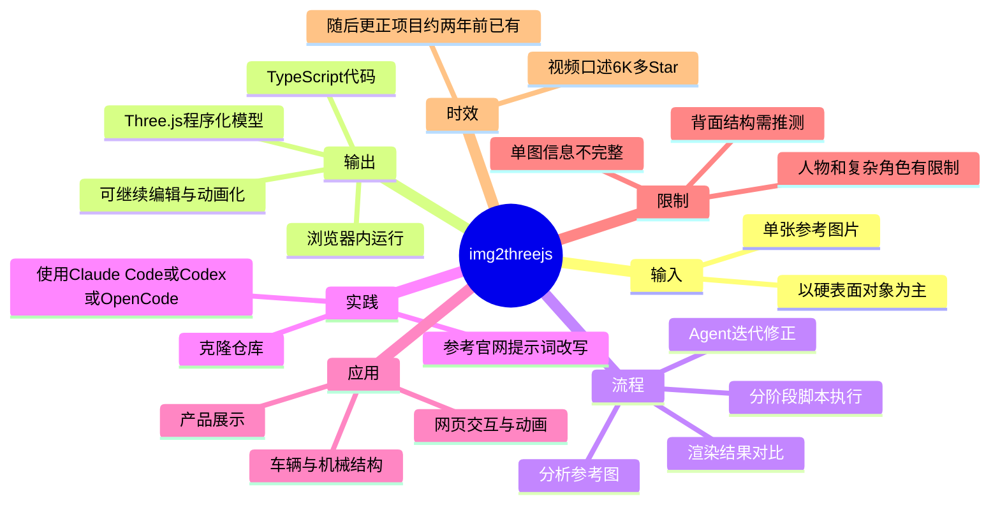
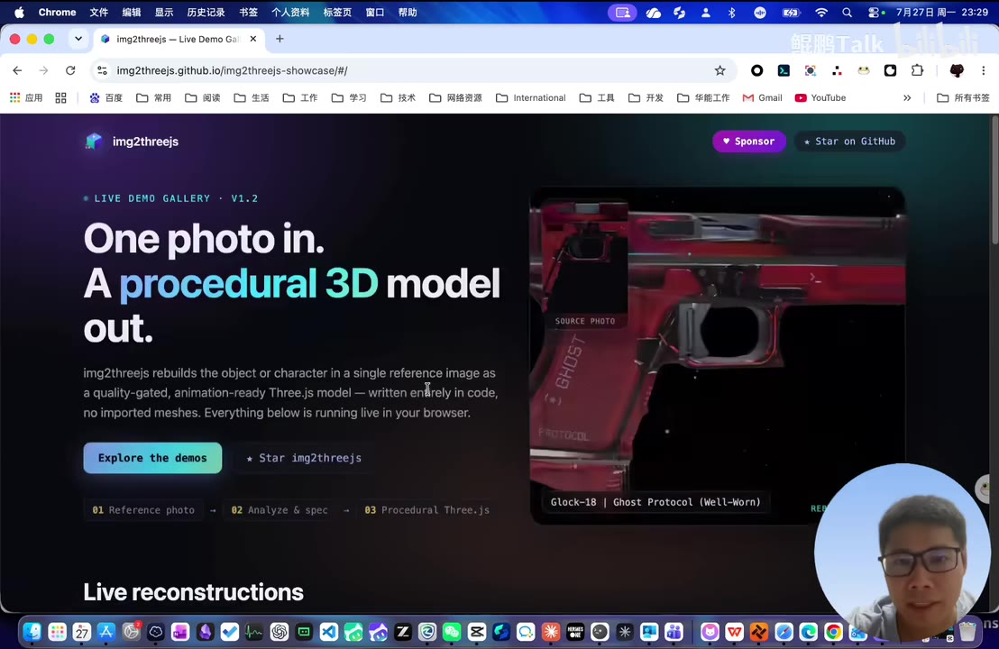
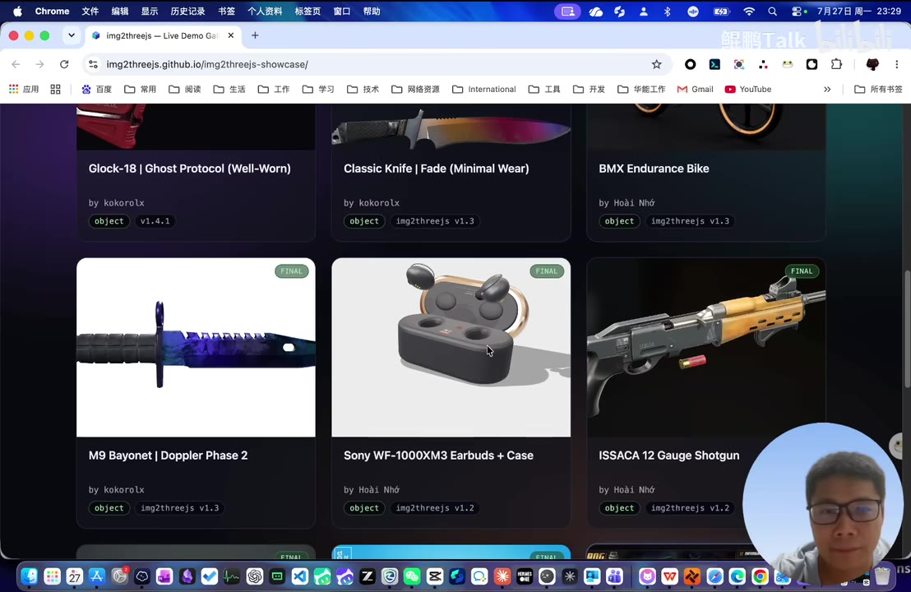
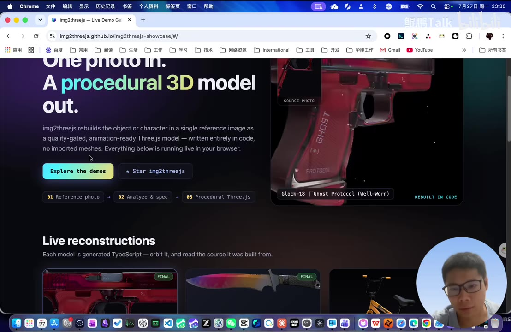
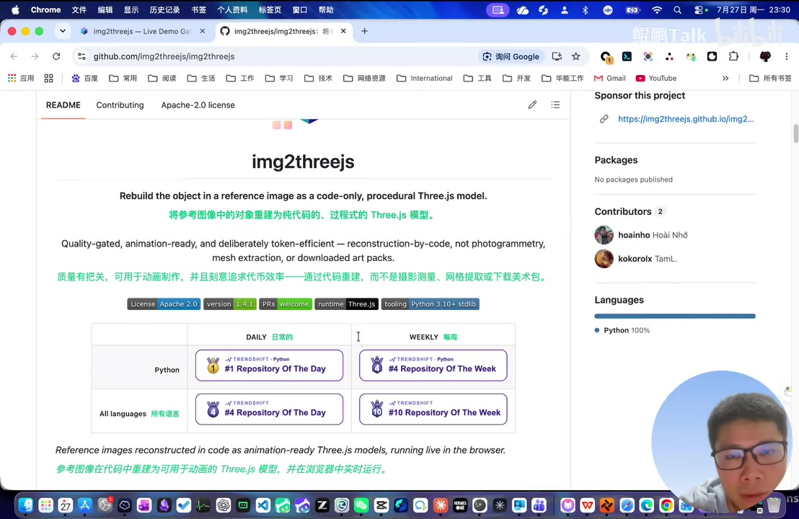

# 一张图片直接变成3D模型！img2threejs实测：Claude Code自动生成可编辑、可动画的Three.js代码

> 来源：[Bilibili 视频](https://www.bilibili.com/video/BV1jv3c6tEjP)  
> UP 主：鲲鹏Talk｜视频时长：3 分 17 秒｜合集：AIcode  
> 数据抓取时统计：2,034 播放、167 收藏、51 点赞、31 分享、3 条回复。

## 小结

视频介绍开源项目 **img2threejs**：输入一张参考图，由 Agent 生成可在浏览器运行的 Three.js / TypeScript 程序化模型代码。它的目标不是输出一个难以继续编辑的静态网格，而是将对象以基础几何、程序化材质和生成式几何等代码形式重建，从而能够继续用于交互、动画和网页 3D 开发。

UP 主先展示了官网的耳机、刀具、枪械、自行车等案例，并指出这类效果可用于具有动态展示感的网站。画面中的项目官网明确写有“One photo in. A procedural 3D model out.”，并将流程概括为“参考图 → 分析与规格 → Procedural Three.js”。

视频所述工作流是分阶段迭代：脚本控制每一阶段，Agent 根据渲染结果与参考图的对比持续修正。项目简介补充，这些阶段可涵盖结构搭建、形体优化、材质、表面细节、灯光、交互及性能优化；最终模型还可带有节点、旋转轴、连接点、碰撞体等运行时结构。视频本身没有展示完整命令行输出或代码，因此不能据此复原精确命令与默认参数。

实践入口是：克隆仓库，在 Claude Code、Codex 或 OpenCode 一类代码 Agent 环境中运行项目脚本，再利用官网示例提示词按自己的素材改写。ASR 中将 Claude Code 误识别为“Cloud Code”，且说法一度偏向“主要靠 Codex”；应以视频标题、简介及画面中的项目说明为准，不应把工具支持范围缩减为仅 Codex。

适合希望把产品外观、机械结构、道具、耳机、车辆或网页展示素材转换为**可编辑 Web 3D 代码**的开发者和设计技术人员。单视图无法提供背面与遮挡面信息，系统只能推测；人物与复杂角色也存在还原限制。UP 主关于“项目很新”“6K 多 Star”的口述随后自行更正：项目约两年前已有，相关热度和 Star 数均属于视频录制时的时点信息，不能视为当前值。

## 思维导图

## 目录

- [项目定位：从参考图到代码化 Three.js 模型](#项目定位从参考图到代码化-threejs-模型)
- [官网案例与可见的技术特征](#官网案例与可见的技术特征)
- [重建机制：分阶段脚本与 Agent 质量控制](#重建机制分阶段脚本与-agent-质量控制)
- [实践路径：克隆仓库、调用 Agent、改写提示词](#实践路径克隆仓库调用-agent改写提示词)
- [应用经验：网页动态展示与输入素材选择](#应用经验网页动态展示与输入素材选择)
- [限制、口述更正与时效性](#限制口述更正与时效性)
- [关键帧索引](#关键帧索引)
- [字幕比对](#字幕比对)
- [评论分析](#评论分析)
- [处理记录](#处理记录)

## 项目定位：从参考图到代码化 Three.js 模型 [00:00](https://www.bilibili.com/video/BV1jv3c6tEjP?t=0)

UP 主将 img2threejs 描述为可将图片“一键”变成 3D 图形的工具。结合视频标题、项目简介和官网画面，较准确的理解是：它以一张参考图片为输入，生成以代码表达的程序化 Three.js 模型，而非仅生成传统的不可编辑网格资产。

画面中项目主页的说明为：

- **“One photo in. A procedural 3D model out.”**
- 将单张参考图中的对象或角色重建为可进行质量控制、可用于动画的 Three.js 模型；
- 模型“entirely in code”，即完全由代码写成；
- 不依赖导入网格（“no imported meshes”），并在浏览器中实时运行；
- 页面流程标签为：`01 Reference photo → 02 Analyze & spec → 03 Procedural Three.js`。

这解释了它与常见“图片转网格”方案的差别：产物侧重于可读、可改、可组合进 Web 应用的工程代码。项目简介进一步称，模型可以包含旋转轴、连接点和碰撞体等运行时结构；这些结构意味着后续可开发动画和交互，但视频没有逐项演示其生成质量，实际项目仍需验证。

> 图：官网首页直接呈现“单张照片输入、程序化 3D 模型输出”及三段式流程。这张图用于确认项目定位与流程名称，避免仅依据 ASR 中误识别的“Image to 3GS”判断项目名称。

## 官网案例与可见的技术特征 [00:17](https://www.bilibili.com/video/BV1jv3c6tEjP?t=17)

UP 主首先展示耳机案例，并将其与网站中的动态、炫酷展示效果联系起来。随后展示页中还可见多种对象案例，包括：

- `Glock-18 | Ghost Protocol (Well-Worn)`；
- `Classic Knife | Fade (Minimal Wear)`；
- `BMX Endurance Bike`；
- `M9 Bayonet | Doppler Phase 2`；
- `Sony WF-1000XM3 Earbuds + Case`；
- `ISSACA 12 Gauge Shotgun`。

这些案例的共同点是轮廓、结构件和材质分区较明确，属于视频简介所说更值得尝试的硬表面对象。它们说明项目并不局限于耳机，但不构成“任何图片均可高保真重建”的证明。

展示页还出现“FINAL”标记和对象版本标签，例如 `v1.4.1`、`img2threejs v1.3`、`img2threejs v1.2`。这些是**画面中案例卡片的标记**，不能据此推断当前仓库的最新版本、安装版本或 API 兼容性。

> 图：案例列表同时覆盖耳机、刀具、枪械和自行车，直观支撑视频关于“可处理多种外观与硬表面对象”的演示性结论；图中版本标签仅代表当时页面显示。

> 图：首屏右侧将来源照片与代码重建结果并置，可用于理解“参考图—重建模型”的对照关系，而非将生成结果误解为直接贴图的 2D 展示。

## 重建机制：分阶段脚本与 Agent 质量控制 [01:09](https://www.bilibili.com/video/BV1jv3c6tEjP?t=69)

根据 UP 主在 01:09—01:18 的说明，img2threejs 的核心不是单次生成，而是“分阶段”执行：**每个脚本控制一个阶段，由 Agent 判断当前实现结果**。视频简介补全了这一过程可能涉及的阶段：

1. **结构搭建**：先建立主要部件与整体比例；
2. **形体优化**：对轮廓、厚度、连接关系等继续修正；
3. **材质处理**：用程序化材质描述表面视觉；
4. **表面细节**：补充可见的局部结构与细节；
5. **灯光**：调整渲染条件以进行视觉对比；
6. **交互与性能优化**：为浏览器内运行及后续交互做处理。

每完成阶段，系统将渲染结果与原参考图对比；若不符合要求，再自动修改。这里的“符合要求”是 Agent 基于图像与任务提示作出的判断，并不等同于具有完整三维真值的几何测量。因此，应把它视为面向视觉近似和可编辑性的迭代建模流程，而不是严格的摄影测量或真实尺寸还原。

视频约 01:32—01:44 没有可用语音转写内容，随后直接进入用户渲染效果展示。该段不应据空白擅自补充具体的模型生成步骤。

## 实践路径：克隆仓库、调用 Agent、改写提示词 [01:20](https://www.bilibili.com/video/BV1jv3c6tEjP?t=80)

视频提供的是高层操作路线，而非可逐字复制的安装教程：

1. **准备参考图**：选择主体明确、清晰度较高、主要结构可见的图片。UP 主后续以高清汽车照片为例。
2. **克隆项目仓库到本地**：视频明确提到“把这个仓库克隆到本地”，但未给出仓库 URL、Git 命令、分支或依赖安装命令。
3. **在代码 Agent 中执行项目脚本**：视频口述提及 Claude Code（ASR 误写为“Cloud Code”）和 Codex；视频简介还明确列出 OpenCode。因此，依据本素材可确认的支持范围为 Claude Code、Codex、OpenCode。
4. **让 Agent 按阶段重建并检查结果**：每一阶段产生渲染结果，再由 Agent 决定是否修改。
5. **复用并改写官网提示词**：UP 主称官网提供示例和提示词，可拿来改写后交给自己的 Agent；其目的是在已克隆的仓库中生成自己的效果图或模型效果。
6. **在网站中引入和渲染结果**：将生成的 Three.js 效果纳入网页，作为动态展示或后续交互开发的基础。

项目 GitHub README 的画面还显示以下环境相关信息：

| 画面可见字段 | 可确认含义 | 不应过度推断的部分 |
| --- | --- | --- |
| `runtime Three.js` | 项目运行时涉及 Three.js | 未展示锁定的 Three.js 具体版本 |
| `tooling Python 3.10+ stdlib` | 页面标示工具侧与 Python 3.10+ 标准库有关 | 不足以替代完整安装文档或依赖清单 |
| `Languages Python 100%` | 当时 GitHub 语言统计显示 Python 100% | 不代表输出一定不是 TypeScript；官网另称每个模型由 TypeScript 生成 |
| `Apache-2.0` | 页面可见 Apache-2.0 许可证标识 | 具体使用、署名和分发要求仍应以仓库完整 LICENSE 为准 |

> 图：README 画面显示“代码方式重建”、Apache-2.0、Three.js 运行时与 Python 3.10+ tooling 等标记，为实践前的环境核对提供依据；它并未展示安装命令，因此正文不虚构命令。

## 应用经验：网页动态展示与输入素材选择 [02:06](https://www.bilibili.com/video/BV1jv3c6tEjP?t=126)

UP 主以汽车为例说明应用方式：拍摄一张高清汽车照片，交给工具生成效果，再在网站中引入、渲染，从而得到动态的车辆展示。他还提出人物可作为输入，并设想让人物跟随鼠标移动、完成不同动作。

这里需要区分两个层次：

- **视频已经展示或明确描述的能力**：单图参考、代码化 Three.js 重建、在浏览器中运行、适用于互动网页的后续开发。
- **UP 主提出的应用设想**：汽车网页展示、人物跟随鼠标及不同动作。这些是可能的开发方向，不代表视频已演示所有动画控制、骨骼绑定或角色动作生成的完整效果。

可迁移的实践经验是，先让输入素材与工具的优势匹配：

- 优先采用主体突出、边界清晰、遮挡较少的单物体图；
- 对车辆、耳机、机械件、产品外观等硬表面题材，可先用案例思路建立预期；
- 对要在网页中互动的内容，应在验收中单独检查旋转、节点关系、碰撞体、加载性能与移动端表现；
- 如果网页展示依赖真实尺寸、完整背面或机械可动性，必须人工复核，不能仅因正面渲染相似就直接上线。

## 限制、口述更正与时效性 [02:30](https://www.bilibili.com/video/BV1jv3c6tEjP?t=150)

### 单图重建的固有限制

视频简介明确指出：单张图片看不到的背面结构，需要由 AI 推测；人物和复杂角色的还原效果也有一定限制。这是本项目使用时最重要的边界。

单一视角同时缺失物体背部、内侧、被遮挡处、真实厚度、精确尺度和材质物理参数等信息。即使正视图渲染效果令人满意，也不能将模型自动视为：

- 完整且真实的工业结构；
- 可用于精确测量、制造或安全验证的 CAD 数据；
- 已完成绑定、动画或物理配置的角色资产；
- 无需审查即可投入生产的网页组件。

### 口述热度更正与信息时点

UP 主在 02:30 先称该技术“比较新”、项目已有“6K 多 Star”，但在 02:39 立即更正：项目“两年前就有了”，并对时间判断表示不确定。故应保留以下结论：

- “两年前已有项目”是 UP 主自行修正后的口述信息；
- “6K 多 Star”仅为视频录制时的说法，未在提供材料中获得可复核的实时仓库数据；
- 视频页面的发布时间、抓取时的播放与互动数据、案例页面版本号都会随时间变化；
- 使用前应直接查看当前仓库 README、Release、Issue、License 及所用 Agent 的兼容说明。

## 关键帧索引 [00:17](https://www.bilibili.com/video/BV1jv3c6tEjP?t=17)

| 关键帧 | 正文用途 | 画面价值 |
| --- | --- | --- |
|  | 官网案例与适用对象 | 同屏展示耳机、刀具、枪械和自行车，便于界定案例覆盖范围。 |
|  | 项目定义与流程 | 清楚显示“单图输入—程序化模型输出”及三步流程。 |
|  | 参考图与重建结果的关系 | 展示来源照片和重建结果的并置，解释该工具的视觉对照目标。 |
|  | 环境与许可证核对 | 提供 Apache-2.0、Three.js、Python 3.10+ 等画面证据。 |

> 素材清单列出 `frame-001.jpg` 至 `frame-012.jpg`，本整理仅选用已提供画面中信息清晰、且能直接支撑正文论点的前四帧；其余帧未在当前素材中附带可识别画面，不据此臆测内容。

## 字幕比对 [00:00](https://www.bilibili.com/video/BV1jv3c6tEjP?t=0)

| 字幕来源 | 完整性 | 专有名词 | 时间轴 | 主要问题 |
| --- | --- | --- | --- | --- |
| Bilibili 站内字幕 | 未提供可用字幕 | 无法核验 | 无法使用 | 素材记录显示字幕工具因 `Invalid URL` 退出，未获得站内字幕文件。 |
| 本次 ASR 字幕 | 12 段、语音覆盖约 149.56 秒，占全片约 76.14% | 存在多处误识别 | 可用；带毫秒级起止时间 | 约 01:32—01:44 存在 12.04 秒大间隔；部分术语和语句不准确。 |

本次 ASR 使用 `large-v3-turbo`，识别语言为中文，语言置信度 `0.9970703125`；检测到音频并成功转写，诊断中**未标记** `noAudioStream=true`。因此，本整理以带时间轴的 ASR 为章节定位依据，并结合视频标题、简介和关键帧对明显术语错误进行校正。

重要校正如下：

| ASR 表述 | 采用表述 | 校正依据 |
| --- | --- | --- |
| “Image to 3GS”“类裤” | `img2threejs` | 视频标题、标签、官网与 GitHub 页面均显示项目名。 |
| “Cloud Code” | `Claude Code` | 视频标题与简介明确写为 Claude Code。 |
| “3.js” | `Three.js` | 官网、README 和视频标题均使用 Three.js。 |
| “一锦把这个提示词复制过去” | 可复用官网提示词并按需求改写 | 结合 02:49—03:03 的上下文整理，保留原意但不把 ASR 口误当原词。 |
| “项目刚出来没多久” | UP 主随后更正为约两年前已有 | 02:39—02:46 的自我更正优先级更高。 |

ASR 时间轴可直接使用，但其语义并非逐字可靠；例如 02:06—02:30 中人物输入与鼠标动作的表述，宜理解为 UP 主的应用设想，而不是已被画面完整验证的功能清单。

## 评论分析 [02:49](https://www.bilibili.com/video/BV1jv3c6tEjP?t=169)

仅获取到 2 条热评，少于“热评前三条”的上限；不对未获取的第 3 条补写或推断。

1. **26650xtx（1 赞）**：“放个奶蛙这种没见过的看他推理出来啥样”  
   - 观点：希望用训练数据中可能较少见的对象测试系统的推理与泛化能力。  
   - 价值：该建议触及单图重建的关键评估点——模型是否真正理解结构，还是主要复现常见物体先验。  
   - 可信度边界：这是测试建议，不是该项目已经在该对象上获得效果的证据。

2. **AI_高兴就好-_-（0 赞）**：“可以部署上线吗”  
   - 观点：关注生成结果能否用于生产部署。  
   - 价值：与视频强调的 Three.js 代码、浏览器运行和网页交互方向高度相关。  
   - 可信度边界：素材中没有 UP 主回复，也没有部署文档、构建配置、性能指标或许可证细则，不能据此确认可以直接生产上线。上线前至少应自行验证构建、资源体积、首屏性能、浏览器兼容性、错误处理和许可合规。

## 处理记录 [00:00](https://www.bilibili.com/video/BV1jv3c6tEjP?t=0)

- **Worker ID**：`worker-mrj0www4-e8d79408`
- **整理模型**：`gpt-5.6-terra`
- **ASR 模型**：`large-v3-turbo`，设备 `cuda`，计算类型 `int8_float16`，自动识别为中文。
- **使用素材与工具产物**：视频元数据、音频 `audio/audio.wav`、ASR 结果 `asr/asr-result.json`、时间轴字幕 `asr/transcript.srt`、关键帧目录 `frames/`、评论文件 `comments/comments.json`。
- **字幕选择**：未获得可用 Bilibili 站内字幕；已检查本次 ASR，采用其带时间戳的分段定位。根据标题、简介、关键帧和上下文校正 `img2threejs`、Claude Code、Three.js 等误识别词。
- **关键帧选择依据**：选取 `frame-001.jpg` 至 `frame-004.jpg`，因为其分别直接呈现案例范围、项目主张与流程、参考图/重建图对照、README 中的许可证与环境标识；未对未附画面的其余帧作内容推断。
- **评论处理范围**：按“仅处理可获取热评前三条”要求，仅分析实际获取到的 2 条，不将评论视为已验证事实。
- **缓存清理**：提供的素材与执行记录未包含缓存清理日志；未对清理结果作无依据声明。
- **未解决问题**：缺少站内字幕、完整仓库安装文档、实际生成代码、部署记录及当前实时 Star/版本信息；因此未给出未被视频或画面证实的命令、性能参数或上线结论。

## 评论分析

- 热评 1：放个奶蛙这种没见过的看他推理出来啥样
- 热评 2：可以部署上线吗

以上内容是观众反馈摘录，只用于补充理解视频反响，不作为正文事实依据。
