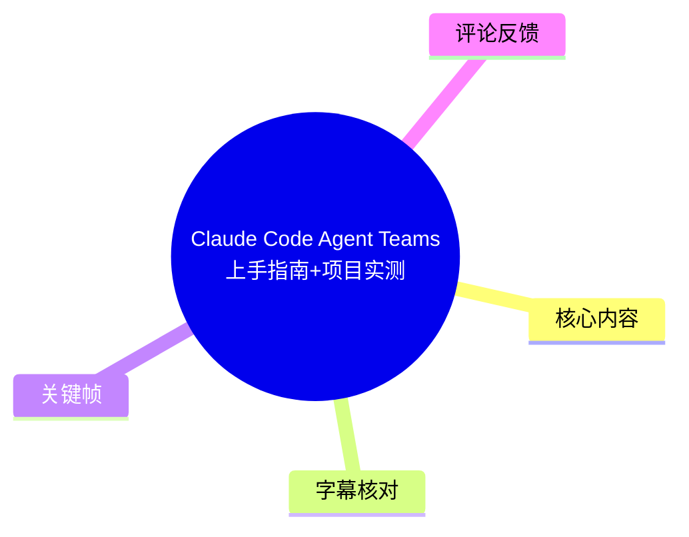
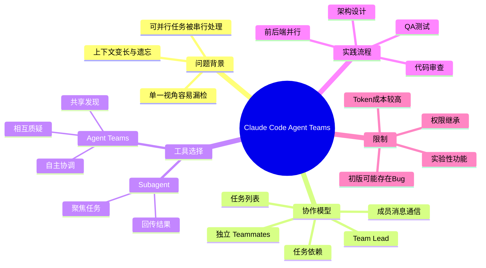
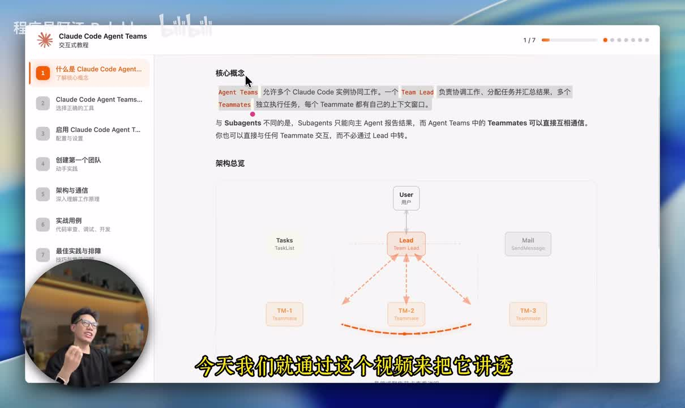
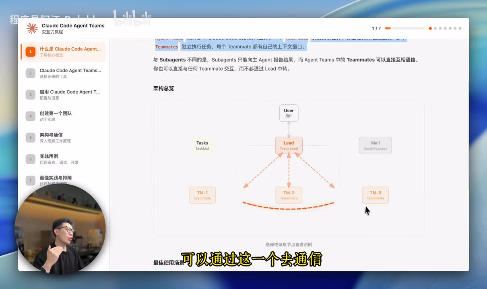
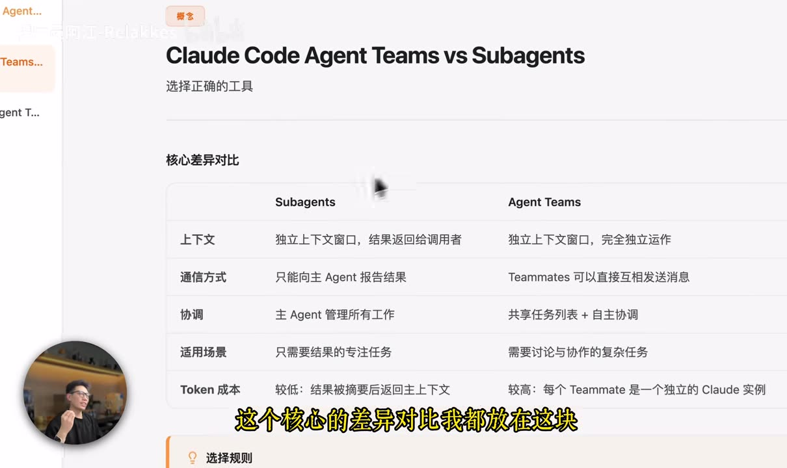
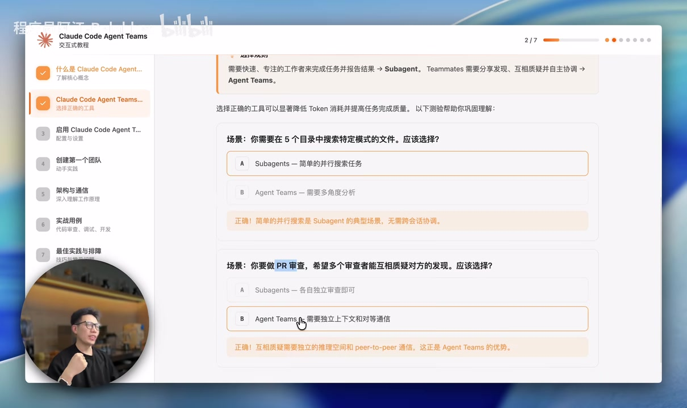

# Claude Code Agent Teams上手指南+项目实测

> 来源：[Bilibili 视频](https://www.bilibili.com/video/BV1gwcAzkEhw)  
> UP 主：程序员阿江-Relakkes｜时长：10:07｜合集：AIcode  
> 数据抓取时视频数据：播放 34,854、收藏 1,486、点赞 533、评论 96、投币 261、分享 222。以上统计会随时间变化。

## 小结

视频围绕 Claude Code 的 **Agent Teams** 展开：它以一个 Team Lead（团队负责人）为调度中心，派生多个独立的 Claude Code 实例作为 Teammates（成员），通过共享任务列表、任务依赖和消息机制，完成并行开发与协作。

作者将其定位为解决单 Agent 处理复杂任务时的三个结构性问题：上下文持续膨胀导致遗忘、可并行任务被串行执行、单一视角容易顾此失彼。适合需要拆解复杂开发任务、并行实施前后端、进行多视角 PR 审查或竞争性排障的 Claude Code 使用者。

关键的选择原则是：**仅需快速完成局部任务并回传结论时，优先 Subagent；需要成员之间共享发现、相互质疑和自主协调时，才选择 Agent Teams。** Agent Teams 并非“多开 Agent 就一定更好”，其独立上下文和多个实例会提高 Token 消耗与协作成本。

实测部分构建了一个五角色团队：架构设计、后端、前端、QA、代码审查。依赖顺序为“架构设计 → 前后端并行 → QA → Review”。作者的实际评价约为 **80 分**：初版并不可直接使用，出现了两个前端 Bug 和一个数据库相关后端 Bug；该测试任务累计消耗约 **3,000 万 Token**。

该功能在视频中被表述为实验性能力，启用前需要配置对应实验功能并确认 Claude Code 为较新版本；但视频未展示可可靠抄录的具体配置键、环境变量名或命令，因此本文不补写不存在的配置。视频发布时间为 2026 年 2 月，功能开关、目录结构、权限行为和模型支持情况均可能已变化，应以使用时的 Claude Code 官方文档和本地版本为准。

## 思维导图





## 目录

- [背景：复杂任务下的单 Agent 瓶颈](#背景复杂任务下的单-agent-瓶颈)
- [Agent Teams 的协作模型与适用场景](#agent-teams-的协作模型与适用场景)
- [Agent Teams 与 Subagent：如何选择](#agent-teams-与-subagent如何选择)
- [启用与并行代码审查演示](#启用与并行代码审查演示)
- [架构、通信、存储和权限](#架构通信存储和权限)
- [真实项目实测：五角色协作流水线](#真实项目实测五角色协作流水线)
- [限制、成本与可迁移经验](#限制成本与可迁移经验)
- [关键帧索引](#关键帧索引)
- [字幕比对](#字幕比对)
- [评论分析](#评论分析)
- [处理记录](#处理记录)

## [背景：复杂任务下的单 Agent 瓶颈](https://www.bilibili.com/video/BV1gwcAzkEhw?t=0)

作者在开场提出，使用 Claude Code 处理复杂任务时，单 Agent 常面临三类问题：

1. **上下文越来越长，前序修改可能被遗忘**  
   长对话与持续编码会拉长上下文；作者将后续忘记前面改动归为单 Agent 的结构性限制，而不只是提示词“写得不够好”。

2. **原本可并行的工作被串行处理**  
   例如前后端工作在架构、API 与数据库文档明确后，理论上可同时推进；如果由单 Agent 顺序执行，会拉长总时长。

3. **单一 Agent 的视角有限**  
   以代码审查为例，若 Agent 专注安全，可能无法同时充分覆盖性能；多角色并行可将安全、性能、测试覆盖等检查维度拆开。

> 作者称 Claude 官方近期发布了 Agent Teams。此处是视频中的工具动态陈述，未在本素材中提供官方公告链接或具体版本号，不能据此推断当前仍处于相同发布状态。



> 图：画面展示“Claude Code Agent Teams”课程页的核心概念及 User → Lead → Teammates 的拓扑。它直观说明 Team Lead 位于调度中心，而成员之间还存在横向沟通路径，是理解后文协作机制的基础。

## [Agent Teams 的协作模型与适用场景](https://www.bilibili.com/video/BV1gwcAzkEhw?t=30)

### 核心组成

Agent Teams 的基本方式是：多个 Claude Code 实例协同工作。

- **Team Lead**：创建团队、拆解工作、创建任务、设置任务依赖、向成员发送任务与上下文，并接收进度和结果。
- **Teammates**：每个成员是独立的 Claude Code 实例，接收 Lead 分派的提示与任务，认领任务、执行并更新状态。
- **共享任务列表**：成员从列表中接取任务，更新执行状态并回填结果。
- **消息系统**：Lead 能与成员沟通；成员之间也能直接发送消息，而不是所有信息都必须经由 Lead 转发。

作者列出的典型适用场景包括：

| 场景 | 为什么适合 Agent Teams |
| --- | --- |
| 研究与审查 | 可让不同成员覆盖不同资料、风险或审查维度。 |
| 新模块开发 | 当模块内存在可拆开的工作面时，可让不同成员分别推进。 |
| 竞争性假设 | 发现 Bug 后，让多个成员提出、反驳和验证不同假设，尝试收敛到可行答案。 |
| 跨层协作 | 架构与接口资料确定后，前后端并行；完成后再衔接测试及后续工作。 |

### 一条开发依赖链

视频给出的常规开发关系为：

1. 完成架构设计；
2. 准备设计文档、API 文档和数据库文档；
3. 前端与后端并行开发；
4. 前后端完成后由测试接续；
5. 测试完成后再进行后续工作，例如代码审查。

这说明“并行”不是无条件的：应先识别依赖边界。架构与接口未稳定时，盲目并行可能只是把协调成本提前。



> 图：画面突出 Lead、多个 Teammate、任务列表和消息组件，且以成员间横向虚线强调点对点沟通。该帧有助于区分“中央调度”与“成员可直接协调”这两个层次。

## [Agent Teams 与 Subagent：如何选择](https://www.bilibili.com/video/BV1gwcAzkEhw?t=111)

视频将两者的关键差异归纳为通信和协作方式。画面中的比较表还补充了上下文、适用场景和 Token 成本等维度。

| 维度 | Subagents | Agent Teams |
| --- | --- | --- |
| 上下文 | 独立上下文窗口，结果返回调用者 | 独立上下文窗口，成员独立运行 |
| 通信方式 | 主要向主 Agent 报告结果 | Teammates 可直接互相发送消息 |
| 协调方式 | 主 Agent 管理所有工作 | 共享任务列表，并允许自主协调 |
| 适用场景 | 只需结果的专注型任务 | 需要讨论与协作的复杂任务 |
| Token 成本 | 画面标示为较低，结果摘要后回到主上下文 | 画面标示为较高，每个 Teammate 是独立 Claude 实例 |

> 表中“较低/较高”是视频课件的相对判断，并未给出统一可复现的成本公式；实际 Token 消耗还会受任务规模、上下文、模型、重试次数和团队规模影响。



> 图：该画面直接展示“Claude Code Agent Teams vs Subagents”的对照表，覆盖上下文、通信、协调、适用场景与 Token 成本，是视频最集中的决策依据。

### 两个选择题对应的决策方法

**案例一：在 5 个目录中搜索特定模式的文件**

- 视频结论：选 **Subagent**。
- 原因：这是简单、可拆分的并行搜索任务，不需要成员之间围绕发现结果持续协商。

**案例二：对一个 PR 做审查，希望多个审查者相互质疑发现**

- 视频结论：选 **Agent Teams**。
- 原因：安全、性能、测试等发现可能相互关联或冲突，需要共享信息、交叉验证和协调结论。

可提炼为一个实用判断：

> 若任务的输出是“独立结果集合”，更接近 Subagent；若任务过程中必须交换中间发现、复核彼此推理、动态改变分工或处理依赖关系，更接近 Agent Teams。



> 图：画面将“搜索文件”标为 Subagents 的典型简单并行搜索任务，将“多人 PR 审查”标为需要独立上下文和对等通信的 Agent Teams 场景，降低了抽象概念的理解门槛。

## [启用与并行代码审查演示](https://www.bilibili.com/video/BV1gwcAzkEhw?t=163)

### 启用前提

视频给出的启用步骤只有操作层级，未展示可精确复用的文本配置：

1. 在相应文件中增加配置，开启 Agent Teams 的**实验性功能**；或使用临时变量开启。
2. 重启 Claude Code 终端。
3. 确认 Claude Code 版本为最新或较新版本。

**重要限制：** 视频没有在字幕或可读关键帧中提供配置文件路径、具体配置项名称、环境变量名称、命令或版本号。为了避免伪造，本文不提供看似可直接执行的命令。实际启用请以所安装版本的官方文档为准。

### 代码审查团队的提示设计

作者以一个包含多个 PR 的代码仓库为例，要求系统创建团队审查某个 PR，并显式指定三个角色：

- 安全检查；
- 性能检查；
- 测试覆盖检查。

演示中，系统创建审查团队并启动 3 个 Agent 并行执行。进入任一 Agent 后可以看到：其本质是一个独立 Claude Code 实例；它接收提示词以及 Lead 发来的消息，然后开始审查对应任务。

作者强调三个审查成员之间可通信，Lead 也能与成员通信。这种结构适合让安全、性能、测试覆盖的发现互相校验，而不是简单地把三份报告机械拼接。

### 自定义团队

在并行审查示例之后，作者补充：

- 可以指定团队里包含哪些成员；
- 每个团队可指定单独模型；
- 因此团队规模、角色和模型并非只能固定为示例中的 3 人。

视频未给出模型选择策略、具体模型名称或角色与模型的映射规则，不能进一步推断“某类角色必须用某模型”。

## [架构、通信、存储和权限](https://www.bilibili.com/video/BV1gwcAzkEhw?t=255)

### 调度与依赖

作者把 Team Lead 描述为负责创建团队主会话的角色，承担以下工作：

1. 派生不同 Teammates；
2. 为成员提供提示词；
3. 创建任务；
4. 指定任务之间的依赖；
5. 在成员完成后接收消息和结果。

成员会自行认领任务、更新状态并执行；如果某任务依赖任务 A，则会等待任务 A 完成，再继续执行。这避免把“可并行”误解成“所有任务同时开始”。

### 任务状态与防重复认领

视频明确任务有 3 种状态：

| 状态 | 含义 |
| --- | --- |
| 待处理 | 任务尚未开始或尚未被认领。 |
| 进行中 | 成员已认领并正在执行。 |
| 已完成 | 工作完成，并已向 Lead 通知结果。 |

为避免多个成员同时认领同一任务，视频称整个过程使用**文件锁机制**控制任务认领。

### 本地存储

视频称团队配置与任务信息均存放在本地文件中，位置位于 `.cloud` 文件夹下。素材未展示完整目录树、文件格式、文件名、锁的实现细节或跨机器协作能力，因此以下事项均不能从视频确认：

- 是否支持远程共享任务状态；
- 是否支持多终端、跨主机或跨仓库协作；
- 文件锁在不同操作系统或网络文件系统上的行为；
- 崩溃恢复、锁超时与冲突处理策略。

### 独立上下文与权限继承

每个 Teammate 有自己的独立上下文，启动时接收 Lead 下发的提示，并据此工作。作者还特别指出：

> 成员会继承 Lead 的权限；如果为 Lead 配置高权限，成员也可能拥有相同权限。

这带来直接的安全含义：Team Lead 的权限配置应遵循最小权限原则。不要因为需要一个成员进行有限操作，就把具有广泛文件、命令或敏感资源访问能力的权限泛化给整个团队。

### UI 重构示例

作者展示一个 UI 重构团队：确定主色调后，多个文件的修改可以并行拆分，例如一个 Agent 负责一组文件，另一个 Agent 负责另一组文件。示例中派生了 4 个成员，其中第一个是领导性质的成员；配置中可看到成员加入时间、Agent ID、名称、类型及所用模型等信息。

该示例说明 Agent Teams 更适合“设计规则已经确定、文件集合之间可分工”的任务，而不是在设计尚不稳定时让所有成员自由改动同一片区域。

## [真实项目实测：五角色协作流水线](https://www.bilibili.com/video/BV1gwcAzkEhw?t=424)

### 1. 建立五人角色分工

作者要求创建一个 5 人 Agent Teams，并指定角色：

1. 架构设计；
2. 后端开发；
3. 前端开发；
4. QA；
5. Review（代码审查）。

系统会自动创建团队、为每个 Agent 分配名称及任务。作者将这个流程类比为传统软件开发过程。

### 2. 建模依赖并先完成架构

Lead 先创建任务并设置依赖。由于设计先行，架构 Agent 率先执行，获得项目背景和关键文件等上下文后开始工作。

此阶段的经验是：**先把依赖显式化，再开并行。** 如果任务的输入尚未准备好，所谓并行只会形成等待或返工。

### 3. 前后端并行开发

架构工作完成后，Lead 启动后端 Agent 和前端 Agent：

- 两者均在各自独立的 Claude Code 实例中工作；
- 都会收到 Leader 下发的任务、背景提示及核心要求；
- 完成后向 Lead 汇报。

作者将其概括为项目经理式工作法：Lead 负责拆任务和分配，前端、后端各自认领开发任务。

### 4. QA 接续测试

在前后端完成后，流程进入 QA：

- QA Agent 接收待测试代码；
- 测试包括**单元测试**与**集成测试**；
- 完成后标记任务完成，并将结果告知 Lead。

需要注意的是，“QA 表示结果非常好”仅是演示中 Agent 的汇报，并不等同于独立验证后的质量结论；后续作者也承认项目仍有 Bug。

### 5. 启动代码审查

Lead 收到 QA 完成消息后，继续创建 Review Agent 做代码审查。该 Agent 同样是新启动的 Claude Code 实例。

整个依赖链可概括为：

```text
架构设计
   ↓
前端开发 ──┐
           ├→ QA（单元测试、集成测试） → Code Review
后端开发 ──┘
```

### 实测结果与参数

作者对本次实测的总体评价：

| 项目 | 视频中的结果 |
| --- | --- |
| 总体完成度 | 约 80 分 |
| 初次可用性 | 不是一次即可用 |
| 前端问题 | 2 个 Bug |
| 后端问题 | 1 个与数据库相关的 Bug |
| Token 消耗 | 测试该任务共约 3,000 万 Token |

这组结果表明，多 Agent 协作能组织并行工作，但不自动保证一次成功或消除集成问题。尤其在多实例、多角色反复沟通与测试时，Token 成本可能显著上升。

## [限制、成本与可迁移经验](https://www.bilibili.com/video/BV1gwcAzkEhw?t=585)

### 视频已体现的限制

1. **功能具有实验性质**  
   作者明确将启用项称为实验性功能。配置方式、行为与稳定性可能变化。

2. **并行不等于无依赖**  
   架构设计完成后，前端与后端才适合并行；QA 依赖开发结果；Review 又在测试之后启动。

3. **初版结果并不稳定**  
   实测出现前端和数据库相关问题，说明流程中仍需人工或额外 Agent 验证。

4. **Token 成本很高**  
   视频给出的实测为约 3,000 万 Token，且课件明确标注 Agent Teams 的成本相对高于 Subagents。

5. **权限会继承**  
   赋予 Lead 的高权限可能传递给成员，团队规模扩大也同步扩大了高权限操作面。

6. **配置细节不足**  
   视频没有展示可验证的配置键、命令和版本号，不能把其操作口述当成完整部署指南。

### 可迁移的实践清单

- **先判断是否真的需要团队。** 只要结果、不需要协商时，采用 Subagent，避免不必要的多实例成本。
- **按依赖拆分，不按角色名盲拆。** 只有输入边界稳定、文件或职责可隔离的任务适合并行。
- **为每个成员定义明确交付物。** 例如安全审查输出风险清单，性能审查输出瓶颈与证据，QA 输出测试范围、结果和失败项。
- **把汇合点设为显式任务。** 前后端完成不代表系统完成，应有集成、测试和审查的后续关卡。
- **限制 Lead 权限。** 因成员继承权限，团队启动前应缩小可访问目录、命令和敏感资源范围。
- **把 Token 作为预算项。** 多成员、长上下文、反复重试与交叉讨论会累计成本；先做小规模试运行再扩展团队。
- **对“完成”做独立验证。** Agent 标记完成或自称结果良好，不应替代真实测试、人工审查与部署前验证。

## 关键帧索引

| 关键帧 | 对应内容 | 价值 |
| --- | --- | --- |
|  | Agent Teams 总体拓扑 | 展示 User、Lead、Teammates 的基本层级。 |
|  | 任务与消息通信 | 强调 Lead 调度和成员间直接通信并存。 |
|  | Teams 与 Subagents 对照 | 集中呈现上下文、通信、协调、场景与 Token 成本差异。 |
|  | 工具选择场景 | 用“搜索文件”和“多人 PR 审查”将选择规则落地。 |

## 字幕比对

| 字幕来源 | 完整性 | 专有名词 | 时间轴 | 主要问题 |
| --- | --- | --- | --- | --- |
| Bilibili 站内中文字幕 `p01-ai-zh.srt` | 覆盖 00:00:00.080–00:10:06.260，分段完整 | 存在口语识别误写，如“CLCODE”“Cloud Code”“A 镜”等；可结合画面校正为 Claude Code、Agent | 分段细，且与全片时长吻合 | 少量口语错字与词语截断，例如“最后再旅游代码”实际语义为 Review 代码。 |
| 本次 ASR（medium，zh） | 诊断显示语音覆盖 571.99 秒、覆盖率 94.35%，无大间隙告警 | 可识别 Claude/Cloud Code、Agent Teams、QA、Review 等主体，但乱码和近音错词较多 | 有时间戳，但首段从 00:00:23.100 开始，与站内字幕和画面开场不一致；多个长段落过度聚合 | 多处错字、乱码、近音替换，如“任劳”“文件所”“科威”“clock code”；不适合作为主要逐句依据。 |

### 最终字幕选择与校正方式

- **主依据：** 站内中文字幕 `p01-ai-zh.srt`。其时间轴从 00:00:00.080 开始，分段细致，适用于章节链接。
- **交叉检查：** 本次 ASR 已完成检查，语言识别为中文，置信度 `0.9990234375`，且 `asr-result.json` 未标记 `noAudioStream=true`，说明源视频存在音轨；ASR 的价值主要在于确认内容主线与后半段实测信息。
- **多模态校正：** 关键帧课件标题明确显示 “Claude Code Agent Teams”“Claude Code Agent Teams vs Subagents”；据此将站内字幕中的“CLCODE / Cloud Code / A 镜”等不稳定转写，统一按画面与上下文写作 **Claude Code、Agent、Agent Teams、Subagent**。
- **未采用 ASR 首段时间作为链接依据：** ASR 第一个片段从 23.1 秒开始，然而站内字幕和画面均在开头已有连续内容；因此章节时间轴优先使用站内 SRT 的真实分段时间。

## 评论分析

以下仅分析可获取的热评前三条；评论观点不构成已验证事实。

1. **搞事情的三角｜39 赞**  
   观点是：如果 Agent Teams 真正成熟，且 Agent 间沟通不陷入死循环、分工足够明确，用户可能只需向顶层 Agent 提需求，系统即可迭代收敛。  
   - 有价值的补充：指出了多 Agent 的两个核心前提——**避免通信循环**与**细化分工**。  
   - 可信度边界：属于对未来工作方式的期待，不是对工具当前稳定性或效果的实测证明。

2. **一键AI笔记侠｜12 赞**  
   评论内容以“Claude Code Agent Teams 功能解析与应用实践”为标题，并重复概括单体 Agent 的问题和功能主题，但提供内容在素材中被截断。  
   - 有价值的补充：无明显新增事实，更像摘要式评论。  
   - 可信度边界：由于正文不完整，不能从中推导额外结论。

3. **无影｜8 赞**  
   观点是：串行任务不应使用 Agent Teams，例如“创建代码后再审查代码”；真正适合 Team 的是可并行工作，如同时进行前端渲染与后端开发。  
   - 有价值的补充：与视频“先架构、再前后端并行、后 QA 和 Review”的依赖链一致，强调不要为了多 Agent 而多 Agent。  
   - 争议与边界：即便代码审查位于开发之后，审查本身仍可能拆成安全、性能、测试覆盖等并行视角；因此应区分“阶段之间串行”与“阶段内部是否可并行”。

## 处理记录

- **Worker ID：** `worker-mrj0wbly-5dc4e50c`
- **整理模型：** `gpt-5.6-terra`
- **ASR 模型：** `medium`，语言识别为 `zh`，设备 `cuda`，计算类型 `float16`
- **使用素材与工具产物：**
  - Bilibili 元数据与视频统计；
  - 站内多语种 SRT，其中以 `p01-ai-zh.srt` 为主；
  - 本次 ASR 结果 `asr/asr-result.json`、`asr/transcript.srt`；
  - 关键帧目录 `frames/`；
  - 热评文件 `comments/comments.json`。
- **字幕选择：** 以站内中文字幕作为章节时间轴和主要文字依据；对本次 ASR 进行了完整性、语言、起止时间与专有名词检查。未发现 `noAudioStream=true` 标记，故按“存在音轨”的正常 ASR 场景处理。
- **关键帧依据：** 选择 `frame-001`、`frame-002`、`frame-003`、`frame-004`，原因分别是它们清晰展示核心拓扑、通信机制、Teams/Subagents 对比表与工具选择题；均直接服务于正文概念与决策部分。
- **缓存清理：** 未提供可执行的缓存清理日志或目录操作结果；本文未声称已删除原始音视频、帧图或字幕缓存。
- **未解决问题：**
  - 视频未给出可可靠抄录的 Agent Teams 配置键、环境变量名、命令、版本号或官方文档链接；
  - `.cloud` 下的具体存储格式、文件锁实现与跨机器协作行为未在素材中确认；
  - 3,000 万 Token 为作者单次实测陈述，不可直接外推到所有项目。
