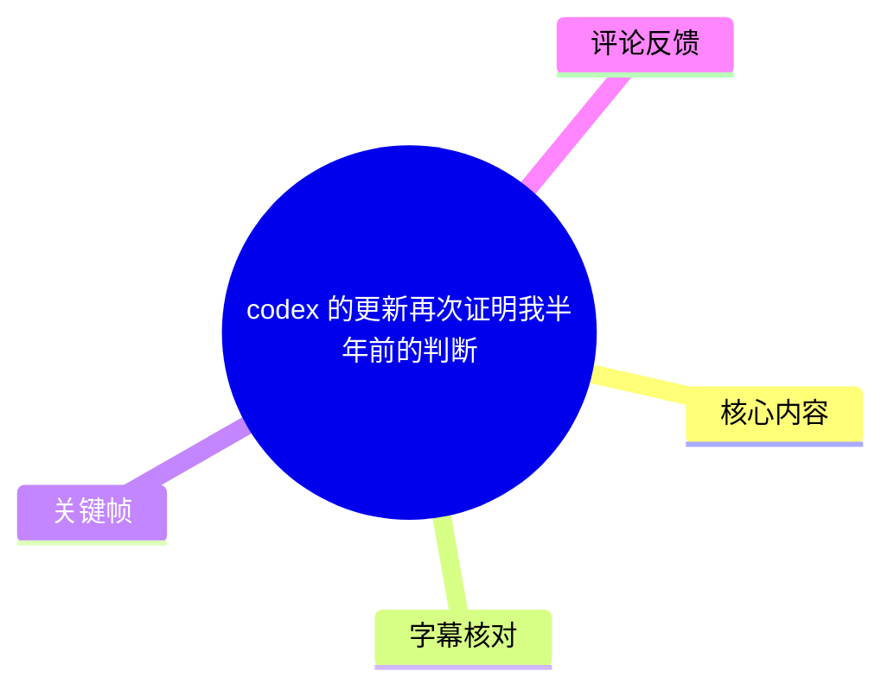
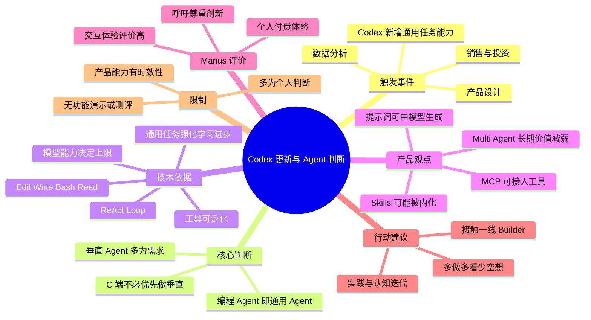

# codex 的更新再次证明我半年前的判断

> 来源：[Bilibili 视频](https://www.bilibili.com/video/BV1PA7R6rEE6)<br>
> UP 主：光头不砍树｜发布时间：2026-06-04｜视频时长：06:56｜分辨率：3840×2160  
> 注：视频元数据中的标签为“音乐、美食、喵星人”，与实际口述内容不匹配；本文以视频字幕、ASR 与画面为准。

## 小结

视频围绕一次 Codex 更新展开。UP 主称，Codex 已新增数据分析、销售、投资、产品设计等能力；这让他认为自己在视频发布前约半年的判断得到印证：**编程智能体正在走向通用智能体，而面向 C 端的“垂直智能体”并不一定具备长期独立价值。**

他的主要技术论据是：Coding Agent 与通用 Agent 在工具层和执行框架层高度相似。`Edit`、`Write`、`Bash`、`Read` 等代码代理常见工具可迁移至非编程场景；核心执行方式 `ReAct Loop` 也并非专属于编程。UP 主据此认为，决定 Agent 能力边界的关键并非框架本身，而是底座模型能力及通用任务强化学习的进展。

在产品判断上，视频提出三个带有鲜明立场的观点：其一，垂直 Agent 的差异主要来自工具与提示词，但工具可经 MCP 接入、提示词也可由模型生成；其二，重要的 Skills 会逐渐被模型内化，个性化且缺乏普适需求的 Skills 则未必有价值；其三，随着模型能力趋同，多 Agent 或 Agent Team 所依赖的“角色能力差异”可能缩小，长期价值会减弱。

视频还高度评价 Manus（字幕与 ASR 均识别为“minus”，结合上下文校正为 Manus）：UP 主以付费用户身份表示，Manus 在“去年 6 月”已能实现当下 Codex App、Kimi Agent、MiniMax Agent 等产品的部分效果，且其交互体验在其个人使用过的 AI 产品中最佳。这是个人体验与产品判断，视频没有给出可复现实验、横向测评指标或官方能力资料。

对 AI 从业者，UP 主给出两条经验建议：少受脱离一线实践的活动与课程影响，多与一线 Builder 交流；并通过“多做、多看、少空想”的实践—认知—再实践循环更新判断。视频适合关注 Agent 产品形态、模型能力演进和 AI 创业方向的人阅读，但不应把其中关于垂直 Agent、Skills、Multi-Agent 的判断视为已被实证的行业定论。

**时效性与限制：**视频发布于 2026-06-04，讨论的是该时点的 Codex、Manus、Kimi Agent、MiniMax Agent 等产品状态。AI 产品迭代极快，能力比较和“长期价值”判断均可能随模型、工具协议、成本及用户需求变化而失效；视频没有演示 Codex 更新功能，也未展示配置、价格、基准测试或实际工作流。

## 思维导图





## 目录

- [背景：Codex 更新与半年前的判断](#背景codex-更新与半年前的判断)
- [编程智能体为何会走向通用智能体](#编程智能体为何会走向通用智能体)
- [垂直智能体的差异、MCP 与提示词](#垂直智能体的差异mcp-与提示词)
- [Skills 与 Multi-Agent 的长期价值判断](#skills-与-multi-agent-的长期价值判断)
- [对 Manus 的个人评价与行业态度](#对-manus-的个人评价与行业态度)
- [给 AI 从业者的实践建议](#给-ai-从业者的实践建议)
- [可执行的判断框架与适用边界](#可执行的判断框架与适用边界)
- [结论与限制](#结论与限制)
- [字幕比对](#字幕比对)
- [评论分析](#评论分析)
- [处理记录](#处理记录)

## [背景：Codex 更新与半年前的判断](https://www.bilibili.com/video/BV1PA7R6rEE6?t=0)

### 更新触发点与原始预测 [00:00:00](https://www.bilibili.com/video/BV1PA7R6rEE6?t=0)

UP 主开场称自己当天很疲惫，但看到 Codex “更新了很多新的能力”后仍决定录制视频。按其列举，新增或被其关注的能力覆盖：

- 数据分析；
- 销售；
- 投资；
- 产品设计；
- 其他未逐项展开的任务。

随后，他回顾称，大约在“去年 11 月”曾向多人表达判断：Claude Code、Codex 将成为通用智能体，能够处理大部分事务；垂直智能体更接近“伪需求”。以视频发布时间 2026-06-04 推算，“去年 11 月”指向约 2025 年 11 月，但这属于基于相对时间的换算，视频未给出具体日期。

他进一步将判断落到 C 端产品策略上：若目标是 C 端市场，没有必要优先做垂直智能体。视频也提到，当时该观点未被广泛接受，UP 主曾被嘲讽，且在一些比赛中未获得评委认可。


> 图：关键帧展示了视频的基本呈现形式——UP 主手持麦克风、以正面口述展开观点。全片主要是单人讲话画面，没有产品界面演示；因此后续有关产品能力的内容应理解为其口述判断，而非视频内实操证据。

### 四项判断的结构 [00:00:49](https://www.bilibili.com/video/BV1PA7R6rEE6?t=49)

UP 主表示自己当时有“四个 bet（押注/判断）”，视频实际依次讨论的内容可整理为：

1. 编程智能体本质上可视为通用智能体；
2. 垂直智能体是“伪需求”；
3. Skills 被高估，Multi-Agent / Agent Team 的价值正在减弱；
4. Manus 的产品价值被低估，尤其是其交互体验。

其中前三项是对 Agent 技术路线与产品结构的预测，第四项是对具体产品的主观体验评价。视频没有量化这些判断的成功标准，也没有说明“搞定大部分事情”的任务范围、准确率、成本、时延或风险阈值。

## [编程智能体为何会走向通用智能体](https://www.bilibili.com/video/BV1PA7R6rEE6?t=56)

### 工具层：代码代理工具可以泛化 [00:01:14](https://www.bilibili.com/video/BV1PA7R6rEE6?t=74)

UP 主的第一个论点是：如果看过 Agent 框架源码，会发现编程智能体和通用智能体背后的技术“几乎一致”。他首先从工具层举例，Coding Agent 常见的工具包括：

| 工具名 | 视频中的定位 | 可泛化的含义 |
| --- | --- | --- |
| `Edit` | 编辑内容 | 可编辑文本、文档、配置、表格等非代码对象 |
| `Write` | 写入内容 | 可生成或写入文件、报告、结构化内容 |
| `Bash` | 命令行操作 | 可调用脚本、系统命令、数据处理程序或外部服务 |
| `Read` | 读取内容 | 可读取文件、资料、网页结果或业务数据 |

视频的推理是：这些能力并不天然局限于写代码。例如，读取文件、编辑内容、执行命令和写入结果，本身就是大量知识工作任务所需的基础动作。因此，Coding Agent 的工具集合可扩展到通用任务。

需要注意的是，**工具可以泛化不等于任务结果必然可靠**。通用任务往往涉及权限边界、外部数据真实性、业务规则、价值取舍和责任归属；这些问题在视频中没有展开。

### 执行层：ReAct Loop 不是“魔法” [00:01:29](https://www.bilibili.com/video/BV1PA7R6rEE6?t=89)

UP 主将 Agent 的核心执行技术指向 `ReAct Loop`。视频中说法为：ReAct Loop 没有“魔法”，本质仍靠模型自身的智能。

可将其口述逻辑整理为一个抽象闭环：

```text
理解任务
  → 推理当前需要什么信息或动作
  → 调用工具执行
  → 读取工具反馈
  → 更新判断
  → 继续执行或输出结果
```

这里的关键不在于循环形式本身，而在于模型能否在每一轮中：

- 正确理解当前状态；
- 选择合适工具；
- 形成有效参数；
- 识别工具结果中的错误或不确定性；
- 在失败时调整策略；
- 在达到目标时及时停止。

UP 主的观点是，Agent 框架从一开始就已经为通用任务“准备好了”；此前制约其表现的主要是模型能力，而非框架范式。

### 模型能力与强化学习的变化 [00:01:41](https://www.bilibili.com/video/BV1PA7R6rEE6?t=101)

关于编程 Agent 向通用 Agent 转变的原因，UP 主给出如下解释：

1. 过去，`RLVR` 在 Coding 领域更容易 Scale Up；
2. 当前，通用任务上的强化学习效果正在变好；
3. 因此，模型能力提升后，更多通用任务将被解决；
4. 真正的变量是模型能力，而不只是 Agent 框架。

视频将术语识别为 `RLVR`，未给出全称、训练方案或实验数据，因此不能据视频单独确定其具体技术指代与效果。该段可以确定的是：UP 主认为可验证性较强的代码任务曾更适合强化学习扩展，而通用任务的学习与执行能力正在追上。


> 图：关键帧对应单人连续讲述的画面，体现本节信息来源是口头论证。它有助于区分“视频作者的技术判断”与“视频内已展示验证的技术事实”：本片未展示 Agent 源码、训练数据或基准测试。

## [垂直智能体的差异、MCP 与提示词](https://www.bilibili.com/video/BV1PA7R6rEE6?t=125)

### 视频对“垂直”差异的拆解 [00:02:05](https://www.bilibili.com/video/BV1PA7R6rEE6?t=125)

UP 主提出一个前提：任意模型“其实已经比绝大部分的人聪明”。这是其主观概括，而非视频中被证明的事实。基于这个前提，他认为绝大多数垂直智能体仍建立在通用模型之上，垂直 Agent 与通用 Agent 的主要区别可以归为两类：

1. **可调用的工具；**
2. **提示词。**

这个拆解值得作为产品分析框架使用：当一个产品声称是“行业 Agent”时，可以追问其独特性究竟来自专属工具/数据连接、业务流程编排、提示词，还是来自模型、评测、交付与责任机制。视频只讨论了前两项，并未讨论私有数据、领域知识库、权限系统、合规、人工审核和行业交付能力。

### MCP：工具不必是垂直 Agent 的护城河 [00:02:36](https://www.bilibili.com/video/BV1PA7R6rEE6?t=156)

UP 主指出，工具可以通过 MCP 接入，因此工具本身并非垂直智能体的优势。

视频没有解释 MCP 的实现细节，可从其论证中的定位理解为：若通用 Agent 可以按标准化接口接入各类外部工具、数据源或服务，那么某个垂直产品仅仅“多接了几项工具”未必构成难以复制的长期壁垒。

但这一判断有明确边界：

- MCP 能降低接入成本，不自动解决授权、审计、稳定性和数据质量问题；
- 行业工具的接口可用，不代表 Agent 已掌握正确的业务流程；
- 高风险场景仍可能需要权限分层、人工复核和责任主体；
- 视频未比较 MCP 接入的实际成本、延迟、成功率与安全治理。

### 提示词是否能构成壁垒 [00:02:44](https://www.bilibili.com/video/BV1PA7R6rEE6?t=164)

对于第二类差异——提示词，UP 主认为让模型写出更好的提示词并不困难，甚至许多垂直 Agent 的提示词本身可能也是由模型生成的。因此，他认为单靠 Prompt 很难支撑垂直 Agent 的长期价值。

这不是说提示词完全无用，而是视频对其提出了“可复制性”质疑。若将其转化为产品决策原则，可表述为：

> 如果产品独特价值几乎只来自静态提示词，而没有专属数据、可靠流程、深度集成、质量评测或交付闭环，那么它更容易被能力增强的通用 Agent 吸收。

该原则来自视频观点，适合用于审视产品差异，但不能直接推导出所有垂直产品都会失去市场。

## [Skills 与 Multi-Agent 的长期价值判断](https://www.bilibili.com/video/BV1PA7R6rEE6?t=183)

### Skills：重要能力可能被模型内化 [00:03:03](https://www.bilibili.com/video/BV1PA7R6rEE6?t=183)

UP 主称自己还有一个“bet”：Skills 被高估。他给出的二分法是：

- **重要的 Skill**：会被模型内化，例如视频中提到的 Browser Use、Computer Use；
- **不重要的 Skill**：若仅是高度个性化的能力，则“没有人关心”。

这里的 Browser Use 和 Computer Use 是 ASR 误识别较明显的术语，结合站内字幕、ASR 上下文及 Agent 领域常用名称校正为上述写法。视频的核心不是定义 Skills 的技术实现，而是预测模型原生能力会吸收高频、通用的操作模式。

这一判断隐含的产品筛选标准是：一个 Skill 是否足够高频、普适、可标准化，且值得模型厂商纳入基础能力。视频没有讨论的反例包括企业私有流程、长尾领域知识、地区性规则和受严格合规约束的操作；它们未必会被通用模型直接内化。

### Multi-Agent / Agent Team：差异化前提正在减弱 [00:03:23](https://www.bilibili.com/video/BV1PA7R6rEE6?t=203)

UP 主接着讨论 Multi-Agent（站内字幕误识别为“盲区 agent”，ASR 识别为“Monty/Monte Agent”）与 Agent Team。他的结论是：这类系统在当下的价值正在减弱，或至少在长期上会减弱。

其推理链条如下：

1. Agent Team 成立的前提，是不同 Agent 之间的能力差异足够大；
2. 当前 Agent 能力差异主要存在于其口述的“harness”一类工程包装或运行环境差异中；
3. 这些差异不是“主航道”；
4. 主航道是模型越来越聪明、能处理越来越多任务；
5. 当模型能力趋强时，harness 的相对价值下降；
6. Agent 之间的能力差距缩小，分工协作的边际价值随之变小。

“harness”是根据站内字幕“honeys”、ASR“honest”的共同发音与上下文所作的谨慎校正；视频未明确定义该词。这里不应把它扩展解释为某一种固定框架或产品。

### “足够聪明的人”类比 [00:04:11](https://www.bilibili.com/video/BV1PA7R6rEE6?t=251)

为解释为什么工具和分工的影响会缩小，UP 主给出类比：若已有两个“绝顶聪明”的人，给他们看不同书、使用不同型号的计算器，是否会显著影响考试成绩？他的答案是影响不大。

他以此得出：当单个 Agent 足够强时，换不同工具或组织成 Multi-Agent/Agent Team，对最终结果的影响可能有限。

这个类比的适用范围较窄。它更适合讨论认知推理本身已是主要瓶颈的任务；但在以下任务中，工具、角色和流程仍可能明显影响结果：

- 需要并行处理大规模信息的任务；
- 涉及多种专业数据源和权限系统的任务；
- 需要相互校验、审计或降低单点失误的任务；
- 存在独立子任务、可拆分执行的复杂项目；
- 需要人机协作、角色责任划分的组织流程。

因此，视频提供的是“模型上限提高会压缩结构性差异”的趋势判断，而非 Multi-Agent 无效的技术结论。

## [对 Manus 的个人评价与行业态度](https://www.bilibili.com/video/BV1PA7R6rEE6?t=288)

### Manus 的能力与交互体验评价 [00:04:48](https://www.bilibili.com/video/BV1PA7R6rEE6?t=288)

视频最后一个重点是 Manus。字幕将该产品名识别为“minus”，但结合上下文中“付费用户”“40 刀版本”及其与 Codex App、Kimi Agent、MiniMax Agent 的并列关系，本文统一采用 **Manus**；这一校正仍应视为基于上下文的判断，不是视频画面中可见的官方拼写。

UP 主的原始陈述包括：

- 自己是 Manus 的付费用户，使用“40 刀版本”；
- “去年 6 月”时，Manus 已大致能实现今天 Codex App、一些 Kimi Agent 和 MiniMax Agent 的效果，甚至更好；
- Manus 的交互体验，至今仍是其使用过的所有 AI 产品中最好的。

“40 刀”应理解为 UP 主口述的付费档位价格，视频未说明币种、计费周期、地区、套餐名称或权益，因此不能据此推导其当前定价。以 2026-06-04 的发布时间换算，“去年 6 月”约为 2025 年 6 月；同样属于相对时间换算。


> 图：关键帧保持同一口述场景，适合提示本节的“体验评价”性质。画面中没有 Manus、Codex、Kimi 或 MiniMax 的界面，因此不能将这些比较视为视频内已演示的功能对照。

### 对创新团队的态度 [00:05:23](https://www.bilibili.com/video/BV1PA7R6rEE6?t=323)

在产品评价之后，UP 主呼吁对华人团队多一些耐心、少扣帽子，尊重创新，并承认他人做得好及认识差距。他的表达带有较强情绪和价值判断，尤其对仅做 Demo 而自我满足的现象持批评态度。

可提炼的建设性信息是：评价 AI 产品时，应优先关注实际产品体验、任务完成效果与长期投入，而非仅依据阵营标签或短期舆论。与此同时，视频没有提供第三方评价数据，因此 Manus 的领先性仍主要是作者个人体验结论。

## [给 AI 从业者的实践建议](https://www.bilibili.com/video/BV1PA7R6rEE6?t=345)

### 建议一：接触一线 Builder [00:05:56](https://www.bilibili.com/video/BV1PA7R6rEE6?t=356)

UP 主给出的第一条建议原话为“远离老登”，其实际指向是：不要把大量时间投入他认为脱离一线的创新创业活动或所谓“大佬课程”。他称自己参加过学校里的创新创业活动、也听过一些课程，但认为它们“通通都是噪音”“浪费时间”。

替代建议是多与一线 Builder 接触。他还特别感谢“杨潘老师”对自己的影响很大。

这条建议可转化为更可操作的学习选择：

1. 优先观察仍在实际开发、部署、运营 AI 产品的人；
2. 关注可复现的项目经验、真实用户反馈和失败复盘；
3. 将观点与当前模型能力、成本、交付过程相互验证；
4. 对任何权威观点保持验证意识，而不是仅因讲述者身份接受结论。

“远离老登”是视频中的情绪化表述，不宜字面泛化为拒绝一切资深从业者或课程；经验是否有价值取决于其是否贴近问题、可被验证并能指导行动。

### 建议二：实践驱动认知迭代 [00:06:27](https://www.bilibili.com/video/BV1PA7R6rEE6?t=387)

第二条建议是“多做、多看、少空想”。UP 主认为，认知来自实践而不是单纯思考；真正强大的能力是通过实践更新认知，再让新认知进一步指导实践，形成持续迭代。

其循环可整理为：

```text
动手实践
  → 获得真实反馈
  → 修正原有认知
  → 用新认知设计下一次实践
  → 持续迭代
```

对于 AI Agent 从业者，这意味着可将宏观判断转换为可检验的问题，例如：

- 通用 Agent 在目标任务上的完成率、成本和耗时是多少？
- 任务失败主要由模型推理、工具稳定性、数据质量还是权限限制造成？
- 垂直产品的独特价值是否能通过通用 Agent 加工具接入快速复制？
- 多 Agent 架构是否真正提升了质量、速度、稳定性或可审计性？
- 是否存在单 Agent 不能有效处理、但角色分工能显著改善的任务？

视频未提供具体实验步骤或指标；上述问题是根据其“实践更新认知”原则整理出的验证方式，而非视频中已执行的方案。

## [可执行的判断框架与适用边界](https://www.bilibili.com/video/BV1PA7R6rEE6?t=387)

基于视频的观点，可以形成一套用于评估 Agent 产品的检查清单。它用于验证而非替代验证。

| 检查维度 | 关键问题 | 与视频观点的关系 |
| --- | --- | --- |
| 模型能力 | 任务瓶颈是否主要在模型推理、规划和纠错能力？ | UP 主认为模型能力是主变量 |
| 工具可替代性 | 工具是否可由通用 Agent 经 MCP 或其他接口接入？ | 用于检验“工具不是垂直护城河” |
| 提示词可复制性 | 产品核心是否只是静态 Prompt 或角色包装？ | 用于检验“提示词难构成壁垒” |
| 私有数据与流程 | 是否有专属数据、业务规则、权限与交付流程？ | 视频未充分讨论，是其判断的关键边界 |
| Skill 普适性 | 该 Skill 是高频通用能力，还是稳定存在的长尾刚需？ | 对应“重要 Skill 会被内化” |
| 协作必要性 | 多 Agent 是否带来可量化的并行、校验或专业分工收益？ | 用于检验 Multi-Agent 是否真有增益 |
| 结果评测 | 是否有完成率、质量、成本、时延与安全性数据？ | 视频缺少此类证据，应补充 |
| 责任与风险 | 错误由谁承担，是否需要审计、审批和人工兜底？ | 视频未展开，但影响实际落地 |

该框架也揭示了视频观点的限制：当产品的价值不只是“模型 + Prompt + 工具”，而包含数据治理、组织流程、领域责任、服务交付和持续运维时，通用 Agent 的能力提升并不能自动抹平这些差异。

## [结论与限制](https://www.bilibili.com/video/BV1PA7R6rEE6?t=405)

视频的主结论是：Codex 向数据分析、销售、投资和产品设计等任务的扩展，支持了 UP 主此前“Coding Agent 会走向通用 Agent”的判断。其技术论证将核心归因于模型能力与强化学习进展，而不是 Agent 框架的突然变化。

从产品策略角度，视频警惕仅依赖工具接入、提示词封装或个性化 Skills 的垂直 Agent；从架构角度，它认为随着模型能力增强，Multi-Agent/Agent Team 的角色差异可能逐渐缩小；从职业发展角度，它倡导一线交流和实践迭代。

但应明确以下限制：

- 视频是单人观点视频，不是产品发布说明、技术论文或严格测评；
- 没有展示 Codex 更新后的界面、任务结果、调用方式、模型版本、价格或可用地区；
- “通用模型比绝大多数人聪明”“Multi-Agent 长期价值减弱”等表述是判断性结论，未提供实证数据；
- Manus、Codex App、Kimi Agent、MiniMax Agent 的效果比较来自个人体验，缺少统一任务、评测标准与第三方复核；
- 视频中的“去年 11 月”“去年 6 月”均是相对时间，本文按 2026-06-04 发布日推算为约 2025 年，但具体日期未在视频中证实；
- AI 工具更新速度快，视频结论仅适合用于理解发布时点的观点与趋势，不应直接代表当前能力状态。

## [字幕比对](https://www.bilibili.com/video/BV1PA7R6rEE6?t=0)

| 字幕来源 | 完整性 | 专有名词 | 时间轴 | 主要问题 |
| --- | --- | --- | --- | --- |
| Bilibili 站内字幕 | 覆盖 00:00:00.560—00:06:54.180，内容完整 | 存在多处同音或切分错误 | 分段细，适合正文时间轴定位 | “垂直智能提示为需求”“盲区 agent”“minus”等词识别不准 |
| 本次 ASR 字幕 | 覆盖 00:00:00.500—00:06:54.360；语音覆盖率 91.74% | 亦存在较多英文术语误识别 | 有真实时间戳，分段较长 | 如“CloudCode”“React Loop”“Brosse use”“Monty Agent”“honest”等，且有文字误识别 |
| 最终正文采用 | 以站内字幕为主，ASR 交叉核对 | 结合上下文谨慎校正 | 章节秒数优先使用站内 SRT 起止时间 | 无画面文字或官方资料可供逐项核验的术语，保留不确定性说明 |

本次 ASR 已实际检查：识别语言为中文，语言置信度 `0.994140625`，使用 `medium` 模型、CUDA 与 `float16`，检测音频时长为 `415.168` 秒；诊断没有 `noAudioStream=true` 标记，说明源视频存在音轨，ASR 并非因无音轨而缺失。

用于正文的关键术语校正如下：

| 原始字幕表现 | 正文处理 | 依据与置信说明 |
| --- | --- | --- |
| `cloud code` / `CloudCode` | Claude Code | 与 Codex 并列、语义符合 AI 编程 Agent；视频未展示文字拼写，属上下文校正 |
| `A证` / `Agent` | Agent | 中文同音识别差异，语境明确 |
| `react loop` | ReAct Loop | Agent 常见推理—行动循环名称；大小写按惯例规范 |
| `Brosse use` / `broth youth` | Browser Use | 与 Computer Use 并列，结合常见 Agent 能力名称校正 |
| `Computer youth` | Computer Use | 与上下文和常见术语一致 |
| `Monty Agent` / `Monteagent` / `盲区agent` | Multi-Agent | 与后文 Agent Team 讨论一致，属上下文校正 |
| `honest` / `honeys` | harness | 上下文指 Agent 之间的工程性差异；视频未给出定义，保留谨慎表述 |
| `Minus` / `minus` | Manus | 与付费档位、产品比较语境相符；无画面官方拼写，属上下文校正 |

## [评论分析](https://www.bilibili.com/video/BV1PA7R6rEE6?t=0)

本次素材仅获取到 **2 条**热评，未提供第 3 条可访问热评，因此仅分析可获取内容；不将评论观点视为已验证事实。

### 热评 1：视频字幕与 AI 从业者身份的反差

- **评论者：**陈小酿Next
- **点赞：**909
- **原文：**“搞ai的人不知道用ai给视频加个字幕[doge]”

该评论以调侃方式指出，视频主题是 AI 与 Agent，但观众感知到视频缺少易读字幕。素材中实际上存在 Bilibili 站内字幕与本次 ASR 字幕，但站内字幕存在多处专有名词误识别，且视频画面未见烧录字幕。评论反映的重点不是对技术论点的反驳，而是对内容生产体验的期待：讨论 AI 的创作者若能利用 AI 工具提高字幕质量，会更符合主题，也更利于传播。

可信度边界在于：评论只能说明该用户的观看感受，不能证明 UP 主没有制作字幕，或平台端字幕完全不可用。

### 热评 2：复杂决策链可能是 AI 的边界

- **评论者：**月光作酒
- **点赞：**582
- **核心观点：**让 AI 基于 2000 万研发预算进行游戏立项时，会暴露当前能力边界；影响因素越复杂、越模糊且相互关联，AI 越难处理。评论者认为 AI 在单维信息获取和总结上强于人类，但未必能在复杂模糊信息中找到人类所谓“灵光一闪”。

这条评论为视频的“通用 Agent 将解决大部分任务”提供了重要反向补充。它指出，信息汇总、检索和单一维度分析，与多目标、强约束、模糊且高风险的战略决策并不相同。游戏立项涉及市场、创意、团队、预算、周期、风险偏好和机会成本等因素，恰好是需要价值判断与责任承担的场景。

不过，“AI 无法找到灵光一闪”也是评论者的概括性判断，评论没有提供实验过程、具体模型、提示词、数据条件或结果对比。因此，它适合作为需要检验的反例方向，而不能直接构成对视频结论的证伪。

## [处理记录](https://www.bilibili.com/video/BV1PA7R6rEE6?t=0)

- **Worker ID：**worker-mrj0www4-e8d79408
- **生成模型：**gpt-5.6-terra
- **ASR 模型：**medium
- **ASR 运行参数：**中文自动识别；CUDA；`float16`；音频时长 `415.168` 秒；语音覆盖率 `91.74%`
- **使用的素材与工具结果：**视频元数据、Bilibili 站内 SRT `p01-ai-zh.srt`、本次 ASR 的 `asr/transcript.srt` 与 `asr/asr-result.json`、关键帧目录 `frames/`、评论文件 `comments/comments.json`
- **字幕选择：**以站内字幕作为正文时间轴的首要依据；逐段与本次 ASR 对照。对于两个来源都存在的英文术语误识别，按上下文作谨慎校正，并在“字幕比对”中标明不确定性。
- **关键帧选择依据：**选用 `frames/frame-001.jpg`、`frames/frame-002.jpg`、`frames/frame-003.jpg`。这些画面均清晰呈现 UP 主手持麦克风进行口述，适合说明视频为观点讲述而非产品实操演示；未将关键帧误标为任何具体产品界面或功能证据。
- **评论处理：**请求范围为热评前三条；实际素材仅可获取 2 条，已全部分析，未虚构第 3 条。
- **缓存清理：**素材未提供缓存清理执行日志，无法确认是否已清理；本文不虚构清理结果。
- **未解决问题：**视频未展示 Codex 更新页面、Manus 产品页面、工具调用记录或基准数据；`RLVR`、`harness` 等口述术语没有定义；部分英文产品与技术名只能通过字幕交叉和上下文校正。

## 评论分析

- 热评 1：搞ai的人不知道用ai给视频加个字幕[doge]
- 热评 2：你手里有2000万预算，让ai基于这个研发预算进行游戏立项。你就很容易发现当下ai能力的边界。一个决策或决策链，如果相关因素越复杂，ai越难处理。简单来说ai单一纬度信息的获取总结能力远超人类，但是却无法在一堆模糊，相关的信息中找到那个人类所谓灵光一闪的东西。

以上内容是观众反馈摘录，只用于补充理解视频反响，不作为正文事实依据。
