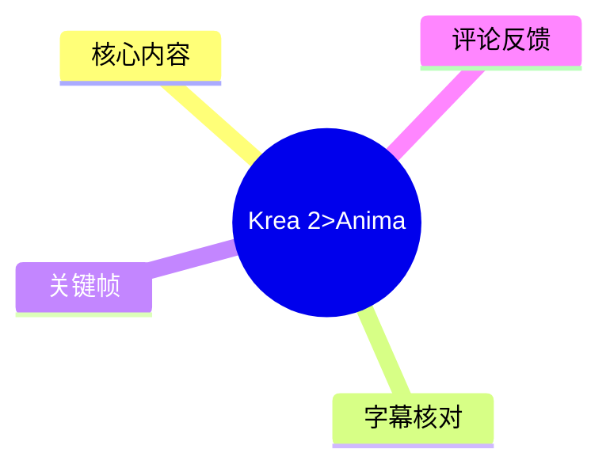
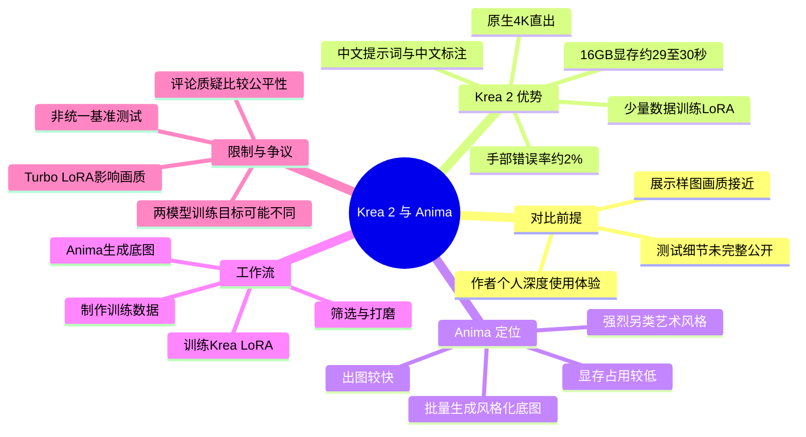
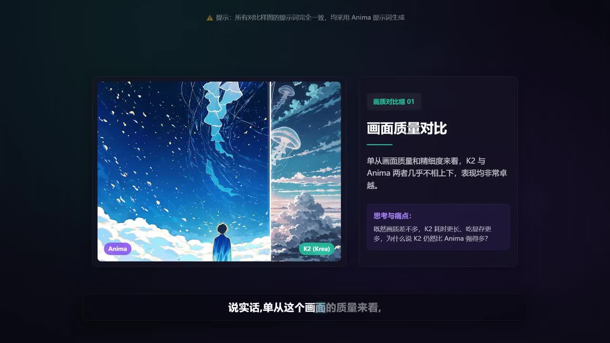
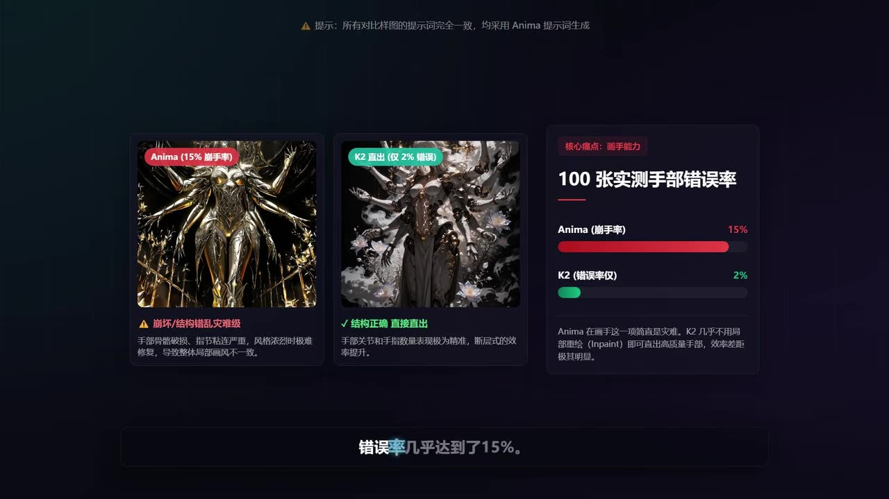
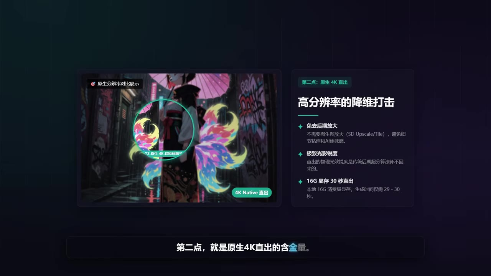
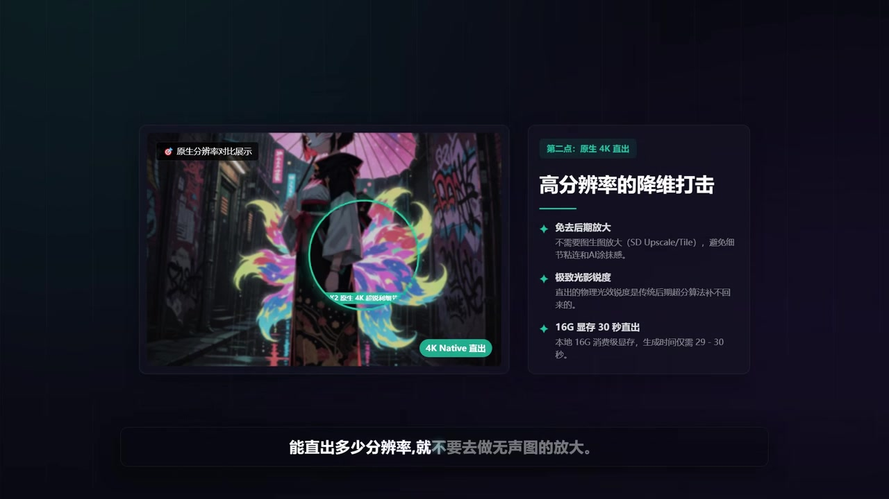

# Krea 2>Anima

> 来源：[Bilibili 视频](https://www.bilibili.com/video/BV12vTC69Egp)<br>
> UP 主：nnegret_哥们老实人｜时长：5 分 25 秒｜标签：动漫、评测、演示、文生图、ComfyUI、Krea 2、Anima

## 小结

视频是 UP 主基于近期深度使用体验，对 **Krea 2（视频中简称 K2）** 与 **Anima** 两款图像模型作出的主观工作流比较。作者的总体判断是：两者在展示样图的整体画质与精细度上“几乎不相上下”，但如果目标是稳定出图、手部结构、原生高分辨率、中文提示词理解及少量样本 LoRA 训练，K2 更适合作为主力底模；若追求强烈、另类且个性化的动漫艺术风格，Anima 仍有不可替代的位置。

作者最强调的是“画手”或手部生成可靠性。其个人测试称，连续生成 100 张图时，K2 首步手部错误率约为 **2%**，Anima 则约为 **15%**。作者认为 Anima 一旦出现手部崩坏，局部修复容易造成画风不一致，因而返修成本更高；K2 则多数情况下可接近直接输出。该结论是作者在自身提示词、工作流与评价标准下的经验数据，不等同于通用基准测试。

在分辨率与性能方面，作者称 K2 可原生输出 **4K 分辨率**；在本地 **16GB 显存**条件下，生成约需 **29～30 秒**。他主张尽可能直接生成目标分辨率，而非依靠后期无损放大：原生生成的光影、锐度和信息密度，在其看来更有内部逻辑；但这同时意味着 K2 的生成耗时与显存占用相对更高。

中文工作流是 K2 的另一项作者体验优势。视频展示图据称均由纯中文自然提示词直接生成；作者训练 LoRA 时也使用中文触发词与中文标注，称过程未遇到 bug。此外，他以“蓝色黄色背包”这类故意有歧义的短语测试，认为 K2 约有 **90%** 概率能按语境绑定为单个颜色属性，而 Anima 的自然修复率约 **60%**，可能直接生成两个背包。此处的“90% / 60%”同样未提供测试样本量、随机种子或完整提示词，宜视作经验观察。

Anima 并未被作者定义为“较差模型”。他将其定位为**风格化底图的批量生成器**：先用 Anima 快速生产大量个性化、强风格图片，再人工筛选与打磨，做成数据集训练 Krea 的 LoRA，从而把特殊画风迁移到更稳定的出图流程。作者也承认 Anima 有低显存占用、出图较快的优势，但认为开启 Turbo LoRA 后画质会下降。

本视频发布时间由元数据提供为 Unix 时间戳 `1783246019`，素材抓取时间为 2026-07-13。模型版本、节点实现、显存占用、推理速度与工作流链接都可能随平台更新而变化；视频中的比较也没有公开完整模型版本、采样器、步数、分辨率、种子、提示词及评价规范，因此适合作为选型线索，而不应直接视为严格的横向性能结论。

## 思维导图





## 目录

- [背景、比较对象与适用问题](#背景比较对象与适用问题)
- [画质接近，但作者为何偏向 K2](#画质接近但作者为何偏向-k2)
- [核心指标一：手部稳定性与返修成本](#核心指标一手部稳定性与返修成本)
- [核心指标二：原生 4K 与显存、时间代价](#核心指标二原生-4k-与显存时间代价)
- [核心指标三：中文提示词和歧义理解](#核心指标三中文提示词和歧义理解)
- [LoRA 训练经验与 K2 的底模能力](#lora-训练经验与-k2-的底模能力)
- [Anima 的优势及组合工作流](#anima-的优势及组合工作流)
- [可复用步骤、参数与资源](#可复用步骤参数与资源)
- [结论、限制与时效性](#结论限制与时效性)
- [字幕比对](#字幕比对)
- [评论分析](#评论分析)
- [处理记录](#处理记录)

## 背景、比较对象与适用问题 [00:00](https://www.bilibili.com/video/BV12vTC69Egp?t=0)

作者开场说明，自己近期“深度体验”了 K2 与 Anima，准备分享个人真实看法，并先展示若干样图。视频不是模型官方发布信息，也不是可复现实验报告，而是一份面向 AI 绘图使用者的实践评测。

比较的核心问题是：若两者表面画面质量接近，为什么作者仍认为显存要求更高、生成时间更长的 K2 更值得作为主力？视频接下来从手部准确性、高分辨率直出、中文提示词理解和 LoRA 训练几个角度回答。



> 图：画面以并列样图呈现 Anima 与 K2（Krea）的效果，并写明“单从画面质量和精细度来看，K2 与 Anima 两者几乎不相上下”。这张图解释了作者讨论并非建立在“其中一方整体画质明显更差”的前提上。

## 画质接近，但作者为何偏向 K2 [00:17](https://www.bilibili.com/video/BV12vTC69Egp?t=17)

作者先给出总体评价：仅从画面质量与精细度看，两款模型都表现不错，且“不相上下”。因此，视频没有把“整体观感”作为决定性指标，而是把重点转向生产流程中的稳定性和后期成本。

作者偏向 K2 的理由可整理为以下五项：

1. **手部结构更稳定**：减少返修与局部画风断裂。
2. **原生 4K 输出**：减少依赖后期放大，保留细节、锐度和光影关系。
3. **原生中文提示词**：作者称中文自然语言、中文 LoRA 触发词、中文标注均可顺畅使用。
4. **消费级设备可训练 LoRA**：作者在本地 16GB 显存环境训练过 K2 LoRA。
5. **底模能力强**：作者从较少训练数据也能得到可用风格效果这一现象，推断其基础知识储备较足。

其中，第 4、5 点是作者依据自身训练结果做出的经验判断；视频没有展示参数量、完整训练配置或与其他基础模型的定量对照。

## 核心指标一：手部稳定性与返修成本 [00:32](https://www.bilibili.com/video/BV12vTC69Egp?t=32)

作者把“画手”列为最重要差异。他称自己连续跑了 **100 张图**进行测试：

| 模型 | 作者描述的首步/手部错误率 | 作者对实际影响的判断 |
| --- | ---: | --- |
| K2 | 约 2% | 大多数可接近直接输出，返修压力较低 |
| Anima | 约 15% | 多张图需要返修，浓烈个人画风下局部修图尤其困难 |

作者特别指出，手部一旦崩坏，修复不仅是结构修正问题：在个人风格很强的作品中，inpaint 或局部重绘有可能与原图的线条、笔触、光影语言不一致。作者据此认为，K2 与 Anima 的效率差距会被后期返修放大。



> 图：画面直接标注“100 张实测手部错误率”，其中 Anima 标示为“15% 崩手率”，K2 标示为“仅 2% 错误”。它是视频中最明确的量化主张来源；但图中未呈现 100 张样本、提示词、随机种子与错误判定规则，阅读时应将其限定为作者个人测试结果。

需要注意，作者没有说明“错误率”是否只统计明显畸形的手、是否包含遮挡手、是否以每张图为单位，或者两边是否使用等同的分辨率、采样设置与提示词。因此不能从该数字直接推导所有使用场景下 K2 必然有 13 个百分点优势。

## 核心指标二：原生 4K 与显存、时间代价 [01:12](https://www.bilibili.com/video/BV12vTC69Egp?t=72)

第二项优势是原生高分辨率输出。作者表示，K2 可原生直出 **4K 分辨率**；在 **16GB 显存**条件下，生成时间约为 **30 秒**，画面文字进一步标示为约 **29～30 秒**。

作者的工作原则是：

> 能原生直出多少分辨率，就尽量不要做后期“无损图”放大。

其理由并非简单反对放大，而是认为原生生成阶段形成的光影、锐度和信息密度有自身的整体逻辑；后期放大即便补足像素，也未必能恢复原始生成阶段未产生的结构性信息。在他的描述中，分辨率不足后再放大，可能产生画面发糊、局部黏连及“AI 感重”的问题。



> 图：画面标题为“高分辨率的降维打击”，列出“免去后期放大”“极致光影锐度”“16G 显存 30 秒直出”等要点，并以局部放大圈展示细节。这张图把作者的速度、显存和原生分辨率主张集中呈现出来。

### 参数与取舍

| 项目 | 视频中的信息 | 使用时应注意 |
| --- | --- | --- |
| 输出能力 | K2 可原生直出 4K | 未给出准确像素尺寸、宽高比和工作流节点 |
| 显存条件 | 16GB 显存 | 未明确 GPU 型号、系统、量化方式、批量大小与显存优化手段 |
| 生成耗时 | 约 29～30 秒 | 未给出采样步数、采样器、种子和提示词长度，速度不可直接横向复现 |
| 后期放大 | 作者建议尽量少做 | 这是经验偏好；实际项目仍可按输出尺寸、成本与可接受质量决定是否放大 |

作者同时承认，K2 相对于 Anima 的代价是生成更慢、显存占用更高。因而原生 4K 的价值更偏向需要大图、后期空间较小、重视纹理与结构一致性的场景；若需求是大量快速草图或更低硬件门槛，Anima 的速度和显存优势仍可能更合适。

## 核心指标三：中文提示词和歧义理解 [01:52](https://www.bilibili.com/video/BV12vTC69Egp?t=112)

作者称前面展示的 K2 图片全部使用“纯中文自然提示词”生成。他还表示：

- 自己训练的 LoRA 触发词设置为中文；
- 训练数据打标使用中文；
- 整个过程中未遇到 bug，体验顺滑；
- 虽然提示词工程仍无法完全绕开，但中文提示词能让自己更直观理解内容与修改方向。

视频中进一步给出了一个故意输入错误或歧义短语的例子，ASR 转写为“蓝色黄色背包”。作者描述的结果是：

| 测试对象 | 作者观察到的处理方式 |
| --- | --- |
| K2 | 约 90% 概率可根据语境将其绑定为单一颜色属性，而非拆成两个对象 |
| Anima | 可能真的生成两个背包；作者称自然修复率约为 60% |

该案例表达的重点不是语法纠错本身，而是模型是否能按上下文推断用户意图。由于视频未展示完整输入文本、各次输出结果与统计口径，数字不能被视为独立验证过的自然语言理解能力指标。



> 图：该关键帧持续展示原生 4K 对局部锐度与画面信息的影响，适合辅助理解“提示词理解—生成阶段—最终细节”之间的工作流关系；但它不直接证明中文提示词测试的统计结果。

## LoRA 训练经验与 K2 的底模能力 [02:42](https://www.bilibili.com/video/BV12vTC69Egp?t=162)

视频中的平涂风格样图，据作者介绍，是他以本地 **RTX 4080 16GB 显存**训练得到的 LoRA 结果。作者给出的训练经验参数如下：

| 项目 | 作者提供的信息 |
| --- | --- |
| 设备 | 本地 RTX 4080，16GB 显存 |
| 数据量 | 约 80 张图片 |
| 训练耗时 | 约 3 小时，接近 4 小时 |
| 训练对象 | K2 的 LoRA |
| 标注与触发词 | 使用中文 |
| 主观效果 | 作者认为速度快、效果好，消费级/家用级平台可支持 |

作者的推理链条是：K2 的底模能力较强，因此训练 LoRA 时不必堆叠特别多的数据，也能得到不错的结果；虽然它不是专门面向动漫的模型，但通过适当训练后，动漫效果依然有竞争力。作者还从手部结构、光影关系和画风理解方面，主观认为 K2 优于 Anima。

这里必须区分三层信息：

1. **可直接记录的事实**：作者使用 4080 16GB、约 80 张数据、约 3～4 小时进行训练。
2. **作者的结果判断**：他认为训练结果好、速度快，且适合消费级硬件。
3. **尚未被视频验证的泛化结论**：少样本效果取决于数据清洗、重复图、分辨率、训练轮数、学习率、网络维度、底模版本和目标风格复杂度，不能仅凭本次案例推导所有 LoRA 都能以 80 张图在 3～4 小时完成。

## Anima 的优势及组合工作流 [03:43](https://www.bilibili.com/video/BV12vTC69Egp?t=223)

在说明 K2 的优势后，作者明确表示 Anima 也有不可替代的地方：它能够产生一批很独特的艺术风格，特别是偏异类、个人风格强烈的画风，而这类“味道”是常规模型难以完成的。作者提到，目前自己会在 Anima、Gate 化石（ASR 音译，具体名称未能由素材确认）或 LoRA 中寻找此类效果。

作者给 Anima 的核心定位是：

> **风格化底图批量生成器。**

相应的组合策略为：

1. 使用 Anima 快速产出大量个性化、风格化图片；
2. 对候选图进行筛选与打磨；
3. 将整理后的图片制作成训练数据集；
4. 用这些数据训练 Krea 的 LoRA；
5. 获得兼具特殊画风与作者所需稳定性的后续生成能力。

这一流程不是视频展示的逐步实操界面，而是作者分享的创作策略。它适合已有数据清洗、图片筛选和 LoRA 训练能力的使用者；若原始 Anima 图中含有明显结构错误、版权来源不清或风格不一致内容，直接纳入训练集可能会把问题一并固化到 LoRA 中，因此仍需人工审核。

作者还提到 Anima 具备显存占用低、出图快的优点。不过，他认为使用 **Turbo LoRA** 后，虽然可以加速出图，但画面质量会变差；视频未提供 Turbo LoRA 的具体版本、权重或质量对比样例。

## 可复用步骤、参数与资源 [04:23](https://www.bilibili.com/video/BV12vTC69Egp?t=263)

依据作者的实际建议，可复用的策略不是简单二选一，而是按任务分工：

### 场景化选择

| 目标 | 作者倾向的工具/做法 | 原因 |
| --- | --- | --- |
| 追求手部稳定、较少返修 | K2 | 作者的 100 图测试中手部错误率较低 |
| 需要高分辨率成图 | K2 原生 4K | 减少后期放大带来的糊化与黏连风险 |
| 希望直接使用中文工作流 | K2 | 作者称中文提示词、触发词、标注可顺畅使用 |
| 需要强烈、另类、个性化的动漫风格草图 | Anima | 作者认为其艺术风格不可替代 |
| 制作特殊风格 LoRA | Anima 产图 → 筛选打磨 → Krea LoRA | 将 Anima 的风格探索与 Krea 的稳定出图结合 |
| 低显存、快速批量探索 | Anima | 作者认可其显存占用和速度优势，但提醒 Turbo LoRA 的质量损失 |

### 视频明确给出的训练与生成参数

```text
K2 原生输出：4K（视频未给出具体宽高）
推理显存：16GB
K2 生成时间：约 29～30 秒

LoRA 训练设备：本地 RTX 4080，16GB 显存
训练数据量：约 80 张
训练时长：约 3～4 小时
标注语言：中文
触发词语言：中文
```

### 作者在简介区提供的资源

视频简介列出以下资源，均为 UP 主提供的外部链接，视频素材未验证其安全性、版本与持续可用性：

- Anima 推荐工作流：RunningHub 链接；
- Krea 2 推荐工作流：RunningHub 链接；
- LoRA 文件：夸克网盘链接；
- Krea 2 动漫工作流：夸克网盘链接；
- 交流群号：`173273201`。

在导入外部工作流或模型文件前，应自行检查来源、依赖节点、模型许可、文件哈希与潜在安全风险；不要将视频简介链接视作官方渠道或长期有效保证。

## 结论、限制与时效性 [05:04](https://www.bilibili.com/video/BV12vTC69Egp?t=304)

视频的结论可以概括为：作者并不否认 Anima 的风格价值，但在其个人生产流程中，K2 更适合承担稳定、高分辨率、中文工作流和 LoRA 落地的主力角色；Anima 更适合用来高效探索、批量生成有鲜明个人气质的风格底图。

对于实际使用者，更稳妥的迁移方式是先根据目标任务做小规模 A/B 测试，而非直接复制作者结论：

1. 固定同一主题、构图要求与输出尺寸；
2. 尽量固定提示词语义、随机种子策略与采样设置；
3. 分别统计手部、文字、复杂肢体、背景结构的可用率；
4. 将返修时间纳入总成本，而不是只比较单张推理秒数；
5. 对强风格图单独评价“风格命中度”，避免只以真实结构准确度否定其价值；
6. 若计划训练 LoRA，先清洗并分级管理数据，再比较不同底模的少样本保真度与泛化能力。

### 已知限制

- 作者给出的 2%、15%、90%、60% 等数字均属个人经验测试，未公布可复现的完整实验条件。
- 视频未公开 K2、Anima 的精确版本、节点图、采样器、步数、CFG、分辨率、种子和提示词全文。
- K2 与 Anima 的训练目标、数据域和模型规模是否相同，视频中未做说明；因此“谁更强”应始终附带具体任务条件。
- “Gate 化石”为 ASR 音译，无法凭现有素材确定准确名称。
- 模型能力、工作流依赖、显存优化方案与第三方资源链接会随时间变化。本文仅记录抓取时可获得的视频素材，不构成当前版本功能保证。

## 字幕比对

| 字幕来源 | 完整性 | 专有名词 | 时间轴 | 主要问题 |
| --- | --- | --- | --- | --- |
| Bilibili 站内字幕 | 未提供可用字幕 | 无法核验 | 无法核验 | 素材中不存在可用站内字幕文件 |
| 本次 ASR 字幕 | 覆盖完整口播主线 | 存在音译与识别误差 | 提供文本但未提供逐句时间码 | “K2 / Krea 2”“Anima”“LoRA”“Turbo LoRA”等存在混写；个别句子语义破碎 |

本次任务**已执行 ASR**。由于没有可用站内字幕，正文以本次 ASR 为基础，结合视频元数据、关键帧文字和上下文进行有限校正；未把无法确认的词语强行改写为确定事实。

重要校正与保留说明：

| ASR 结果或疑点 | 正文处理 | 依据 |
| --- | --- | --- |
| “K2”“KL”“care” | 统一优先写作“K2 / Krea 2” | 视频标题为“Krea 2>Anima”，关键帧标注为“K2（Krea）” |
| “阿尼玛” | 写作“Anima” | 视频标题、标签与关键帧一致 |
| “Lower”“Laura”“dora” | 写作“LoRA” | 视频语境为模型微调、训练、触发词 |
| “4K”“16G 显存 30 秒” | 保留为作者主张 | 关键帧明确展示原生 4K、16G、29～30 秒 |
| “Gate 化石” | 保留为 ASR 音译并标注未确认 | 无站内字幕、视频元数据或关键帧可用于确认专名 |
| “无声图的放大” | 按上下文表述为后期无损/无损式放大 | 作者讨论的是 SD Upscale/Tile 等后期放大，关键帧亦提及相关概念 |

## 评论分析

以下仅处理素材中可获取的热评前三条。评论反映观众观点与争议，不作为已验证的模型事实。

### 1. 鲨鱼种子（6 赞）

评论认为视频的比较前提不公平：Anima 明确偏二次元训练，而作者却弱化或不比较风格差异、把它拉到更偏通用质量的维度与 K2 对比。评论者主张，如果不重视 Anima 的风格领域，拿它与其他模型比较更合适。

- **补充价值**：提醒评测应把模型设计目标与适用领域纳入评价，而不是只比较手部与通用结构。
- **与视频的关系**：视频作者确实承认 Anima 在强风格方面不可替代，但整体结论仍以 K2 的稳定性为中心。
- **可信度边界**：评论没有提供官方训练数据或模型定位的来源链接，因此“专门训二次元”“几乎没有真人素材”等表述需要另行验证。

### 2. 烧猫定食（5 赞）

评论仅称“你对二次元一无所知”，没有给出具体反例、模型参数、作品样本或论证过程。

- **补充价值**：表明部分观众对视频的二次元评价框架存在明显不满。
- **争议点**：其批评未说明究竟是风格评价、训练数据、手部美学、模型选择，还是比较方法存在问题。
- **可信度边界**：由于缺少具体论据，不能据此得出可执行的技术结论。

### 3. BIG_ANGELO（35 赞）

该评论认为 Krea 2 与 Anima 可能属于不同类型、不同规模或不同训练数据倾向的模型，直接比较并不严谨。评论者推测 Krea 2 更偏真人、高写实、高细节、商业视觉素材，Anima 则更多使用动漫、插画和动画手绘素材；并以“市级图书馆与漫画铺”作类比，认为应寻找更接近的同类模型进行比较。

- **补充价值**：提出了最具体的方法论批评：应先界定模型类别、训练目标、参数规模与测试任务，再决定横评是否成立。
- **与视频的关系**：这与视频中“Anima 的独特风格不可替代”的表述部分一致，也解释了为什么手部结构等指标未必是唯一公平标准。
- **可信度边界**：评论中的“2B / 12B”“训练素材构成”等信息没有得到本任务素材中官方资料证实，不能写入正文作为事实。它应被视为需要官方模型卡、训练说明或可复现实验进一步验证的假设。

## 处理记录

- **Worker ID**：worker-mrj0www4-e8d79408
- **模型**：gpt-5.6-terra
- **调用工具与素材**：视频元数据、已提取音频的本次 ASR 文本、关键帧目录、评论 JSON、视频简介与封面/页面信息。
- **使用的应用工具**：素材解析与提取流程已产出 `merged.mp4`、`audio/audio.wav`、`frames/`、`comments/comments.json`、`asr/` 等文件；本次整理使用其提供结果，未获得额外站内字幕。
- **字幕选择**：站内字幕未提供可用文件；已执行本次 ASR，故以 ASR 为主，并利用关键帧文字、标题、标签与上下文校正“Krea 2 / K2”“Anima”“LoRA”等明确术语。对“Gate 化石”等无法确认的 ASR 音译不作臆测。
- **关键帧选择依据**：选用 `frames/frame-001.jpg` 展示两模型画质接近的比较前提；选用 `frames/frame-002.jpg` 佐证视频所示的 100 张手部错误率主张；选用 `frames/frame-003.jpg` 与 `frames/frame-004.jpg` 说明原生 4K、16GB 显存和约 29～30 秒生成时间等屏幕文字信息。图片均以相对路径嵌入，并在图注中说明其正文价值及证据边界。
- **评论处理范围**：严格限于可获取热评前三条，未扩展分析其余 104 条可见回复。
- **缓存清理**：未执行本地缓存清理操作；本次仅消费任务提供的已生成素材清单，未新增需要删除的临时缓存。
- **未解决问题**：缺少逐句时间码、完整工作流、模型精确版本、采样参数、测试样本与官方模型卡；无法验证作者的错误率与自然语言理解率，也无法确认“Gate 化石”的准确专名。
