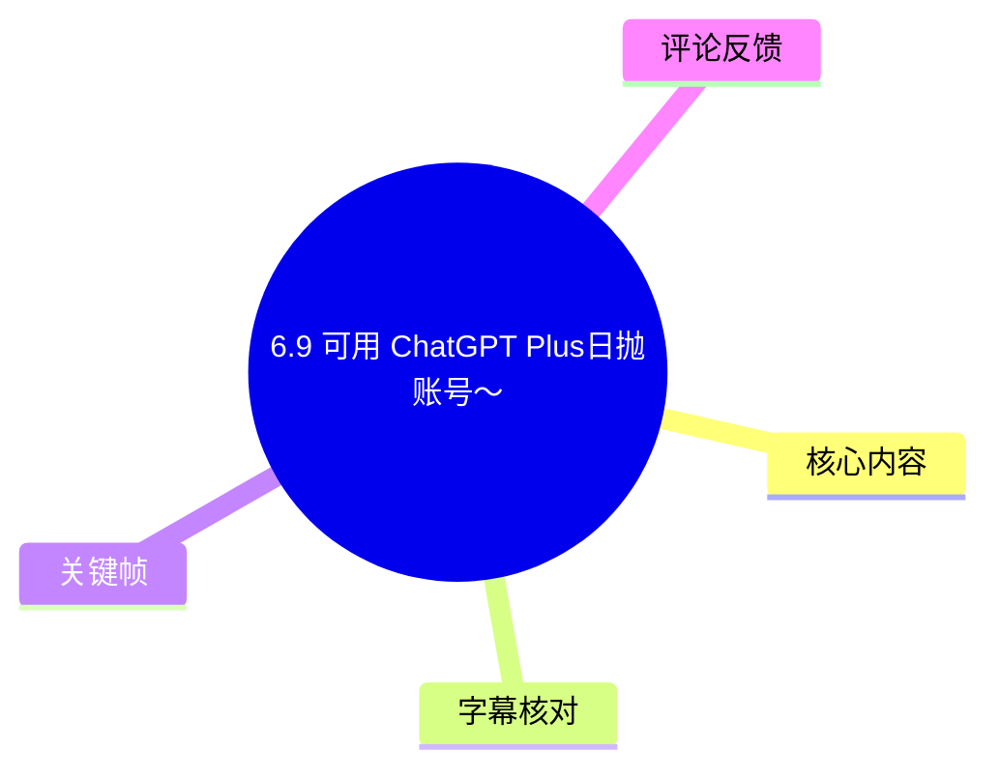
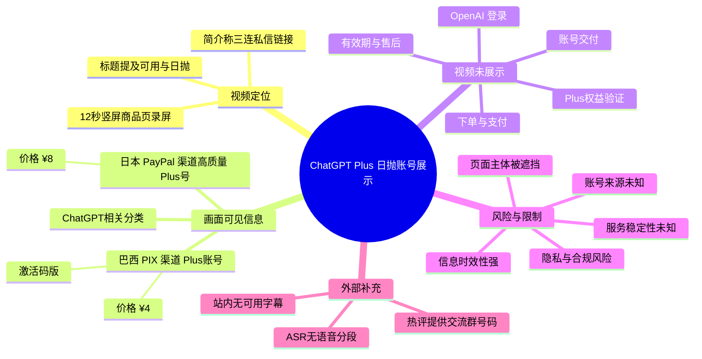

## 小结

视频《6.9 可用 ChatGPT Plus日抛账号～》是一段时长约 12 秒的竖屏商品页展示视频。标题、标签与视频简介均指向“ChatGPT Plus 日抛账号”这一第三方账号/服务信息；简介写有“`三连私信链接`”。

画面可确认展示了一个移动端商品选择页面，其中有“ChatGPT相关”分类，并可见两张与 Plus 账号有关的商品卡片：左侧为“巴西 PIX 渠道 Plus 账号（激活码版）”，标价 `¥4`；右侧为“日本 PayPal 渠道高质量 Plus 号”，标价 `¥8`。页面顶部及部分文字被动态卡通贴纸遮挡，无法据此确认平台主体、商品完整规则或账号来源。

视频未展示下单、支付、账号交付、OpenAI 登录、Plus 权益状态、实际对话能力、有效期或售后流程。因此，“可用”“高质量”“日抛”等均属于标题或商品页宣传信息，不能视为已经由视频验证的事实。

该内容具有明显时效性：视频发布于元数据时间戳对应的 2026 年 6 月 9 日；商品价格、库存、私信链接、账号状态、交流群及第三方服务规则均可能在发布后变化。视频不是 OpenAI 或 ChatGPT 官方公告，也未提供官方授权或权益验证材料。

对需要稳定、私密或长期保存工作内容的用户而言，来源、归属与共享状态不明的第三方临时账号存在账号回收、服务失效、数据暴露及规则合规等不确定性。应将该视频理解为未经独立验证的商品展示，而非稳定可用或合规服务的证明。

## 思维导图

## 目录

- [视频定位与时效性](#视频定位与时效性)
- [画面中的商品信息](#画面中的商品信息)
- [可还原流程与信息缺口](#可还原流程与信息缺口)
- [技术参数、风险与使用边界](#技术参数风险与使用边界)
- [结论与限制](#结论与限制)
- [字幕比对](#字幕比对)
- [评论分析](#评论分析)
- [处理记录](#处理记录)

# 6.9 可用 ChatGPT Plus日抛账号～

> 来源：[Bilibili 视频](https://www.bilibili.com/video/BV1k4Ej6eEBg)  
> UP 主：Hgwangwang  
> 合集：AIcode  
> 视频时长：12 秒  
> 画面规格：1080×2160，竖屏  
> 视频简介：`三连私信链接`

## 视频定位与时效性 [00:00](https://www.bilibili.com/video/BV1k4Ej6eEBg?t=0)

这是一段约 12 秒的短视频，标题为“6.9 可用 ChatGPT Plus日抛账号～”。元数据标签包括“人工智能”“ChatGPT”“日抛账号”“账号”“plus”“OpenAI”“GPT”，反映的是发布者为视频标注的话题，不代表 OpenAI 官方背书，也不证明页面内商品属于官方服务。

视频简介“`三连私信链接`”表明 UP 主希望观众通过互动及私信获取更多信息；但给定素材中没有实际私信链接、商品详情页链接、商家资质、服务协议或退款说明。

站内未提供可用字幕；本次 ASR 也没有输出可用语音分段。因此，本文不能将画面内元素细分到未经证实的具体秒点。各章节时间轴统一链接至视频已知起点 `00:00`，不根据文字顺序虚构时间位置。

该视频呈现的并非 ChatGPT 官方功能新闻、官方订阅价格公告或官方操作教程，而是一段第三方商品页画面。页面价格、库存状态、账号可用性、私信入口与交流群信息均可能在视频发布后发生变化。

## 画面中的商品信息 [00:00](https://www.bilibili.com/video/BV1k4Ej6eEBg?t=0)

视频中可见一个移动端服务/商品页面。页面顶部显示的名称区域及主体信息被大幅卡通贴纸遮挡，因此无法可靠识别网站或小程序名称、运营者身份、订单规则和支付主体。

下方的商品选择区域仍保留了若干可辨识文字：

| 画面元素 | 可辨识内容 | 确认程度 | 说明 |
| --- | --- | --- | --- |
| 分类卡片 | `ChatGPT相关` | 较高 | 蓝色分类卡片中可见该名称。 |
| 页面区域 | `选择商品` | 较高 | 表明当前处于商品选择页。 |
| 商品卡片 1 | `巴西 PIX渠道 Plus账号（激活码版）` | 中等 | 商品名称因字号较小及画面压缩存在识别边界，但“PIX”“Plus账号”“激活码版”可见。 |
| 商品卡片 1 价格 | `¥4` | 较高 | 左侧商品卡片下方可见。 |
| 商品卡片 2 | `日本 PayPal渠道高质量 Plus号` | 中等 | 文字存在换行，“PayPal”“高质量”“Plus号”可见。 |
| 商品卡片 2 价格 | `¥8` | 较高 | 右侧商品卡片下方可见。 |
| 页面底部 | `没有更多了` | 较高 | 商品列表底部可见该提示。 |

> 图：该关键帧清楚呈现“ChatGPT相关”分类、“选择商品”区域、PIX 与 PayPal 两张商品卡片，以及 `¥4`、`¥8` 两个可见价格。它是判断视频实际展示内容的主要依据；同时，顶部的大型贴纸遮挡了平台主体和部分页面信息，明确了证据边界。

### 可以确认与不能确认的内容

可以确认的是，视频画面展示了与“Plus 账号”相关的两项第三方商品信息及其可见价格。

不能从该画面进一步确认的内容包括：

- 商品是否由 OpenAI 官方直接销售、授权或认可；
- 账号是否独享、共享、已注册、可修改密码，或需要二次验证；
- “激活码版”的具体兑换方法及该兑换方法是否有效；
- “高质量”的评价标准、功能范围或稳定性标准；
- 账号可以使用多久，“日抛”的准确期限与失效处理方式；
- 是否支持退款、换号、售后或订单争议处理；
- `¥4`、`¥8` 是否为当前价、单次价、限时价、首单价或具有附加条件的价格；
- 页面中展示的账号是否实际具有 ChatGPT Plus 权益。

## 可还原流程与信息缺口 [00:00](https://www.bilibili.com/video/BV1k4Ej6eEBg?t=0)

### 视频实际展示的界面路径

基于现有画面，只能谨慎还原出如下展示顺序：

1. 打开一个移动端服务或商品页面；
2. 页面中显示“ChatGPT相关”分类；
3. 在“选择商品”区域列出两项包含 Plus 账号描述的商品；
4. 视频停留在商品列表页面，没有继续进入详情、结算或账号使用页面。

视频未显示任何点击操作结果，也没有显示实际购买、付款、订单生成、账号发放、验证码验证、ChatGPT 登录或 Plus 标识。因此，它不是可复现的“获取 ChatGPT Plus”操作教程。

### 观众需要补充核验的事项

以下为基于视频信息缺口提出的审慎核验清单，不是视频中演示的步骤，也不构成对第三方账号交易的推荐：

1. 核实服务提供方是谁，是否提供可追溯的主体信息、商品说明与售后规则。
2. 明确账号是独享还是共享，是否允许修改登录信息，以及失效后是否有换号或退款规则。
3. 若涉及“激活码”，应确认该码的兑换方式、使用地区、有效期与适用账户限制。
4. 不应仅依据“可用”“高质量”“低价”或“日抛”等宣传词判断服务可靠性。
5. 不应在来源不明或共享状态不明的账号中输入私人对话、工作文件、客户资料、账号密码、验证码、支付信息或 API 密钥。
6. 若需要长期使用稳定服务，应以服务方当时提供的正式订阅渠道、账户规则与地区限制为准。

## 技术参数、风险与使用边界 [00:00](https://www.bilibili.com/video/BV1k4Ej6eEBg?t=0)

### 素材与识别参数

| 项目 | 记录值 |
| --- | --- |
| BVID | `BV1k4Ej6eEBg` |
| 视频时长 | 12 秒 |
| 音频分析时长 | 11.9815 秒 |
| 视频尺寸 | 1080×2160 |
| 画面方向 | 竖屏，`rotate: 0` |
| ASR 模型 | `medium` |
| ASR 请求语言 | `auto` |
| ASR 自动识别语言 | `en` |
| 语言概率 | `0.541015625` |
| ASR 语音分段数 | 0 |
| ASR 识别语音时长 | 0 秒 |
| ASR 语音覆盖率 | 0 |

ASR 诊断显示“未识别到语音分段”，但未提供 `noAudioStream=true` 标记。因此，不能将其表述为“源视频没有音轨”；更准确的结论是：给定 ASR 结果未能从约 11.98 秒的音频中识别出可用语音文本。

### 风险与限制

视频标题中的“日抛账号”暗示账号的持续可用性可能较短，但素材未给出明确期限。即使某账号在某一时刻可以登录，也不能据此证明账号来源合规、权益稳定、可长期使用或数据安全。

对于来源不明的第三方账号，可能存在以下风险。这些是一般风险提示，并非对该视频页面的具体事实指控：

- **账号归属不确定**：账号可能由他人控制、重置、回收或多人使用。
- **隐私与数据风险**：共享或控制权不明的账号可能不适合保存私密对话、上传文件及工作资料。
- **服务连续性风险**：账号可能因支付状态、地区限制、异常登录或平台规则变化而失效。
- **售后不确定性**：视频没有展示订单保障、退款条款、换号条件或争议处理渠道。
- **规则合规风险**：账号交易、共享使用或跨地区支付等行为可能受到相关平台服务条款及地区规则限制。

## 结论与限制 [00:00](https://www.bilibili.com/video/BV1k4Ej6eEBg?t=0)

本视频能够确认的事实有限：UP 主展示了一个第三方移动端商品选择页，页面中有“ChatGPT相关”分类，并出现两项与 Plus 账号有关的商品；可见价格分别为 `¥4` 与 `¥8`。视频简介写有“`三连私信链接`”。

视频没有证明商品对应的是官方 ChatGPT Plus 订阅，也没有展示账号交付、使用权限、模型能力、实际登录、可用时长、独享状态、退款条款或售后流程。因此，标题中的“可用”不能作为已验证的服务结论，“日抛”也没有被画面明确解释为具体的有效期限。

对于关注 ChatGPT Plus 的用户，这段视频可作为识别第三方低价账号推广页面的案例；但不应作为账号质量、稳定性、合规性或当前价格的可靠依据。涉及账户、支付与个人数据时，应优先核验正式渠道、服务条款及账户归属。

## 字幕比对 [00:00](https://www.bilibili.com/video/BV1k4Ej6eEBg?t=0)

| 字幕来源 | 完整性 | 专有名词识别 | 时间轴 | 主要问题 |
| --- | --- | --- | --- | --- |
| Bilibili 站内字幕 | 无可用字幕 | 无法评估 | 无 | 素材明确说明“未提供可用站内字幕”。 |
| 本次 ASR 字幕 | 空 | 未识别 | 无有效分段 | `medium` 模型自动判为英语，语言概率约 0.541；最终输出 0 个语音分段、0 秒语音覆盖。 |

最终未采用字幕文本作为正文依据：站内字幕缺失，本次 ASR 输出为空。

正文中的“ChatGPT相关”“PIX”“PayPal”“Plus账号”“激活码版”“高质量 Plus号”“¥4”“¥8”等信息来自关键帧中可见的页面文字，而非字幕转写。页面顶部、部分按钮与局部文字被贴纸遮挡，无法可靠读取的内容均未补写或推测。

## 评论分析 [00:00](https://www.bilibili.com/video/BV1k4Ej6eEBg?t=0)

本次仅获取到 1 条热评，未达到“热评前三条”的数量，因此仅分析该条，不虚构其他评论。

| 序号 | 评论者 | 评论内容概括 | 补充信息 | 可信度与边界 |
| --- | --- | --- | --- | --- |
| 1 | Hgwangwang（UP 主） | 表示可以进入交流群，有问题可在群内探讨，并给出群号 `793552464`。 | 表明发布者声称存在一个交流社群。 | 这是一条发布者自行提供的联系方式，不能证明群组有效、群内信息准确、商品可用或服务合规，也不能替代商品说明、售后承诺与官方验证。 |

该评论未补充账号来源、使用时限、交付方式、实际验证、退款规则或平台授权信息。评论点赞数为 0，且没有其他可获取热评形成交叉印证，因此不宜据此推断服务质量。

## 处理记录 [00:00](https://www.bilibili.com/video/BV1k4Ej6eEBg?t=0)

- Worker ID：`worker-mrj0www4-e8d79408`
- 文档模型：`gpt-5.6-terra`
- ASR 模型：`medium`
- ASR 运行参数：CUDA / `float16` / 自动语言识别
- 使用的素材：视频元数据、关键帧目录、ASR 诊断数据、ASR 空输出、评论数据、站内字幕状态。
- 字幕选择：站内无可用字幕；已检查本次 ASR，但其结果为空，因此未采用任何字幕作为转写依据。
- 时间轴依据：站内字幕与 ASR 均无有效分段时间戳；本文所有章节仅链接至可确认的全片起点 `00:00`，未按文字出现顺序假设细粒度时间。
- 关键帧选择依据：使用 `frames/frame-001.jpg`，因为该帧清楚保留了“ChatGPT相关”分类、商品选择区域、PIX 与 PayPal 商品卡片及可见价格，同时能显示顶部信息被贴纸遮挡这一事实。
- 关键帧价值：该帧是正文中商品名称、价格与页面结构判断的直接视觉依据；遮挡区域未用于推断服务主体或商品规则。
- 缓存清理：未提供缓存清理执行日志，无法确认是否已完成清理；不将其记作已执行。
- 未解决问题：页面主体、商品完整名称、账号来源、账号归属、实际可用性、交付方式、有效期限、售后条款、退款条件及合规状态，均无法仅凭现有素材验证。

## 评论分析

- 热评 1：可以进交流群，有什么不会的可以发群里一起探讨[doge_金箍] 793552464

以上内容是观众反馈摘录，只用于补充理解视频反响，不作为正文事实依据。
