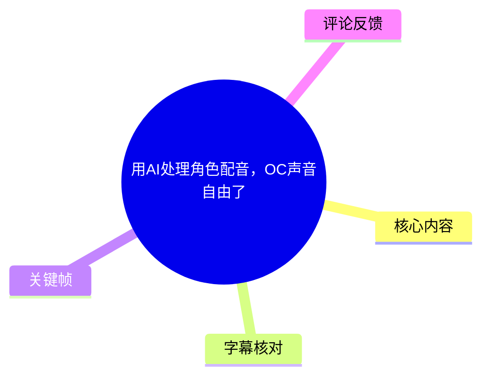
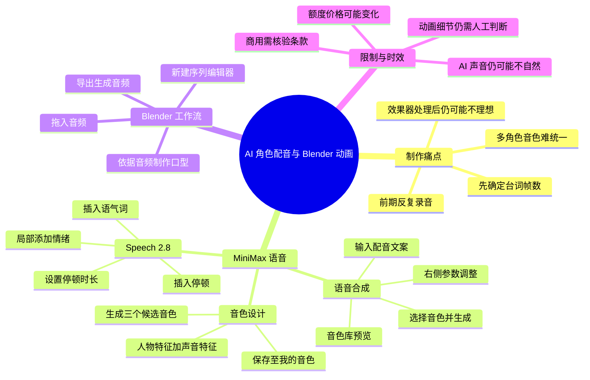
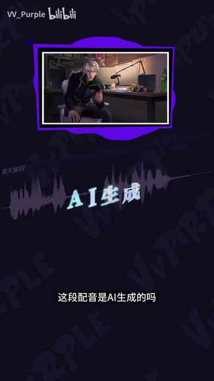
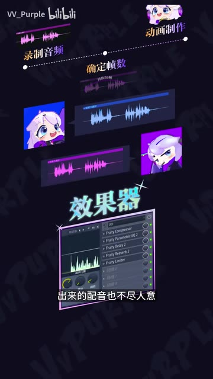

# 用AI处理角色配音，OC声音自由了

> 来源：[Bilibili 视频](https://www.bilibili.com/video/BV1fLZvBGEQv)<br>
> UP 主：VV_Purple｜发布时间：2026-02-20｜视频时长：02:38｜画面规格：1440×2560 竖屏

## 小结

视频演示了 UP 主将 **MiniMax 语音**用于 Blender 动画角色配音的工作流：先通过文字转语音生成台词，再把音频导入 Blender 的序列编辑器，以音频时长和节奏为依据制作口型与动画。

其要解决的核心痛点是：传统动画配音往往要在动画制作前反复录音、确认每句话对应的帧数；而多角色制作时，创作者还可能面临真人音色不足、后期挂效果器后声音仍不理想的问题。视频将 AI 配音定位为前期动画 Demo、角色台词统一和节奏试验的辅助工具。

操作上，视频涉及三个能力：**语音合成（文本转语音）**、**音色设计（按角色描述生成声音）**、以及 **Speech 2.8 的局部编辑**。其中，音色设计可根据“人物特征 + 声音特征”撰写描述，一次生成三个候选音色；Speech 2.8 则用于在文本中插入可选时长的停顿、为局部句子附加情绪、插入语气词，以便在不破坏前后音频的情况下对齐动画细节。

视频称音色库内置“300 多种音色”，覆盖不同年龄、性别和口音；并称生成的音频频谱干净、动态正常，可减少降噪与压缩的后期工作。上述均为视频中的产品介绍或创作者体验，实际音质、版权与商用范围仍应以使用时的产品页面、授权协议和生成结果为准。

价格与额度信息具有明显时效性：视频称首次登录可获得 **1 万积分**，套餐为 **36 元 10 万积分**。该内容发布于 2026 年 2 月，积分规则、套餐价格、模型能力和商用条款均可能已经调整，不应将其视为当前固定政策。

## 思维导图





## 目录

- [背景：动画配音的前置难题](#背景动画配音的前置难题)
- [进入 MiniMax 语音与文字转语音](#进入-minimax-语音与文字转语音)
- [导入 Blender：从音频到口型动画](#导入-blender从音频到口型动画)
- [音色设计：为角色建立专属声音](#音色设计为角色建立专属声音)
- [Speech 2.8：局部停顿、情绪与节奏对齐](#speech-28局部停顿情绪与节奏对齐)
- [额度、套餐与适用限制](#额度套餐与适用限制)
- [字幕比对](#字幕比对)
- [评论分析](#评论分析)
- [处理记录](#处理记录)

## 背景：动画配音的前置难题 [00:00](https://www.bilibili.com/video/BV1fLZvBGEQv?t=0)

视频以“能否听出这段配音是否由 AI 生成”为引子，随后说明其在 Blender 动画制作中的配音需求。

UP 主描述的传统流程是：

1. 在动画制作前反复录制音频；
2. 根据每句台词的持续时间确定动画所需帧数；
3. 再进入动画制作与口型匹配阶段。

当动画有多个角色时，创作者需要持续提供或寻找差异化音色。视频认为，即使对声音挂载效果器，得到的配音也未必符合角色设定。因此，UP 主将 MiniMax 语音用于生成动画 Demo 的台词，以减少反复录音和修音的工作。



> 图：关键帧以波形、“AI生成”文字及角色说话画面展示视频的切入问题——配音是否具有足够的拟真度。这有助于理解该视频讨论的不是通用语音识别，而是角色动画中的 AI 配音应用。



> 图：画面将“录制音频—确定帧数—动画制作”的链路与效果器界面并置，直观说明视频所归纳的制作瓶颈：音频时长会影响动画节奏，而后期处理也不必然解决角色音色问题。

### 关键经验

- **先有音频，再做口型**：视频采用音频先行的制作顺序，台词节奏是口型和镜头节奏的重要基准。
- **AI 适合作为试音与 Demo 工具**：面对尚未最终定稿的角色台词，可先生成声音并验证动画节奏。
- **“听起来像人”不等于“适合角色”**：视频后续专门使用音色设计，说明预设声音与角色人设之间仍需要匹配过程。

## 进入 MiniMax 语音与文字转语音 [00:30](https://www.bilibili.com/video/BV1fLZvBGEQv?t=30)

UP 主展示的入口路径为：查询 MiniMax 后，选择“语音大模型”进入操作界面。视频的首个功能模块是“语音合成”，即文字转语音。


> 图：关键帧显示产品页面卡片，其中可见“语音大模型”入口。它为“从 MiniMax 进入语音操作界面”的视频叙述提供了画面依据。

### 语音合成的操作步骤

1. 进入 MiniMax 的语音大模型操作界面。
2. 选择“语音合成”功能。
3. 在文本输入区域填写需要配音的文案。
4. 进入音色库浏览和试听声音。
5. 选择符合需求的音色，生成音频。
6. 若生成结果不满意，在界面右侧按需求调整后再生成。

视频称音色库内置 **300 多种音色**，覆盖的维度包括：

| 维度 | 视频描述 |
| --- | --- |
| 年龄 | 提供不同年龄感的声音 |
| 性别 | 提供不同性别倾向的声音 |
| 口音 | 提供不同口音选择 |
| 试听 | 可在选择前预览音色 |


> 图：关键帧展示深色界面的音色库列表，列表中可见多种中文普通话音色及人物性格描述。这说明视频的选音过程不仅依赖名称，也依赖对声音气质的文本标签与试听。

### 使用时应注意

视频没有展示具体的右侧可调参数名称、数值范围、导出格式或采样率，因此不能据此补充具体参数。对于角色动画而言，至少应在实际生成后检查：

- 台词总时长是否与分镜节奏匹配；
- 人名、专有名词和语气词的读音是否正确；
- 音色是否长期稳定，能否在多句台词中保持一致；
- 是否存在可听出的机械感、断句异常或不合角色的情绪表达。

## 导入 Blender：从音频到口型动画 [00:50](https://www.bilibili.com/video/BV1fLZvBGEQv?t=50)

在完成声音生成与调整后，视频给出的 Blender 衔接方式是：

1. 从 MiniMax 导出已生成的音频；
2. 回到 Blender；
3. 新建“序列编辑器”窗口；
4. 将导出的音频拖入序列编辑器；
5. 根据音频进行口型制作。

视频明确称该方式“完全支持商用”。不过，这应理解为视频中的产品主张，而非对任何场景下授权范围的独立确认。商用前应重点核验：

- 当前账户、套餐和具体模型是否覆盖商业使用；
- 预设音色、设计音色是否存在额外限制；
- 是否要求署名、标注 AI 生成或保留使用记录；
- 角色、脚本、第三方素材及声音描述是否侵犯他人权益；
- 成片发布平台对合成内容是否有额外披露规则。

### 动画制作上的可迁移方法

视频的实际价值在于建立一个较稳定的“声音—动画”闭环：

```text
角色设定与台词
    ↓
生成或设计角色音色
    ↓
生成完整句子的配音
    ↓
导入 Blender 序列编辑器
    ↓
按波形、停顿、重音与台词时长制作口型
    ↓
发现画面不同步时，再针对音频局部调整
```

这一流程避免了在动画已经完成后再大规模修改音频；但若台词、镜头长度或剧情频繁变化，仍需要重新生成或编辑声音，并重新校验口型。

## 音色设计：为角色建立专属声音 [01:14](https://www.bilibili.com/video/BV1fLZvBGEQv?t=74)

视频指出，预设音色不一定适合特定动画角色，因此介绍“音色设计”功能，用于按角色特征生成独一无二的音色。

### 视频中的操作顺序

1. 在左侧点击“音色设计”。
2. 编写与角色人设相符的音色描述。
3. 按“**人物特征 + 声音特征**”的格式撰写提示词。
4. 在“试听文本”中填入将用于试音的文案。
5. 点击生成。
6. 系统会基于描述生成 **3 个候选音色**。
7. 试听后选择喜欢的音色并保存。
8. 保存后的音色会进入“我的音色”列表。
9. 回到“语音合成”，用刚保存的音色重新生成正式配音。

视频以“Hi，大家好，欢迎来到我的频道”等文案进行试听和重新生成，目的是让后续配音在同一个已保存音色上保持较高一致性。

### 提示词写法

视频只给出结构，不提供完整的角色描述实例。因此可将其整理为如下**结构模板**，其中方括号内容应由创作者按自身角色填写，而不是视频原话：

```text
人物特征：[年龄感、身份、性格、状态、角色气质]
声音特征：[音高倾向、声线质感、语速、情绪、口音或咬字特点]
```

例如，重点不在堆叠大量形容词，而在于让“人物设定”和“声音表达”不互相矛盾。生成后应使用同一段试听文本横向比较三个候选音色，尤其留意高音、长句、停顿和情绪词的稳定性。

### 视频陈述与合理边界

| 内容 | 视频中的表述 | 应如何理解 |
| --- | --- | --- |
| 候选数量 | 每次基于描述生成 3 个音色 | 是视频所示工作流；具体数量可能随产品版本变化。 |
| 保存机制 | 保存后进入“我的音色” | 便于复用同一声音，是否长期保留取决于实际账户与产品规则。 |
| 一致性 | 后续配音可在该音色上高度统一 | “高度统一”不代表绝对无差异，仍需逐句试听。 |
| 独特性 | 可生成独一无二的音色 | 属于功能定位，不等同于法律意义上的独占或权利保证。 |

## Speech 2.8：局部停顿、情绪与节奏对齐 [01:38](https://www.bilibili.com/video/BV1fLZvBGEQv?t=98)

UP 主认为，生成音频的频谱较干净、动态正常，因而能减少降噪与压缩的时间，并为后续音频处理打基础。这是创作者对生成结果的体验描述，未展示频谱的数值指标、响度标准或与其他工具的对比样本。

视频进一步提出动画制作中的一个问题：即使已经生成配音，动画中仍可能有局部瑕疵或节奏无法与音频对应；直接剪辑音频又可能破坏前后声音的连续性。对此，视频介绍 MiniMax 语音的 **Speech 2.8** 功能。

### 视频展示的 Speech 2.8 编辑方式

1. 在模型选择处选择 **Speech 2.8**。
2. 在需要停顿的位置直接点击“停顿”。
3. 自由选择停顿时长。
4. 框选某一特定句子，为该句单独添加情绪。
5. 这种局部情绪调整不会影响前后音频。
6. 如果停顿不够自然，可插入语气词作为过渡。
7. 最后重新生成音频，并以新的节奏对齐动画细节。

### 适合解决的动画问题

| 问题 | 视频中的对应处理 |
| --- | --- |
| 角色开口时间与台词起点不一致 | 在指定位置添加停顿 |
| 两个动作之间需要留白 | 选择合适的停顿时长 |
| 单句表演需要更强情绪 | 框选该句，单独添加情绪 |
| 停顿突兀 | 加入语气词作为自然过渡 |
| 剪切音频会影响连续性 | 使用文本级局部编辑后重新生成 |

视频的结论是：通过这种方式可以“不破坏节奏、不牺牲情绪”，更精准地匹配动画细节。需要注意的是，视频没有展示停顿时长的单位、可选范围、情绪标签清单、局部编辑对长文本一致性的影响，也没有展示导出后在 Blender 中重新对齐的具体操作。因此，这些能力需在实际项目中验证。

## 额度、套餐与适用限制 [02:21](https://www.bilibili.com/video/BV1fLZvBGEQv?t=141)

### 视频提及的额度与价格

| 项目 | 视频中的说法 |
| --- | --- |
| 首次登录 | 可获赠 1 万积分 |
| UP 主测试消耗 | 测试十多遍，使用数百积分 |
| 36 元套餐 | 10 万积分 |
| 对套餐时长的描述 | 生成时长“堪比一部电影” |
| 其他权益 | 视频称“还有超多权益”，但未逐项展示 |

这些说法来自视频口播，未提供积分与音频时长、模型档位、音色设计次数之间的精确换算关系。因此不能据此推导“1 万积分可生成多少分钟音频”，也不能将“堪比一部电影”理解为可验证的时长承诺。

### 适用对象

- 使用 Blender 等动画工具，需要先完成台词节奏与口型设计的创作者；
- 有多个原创角色（OC），希望让角色音色相对稳定、差异明确的创作者；
- 需要快速制作动画 Demo、分镜试配或小规模配音样片的个人创作者；
- 希望减少基础录音、降噪和压缩工作量的制作流程。

### 限制、风险与时效性

1. **自然度并非绝对**：热评中已有观众指出，认真听仍能感到略不自然；视频也没有提供不同风格、长文本和复杂情绪下的失败案例。
2. **音色匹配仍需人工选择**：预设音色不一定适合角色；音色设计虽然提供候选，但角色表演质量仍取决于描述、试听文本与人工筛选。
3. **动画不能完全自动化**：AI 音频可以提供节奏基准，但口型、镜头、表情、动作和叙事节奏仍需创作者判断与制作。
4. **商用须以实时条款为准**：视频中的“完全支持商用”不能替代用户对当期服务条款、具体模型与音色授权范围的核验。
5. **产品信息会变化**：Speech 2.8、内置音色数量、赠送积分、36 元套餐和功能入口均可能随版本、地区、账户或活动发生变化。
6. **本视频为经验演示而非官方完整文档**：没有展示 API、批量生产、多人协作、版权申诉、失败重试、音频格式与工程归档等生产级细节。

## 字幕比对

| 字幕来源 | 完整性 | 专有名词 | 时间轴 | 主要问题 |
| --- | --- | --- | --- | --- |
| Bilibili 站内字幕 | 未提供可用字幕 | 无法核验 | 无法使用 | 素材记录显示字幕工具请求因 `Invalid URL` 退出，未获得站内字幕。 |
| 本次 ASR 字幕 | 较完整：9 段，语音覆盖约 97.34% | 存在多处识别错误 | 有真实分段时间戳，覆盖 00:00:00.180—00:02:37.020 | 中英文混排、人名/产品名、功能名及部分术语误识别，且缺少标点断句。 |

### 最终字幕选择与校正

本次未提供可用站内字幕，因此正文采用 **本次 ASR 时间轴**作为章节定位依据。ASR 诊断显示：

- 识别语言：中文；
- 语言置信度：0.9985；
- 识别模型：`medium`；
- 推理设备与精度：CUDA / `float16`；
- 音频时长：157.525 秒；
- 最后识别语音结束于 157.020 秒；
- 诊断中**没有** `noAudioStream=true` 标记，说明源视频存在可识别音轨，并非无音轨视频。

需要结合元数据、关键帧和上下文校正的主要术语如下：

| ASR 原文或疑似误识别 | 正文采用 | 校正依据 |
| --- | --- | --- |
| “北软动画” | Blender 动画 | 开场明确提及 Blender，且视频主题为动画配音工作流。 |
| “Mini Max语”“Mini Max语因” | MiniMax 语音 | 视频标题、标签及全程上下文均指向 MiniMax。 |
| “语声合成”“文字转语” | 语音合成／文字转语音 | 上下文为 TTS 功能介绍。 |
| “音素” | 音色 | 语境为角色声音设计及保存音色。 |
| “音声设置” | 音色设计 | 视频叙述为进入左侧功能后按角色特征设计声音。 |
| “视听文本” | 试听文本 | 上下文为填写用于试听的文案。 |
| “Speech 2.” + 下一段“8” | Speech 2.8 | ASR 在句段边界拆分了模型名称。 |
| “停顶”“停顳” | 停顿 | 后文说明可选择停顿时长。 |
| “语气死” | 语气词 | 上下文为让过渡更自然。 |
| “1万级分”“10万纪分” | 1 万积分／10 万积分 | 结合套餐与额度语境校正。 |
| “36米” | 36 元 | 价格表达的 ASR 同音误识别。 |

ASR 在 00:48.660—00:50.420、01:55.950—01:57.370 附近存在未转写的短间隔；结合视频结构，更可能是界面演示、试听或转场，素材中没有足够证据补写具体内容，因此正文未作臆测。

## 评论分析

以下仅分析可获取的热评前三条；评论反映的是观众感受或提问，不作为已验证事实。

### 1. 对动画职业前景的焦虑（24 赞）

用户 **A1na_O** 询问 UP 主如何看待 AI 发展下动画学习与动画师职业前景，并担心低级动画师被 AI 替代、高级动画师又需要大量经验，导致学习者陷入“高不成低不就”的困境。

- **观点价值**：评论将视频中的 AI 配音工具延伸到更广泛的动画行业焦虑，说明观众不仅关注效率，也关注职业替代风险。
- **与视频的关系**：视频展示的是配音与局部音频编辑辅助，并没有证明 AI 能独立完成角色表演、分镜、建模、绑定、动画设计或导演决策。
- **可信度边界**：这是个人焦虑与预测，未包含行业数据或 UP 主回复，不能据此得出动画行业前景结论。

### 2. 希望观看角色建模流程（11 赞）

用户 **㶲愛发電** 希望 UP 主为视频中出现的紫色小人制作建模过程教程。

- **补充信息**：说明视频中的角色视觉形象对观众有吸引力，且观众对 Blender 创作流程存在延伸学习需求。
- **与视频主题的关系**：该请求从“角色声音”延展到“角色建模”，体现 OC 创作中形象与声音的一体化需求。
- **可信度边界**：这是内容选题建议，未表明 UP 主会发布，也没有提供该角色的具体建模信息。

### 3. 对 AI 配音自然度的听感反馈（9 赞）

用户 **岩蜂爱吃梨** 认为不仔细听时可能听不出来，但稍加注意仍会感觉声音“略带点不自然”。

- **观点价值**：该反馈与视频开头“能否听出 AI 配音”的提问直接相关，为 AI 配音的自然度提供了一个实际观众感受。
- **对实践的启示**：正式发布前不应只试听单句，应在完整台词、长句、情绪切换、角色互动和与画面同步的情境下复核。
- **可信度边界**：这是单个听众的主观评价，不构成音质测试，也无法量化不同音色、模型或播放设备下的自然度差异。

## 处理记录

- **Worker ID**：`worker-mrj0www4-e8d79408`
- **模型**：`gpt-5.6-terra`
- **ASR 模型与运行信息**：`medium`；中文识别；CUDA；`float16`；音频时长 157.525 秒。
- **使用的素材与工具结果**：使用已提供的视频元数据、音频 ASR 分段结果、ASR SRT、12 张关键帧路径清单及可获取热评前三条；站内字幕抓取流程返回 `Invalid URL`，未产生可用站内字幕。
- **字幕选择**：未提供站内字幕，已检查本次 ASR，正文以 ASR 的真实起止时间作为时间轴依据；对 MiniMax、Blender、Speech 2.8、音色设计、停顿、积分与价格等明显误识别词结合上下文和关键帧进行了谨慎校正。
- **关键帧选择依据**：选用 `frame-001` 至 `frame-004`，分别对应 AI 配音开场示例、传统动画配音痛点、MiniMax 语音入口与音色库界面；这些画面能直接支撑正文中的关键步骤和产品界面描述。其余关键帧未附带可验证的画面信息，不据路径顺序臆测内容。
- **缓存清理**：素材中未提供缓存清理的执行日志或结果，无法确认是否已清理；未将其描述为已完成。
- **未解决问题**：未获得站内字幕；未提供 Speech 2.8 的具体停顿时长范围、情绪参数、音频导出规格、积分消耗换算和实时商用协议；这些信息需以 MiniMax 使用时的官方页面与条款为准。
