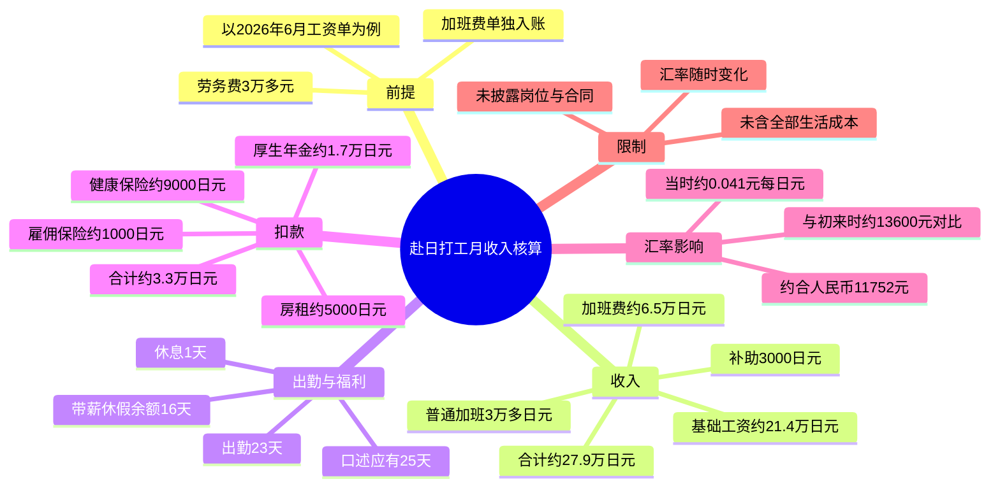
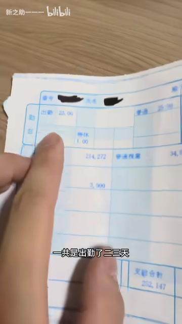

# 花三万多劳务费来日本打工，这个工资怎么样？

> 来源：[Bilibili 视频](https://www.bilibili.com/video/BV1zET468E6B)<br>
> UP 主：新之助一一一｜发布时间：2026-07-03｜视频时长：01:52｜标签：日本、日本生活、工作

## 小结

视频以 UP 主本人 **2026 年 6 月的工资单与加班费入账卡**为例，讨论“支付 3 万多元劳务费赴日打工是否值得”。核心不是泛泛介绍赴日工作，而是展示一份具体月度收入的构成：出勤、基础工资、普通加班、补助、带薪休假余额、保险与住房等扣款，以及加班费的独立到账。

按视频口述，UP 主 6 月出勤 23 天、休息 1 天；基础工资约为 **21.4 万日元**，普通加班收入“3 万多日元”，另有 3,000 日元补助。工资单部分扣除雇佣保险、健康保险、厚生年金和房租后，到手约 **21.8 万日元**；另有约 **6.5 万日元加班费**在另一张卡中于 6 月 30 日到账。二者相加，UP 主称合计约 **27.9 万日元**。

视频按当时约 **1 日元≈0.041 元人民币**的汇率估算，27.9 万多日元约合 **11,752 元人民币**。UP 主同时以自己“刚来日本时”的换汇结果作对比，称同样日元收入当时约可换得 13,600 元人民币，当前少约两三千元。这说明视频重点之一是：**日元工资本身与人民币实际换算收入必须分开看，汇率会显著改变结论。**

对于考虑通过劳务中介赴日工作的人，视频提供了一个可复核工资单时应关注的项目清单：基础工资、加班费是否分开发放、各类保险与年金扣款、住宿成本、带薪休假余额，以及最终汇率。它没有披露岗位、时薪、合同期限、税前总额、通勤费、水电费、伙食费和劳务费具体支付结构，因此不能据此推导所有赴日岗位的待遇水平。

所有工资、汇率与“值不值得”的判断均具有明确时效性：视频对应的是 **2026 年 6 月工作、6 月 30 日加班费入账**，且人民币换算采用视频录制日附近的汇率。评论中的工时推算和行业评价属于观众补充意见，不应当替代工资单或劳动合同核验。

## 思维导图




## 目录

- [背景与问题](#背景与问题-0046)
- [工资单与收入构成](#工资单与收入构成-0046)
  - [出勤、基础工资与带薪休假](#出勤基础工资与带薪休假-0046)
  - [扣款与工资单到手金额](#扣款与工资单到手金额-0048)
  - [独立发放的加班费与月度合计](#独立发放的加班费与月度合计-0112)
- [汇率换算与“是否值得”](#汇率换算与是否值得-0136)
- [核算步骤与实务检查项](#核算步骤与实务检查项-0046)
- [结论与限制](#结论与限制-0136)
- [关键帧索引](#关键帧索引)
- [字幕比对](#字幕比对)
- [评论分析](#评论分析)
- [处理记录](#处理记录)

## 背景与问题 [00:46](https://www.bilibili.com/video/BV1zET468E6B?t=46)

视频在可识别语音开始处提出问题：支付“3 万多”劳务费赴日打工后，一个月到底能赚多少。UP 主使用自己的上月工资材料进行说明，并明确说工资单对应 **6 月工作情况**，加班费则进入另一张卡。

这里的“一个月赚多少”在视频里至少包含两个层次：

1. **工资单净额**：工资单上经保险、年金、房租等扣减后的金额；
2. **加班费入账**：单独在另一张卡中发放的加班金额；
3. **人民币购买力视角**：将日元合计按当日汇率换算成人民币。

因此，若只看到工资单“到手约 21.8 万日元”，会漏掉视频所说的独立加班费；若只看“约 1.18 万元人民币”，又会忽略该金额受汇率影响，而不是固定薪资标准。


> 图：画面中 UP 主一手持卡、一手持工资材料，并说明“加班的钱还是在这张卡上边”。这张关键帧直接支撑了视频中“工资单与加班费并非同一笔入账”的信息，避免将工资单净额误认为完整月收入。

## 工资单与收入构成 [00:46](https://www.bilibili.com/video/BV1zET468E6B?t=46)

### 出勤、基础工资与带薪休假 [00:46](https://www.bilibili.com/video/BV1zET468E6B?t=46)

UP 主口述的 6 月工作与工资单信息包括：

| 项目 | 视频口述 / 画面信息 | 说明 |
| --- | --- | --- |
| 出勤天数 | 23 天 | UP 主称“出勤了 23 天”。 |
| 休息天数 | 1 天 | 为视频口述，未展示完整排班表。 |
| 基础工资 | 约 214,000 日元 | 画面可见工资单中约 214,272 的数值；ASR 识别为“214,000”，因此正文以“约 21.4 万日元”表述。 |
| 普通加班 | 3 万多日元 | 视频未在可用字幕中给出可完全确认的精确数值。 |
| 补助 | 3,000 日元 | UP 主口述“补助了 3000”。 |
| 带薪休假余额 | 16 天 | UP 主称此次又增加几天后，目前有 16 天。 |
| 应有带薪休假 | 25 天 | UP 主口述“应该给 25”，但未说明计算周期、已使用天数或制度依据。 |



> 图：关键帧聚焦工资单的出勤与金额栏位，UP 主手指指向相关区域，画面字幕可见“出勤了二三天”。它是核对视频所述出勤天数、基础工资与工资单材料对应关系的主要视觉依据。

关于带薪休假，视频只提供“现有 16 天、应该给 25 天”的个人陈述，无法仅凭此判断雇主是否少给、是否已使用部分假期，或是否受入职时间、合同类别及法定规则影响。该部分应在劳动合同、出勤记录和休假台账中核验。

### 扣款与工资单到手金额 [00:48](https://www.bilibili.com/video/BV1zET468E6B?t=48)

UP 主表示工资单的扣款“不少”，并依次提到：

| 扣款项目 | 视频口述金额 | 备注 |
| --- | ---: | --- |
| 雇佣保险 | 约 1,000 日元 | ASR 可识别。 |
| 健康保险 | 约 9,000 日元 | ASR 中“健康保际”为识别误差，结合上下文应为“健康保险”。 |
| 厚生年金 | 约 17,000 日元 | ASR 将“一万七”压缩识别为“17”；应保留为约 1.7 万日元的上下文校正，不据此延伸具体制度结论。 |
| 房租 | 约 5,000 日元 | 视频口述。 |
| 扣款合计 | 约 33,000 日元 | UP 主给出的合计。 |
| 工资单到手 | 约 218,000 日元 | 视频口述“合计到手里边 218,000”。 |

上述单项按口述近似相加约为 3.2 万日元，与 UP 主所称“扣了 3.3 万”存在约千元量级差异。这可能来自口述取整、ASR 数字识别误差，或未被完整说出的扣款项；现有素材不足以确认原因，不能将其直接视为工资单错误。


> 图：画面放大工资单中间至右侧的金额与扣除栏位，UP 主用手指示意“普通加班的钱给了三万多”。该帧的价值在于展示视频并非纯口述，而是基于纸质工资单逐栏解释；但受清晰度与遮挡限制，不能仅据画面逐项确认所有精确数字。

### 独立发放的加班费与月度合计 [01:12](https://www.bilibili.com/video/BV1zET468E6B?t=72)

UP 主进一步说明，加班费并不全部体现在前述工资单净额中，而是另有一笔“6500 多块钱”的金额在另一张卡上发放，并称该笔款项于 **6 月 30 日**到账。结合后文的日元总额与人民币换算语境，这里的“6500 多”应理解为约 **6.5 万日元**；但 ASR 文本没有稳定保留“万”字，故应将其视为基于上下文的校正，而非逐字无误的原始转写。

视频的汇总关系可按 UP 主口径整理为：

```text
工资单到手金额（约 218,000 日元）
+ 另一张卡的加班费（约 65,000 日元）
≈ 普通工资与加班费合计（约 279,000 日元）
```

需要注意，视频称“普通工资加上加班费”共 27.9 万多日元，但其实际使用的第一项是已扣款后的“到手”金额，而非严格意义上的税前普通工资。因此更准确的描述是：**工资单净额加上单独到账的加班费，合计约 27.9 万日元。**

## 汇率换算与“是否值得” [01:36](https://www.bilibili.com/video/BV1zET468E6B?t=96)

UP 主以“今天的汇率”将约 27.9 万日元换算为人民币，口述汇率约为 **4.1**。在日元兑人民币的日常表达里，此处结合其最终换算结果，应理解为约 **100 日元兑 4.1 元人民币**，即约 **1 日元兑 0.041 元人民币**。

视频给出的换算结果为：

| 项目 | 视频数值 |
| --- | ---: |
| 日元合计 | 约 279,000 多日元 |
| 采用汇率 | 约 100 日元 = 4.1 元人民币 |
| 换算结果 | 约 11,752 元人民币 |
| UP 主刚赴日时的对照结果 | 约 13,600 元人民币 |
| 汇率造成的差额感受 | 少约 2,000～3,000 元人民币 |

按视频的近似数字验证，279,000 × 0.041 = 11,439 元人民币，与其口述的 11,752 元存在差异；若日元总额为 279,000 多、且实际采用汇率略高于 0.041，则可接近该结果。由于视频使用的是口头近似汇率，且工资合计也是“27.9 万多”，不应将 11,752 元理解为可精确复算到个位的固定结论。

视频最后没有给出明确的“值得”或“不值得”结论，而是向观众提问。其表达的个人判断重点是：在日元收入不变或变化不大的情况下，日元汇率走低会使人民币换回收入明显下降，从而改变前期支付劳务费的回本预期。

## 核算步骤与实务检查项 [00:46](https://www.bilibili.com/video/BV1zET468E6B?t=46)

视频展示的是一种个人工资核算思路。依据其实际顺序，可整理为以下检查流程：

1. **区分工资单与其他入账账户**  
   确认基础工资、补助、加班费是否全部在同一份工资单中体现。视频案例中，加班费单独进入另一张卡，不能只查看工资单净额。

2. **核对出勤与休息记录**  
   记录出勤天数、休息天数，并与工资单中的工作日或工时项目交叉验证。视频披露的是出勤 23 天、休息 1 天，但未给出完整工时表。

3. **拆分收入项目**  
   将基础工资、普通加班、补助、独立发放的加班费分别列出。视频中基础工资约 21.4 万日元、普通加班约 3 万多日元、补助 3,000 日元，另有约 6.5 万日元独立加班费。

4. **逐项审阅扣款**  
   至少识别雇佣保险、健康保险、厚生年金、住宿或房租等。对“扣款合计”应做加总校验；若口述数字与合计有小差异，应回到工资单原件确认，而不是根据字幕自行补数。

5. **计算实际到账合计**  
   使用“工资单实发净额 + 其他账户已到账加班费”，而非简单用税前项目相加。视频示例约为 21.8 万 + 6.5 万 = 27.9 万日元。

6. **按明确日期的汇率换算**  
   记录汇率来源、日期与报价单位，例如“100 日元兑多少人民币”。不要把一次换算结果当成长周期稳定收入；汇率变化会显著影响人民币口径的回本时间。

7. **把劳务费与持续成本纳入回本判断**  
   视频只提出支付 3 万多劳务费的前提，并未计算回本月数。若要自行计算，应另行确认劳务费是否包含签证、培训、交通等项目，并加入水电、餐食、通勤、通信、税费变化及回国成本，避免只以“月到账人民币”判断。

## 结论与限制 [01:36](https://www.bilibili.com/video/BV1zET468E6B?t=96)

这是一份个人样本的工资展示，而不是日本打工收入的普遍标准。视频中可确定的主要信息是：UP 主以 2026 年 6 月工资材料说明，工资单净额约 21.8 万日元、另有约 6.5 万日元加班费，总计约 27.9 万日元；按其录制时所用汇率，约合人民币 11,752 元。

可迁移的经验是，评估境外工作收入时应同时看：

- **收入是否包含全部加班费**；
- **保险、年金、住宿等扣款后的实际到账额**；
- **出勤天数与实际工时是否匹配**；
- **带薪休假等非现金福利的记录**；
- **汇率变化对人民币回本周期的影响**；
- **劳务费之外尚未被纳入的生活与迁移成本**。

现有素材的主要限制如下：

- 未说明具体工种、雇主、工作地点、合同期限、技能类别或签证/在留资格；
- 未提供完整工资单、工时明细或银行流水，无法独立核实每项金额；
- 未给出时薪、加班小时数及加班费倍率，不能判断加班计算是否符合约定；
- 未披露水电、餐食、交通、通信等完整生活支出；
- “3 万多劳务费”没有拆分服务内容、支付方式及是否可退；
- 汇率为视频录制日附近的口述值，随后会变化；
- 视频发布日期为 2026-07-03，工资单对应 2026 年 6 月，不能直接用于判断其他月份或当前汇率下的收入。

## 关键帧索引

| 关键帧 | 正文位置 | 画面内容 | 选择价值 |
| --- | --- | --- | --- |
|  | 背景与问题 | UP 主展示工资材料与卡片 | 证明视频区分工资单和加班费入账卡。 |
|  | 出勤、基础工资与带薪休假 | 工资单局部，手指指向出勤及金额区域 | 支撑“出勤 23 天”和基础工资约 21.4 万日元的讨论。 |
|  | 扣款与工资单到手金额 | 工资单金额、加班及扣除栏位局部 | 有助于理解 UP 主如何逐项说明普通加班与扣款。 |

其余关键帧未在正文中重复插入：素材提供的画面主要为同一段口播及工资材料近景。为避免同类画面堆叠，正文选取了最能对应“材料展示—出勤基础工资—加班/扣款”三类信息的帧。

## 字幕比对

| 字幕来源 | 完整性 | 专有名词 / 数字 | 时间轴 | 主要问题 |
| --- | --- | --- | --- | --- |
| Bilibili 站内字幕 | 未提供可用字幕 | 无法比对 | 无可用时间轴 | 素材明确标注“未提供可用站内字幕”。 |
| 本次 ASR 字幕 | 有 4 个语音分段，诊断覆盖约 65.41 秒、占全片约 58.44% | 部分数字与术语存在压缩或错识别，如“健康保际”“后生年金17”“6500多” | ASR JSON 分段起点为 00:46.280、00:48.380、01:12.470、01:36.520 | 每段文本过长；提供的 SRT 结束时间与 ASR JSON 分段结束时间不一致，且部分文字疑似跨段拼接。 |

本次检查结果如下：

- **站内字幕**：未提供可用文件，因此无法进行逐句校正或合并。
- **ASR 音轨状态**：`asr-result.json` 的诊断中未标记 `noAudioStream=true`；素材同时提供了 `audio/audio.wav`，并成功识别出中文语音。因此本片有可供识别的音轨，不能将字幕问题归因于“无音轨”。
- **最终字幕选择**：以本次 ASR 的 **JSON 分段起始时间**作为时间轴依据；正文采用 ASR 口述内容，并用工资单关键帧与上下文校正明显错误或不完整的词语。
- **时间轴异常处理**：ASR JSON 的第 2～4 段结束时间分别为 01:12.470、01:36.520、01:51.690；但给出的 SRT 将相同文本显示为更长、互相衔接的区间。两者存在不一致，故章节链接只取各段共同可确认的起始时刻，不使用存在冲突的结束时间。
- **重要校正**：
  - “健康保际”按上下文记为“健康保险”；
  - “后生年金17”按日本工资扣款常用名称与上下文记为“厚生年金约 1.7 万日元”，但未将其扩展为制度合规结论；
  - “6500 多块钱”结合总额约 27.9 万日元、前述工资单净额约 21.8 万日元及画面中“加班的钱”语境，记为“约 6.5 万日元加班费”，并明确该“万”字不是 ASR 稳定保留的原文；
  - “214,000”与画面中可见约 214,272 的金额存在细微差异，统一表述为“约 21.4 万日元”。

## 评论分析

以下仅处理可获取的热评前三条。评论是观众观点或自行计算，未与原始合同、工时表、工资单完整项目逐项核验，不能直接当作事实结论。

### 1. @昨夜风前已赐绯（415 赞）

该评论依据视频画面自行列式：`192 - 8 + 25 + 42 = 251`，推断 UP 主 6 月实际工时为 251 小时、23 个出勤日平均约每日 10.9 小时；并采用“实际到手 279,213 日元、约 11,696 元人民币”的口径，认为这是其在 B 站见过的较好研修生岗位之一。

**补充价值：**

- 尝试从工资单中的项目还原工时，而不是只看月收入；
- 提醒评价待遇时还应考虑单间住宿及扣除房租、水电后的净收入；
- 与视频“27.9 万多日元、约 1.17 万元人民币”的大方向接近。

**限制与争议：**

- `192 - 8 + 25 + 42` 各数字的工资单字段来源、单位和计算规则未在视频中完整说明；
- 视频没有明确公布 251 小时及其构成，故“每天 10.9 小时”属于评论者推算；
- “好单子”“研修生”均为评价或身份判断，视频本身未充分提供比较样本、劳动强度、合同福利和岗位类别，不能据此定论。

### 2. @呆A毛（71 赞）

该评论质疑只用工资高低评价工作，提出应同时询问：上班天数、劳保用品、用工环境，以及是否类似国内的工作条件。

**补充价值：**

- 与视频只披露工资材料的局限形成互补；
- 指出待遇评估不能只看名义或换算后工资，还应纳入劳动保护、劳动环境和工作组织方式；
- 对应本文的核验建议：应查合同、工时、岗位风险、住宿条件和生活成本。

**限制与争议：**

- 评论未提供该岗位的实际劳保用品、工作环境或国内对照证据；
- 它提出的是评价框架，不是对 UP 主岗位条件的事实补充。

### 3. @锅爱豆（23 赞）

该评论回忆 1995 年其长笛老师赴日演出后提及“日本法定最低工资 17 万日元”，并感叹 2026 年仍是类似水平。

**补充价值：**

- 反映观众将视频收入与历史工资、最低工资概念做比较的讨论方向；
- 提醒讨论“工资高低”时，需要区分最低工资、月薪、实际工时和地区差异。

**限制与争议：**

- 该内容是个人转述的历史记忆，未提供地区、行业、工时基准或法规来源；
- 日本最低工资通常以小时额等口径规定，不能直接用“17 万日元/月”与视频的净收入或含加班收入横向比较；
- 因此该评论不构成对视频工资水平的有效历史数据验证。

## 处理记录

- Worker ID：`worker-mrj0www4-e8d79408`
- 模型：`gpt-5.6-terra`
- 可用素材与工具产物：视频元数据、`merged.mp4`、`audio/audio.wav`、本次 ASR 结果 `asr/asr-result.json`、ASR SRT `asr/transcript.srt`、12 张关键帧、热评数据 `comments/comments.json`。
- 字幕检查与选择：检查站内字幕，结果为未提供可用字幕；检查本次 ASR，确认有中文语音识别结果，且未标记 `noAudioStream=true`。最终采用 ASR JSON 的分段起始时间生成时间轴，并以关键帧与上下文校正术语和部分数字。
- 关键帧选择依据：选择 `frame-002.jpg` 展示工资材料与独立加班费卡，`frame-003.jpg` 对应出勤/基础工资说明，`frame-004.jpg` 对应普通加班与扣款栏位；三帧分别覆盖视频的核心证据链，避免插入内容重复的口播画面。
- 评论处理范围：仅分析成功获取的热评前三条，未扩展至其他评论或将评论数字当作已验证事实。
- 缓存清理：素材清单未提供缓存清理执行日志；本记录不虚构已清理结果，缓存是否已清理由任务运行环境另行确认。
- 未解决问题：未能从现有素材确认具体岗位、合同、工时明细、加班倍率、完整生活支出及劳务费构成；ASR JSON 与 SRT 的部分结束时间不一致，故未将冲突的结束时间用于章节定位。
