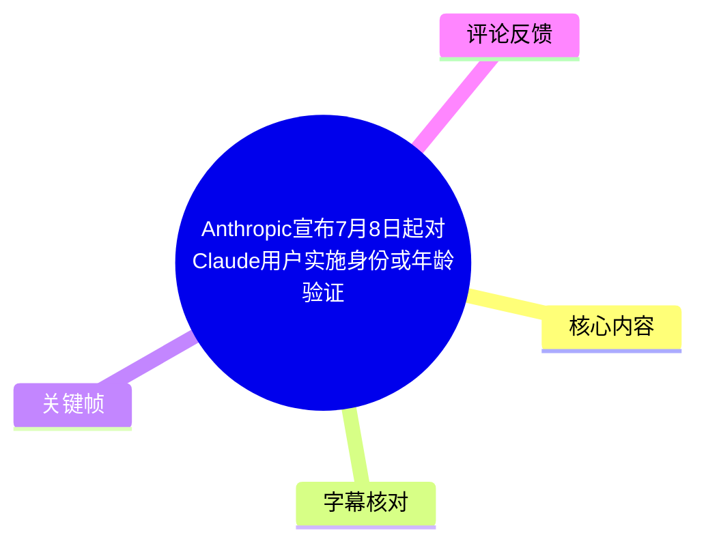
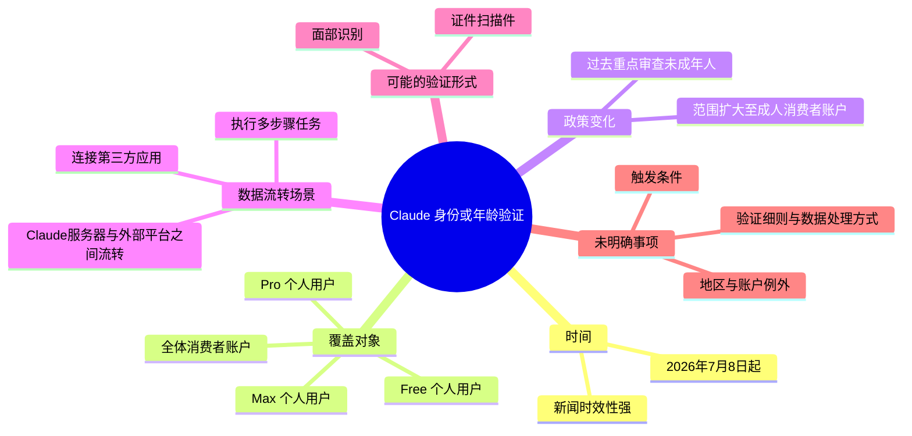
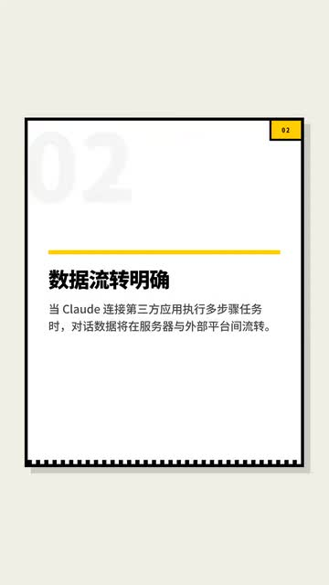

# Anthropic宣布7月8日起对Claude用户实施身份或年龄验证

> 来源：[Bilibili 视频](https://www.bilibili.com/video/BV1yPLQ6xELj) 
> UP 主：deephub｜视频时长：00:33｜画面规格：1080×1920（竖屏） 
> 标签：人工智能、Claude、AI

## 小结

视频转述了一项与 Anthropic 旗下 AI 助手 Claude 有关的隐私与账户验证调整：自 **2026 年 7 月 8 日起**，部分 Claude 用户可能需要进行年龄或身份验证。视频强调，这项规则覆盖 Free、Pro、Max 三类个人用户，而不再仅限于未成年人审查场景。

视频进一步提示：当用户让 Claude 连接第三方应用并执行多步骤任务时，对话数据可能在 Claude 服务器与外部平台之间流转。该信息的重点不在于描述具体技术协议，而在于提醒用户注意跨平台任务带来的数据处理边界。

视频所述验证方式包括上传证件扫描件或进行面部识别，但使用“可能”表述，且明确说明**具体在什么条件下触发验证尚未说清楚**。因此，不能把视频中的两种方式理解为所有用户均必经、已经公布的固定流程。

这是一则时效性较强的短新闻，适合 Claude 个人账户用户、关注 AI 隐私政策与第三方连接能力的用户阅读。视频没有给出 Anthropic 原始政策链接、地区适用范围、数据保留规则、验证服务商或申诉渠道；这些均需以 Anthropic 后续正式条款和实际产品界面为准。

## 思维导图

## 目录

- [新闻背景与适用范围](#新闻背景与适用范围)
- [核心信息：验证范围扩大](#核心信息验证范围扩大)
- [数据流转与验证方式](#数据流转与验证方式)
- [用户应如何理解与准备](#用户应如何理解与准备)
- [结论、限制与时效性](#结论限制与时效性)
- [字幕比对](#字幕比对)
- [评论分析](#评论分析)
- [处理记录](#处理记录)

## 新闻背景与适用范围 [00:00](https://www.bilibili.com/video/BV1yPLQ6xELj?t=0)

视频在开头将该消息定义为“重磅消息”，核心陈述是：Anthropic 宣布 Claude 用户将自 **7 月 8 日起**开始进行身份或年龄验证。结合视频标题和简介，视频指向的年份为 **2026 年**。

需要区分以下三个层次：

1. **视频陈述**：Anthropic 将调整 Claude 的相关隐私策略，并计划对部分用户实施年龄或身份验证。
2. **视频给出的范围信息**：Free、Pro、Max 的所有个人用户均在新规覆盖范围内。
3. **尚未得到视频展开的信息**：哪些国家或地区适用、所有账户是否都会触发、验证失败如何处理，以及企业团队账户是否属于同一规则范围。

视频时长仅 33 秒，属于新闻速报性质，不包含原始公告的逐条解读。因此，下文将“覆盖全部个人用户”理解为视频的转述内容，而不延伸为对所有 Claude 产品、地区或组织账户的确定性结论。

## 核心信息：验证范围扩大 [00:06](https://www.bilibili.com/video/BV1yPLQ6xELj?t=6)

视频明确指出，规则变化的关键在于审查对象从未成年人扩展至更广泛的消费者账户：

| 项目 | 视频中的说法 | 可据此确认的含义 |
| --- | --- | --- |
| 既往重点 | “以前只查未成年人” | 视频将此前规则概括为以未成年人审查为主。 |
| 新规范围 | “扩大到了全体消费者账户” | 视频认为个人消费者账户的覆盖面扩大。 |
| 订阅层级 | Free、Pro、Max | 视频点名三种 Claude 个人账户层级。 |
| 生效节点 | 7 月 8 日起 | 结合标题与简介，指向 2026 年 7 月 8 日。 |
| 验证目的 | 确认身份或年龄 | 视频没有进一步区分不同情形会采用哪一种验证。 |

这里的“身份或年龄验证”不等同于“每位用户都必须提交身份证件”。视频后续使用了“可能得上传”“具体什么时候触发还没说清楚”等限定语，说明它没有提供一套确定、统一且无条件触发的操作规则。

## 数据流转与验证方式 [00:15](https://www.bilibili.com/video/BV1yPLQ6xELj?t=15)

视频将验证议题与 Claude 的第三方应用连接、多步骤任务能力联系起来。其描述的场景是：用户让 Claude 连接第三方应用并执行多步骤任务时，对话数据可能在 Claude 服务器与外部平台之间流转。

> 图：该关键帧以“数据流转明确”为标题，写明“当 Claude 连接第三方应用执行多步骤任务时，对话数据将在服务器与外部平台间流转”。它直接对应视频中最重要的隐私提示，能够帮助读者将“验证”与“跨平台任务中的数据处理”这两个议题关联起来。图片未展示具体平台、接口、传输协议或保留期限，因此不能据此推断实际数据路径的完整技术细节。

### 视频提到的可能验证手段

视频列举了两种可能的确认方式：

- **上传证件扫描件**；
- **进行面部识别**。

这两项均是视频中的可能性描述，而非已经明确公布的必选项。视频没有说明：

- 证件类型、支持的签发地区或文件格式；
- 面部识别是否为活体检测、是否可替代证件验证；
- 验证由 Anthropic 自行完成还是由第三方服务商处理；
- 验证材料的保存期限、删除机制和复核流程；
- 验证不通过、拒绝验证或误判时的账户影响。

### 技术边界：视频没有提供的内容

“连接第三方应用”“多步骤任务”“服务器与外部平台之间流转”是业务层面的流程描述。视频未披露 API 授权模型、OAuth 权限范围、加密方式、日志策略、数据最小化措施或第三方平台清单。

因此，较稳妥的理解是：当用户主动启用涉及外部服务的 Claude 任务时，应额外留意授权页面、可访问的数据范围和目标平台；但不能仅凭本视频断定所有普通 Claude 对话都会被发送到第三方平台。

## 用户应如何理解与准备 [00:24](https://www.bilibili.com/video/BV1yPLQ6xELj?t=24)

视频没有提供实际操作演示、设置页面或操作步骤。基于视频已经明确的内容，用户只能进行如下**条件式准备**，而非执行一套已确认的验证流程：

1. **确认账户类型**  
   若使用的是 Claude Free、Pro 或 Max 个人账户，应关注后续账户通知与官方政策更新。视频将这三类账户列入覆盖对象。

2. **审视第三方连接使用情况**  
   如果使用 Claude 连接第三方应用并执行多步骤任务，应关注所授予的权限，以及任务是否需要向外部平台传递对话中的内容。

3. **谨慎对待敏感验证材料**  
   若产品界面实际要求提交证件扫描件或面部验证，应先确认请求来自官方站点或官方应用，阅读当时展示的数据处理说明；视频并未提供可核实的上传入口或材料规则。

4. **等待触发条件与细则明确**  
   视频明确表示触发时点“还没说清楚”。在此之前，无法根据视频判断某个账户会在登录、订阅、调用第三方服务还是其他环节被要求验证。

5. **避免过度推断数据流转范围**  
   视频仅指出第三方应用、多步骤任务场景下“可能”发生服务器与外部平台之间的数据流转。没有材料表明所有 Claude 使用情形都具有相同数据路径。

## 结论、限制与时效性 [00:29](https://www.bilibili.com/video/BV1yPLQ6xELj?t=29)

这条短视频的核心价值是提示 Claude 用户关注三项变化：**2026 年 7 月 8 日这一时间节点、个人账户覆盖范围扩大、以及连接第三方应用时的潜在数据流转**。

视频最后以“为了安全多这一步验证值得吗”向观众提问，反映出议题本身存在平衡关系：

- 一方面，年龄或身份验证可能被用于落实年龄门槛、账户安全或平台合规要求；
- 另一方面，证件扫描和面部识别会提高用户对隐私、数据留存、误判以及使用门槛的关注。

但以上第一方面的具体政策目的并未被视频展开说明，不能替 Anthropic 赋予未经材料支持的动机。视频能确认的仅是：其将这项新规置于安全与数据流转的讨论框架中。

### 关键限制

- 视频未提供 Anthropic 原始公告、政策全文或官方帮助文档链接。
- “7 月 8 日起”虽在标题、简介和字幕中一致出现，但具体年份以简介中的“2026 年”为依据。
- 视频未说明验证的准确触发条件。
- 视频未说明地区差异、未成年人以外的豁免条件、团队/企业账户规则。
- 视频未给出验证资料的存储、处理方、保存期限或删除规则。
- 无法从视频判断该政策在发布后是否已修订、延期或按地区分批实施。

因此，本条内容适合作为政策变化线索和风险提醒，不应替代用户在实际验证前阅读当期官方条款与隐私说明。

## 字幕比对

本次任务已执行 ASR，并与 Bilibili 站内字幕进行比对。

| 字幕来源 | 完整性 | 专有名词 | 时间轴 | 主要问题 |
| --- | --- | --- | --- | --- |
| Bilibili 站内字幕 | 较完整，包含 Free、Pro、Max、数据流转、证件扫描件、面部识别和触发条件未明等关键信息 | “ANTHROPIC”正确；“cloud”应结合标题、简介和上下文校正为“Claude” | 未提供逐句时间戳 | 英文产品名大小写/拼写不规范；“消费者账户以后”存在断句问题 |
| 本次 ASR 字幕 | 不完整，中间遗漏了 Free、Pro、Max 覆盖范围等内容 | 将 Anthropic 识别为“Anthropec”，将 Claude 识别为“Cloud” | 未提供逐句时间戳 | 存在漏转、重复词、乱码“扫�”、繁简混用，以及末句缺少“具体什么时候触发还没说清楚”等关键限定 |

### 最终字幕选择

正文以**站内字幕为主**，并以标题、视频简介和关键帧作交叉校正；ASR 用于确认视频整体叙述顺序及核对站内字幕是否存在明显缺失。

校正结果如下：

- `ANTHROPIC` / `Anthropec`：统一记为 **Anthropic**。
- `cloud` / `Cloud`：根据视频标题、简介及 Claude 产品语境，统一记为 **Claude**。
- ASR 中“证件扫�”残缺：依据站内字幕，补全为“证件扫描件”。
- 关于“Free、Pro、Max 所有个人用户”“触发条件未明确”等关键信息，仅站内字幕提供完整表述，正文采用站内字幕版本。
- 关键帧中的“Claude”“第三方应用”“多步骤任务”“服务器与外部平台间流转”与站内字幕表述一致，可用于支持数据流转段落的文字校对。

## 评论分析

本次仅获取到 2 条热评，少于“热评前三条”的最大处理数量；因此仅分析可获得的两条，不补充或推测不存在的第三条。

| 热评 | 点赞 | 观点概括 | 补充信息与可信度 |
| --- | ---: | --- | --- |
| 八小时不摸鱼的大冤种：“有啥必要[笑哭]” | 0 | 对身份/年龄验证的必要性表示质疑。 | 这是态度表达，呼应视频末尾“安全与额外验证是否值得”的提问；未提供事实依据、政策细节或实际使用经验。 |
| 小晓龍人：“我有闲鱼[星星眼][星星眼][星星眼]” | 0 | 内容较简短，未直接说明与 Claude 验证政策的具体关联。 | 未提供可验证的补充信息，可能是玩笑、个人情境表达或与其他话题的联想，不能作为政策解释或用户解决方案。 |

评论区中没有出现对政策来源、验证流程、地区差异或实际触发经历的可验证补充。两条评论点赞数均为 0，也不应据此推断其代表性。

## 处理记录

- Worker ID：worker-mrj0wjed-b0c290ad
- 模型：gpt-5.6-terra
- 调用工具与素材：视频元数据、素材清单、Bilibili 站内字幕、本次 ASR 字幕、热评数据、关键帧 `frames/frame-001.jpg`
- 使用的应用工具：素材解析与字幕比对；本次任务已提供 ASR 执行结果
- 字幕选择：以站内字幕为主；使用标题、简介、关键帧及 ASR 上下文校正 Anthropic、Claude、“证件扫描件”等词。ASR 因漏转与乱码未作为主文本来源。
- 关键帧选择依据：仅提供 `frame-001.jpg`；画面直接呈现“数据流转明确”及 Claude 连接第三方应用执行多步骤任务时的数据流转说明，与正文核心隐私议题高度匹配。
- 评论处理范围：请求上限为热评前三条，实际仅获取 2 条，已全部处理。
- 缓存清理：未提供缓存清理日志或结果，无法确认是否完成缓存清理。
- 未解决问题：未提供 Anthropic 原始政策文本、验证触发条件、地区适用范围、验证资料处理规则、企业账户规则及政策后续变更情况。
