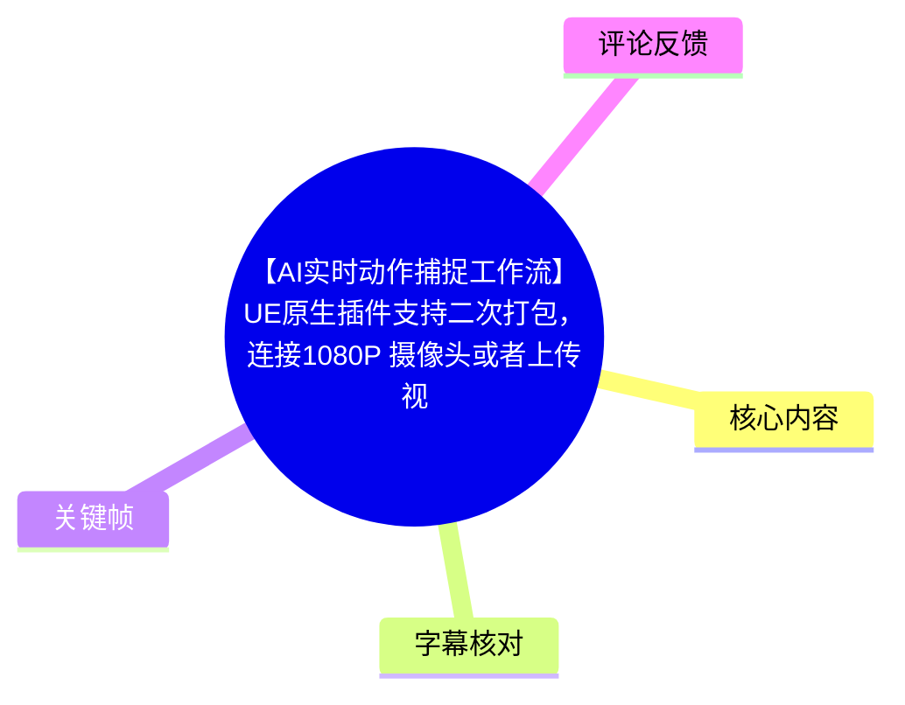
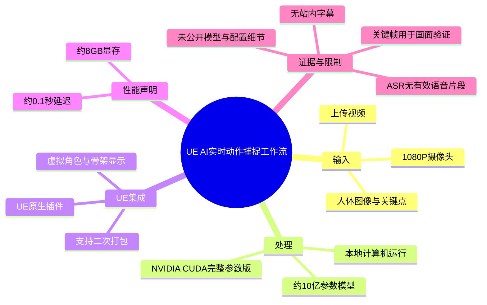
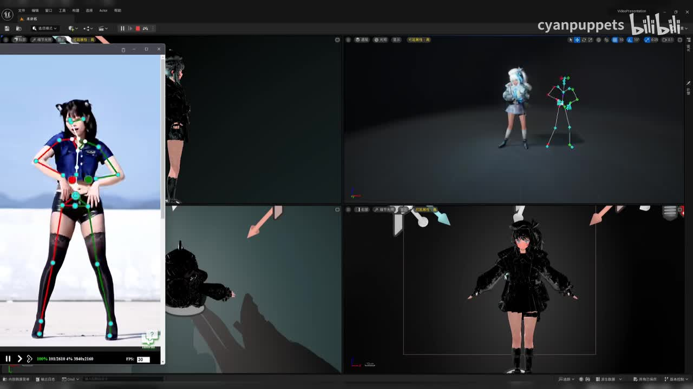
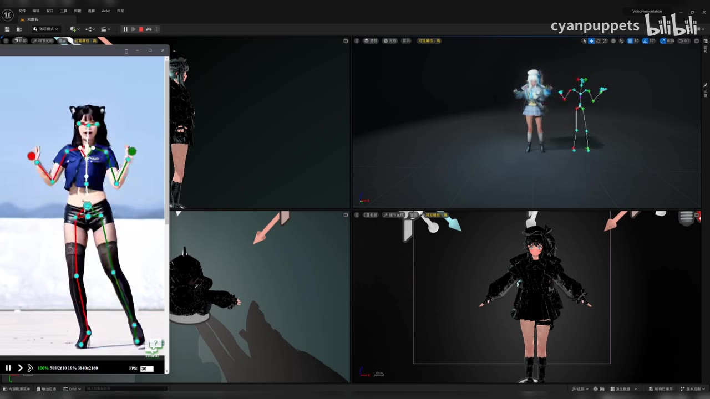
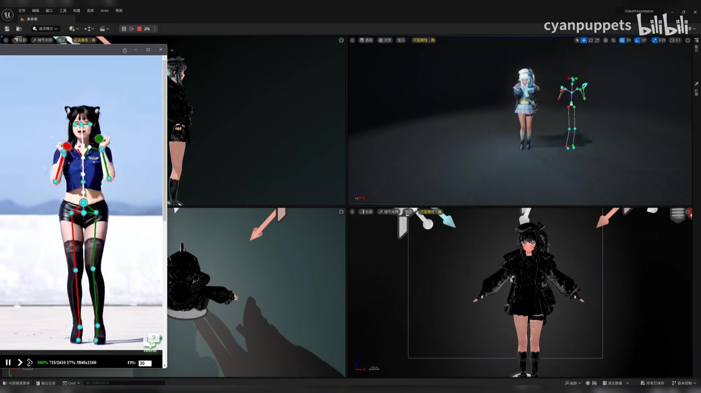
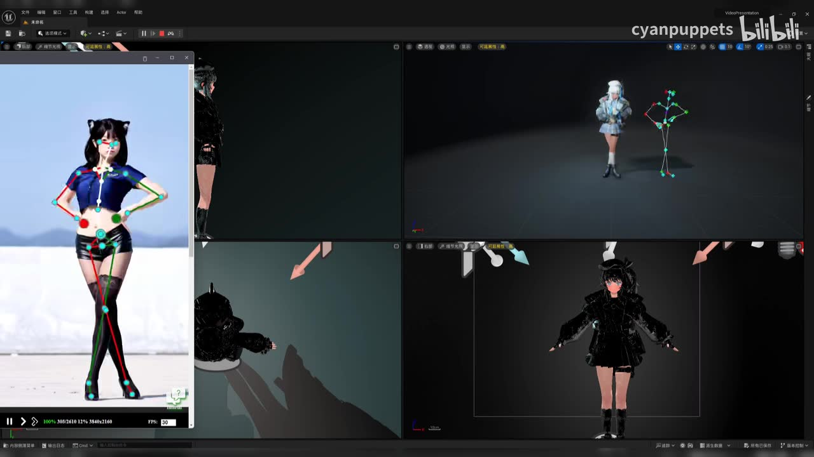

## 小结

视频展示了一套面向 Unreal Engine（UE）的 AI 实时动作捕捉工作流。画面同时呈现：左侧的人体视频与关键点骨架、右上角的 UE 角色及对应骨架、右下角的角色主视图，直观说明输入人体动作能够被映射到虚拟角色。

根据视频标题与简介，作者宣称该方案采用 **UE 原生插件**，支持再次打包；输入既可以是 **1080P 摄像头**，也可以是上传的视频文件。完整参数版本目前仅支持 **NVIDIA CUDA**。

标题给出的性能与硬件信息为：本地电脑运行约 **10 亿参数模型**，需要约 **8GB 显存**，用于实时处理时的延迟约 **0.1 秒**。这些是作者的项目陈述，不等同于已在不同显卡、分辨率、人物数量、UE 项目复杂度下完成的独立性能验证。

视频没有提供可用站内字幕；本次 ASR 虽检测到音频文件，但未识别出任何有效语音片段。因此，本文以标题、简介、元数据和关键帧画面为主要证据，不将画面中未清晰可辨的界面字段、算法名称或具体配置参数补写为事实。

适合读者：需要在 UE/UE5 项目中评估单目视频驱动虚拟角色、希望了解“摄像头/视频输入 → 姿态估计 → UE 角色驱动”展示形态的虚拟人、虚拟主播和 AI 动捕开发者。

## 思维导图

## 目录

- [项目定位与可确认信息](#项目定位与可确认信息)
- [画面展示：输入、骨架与 UE 角色联动](#画面展示输入骨架与-ue-角色联动)
- [工作流整理与实施步骤](#工作流整理与实施步骤)
- [性能参数、适用条件与限制](#性能参数适用条件与限制)
- [时效性与验证边界](#时效性与验证边界)
- [字幕比对](#字幕比对)
- [评论分析](#评论分析)
- [处理记录](#处理记录)

## [项目定位与可确认信息](https://www.bilibili.com/video/BV1aa9hBgELa?t=0)

视频标题为《【AI实时动作捕捉工作流】UE原生插件支持二次打包，连接1080P 摄像头或者上传视频，本地计算机运行10亿参数模型，需要8GB显存进行实时处理，延迟0.1秒，》。UP 主为 **cyanpuppets**，视频时长 **89 秒**，画面分辨率为 **1920×1080**。

可由标题、简介直接确认的项目主张如下：

| 维度 | 视频标题/简介中的信息 | 解读边界 |
| --- | --- | --- |
| 引擎集成 | UE 原生插件 | 未给出插件名称、UE 具体版本或安装步骤。 |
| 打包能力 | 支持二次打包 | 可理解为作者宣称该 UE 插件方案可进入后续打包流程；未展示打包命令、目标平台或产物。 |
| 输入 | 连接 1080P 摄像头，或上传视频 | 未说明支持的摄像头协议、视频封装格式、帧率或最大时长。 |
| 推理位置 | 本地计算机运行 | 没有证据表明依赖云端推理；但也未展示网络、离线许可证等细节。 |
| 模型规模 | 约 10 亿参数 | 未披露模型架构、权重来源、精度格式或是否包含检测/跟踪等前后处理模型。 |
| 显存要求 | 约 8GB 显存 | 是作者给出的运行门槛级表述，不能据此推导所有 8GB 显卡都能稳定达到相同性能。 |
| 实时性 | 延迟约 0.1 秒 | 未说明测量端点，无法判断其是否包含采集、推理、传输、UE 骨骼应用与渲染。 |
| 平台限制 | 完整参数版目前支持 NVIDIA CUDA | 这是明确的兼容性限制；未说明 AMD、Intel、Apple Silicon 或 CPU 路径的支持情况。 |

> **信息来源说明：** 由于没有可用字幕和有效 ASR 文本，本节参数均来自视频标题、简介及任务元数据，而非对口述内容的转写。

## [画面展示：输入、骨架与 UE 角色联动](https://www.bilibili.com/video/BV1aa9hBgELa?t=0)

关键帧显示的是一个多窗口 UE 工作界面，重点不是配置教学，而是以并列视图展示动作捕捉结果。可见的画面关系为：

1. **左侧输入视图**：一名人物的全身视频画面上叠加彩色关节点和骨架连线。
2. **右上结果视图**：场景中出现一个浅色服装的虚拟角色，以及与角色相邻的彩色骨架结构。
3. **右下角色视图**：黑色服装的虚拟角色处于正面站立或姿态展示状态。
4. **中下方辅助视图**：可见局部角色/场景画面，用于从不同视角观察角色或场景中的动作状态。

这些视图共同支持一个谨慎结论：视频演示了从人体图像中获取关节姿态，并在 UE 场景内以角色与骨架形式进行可视化的过程。画面本身未能证明骨骼重定向规则、关节自由度处理、脚底锁定、手指捕捉、面部捕捉或物理碰撞的具体实现质量。

> 图：该关键帧同时展示视频输入端的人体关键点、UE 场景中的角色与骨架结果，是理解“视觉姿态估计结果进入 UE”的核心证据。左侧关节覆盖层能确认方案至少输出了人体姿态点位；右侧并列窗口则说明结果被用于 UE 场景内的角色展示。

> 图：画面中的输入人物双臂姿态与右上方骨架姿态发生变化。它的价值在于说明视频不是仅展示静态绑定效果，而是以动作变化来演示姿态跟踪/驱动的可视化结果；但单张关键帧不足以量化同步精度或延迟。

> 图：输入人物抬起双臂，左侧关键点骨架和右上骨架也呈现相应的抬手状态。该帧适合观察关节级姿态表达，但无法由画面确认每个关节的名称、坐标系或置信度阈值。

## [工作流整理与实施步骤](https://www.bilibili.com/video/BV1aa9hBgELa?t=0)

视频未提供可转写的操作讲解、命令行、插件面板参数或完整工程配置。结合标题、简介与画面，能够整理出的**展示级工作流**如下；其中“画面可见”和“标题/简介说明”的内容均已标注，未出现的细节不作补充。

### 1. 准备输入源

- **标题/简介说明**：输入可以是 **1080P 摄像头**，也可以是**上传视频**。
- **画面可见**：左侧窗口使用人物全身画面作为输入，并叠加人体关键点与肢体连线。
- **尚未披露**：
  - 摄像头型号、接口与驱动；
  - 摄像头实际帧率；
  - 视频编码、分辨率上限和上传方式；
  - 单人/多人追踪能力；
  - 遮挡、出画、快速转身和低光场景下的处理策略。

### 2. 在本地执行人体动作估计

- **标题/简介说明**：模型在本地计算机运行，约为 10 亿参数规模。
- **画面可见**：输入人物上覆盖头部、躯干、手臂、腿部等关节点与连线，表明流程中存在人体姿态输出。
- **可谨慎推断**：将人物图像转化为关节结构，是把视频动作映射给虚拟角色的必要中间表示。
- **不可确认**：模型的具体名称、输入分辨率、是否使用 2D→3D 提升、是否有时序平滑、是否有 IK 解算，均未在素材中披露。

### 3. 将结果传入 UE 角色系统

- **标题/简介说明**：方案以 UE 原生插件形式集成，并支持二次打包。
- **画面可见**：UE 界面中有虚拟角色、彩色骨架与多个观察视图。
- **可确认的结果层级**：人体运动结果能够在 UE 场景中以角色和骨架可视化。
- **未展示的关键实施信息**：
  - 动作数据的传输方式，例如插件内部调用、网络协议或文件中转；
  - UE 中使用的 Anim Blueprint、Control Rig、IK Rig 或骨骼重定向资产；
  - MetaHuman、VRM 或自定义骨架的兼容范围；
  - 根运动、脚步滑动抑制与比例适配策略。

### 4. 在 UE 中观察与验证结果

画面使用多窗口布局，适合将以下对象进行同时对照：

- 输入视频中的人体动作；
- 输入端的关键点/骨架覆盖；
- UE 场景中的骨架；
- UE 角色的最终姿态。

这种对照对于工程调试尤其重要：如果输入关键点正确而角色动作异常，问题更可能位于骨骼映射、坐标轴、角色绑定或动画蓝图环节；如果输入关键点本身不稳定，则应优先排查视觉输入、检测模型或遮挡问题。这里是基于画面结构提出的调试经验，并非视频明确讲述的排障步骤。

> 图：该帧保留输入端、UE 角色端和骨架端的完整对照布局，适合作为调试流程中“源动作—中间骨架—最终角色”三层结果核验的示意。

## [性能参数、适用条件与限制](https://www.bilibili.com/video/BV1aa9hBgELa?t=0)

### 作者给出的性能口径

| 项目 | 作者陈述 | 使用时应注意 |
| --- | --- | --- |
| 模型规模 | 本地运行约 10 亿参数模型 | 参数量不直接等于显存占用、吞吐量或最终延迟；还会受权重精度、激活、批量大小与前后处理影响。 |
| 显存 | 约需 8GB 显存 | 这是标题级宣传参数，未附测试显卡型号、显存占用曲线或并发条件。 |
| 延迟 | 约 0.1 秒 | 未公开统计方法；不能确定是单次模型推理时延、端到端时延还是主观展示延迟。 |
| 输入 | 1080P 摄像头或视频 | 输入为 1080P 不代表模型必定以原始 1080P 直接推理，实际缩放与裁剪策略未公开。 |
| 加速平台 | 完整参数版目前支持 NVIDIA CUDA | NVIDIA CUDA 环境是已明确的前提条件；其他硬件平台不可默认可用。 |

### 实际部署前应验证的项目

以下事项是决定能否在项目中落地的关键，但视频素材没有给出答案，建议在获取插件或工程后实测：

1. **显卡型号与驱动组合**：8GB 显存是容量描述，无法替代对 CUDA 版本、显卡架构和驱动的兼容性确认。
2. **端到端延迟定义**：应分别记录摄像头采集、图像预处理、模型推理、动作映射、UE Tick/动画更新和渲染显示的耗时。
3. **帧率与稳定性**：关键帧仅显示输入窗口底部存在 `FPS: 30` 的可见读数，但其所属环节无法完全判定，不能直接等同于整个系统稳定输出 30 FPS。
4. **角色骨架适配**：不同角色的骨骼命名、骨骼比例、额外骨骼和关节限制会影响最终效果。
5. **复杂动作质量**：应单独测试交叉遮挡、坐姿、转身、跳跃、手部靠近身体、多人入镜和部分身体出画等条件。
6. **打包路径**：虽然作者声明支持二次打包，但仍需针对目标平台、GPU 运行时依赖、模型权重随包分发方式与授权要求进行验证。

## [时效性与验证边界](https://www.bilibili.com/video/BV1aa9hBgELa?t=0)

这是一段时长 89 秒的演示型视频，信息密度集中在功能主张与效果展示，未提供完整技术文档。对其内容应按以下层级使用：

- **可直接采信为“作者声称”**：UE 原生插件、支持二次打包、1080P 摄像头/上传视频输入、本地约 10 亿参数模型、约 8GB 显存、约 0.1 秒延迟、完整参数版目前支持 NVIDIA CUDA。
- **可由关键帧直接确认**：人物视频上存在关键点骨架覆盖；UE 场景中存在虚拟角色和骨架可视化；画面采用多视图对照。
- **不能从素材确认**：插件名称、模型名称、模型许可、UE 精确版本、Windows/Linux 支持范围、摄像头协议、可用显卡列表、精确端到端延迟、多人/手部/面部能力与商业授权条件。
- **时效性风险**：视频元数据显示抓取时间为 2026-07-15；简介中使用“目前支持 NVIDIA CUDA”的表述本身具有时效性。后续版本的兼容设备、性能、打包能力及模型实现均可能变化，应以作者后续发布的工程说明或实际版本文档为准。

## [字幕比对](https://www.bilibili.com/video/BV1aa9hBgELa?t=0)

| 字幕来源 | 完整性 | 专有名词 | 时间轴 | 主要问题 |
| --- | --- | --- | --- | --- |
| Bilibili 站内字幕 | 未提供可用字幕 | 无法核验 | 无可用分段 | 素材清单明确标注“未提供可用站内字幕”。 |
| 本次 ASR 字幕 | 空 | 无可核验文本 | ASR 具备时间戳能力，但没有生成分段 | `medium` 模型检测到音频文件，语言自动识别为英语的概率为 0.541；最终 `segments` 为空、语音覆盖率为 0。诊断提示未识别到语音片段。 |

### 最终字幕选择

不采用任何字幕文本作为正文事实来源。原因是：

- 站内字幕不可用；
- 本次 ASR 已被检查，但结果为空；
- ASR 诊断中**没有**标记 `noAudioStream=true`，因此不能断言源视频没有音轨；能够确认的仅是本次识别没有检出有效语音；
- 没有 ASR/SRT 的真实分段时间可用于细分章节，因此正文时间轴统一链接至视频起点 `t=0`，避免依据文字顺序虚构时间位置。

### 通过画面与元数据校正的词语

- **UE / Unreal Engine**：来自标题中的“UE原生插件”，并与关键帧中 UE 编辑器式多视口界面相互印证。
- **NVIDIA CUDA**：来自视频简介的明确文字，而非 ASR。
- **1080P、10 亿参数、8GB 显存、0.1 秒延迟**：均来自标题/简介，未通过口述字幕核验。
- **人体关键点/骨架、虚拟角色**：来自关键帧中的可视化对象；未进一步推定具体姿态模型或骨架标准。

## [评论分析](https://www.bilibili.com/video/BV1aa9hBgELa?t=0)

仅处理可获取的热评前三条，共 3 条。

1. **bili_57377352655**（获赞 1）：`[星星眼]`  
   - 观点：表达积极关注或喜爱。
   - 补充信息：无技术信息。
   - 可信度与边界：属于情绪反馈，不能用于判断方案性能或可用性。

2. **三眼碧睛蟾**（获赞 0）：`要是能链接豆包，给虚拟人物注入灵魂。就可以在虚拟空间实现陪伴了`  
   - 观点：设想将动作捕捉能力与“豆包”等对话式 AI 结合，为虚拟角色增加交互能力。
   - 补充信息：提出了“动作驱动 + 对话系统”的潜在产品方向，即虚拟陪伴。
   - 可信度与边界：这是评论者的愿景，不代表视频已提供大模型接入、语音交互、角色记忆或虚拟陪伴功能。

3. **铭矾喵mingfan**（获赞 0）：`问一下，3080能带起来不？`  
   - 观点：关注 NVIDIA GeForce RTX 3080 是否可以运行该方案。
   - 补充信息：评论与视频“约 8GB 显存”“NVIDIA CUDA”的硬件门槛主张直接相关。
   - 可信度与边界：视频素材没有作者回复，也没有 RTX 3080 实测数据。虽然 RTX 3080 属于 NVIDIA CUDA 显卡，但不同显存规格、驱动、模型精度和 UE 场景负载会影响能否运行与实际性能，不能据此给出确定结论。

## [处理记录](https://www.bilibili.com/video/BV1aa9hBgELa?t=0)

- **Worker ID**：`worker-mrj0wbly-5dc4e50c`
- **生成模型**：`gpt-5.6-terra`
- **已使用素材/工具产物**：
  - 视频元数据与简介；
  - `merged.mp4` 的关键帧目录 `frames/`；
  - 音频文件 `audio/audio.wav`；
  - ASR 产物与诊断信息：模型 `medium`、设备 `cuda`、计算精度 `float16`；
  - 热评数据 `comments/comments.json`。
- **字幕选择**：站内字幕不可用；本次 ASR 已检查但无有效片段，故不采用字幕转写。正文以标题、简介、元数据与多模态关键帧为证据。
- **时间轴依据**：没有可用站内 SRT，也没有 ASR 有效时间段；因此仅使用已知视频起点 `0` 秒作为章节链接，不伪造细粒度时点。
- **关键帧选择依据**：
  - `frames/frame-001.jpg`：最完整地展示输入人物关键点、UE 角色和骨架的并列关系；
  - `frames/frame-002.jpg`：适合说明多窗口对照验证结构；
  - `frames/frame-003.jpg` 与 `frames/frame-004.jpg`：展示动作姿态变化下的人体关键点及 UE 骨架结果，支持“动态演示而非单帧静态绑定”的谨慎判断。
- **缓存清理**：素材中未提供缓存清理执行记录；本文不宣称已清理任何缓存。
- **未解决问题**：
  - 未获得插件名称、下载地址、版本号和授权信息；
  - 未获得模型架构、权重精度、推理分辨率及具体部署配置；
  - 无法核验 8GB 显存和 0.1 秒延迟的测试环境与测量口径；
  - 无法确认 RTX 3080 或其他具体显卡的实际可运行性；
  - 无法确认多人、面部、手指、脚底锁定、复杂遮挡与打包目标平台支持范围。

## 评论分析

- 热评 1：[星星眼]
- 热评 2：要是能链接豆包，给虚拟人物注入灵魂。就可以在虚拟空间实现陪伴了
- 热评 3：问一下，3080能带起来不？

以上内容是观众反馈摘录，只用于补充理解视频反响，不作为正文事实依据。
