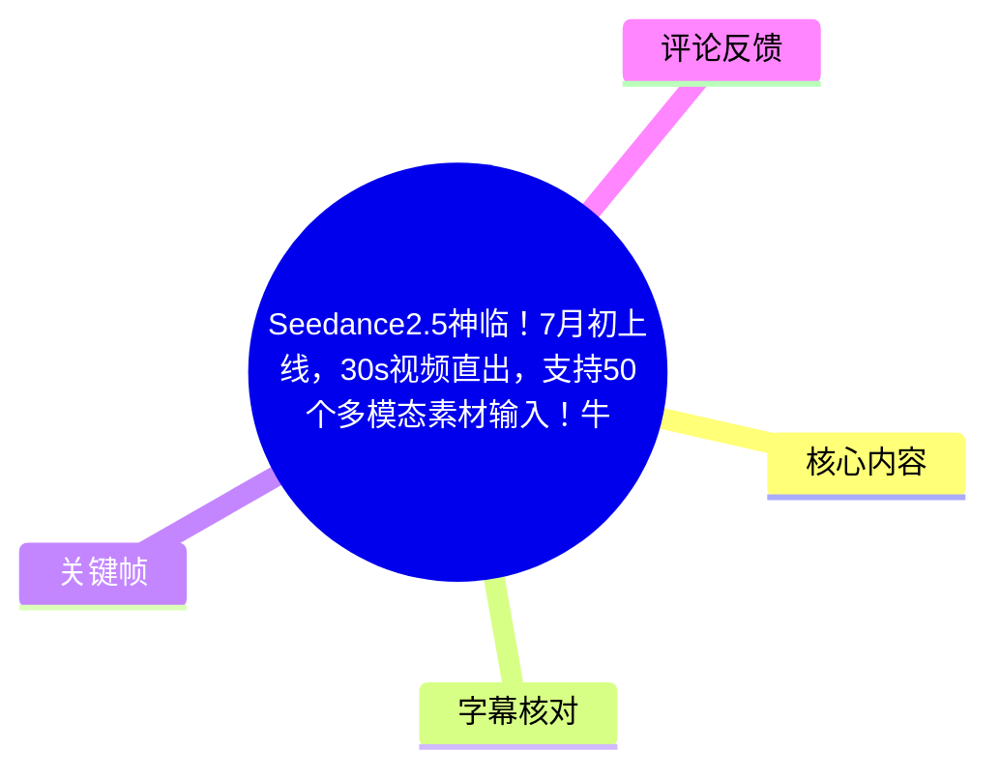
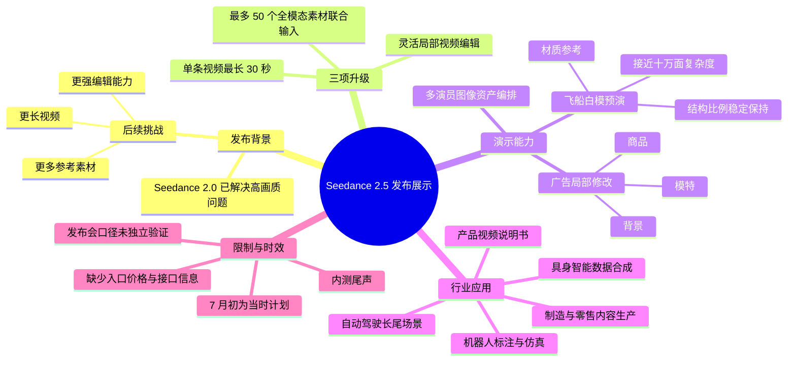
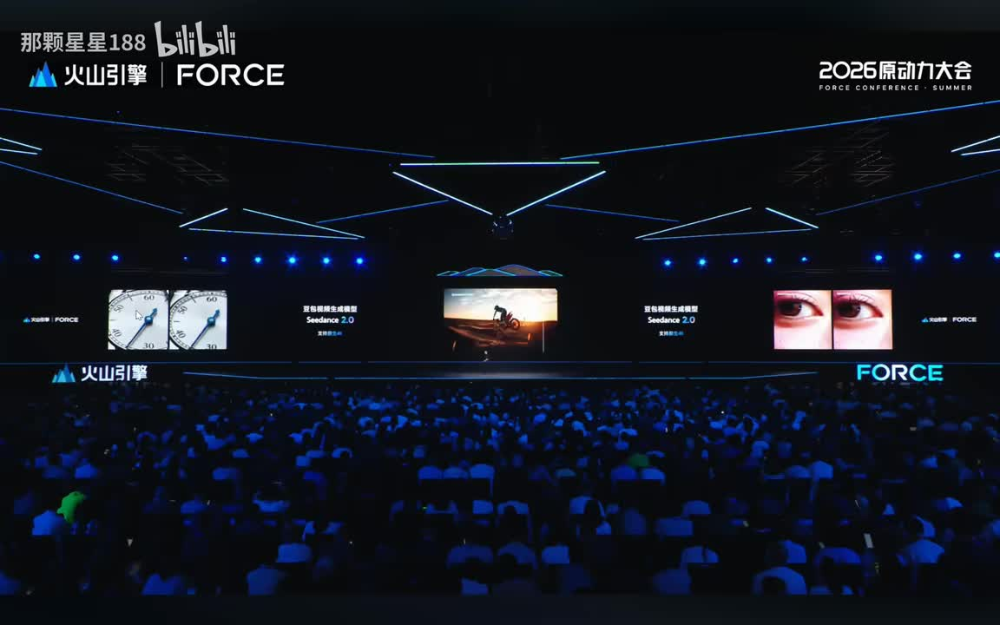
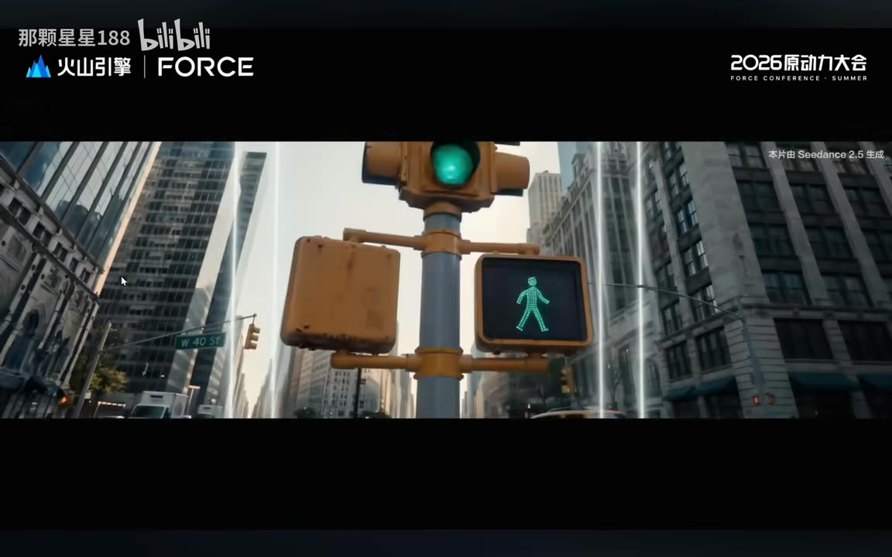
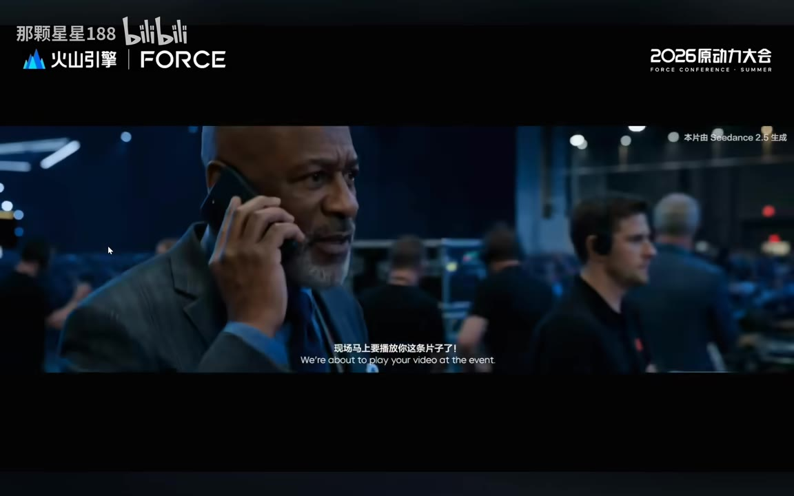
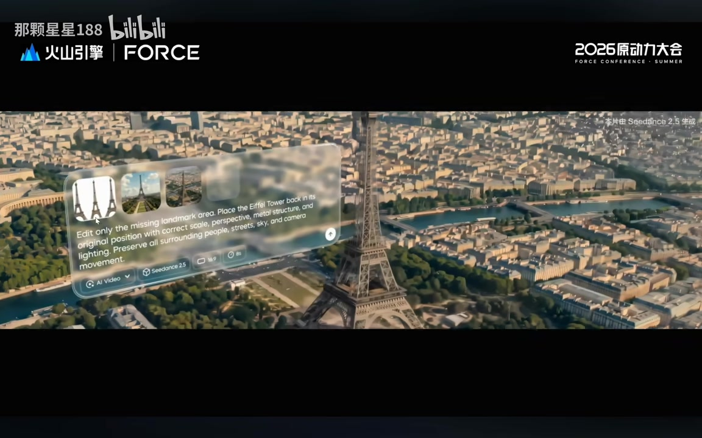

# Seedance2.5神临！7月初上线，30s视频直出，支持50个多模态素材输入！牛炸了！

> 来源：[Bilibili 视频](https://www.bilibili.com/video/BV1U57g6sEeM)  
> UP 主：那颗星星188｜视频时长：08:47｜画面来源：2026 火山引擎 FORCE 原动力大会现场内容  
> 注：本文的“全球第一 / 全球最多”等表述均为视频发布现场的口径，未在素材外进行独立横向验证。

## 小结

视频记录了火山引擎 FORCE 大会对 **Seedance 2.5（现场同时称“豆包视频生成模型”）** 的发布介绍。相较于此前被提及的 Seedance 2.0，演讲将新模型的升级集中为三项：**单条视频最长直出 30 秒、最多联合输入 50 个全模态素材、支持保持整体画面基础上的局部可控编辑**。

视频给出的关键参数是：同类产品被描述为通常只能直出 **15～20 秒**，而 Seedance 2.5 可生成最长 **30 秒** 的单条视频；多参考输入上限为 **50 个全模态素材**。演讲认为，更长的连续镜头有助于提升叙事连贯性、创作效率和成片质量，多素材能力则服务于人物资产编排、复杂设计资产保持等场景。

技术演示覆盖三类工作流：第一类是把十多位演员的图像资产一次性输入并进行编排；第二类是影视制作中的白模预演，将复杂度接近十万面的飞船白模和材质参考结合，生成模拟镜头；第三类是广告局部编辑，在保持画面整体不变时，调整背景、商品或模特。视频还把能力延展到产品视频说明书、具身智能训练数据、机器人标注与仿真、自动驾驶长尾场景合成。

需要注意的是，本视频本质上是发布会展示与能力宣讲，并非可复现的产品教程：**没有提供模型入口、价格、API、推理耗时、分辨率、可用区域、内容审核策略、50 个素材的具体格式配比或真实成功率**。演讲虽称模型处于内测尾声、计划“7 月初”正式见面，但该时间是 2026 年 6 月发布语境下的计划，实际可用性与产品规则应以之后的官方页面为准。

适合关注 AI 视频生成、影视预演、商品广告本地化、合成数据与世界模型方向的创作者、技术产品人员及行业研究者阅读。对于个人创作者而言，视频只证明了展示场景中的潜力，尚不能据此推断普通用户一定能够获得同等效果或立即使用。

## 思维导图

## 目录

- [发布背景：从高画质走向时长、参考与编辑](#发布背景从高画质走向时长参考与编辑)
- [开场生成视频与编辑能力画面](#开场生成视频与编辑能力画面)
- [三项核心升级：30 秒、50 素材与可控编辑](#三项核心升级30-秒50-素材与可控编辑)
- [多参考素材编排与资产一致性](#多参考素材编排与资产一致性)
- [影视白模预演：复杂飞船资产保持](#影视白模预演复杂飞船资产保持)
- [局部编辑与广告内容本地化](#局部编辑与广告内容本地化)
- [行业应用：说明书、仿真和长尾数据](#行业应用说明书仿真和长尾数据)
- [结论、限制与时效性](#结论限制与时效性)
- [字幕比对](#字幕比对)
- [评论分析](#评论分析)
- [处理记录](#处理记录)

## 发布背景：从高画质走向时长、参考与编辑 [00:00:00](https://www.bilibili.com/video/BV1U57g6sEeM?t=0)

演讲开头将此前版本的进展概括为：Seedance 2.0 已经解决“高画质”问题，但视频生成还剩三个挑战：

1. 是否能生成更长时长的视频；
2. 是否能接受更多参考素材；
3. 是否具备更强的视频编辑能力。

演讲者明确表示，这些目标已经超出 Seedance 2 的范畴，因此引出新的主角 Seedance 2.5。这里的逻辑不是仅提升视觉清晰度，而是将模型能力从“单次生成一个好看的短片段”，推进到更适合生产流程的 **长镜头表达、复杂资产约束和后期修改**。

需要保留的事实边界是：ASR 开头将模型名误识别为“Cdansk / Cdancs”，但结合视频标题、标签以及画面中的 “Seedance 2.0 / Seedance 2.5” 文案，本文统一规范为 **Seedance**。开头提到的“4K”在 ASR 中出现，但画面与语音材料不足以确认其是具体版本名、分辨率规格还是识别误差，因此不把它写作已验证的技术参数。

> 图：关键帧展示了 2026 火山引擎 FORCE 会场大屏，中央画面可见 “Seedance 2.0” 标识。这一画面为视频的发布会语境，以及“从 2.0 进入 2.5”的叙事背景提供了直接视觉依据。

## 开场生成视频与编辑能力画面 [00:00:19](https://www.bilibili.com/video/BV1U57g6sEeM?t=19)

从 00:00:19 到 00:02:59 是一段长约 160 秒的无 ASR 语音覆盖区间。诊断显示这不是音轨缺失，而是 ASR 在该段没有转写出可用演讲内容；可结合关键帧确认其中包含多段带有“本片由 Seedance 2.5 生成”标识的生成视频展示。

画面中出现城市街景、人物在控制室接听电话等具有电影感的镜头。它们的作用是先展示生成质量与叙事镜头效果，再由后续演讲说明模型的具体能力。由于无逐句语音转写，不能从这些画面反推出具体提示词、生成时长、模型参数或制作方式。

> 图：画面右上角明确标注“本片由 Seedance 2.5 生成”，主体为城市路口的信号灯与高楼街景。其价值在于直接证明视频确实展示了由该模型生成的案例，而不仅是口头介绍。

> 图：画面同样带有“本片由 Seedance 2.5 生成”标识，并配有中英双语对白字幕。该帧说明展示内容不仅限于静态写实画面，也包含人物、室内场景和对白式叙事片段；但不能据此验证人物身份一致性、口型准确性等未被材料明确说明的指标。

> 图：画面以巴黎与埃菲尔铁塔为背景，叠加英文编辑指令，要求将地标恢复到原位置，同时保持人物、街道、天空、相机运动等环境要素。它直观呈现了“针对缺失区域修改、尽量维持其余画面”的局部编辑目标，但不构成对所有编辑条件下效果稳定性的证明。

## 三项核心升级：30 秒、50 素材与可控编辑 [00:02:59](https://www.bilibili.com/video/BV1U57g6sEeM?t=179)

演讲者在生成影片播放结束后正式定义 Seedance 2.5 的三项重要升级：

| 升级方向 | 视频中的具体口径 | 面向的创作问题 |
| --- | --- | --- |
| 视频长度 | 单条视频生成最高 30 秒 | 短片段难以承载连续镜头表达 |
| 多参考输入 | 最多支持 50 个全模态素材联合输入 | 多角色、多资产、多参考条件难以同时纳入 |
| 视频编辑 | 更灵活、可控的编辑能力 | 生成后难以对局部修改且保持整体稳定 |

### 1. 单条直出最长 30 秒 [00:03:23](https://www.bilibili.com/video/BV1U57g6sEeM?t=203)

视频称单条视频最长可生成 **30 秒**，并将其表述为“全球第一”。演讲同时给出市场对比口径：同类模型产品最多支持 **15～20 秒** 的直出。这里的“直出”应理解为单条生成长度，而不是剪辑拼接后的总片长。

演讲所强调的收益有两类：

- **镜头表达更连贯**：更长的连续时长减少多个片段拼接带来的转场与一致性负担；
- **创作效率和成片品质提升**：在理想情况下，减少拆镜和多次重生成，使镜头运动、角色与场景能够在更长时间范围内保持连贯。

不过视频未披露 30 秒的分辨率、帧率、生成速度、是否需要特定套餐、一次性成功率及是否可搭配首尾帧等条件。因而“30 秒”是发布会宣称的能力上限，不应延伸为所有任务均可稳定生成 30 秒高质量成片。

### 2. 最多 50 个全模态素材联合输入 [00:04:12](https://www.bilibili.com/video/BV1U57g6sEeM?t=252)

多参考能力被演讲称为创作者偏爱的 Seedance 功能之一。Seedance 2.5 将上限提升为 **50 个全模态素材联合输入**，并同样使用“全球最多”的发布会口径。

“全模态素材”是视频中的原话，但素材没有进一步定义其具体可包含的文件类型，例如图片、视频、音频、文本、3D 模型是否均计入，以及各种模态各能输入多少个。因此可以确认的是 **总输入能力上限为 50 个素材**，不能据此自行推定支持的格式、单文件大小、素材长度或权重控制方式。

接下来的案例目标是一次性输出十多位演员的图像资产，观察模型如何将它们组织、编排进同一结果中。该案例意在证明：多参考不只是“能传更多文件”，还需要在结果中处理多个角色或资产的空间安排与关系。

## 多参考素材编排与资产一致性 [00:04:32](https://www.bilibili.com/video/BV1U57g6sEeM?t=272)

00:04:32 至 00:05:14 为第二个 ASR 空白区间。依据前后演讲内容，这段对应“十多位演员图像资产”的实际效果展示；但没有可用语音逐项解释输入素材、提示词、镜头规划或结果评测标准。

演讲在示例结束后评价其“编排得非常完美”。这是发布方对演示结果的主观评价，更可操作的技术结论是：模型被定位为能够同时理解大量参考，并在生成过程中对这些素材进行稳定保持。

对于实际使用，可从视频归纳出如下输入思路，但不应将其误认为已公布的官方操作界面：

1. 准备目标角色或资产的参考素材；
2. 在单次任务中联合输入多个素材，视频说明的最高数量为 50；
3. 用任务描述要求模型完成多对象的编排；
4. 观察角色、物体与构图是否能在生成中被持续保留；
5. 若进入生产流程，应以实际产品的素材格式、上限、权重能力和审核规则为准。

这套思路适用于多角色广告、群像短片、IP 素材组合等需求，但视频没有展示失败案例，也没有给出多人脸、复杂遮挡、长镜头切换时的一致性量化指标。

## 影视白模预演：复杂飞船资产保持 [00:05:14](https://www.bilibili.com/video/BV1U57g6sEeM?t=314)

视频把“更多素材的理解”进一步推进到“生成过程中的稳定保持”，并给出影视制作中 **白模预演** 的案例。

### 输入与任务

演讲描述的输入包括：

- 一个非常复杂的宇宙飞船白模；
- 飞船复杂度接近 **十万面**；
- 一份渲染材质参考。

任务是让 Seedance 2.5 生成渲染视频，用于模拟相应的镜头效果。这里的“十万面”是演讲给出的模型复杂度描述；素材并未说明模型文件格式、是否直接上传 3D 几何、是否使用多视角渲染图代替 3D 文件，故不能把它写成已确认的“原生 3D 模型直接输入”能力。

### 技术难点 [00:05:39](https://www.bilibili.com/video/BV1U57g6sEeM?t=339)

演讲明确列出该任务的难点：

- 飞船包含大量细节；
- 要保持结构、比例与精细设计；
- 在镜头缓慢推进与飞行运动的过程中，不能让飞船结构和比例漂移；
- 同时要完成对应材质、光影、空间效果的生成与镜头调度。

这说明该案例的评价标准并非单帧画面是否漂亮，而是 **运动中的资产稳定性**：相机变化时，主体轮廓、比例关系、复杂结构，以及材质与环境光是否仍能连续协调。

### 视频给出的结果判断 [00:06:03](https://www.bilibili.com/video/BV1U57g6sEeM?t=363)

演讲者称，从生成结果可以看到，飞船主体轮廓、比例关系和复杂结构得到了稳定保持。随后将这种能力解释为对专业创作流程的意义：创作者前期投入的大量资产设计与镜头调度可以被模型“稳定承接”，从而使创作更可控、更高效。

这是面向影视预演的一个关键经验：如果生成模型能尊重已有资产而不是每次从零重构，AI 视频就有机会嵌入已有前期流程。仍需注意，视频没有展示资产在多镜头、多次重生成、极端遮挡或高速运动下的稳定性，也未提供与传统预演工具的成本和时间对比。

## 局部编辑与广告内容本地化 [00:06:27](https://www.bilibili.com/video/BV1U57g6sEeM?t=387)

视频将第三项能力描述为灵活的视频编辑：创作者可以在 **维持整体画面不变** 的前提下，单独修改局部内容。演讲列举了三种可修改对象：

- 微调背景；
- 更换演示商品；
- 更换展示商品的模特。

这一定义的重点是局部编辑的“约束”——并非要求重新生成一条完全不同的视频，而是要求模型改变目标区域，同时尽可能保留画面整体、场景结构和既有镜头关系。

### 广告案例及其边界 [00:06:51](https://www.bilibili.com/video/BV1U57g6sEeM?t=411)

00:06:52 至 00:07:18 是广告例子的播放区间，ASR 在此没有产生可用演讲转写。演示结束后，演讲者以“这广告解决了我选口红的困惑”作出评价，并指出广告内容的本地化与个性化只是编辑能力的一个应用场景。

可将视频展示的编辑工作流概括为：

1. 先获得或准备一个基础视频；
2. 固定不希望变化的整体画面条件；
3. 指定需要替换或微调的局部对象，例如背景、商品或模特；
4. 生成局部修改后的版本；
5. 对比修改区域是否满足需求，以及非修改区域是否保持稳定。

但素材未展示掩码怎么提供、文本指令语法、区域选择精度、修改失败时的修复机制、商品文字准确率或品牌合规控制。因此这些步骤仅反映视频所表达的任务结构，而非可以照抄的产品操作说明。

## 行业应用：说明书、仿真和长尾数据 [00:07:18](https://www.bilibili.com/video/BV1U57g6sEeM?t=438)

演讲认为，编辑能力提升的更重要价值在于让视频模型进一步服务实体行业。视频列举了以下应用方向。

### 1. 产品视频说明书 [00:07:43](https://www.bilibili.com/video/BV1U57g6sEeM?t=463)

演讲称，输入产品图片和功能描述后，可输出面向多语言、多国家的标准视频说明书，用于压缩制造业和零售业的内容生产成本。

其中可以确认的能力叙述是“图片 + 功能描述 → 多语言、多国家的标准化产品视频”。但素材没有说明翻译由哪个组件完成、语言种类、事实准确性、法规适配、产品安全指引审校及人工复核流程。对于制造业和零售业，尤其不应将生成内容直接作为合规说明书上线。

### 2. 具身智能、机器人标注与仿真 [00:08:07](https://www.bilibili.com/video/BV1U57g6sEeM?t=487)

视频称具身智能行业已经在使用 Seedance 2.5 合成数据，并认为新版本能够生成多场景、多视角的高质量视频，用于机器人标注和仿真。演讲给出的预期收益是：

- 降低采集数据的成本；
- 加速模型迭代；
- 增加场景和视角的覆盖。

这是合成数据的典型用途，但视频没有给出下游任务的性能提升数据、标注准确率、仿真到真实世界的迁移结果，或对生成偏差的处理方式。因此，“可用于”不等于“已经证明能可靠替代真实采集”。

### 3. 自动驾驶 Corner Case 合成

在自动驾驶领域，视频提出可合成极端天气、罕见路况等 **Corner Case（长尾 / 边缘场景）**，以补充训练覆盖盲区，并让自动驾驶系统在更多边缘条件下保持更稳定的表现。

该应用的逻辑是：

1. 真实世界中极端且危险的情况数据稀缺；
2. 生成模型可补足这些少见样本；
3. 将合成样本纳入训练或评测，扩大覆盖范围；
4. 期待下游系统在边缘场景中更稳健。

这仍是演讲中的应用愿景。自动驾驶属于高风险领域，合成视频是否具备足够的物理真实性、传感器一致性、标注正确性与安全验证，需要额外的工程和监管验证；视频本身没有提供相关证据。

### 4. “世界模型”定位 [00:08:31](https://www.bilibili.com/video/BV1U57g6sEeM?t=511)

结尾将 Seedance 更大的价值归结为：当视频生成模型跨越“生产级的质变点”后，模型累积的对物理世界的理解可能成为世界模型的重要基础。

这是一项研究与产品方向判断，而不是视频已经证明的技术结论。它表达的是从生成画面到学习物理关系、空间关系、物体运动与交互规律的长期路线。视频未定义“生产级质变点”的评测标准，也未给出世界模型能力的基准测试。

## 结论、限制与时效性 [00:08:31](https://www.bilibili.com/video/BV1U57g6sEeM?t=511)

Seedance 2.5 的发布信息可压缩为一个面向生产流程的能力组合：

- **更长输出**：30 秒单条直出，目标是减少短片段拼接压力；
- **更多输入**：50 个全模态素材联合输入，目标是纳入复杂人物与资产约束；
- **更可控修改**：局部编辑同时保持整体，目标是降低生成后返工成本；
- **行业化延展**：从影视预演、广告本地化，延展至产品内容生产和合成训练数据。

但应严格区分演示与已验证能力。以下信息在本视频素材中均未披露：

| 未披露项 | 对实际采用的影响 |
| --- | --- |
| 访问入口、区域和资格 | 无法判断普通用户、企业客户是否可直接使用 |
| 定价、额度、排队与生成耗时 | 无法评估经济性与批量生产可行性 |
| 分辨率、帧率、码率 | 无法比较最终交付规格 |
| 输入格式及 50 素材的计数规则 | 无法建立可复现工作流 |
| 角色、物体和文字的一致性指标 | 无法量化演示外的稳定程度 |
| 内容安全、版权与商用授权规则 | 无法据此判断商业交付风险 |
| API、工作流集成与编辑交互方式 | 无法确认是否适合生产管线接入 |

时效性方面，视频发布时间为 2026 年 6 月，演讲中的“内测阶段尾声”“7 月初正式见面”是当时的计划性信息。模型版本、开放范围、能力上限与价格策略可能已变化；使用前应查询火山引擎或豆包的最新官方说明。

## 字幕比对

| 字幕来源 | 完整性 | 专有名词 | 时间轴 | 主要问题 |
| --- | --- | --- | --- | --- |
| Bilibili 站内字幕 | 未提供可用字幕 | 无从核对 | 无从核对 | 素材记录显示字幕工具因 `Invalid URL` 退出，未取得站内字幕文件 |
| 本次 ASR 字幕 | 覆盖约 295.11 秒，占 526.47 秒视频约 56.05% | 多处误识别 | 14 段 SRT 均有可直接使用的时间轴 | 存在 3 个较大无转写区间，且有截断、同音误识别和口语噪声 |

### 最终字幕选择

本文以 **本次 ASR 的 SRT 时间轴** 作为章节定位依据，因为站内字幕未提供。ASR 识别语言为中文，语言置信度为 0.9639，使用 `medium` 模型、CUDA 与 `float16` 推理；其结果并未标记 `noAudioStream=true`，且已识别出约 295 秒语音，故源视频有可用音轨。

ASR 的主要缺口为：

- 00:00:19.420～00:02:59.860，约 160.44 秒；
- 00:04:32.460～00:05:14.990，约 42.53 秒；
- 00:06:52.320～00:07:18.960，约 26.64 秒。

这些区间主要按无语音转写的演示片段处理，并仅依据关键帧可见信息描述画面，不补写未经证实的旁白内容。

### 关键术语校正

| ASR 转写 | 本文采用 | 校正依据 |
| --- | --- | --- |
| Cdansk、Cdancs、Cdance、C-DANCE | Seedance | 视频标题、标签和关键帧中的 “Seedance 2.0 / Seedance 2.5” 文字 |
| “白魔” | 白模 | 影视制作语境中用于预演的白模表述；ASR 同时提到“复杂度接近十万面”的飞船资产 |
| “素杌”“结枠”“飞传” | 素材、结构、飞船 | 结合上下文的明显同音 / 识别错误修正 |
| “全模态” | 全模态素材 | 保留演讲原意；但未擅自扩展为确定支持的文件模态列表 |
| corner case | Corner Case / 长尾边缘场景 | 演讲原词及自动驾驶语境 |

## 评论分析

以下仅处理当前可获取的热评前三条。评论反映观众态度，不可作为模型能力、开放范围或市场格局的事实证据。

1. **蒜蓉布洛芬（57 赞）**：“大佬都在做大片，我拿到只会做擦边。”
   - **观点**：调侃专业展示与普通用户创作之间存在能力或用途落差。
   - **可补充的观察**：视频展示的确主要是电影感片段、广告和工业应用，未展示普通 C 端用户的易用工作流。
   - **可信度边界**：这是用户自我调侃，并非其实际获得 Seedance 2.5 使用资格或能力表现的可验证报告。

2. **CopenAI（25 赞）**：“话放在这，seedance2.5最多统治半年。”
   - **观点**：认为 AI 视频模型竞争激烈，领先窗口可能很短。
   - **可补充的观察**：该评论提醒读者，发布会中的“全球第一 / 最多”具有明显时效性，产品比较应随版本更新重新核验。
   - **可信度边界**：未给出技术路线、竞品数据或市场证据，属于预测性判断，不能视为事实。

3. **齐格弗里德lily（9 赞）**：“一个旗帜鲜明的放弃c端的产品做的再牛和你我又有p关系。”
   - **观点**：质疑产品是否面向普通消费者开放，认为若偏企业端则与普通用户关系有限。
   - **可补充的观察**：视频确实重点强调影视、制造、零售、具身智能和自动驾驶等行业场景，且当时状态是“内测尾声”，并未在材料中说明 C 端开放安排。
   - **可信度边界**：视频没有宣布“放弃 C 端”，因此该评论是对发布定位的解读，不是已被视频证实的产品策略。

## 处理记录

- Worker ID：`worker-mrj0wjed-b0c290ad`
- 模型：`gpt-5.6-terra`
- 使用素材与工具产物：视频元数据、关键帧目录、音频 ASR 结果、ASR SRT 时间轴、ASR 诊断信息、热评 JSON。
- 字幕选择：站内字幕未提供可用文件；已检查本次 ASR，最终以 ASR SRT 的 14 个真实分段时间作为时间轴依据。未发现 `noAudioStream=true`，因此按“视频存在音轨、但 ASR 覆盖不完整”处理。
- 专名处理：将 ASR 中的“Cdansk / Cdance”等识别错误，依据标题、标签和画面文字规范为 `Seedance`；其他未能可靠确认的参数不作扩写。
- 关键帧选择依据：
  - `frames/frame-001.jpg`：舞台大屏中的 Seedance 2.0，支撑版本升级背景；
  - `frames/frame-002.jpg`、`frames/frame-003.jpg`：右上角可见“本片由 Seedance 2.5 生成”，支撑生成视频案例的存在；
  - `frames/frame-004.jpg`：可见局部地标编辑指令，支撑局部编辑的画面化解释。
- 关键帧时间说明：提供的关键帧路径没有附带逐帧时间戳；本文没有把它们伪造为精确帧时间，仅将其用于对应的内容区间和画面证据。
- 缓存清理：未提供缓存清理执行日志；不宣称已完成清理。
- 未解决问题：缺少站内字幕；ASR 有三段大范围空白；缺少模型产品入口、价格、规格、素材格式、商用许可与性能评测资料。
