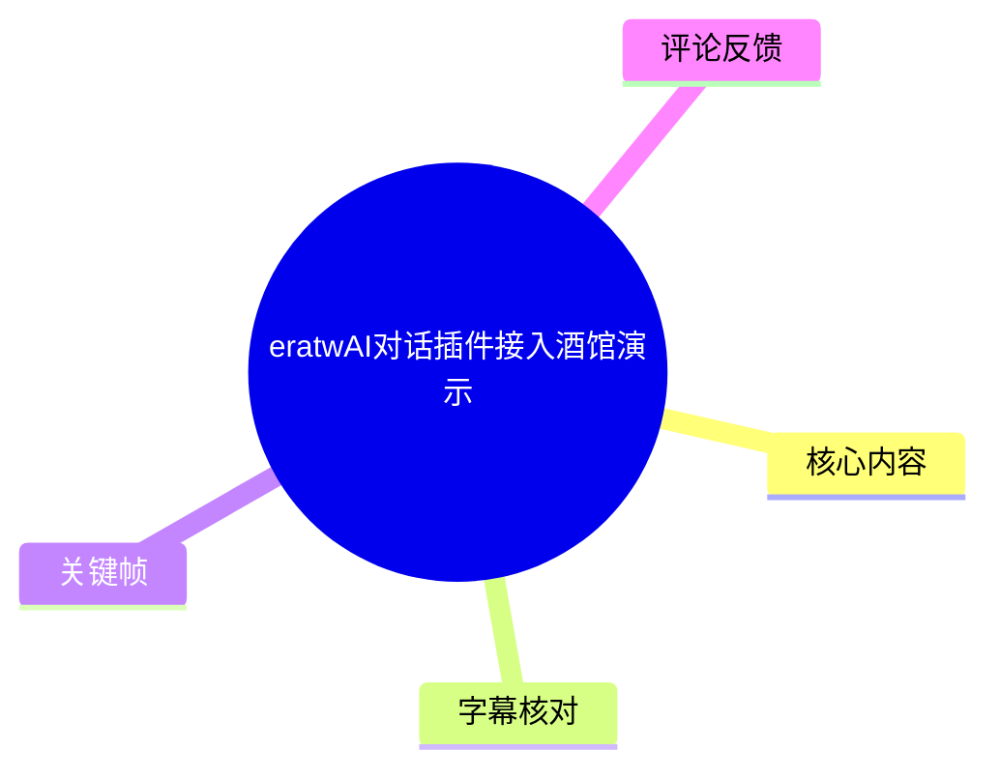
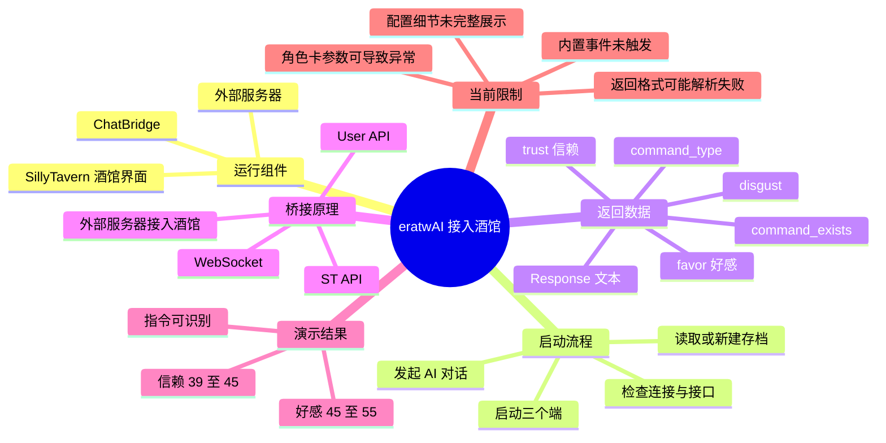
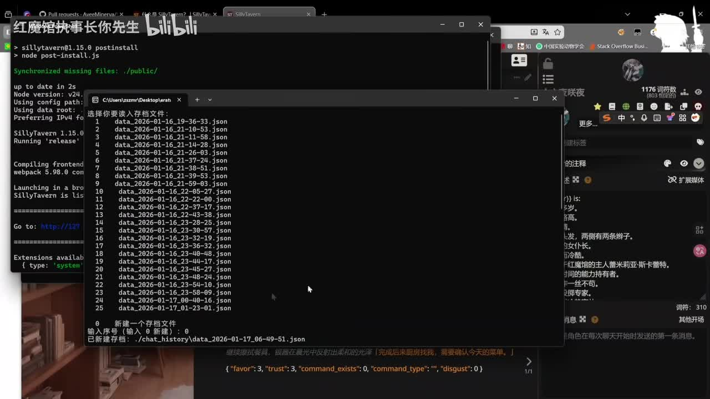
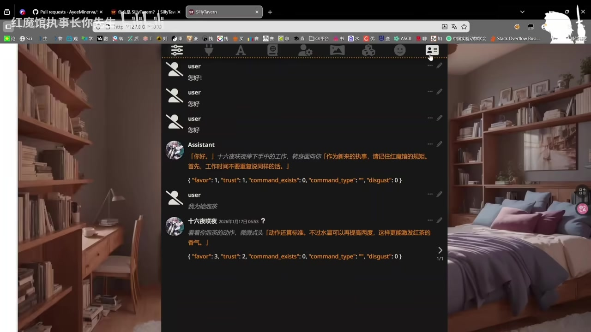
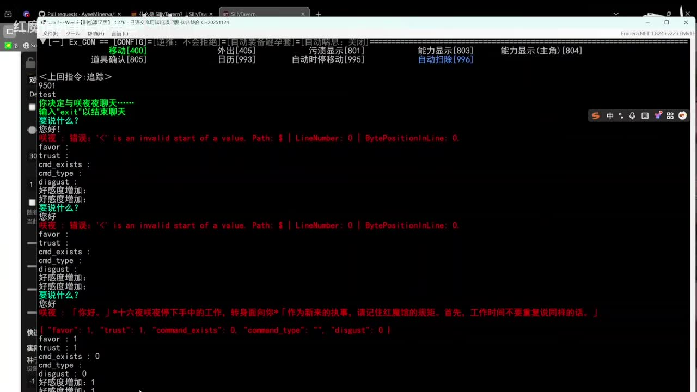
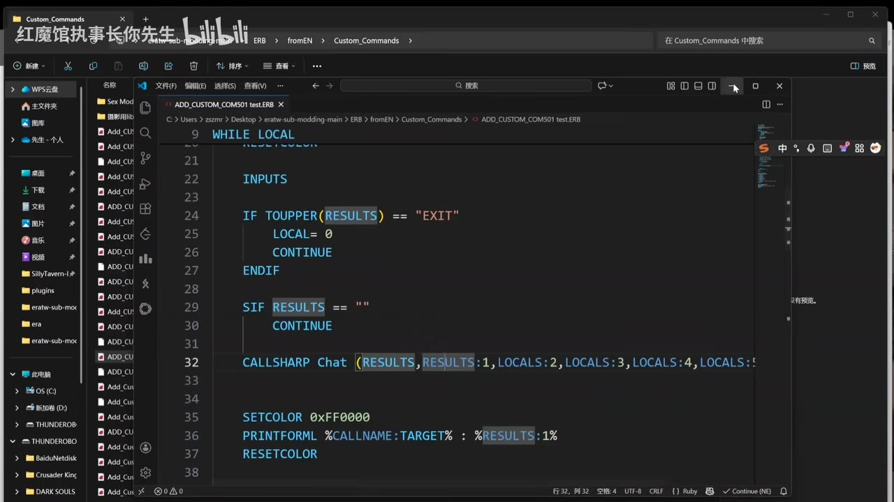

# eratwAI对话插件接入酒馆演示

> 来源：[Bilibili 视频](https://www.bilibili.com/video/BV1vzrSBNEKm)  
> UP 主：红魔馆执事长你先生｜视频时长：08:57｜合集：AIcode  
> 时效说明：视频与资源说明对应 2026 年 1 月前后环境；SillyTavern、ChatBridge、eratw 及相关脚本的目录、依赖和接口均可能随版本变化。

## 小结

视频演示了将 **eratw 的对话流程**通过 **ChatBridge** 接入 **SillyTavern（酒馆）**的思路与实际运行效果。整体由三个端协作：ChatBridge、酒馆网页界面和自建/配套服务器；启动后读取已有或新建的对话存档，再由酒馆侧发起 AI 对话。

演示的关键不只是让模型输出文本，还包括让返回结果携带结构化状态字段。视频中可见的字段包括 `favor`（好感）、`trust`（信赖）、`command_exists`、`command_type` 和 `disgust`；UP 主说明，当前已能在对话后更改好感度与信赖度，演示值从 **45、39** 变为 **55、45**。

指令机制处于“部分可用”的状态：当外部结果识别出指令时，`command_exists` 会被设为 `1`，示例命令类型为 `T`，并被解释为“泡茶”。但 UP 主明确表示，当前尚不清楚如何调用 eratw/TW 的部分内置事件，因此内置事件触发在这次演示中**尚未成功**。

配置层面，ChatBridge 充当外部服务器与酒馆之间的桥接层。视频称配置涉及 **3 个端口/接口方向**：一个 WebSocket，以及 ST API 和用户 API；用户端连接后参与请求与结果回传，结果同时返回给用户端和 ST 端显示。

适合已经具备 SillyTavern、脚本/插件安装与本地服务运行基础的使用者参考。视频没有完整展示所有端口数值、依赖安装命令及可复现的完整代码，因此不能仅凭本片直接保证一键部署成功；尤其应注意角色卡参数、JSON/返回格式与安装前置条件。

## 思维导图





## 目录

- [背景、资源与适用边界](#背景资源与适用边界)
- [启动三个端并读取存档](#启动三个端并读取存档-000002)
- [对话返回与状态参数](#对话返回与状态参数-000116)
- [指令识别、状态变化与失败演示](#指令识别状态变化与失败演示-000214)
- [ChatBridge 桥接原理与接口配置](#chatbridge-桥接原理与接口配置-000425)
- [安装、文件放置与最终操作](#安装文件放置与最终操作-000620)
- [关键帧索引](#关键帧索引)
- [结论与限制](#结论与限制)
- [字幕比对](#字幕比对)
- [评论分析](#评论分析)
- [处理记录](#处理记录)

## 背景、资源与适用边界

视频标题为“eratwAI对话插件接入酒馆演示”，描述中感谢 `Neo_Kesha` 提供帮助，并给出交流群及两个网盘资源条目：

- `SillyTavern (2).zip`
- `eratw-sub-modding-main.zip`

视频口述还提到按网盘分享资源部署时会涉及“三个文件”，但没有在可用字幕中完整、清晰地逐一念出所有文件的准确名称。因此，以上仅记录视频简介明确列出的两个压缩包，不把“三个文件”进一步推定为三个特定归档。

从画面可见，环境运行在 Windows 上；后台包含 SillyTavern 启动终端、浏览器酒馆页面和另一个命令行窗口。该演示是本地软件、插件、脚本和接口协同的部署记录，并非云服务新闻或官方兼容性声明。

## 启动三个端并读取存档 [00:00:02](https://www.bilibili.com/video/BV1vzrSBNEKm?t=2)

UP 主一开始说明需要先启动“三个端”：

1. **ChatBridge**；
2. **酒馆（SillyTavern）界面**；
3. **服务器**。

随后系统会读取一个存档，既有聊天对话记录会保存在其中。接着需要检查连接与接口是否可用，再回到 TW/eratw 相关界面确认运行状态；在连接正常的条件下，系统能够正常回复。



> 图：画面同时展示 SillyTavern 的启动终端、浏览器中的酒馆页面，以及用于选择/新建存档文件的命令行窗口。它直接支持“三端启动—读取存档”的操作描述；存档列表中可见多个以时间命名的 JSON 文件。

### 实操顺序

| 顺序 | 操作 | 视频依据 | 目的 |
| --- | --- | --- | --- |
| 1 | 启动 ChatBridge、酒馆界面、服务器 | 00:00:02–00:00:14 | 使桥接、前端和业务端同时可用 |
| 2 | 选择已有存档或创建存档 | 00:00:20–00:00:35 | 保存/恢复此前聊天记录 |
| 3 | 检查连接与接口 | 00:00:35–00:00:44 | 确认请求链路可用 |
| 4 | 在 TW/eratw 侧确认，再进行对话 | 00:00:46–00:00:59 | 验证能产生正常回复 |

视频末段再次强调：当三个端均正常显示后，应先新建一个用于管理对话的存档，再回到 TW 侧发起 AI 对话。这说明“存档”是本次流程中的对话管理节点，而非单纯日志文件。

## 对话返回与状态参数 [00:01:16](https://www.bilibili.com/video/BV1vzrSBNEKm?t=76)

UP 主展示了对话返回内容的组织方式：前部对应用户输入，后部包含返回内容。除 `Response`/回复文本外，返回中还附加自定义参数。

视频明确点到以下字段含义或用途：

| 字段 | 视频中的说明 | 可确认程度 |
| --- | --- | --- |
| `favor` | 好感度 | 画面与口述均支持 |
| `trust` | 信赖度 | 画面与口述均支持 |
| `command_exists` | 是否识别到指令；识别到时可设为 `1` | 口述与画面支持 |
| `command_type` | 指令类型 | 口述与画面支持 |
| `disgust` | 一项额外状态字段 | 画面可见，未解释业务规则 |
| `Response` | 模型回复内容 | 口述提及，字段拼写以原话为准 |

此外，UP 主在此处提到“这是 `12B`”，但可用 ASR 没有保留其对应控件或参数名称，画面材料也不足以确认它究竟表示模型规模、配置项还是其他数值。因此只能记录为：**演示中出现“12B”标识，具体语义未被可靠说明。**



> 图：酒馆对话页展示 Assistant 回复，并在回复下方显示类似 `{"favor": 3, "trust": 2, "command_exists": 0, "command_type": "", "disgust": 0}` 的结构化数据。这是理解“文本对话同步输出可回写状态”的关键画面。

### 返回格式要求与风险

演示中出现 JSON 解析报错，错误文本可见为：

```text
错误：'K' is an invalid start of a value.
Path: $ | LineNumber: 0 | BytePositionInLine: 0.
```

这表明至少在该次测试里，程序期待某种可解析的结构化值，但实际返回开头出现了不符合预期的字符。视频没有给出完整的解析器实现或修复方案；不能据此断言所有报错均由模型输出导致，只能确认**返回格式、角色卡配置或相关参数异常会使状态处理失败**。

## 指令识别、状态变化与失败演示 [00:02:14](https://www.bilibili.com/video/BV1vzrSBNEKm?t=134)

约 02:14 起，UP 主发现此次显示没有按预期出现，并判断可能是自己“调音”的角色卡参数没有调好所致。之后又出现“怎么翻车了”的现场排查过程。这部分的重要信息是：演示环境并不稳定，角色卡/提示配置会影响结构化数据或指令流程。



> 图：控制台画面保留了 JSON 解析错误、`favor`、`trust`、`cmd_exists`、`cmd_type`、`disgust` 等输出，以及后续状态增加的记录。它说明本视频展示的是带调试输出的实测过程，而不是无错误的成品流程。

### 指令参数的演示结果 [00:03:19](https://www.bilibili.com/video/BV1vzrSBNEKm?t=199)

UP 主介绍了指令识别的约定：

- 当系统识别到用户输入中存在指令时，指令标记会设为 `1`；
- 示例中命令类型是 `T`；
- UP 主将 `T` 解释为“泡茶”。

但该演示的边界同样明确：

- UP 主表示当前“不太会”、也不知道如何调用 TW 的一些内置事件；
- 因此，**内置事件目前触发不了**；
- 已能观察到的可用功能是：对话结束后可改变好感度、信赖度。

### 可验证的数值变化 [00:03:40](https://www.bilibili.com/video/BV1vzrSBNEKm?t=220)

视频给出了一组前后对比：

| 状态 | 对话前 | 对话后 | 变化 |
| --- | ---: | ---: | ---:|
| 好感度 | 45 | 55 | +10 |
| 信赖度 | 39 | 45 | +6 |

UP 主据此说明，正常对话后这些值会发生变化；但截至视频演示版本，**只能修改好感度和信赖度，其他项目暂时不能修改**。这应被视为该版本的功能限制，而非完整 eratw 数值系统的通用能力边界。

## ChatBridge 桥接原理与接口配置 [00:04:25](https://www.bilibili.com/video/BV1vzrSBNEKm?t=265)

UP 主将 ChatBridge 解释为一个“桥接”组件：它让外部编写的服务器能够接入酒馆。视频所述的请求/返回关系可整理为：

```text
用户端（User）
  → ChatBridge / 外部服务器
  → SillyTavern（ST）
  → 返回用户端与 ST 端界面
```

这只是对视频口述的流程化整理，不代表完整的网络拓扑或协议细节。视频没有展示完整请求体、鉴权方式、地址或实际端口号。

### 三个端口/接口方向 [00:05:08](https://www.bilibili.com/video/BV1vzrSBNEKm?t=308)

视频称这里有三个端口或接口方向：

1. **WebSocket**；
2. **ST API**；
3. **用户 API（User API）**。

UP 主继续说明，用户 API 对应 User 端；连接 User 端之后，利用该端走入流程，并在最后回到 User 端和 ST 端呈现界面。需要注意，ASR 将名称多次误识别为 `ChartBridge`、`ChortBridge`、`WebSoft` 等；结合标题、口述上下文及启动画面，本整理统一写作 **ChatBridge** 与 **WebSocket**。

## 安装、文件放置与最终操作 [00:06:20](https://www.bilibili.com/video/BV1vzrSBNEKm?t=380)

UP 主在 06:20 后转入资源和安装说明：按网盘分享的资源，依照提供的路径放置插件；之后按文章中写明的方法运行。口述中提到“直接运行这个 `STAR`”，但该词可能是 ASR 对启动脚本/按钮名称的误识别，素材不足以确认其准确文件名。因此不要机械地把 `STAR` 当作实际命令执行。



> 图：资源管理器和编辑器显示脚本位于 `eratw-sub-modding-main\ERB\fromEN\Custom_Commands`，当前文件名可见为 `ADD_CUSTOM_COM501 test.ERB`。画面价值在于证明该演示包含 ERB 自定义命令脚本，并展示了实际目录层级的一部分；它不能证明所有文件均应放在该路径。

画面中的脚本片段可见如下结构（仅转录可见的核心行，不补全未展示代码）：

```erb
WHILE LOCAL
    INPUTS

    IF TOUPPER(RESULTS) == "EXIT"
        LOCAL = 0
        CONTINUE
    ENDIF

    SIF RESULTS == ""
        CONTINUE

    CALLSHARP Chat (RESULTS, RESULTS:1, LOCALS:2, LOCALS:3, LOCALS:4, ...)
WEND
```

从可见片段可确认：

- 脚本通过循环接收输入；
- 输入为 `EXIT` 时退出循环；
- 空输入会跳过当前循环；
- 脚本调用名为 `Chat` 的 `CALLSHARP` 调用，并传递 `RESULTS` 与多个局部参数。

不过，末尾参数在画面右侧被截断，不能补写；也不能仅据这段代码断言 `Chat` 的内部实现、接口地址或数据格式。

### 安装与运行前检查清单

结合视频可整理出以下不超出原素材的检查项：

1. 准备视频简介列出的酒馆与 eratw 相关资源。
2. 按资源所附文章/说明要求安装前置依赖；视频未完整展示具体依赖名称和命令。
3. 按说明给出的路径放置插件或脚本。
4. 启动 ChatBridge、SillyTavern 界面与服务器三个端。
5. 核对 WebSocket、ST API、User API 的配置是否与当前部署相匹配。
6. 确认接口可用后，创建或载入聊天存档。
7. 回到 TW/eratw 侧进行 AI 对话。
8. 观察回复文本及 `favor`、`trust`、`command_exists` 等结构化返回；若发生解析错误，优先检查返回格式及角色卡相关参数。

### 最终对话演示 [00:08:03](https://www.bilibili.com/video/BV1vzrSBNEKm?t=483)

视频收尾再次展示：三个端正常显示后，在存档管理处新建存档，回到 TW，随后可进行 AI 对话。


> 图：对话窗口显示用户消息、Assistant 回复及每轮下方的状态对象，直观呈现本插件接入后在酒馆端的最终可见结果：自然语言内容与状态字段同时出现。

## 关键帧索引

| 关键帧 | 正文使用位置 | 画面信息与价值 |
| --- | --- | --- |
| `frames/frame-001.jpg` | 启动与存档 | 同屏显示 SillyTavern 启动、酒馆页面与存档选择，支撑“三端+存档”流程。 |
| `frames/frame-002.jpg` | 参数与排错 | 显示 JSON 解析错误、状态字段与数值变化，是记录现场失败及调试状态的直接证据。 |
| `frames/frame-003.jpg` | 安装与脚本 | 显示 `eratw-sub-modding-main` 下 ERB 自定义命令目录及 `CALLSHARP Chat` 调用，支撑脚本接入说明。 |
| `frames/frame-004.jpg` | 最终效果 | 显示酒馆内 AI 回复和 JSON 状态对象，支撑“对话与数值状态联动”的效果描述。 |

其余关键帧文件虽已提供，但本素材未附逐帧时间或画面说明；为避免把无法确认的画面内容或时点写入正文，本整理仅选用与已知内容可直接对应的四张。

## 结论与限制

### 可迁移的经验

- 将 AI 对话接入游戏/数值系统时，可让模型回复之外携带结构化状态对象，以便更新好感、信赖等变量。
- 使用 ChatBridge 这类桥接层可以把外部服务器、用户端和 SillyTavern 前端串联起来；但接口配置必须在三端之间保持一致。
- 存档应在正式对话前创建或读取，以保存和管理会话状态。
- 先验证“文本能回复”，再验证“状态字段能解析”，最后再尝试“指令触发内置事件”，更符合视频所呈现的排错顺序。

### 已展示的限制

1. **内置事件尚不能稳定触发**：UP 主明确说明目前无法调用部分 TW 内置事件。
2. **可修改变量有限**：演示版本中可修改好感度、信赖度，其他数值暂不可改。
3. **角色卡/参数会影响运行**：UP 主将一次未显示问题归因于角色卡参数未调好。
4. **返回格式存在解析风险**：画面出现 JSON 解析错误，说明协议字段与模型输出格式必须严格匹配。
5. **部署信息不完整**：视频没有公开所有端口数值、完整配置文件、依赖安装命令、完整代码和精确启动命令。
6. **资源与版本可能过期**：简介中给出的网盘资源、插件路径、SillyTavern 版本及 API 行为均可能在后续变化。

## 字幕比对

| 字幕来源 | 完整性 | 专有名词 | 时间轴 | 主要问题 |
| --- | --- | --- | --- | --- |
| Bilibili 站内字幕 `p01-ai-zh.srt` | 与本视频不匹配；仅至约 04:07 | 严重不匹配，内容是济南烧烤、鲁菜等 | 分段时间存在，但对应另一条内容 | 完全不是本视频的语义，不能作为正文依据 |
| 本次 ASR 字幕 | 覆盖 536.33 秒音频；语音覆盖约 54.5%，存在 8 个较大空段 | 基本识别出 ChatBridge、SillyTavern、User API 等上下文，但有多处误识别 | 46 个带真实起止时间的分段，可用于章节定位 | 存在口语省略、术语误识别及长时间未识别段，如 `ChartBridge`、`WebSoft`、`STAR` |

### 最终字幕选择

正文以**本次 ASR 时间轴**为主，并使用关键帧进行术语和界面校正；未采用站内字幕的内容。ASR 诊断显示音频时长为 536.3345 秒、识别语言为中文、语言置信度约 0.991，且素材中**没有** `noAudioStream=true` 标记，因此本视频不是无音轨视频。

重要校正如下：

| ASR 写法 | 正文采用写法 | 校正依据 |
| --- | --- | --- |
| `酒碗`、`酒管` | 酒馆 / SillyTavern | 视频标题、启动窗口与酒馆页面上下文 |
| `ChartBridge`、`ChortBridge` | ChatBridge | 开头口述及桥接语境一致 |
| `WebSoft` | WebSocket | ASR 后文明确处于端口/接口配置语境 |
| `Use端`、`Uuser端` | User 端 | 口述说明“用户 API 是我们的 User 端” |
| `STAR` | 保留 ASR 原词，不确定实际启动项 | 未提供足以确认脚本/命令名称的画面或文本 |
| `调音的角色卡` | 按 ASR 原意记录为角色卡参数问题 | 原语音不够清晰，不能强行解释具体功能 |

ASR 的大段空白不应被解读为视频无内容；这些位置可能包含操作展示、停顿、未被识别的低清语音或无口述操作。正文仅在有语音时间戳、画面或两者共同支持处作出陈述。

## 评论分析

以下仅分析可获取的热评前三条；评论反映观众期待或主观看法，不作为已验证的技术事实。

1. **生grass占戈士｜223 赞**  
   评论称“那我便可以在era里体验到无尽的指节发白了（”。这是一条带有圈内语境和夸张表达的玩笑式反馈，侧面反映观众对“AI 接入 era 后扩展互动体验”的兴趣，但没有提供可验证的部署信息或功能证据。

2. **Tiyoyo-｜132 赞**  
   评论认为 era 这类游戏接入 LLM 会很好玩，并特别期待 AI 能根据不同数值输出不同对话。这与视频实际展示的 `favor`、`trust` 状态字段方向一致：数值变量可参与对话系统。但评论表达的是设想，不能据此推断视频已经实现“所有数值对回复内容的全面条件控制”。

3. **黄粱梦醒梦粱黄｜102 赞**  
   评论认可潜力，同时认为读懂 eratw 较难，并举“幻想乡缘起”“muv 世界书”等内容为例，认为模型阅读存在困难。这提出了实际风险：复杂世界书和长上下文可能限制模型理解质量。但视频没有对世界书读取能力做系统测试，因此该观点只能作为使用难点提示，不能视为本插件的性能结论。

## 处理记录

- **Worker ID**：`worker-mrj0www4-e8d79408`
- **模型**：`gpt-5.6-terra`
- **调用工具与素材**：视频元数据、`asr/asr-result.json`、`asr/transcript.srt`、站内字幕 `p01-ai-zh.srt`、热评数据、提供的关键帧。
- **ASR 检查结果**：已检查本次 ASR；语言为中文，音频存在，`noAudioStream=true` 未出现；ASR 共有 46 个时间分段，语音覆盖率约 54.5%。
- **字幕选择**：弃用与视频内容完全不符的站内字幕；正文时间轴以本次 ASR 的真实 SRT 起止时间换算秒数，术语以标题、画面和上下文校正。
- **关键帧选择依据**：选择了能直接支持启动/存档、错误与参数、ERB 脚本路径、酒馆最终对话效果的 `frame-001` 至 `frame-004`；未对无逐帧时间说明且无法可靠对应正文的其他帧作推断。
- **缓存清理**：提供的素材中没有可核验的缓存清理执行记录；未声称已执行缓存删除。
- **未解决问题**：未能从素材确认三个端口的数值、完整依赖及安装命令、完整请求协议、`12B` 的准确含义、ASR 中“STAR”的真实启动项名称，以及 TW 内置事件的具体调用方法。
