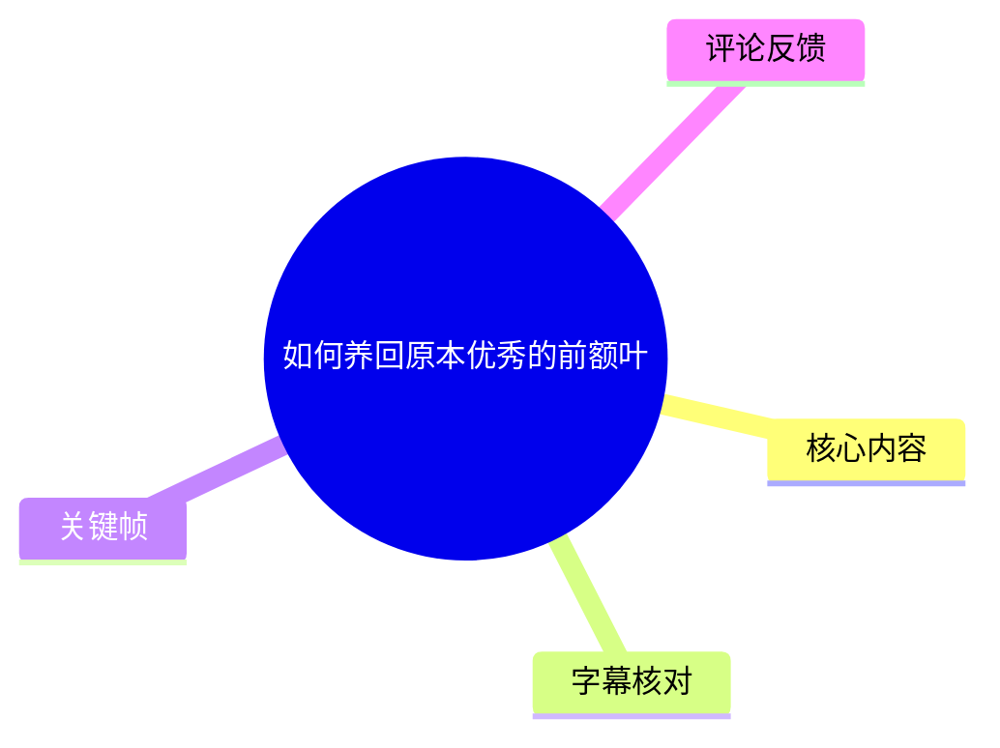
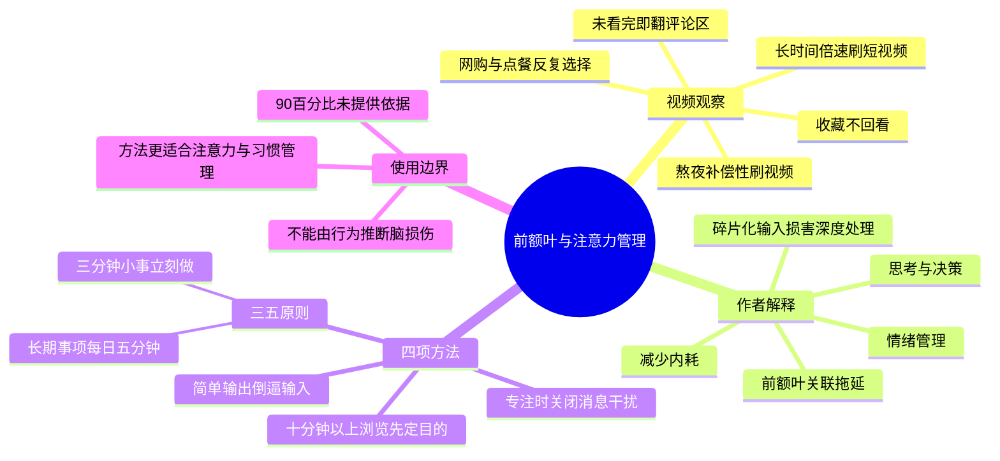

# 如何养回原本优秀的前额叶

> 来源：[Bilibili 视频](https://www.bilibili.com/video/BV1bH3E6cEmi) 
> UP 主：同桌团子｜发布时间：2026-07-26｜视频时长：03:17｜标签：教育、用脑

## 小结

视频以“刷短视频后更昏沉、拖延、难以做决定”为切口，将这些现象归因于前额叶的“损伤”或“退化”，并提出四项可立即执行的行为建议：长于 10 分钟的浏览必须带目的、专注任务时停止多线程回复消息、采用“三五原则”启动行动、用最简单的输出倒逼输入。

最具操作性的参数有三个：**超过 10 分钟的浏览要先明确目的**；**3 分钟内能完成的小事立刻做**；对运动、阅读等尚未形成习惯但有长期收益的事项，**每天先做 5 分钟**。视频强调长期持续性，而非某一天的高强度爆发。

视频把前额叶描述为负责“对抗拖延、情绪管理、思考决策、减少内耗”的脑区，并称正常发挥时可解决生活中“90% 的问题”；同时称无目的、高频碎片化的信息接收和任务切换会使其深度思考功能受损。这些属于视频作者的表达和解释，**视频未给出研究出处、实验设计或因果证据**，不宜直接等同于已经确证的神经科学结论。

因此，较稳妥的实践理解是：把视频方法用于改善注意力管理、降低选择成本、减少任务切换和建立习惯，而不应据此自行判断“前额叶受损”或期待“修复”某种脑结构。热评中也有观众指出，视频中的“90%”及“碎片化信息导致前额叶退化”等说法缺少直接证据支撑。

视频发布于 2026-07-26。其建议属于日常行为经验，时效性相对稳定；但涉及前额叶功能、脑损伤与退化的医学/科学表述，仍应以可追溯的专业研究和医疗意见为准。

## 思维导图

## 目录

- [问题画像与作者的解释](#问题画像与作者的解释)
- [方法一：超过十分钟的浏览先定目的](#方法一超过十分钟的浏览先定目的)
- [方法二：专注任务不做多线程回复](#方法二专注任务不做多线程回复)
- [方法三：“三五原则”降低行动门槛](#方法三三五原则降低行动门槛)
- [方法四：以最简单输出倒逼输入](#方法四以最简单输出倒逼输入)
- [可执行清单、限制与时效性](#可执行清单限制与时效性)
- [字幕比对](#字幕比对)
- [评论分析](#评论分析)
- [处理记录](#处理记录)

## 问题画像与作者的解释 [00:00:24](https://www.bilibili.com/video/BV1bH3E6cEmi?t=24)

ASR 在 00:00:23.580 开始识别到连续口播。作者首先列举一组自查式现象：

1. 刷短视频时间很长，并且常开倍速；
2. 看完视频几乎不在评论区表达自己的想法，甚至视频未看完就急着翻评论区；
3. 有用内容只收藏、不回看，也不跟练，现实中的核心问题没有解决；
4. 越刷越昏沉，夜晚还会补偿性熬夜继续刷；
5. 上网逛衣服、各种好物，或点外卖时花二三十分钟仍选不出吃什么，最后索性不吃。

作者随后将上述情况解释为需要“救回”受损的前额叶，并称前额叶在正常发挥时主要关联对抗拖延、情绪管理、思考决策和减少内耗，甚至可解决生活中“90% 的问题”。

> 图：该帧为作者正面口播画面，画面字幕出现“但是如果你不停的无脑刷短视频”。它对应视频从“前额叶作用”的描述转向“高频碎片化输入”风险解释的关键转折。

### 作者提出的机制链条 [00:00:48](https://www.bilibili.com/video/BV1bH3E6cEmi?t=48)

作者特别区分“无脑刷”与“完全不刷”：其目标不是要求观众彻底停止刷短视频，而是反对以下组合状态：

- 高频、碎片化地接受信息；
- 不断切换任务、被频繁分心；
- 始终处在被动接收信息的状态。

作者认为，这些状态会使前额叶“深入思考”的功能被闲置，久而久之会“退化”。接下来的视频内容即围绕如何改变这些行为模式展开。

> **证据边界：** 视频没有展示文献、实验、临床定义或测量指标，无法据此确认“短视频—前额叶退化”的直接因果链，也不能从倍速播放、看评论区或选择困难直接推断存在脑损伤。此处应视为作者的科普性观点与行为建议框架。

## 方法一：超过十分钟的浏览先定目的 [00:00:48](https://www.bilibili.com/video/BV1bH3E6cEmi?t=48)

作者给出的第一项规则是：**每次超过 10 分钟的浏览，一定要带着目的，不能无目的地网上闲逛。**

### 执行步骤

1. 在打开应用或网页前，先说清楚自己要解决什么问题。
2. 将内容范围限定在对应类别内，而不是边浏览边临时改变目标。
3. 购物或点餐先确定品类，再进入选择。
4. 完成原始目标后退出，不以“再看看”为默认动作。

### 视频中的具体示例 [00:01:12](https://www.bilibili.com/video/BV1bH3E6cEmi?t=72)

| 场景 | 作者建议 |
| --- | --- |
| 看干货 | 想学法律就看法律，想看财经就看财经。 |
| 点外卖 | 想吃烤肉就搜烤肉，想吃拌面就选拌面。 |
| 买衣服 | 想买裙子就看裙子，想买裤子就看裤子。 |
| 常见误区 | 不要抱着“我先上网看看，再做选择”的想法。 |

作者以个人经历说明，无目的浏览的结果可能是既没选到想要的东西，也损耗了注意力和决策精力。

> 图：该帧字幕呈现“就能立马去修复前额叶的方法”，标记了视频从问题诊断切换到行动建议的位置。正文保留“修复”作为作者原话，但不将其解释为医学意义上的脑结构修复。

### 可迁移经验

这项方法的可操作核心不是“禁止娱乐”，而是给浏览设置**任务边界**：目标、品类、结束条件。对于容易在购物、外卖或信息流中反复横跳的人，先缩小选择集合，可能更有助于减少无效决策时间。

## 方法二：专注任务不做多线程回复 [00:01:36](https://www.bilibili.com/video/BV1bH3E6cEmi?t=96)

作者的第二项建议是：**做需要专注的事时，不要同时处理消息。**

适用场景包括处理文件、观看网课、学习等需要沉浸式投入的任务。作者要求把其他消息设为免打扰，并在两种方式中二选一：

- **开始前统一回复**：进入专注任务前，先把需要回复的消息处理完；
- **结束后统一回复**：任务完成后再集中回消息。

作者反对一边做正事、一边聊天，认为这种多任务行为会透支前额叶、效率也不高；表面上好像同时完成多件事，实际总耗时可能更长，精力也更容易分散。

### 建议的自测方法 [00:01:36](https://www.bilibili.com/video/BV1bH3E6cEmi?t=96)

作者建议观众自己计时比较。可将同类任务分为两次完成：

1. 一次允许随时回复消息；
2. 一次将消息设为免打扰、结束后集中回复；
3. 记录两种条件下的完成时间、被打断次数和任务完成质量。

> 这是一种个人效率观察法，不构成科学实验；但它能帮助使用者判断“多线程处理是否真的为自己节省时间”。

## 方法三：“三五原则”降低行动门槛 [00:02:00](https://www.bilibili.com/video/BV1bH3E6cEmi?t=120)

作者提出“三五原则”，其中“3”和“5”分别对应两类不同任务。

### 规则一：3 分钟内完成的小事，立刻做

对于能在 **3 分钟内**完成的事项，作者建议不要拖延，马上执行。视频举例包括：

- 给加湿器倒水；
- 扔垃圾。

这里的重点是避免微小待办不断堆积、持续占用心理空间。

### 规则二：长期有收益但尚未形成习惯的事，每天先做 5 分钟

对于运动、看书等“有长远收益”、但当下缺乏自制力或尚未形成习惯的行为，作者建议：

1. 每天只要求自己做 **5 分钟**；
2. 到 5 分钟时可以停止；
3. 即使只看了几页书、只跑了半圈，也视为完成；
4. 若 5 分钟后仍有继续的冲动，就继续做；
5. 若没有冲动，则停止，不必强迫延长。

> 图：该帧仍是单人讲述画面，字幕为“说明你要点个关注”。它反映视频采用强互动式口播结构；相比文字笔记，原画面有助于辨识建议是作者的个人表达，而非画面展示的实验或数据结论。

### 长期持续性而非单日爆发 [00:02:24](https://www.bilibili.com/video/BV1bH3E6cEmi?t=144)

作者回应“每天 5 分钟会不会太少”的疑问：即使每天只做 5 分钟，按一年 365 天计算也是：

\[
365 \times 5 = 1825\text{ 分钟}
\]

即约 **30 小时 25 分钟**。这是根据视频给出的“365 × 5”换算得出的结果。作者的结论是：对于长期收益事项，重要的不是某一天的爆发力，而是长期持续力。

> **适用限制：** “5 分钟”是降低启动阻力的习惯策略，不是所有训练的充分剂量。例如学习、运动或康复若有明确目标，仍需根据课程、体能、健康状态及专业建议安排总量与强度。

## 方法四：以最简单输出倒逼输入 [00:02:48](https://www.bilibili.com/video/BV1bH3E6cEmi?t=168)

最后一项方法是：**做最简单的输出，让输入内容在脑中被加工一遍。**

作者将“输出”定义得很低门槛，不要求写长文或完成正式作品。可执行方式包括：

- 及时记下一句感受；
- 写一条反思；
- 用一句话概括所学内容；
- 对视频中有共鸣或启发的点，直接写在评论区。

作者认为，即便只是简短的一句话或精简概括，也是在调动前额叶加工信息；相反，如果刷完就划走，可能刷了很多，却什么都没有留下，时间过去后仍感觉自己没有进步。

### 适合直接套用的输出模板

- **观点复述：** “这条内容的核心建议是：______。”
- **个人连接：** “我最容易出现的场景是______，准备先做的改变是______。”
- **行动承诺：** “下一次打开外卖/购物软件前，我先确定______。”
- **反例记录：** “今天我在______时被消息打断了______次，下次准备______。”

这种做法可以把被动浏览转成可回顾的记录；但“写了评论”本身不保证理解正确，仍需结合信息来源质量和后续实践验证。

## 可执行清单、限制与时效性 [00:03:12](https://www.bilibili.com/video/BV1bH3E6cEmi?t=192)

### 一页行动清单

| 触发场景 | 立即动作 | 视频参数 |
| --- | --- | --- |
| 准备持续刷内容 | 先写/说出浏览目标与退出条件 | 浏览超过 10 分钟 |
| 打开购物或外卖应用 | 先决定品类，再搜索具体选项 | 不“先看看再选” |
| 要学习、处理文件 | 开启免打扰；消息开始前或结束后统一处理 | 避免边做正事边聊天 |
| 出现微小待办 | 预计 3 分钟内能做完就立即做 | 3 分钟 |
| 阅读、运动等难启动事项 | 只承诺做 5 分钟；有意愿再延长 | 每日 5 分钟 |
| 看完一条有价值内容 | 留下一句总结、感受或下一步动作 | 最简单输出 |

### 视频结尾 [00:03:12](https://www.bilibili.com/video/BV1bH3E6cEmi?t=192)

作者在结尾邀请对“科学用脑”内容感兴趣的观众关注，表示后续会持续更新。视频没有补充参考文献、量表、医学评估方法或针对不同人群的差异化方案。

### 关键限制

1. **概念边界不足：** 视频未区分“注意力下降、疲劳、拖延、选择困难”与“前额叶受损/退化”等医学或神经科学概念。
2. **因果证据未展示：** “碎片化信息会使前额叶退化”“正常前额叶能解决 90% 问题”等为作者表述，视频内没有提供可核验依据。
3. **不能替代诊疗：** 若长期存在明显的注意力、情绪、睡眠或执行功能困难，不应仅靠短视频建议自我归因为脑区问题；应考虑向合格的医疗或心理专业人士咨询。
4. **适用范围：** 四项方法主要是行为组织与注意力管理策略。它们可能有助于改善日常执行，但效果会受到工作要求、睡眠、压力、疾病状态与环境干扰等因素影响。
5. **时效性：** 视频的行为建议发布于 2026-07-26，短期内不会因平台版本变化而失效；但有关脑科学的解释应以更新的专业共识为准。

## 字幕比对

| 字幕来源 | 完整性 | 专有名词 | 时间轴 | 主要问题 |
| --- | --- | --- | --- | --- |
| Bilibili 站内字幕 | 未提供可用站内字幕，无法比对 | 无法评估 | 无法评估 | 素材明确标注“未提供可用站内字幕”。 |
| 本次 ASR 字幕 | 共 9 段，识别语音约 172.42 秒，覆盖率 87.96%；开头至 00:00:23.580 未识别出口播 | “前额叶”多次误识别为“情恶叶”“情恵叶”“前夜”等；“三五原则”等也有错字 | 提供带时间戳的 SRT，范围覆盖 00:00:23.580—00:03:16.000 | 单段文本过长、断句不足，存在同音字、乱码及语义误识别；首段 0.52 秒时间范围承载过长文本，需谨慎按句级定位。 |

### 最终字幕与文本选择

- 本视频**没有可用站内字幕**，因此以本次 ASR 的 SRT 时间段作为时间轴依据。
- ASR 诊断未标记 `noAudioStream=true`；相反，识别到中文音轨，语言置信度为 **0.9976**，因此不存在“源视频无音轨”的情况。
- 正文将 ASR 中反复出现、但结合视频标题与上下文可确定的“情恶叶 / 情恵叶 / 前夜”等词统一校正为 **“前额叶”**。
- “三五原则”依据 ASR 后续对“3 分钟”“5 分钟”两组规则的清晰解释校正；“输出”依据“敲下感受或反思、在评论区写一句话”的上下文校正。
- 除上述明显术语校正外，未将 ASR 无法验证的口误、错字扩展为视频未明确表达的事实。

## 评论分析

仅处理本次可获取的热评 3 条。评论是观众观点，不作为已验证事实。

### 1. 对科学表述提出证据质疑（用户“我尤其无情”，645 赞）

该评论称其查阅相关权威期刊论文后，未发现支持“正常前额叶能解决 90% 的问题”或“高频刺激、碎片化信息会导致前额叶退化”这一直接因果关系的实验；同时认为倍速播放、提前看评论区等行为不足以说明前额叶有问题。评论建议不要焦虑，但可以把视频方法理解为改善注意力的参考，而非“修复前额叶”。

**价值与可信度边界：** 这条评论准确指出了视频内缺少引文和证据展示的问题，与本笔记的限制判断一致；但评论没有给出其所查论文的具体题名、链接或方法，不能替代正式文献综述。

### 2. 对“点外卖选不出”的生活化反例（用户“克里米斯特莉丝”，289 赞）

评论以“选外卖选不出难道不是因为没米吗”调侃，指出点餐困难还可能来自预算不足，而非单纯的决策能力或注意力问题。

**补充意义：** 这提醒读者，同一种外在行为可以有不同原因。经济约束、可选项不足、饮食需求、疲劳等都可能影响选择，不应把所有选择困难都归因于前额叶或刷短视频。

### 3. 对开场自查的共鸣（用户“该名称禁用”，960 赞）

评论写道“视频前几秒的我 belike:”，以网络表达方式表示自己对视频开头列举的刷视频、翻评论、收藏不回看等行为有高度代入感。

**补充意义：** 高赞共鸣说明开头的行为画像具有传播力和识别度；但“很多人共鸣”只能说明这些体验常见，不能证明视频提出的神经科学解释正确。

## 处理记录

- Worker ID：`worker-mrj0wjed-b0c290ad`
- 整理模型：`gpt-5.6-terra`
- ASR 模型：`large-v3-turbo`；识别语言：中文（`zh`）；语言置信度：`0.99755859375`；推理设备：CUDA；计算类型：`int8_float16`
- 使用的素材/工具产物：视频合并文件 `merged.mp4`、音频 `audio/audio.wav`、关键帧目录 `frames/`、ASR 结果 `asr/asr-result.json`、ASR SRT `asr/transcript.srt`、评论数据 `comments/comments.json`、视频元数据与封面。
- 字幕选择：站内字幕未提供可用版本；已检查本次 ASR，采用其真实 SRT 起止时间生成章节时间轴，并对“前额叶”“三五原则”“输出”等明显识别错误结合标题、上下文进行校正。
- 时间轴依据：ASR 的 9 个带时间戳分段，首个语音时间为 `00:00:23.580`，末个语音时间为 `00:03:16.000`；章节链接按各相关 ASR 段的起始秒数生成。
- 关键帧选择依据：选用 `frame-002.jpg`、`frame-003.jpg`、`frame-004.jpg`。这些帧均为作者口播及画面内字幕，可分别辅助识别互动式表达、无目的刷短视频的转折，以及方法部分的进入点；未把画面未展示的资料、数据或实验内容推断为事实。
- 评论处理：仅分析可获取的 3 条热评，未扩展抓取或推断其他评论。
- 缓存清理：提供的素材清单未包含缓存清理日志或清理结果；本记录不虚构已执行的缓存删除操作。
- 未解决问题：无站内字幕可用于逐字交叉核对；ASR 存在大量同音错字与长段落对齐粗糙问题；视频未提供支撑其前额叶相关结论的文献或研究来源。
