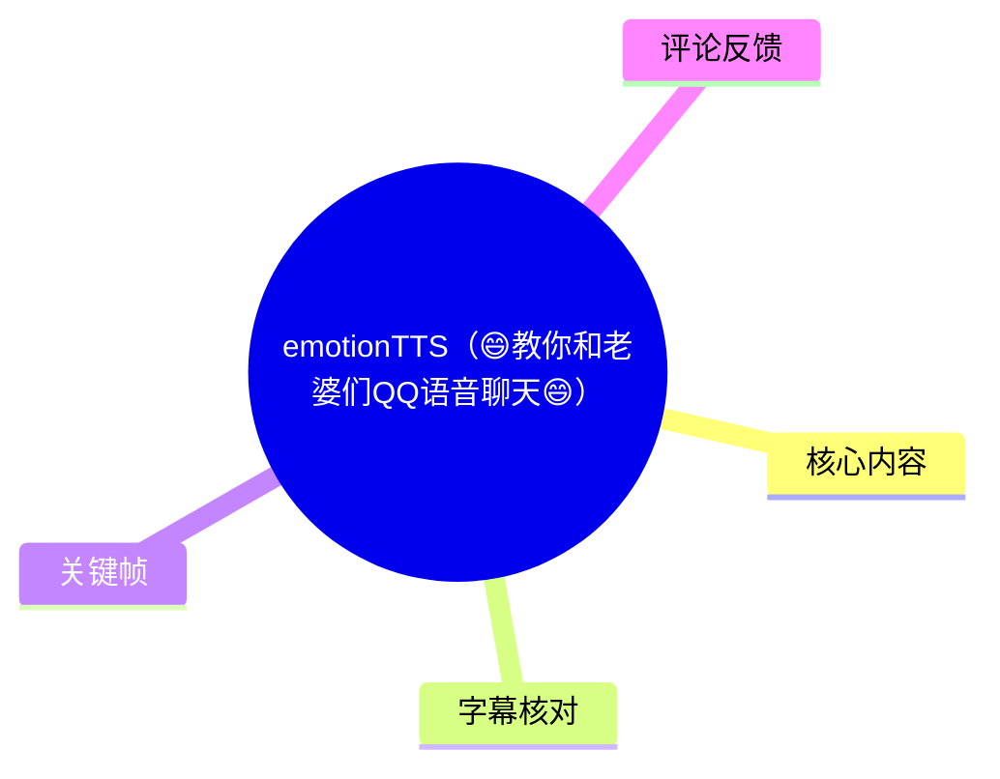
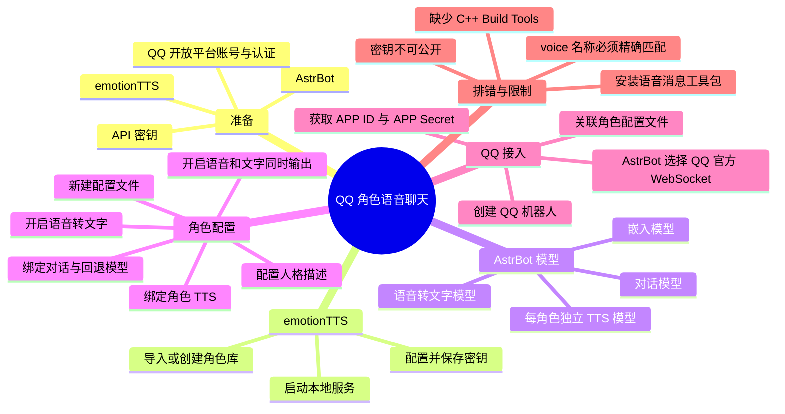
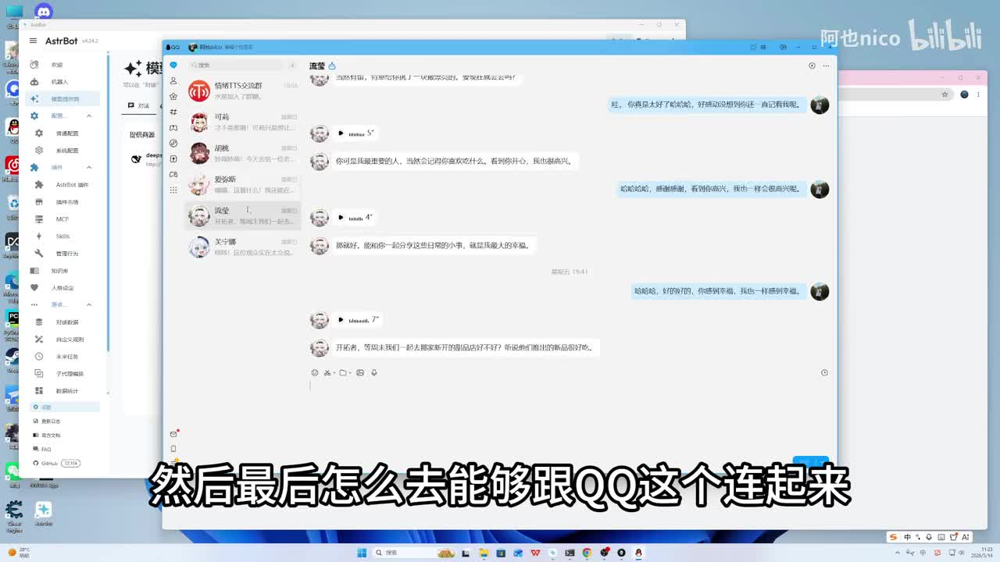
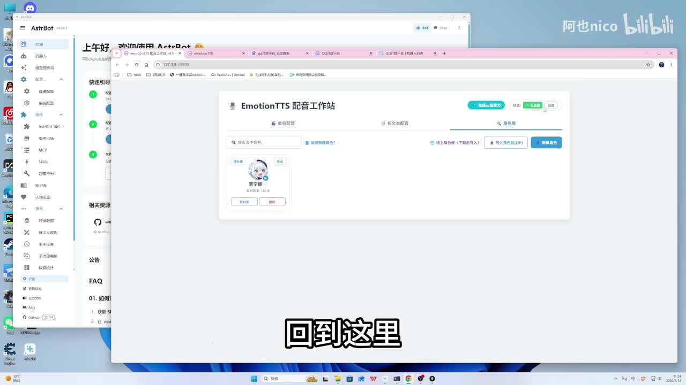
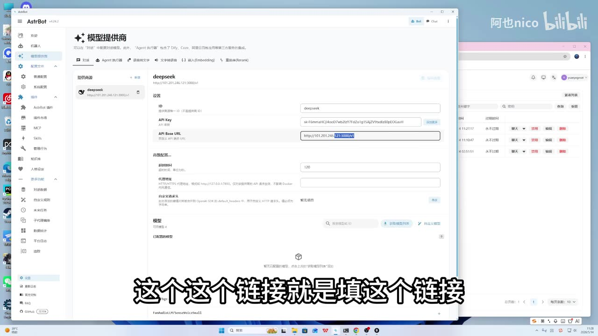
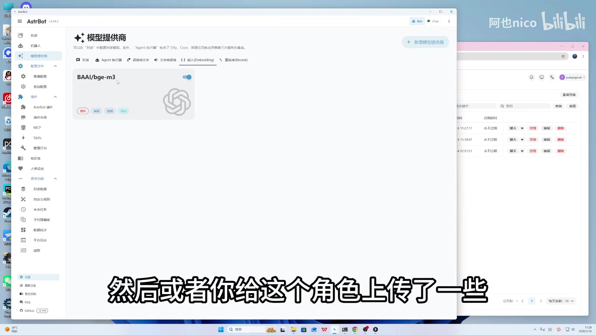

# emotionTTS（😄教你和老婆们QQ语音聊天😄）

> 来源：[Bilibili 视频](https://www.bilibili.com/video/BV1an5X66Ebb)  
> UP 主：阿也nico｜时长：13 分 40 秒｜合集：AIcode  
> 视频简介称：配置 AstrBot 与 emotionTTS，并接入 QQ 开放平台，实现与角色进行 QQ 语音聊天。

## 小结

本视频是一份 Windows 桌面端实操教程，目标是将 **emotionTTS 的角色语音**、**AstrBot 的大语言模型与角色配置能力**、以及 **QQ 开放平台机器人**串联起来。完成后，用户可在 QQ 中向自己创建的机器人发送文字或语音消息，并收到角色风格的文字和语音回复。

视频采用的核心结构是：先启动 emotionTTS 并填入密钥；再在 AstrBot 中依次配置对话模型、语音转文字模型、嵌入模型和文字转语音模型；随后为每个角色建立独立配置文件、人格描述和 TTS 映射；最后通过 QQ 开放平台的 `APP ID`、`APP Secret` 与 AstrBot 的 QQ 官方平台 WebSocket 机器人对接。

最容易出错的参数是 TTS 模型中的 **本地 API 地址、模型 ID 与 voice 名称**。视频明确强调：每个角色都应单独新建一个文字转语音模型；`voice` 必须与 emotionTTS 角色库里的角色名称完全一致，否则无法正确找到对应声线。示例使用“芙宁娜”，并以“流萤”说明多角色扩展方式。

QQ 接通后若只能收到文本、无法收到语音，视频给出的排查方向是 AstrBot 控制台报错与插件安装：需要从平台日志/安装页安装一个 ASR 中提及为“PiLK”的工具包；若安装失败，UP 主判断可能缺少 Microsoft C++ Build Tools。该工具名及具体安装入口受 ASR 识别误差影响，实际应以 AstrBot 控制台提示和项目文档为准。

视频中展示的模型 API Key 曾直接出现在屏幕画面中；热评也提醒了这一点。任何已经公开展示、录屏暴露或误提交的密钥都不应继续使用，应立即在对应服务商控制台撤销并重新生成。教程所涉 QQ 开放平台规则、AstrBot UI、插件名、模型名、费用与 API 兼容性均可能随版本变化，不能将视频中的界面和参数原样视为长期有效标准。

## 思维导图





## 目录

- [教程目标与前置准备](#教程目标与前置准备)
- [配置 emotionTTS 与密钥](#配置-emotiontts-与密钥)
- [在 AstrBot 配置四类模型](#在-astrbot-配置四类模型)
- [为角色建立配置、人格与语音输出](#为角色建立配置人格与语音输出)
- [接入 QQ 开放平台机器人](#接入-qq-开放平台机器人)
- [语音消息依赖、工作流程与排错](#语音消息依赖工作流程与排错)
- [扩展多个角色](#扩展多个角色)
- [参数清单与实施步骤](#参数清单与实施步骤)
- [限制、风险与时效性](#限制风险与时效性)
- [字幕比对](#字幕比对)
- [评论分析](#评论分析)
- [处理记录](#处理记录)

## [教程目标与前置准备](https://www.bilibili.com/video/BV1an5X66Ebb?t=1)

视频开场说明，此前 UP 主曾演示过“在 QQ 中与喜欢的角色聊天”，本期则针对观众提出的配置问题，从头讲解 AstrBot、emotionTTS 与 QQ 的连接过程。目标不是单独部署 TTS，而是搭出一条完整链路：

```text
QQ 用户消息
  ├─ 文字消息 → AstrBot 对话模型
  └─ 语音消息 → 语音转文字模型 → AstrBot 对话模型
                                     ↓
                             角色人格 / 配置文件
                                     ↓
                          emotionTTS 语音合成
                                     ↓
                       QQ 返回文字消息 + 语音消息
```

视频在 [00:40](https://www.bilibili.com/video/BV1an5X66Ebb?t=40) 提出的两个前置项为：

1. **下载并启动 emotionTTS**，打开其本地工作台网页。
2. **安装 AstrBot**。UP 主推荐“懒人包一键安装”，但未在可用素材中提供具体下载地址、版本号或安装命令。



> 图：画面同时展示 AstrBot 界面与 QQ 聊天窗口，QQ 对话中可见语音消息条。这张图说明教程的目标形态：机器人不只生成文本，也会向 QQ 回传语音。

### 前置条件与资料依赖

- 需要可运行 emotionTTS 和 AstrBot 的电脑环境；视频展示的是 Windows 桌面。
- 需要 QQ 账号，并按 QQ 开放平台要求完成注册、登录和认证。
- 需要用于模型服务的 API 密钥。UP 主提到该密钥需要充值，称“充一块钱也可以用很久”，但这只是视频中的经验性表述，实际消耗取决于服务商计费、模型、调用量及其后续政策。
- 视频称模型配置中涉及的 ID、名称、链接和人格文本会放在评论区文档；该文档内容未随本素材提供，因此本文不补写其具体 URL 或内容。

## [配置 emotionTTS 与密钥](https://www.bilibili.com/video/BV1an5X66Ebb?t=69)

### 1. 获取并写入密钥

在 [01:09](https://www.bilibili.com/video/BV1an5X66Ebb?t=69)，UP 主演示 emotionTTS 初始状态为红色，操作流程为：

1. 点击工作台中的相应按钮，进入视频所指的平台。
2. 注册后获取密钥。
3. 按该平台要求充值。
4. 回到 emotionTTS 的“设置”页面，填入密钥并保存。
5. 当状态显示“已连接”时，UP 主将其视为 emotionTTS 已经打通、可以使用的标志。



> 图：关键帧显示名为“EmotionTTS 配音工作站”的浏览器界面，页面中可见角色条目、上传角色与导入角色包等区域。它有助于理解后续 `voice` 参数需要对应角色库名称，而不是任意填写展示昵称。

视频称初始只有“芙宁娜”角色，后续可以增加其他角色。到 [12:04](https://www.bilibili.com/video/BV1an5X66Ebb?t=724) 时又说明，用户可自行创建角色，也可以从线上角色库下载并导入角色。

### 2. 密钥的用途与安全边界

UP 主指出，刚获得的密钥后续还会在 AstrBot 模型配置中使用。这里应区分两类事实：

- **视频操作事实**：UP 主将同一密钥用于其演示的若干模型配置。
- **实际部署原则**：应确认服务商是否允许同一密钥访问对话、ASR、嵌入等端点；不要假定任意兼容 API 都能共用密钥。

画面中的 AstrBot 配置页直接显示了一个以 `sk-` 开头的 API Key，且热评已有观众指出泄露问题。无论该密钥当时是否仍有效，公开视频中的凭据都应按已泄露处理：

- 立即撤销旧密钥；
- 创建新密钥；
- 限制新密钥权限、额度与来源 IP（若服务商支持）；
- 录屏、截图、日志和配置导出中一律脱敏；
- 不要把密钥写进人格提示词、公开文档或 QQ 消息内容。

## [在 AstrBot 配置四类模型](https://www.bilibili.com/video/BV1an5X66Ebb?t=117)

UP 主在 [01:57](https://www.bilibili.com/video/BV1an5X66Ebb?t=117) 进入 AstrBot 的“模型提供商”页面，依次配置四类能力。前 3 类可以理解为通用能力，第 4 类 TTS 则需要按角色分别创建。

### 1. 对话模型：负责角色生成回复

在 [02:22](https://www.bilibili.com/video/BV1an5X66Ebb?t=142)，视频将对话模型描述为让角色“进行说话”的大语言模型，举例提到 DeepSeek、豆包等。

UP 主给出的“简单方案”包括：

| 字段/动作 | 视频中的说明 |
| --- | --- |
| ID | 填 `deepseek` |
| API Key | 填此前获得的密钥 |
| API Base URL | 填视频/评论区文档提供的链接 |
| 获取模型列表 | 点击后选择模型 |
| 模型 | ASR 识别为 `DeepSeek V4 Flash`，专有名词存在识别不确定性 |
| 能力 | 保持文本与工具使用相关默认项 |
| 其余参数 | 视频建议不改，保存即可 |



> 图：画面为 AstrBot 的“模型提供商”配置页，可见 ID、API Key、API Base URL 等字段。它对应教程中最关键的凭据与接口配置步骤，也直观揭示了录屏泄露密钥的风险。

**重要校正：** 视频语音和 ASR 中的模型名存在混淆，例如“DeepSeq”“DeepSeek V4 Flash”。关键帧能确认页面中配置 ID 为 `deepseek`，但无法据此验证实际服务商、模型全名或 Base URL。部署时应以所用服务商控制台列出的模型 ID 为准。

### 2. 语音转文字模型：识别用户发来的语音

在 [02:46](https://www.bilibili.com/video/BV1an5X66Ebb?t=166)，视频说明语音转文字模型的作用：用户给角色发送语音消息后，该模型将语音识别为文本，让角色“听懂”消息。

UP 主的操作要点：

1. 新建语音转文字模型。
2. 按评论区文档填写相关内容。
3. 使用用户自己的密钥和对应链接。
4. 模型 ID 等参数按视频所述与上方方案保持对应。
5. 保存后点击启用。

视频没有在字幕中可靠地给出具体 ASR 模型名称、接口路径、音频格式限制、上传大小、采样率、并发上限或计费方式；这些必须在实际接入 API 前自行确认。

### 3. 嵌入模型：辅助历史消息和文档理解

在 [03:34](https://www.bilibili.com/video/BV1an5X66Ebb?t=214)，UP 主解释嵌入模型用于处理两类信息：

- 与角色的历史聊天消息；
- 上传给角色的文档。

视频的说法是，嵌入模型会对这些内容进行识别和整理，使大模型更容易、也更精准地理解相关内容。其演示步骤仍是新建、填入指定内容、使用同一密钥和链接、保存、启用；其余项目按视频说明不处理。



> 图：关键帧停在 AstrBot 的 `嵌入(Embedding)` 标签页，画面中显示一个嵌入模型卡片及启用开关。这解释了教程并非仅做“对话 + TTS”，还预留了记忆/知识文档检索相关能力。

### 4. 文字转语音模型：每个角色单独建立

在 [03:58](https://www.bilibili.com/video/BV1an5X66Ebb?t=238)，UP 主将 TTS 称为“最重要”的模型，并明确要求：**每创建一个角色，就单独新建一个文字转语音模型。**

以“芙宁娜”为例，视频信息整理如下：

| 参数 | 视频示例/要求 | 注意事项 |
| --- | --- | --- |
| TTS 模型 ID/名称 | 识别为 `emotionTTS-芙宁娜` 一类名称 | 用于区分该角色的 TTS 配置；字符拼写以实际 UI 为准 |
| API Key | 视频称可不填，甚至可随意填 | 仅适用于 UP 主展示的本地接口方案，不能泛化到其他 TTS 服务 |
| API URL | 本地 emotionTTS 服务地址 | ASR 识别为 `127.0.0.1:9880`；应在实际页面确认协议、端口与路径 |
| 模型 ID | `emotionTTS` | UP 主强调该项与上方模型配置不同，要特别注意 |
| `voice` | 对应角色名称，如“芙宁娜” | 必须与 emotionTTS 角色库名称完全一致 |
| 其余参数 | 视频建议不调整 | 版本差异可能改变默认值和字段 |

在 [05:10](https://www.bilibili.com/video/BV1an5X66Ebb?t=311)，UP 主再次强调 `voice` 是最容易配错的字段：它不是随意的显示名，而是 emotionTTS 角色库中用于定位角色的精确名称。因此，角色库名称、TTS 配置的 `voice`、AstrBot 角色配置和 QQ 机器人名称虽然可以保持一致以便管理，但真正影响声线匹配的是 `voice` 与角色库名称的对应关系。

## [为角色建立配置、人格与语音输出](https://www.bilibili.com/video/BV1an5X66Ebb?t=337)

模型准备完毕后，视频从 [05:36](https://www.bilibili.com/video/BV1an5X66Ebb?t=337) 开始创建角色配置文件，并将前面建立的模型关联到角色。

### 1. 新建角色配置文件

操作顺序为：

1. 在 AstrBot 中进入“普通配置”。
2. 在“选择配置文件”处点击“管理配置”。
3. 创建角色配置文件；示例为“芙宁娜”。
4. 新配置创建后，页面内容起初为空，再逐项填充。

### 2. 绑定对话、语音识别和 TTS

视频在 [06:00](https://www.bilibili.com/video/BV1an5X66Ebb?t=360) 至 [07:13](https://www.bilibili.com/video/BV1an5X66Ebb?t=433) 的关联关系如下：

| 配置项 | 应选择/执行的内容 | 用途 |
| --- | --- | --- |
| 默认对话模型 | 选择已配置的 DeepSeek 模型 | 角色正常生成回复 |
| 回退对话模型 | 同样选择已配置的 DeepSeek 模型 | 主模型不可用时回退；视频未展开具体触发规则 |
| 启用语音转文本 | 打开开关并选择前建 ASR 模型 | 接收并理解 QQ 语音消息 |
| 文本转语音 | 打开开关 | 允许回复通过 TTS 合成 |
| TTS 选择 | 选择该角色专属 TTS，例如“芙宁娜”TTS | 确保输出对应角色声线 |
| 人格 | 填入并选择角色人格配置 | 告知大模型角色身份、表达方式与行为边界 |

视频明确指出：如果创建的是“芙宁娜”，就必须选“芙宁娜”的读音/TTS 模型；模型与角色错配会导致声线不符合预期，甚至无法匹配角色。

### 3. 人格描述的写法

在 [07:13](https://www.bilibili.com/video/BV1an5X66Ebb?t=433)，UP 主将“人格”解释为对角色的描述，让大模型了解角色人格定义、知道应以怎样的方式对话。其建议有两种：

- 直接参考其放在评论区文档中的人格文本，再按自己的角色修改；
- 让大模型参考已有文本，生成另一角色的人格描述，然后复制到配置中。

视频没有提供完整人格文本，因此不应擅自补全角色设定。实际编写时，可将人格配置拆成以下可审查部分：

```text
角色身份：角色是谁；与用户的关系边界是什么。
语言风格：措辞、句长、口头习惯、禁用表达。
知识范围：允许依据哪些公开设定；不确定时如何回答。
行为限制：不冒充真人、不索取隐私、不承诺现实服务。
交互规则：称呼方式、是否简短、是否主动追问。
```

应避免把“角色人格”理解为绕过平台规则或弱化安全边界的提示词。人格只能影响表达风格，不能替代模型服务和 QQ 平台的安全规则。

### 4. 同时输出语音和文字

在 [08:01](https://www.bilibili.com/video/BV1an5X66Ebb?t=481)，UP 主提醒不要开启“流式输出”，而是在“更多配置”中开启 **“开启 TTS 时同时输出语音和文字内容”**。

其效果是：机器人回复时同时发送音频和文字两条消息。若不开启，UP 主称可能只得到音频或只得到文字；开启后用户无需每次再手动将语音转为文字。

该开关是否存在、名称是否一致、是否与流式输出冲突，均取决于 AstrBot 的版本；应以当前安装版本界面为准。

## [接入 QQ 开放平台机器人](https://www.bilibili.com/video/BV1an5X66Ebb?t=529)

### 1. 在 QQ 开放平台创建机器人

从 [08:49](https://www.bilibili.com/video/BV1an5X66Ebb?t=529) 开始，UP 主讲解 QQ 接入：

1. 搜索并进入 QQ 开放平台。
2. 用自己的 QQ 账号注册、登录。
3. 完成平台要求的认证流程。
4. 进入机器人列表，创建机器人。
5. 创建成功后，机器人会出现在自己的 QQ 中，并会发送一条消息。
6. 可修改机器人的名称和头像。
7. 记录机器人对应的 `APP ID` 与 `APP Secret`。

视频将 `APP ID` 与 `APP Secret` 称为“最关键”的信息。它们是机器人身份凭据，必须保存在本地受控环境中，不应发送给他人、贴进公开评论区、录屏或提交到公开仓库。

### 2. 在 AstrBot 创建 QQ 平台机器人

在 [09:37](https://www.bilibili.com/video/BV1an5X66Ebb?t=578)，UP 主给出的 AstrBot 侧流程是：

1. 进入机器人页面，点击创建机器人。
2. 平台选择 **QQ 官方平台的 WebSocket**。
3. 视频特别强调：**不要选择 WebHook，应选 WebSocket。**
4. 设置机器人名称，例如“芙宁娜”。
5. 填写来自 QQ 开放平台的 `APP ID`、`APP Secret`。
6. 在“配置文件”中选择此前创建完成的角色配置文件。
7. 启用并保存。

关联的本质是：

```text
QQ 平台机器人凭据
        ↓
AstrBot 的 QQ WebSocket 机器人
        ↓
指定角色配置文件
        ↓
对话模型 + ASR + 人格 + 角色 TTS
```

完成关联后，UP 主在 [10:26](https://www.bilibili.com/video/BV1an5X66Ebb?t=626) 表示，可以在 QQ 中向机器人发送消息，并收到对应回复。

## [语音消息依赖、工作流程与排错](https://www.bilibili.com/video/BV1an5X66Ebb?t=651)

### 1. 为什么接通 QQ 后仍没有语音

视频指出，完成 QQ 机器人关联并不代表一定能收到语音消息。若正常文本回复已经可用、但 QQ 无法收到语音，应检查 AstrBot 控制台报错。

在 [10:51](https://www.bilibili.com/video/BV1an5X66Ebb?t=651)，UP 主称需要依据控制台提示，在“平台日志/安装”相关位置安装一个工具包；ASR 将其识别为 **“PiLK”**。由于该词可能是插件名、依赖名或识别错误，本文不将其作为可直接执行的确定名称。正确做法是：

1. 复现发送语音时的报错；
2. 阅读当前 AstrBot 控制台展示的依赖名称、版本和安装命令；
3. 使用官方文档或项目仓库确认来源；
4. 安装后重启相关服务并再次测试。

若安装该包失败，UP 主判断可能缺少 Microsoft C++ Build Tools，并建议到微软渠道安装。该判断适用于其录屏环境中的某类编译/安装失败，不足以覆盖所有失败原因；还可能涉及 Python 版本、系统架构、权限、网络、编译器版本或依赖镜像问题。

### 2. 视频描述的端到端消息流程

在 [11:39](https://www.bilibili.com/video/BV1an5X66Ebb?t=699)，UP 主描述了系统运行逻辑：

1. QQ 机器人收到用户消息；
2. 若为语音，先由语音转文字能力识别；
3. 调用语言大模型生成回复；
4. 将回复文本交给 emotionTTS 合成音频；
5. 将生成的语音和文字一起返回 QQ；
6. 用户在 QQ 对话中收到角色的文本与语音回复。

### 3. 推荐的分层验收顺序

视频没有单独列出验收表，但按其依赖关系，可将排查拆分为以下顺序，避免同时检查所有环节：

| 层级 | 验收动作 | 成功标准 | 失败时优先检查 |
| --- | --- | --- | --- |
| emotionTTS | 在本地工作台选择角色并合成 | 服务显示连接正常、角色可用 | 密钥、余额、角色包、本地服务 |
| LLM | 在 AstrBot 内测试文本对话 | 可返回文本 | API Key、Base URL、模型 ID、网络 |
| ASR | 发送短语音给 AstrBot/机器人 | 语音被识别成文本 | ASR 启用状态、模型配置、音频支持 |
| TTS | 触发角色文字转语音 | 输出目标角色语音 | 本地 URL、`emotionTTS` 模型 ID、`voice` 精确名称 |
| QQ | QQ 内发文本消息 | 收到文本回复 | WebSocket、APP ID、APP Secret、配置文件绑定 |
| QQ 语音 | QQ 内发消息并等待回复 | 同时收到文字和语音 | 语音工具包、控制台报错、TTS 输出开关 |

## [扩展多个角色](https://www.bilibili.com/video/BV1an5X66Ebb?t=724)

视频用“流萤”在 [12:04](https://www.bilibili.com/video/BV1an5X66Ebb?t=724) 说明多角色扩展。核心不是复制一个名字，而是将角色所需资源保持一一对应：

1. 在 emotionTTS 中导入或创建目标角色。
2. 在 AstrBot 的模型配置中，为目标角色单独新建 TTS 配置。
3. TTS 的名称和 `voice` 填为该目标角色对应名称；其他通用模型配置按视频说法通常不必重复变更。
4. 在“普通配置”中新建该角色的配置文件。
5. 为角色配置对话模型、ASR、人格和其专属 TTS。
6. 在 AstrBot 中再创建一个机器人，并关联该角色配置文件。
7. 在 QQ 开放平台新建该角色对应的机器人 ID。
8. 将新 QQ 机器人的 `APP ID`、`APP Secret` 填回 AstrBot 对应机器人。

可将多角色管理抽象为：

| 资源 | 是否每角色独立 | 视频依据 |
| --- | --- | --- |
| emotionTTS 角色库条目 | 是 | 角色库中需存在目标角色 |
| TTS 模型配置 | 是 | UP 主明确要求每个角色单独新建 |
| TTS `voice` | 是 | 必须对应角色库名称 |
| AstrBot 普通配置文件 | 是 | 视频要求新建“流萤”配置 |
| 人格描述 | 建议是 | 不同角色需不同人格定义 |
| QQ 开放平台机器人 / APP 凭据 | 是 | 视频要求新建相应 ID |
| 对话模型、ASR、嵌入模型 | 可共享或复用 | 视频称主要单独调整 TTS，其他不变；仍需按自身服务权限确认 |

## [参数清单与实施步骤](https://www.bilibili.com/video/BV1an5X66Ebb?t=40)

以下清单仅整理视频明确表达或由关键帧能够支持的内容；不包含评论区文档中未提供的 URL、密钥、人格文本或安装命令。

### 参数总表

| 区域 | 字段 | 视频内容 | 必须确认的事项 |
| --- | --- | --- | --- |
| emotionTTS | 密钥 | 注册、充值后填入设置 | 密钥来源、余额、权限与有效期 |
| AstrBot 对话模型 | ID | `deepseek` | 实际服务商是否使用该 ID |
| AstrBot 对话模型 | API Key | 视频中的同一密钥 | 不得使用录屏暴露的 Key |
| AstrBot 对话模型 | API Base URL | 视频称按文档填写 | 需从服务商官方控制台获取 |
| AstrBot 对话模型 | 模型名 | ASR 为 `DeepSeek V4 Flash` | 名称疑有识别误差，以模型列表为准 |
| AstrBot ASR | Key、链接、模型 ID | 按视频文档填写并启用 | 语音模型能力、格式及费用 |
| AstrBot 嵌入 | Key、链接、模型名 | 按视频方案填写并启用 | 与文档/记忆功能的兼容性 |
| AstrBot TTS | API URL | ASR 为本地 `127.0.0.1:9880` | 应确认完整 URL、协议和端口 |
| AstrBot TTS | 模型 ID | `emotionTTS` | 区分于自定义 TTS 配置名称 |
| AstrBot TTS | `voice` | 与库中角色名完全一致 | 大小写、符号与字符必须精确一致 |
| 角色配置 | 默认/回退对话模型 | 都选已配置对话模型 | 回退机制与可用性 |
| 角色配置 | 语音转文本 | 开启并选择 ASR | 测试 QQ 语音输入 |
| 角色配置 | 同时输出语音和文字 | 应开启 | 版本中开关名称可能变化 |
| QQ 开放平台 | `APP ID`、`APP Secret` | 创建机器人后获得 | 必须保密，不能公开 |
| AstrBot QQ 机器人 | 平台类型 | QQ 官方平台 WebSocket | 视频强调不要选 WebHook |

### 从零实施检查表

1. 启动 emotionTTS，确认本地工作台可以访问。
2. 获取合法 API 密钥并在 emotionTTS 中保存，确认显示连接成功。
3. 安装并打开 AstrBot。
4. 在 AstrBot 依次建立对话、ASR、嵌入模型，保存并启用。
5. 为第一个角色建立独立 TTS，重点检查本地 URL、`emotionTTS` 模型 ID 与 `voice`。
6. 新建该角色的普通配置文件，绑定对话模型、回退模型、ASR、TTS 与人格。
7. 关闭视频所说不应开启的流式输出，开启“同时输出语音和文字”。
8. 在 QQ 开放平台注册、认证并创建机器人，安全保存 `APP ID`、`APP Secret`。
9. 在 AstrBot 创建 QQ 官方平台 WebSocket 机器人，填入凭据并绑定角色配置文件。
10. 先测试 QQ 文本收发，再测试语音输入和语音回复。
11. 若没有语音回复，查看控制台的原始错误，按当前版本提示安装依赖；不要仅凭 ASR 中不确定的“PiLK”名称搜索第三方安装包。
12. 测试成功后，立刻检查日志、截图、配置导出和录屏中是否泄露 Key/Secret。

## [限制、风险与时效性](https://www.bilibili.com/video/BV1an5X66Ebb?t=796)

### 视频未覆盖或未能验证的内容

- 未提供 emotionTTS、AstrBot、QQ 开放平台的具体版本号。
- 未提供所用模型服务的真实 API Base URL、模型精确名称及服务商条款。
- 未提供评论区文档、人格模板、下载包或角色资源的实际内容。
- 未说明 TTS 合成延迟、并发量、CPU/GPU 消耗、内存占用、磁盘需求和网络要求。
- 未说明 QQ 开放平台机器人的审核状态、消息权限、可用范围和账号风控要求。
- 未说明第三方角色音色的授权来源、再分发权和商用限制。
- 未说明用户语音、聊天记录、文档和模型请求会如何被本地服务或第三方 API 存储与处理。

### 安全与隐私风险

1. **密钥泄露风险高**：关键帧中可见 API Key 内容，且热评指出同一问题。所有已公开凭据均应轮换。
2. **QQ 凭据风险高**：`APP Secret` 一旦泄露，可能导致机器人身份被冒用或服务被滥用。
3. **隐私风险**：语音转文字、对话、嵌入模型可能将用户音频、文本、历史消息和文档发送至第三方服务；接入前应阅读服务商数据政策。
4. **角色与声音权利风险**：视频以游戏角色为例。角色设定、姓名、音色、素材包及其传播用途可能受版权、人格权、平台规则或项目许可约束。
5. **提示词与内容安全**：人格配置不应诱导模型输出违法、有害、骚扰、冒充真人或泄露个人信息的内容。
6. **本地端口暴露风险**：视频所述 TTS 使用回环地址 `127.0.0.1`，通常只供本机访问；若为了远程访问而改为暴露端口，应额外配置鉴权、防火墙与访问控制。

### 时效性判断

该视频的元数据发布时间为 2026 年 5 月。AI 模型名称、计费、API 兼容格式、AstrBot 的菜单结构、插件依赖、QQ 开放平台认证与机器人能力变化都可能很快发生。建议把视频作为流程参考，而将以下内容完全以当前官方文档和控制台为准：

- 下载安装渠道与版本兼容矩阵；
- QQ 官方平台的机器人准入和 WebSocket 接入方式；
- AstrBot 的插件名称、安装方法及配置字段；
- 模型服务商的 API 地址、模型 ID、额度与价格；
- emotionTTS 的角色包格式、接口端口和授权说明。

## [字幕比对](https://www.bilibili.com/video/BV1an5X66Ebb?t=1)

本任务同时提供了站内 SRT 与本次 ASR，已对两者进行检查。ASR 结果**没有**标记 `noAudioStream=true`；诊断显示音频时长约 819.78 秒、语音覆盖约 98.72%、首段语音在 1.07 秒、末段语音在 819.02 秒，因此源视频具有音轨，本次 ASR 可用于建立时间轴。

| 字幕来源 | 完整性 | 专有名词 | 时间轴 | 主要问题 |
| --- | --- | --- | --- | --- |
| Bilibili 站内字幕 `p01-ai-zh.srt` | 与本视频内容不一致 | 大量出现与教程无关的人名、剧情名词 | 虽有完整时间段，但对应的是另一段内容 | 从开头即为电视剧剧情解说，与视频实际的 AstrBot/emotionTTS 教程完全不符，不能采用 |
| 本次 ASR 字幕 | 高，36 段，语音覆盖约 98.72% | 部分英文、产品名和角色名有误识别 | 有连续、可用的真实分段时间 | `AstrBot` 被识别为 Astrobot/ASAPOT，`emotionTTS` 被识别为 Evolution/Evotion TTS；模型名、插件名及端口格式存在不确定性 |

### 最终字幕选择

正文的时间轴以**本次 ASR 的 SRT 起止时间**换算秒数建立；站内字幕因内容完全错配而不采用。关键帧和视频标题/简介用于校正以下重要信息：

| ASR 表达 | 采用写法 | 校正依据与说明 |
| --- | --- | --- |
| Astrobot / ASAPOT | AstrBot | 视频标题简介、画面左上角产品界面 |
| Evolution TTS / Evotion TTS | emotionTTS | 视频标题与简介明确写为 emotionTTS |
| Deepseq / dbsig | DeepSeek（服务/ID） | 关键帧中的配置 ID 可见 `deepseek`；具体模型全名仍不确定 |
| “127.0.0.0.9880”类表达 | `127.0.0.1:9880`（待现场确认） | ASR 上下文指向本地回环地址与 9880 端口，但未能从画面完全核验完整 URL |
| PiLK | 保留为 ASR 不确定词 | 缺乏清晰画面或官方资料验证，不作为确定插件名 |
| 芙尼纳/弗尼纳等 | 芙宁娜 | 视频语境、标题标签“原神”及角色库画面共同支持 |

## [评论分析](https://www.bilibili.com/video/BV1an5X66Ebb?t=796)

仅处理可获取的热评前三条；评论属于用户观点或未验证补充，不能替代官方文档。

1. **“有无手机的教程[思考]”**（3 赞）  
   - 观点：观众希望获得手机端教程。  
   - 分析：视频展示的是 Windows 桌面环境，涉及本地 emotionTTS 服务、AstrBot 配置、插件/编译依赖等，确实并未覆盖纯手机端部署。该评论反映教程的适用范围更偏 PC，而非证明手机端一定不可行。

2. **“up你视频里面露deepseek的api了”**（2 赞）  
   - 观点：指出录屏中暴露了 DeepSeek API Key。  
   - 分析：该提醒与提供的关键帧一致，配置页确实可见以 `sk-` 开头的 Key。即使无法判断该 Key 当时是否有效，也应按泄露凭据处置：撤销、轮换、检查调用记录及设置额度限制。该评论是本视频最具操作紧迫性的安全补充。

3. **“Astrbot下载链接已在资源整理网站整理好了…… ”**（2 赞）  
   - 观点：评论者提供了一个经字符替换后的第三方资源整理站地址。  
   - 分析：这是第三方用户提供的信息，不能验证其网站归属、链接安全性、软件完整性或版本真实性。应优先从 AstrBot 官方仓库、官方文档或可信发布渠道下载，不建议仅因评论推荐而执行下载或运行未知文件。

## [处理记录](https://www.bilibili.com/video/BV1an5X66Ebb?t=1)

- Worker ID：`worker-mrj0wjed-b0c290ad`
- 模型：`gpt-5.6-terra`
- 使用素材与工具产物：视频元数据、站内 SRT `p01-ai-zh.srt`、本次 ASR SRT/JSON、ASR 覆盖诊断、12 个关键帧路径清单、已提供的关键帧画面、热评 JSON。
- 字幕选择：检查了站内字幕与本次 ASR。站内 SRT 内容为无关剧情解说，和教程画面及 ASR 完全冲突；采用 ASR 的真实分段时间建立章节时间轴，并对产品名、角色名和高风险参数进行保守校正。
- 音轨判断：ASR 诊断未标记 `noAudioStream=true`，且显示约 98.72% 语音覆盖；据此确认视频有音轨，不存在“源视频没有音轨”的情形。
- 关键帧选择依据：选用 `frame-001.jpg` 展示 QQ 语音聊天目标效果，`frame-002.jpg` 展示 emotionTTS 角色库/工作站，`frame-003.jpg` 展示 AstrBot 模型提供商配置及密钥泄露风险，`frame-004.jpg` 展示嵌入模型页面；这些画面分别支撑流程、角色、参数和能力分层，不使用未提供可视内容的其他帧来推断信息。
- 缓存清理：本次仅基于任务直接提供的素材生成文档，未产生可报告的临时下载或额外缓存；无缓存清理操作记录。
- 未解决问题：评论区文档链接及内容未提供；具体 API Base URL、模型精确名称、语音工具包真实名称、软件版本、QQ 平台当前准入规则均无法由现有素材可靠确认。

## 评论分析

- 热评 1：有无手机的教程[思考]
- 热评 2：up你视频里面露deepseek的api了
- 热评 3：Astrbot下载链接已在资源整理网站整理好了[doge] htz@ygl.top（删掉@就是网站）[吃瓜]

以上内容是观众反馈摘录，只用于补充理解视频反响，不作为正文事实依据。
