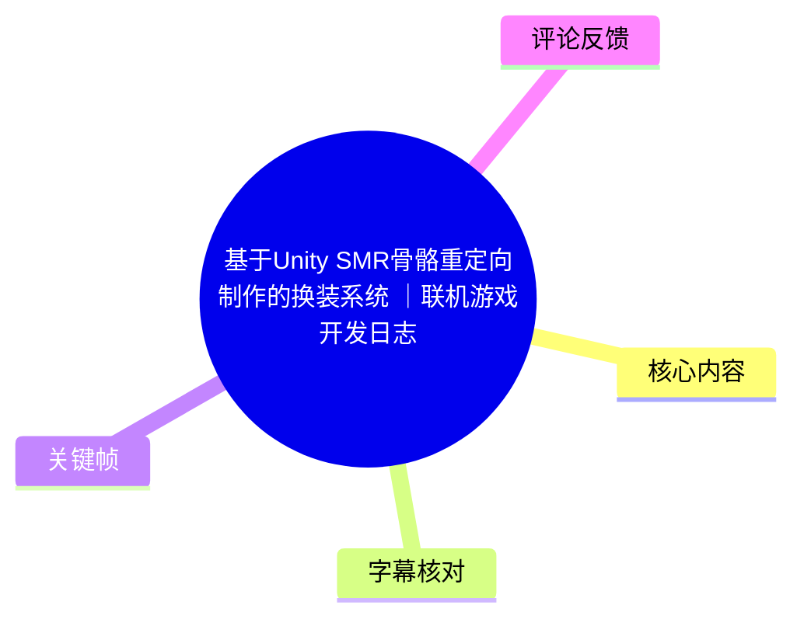
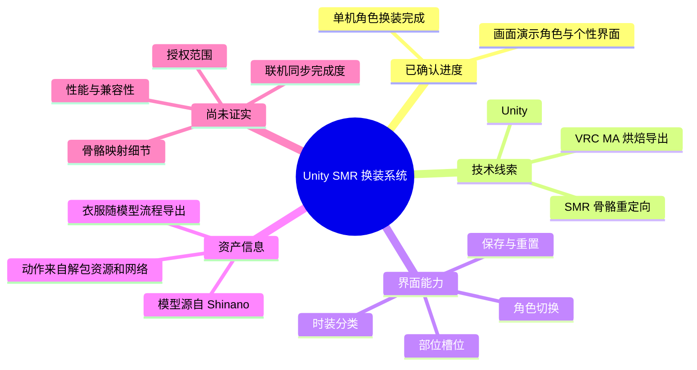
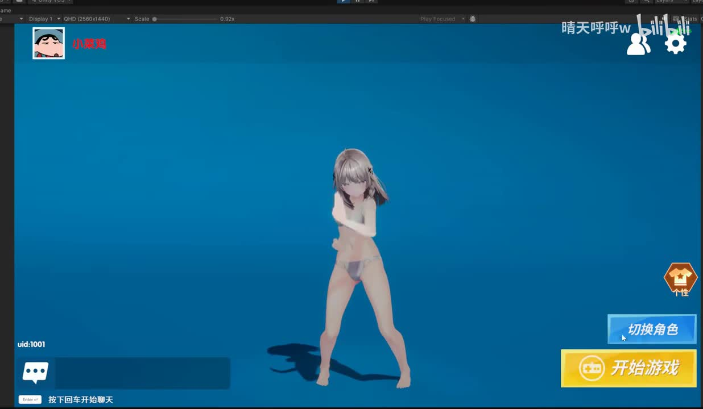
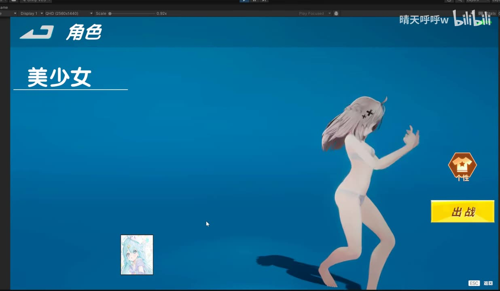
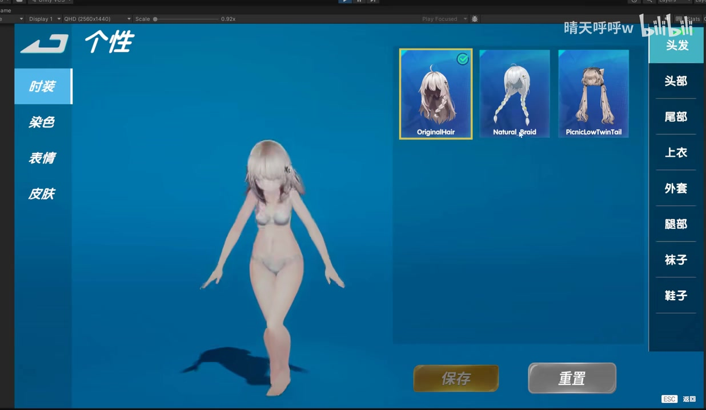
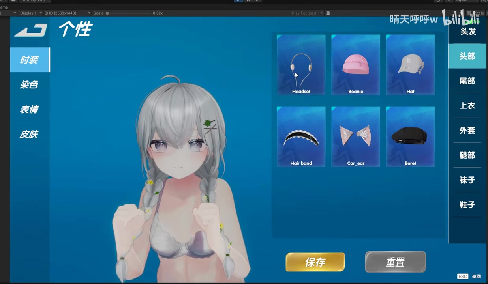

# 基于Unity SMR骨骼重定向制作的换装系统 ｜联机游戏开发日志

> 来源：[Bilibili 视频](https://www.bilibili.com/video/BV1Xmjf6AEf9) 
> UP 主：晴天呼呼w｜时长：53 秒｜分辨率：1920×1118｜合集：AIcode

## 小结

该视频是一个以画面演示为主、几乎没有技术讲解口播的 Unity 开发日志。标题表明系统基于 **Unity SMR（Skinned Mesh Renderer，蒙皮网格渲染器）骨骼重定向**制作，目标是为角色实现换装；画面实际展示了角色选择与“个性”配置界面中的时装部件选择效果。

UP 主在视频简介中明确说明：**单机角色换装已经完成**。角色模型及衣服通过 VRC 的 MA 插件进行烘焙导出，模型源自 Shinano；角色动作来自“解包资源和网络”。这些是本视频关于资产来源与当前开发进度的主要一手信息。

演示界面具有“时装 / 染色 / 表情 / 皮肤”等一级分类；在时装下还可选择头发、头部、尾部、上衣、外套、腿部、袜子、鞋子等部位。画面可见发型卡片与头部配件卡片，底部设有“保存”和“重置”按钮，说明系统至少覆盖了按槽位挑选部件与配置提交/恢复这一前端交互闭环。

标题提及“联机游戏开发日志”，但简介只确认了**单机**换装已完成；给定素材中没有网络同步、房间联机、其他玩家角色显示、断线重连或装备数据持久化的演示。因此不能据此认定换装功能已经完成联机同步。

视频音频以音乐为主，没有可用的中文技术讲解。站内字幕绝大部分仅标作“音乐”，本次 ASR 也只识别到少量英文歌词片段，不能用于还原实现代码、骨骼映射规则、网络协议、性能指标或具体 Unity 配置参数。本文将画面可见事实、简介陈述与基于标题的有限解释严格区分。

## 思维导图

## 目录

- [视频定位、背景与时效性](#视频定位背景与时效性)
- [演示界面与可见功能](#演示界面与可见功能)
  - [角色入口与角色选择](#角色入口与角色选择-0000)
  - [时装槽位与发型选择](#时装槽位与发型选择-0000)
  - [头部配件与配置操作](#头部配件与配置操作-0000)
- [技术信息与实现边界](#技术信息与实现边界)
- [可复核的操作流程](#可复核的操作流程)
- [参数、限制与时效性](#参数限制与时效性)
- [字幕比对](#字幕比对)
- [评论分析](#评论分析)
- [处理记录](#处理记录)

## 视频定位、背景与时效性

### [开发日志的证据范围](https://www.bilibili.com/video/BV1Xmjf6AEf9?t=0)

视频总长 53 秒，属于功能展示型短日志，不是含完整工程操作的教程。开头至结尾均有音乐时间轴字幕，但没有口头说明系统架构。

从标题可获得的技术主题是“基于 Unity SMR 骨骼重定向制作的换装系统”。这里的“SMR”通常指 Unity 的 `Skinned Mesh Renderer` 组件；但视频没有展示 Inspector、骨架层级、Avatar 配置、绑定代码或权重数据，故只能将其视为作者对实现路线的概述，不能进一步推导具体重定向算法。

简介提供了以下可确认信息：

| 项目 | 视频/简介明确陈述 | 不应扩展推断的部分 |
| --- | --- | --- |
| 当前进度 | 已完成单机角色换装 | 未说明所有时装、所有槽位都已制作完毕 |
| 资产导出 | 角色模型及衣服基于 VRC 的 MA 插件烘焙导出 | 未给出 MA 版本、具体组件和导出参数 |
| 模型来源 | Shinano | 未提供模型授权条款或二次分发许可 |
| 动作来源 | 解包资源和网络 | 未说明资源名称、授权状态、导入流程或重定向配置 |
| 联机状态 | 标题含“联机游戏开发日志” | 未展示换装数据的网络复制或多人可见性 |

**时效性：** 元数据时间戳换算为 2026-06-21；抓取素材时间为 2026-07-15。开发日志反映的是该时点的演示版本，之后的功能、资源、Unity/VRC 工具版本及授权状况均可能变化。

## 演示界面与可见功能

### [角色入口与角色选择 [00:00]](https://www.bilibili.com/video/BV1Xmjf6AEf9?t=0)

起始画面是蓝色背景的角色主界面：中央显示一名正在播放动作的角色，右侧可见“个性”“切换角色”“开始游戏”等按钮，左下角有聊天输入区域与 `uid:1001` 标识。

> 图：关键帧展示角色处于主界面时的预览状态，并能看到“切换角色”和“开始游戏”入口。其价值在于说明换装/个性系统并非脱离游戏的独立工具页面，而是被置于游戏风格的角色前端流程中。

随后画面进入“角色”页面，左侧显示“美少女”字样，右下角有“出战”按钮，并保留角色动作预览。该界面表明演示至少区分了角色选取和出战确认两个环节。

> 图：关键帧可见“角色”“美少女”“出战”文字及全身角色预览。它用于确认视频展示了角色选择层，而不只是单一的服装物品列表。

### [时装槽位与发型选择 [00:00]](https://www.bilibili.com/video/BV1Xmjf6AEf9?t=0)

“个性”页面左侧包含“时装、染色、表情、皮肤”四个分类，其中“时装”处于选中状态。右侧的垂直槽位导航可见：

- 头发
- 头部
- 尾部
- 上衣
- 外套
- 腿部
- 袜子
- 鞋子

在“头发”槽位下，画面展示了 `OriginalHair`、`Natural_Braid`、`PicnicLowTwinTail` 三个发型卡片；`OriginalHair` 有选中标识。底部可以看到“保存”“重置”按钮。

> 图：关键帧完整呈现时装分组、右侧部位槽位、发型候选项及保存/重置按钮。它是判断系统采用“按部位槽位替换或选择外观部件”交互模式的直接画面证据。

这里能确认的是**界面存在多个可选发型条目**，以及用户可通过槽位切换服装类别。不能从单帧确定每次点击后的模型挂载流程、是否使用同一骨架、是否即时写入存档，或多个部件间是否存在互斥规则。

### [头部配件与配置操作 [00:00]](https://www.bilibili.com/video/BV1Xmjf6AEf9?t=0)

切换到“头部”槽位后，角色预览被拉近，候选项显示为：

- `Headset`
- `Beanie`
- `Hat`
- `Hair band`
- `Cat_ear`
- `Beret`

这说明“头部”被设计为独立于“头发”的装备位，至少在 UI 数据层面可单独浏览。角色头部区域在预览中保留发型，同时展示头饰候选项，符合多部位组合式换装的界面设计。

> 图：关键帧展示“头部”标签被选中，并显示六种配件卡片。其价值在于补充发型之外的第二种装备位证据，表明系统并非只有单一发型替换功能。

视频没有出现点击“保存”后的成功提示、重启后的配置恢复、与其他客户端同步后的视觉结果。因此，保存与重置只能确认按钮存在，不能确认其底层数据存储和网络传播行为。

## 技术信息与实现边界

### [SMR 骨骼重定向：标题给出的实现方向](https://www.bilibili.com/video/BV1Xmjf6AEf9?t=0)

作者在标题中将方案概括为“Unity SMR 骨骼重定向”。在 Unity 语境中，SMR 是负责将网格按骨骼变形渲染的组件；换装系统若要让衣服随角色动作正确变形，通常需要衣物网格对应目标角色骨架或被映射至目标骨架。

但本视频未公开下列关键实现信息：

1. 角色与衣物是否共享完全相同的骨架层级；
2. 是否通过骨骼名称、Humanoid Avatar、Transform 路径或自定义映射表进行重定向；
3. 是否运行时复制 `bones`、`rootBone`、材质、BlendShape 权重或 Avatar；
4. 衣物是否经过权重转移、顶点裁剪、身体隐藏或穿模处理；
5. 多个装备槽位的挂载、卸载与互斥逻辑；
6. 资源加载策略，如预加载、Addressables、AssetBundle 或对象池；
7. 联机环境中的装备 ID 同步、服务端校验和晚加入玩家状态恢复。

因此，不能将标题中的“SMR 骨骼重定向”写成已被视频逐步证明的具体代码方案；它是作者公开的技术标签，而非本素材可复现的完整教程。

### [资产与动作来源的限制](https://www.bilibili.com/video/BV1Xmjf6AEf9?t=0)

简介称角色模型和衣服“基于 VRC 的 MA 插件的烘焙导出”，模型源自 Shinano，动作来源于“解包资源和网络”。这些来源信息意味着复现者至少需要关注以下边界：

- **资产许可：** 视频没有给出 Shinano 模型、衣服、动作及其衍生导出文件的授权文本。不能据此假设允许商用、再分发或用于联机游戏。
- **工具差异：** 未给出 MA 插件名称的完整版本、Unity 版本、VRChat SDK 版本或烘焙操作，因此同名工具在不同版本下的导出结果可能不同。
- **动作来源不透明：** “解包资源和网络”不是可复核的动作清单，且不能据此确认动作的版权、适用许可证或骨骼兼容性。
- **演示范围有限：** 画面验证了角色在预览界面中播放动作并显示外观选项，但没有验证高速动作、极端姿势、多人场景下的穿模与性能。

## 可复核的操作流程

### [从角色选择进入个性配置的画面流程](https://www.bilibili.com/video/BV1Xmjf6AEf9?t=0)

以下流程是根据关键帧中已显示的按钮和页面层级整理的**界面使用路径**，不是作者展示的 Unity 编辑器制作步骤：

1. 在角色主界面查看当前角色预览，页面右侧存在“切换角色”和“个性”入口。
2. 进入“角色”页面，选择角色条目；画面中显示角色名称“美少女”和“出战”按钮。
3. 进入“个性”页面，在左侧选择“时装”分类。
4. 在右侧槽位导航中选择目标部位，例如“头发”或“头部”。
5. 在中部卡片列表浏览对应部位的外观候选项。
6. 使用底部“保存”或“重置”按钮提交或恢复配置。视频仅证实按钮可见，不足以证实其结果写入与恢复机制。
7. 返回角色/主界面时，角色继续以动作预览形式显示；视频没有明确展示每一次部件点击前后的对照结果，不能量化换装切换成功率。

### [对开发者可迁移的界面拆分经验](https://www.bilibili.com/video/BV1Xmjf6AEf9?t=0)

从画面结构可归纳出一套可迁移的产品层级，但应注意这属于对可见 UI 的设计归纳，而不是作者公开的代码架构：

| 界面层 | 画面可见职责 | 适合承载的数据概念 |
| --- | --- | --- |
| 主界面 | 角色预览、进入角色/个性页面、开始游戏 | 当前角色、玩家 UID、主菜单状态 |
| 角色页 | 选择角色并执行“出战” | 角色 ID、角色头像、角色解锁状态 |
| 个性一级分类 | 在时装、染色、表情、皮肤间切换 | 外观系统的大类 |
| 时装槽位 | 按头发、头部、尾部、服装等部位浏览 | 装备槽位 ID、互斥组、部位排序 |
| 外观卡片 | 显示候选物与选中状态 | 物品 ID、缩略图、名称、拥有状态 |
| 保存/重置操作 | 提交或撤回当前编辑态 | 编辑前快照、待保存配置、默认配置 |

该拆分能够把“角色选择”“外观编辑”“预览显示”分为清晰的用户流程；但数据如何落盘、如何驱动 SMR、如何经网络同步，均不在视频提供的证据范围内。

## 参数、限制与时效性

### [可获得参数](https://www.bilibili.com/video/BV1Xmjf6AEf9?t=0)

| 类别 | 参数或事实 | 来源 |
| --- | --- | --- |
| 视频时长 | 53 秒；ASR 读取音频时长为 52.224 秒 | 视频元数据、ASR 诊断 |
| 视频尺寸 | 1920×1118 | 元数据 |
| 技术标签 | Unity、换装系统、SMR 骨骼重定向 | 标题、标签 |
| 已确认功能阶段 | 单机角色换装已完成 | 视频简介 |
| 时装一级分类 | 时装、染色、表情、皮肤 | 关键帧画面 |
| 可见时装槽位 | 头发、头部、尾部、上衣、外套、腿部、袜子、鞋子 | 关键帧画面 |
| 可见发型条目 | `OriginalHair`、`Natural_Braid`、`PicnicLowTwinTail` | 关键帧画面 |
| 可见头部条目 | `Headset`、`Beanie`、`Hat`、`Hair band`、`Cat_ear`、`Beret` | 关键帧画面 |
| ASR 模型 | medium，CUDA，float16 | ASR 诊断 |

### [重要限制](https://www.bilibili.com/video/BV1Xmjf6AEf9?t=0)

- 视频没有口播技术讲解，无法从字幕获得类名、脚本、配置字段、性能消耗或网络通信细节。
- 标题虽包含“联机游戏”，但素材只确认单机换装完成；**联机同步完成度未知**。
- 没有给出 Unity、MA、VRC SDK、模型或动作资源的版本号。
- 没有出现代码、Inspector、骨骼绑定对照或性能分析画面，无法验证 SMR 重定向的具体实现与稳定性。
- 关键帧能确认页面和候选项存在，但无法确认所有卡片都可用，也不能确认保存、重置的实际执行结果。
- 模型、衣服、动作的使用许可未在素材中展开；涉及解包资源时尤其应自行核实权利状态，不能将视频描述视为授权证明。
- 视频发布后项目功能、资源内容与工具链可能迭代；本文仅记录抓取时可得素材所反映的版本。

## 字幕比对

### [字幕与音频识别核验](https://www.bilibili.com/video/BV1Xmjf6AEf9?t=0)

| 字幕来源 | 完整性 | 专有名词 | 时间轴 | 主要问题 |
| --- | --- | --- | --- | --- |
| Bilibili 站内字幕 `p01-ai-zh.srt` | 覆盖约 00:00.220—00:52.200，但绝大多数内容为“♪ 音乐 ♪” | 未识别 Unity、SMR、MA、Shinano 等词 | 有真实 SRT 起止时间 | 仅在 00:10.679—00:16.340 出现“害羞害羞 拍打……”等疑似歌词/音乐标签，不能构成技术说明 |
| 本次 ASR | 4 个片段、累计语音覆盖 8.69 秒，占音频 16.64% | 无相关技术专有名词 | 有真实 SRT 时间戳 | 识别语言为英语，内容为零散歌词；与技术主题无关，且不能补充画面中的系统信息 |

本次 ASR 已实际检查，诊断中**未标记** `noAudioStream=true`；源视频存在音频流，且 ASR 的低覆盖率来自音轨以背景音乐为主，而非工具失败或无音轨。

ASR 的四段真实时间轴如下：

| 时间 | ASR 文本 | 处理结论 |
| --- | --- | --- |
| 00:03.820—00:07.050 | “But you don't know what they're bad They want to know we'll be” | 英文歌词片段，与换装功能无直接技术信息 |
| 00:09.350—00:11.370 | “bad When they hear you can't touch that” | 英文歌词片段 |
| 00:14.830—00:16.150 | “Whip, whip, blast” | 英文歌词片段；站内字幕同段提供的中文也更像音乐文字而非旁白 |
| 00:30.160—00:32.280 | “It's glowing and it's splashy” | 英文歌词片段 |

**最终字幕选择：** 不采用任一字幕作为技术事实来源。站内字幕用于确认全片主要是音乐并提供真实时间覆盖；本次 ASR 用于复核音频内容及其时间段。有关 Unity、SMR、VRC MA、Shinano、单机完成状态等内容，分别来自标题与简介；有关按钮、槽位和物品名称的内容，来自关键帧画面识别。

## 评论分析

### [可获取热评前三条](https://www.bilibili.com/video/BV1Xmjf6AEf9?t=0)

仅处理本次获取到的三条热评；评论表达的是观众态度，不能视为对技术实现、资源授权或联机完成度的事实证明。

1. **IGBeginner0116（33 赞）**：“呐，把技术用在正道上就是这样的”  
   - 观点：以正向、调侃式语气肯定作者将相关技术用于游戏换装展示。  
   - 补充信息：没有提供实现方法、性能测试或资源来源的新证据。  
   - 可信度边界：属于价值判断，不可据此确认技术合规性或“正道”的具体含义。

2. **空纪FanRec（8 赞）**：“一定要误入歧途阿”  
   - 观点：与第一条形成玩笑式互动，暗示观众对角色换装展示的戏谑期待。  
   - 补充信息：没有实际技术补充。  
   - 可信度边界：并非对系统功能或资产权利的可验证陈述。

3. **MieArtist_2026（5 赞）**：“劲啊 好劲啊[点赞][点赞]”  
   - 观点：直接表达对演示效果的正面评价。  
   - 补充信息：没有描述具体哪一项功能、画面或技术细节获得认可。  
   - 可信度边界：只能反映有限互动样本中的正向观感，不能替代功能验收。

## 处理记录

- **Worker ID：** `worker-mrj0wbly-5dc4e50c`
- **模型：** `gpt-5.6-terra`
- **ASR 模型与运行信息：** `medium`；CUDA；`float16`；自动语言识别结果为英语，语言概率 `0.6240234375`。
- **使用的素材工具输出：** 视频合并文件 `merged.mp4`、音频 `audio/audio.wav`、关键帧目录 `frames/`、站内字幕 `subtitles/p01-ai-zh.srt`、本次 ASR 字幕 `asr/transcript.srt`、ASR 分段诊断 `asr/asr-result.json`、热评 `comments/comments.json`。
- **字幕选择：** 已对比站内 SRT 与本次 ASR。两者均主要记录音乐/歌词，未采用为技术内容的转写来源；以视频标题、简介和关键帧画面为事实依据。
- **时间轴依据：** 使用站内 SRT 的真实时间覆盖（00:00.220—00:52.200）和 ASR 的真实片段时间（如 00:03.820—00:07.050）核验音轨性质。由于没有与 UI 操作逐项对应的语音字幕或帧时间戳，正文演示章节统一链接至视频起点，避免根据文字顺序虚构画面精确发生时间。
- **关键帧选择依据：** 选用 `frame-001.jpg` 至 `frame-004.jpg`，分别对应主界面入口、角色选择、发型槽位和头部配件槽位；这些帧直接呈现了正文所述的 UI 层级、部位分类、物品名称和保存/重置控件。
- **缓存清理：** 本次仅依据任务提供的已落地素材生成文档；未获得缓存清理执行日志，不能声称已执行删除操作。
- **未解决问题：** 缺少 Unity 工程、SMR 骨骼映射数据、MA 烘焙参数、动作授权与来源明细、网络同步证据、性能测试数据，以及关键帧的精确抽帧时间。
