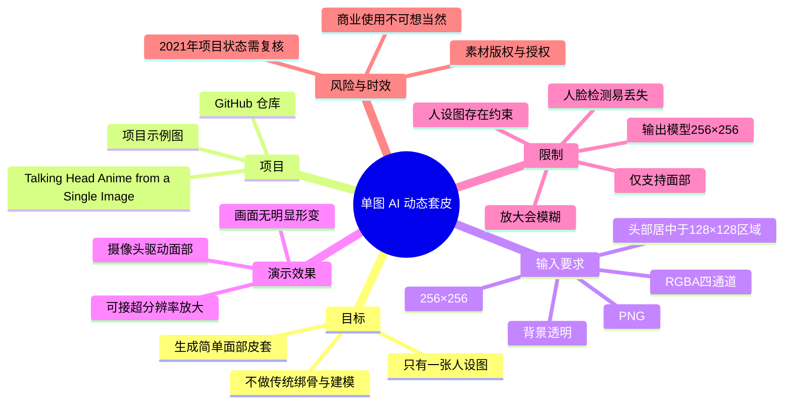
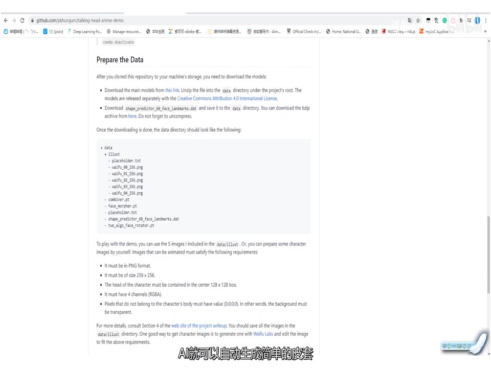
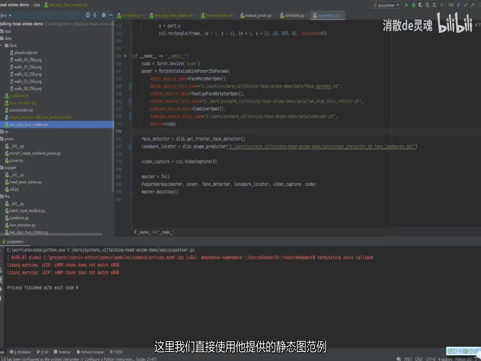

# 只要一张图，vtuber套皮出道！无需任何绘画/建模技巧！【AI开源项目分享】

> 来源：[Bilibili 视频](https://www.bilibili.com/video/BV1ip4y1p7jP) 
> UP 主：消散de灵魂｜发布时间：2021-02-13 20:32:06（UTC+8）｜视频时长：01:05 
> 视频简介给出的项目地址：[pkhungurn/talking-head-anime-demo](https://github.com/pkhungurn/talking-head-anime-demo)

## 小结

视频分享了开源项目 **Talking Head Anime from a Single Image** 的演示思路：使用一张符合要求的静态二次元人物图，通过 AI 根据摄像头捕捉到的人脸运动生成简单的“套皮”效果。视频的核心卖点是，不必自行进行传统 Live2D 建模或绑骨，也不以绘画能力为前提。

UP 主直接使用项目提供的示例人物图进行演示。画面中的项目文档明确列出了输入图像规范：PNG 格式、`256×256` 尺寸、角色头部位于中心 `128×128` 区域、使用 4 通道 RGBA，并要求角色身体以外的背景透明。

该项目的输出模型在视频中被说明为 `256×256`，因此原始画面尺寸较小，直接放大会模糊；UP 主建议可在输出端叠加超分辨率处理。这是“显示效果优化”的建议，并不意味着超分能提升原模型产生的动作细节或人脸跟踪稳定性。

视频同时给出明显限制：Face Detection（人脸检测）并不稳定，使用者动作幅度过大或脸部过度靠近镜头时，系统可能丢失目标；当前还对人设图有要求，且**仅支持面部**，不能据此视为完整的全身 Live2D 替代方案。

这是发布于 2021 年 2 月的项目分享。项目代码、依赖、模型下载地址、许可协议、运行环境及后续替代方案都可能已经变化；本文只整理视频和给定画面能够确认的内容，不将“当时可运行”推断为“截至当前仍可直接部署”。

## 思维导图

## 目录

- [问题与项目定位](#问题与项目定位-0000)
- [项目仓库与单图输入规范](#项目仓库与单图输入规范-0017)
- [演示效果、分辨率与超分建议](#演示效果分辨率与超分建议-0017)
- [跟踪稳定性与功能边界](#跟踪稳定性与功能边界-0041)
- [可复现流程与部署判断](#可复现流程与部署判断-0017)
- [限制、版权与时效性](#限制版权与时效性-0041)
- [字幕比对](#字幕比对)
- [评论分析](#评论分析)
- [处理记录](#处理记录)

## [问题与项目定位 [00:00]](https://www.bilibili.com/video/BV1ip4y1p7jP?t=0)

视频开头将目标受众设定为：手上只有一张角色人设图、不会传统“绑骨”、也不希望投入模型制作成本的人。这里的“套皮”指让虚拟角色形象跟随真人摄像头输入进行表情或头部运动的呈现方式。

UP 主的表述是：一个“在美国读书、日本工作的泰国死宅研究者”在前一年开创了该项目。该身份描述来自视频旁白，当前素材没有提供作者履历验证材料，因此应视为 UP 主的介绍，而不是本文独立核验的事实。

项目的实际定位应收窄为：

1. 输入一张符合标准的二维人物静态图；
2. 由 AI 生成简单的、受真人面部驱动的动态效果；
3. 面向面部表现而非完整角色骨骼系统；
4. 以演示或轻量级虚拟形象应用为目标。

> 图：开场画面以“没有技术和钱”“没有办法的穷逼”为对照，直观说明视频试图解决的是传统虚拟形象制作的技术与成本门槛。它有助于区分本项目的“单图自动驱动”路线与人工建模路线。

## [项目仓库与单图输入规范 [00:17]](https://www.bilibili.com/video/BV1ip4y1p7jP?t=17)

视频展示的 GitHub 仓库为 `pkhungurn/talking-head-anime-demo`，页面标题可见为 **Demo Code for “Talking Head Anime from a Single Image”**。视频简介也给出了同一仓库地址，因此项目来源可相互印证。

> 图：该帧展示仓库路径 `pkhungurn/talking-head-anime-demo` 及英文项目说明，是确认视频所指开源项目名称与代码仓库的直接画面依据。

### 画面可见的准备要求

项目文档“Prepare the Data”部分在画面中列出了可用于动画化的角色图要求。根据关键帧中的英文文档，可整理为：

| 项目 | 画面可见要求 | 含义与实践影响 |
| --- | --- | --- |
| 文件格式 | PNG | 不应直接以普通 JPG 作为合规输入。 |
| 图像尺寸 | `256×256` | 输入应按该固定尺寸准备。 |
| 头部位置 | 角色头部应包含在中心 `128×128` 框内 | 头部偏离中心可能影响项目预期的定位与驱动效果。 |
| 通道格式 | 4 channels（RGBA） | 图像需要 alpha 透明通道。 |
| 背景 | 身体以外像素应为 `(0,0,0,0)` | 即透明黑色；本质要求是背景透明，避免背景被当成角色内容。 |

> 图：该帧清晰展示项目文档的输入规范，包括 PNG、`256×256`、中心头部区域、RGBA 与透明背景要求。这些是视频中最具可执行性的参数，不应被“只要一张图”这一简化说法掩盖。

### 关于模型文件与许可信息

关键帧中可见文档提示：克隆仓库后还需要下载模型文件，并放入项目根目录下的 `data` 目录；画面还显示主模型单独发布，并标注为 **Creative Commons Attribution 4.0 International License**。不过，视频没有逐项讲解模型文件版本、下载链接是否仍有效、代码仓库本身采用何种许可证，也未说明商业直播时是否还涉及角色图、模型、平台等其他授权条件。

因此，准备环境时至少要分别检查：

- 代码仓库当前 README 的安装和模型下载步骤；
- 模型文件对应的许可条款；
- 自己使用的人设图是否拥有创作权、许可或商业使用权；
- 摄像头、人脸检测库和 Python 依赖是否仍适配当前系统。

## [演示效果、分辨率与超分建议 [00:17]](https://www.bilibili.com/video/BV1ip4y1p7jP?t=17)

UP 主随后使用项目自带的静态图范例演示效果。ASR 将范例名称识别为 “WIFE”，但关键帧中的文件名可见为 `waifu_00_256.png`、`waifu_01_256.png` 等，因此此处更合理的写法是项目中的 **waifu 示例图**，而非英文单词 “WIFE”。

视频对效果的关键描述包括：

- 使用示例静态图即可出现随真人面部变化的角色脸部动画；
- 模型输出大小为 `256×256`；
- 因原始输出分辨率小，放大后会显得模糊；
- 可以在输出流程外叠加超分辨率，作为视觉放大补救手段；
- UP 主主观评价画面“完全没有失真”。

最后一项属于 UP 主对演示观感的判断。它不能等价于严格的图像质量评测：视频没有提供对照图、帧率、延迟、不同角色图的成功率，或超分辨率模型、参数与处理时延。

> 图：该帧展示本地项目目录中的示例图及 Python 代码运行环境，说明视频并非只展示网页概念，而是在本地项目环境中调用摄像头和相关模型进行演示。画面未提供可复制的完整命令行，因此不能据此补写安装命令。

### 分辨率问题的正确理解

“接超分”可改善放大显示时的主观清晰度，但存在边界：

1. 超分通常根据既有像素推测高频细节，不能保证还原角色原画细节；
2. 若源动画有跟踪错误、脸部变形或目标丢失，超分不会修复运动逻辑；
3. 超分会增加额外计算量、延迟和部署复杂度；
4. 视频未展示任何超分模型名称、配置或前后对比，不能从素材中得出具体方案。

## [跟踪稳定性与功能边界 [00:41]](https://www.bilibili.com/video/BV1ip4y1p7jP?t=41)

视频后半段明确指出了实际使用中的主要问题：**Face Detection 效果不够好**。UP 主称，当自己动作较大，或者脸部靠摄像头太近时，检测器容易丢失目标。

这意味着使用时需要控制输入条件：

- 保持脸部位于摄像头稳定可见范围；
- 不要进行过于剧烈或快速的大幅度动作；
- 避免镜头距离突然过近；
- 在正式直播前，应针对光照、摄像头视角、人物移动范围进行实测。

视频还说明当前方案“只支持面部”。因此，它不覆盖或未在视频中证明以下能力：

| 能力 | 视频素材支持情况 |
| --- | --- |
| 面部驱动 | 支持，视频实际演示并口述说明。 |
| 头部相关运动 | 可从“Face Detection”驱动演示中合理理解为涉及，但视频未给出参数范围。 |
| 全身动作 | 不支持／未展示；UP 主明确说当前只支持面部。 |
| 耳朵、尾巴等附属物物理效果 | 未展示，不能假定支持。 |
| 高分辨率原生输出 | 不支持；视频明确提及模型为 `256×256`。 |
| 稳定的人脸持续追踪 | 有限制；大动作或过近会丢失目标。 |

UP 主认为其对环境的要求“不严苛”、使用“相当方便”，并表示优化部署后“真的可以投入使用”。这是基于当时演示的经验性评价；由于没有给出硬件配置、帧率、内存/显存占用、延迟、长时间稳定性和并发条件，不能将其直接转化为生产环境性能承诺。

## [可复现流程与部署判断 [00:17]](https://www.bilibili.com/video/BV1ip4y1p7jP?t=17)

视频没有提供从零开始的完整安装命令、依赖版本或配置文件，因此以下流程是对视频明确内容的保守整理，而非声称可直接复制执行的教程。

### 基于视频可确认的流程

1. **获取项目代码**  
   视频简介与展示画面均指向 `talking-head-anime-demo` 仓库。

2. **按项目文档准备模型文件**  
   画面中的 “Prepare the Data” 说明，克隆仓库后还需要下载模型并放入项目根目录的 `data` 目录。

3. **准备合规的人设图**  
   将角色图制作为 PNG、`256×256`、RGBA；保持头部在中心 `128×128` 范围，并把角色外区域处理为透明背景。

4. **先用仓库示例图验证环境**  
   UP 主直接使用了项目提供的 `waifu` 示例图。实践中应先确认示例能运行，再替换为自己的图，以便把环境问题与素材适配问题分开排查。

5. **接入摄像头并观察 Face Detection**  
   视频画面可见代码中创建了 `cv2.VideoCapture(0)`，这表明演示使用默认摄像头索引 `0`。这是关键帧中可读的代码信息，但不同设备的摄像头索引可能不同。

6. **根据实际画面决定是否添加超分**  
   仅在放大显示确有模糊问题时考虑后处理；需要单独评估延迟、显卡负担及风格一致性。

7. **针对易丢失条件做压力测试**  
   至少测试大幅度动作、靠近镜头、不同光照、不同表情，以及长时间运行情况。视频已明确提示前两项是风险点。

### 不应从视频补全的内容

视频没有给出以下信息，本文不编造：

- Python、PyTorch、CUDA、OpenCV、dlib 等具体版本；
- 运行命令、模型下载 URL、哈希校验或环境配置内容；
- 显卡型号、CPU、帧率、延迟及显存占用；
- 超分模型名称与参数；
- 是否支持音频驱动、口型同步、背景替换或直播软件虚拟摄像头输出；
- 当前仓库是否仍可无修改运行。

## [限制、版权与时效性 [00:41]](https://www.bilibili.com/video/BV1ip4y1p7jP?t=41)

### 已由视频明确说明的限制

- **分辨率限制**：模型为 `256×256`，放大容易模糊。
- **检测稳定性限制**：大动作或离镜头过近时，Face Detection 容易丢失目标。
- **素材限制**：人设图需要满足一定规范，不是任意图片都能直接使用。
- **表现范围限制**：当前仅支持面部。
- **可用性结论有限**：UP 主认可其环境要求和易用性，但没有提供可量化性能与生产级测试数据。

### 版权与使用风险

热评中出现了“盗图套皮商业直播”的担忧。视频本身没有鼓励盗图，也没有给出角色图商业授权的处理方法；但“只需一张图”的门槛降低，确实不等于可以忽略素材权利。

实际使用时应至少区分：

1. **角色图权利**：必须使用自己创作、获得授权，或明确允许相应用途的素材；
2. **模型与代码许可**：应阅读仓库及模型当前各自的许可，不能只因“开源”就默认可商业使用；
3. **平台规则**：直播平台对虚拟形象、转载素材、商业行为可能另有规范；
4. **人格与品牌风险**：即使技术可行，模仿或使用他人辨识度很高的角色形象也可能引发争议。

### 时效性说明

视频发布于 2021 年。它展示的是当时的项目页面、目录结构与运行效果。到当前素材抓取时间（2026-07-15），以下事项均需重新核验：

- 仓库是否仍维护、链接是否有效；
- 模型是否仍可下载；
- 当前依赖与新版本操作系统、Python、CUDA 的兼容性；
- 许可证是否变化或有补充说明；
- 是否已有更高分辨率、更稳定或功能更完整的后续方案。

## 字幕比对

| 字幕来源 | 完整性 | 专有名词 | 时间轴 | 主要问题 |
| --- | --- | --- | --- | --- |
| Bilibili 站内字幕 | 未提供可用字幕 | 无从核验 | 无从核验 | 素材记录显示字幕工具因 `Invalid URL` 未取得有效站内字幕。 |
| 本次 ASR 字幕 | 较高；3 段覆盖 00:00:00.810—00:01:04.110，语音覆盖诊断为 95.12% | 存在误识别 | 有可直接使用的 SRT 时间戳 | “绑鼓”应结合标题与语境校为“绑骨”；“WIFE”应结合画面文件名校为 `waifu`；“提共”应为“提供”；末句“这个酷”语义不稳，未作为术语采用。 |

本次 ASR 使用 `medium` 模型，识别语言为中文（置信度 `0.99609375`），运行于 CUDA、`float16`。ASR 结果没有标记 `noAudioStream=true`；相反，其诊断确认音频时长约为 `64.47` 秒、最后语音到 `64.11` 秒，因此本视频存在可用音轨，不能将站内字幕缺失误判为无音频。

最终正文以**本次 ASR 的 SRT 时间戳**作为章节时间轴依据，并用关键帧对以下关键内容进行校正：

- “绑鼓” → **绑骨**：标题已明确使用“建模”，开场语义为传统角色绑定/建模门槛；
- “WIFE” → **waifu 示例图**：关键帧中的项目目录可见 `waifu_00_256.png` 等文件名；
- 输入规格（PNG、`256×256`、RGBA、中心 `128×128`、透明背景）：以项目文档关键帧为准；
- GitHub 仓库名称：以仓库首页关键帧和视频简介链接交叉确认。

## 评论分析

素材仅获取到 2 条热评，未达到“热评前三条”的完整数量；以下只分析可获取内容，不补造第 3 条评论，也不将评论观点当作已验证事实。

### 1. 折清南（589 赞）

> “理想中：只有立绘的可以省去模型师的钱  
> 实际上：随便找png盗图套皮进行商业直播”

这条评论指出单图套皮技术的双重效应：一方面它可能降低已有立绘创作者制作虚拟形象的成本；另一方面，低门槛也可能被滥用于盗用 PNG 素材进行商业直播。其价值在于补充了视频未展开讨论的版权与商业伦理风险。

评论描述的是风险判断，并未提供某个具体侵权事件的证据，不能据此推断视频使用了盗图，或所有使用者都会侵权。

### 2. 不是冷三火是冷焱（370 赞）

> “他没有我的Q弹的耳朵和尾巴。[狗子]”

这是一条玩笑式评价，但与视频的技术边界相呼应：UP 主明确说当前“只支持面部”，视频并未展示耳朵、尾巴等角色附属部件的独立驱动或物理摆动。评论可以作为观众对表现力不足的感受参考，不能据此推导项目内部完全无法处理任何附属元素。

## 处理记录

- Worker ID：`worker-mrj0www4-e8d79408`
- 模型：`gpt-5.6-terra`
- ASR 模型与配置：`medium`／中文自动识别／CUDA／`float16`；识别语言置信度 `0.99609375`。
- 使用的素材与工具产物：视频元数据、`merged.mp4`、`audio/audio.wav`、`asr/transcript.srt`、`asr/asr-result.json`、关键帧目录 `frames/`、热评文件 `comments/comments.json`。
- 字幕选择：站内字幕未提供可用结果（获取过程记录为 `Invalid URL`）；采用本次 ASR 的 SRT 作为时间轴来源，并以关键帧和视频标题校正少量专有名词与明显同音误识别。
- 关键帧选择依据：
  - `frames/frame-001.jpg`：呈现视频提出的“无技术、无资金”问题背景；
  - `frames/frame-002.jpg`：确认 GitHub 仓库与项目名称；
  - `frames/frame-003.jpg`：提供输入图像格式、尺寸、头部位置、RGBA 与透明背景等关键参数；
  - `frames/frame-004.jpg`：证明视频展示了本地代码环境、示例图文件及摄像头调用场景。
- 评论处理：请求上限为 3 条，实际仅获取 2 条；已逐条分析可得评论，未虚构缺失评论。
- 缓存清理：提供的素材清单未包含缓存清理日志或清理结果；因此无法确认是否执行清理，不作“已清理”的无依据声明。
- 未解决问题：未获得完整安装命令、依赖版本、模型文件下载地址、硬件性能数据、超分方案参数及项目截至当前的维护状态；这些内容需要以仓库当前文档和实际环境测试为准。
