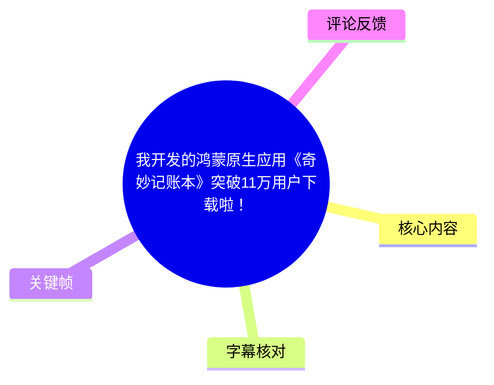
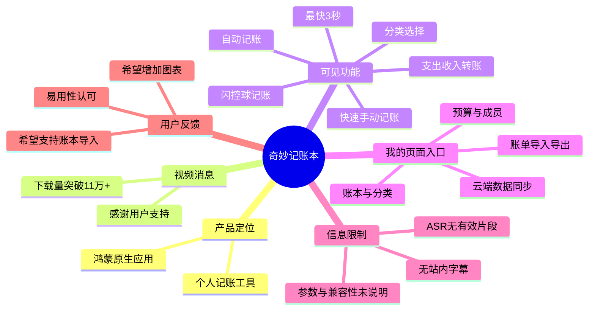

# 我开发的鸿蒙原生应用《奇妙记账本》突破11万用户下载啦！

> 来源：[Bilibili 视频](https://www.bilibili.com/video/BV162V26vEmr) 
> UP 主：奇妙全家桶｜发布时间：2026-06-03｜视频时长：01:14｜标签：华为、记账应用、鸿蒙应用、自动记账、HarmonyOS

## 小结

视频以画面字幕和应用界面演示，介绍了鸿蒙原生记账应用 **《奇妙记账本》**。其核心消息是：应用的用户下载量已“突破 11 万+”；这是视频画面中直接展示的宣传口径，适合作为该视频发布时点的产品进展记录，而不应外推为实时下载量或活跃用户量。

画面重点强调两类记账体验：一是通过支出、收入、转账及多种分类入口完成的快速手动记账；二是“自动记账”，其中明确展示“闪控球记账”，并标注“开启闪控球，最快 3 秒实现记账”。

从展示的“我的”页面可见，应用还包含自动记账、账本、分类、预算、成员、资产类别、云端数据同步、账单导入和账单导出等入口。这些是**界面中可见的功能项**；视频未提供具体操作流程、兼容平台范围、导入格式、同步机制、会员权益或隐私处理细节，因此不能据此认定其完整实现条件。

本视频没有可用的站内字幕，本次 ASR 也未产生任何可用语音片段。因此，本文以标题、视频元数据和关键帧中可见文字为依据；除起始锚点外，不能给出基于字幕分段的精确功能出现时间。文中的时间轴链接统一定位至视频开头，便于回看完整视觉演示，不代表各画面发生在 00:00。

适合关注鸿蒙原生应用、个人记账工具、自动化记账交互及产品早期用户反馈的读者。需要迁移其他账本、依赖复杂财务分析或评估会员价值的用户，应重点关注评论中的需求线索，并以应用当前版本实际功能为准。

## 思维导图

## 目录

- [视频背景与信息边界](#视频背景与信息边界-0000)
- [产品定位、下载量与快速记账](#产品定位下载量与快速记账-0000)
- [自动记账与闪控球交互](#自动记账与闪控球交互-0000)
- [可见功能入口与使用步骤](#可见功能入口与使用步骤-0000)
- [结论、限制与时效性](#结论限制与时效性-0000)
- [字幕比对](#字幕比对-0000)
- [评论分析](#评论分析-0000)
- [处理记录](#处理记录-0000)

## 视频背景与信息边界 [00:00](https://www.bilibili.com/video/BV162V26vEmr?t=0)

视频标题为“我开发的鸿蒙原生应用《奇妙记账本》突破11万用户下载啦！”，UP 主为“奇妙全家桶”。简介仅写有“感谢各位妙友支持与喜欢～”，未补充下载统计的统计口径、应用版本号、上架渠道或功能更新日志。

关键帧开场以应用图标和“奇妙记账本”字样呈现，并标注“给大家介绍一款鸿蒙原生应用”。因此，**“鸿蒙原生应用”是视频画面明确给出的产品定位**。

> 图：开场画面展示应用图标、“奇妙记账本”名称及“给大家介绍一款鸿蒙原生应用”文字。它是确认产品名称与鸿蒙原生定位的直接视觉依据。

### 时间轴说明

站内未提供 SRT 字幕；本次 ASR 结果为空，无法使用“HH:MM:SS,mmm --> HH:MM:SS,mmm”字幕段落反推各功能的精确起止时间。故本章及后续内容的时间轴均使用 `[00:00]` 起始锚点，指向完整视频，而非推测具体画面时间。

## 产品定位、下载量与快速记账 [00:00](https://www.bilibili.com/video/BV162V26vEmr?t=0)

### 下载量消息：突破 11 万+

画面以“简单几步，快速记账”为主文案，并在底部展示“奇妙记账本已经突破了 11万+ 的用户下载量”。

这条信息可以谨慎拆解为：

1. 视频宣传的是“用户下载量”，而不是日活、月活、注册用户、付费用户或留存用户。
2. 展示数值为“11万+”，未给出精确数值、统计截至日期和数据来源。
3. 该信息与标题一致，但仅能说明视频制作或发布时使用的产品宣传数据。
4. 视频发布时间为 2026-06-03；之后的下载量及产品状态可能变化。

> 图：画面左侧写有“简单几步、快速记账”，右侧手机界面显示支出、收入、转账等记账标签和分类图标，底部出现“已经突破了11万+的用户下载量”。该帧同时支撑产品的核心宣传点与基础录入形式。

### 手动记账界面中可见的步骤

从画面可见的记账页，可以整理出以下**界面层面的操作顺序**：

1. 在顶部标签中选择交易类型：`支出`、`收入`或`转账`。
2. 在分类网格中选择对应类别。画面可见餐饮、交通、娱乐、购物、社交、日用、居住、通讯、汽车、医疗、服饰、数码、美妆、应用软件、烟酒、金融、学习、保险等类别；具体类别名称应以当前应用版本为准。
3. 可使用底部输入区填写备注；画面提示“在此输入备注”。
4. 通过数字键盘录入金额；画面中金额显示为 `¥0.00`。
5. 选择或确认日期、账本等附加信息后，点击“完成”提交。

上述流程是根据画面控件可见性整理的，不等于视频提供了完整教学。尤其是默认账本、日期修改、分类自定义和交易撤销方式，均未在素材中展示。

## 自动记账与闪控球交互 [00:00](https://www.bilibili.com/video/BV162V26vEmr?t=0)

### 自动记账的画面表达

视频先展示一张“账单详情”式的支付凭据页面，右侧浮现带“妙记”字样的悬浮提示。随后用大字强调“自动记账”“闪控球记账”。

> 图：该帧呈现一张金额为 `-0.10` 的账单详情页面，右侧有“妙记”标识的悬浮元素。它说明视频以支付账单场景来表达自动记账能力，但未展示识别规则、授权弹窗或最终入账结果。

这里需要严格区分证据强度：

- **可确认**：视频用账单详情画面和“自动记账”文案来宣传自动记账功能。
- **可确认**：视频展示了名为“闪控球”的交互入口。
- **不可确认**：该功能具体从哪些支付应用、通知、短信或账单页面提取数据。
- **不可确认**：自动记录是否需要系统权限、悬浮窗权限、手动确认、网络连接、会员订阅或特定鸿蒙系统版本。
- **不可确认**：账单识别字段、识别准确率、失败处理与数据保存位置。

### 闪控球：视频给出的性能表述

画面明确写有：

- “自动记账”
- “闪控球记账”
- “开启闪控球，最快 3 秒实现记账”

> 图：左侧为“自动记账 / 闪控球记账”宣传文字，右侧“我的”页面中可见“自动记账”等入口，底部写有“开启闪控球，最快3秒实现记账”。这是视频中唯一明确的时长参数来源。

“最快 3 秒”应按广告文案的通常含义理解：它描述最佳或较快条件下的完成速度，不是每笔账单的保证耗时。视频没有说明这 3 秒从打开闪控球、读取账单、填入信息还是完成保存开始计时，也没有给出测试设备、系统版本、网络条件或样本量。

## 可见功能入口与使用步骤 [00:00](https://www.bilibili.com/video/BV162V26vEmr?t=0)

### “我的”页面中可见的功能

关键帧中的“我的”页面展示了一组产品入口。根据清晰可辨的画面文字，可归纳如下：

| 功能类别 | 可见入口 | 可从画面确认的含义 | 素材未说明的部分 |
| --- | --- | --- | --- |
| 自动化 | 自动记账 | 应用设有自动记账入口 | 触发来源、授权、规则与准确率 |
| 账本管理 | 我的账本 | 可进入账本管理 | 多账本数量、共享规则、格式 |
| 分类管理 | 我的分类 | 可管理记账分类 | 是否支持层级、自定义图标或排序 |
| 预算 | 我的预算 | 可设置或查看预算相关内容 | 预算周期、提醒与超支策略 |
| 协作 | 我的家人 | 可见家庭/成员相关入口 | 邀请、权限与数据隔离机制 |
| 资产 | 资产类别 | 具备资产类别入口 | 是否支持账户余额、债务和净资产 |
| 数据同步 | 云端数据同步 | 可见云端同步入口 | 云服务提供方、加密、容量、冲突处理 |
| 数据迁移 | 账单导入、账单导出 | 可见导入导出功能入口 | 支持的来源、文件格式、字段映射和限制 |

### 基于可见界面的实践建议

对于希望尝试该类应用的用户，可按以下路径进行验证；这是依据视频界面作出的使用建议，不是视频中完整演示过的教程：

1. **先确认设备与版本兼容性**：视频只说明其为鸿蒙原生应用，未列出支持的设备型号、HarmonyOS 版本或下载安装渠道。
2. **建立或选择账本**：从“我的账本”入口检查是否满足个人、家庭或多账本的管理需求。
3. **检查分类与预算**：尝试用“我的分类”“我的预算”匹配自己的收支结构。
4. **测试一笔手动记录**：按“交易类型 → 分类 → 金额 → 备注 → 完成”的基本路径验证录入效率。
5. **谨慎启用自动记账/闪控球**：先阅读应用内权限说明、隐私政策和数据处理范围，再决定是否开启。
6. **迁移前先核对导入能力**：虽然界面中有“账单导入”，但视频未说明支持哪些第三方软件或文件格式；迁移旧账本前应备份源数据并做小样本测试。
7. **确认同步与导出可用性**：涉及云端同步、家庭共享或长期保存时，应明确账户归属、导出格式和恢复路径。

## 结论、限制与时效性 [00:00](https://www.bilibili.com/video/BV162V26vEmr?t=0)

### 可迁移的产品经验

视频传达的产品设计思路较清晰：用“分类 + 金额键盘”降低基础录入门槛，再以“自动记账”和“闪控球”缩短高频操作路径。对于记账应用而言，快速完成一笔记录是直接影响持续使用的重要体验目标。

从界面信息看，产品还尝试覆盖从单笔记录到账本、预算、家庭成员、同步与导入导出的较完整链路。但视频是短篇宣传展示，不应将“存在入口”等同于“功能成熟、适配广泛或满足复杂财务管理需求”。

### 关键限制

1. **字幕与语音信息不足**：无站内字幕，ASR 没有识别出语音片段，无法转录口播、给出精确分段时间或补全视觉外的说明。
2. **缺少版本信息**：未提供应用版本号、HarmonyOS 版本、设备型号和发布日期对应的功能状态。
3. **自动记账机制未知**：权限要求、识别来源、隐私边界、异常处理与成功率均未展示。
4. **数据迁移能力未知**：虽有“账单导入”入口，但是否能导入其他记账软件、支持哪些文件格式，尚无视频证据。
5. **数据分析能力未展示**：视频没有展示趋势图、同比/环比、收支报表或其他可视化分析。
6. **下载量口径有限**：“11万+”为视频宣传数据，不能替代独立统计，也不能反映当前下载或付费情况。

### 时效性

本文涉及的产品宣传、下载量与界面状态均以视频发布日 **2026-06-03** 及提供素材为界。应用功能、价格、会员服务、导入范围、系统兼容性及下载数据可能在之后更新；实际使用前应查看应用内最新说明。

## 字幕比对 [00:00](https://www.bilibili.com/video/BV162V26vEmr?t=0)

| 字幕来源 | 完整性 | 专有名词 | 时间轴 | 主要问题 |
| --- | --- | --- | --- | --- |
| Bilibili 站内字幕 | 未提供可用字幕 | 无法核验 | 无可用分段 | 素材明确标注“未提供可用站内字幕” |
| 本次 ASR 字幕 | 空，0 个语音片段 | 无法识别或校验 | 虽启用时间戳，但无时间段输出 | ASR 检测语言为 `en`，置信度 0.541；诊断提示未识别到语音内容 |

本次 ASR 使用 `medium` 模型处理 `audio/audio.wav`，音频时长约 73.584 秒，识别结果 `segments: []`，语音覆盖时长为 0 秒。诊断信息提示“未识别到语音片段”，但提供的 ASR 结果**没有**标记 `noAudioStream=true`；因此不能断言源视频没有音轨，只能如实说明：现有识别未得到可用语音文本。

最终未采用任何字幕文本，而采用以下证据整理内容：

- 视频标题与元数据：确认产品名、UP 主、时长、发布时间及“11万用户下载”主题；
- 关键帧可见文字：确认“鸿蒙原生应用”“简单几步，快速记账”“自动记账”“闪控球记账”“最快3秒实现记账”等；
- 界面画面：确认支出/收入/转账、分类、账本、预算、同步、导入导出等入口的可见性；
- 热评：仅作为用户体验与需求的未验证反馈，不补作视频事实。

经关键帧校正并保留的名称包括：**奇妙记账本、鸿蒙原生应用、自动记账、闪控球记账、云端数据同步、账单导入、账单导出**。

## 评论分析 [00:00](https://www.bilibili.com/video/BV162V26vEmr?t=0)

以下仅处理本次可获取的热评前三条。评论反映的是个体用户的体验或诉求，不能视为已独立验证的产品能力、市场排名或开发方承诺。

### 1. “记账挺好用的”——易用性正向反馈

- 评论者：帝温笙
- 获赞：19
- 核心观点：祝贺应用下载量增长，并认为记账体验“挺好用”。
- 可提供的信息：至少有用户对基础记账体验给出正面主观评价。
- 可信度边界：评论未说明设备、版本、使用时长、具体功能或与其他产品的比较条件，不能据此量化易用性。

### 2. 希望增加趋势与对比图表——数据分析需求

- 评论者：远行鱼
- 获赞：19
- 核心观点：表示正在使用且开通了会员，主观上认为它是“最好用的记账软件”；同时建议增加趋势分析、对比分析等可视化图表。
- 可提供的信息：用户明确提出了图表分析需求；这与视频中未展示数据分析界面的情况相呼应。
- 可信度边界：该评论并不能证明现有版本完全没有图表功能，只能证明该用户期待更丰富的可视化分析。其“最好用”的评价是个人偏好，不是横向测评结论。

### 3. 希望导入其他记账软件账本——迁移门槛问题

- 评论者：Mccro
- 获赞：6
- 核心观点：希望应用能够导入其他记账软件的账本，否则较难从旧产品迁移。
- 可提供的信息：账本迁移是潜在用户转换时的重要阻碍。视频界面虽可见“账单导入”入口，但该评论表明用户仍关心跨应用导入的实际兼容性。
- 可信度边界：不能由此推断应用当前不支持任何导入功能；需要开发方或应用内文档进一步说明支持的来源、格式及字段匹配规则。

## 处理记录 [00:00](https://www.bilibili.com/video/BV162V26vEmr?t=0)

- Worker ID：`worker-mrj0wbly-5dc4e50c`
- 生成模型：`gpt-5.6-terra`
- ASR 模型与运行参数：`medium`；CUDA；`float16`；自动语言识别结果为英语（概率 `0.541015625`）
- 使用的素材工具产物：`merged.mp4`、`audio/audio.wav`、`frames/`、`asr/asr-result.json`、`comments/comments.json`；未提供可用站内字幕。
- 字幕选择：未采用站内字幕（无可用文件）；本次 ASR 为空（0 段），也未作为正文文本来源。正文以元数据、关键帧文字及界面视觉理解为主。
- 关键帧选择依据：
  - `frames/frame-001.jpg`：产品名与“鸿蒙原生应用”定位；
  - `frames/frame-002.jpg`：快速记账界面与“11万+用户下载量”宣传；
  - `frames/frame-003.jpg`：账单详情场景与“妙记”悬浮提示；
  - `frames/frame-004.jpg`：自动记账、闪控球及“最快3秒”参数，同时展示“我的”页面功能入口。
- 时间轴依据：不存在可用站内 SRT 或 ASR 分段，无法按字幕起止时间建立精确章节时间；所有章节链接均保守使用视频起点 `t=0`，并已明确标注这一限制。
- 缓存清理：提供的素材与任务记录中未包含缓存清理日志，无法确认是否已执行清理；本文不将其表述为已完成。
- 未解决问题：应用版本号、下载量统计截止日与口径、自动记账权限和数据来源、云同步隐私策略、会员内容、第三方账本导入格式、数据分析图表能力及具体系统兼容性均未由现有素材确认。

## 评论分析

- 热评 1：恭喜，记账挺好用的[呲牙]
- 热评 2：恭喜，我也用了。还开了会员。目前觉得最好用的记账软件。其他软件都没用了。 不过有个小小建议:能不能再增加一些图表，如，趋势分析，对比分析等可视化的图表，就更加完美了。
- 热评 3：能不能想想办法导入其他记账软件账本，要不然转不过来

以上内容是观众反馈摘录，只用于补充理解视频反响，不作为正文事实依据。
