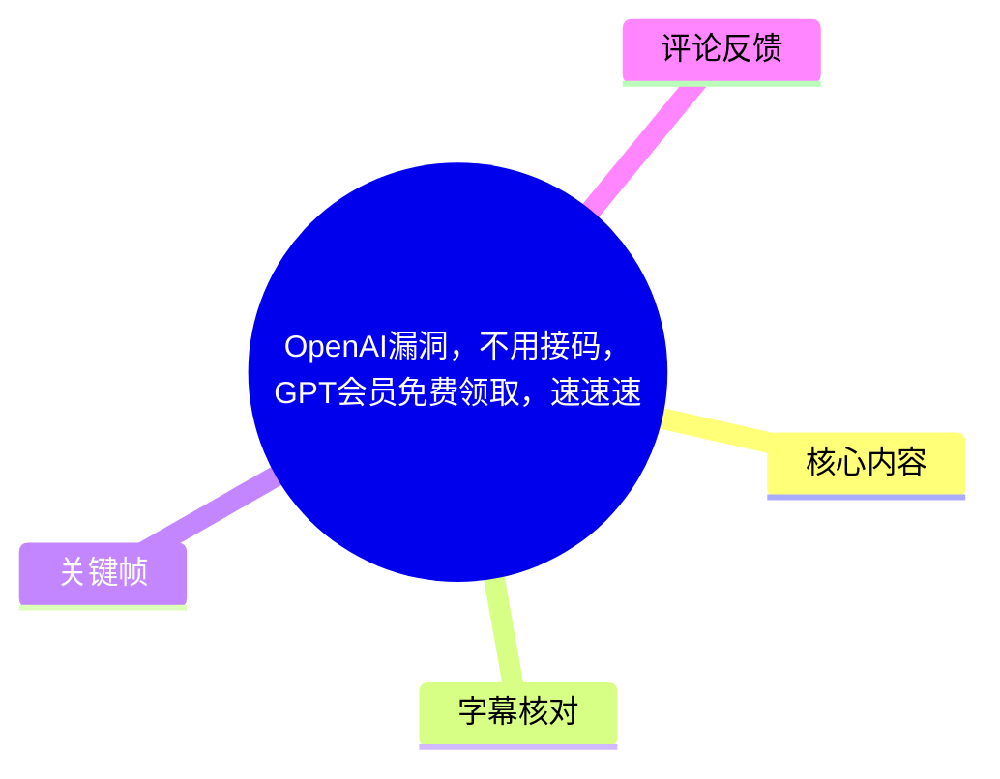
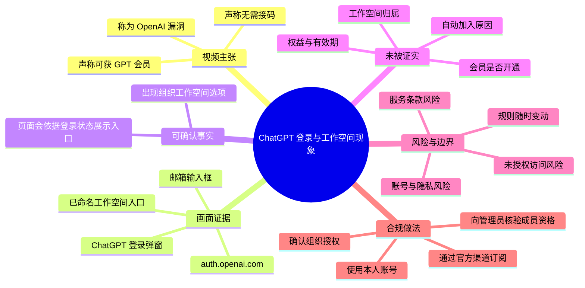
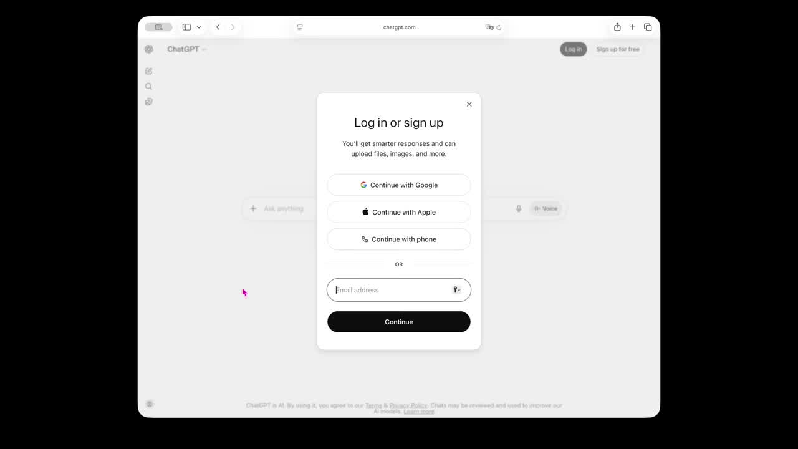
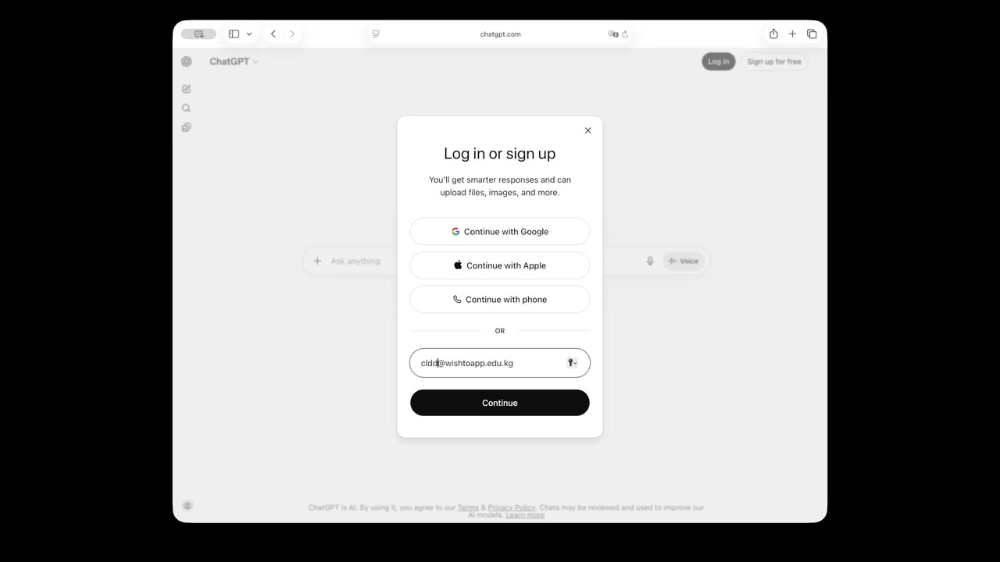
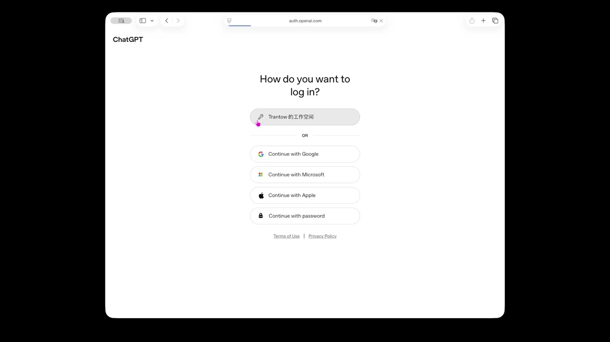

# OpenAI漏洞，不用接码，GPT会员免费领取，速速速

> 来源：[Bilibili 视频](https://www.bilibili.com/video/BV1ZAEn6iERR) 
> UP 主：真不是呀｜时长：00:59｜分辨率：1920 × 1080｜标签：OpenAI、GPT、gpt会员、教程

## 小结

视频以 ChatGPT 网页端登录界面为演示对象，声称可借由特定邮箱域名后缀触发组织/工作空间相关的单点登录（SSO）入口，从而“不用接码”获得所谓“GPT 会员”。画面实际可确认的内容是：在 ChatGPT 登录弹窗中填写邮箱后，页面跳转至 `auth.openai.com`，并出现一个已命名的工作空间登录选项。

该视频标题、简介与演示均将这一现象称为“漏洞”或“免费领取”。但现有素材**没有展示订阅状态、账单、模型权限、有效期、授权主体或账号归属证明**，因此不能据此证实“获得 GPT 会员”的结论。更合理的技术解释之一，是某个组织为其自有域名配置了身份提供商及自动加入工作空间的策略；热评中也有观众提出类似猜测，但这同样未经独立验证。

视频没有音轨，Bilibili 站内字幕也未提供，因此无法从语音或字幕获得可靠的逐秒步骤。本笔记仅以元数据、关键帧中的可见界面及热评为证据；不复述或扩展可能导致未授权访问第三方组织、账户或付费服务的可操作利用流程。

对读者而言，真正可迁移的经验是：当登录页根据邮箱域名展示某个组织工作空间时，应先确认该组织是否属于自己、自己是否具备明确授权，以及登录/成员资格是否由该组织正式授予。不要把“页面出现工作空间入口”直接等同于“免费会员”或“可合法使用”。

该内容具有很强时效性。身份认证规则、域名验证、团队自动加入策略和订阅权益都可能随时被服务方调整；即使视频中的页面当时真实存在，也不意味着当前仍有效，更不构成访问他人组织资源的授权。

## 思维导图

## 目录

- [视频背景与证据边界](#视频背景与证据边界-0000)
- [画面记录：登录页与邮箱输入](#画面记录登录页与邮箱输入-0000)
- [画面记录：工作空间登录入口](#画面记录工作空间登录入口-0000)
- [技术解读：域名、SSO 与组织成员资格](#技术解读域名sso-与组织成员资格-0000)
- [安全且合规的核验步骤](#安全且合规的核验步骤-0000)
- [结论、限制与时效性](#结论限制与时效性-0000)
- [字幕比对](#字幕比对)
- [评论分析](#评论分析)
- [处理记录](#处理记录)

## 视频背景与证据边界 [00:00](https://www.bilibili.com/video/BV1ZAEn6iERR?t=0)

视频标题为“OpenAI漏洞，不用接码，GPT会员免费领取，速速速”，简介称“使用任意视频中后缀的邮箱sso登陆，即可领取”。这是发布者的主张，不是已验证的服务规则或权益证明。

素材可确认的客观背景如下：

- 视频时长为 59 秒，内容为横屏网页操作录屏。
- 页面主体是 ChatGPT 登录界面及 OpenAI 认证页面。
- 视频源文件被诊断为**不包含音频流**，故没有可供核对的讲解音频。
- 未提供可用的 Bilibili 站内字幕。
- 所给画面没有呈现账号的订阅管理页、付款记录、可用模型列表、工作空间成员列表或管理员授权记录。

因此，以下两类信息必须严格区分：

| 类别 | 内容 |
| --- | --- |
| 可由画面确认 | 登录页面存在邮箱输入；填写后可进入 OpenAI 认证页面；认证页面显示一个具体命名的工作空间选项。 |
| 仅为视频主张/推测 | 可免费获得 GPT 会员；这是 OpenAI 漏洞；任意符合后缀的邮箱均可合法获得权益；该工作空间提供付费订阅权限。 |

> 时间轴说明：没有 ASR/SRT 的真实分段时间可用；本节及下列内容统一链接至视频起点 `00:00`，不将画面顺序伪造为精确时间段。

## 画面记录：登录页与邮箱输入 [00:00](https://www.bilibili.com/video/BV1ZAEn6iERR?t=0)

关键帧显示的是 ChatGPT 的“Log in or sign up”登录弹窗。可见登录方式包括：

- `Continue with Google`
- `Continue with Apple`
- `Continue with phone`
- 邮箱地址输入框
- `Continue` 按钮

后续画面显示在邮箱输入框中填写了形如 `…@wishtoapp.edu.kg` 的地址。这里能确定的只是页面接受了一个电子邮箱格式的输入；不能从这一画面确认该邮箱是否真实存在、是否归操作者本人所有、是否完成所有权验证，或该域名与任何组织存在何种关系。

> 图：该关键帧呈现 ChatGPT 的登录/注册弹窗以及第三方登录、手机号和邮箱入口。其价值在于说明视频演示的起点是常规登录流程，而非已经展示订阅或成员资格的页面。

> 图：该关键帧显示邮箱输入框内已填入一个带特定域名后缀的地址。这是视频将“域名后缀”与后续登录结果建立关联的主要视觉证据；但画面本身不证明邮箱控制权、域名所有权或访问授权。

### 画面中未展示的关键环节

若要评估视频的说法，以下环节本应是核心证据，但素材未提供：

1. 邮箱验证码、邮件验证或身份提供商认证是否完成。
2. 操作者是否是目标组织的有效成员。
3. 组织管理员是否明确邀请或授权了该账号。
4. 进入工作空间后实际可用的功能、模型和额度。
5. 账号是否具有付费方案，以及权益是否来自组织的合法订阅。
6. 操作后的成员资格是否持续有效，或是否会被管理员移除。

## 画面记录：工作空间登录入口 [00:00](https://www.bilibili.com/video/BV1ZAEn6iERR?t=0)

画面跳转至 `auth.openai.com` 页面，标题为“How do you want to log in?”。页面顶部出现一个工作空间按钮，名称显示为“Trantow 的工作空间”；下方仍可见 Google、Microsoft、Apple 和密码等常规登录方式。

这说明在当时的页面状态下，OpenAI 的认证页面向该输入信息对应的登录流程展示了一个组织工作空间入口。页面中“工作空间”入口的存在，本身并不说明访问者已是成员、更不自动证明其可获得付费权益。

> 图：该关键帧显示域名为 `auth.openai.com` 的认证页面，其中有“Trantow 的工作空间”入口，另有 Google、Microsoft、Apple 和密码登录选项。它是视频中最关键的现象展示，但只能证明入口被显示，不能证明登录成功、成员资格或订阅权益。

### 需要谨慎理解的页面元素

| 页面元素 | 可以合理说明什么 | 不能据此说明什么 |
| --- | --- | --- |
| 邮箱输入框 | 登录流程会接收邮箱格式信息 | 输入者拥有该邮箱或有权使用该域名 |
| 工作空间名称 | 服务端可能识别到关联的组织/工作空间配置 | 输入者已被授权加入该组织 |
| SSO/工作空间入口 | 该组织可能配置了某种认证或登录路径 | 可绕过验证、可进入他人组织 |
| 登录选项 | 页面提供多种认证方式 | 已完成身份验证 |
| 视频标题中的“会员” | 发布者对结果的宣称 | 已验证的 Plus、Pro、Business 或其他订阅权益 |

## 技术解读：域名、SSO 与组织成员资格 [00:00](https://www.bilibili.com/video/BV1ZAEn6iERR?t=0)

### 视频现象可能涉及的技术概念

**单点登录（SSO）**是组织通过自己的身份提供商统一管理员工或成员登录的机制。用户在服务端输入组织邮箱后，服务可能识别邮箱域名，并将用户引导至组织的身份认证入口或工作空间。

**域名关联**通常只是组织身份配置中的一个信号。一个域名被某组织声明或验证，并不意味着任何人仅凭构造一个同后缀地址就取得该组织成员身份。健全的认证设计还应依赖实际邮箱控制权、身份提供商会话、管理员邀请、目录同步或其他验证条件。

**工作空间自动加入**是另一种可能的配置。部分服务允许组织针对已验证域名、企业目录或管理员规则自动分配成员资格；这应当由组织管理者决定，并且仅适用于身份真实、受控且被授权的用户。若配置不当，可能造成成员资格管理问题，但是否存在配置问题不能仅凭本视频断定。

### 对“漏洞”说法的审慎判断

视频没有提供足以复现、审计或验证的证据，因而不能将其定性为 OpenAI 的安全漏洞。至少需要以下信息才能作出技术判断：

- 目标域名是否由组织合法持有并在服务中验证；
- 输入的邮箱是否经过真实所有权验证；
- 登录是否由目标组织的身份提供商完成；
- 是否存在未经授权的用户获得成员资格的情况；
- 服务方或组织管理员是否已确认该行为违反预期配置；
- 是否存在可重复、可影响他人资源的安全边界绕过。

从风险控制角度看，若用户发现自己在未申请的情况下看到陌生组织工作空间，应将其视为异常信号，而不是可领取的福利。

## 安全且合规的核验步骤 [00:00](https://www.bilibili.com/video/BV1ZAEn6iERR?t=0)

以下步骤用于核验**自己所属组织**的登录与订阅状态，不用于尝试加入、访问或消耗第三方组织的资源。

1. **仅使用本人实际控制的邮箱**
   - 使用能够接收邮件、由自己或所属组织合法管理的地址。
   - 不使用临时、伪造、猜测或不属于自己的组织邮箱。

2. **核对组织关系与授权**
   - 如果页面出现工作空间名称，确认该名称是否对应自己的学校、公司、团队或已受邀组织。
   - 不认识该组织时，不继续尝试登录该入口，不输入其他凭据，也不访问其中的资源。

3. **通过正式渠道确认成员资格**
   - 向组织 IT 管理员、工作空间管理员或服务支持渠道确认：自己是否应当加入该工作空间、通过何种身份提供商登录、可获得哪些权限。
   - 以书面邀请、组织目录或管理员确认作为依据，而非以页面跳转作为依据。

4. **在账户设置中核验实际权益**
   - 对于自己的账号，查看官方账户/工作空间的计划、账单、成员角色与可用功能。
   - 区分个人账户权益与组织工作空间权益；二者的付款主体、数据管理和权限范围可能不同。

5. **发现异常时停止并报告**
   - 若无授权却显示可进入陌生组织，保留最少必要的截图与时间信息，不要进一步浏览、创建内容或使用资源。
   - 向该服务官方安全渠道或相关组织管理员报告异常现象。

### 不应执行的做法

- 不应将“域名后缀相同”理解为对该组织资源的访问权。
- 不应尝试绕过邮箱验证、身份提供商认证、邀请码、管理员审批或订阅付费流程。
- 不应使用他人的工作空间、组织席位、模型额度、文件或对话数据。
- 不应依据未经核验的短视频标题作出“免费会员已到手”的消费或账号安全判断。

## 结论、限制与时效性 [00:00](https://www.bilibili.com/video/BV1ZAEn6iERR?t=0)

### 结论

视频确实展示了一个从 ChatGPT 邮箱登录界面进入 OpenAI 认证页、并显示特定工作空间选项的现象。但这不足以证明“免费领取 GPT 会员”，更不能证明存在可供公众使用的漏洞。

最值得保留的信息是：企业/学校域名、SSO、组织身份提供商与工作空间成员策略之间存在关联，登录界面可能基于身份信息展示不同入口。最重要的边界是：入口展示不等于身份验证通过，也不等于获得组织授权或订阅权益。

### 素材限制

| 限制项 | 具体影响 |
| --- | --- |
| 无音轨 | 无法从口播中确认操作意图、完整步骤、术语解释与原作者的具体承诺。 |
| 无站内字幕 | 无法用逐段文本建立精确的字幕时间轴。 |
| 无 ASR 文本 | ASR 因无音轨跳过，不能提供语音交叉验证。 |
| 关键帧有限 | 仅能确认截图所示页面状态，不能确认所有中间交互和最终结果。 |
| 未展示订阅页面 | “GPT 会员”说法没有直接画面证据。 |
| 未展示授权链路 | 无法确认工作空间、域名、邮箱及操作者之间的合法关系。 |

### 时效性与风险

认证产品的界面、域名匹配逻辑、SSO 支持范围、组织自动加入规则和订阅方案均可能调整。视频元数据显示发布时间为 2026 年 6 月，且素材抓取于 2026 年 7 月；即使视频所示页面在发布时存在，也不能推导其在后续仍然有效。

涉及账户、组织席位和付费服务的“漏洞领取”说法还伴随账号封禁、权益回收、数据暴露、组织安全事件及违反服务条款等风险。应优先采用官方提供的个人订阅、教育/企业授权或管理员邀请渠道。

## 字幕比对

| 字幕来源 | 完整性 | 专有名词 | 时间轴 | 主要问题 |
| --- | --- | --- | --- | --- |
| Bilibili 站内字幕 | 无可用字幕 | 无法核验 | 无 | 素材明确标注“未提供可用站内字幕”。 |
| 本次 ASR 字幕 | 无有效语音文本 | 无法识别 | 无有效分段 | `asr-result.json` 标记 `noAudioStream=true`，源视频没有音轨，ASR 被正常跳过，并非识别工具故障。 |

最终未采用任何字幕文本作为事实依据。由于：

- 站内字幕不存在；
- 本次 ASR 使用 `medium` 模型，但诊断结果为 `skipped: true`；
- 音频可用性为 `false`，原因是 `NO_AUDIO_STREAM`；
- ASR 片段数为 `0`，语音覆盖时长为 `0` 秒。

本笔记改以视频元数据、关键帧的多模态画面理解和可获取热评为依据。通过画面可校正或确认的词语包括：

- `chatgpt.com`：登录弹窗所在网页地址；
- `auth.openai.com`：后续认证页面的可见地址；
- `Log in or sign up`：登录/注册弹窗标题；
- `How do you want to log in?`：认证页标题；
- “Trantow 的工作空间”：认证页显示的工作空间名称；
- `Continue with Google`、`Continue with Microsoft`、`Continue with Apple`、`Continue with password`：页面可见的登录方式。

## 评论分析

仅处理本次可获取的热评前三条；评论为用户观点，不构成事实验证。

1. **BA_College**（1 赞）：“这个是不是别人的团体开了域名账号自动加入团队的开关 所以才这样”
   - 评论提出了一个较具技术合理性的解释：现象可能来自组织侧的域名账号自动加入团队设置。
   - 这与视频中出现工作空间入口的画面相容，但该评论没有给出组织配置、官方文档或复现实证，不能据此确认真实原因。
   - 它提醒观众应将“自动加入策略配置”与“平台漏洞”区分开来。

2. **_Meng-Xin_**（0 赞）：“啥情况”
   - 该评论反映视频信息不足、操作结果或机制不够清晰。
   - 结合无音轨、无字幕和未展示订阅结果的素材状况，这种疑问具有合理性。

3. **annoying8**（0 赞）：“bug team”
   - 评论以简短词语将现象归为“团队/工作空间 Bug”。
   - 这只是标签式判断，未提供机制或证据；不能用作漏洞存在的证明。

## 处理记录

- Worker ID：`worker-mrj0wbly-5dc4e50c`
- 模型：`gpt-5.6-terra`
- 素材与工具检查：读取视频元数据、音频状态、`asr/asr-result.json` 诊断、ASR 文本回退信息、热评 JSON、关键帧目录及提供的关键帧画面。
- 本次 ASR 检查：已检查。ASR 配置模型为 `medium`，但因 `noAudioStream=true`、`NO_AUDIO_STREAM` 被跳过；没有生成可用语音片段。
- 字幕选择：站内字幕未提供可用内容；ASR 无法执行且无文本内容；最终不使用字幕，改用关键帧、元数据和画面文字进行整理。
- 时间轴依据：没有可用 SRT/ASR 起止时间段。所有章节均链接到已知可靠的起点 `00:00`，未根据文字顺序臆造分段秒数。
- 关键帧选择依据：选用 `frames/frame-001.jpg` 展示登录入口、`frames/frame-003.jpg` 展示邮箱输入状态、`frames/frame-004.jpg` 展示 OpenAI 认证页及工作空间入口；这些画面直接对应视频的核心可见证据。素材未提供关键帧与精确秒数的一一映射，故未为单帧标注具体发生时刻。
- 安全处理：未扩写、补全或提供可能用于未授权获取第三方工作空间、账号或付费权益的操作细节。
- 缓存清理：未提供缓存清理执行回执，无法确认是否已清理；本记录不虚构清理结果。
- 未解决问题：无法确认视频中的邮箱真实性、域名归属、工作空间配置来源、操作者授权状态、是否成功登录，以及任何“GPT 会员”权益是否真实存在或持续有效。
