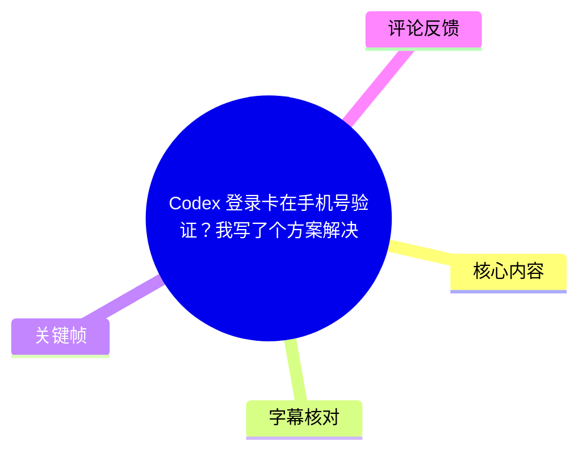
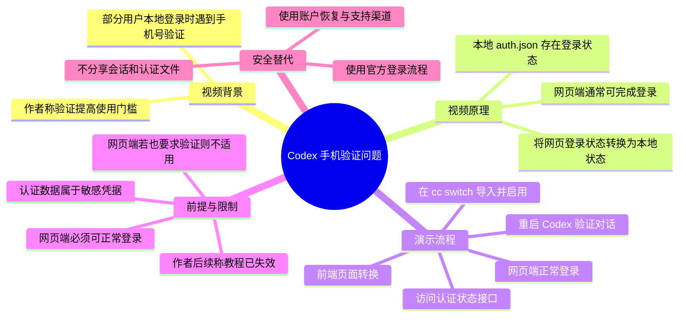
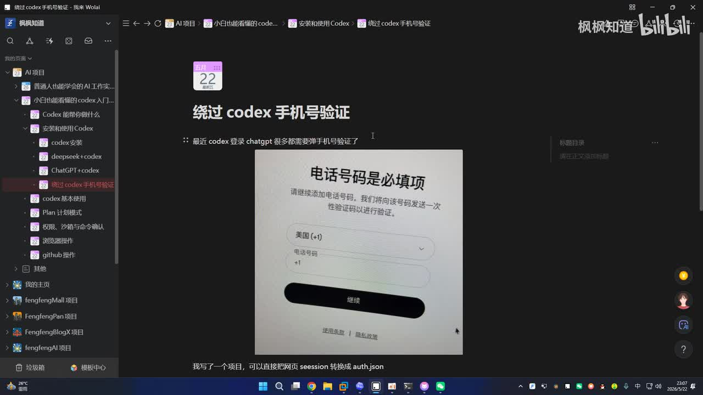
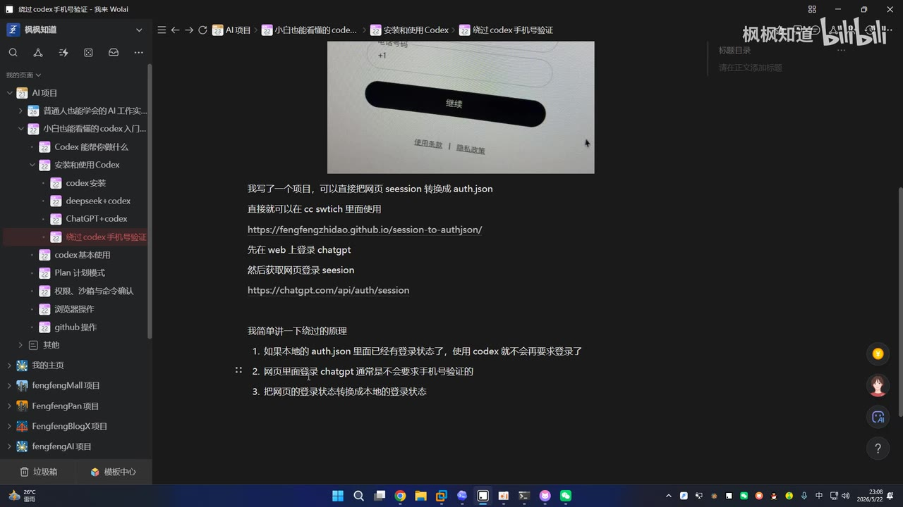

# Codex 登录卡在手机号验证？我写了个方案解决

> 来源：[Bilibili 视频](https://www.bilibili.com/video/BV1K8Gb6bEfi)  
> UP 主：枫枫知道｜时长：03:32｜分辨率：1920×1080  
> 标签：AI、软件、教程、Codex、OpenAI  
> **时效提醒：**可获取的热评中，UP 主已明确留言“教程现在失效了，这个视频可以不用看了”。因此，本文仅整理视频曾展示的思路、界面与限制，不建议将其作为当前可用方案或复现依据。

## 小结

视频讨论的是：部分用户在本地使用 Codex 时遇到手机号验证登录页面，UP 主尝试通过将已在网页端获得的登录状态转换为本地配置文件，使本地客户端读取已有登录状态。

其核心前提不是“跳过所有验证”，而是**网页端 ChatGPT/OpenAI 账户必须已经能够正常登录**。视频中明确称：如果网页端本身也要求手机号验证，则该转换流程并不能解决问题。该前提限制了方案的适用范围。

演示采用一个部署在 GitHub Pages 上的纯前端页面，读取浏览器网页登录状态对应的接口响应，并将其转换为 `auth.json` 一类本地认证配置；随后在名为 “cc switch” 的工具中导入并启用 OpenAI 配置，再启动 Codex 验证是否可对话。

不过，网页会话、认证响应和 `auth.json` 均可能含有可直接用于访问账户的敏感凭据。视频中的复制、导入、替换认证文件等具体操作会扩大凭据泄露、会话劫持及账户风控风险，本文不复述可用于转移或绕开账户认证的操作细节。

从时间有效性看，该教程已被作者本人在热评中标注为失效；同时，登录流程、验证策略、接口返回内容、客户端配置位置及第三方工具行为都可能随服务端更新而变化。面对验证问题，应优先使用官方账户恢复、官方登录和支持渠道。

## 思维导图

## 目录

- [问题背景与视频所述原理](#问题背景与视频所述原理-0000)
- [网页状态到本地配置的演示](#网页状态到本地配置的演示-0126)
- [客户端导入与验证结果](#客户端导入与验证结果-0204)
- [不用切换工具时的文件放置说法](#不用切换工具时的文件放置说法-0259)
- [结论、风险与时效性](#结论风险与时效性-0329)
- [字幕比对](#字幕比对-0000)
- [评论分析](#评论分析-0000)
- [处理记录](#处理记录-0000)

## 问题背景与视频所述原理 [00:00](https://www.bilibili.com/video/BV1K8Gb6bEfi?t=0)

ASR 在 [00:00:00.560—00:01:02.200](https://www.bilibili.com/video/BV1K8Gb6bEfi?t=0) 说明，视频面向的是“本地启动 Codex 时出现手机号验证”的场景。画面中可见一个标题为“手机号码是必填项”的页面，包含国家/地区区号下拉框、手机号输入框和“继续”按钮。

UP 主给出的机制解释可整理为三层：

1. **本地认证状态层**：其称如果本地 `auth.json` 已有登录状态，使用 Codex 时就不会再次要求登录。
2. **网页登录层**：其称网页登录 ChatGPT 通常不会要求手机号验证。
3. **状态转换层**：其项目的作用是将网页端的登录状态转换为本地可读的认证状态。

上述内容是视频作者对当时流程的描述，并非服务提供方的官方机制说明。尤其是“网页端通常不要求手机号验证”属于经验性说法，无法据此推断所有地区、账户、网络环境或时间点都适用。

> 图：该关键帧展示了视频要处理的具体界面——“手机号码是必填项”。它帮助确认问题是登录/账户验证流程，而非 Codex 的代码运行错误或模型调用报错。

> 图：关键帧中的文档明确写有网页 `session`、`auth.json`、网页登录以及“将网页登录状态转换成本地登录状态”等表述，是校正 ASR 中“奥士典”等错误识别的主要视觉依据。

### 前置条件与不适用情形 [00:48](https://www.bilibili.com/video/BV1K8Gb6bEfi?t=48)

在 [00:00:48.820—00:01:02.200](https://www.bilibili.com/video/BV1K8Gb6bEfi?t=48)，UP 主明确提出关键前提：用户需能在网页端正常登录。若网页端同样要求手机号验证，视频中的状态转换无法自行消除该要求。

视频提到“接码平台”作为另一种处理方向；这涉及验证规避与账户安全问题，且可能违反平台规则，本文不提供相关方法、服务选择或操作指引。更稳妥的处理方式是：

- 核对账户所在地、订阅资格与服务可用性；
- 通过官方网页或官方客户端完成登录、验证和账户恢复；
- 遇到异常验证时使用官方支持渠道；
- 不向第三方页面、脚本或陌生人员提交会话数据、Cookie、访问令牌或认证文件。

## 网页状态到本地配置的演示 [01:26](https://www.bilibili.com/video/BV1K8Gb6bEfi?t=86)

在 [00:01:04.180—00:01:23.360](https://www.bilibili.com/video/BV1K8Gb6bEfi?t=64)，UP 主称自己写了一个项目，并部署在 GitHub Pages；其将该项目描述为“纯前端”的简单页面。画面中的文档也表明，项目意图是将网页端登录 `session` 转换成 `auth.json`，供后续工具使用。

随后在 [00:01:26.960—00:02:15.510](https://www.bilibili.com/video/BV1K8Gb6bEfi?t=86)，演示依次出现以下阶段：

| 时间段 | 视频中展示的动作 | 可确认的信息 |
| --- | --- | --- |
| 01:26—01:51 | 打开项目页面并介绍输入来源 | 作者称需要先在网页端正常登录，并获取认证相关接口的返回内容。 |
| 01:51—02:01 | 启动 Codex | 画面/口述显示此时客户端仍要求登录。 |
| 02:04—02:15 | 在 cc switch 中新增 OpenAI 并复制内容 | 视频展示了导入认证信息的过程。具体字段、完整内容和可复制步骤不在本文展开。 |
| 02:20—02:34 | 粘贴、添加并选择配置 | 作者在工具中选择一项配置后点击启用。 |

### 安全边界：不应转移或共享认证材料

网页会话与本地认证文件通常具有以下风险特征：

- 可能代表已登录用户身份，泄露后可被他人复用；
- 可能包含短期或长期有效的令牌、刷新信息或会话标识；
- 上传到第三方转换页，即使其为“纯前端”，仍需要自行验证源码、网络请求、构建产物和运行环境；
- 将认证材料导入工具、同步目录或云盘时，可能被日志、备份、截图或恶意扩展意外收集。

因此，本文仅保留演示的流程层级，不提供认证接口地址、会话复制方式、认证内容格式、导入内容或文件替换路径。需要使用 Codex 时，建议优先采用官方支持的认证方式、令牌管理方式或企业管理员提供的接入方案。

## 客户端导入与验证结果 [02:38](https://www.bilibili.com/video/BV1K8Gb6bEfi?t=158)

在 [00:02:38.400—00:02:57.920](https://www.bilibili.com/video/BV1K8Gb6bEfi?t=158)，UP 主重新打开 Codex 后输入“你好”，并称其已可以正常对话。这里展示的仅是一次即时演示结果：

- **视频内可观察结果：**启动后不再停留在登录提示页；输入消息后出现可对话状态。
- **UP 主同时提示：**其页面显示“可能有问题”，要求观众忽略该页面的显示状况。
- **不能从该演示推出的结论：**无法据此证明方案对全部账户、所有 Codex 版本、不同操作系统或后续服务端规则仍有效，也不能证明认证数据处理过程安全合规。

> 图：该关键帧对应视频后段的验证目的：作者通过重新打开客户端并发送简单消息，试图证明本地会话已生效。它适合用于区分“配置导入动作”与“实际可对话结果”。

## 不用切换工具时的文件放置说法 [02:59](https://www.bilibili.com/video/BV1K8Gb6bEfi?t=179)

在 [00:02:59.230—00:03:29.600](https://www.bilibili.com/video/BV1K8Gb6bEfi?t=179)，UP 主补充称：如果没有使用其口述的“切换器”工具，可以从页面下载生成的 `auth.json`，并将其放入用户目录下与 Codex 相关的位置。

这部分属于直接写入本地认证文件的操作，涉及账户会话凭据迁移，也容易因客户端版本、平台目录结构或文件权限不同而导致异常。因此本文不记录具体目录、文件替换顺序或下载导入步骤。

从工程经验角度，若确需处理本地客户端认证问题，应至少注意：

1. 不要覆盖原有配置前先备份；备份文件也应加密、避免上传或提交至版本控制系统。
2. 不要将 `auth.json`、Cookie、浏览器存储内容贴到聊天群、工单截图或公开仓库。
3. 若发现异常登录、未知会话或账号风控，立即退出全部设备、更新密码并撤销可疑会话。
4. 对涉及第三方工具的认证管理功能，应优先检查其开源代码、发布来源、网络访问行为与本地存储策略。
5. 由于作者已确认教程失效，不应继续依赖该流程处理当前问题。

## 结论、风险与时效性 [03:29](https://www.bilibili.com/video/BV1K8Gb6bEfi?t=209)

视频记录了一个历史性的尝试：通过转换网页端登录状态，让本地 Codex 读取已有认证信息，以避免再次出现手机号验证界面。其真正的技术要点并非模型能力或 Codex 功能本身，而是**浏览器会话与本地认证配置之间的状态迁移**。

但该思路具有明显边界：

- 它依赖网页端已经成功登录，不能替代官方的账户验证；
- 它处理的是认证状态而非模型访问资格，订阅、区域、服务可用性等问题仍可能存在；
- 认证文件与会话数据敏感，错误处理可能导致账户被他人接管或触发风控；
- 视频演示中存在页面显示异常的提示；
- 最关键的是，UP 主后续热评已明确说明该教程“现在失效”。

因此，这支视频的当前价值主要是帮助理解当时用户为何会尝试在本地认证与网页认证之间迁移状态；不应把它视作现行、稳定、安全或官方认可的登录方案。

## 字幕比对 [00:00](https://www.bilibili.com/video/BV1K8Gb6bEfi?t=0)

| 字幕来源 | 完整性 | 专有名词 | 时间轴 | 主要问题 |
| --- | --- | --- | --- | --- |
| Bilibili 站内字幕 | 未提供可用字幕 | 无法评估 | 无法评估 | 素材中没有可用站内字幕文件。 |
| 本次 ASR 字幕 | 较完整：16 段，覆盖约 177.58 秒语音/211.42 秒视频 | 存在较多误识别 | 可用：提供精确起止时间 | “Codex”“ChatGPT”“auth.json”“session”“cc switch”等被识别为近音或乱码；部分句子断词不准确。 |

本次 ASR 使用 `medium` 模型识别，语言为中文，语言置信度 `0.9990`，带时间戳；诊断显示语音覆盖率约 `83.99%`，首段语音始于 `00:00:00.560`，末段终于 `00:03:29.600`，未报告大间隙。`asr-result.json` 未标记 `noAudioStream=true`，说明源视频存在音轨，本次 ASR 是有效语音识别结果，而非无音轨回退。

最终采用策略为：**以 ASR 的真实时间轴为准，以关键帧中可见文字校正专有名词与界面含义**。主要校正如下：

| ASR 表述 | 结合画面/上下文后的整理 | 依据 |
| --- | --- | --- |
| “扣袋子” | Codex | 视频标题、画面文档目录与上下文均指向 Codex。 |
| “XGPT” | ChatGPT | 画面文档可见“chatgpt”，且语境是网页端登录。 |
| “奥士典杰森” | `auth.json` | 关键帧文档中可见 `auth.json`。 |
| “网线里面的登录状态” | 网页端登录状态 | 语境为将网页登录状态转为本地状态。 |
| “色彩守卫器” | “cc switch”（名称仍有不确定性） | ASR 多处近音识别；画面/口述指向某切换工具，但未提供足够清晰画面验证完整产品名。 |

## 评论分析 [00:00](https://www.bilibili.com/video/BV1K8Gb6bEfi?t=0)

仅分析本次可获取的热评前三条，不将其视为已验证事实。

1. **都举报国际公法｜24 赞**  
   评论称可先以 OpenAI API 登录，再按其他教程切换为 DeepSeek 模型，从而不需要“开任何东西”或“挂梯子”。这是评论者的个人经验性建议，未提供可核验版本、账户条件、官方依据或安全边界；且其涉及登录与模型切换的具体环境，不能据此判断普适性。

2. **枫枫知道｜14 赞**  
   UP 主本人留言：“教程现在失效了，这个视频可以不用看了。”这是本视频最直接的时效信息，应优先于视频内的成功演示。本文据此将全部操作内容视为历史记录，而非当前推荐方案。

3. **Xautojs｜13 赞**  
   评论称自己已实现“free json 自由”，并使用了“150 亿 token”。该说法未说明计量方式、服务来源、时间跨度或账号类型，具有调侃表达特征；它未提供可验证的技术补充，也不应作为免费使用、绕过限制或成本判断的依据。

## 处理记录 [00:00](https://www.bilibili.com/video/BV1K8Gb6bEfi?t=0)

- **Worker ID：**`worker-mrj0www4-e8d79408`
- **模型：**`gpt-5.6-terra`
- **可用素材与工具产物：**视频元数据、12 张关键帧清单、音频 `audio/audio.wav`、ASR 分段结果 `asr/asr-result.json`、ASR SRT `asr/transcript.srt`、热评文件 `comments/comments.json`。
- **字幕选择：**未提供可用 Bilibili 站内字幕；已检查本次 ASR，确认有音轨且 ASR 带有效时间戳。正文时间轴均以 ASR SRT 的实际分段起止时间换算秒数生成，并以关键帧校正关键术语。
- **关键帧选择依据：**选用 `frames/frame-001.jpg` 说明手机号必填验证页；选用 `frames/frame-002.jpg` 佐证视频文档中出现 `session`、`auth.json` 与原理列表；选用 `frames/frame-003.jpg` 对应导入后的对话验证阶段。图片均用于验证正文所述界面与概念，不用于推导未展示的操作细节。
- **安全处理：**未复述认证接口、会话提取、认证内容粘贴、配置文件替换路径及可用于转移登录状态的细节，以避免传播敏感凭据处理流程。
- **缓存清理：**素材清单未提供实际缓存清理执行日志；本文未声称已执行删除或清理操作。
- **未解决问题：**无法从素材确认第三方页面当前是否仍在线、源代码是否公开、其网络请求与数据处理方式；“cc switch”的完整工具名称亦无法仅凭现有画面完全确认。

## 评论分析

- 热评 1：兄弟们，我现在有一个方法，你登录的时候直接用Open的API登录，然后你根据教程调成deepseek模型这样就行了，不需要开任何东西，连梯子都不需要挂
- 热评 2：教程现在失效了，这个视频可以不用看了
- 热评 3：我已经 free json 自由了 [doge]不知不觉用了 150 亿 token

以上内容是观众反馈摘录，只用于补充理解视频反响，不作为正文事实依据。
