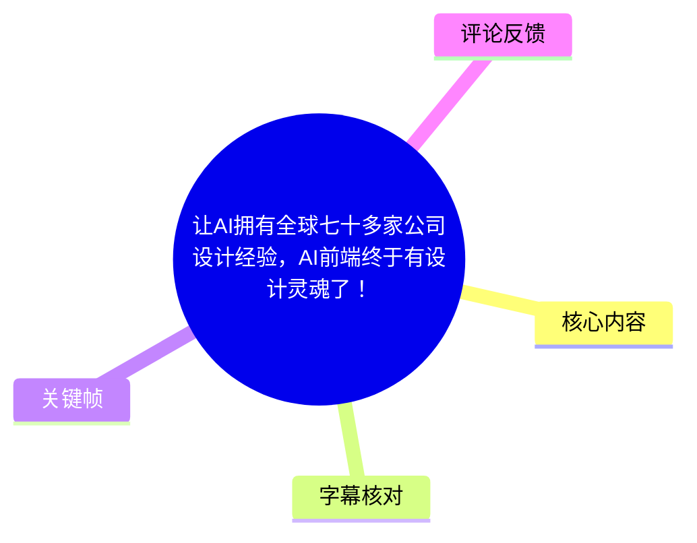
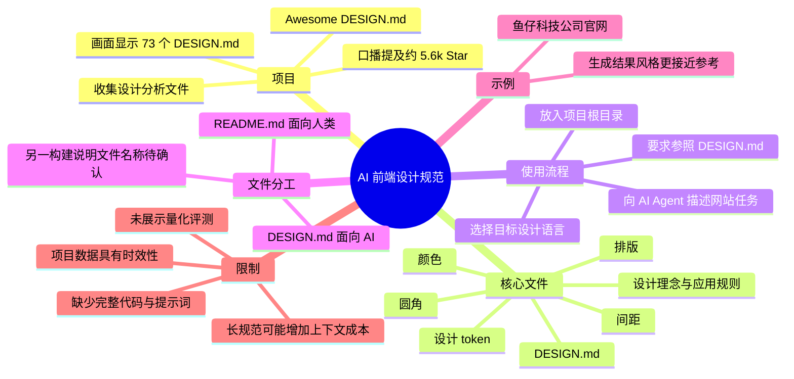
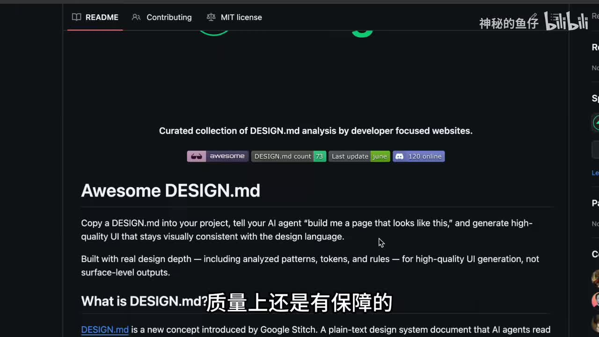
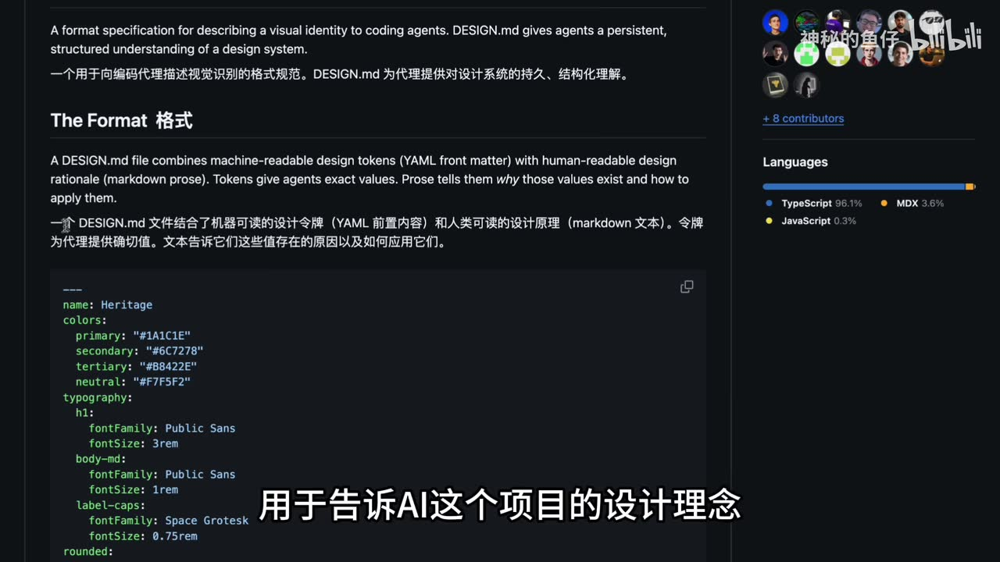
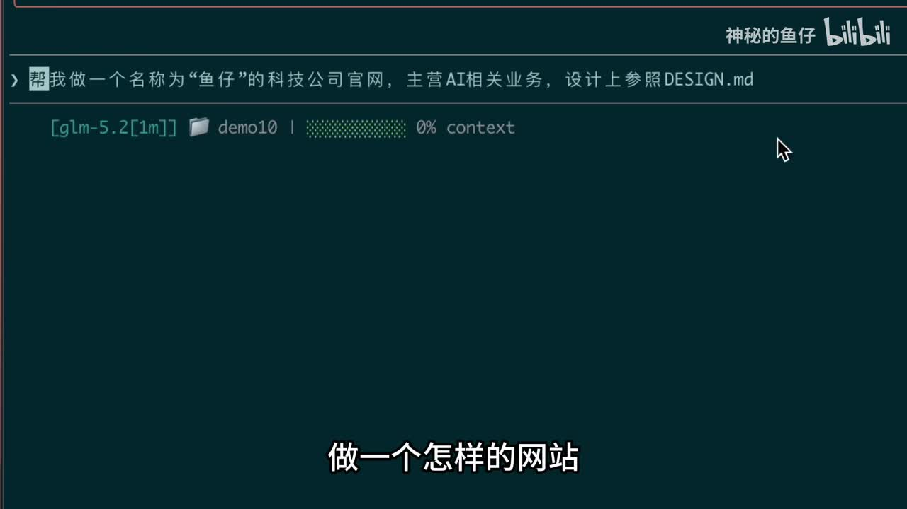

# 让AI拥有全球七十多家公司设计经验，AI前端终于有设计灵魂了！

> 来源：[Bilibili 视频](https://www.bilibili.com/video/BV1j5TC6MEds)  
> UP 主：神秘的鱼仔｜时长：01:30｜分辨率：1920×1080  
> 主题：通过 `DESIGN.md` 向 AI 编程 Agent 提供设计系统约束，以提升前端页面生成的一致性与视觉质量。

## 小结

视频介绍了开源项目 **Awesome DESIGN.md**。UP 主的核心观点是：与其仅用自然语言描述“做一个好看的网站”，不如将某个品牌或产品的设计规范沉淀为 `DESIGN.md`，放在前端项目根目录，并要求 AI Agent 在生成页面时参照该文件。这样可将颜色、排版、圆角、间距等设计决策明确传递给模型。

视频画面显示，该项目是一个收集多个网站/公司 `DESIGN.md` 分析文件的仓库；画面中的计数为 **73**，与视频口播“全球 70 多家公司”一致。UP 主还提到项目拥有约 **5.6k Star**，将其作为项目质量的参考信号；但 Star 数会随时间变化，不能视为固定参数或质量保证。

`DESIGN.md` 在视频中的定位是“给 AI 读的设计规范”：它既包含机器可读取的设计 token，也包含人类可读的设计理念与应用理由。与之相对，`README.md` 主要面向人类，用于介绍项目。视频末尾还提到另一个面向 AI 的构建说明文件，但 ASR 将其识别为“AgenceMD”，未能仅凭现有素材确认准确文件名，因此本文保留其不确定性。

实践方式很直接：选定一种设计语言对应的 `DESIGN.md`，放入前端项目根目录，然后在 AI Agent 的任务提示中描述网站类型，并明确要求“设计上参照 `DESIGN.md`”。视频以“鱼仔”科技公司官网为例展示生成过程，并主观评价：加入设计约束后，成品比未加入设计要求的结果更好，且风格更接近参考设计。

该方法适合使用 AI Agent 进行前端原型、官网、产品页或设计探索的开发者。限制是：视频没有展示完整提示词、项目仓库地址、生成代码、模型参数、评估标准或前后对照的可复现实验，因此“质量直接上去”的结论属于 UP 主基于演示效果的判断，不能直接外推为对所有模型、所有项目都有效。

## 思维导图





## 目录

- [项目背景与问题：为什么要把设计规范交给 AI](#项目背景与问题为什么要把设计规范交给-ai)
- [Awesome DESIGN.md：设计经验的聚合仓库](#awesome-designmd设计经验的聚合仓库)
- [DESIGN.md 的内容与文件分工](#designmd-的内容与文件分工)
- [实操：将设计规范接入 AI Agent](#实操将设计规范接入-ai-agent)
- [示例效果、适用范围与限制](#示例效果适用范围与限制)
- [字幕比对](#字幕比对)
- [评论分析](#评论分析)
- [处理记录](#处理记录)

## 项目背景与问题：为什么要把设计规范交给 AI [00:00](https://www.bilibili.com/video/BV1j5TC6MEds?t=0)

视频切入的实际问题是：AI Agent 能生成前端页面，但如果任务中没有足够具体的视觉约束，生成结果往往难以稳定地体现某种品牌风格或完整设计语言。

UP 主提出的解决思路不是单独增加几个“现代、简洁、高级”的形容词，而是使用一份结构化的 `DESIGN.md` 文件，把已有设计系统中的关键决策交给 AI。视频口播将其概括为：一个开源项目即可让 AI Agent 获得“全球 70 多家公司设计经验”。

这里的“设计经验”应理解为仓库收集、整理或分析的多份设计规范，而不是 AI 实际拥有这些公司的设计团队经验，也不意味着取得品牌授权。视频没有展示各文件的来源、授权条件及覆盖范围，使用者应在实际采用前自行核验。

视频涉及的前置概念包括：

- **AI Agent**：能够读取项目文件、理解任务并生成或修改代码的 AI 编程助手。
- **设计系统**：颜色、字体、字号、间距、圆角、组件状态等可复用的视觉与交互规则集合。
- **设计 token**：设计参数的结构化表示，例如颜色值、字号、间距、圆角等，便于机器读取与复用。
- **项目级上下文**：AI Agent 在执行任务时可访问的项目文件。将 `DESIGN.md` 放在根目录，意在让它成为可被 Agent 读取的项目上下文之一。

## Awesome DESIGN.md：设计经验的聚合仓库 [00:08](https://www.bilibili.com/video/BV1j5TC6MEds?t=8)

UP 主展示的项目名称为 **Awesome DESIGN.md**。画面中仓库页的简介为“面向开发者网站的 `DESIGN.md` 分析精选集合”，并展示以下可见信息：

- `DESIGN.md count`：**73**
- `Last update`：**June**
- 页面标识：`awesome`
- 视频口播：项目约有 **5.6k Star**

因此，视频所说的“70 多家公司设计经验”与画面中 73 份设计文件的计数相互印证。需要注意，计数、更新时间和 Star 数都属于仓库动态数据：它们反映视频录制或截图时的页面状态，后续可能增减。



> 图：该关键帧直接展示了 Awesome DESIGN.md 仓库名称、简介以及 `DESIGN.md count 73` 标识，是核对“70 多家公司”这一视频说法的重要视觉证据；也说明项目并非单一设计模板，而是一个设计规范集合。

视频以 Apple 为例说明仓库目录的组织方式：点开某个公司/品牌目录后，可以看到其中有两个文件。ASR 明确识别出其中一个是 `Design.md`；结合项目名和画面中统一使用的 `DESIGN.md` 写法，本文将其统一记为 `DESIGN.md`，但不据此推断另一个文件的确切名称与内容。

UP 主对“`awesome` 前缀”和约 5.6k Star 的评价是“质量上还是有保障的”。这是一种经验性筛选标准，而非严格验证：

- `awesome` 通常意味着该仓库采用“资源合集/精选列表”的命名惯例；
- Star 可反映一定程度的关注度；
- 但 Star 不等同于内容准确性、更新频率、安全性、许可证兼容性或适配某个模型的效果。

## DESIGN.md 的内容与文件分工 [00:26](https://www.bilibili.com/video/BV1j5TC6MEds?t=26)

视频将 `DESIGN.md` 定义为核心设计文件。按照口播，其作用是告诉 AI 在构建前端网页时应采用的设计规则，包括：

| 类别 | 视频提及内容 | 对 AI 生成的作用 |
| --- | --- | --- |
| 色彩 | 网页颜色 | 统一主色、辅助色、文字色与背景色倾向 |
| 排版 | 排版 | 约束字号层级、字体风格、文字组织方式 |
| 外观 | 圆角 | 统一卡片、按钮、输入框等组件的形状语言 |
| 布局 | 间距 | 约束页面留白、区块间距与组件内部空间 |
| 理念 | 完整设计理念 | 让 AI 不只套用数值，也理解设计规则的使用场景 |

画面中的规范说明进一步提供了可见的格式信息：`DESIGN.md` 用于向编码 Agent 描述视觉身份；文件把**机器可读的设计 token（YAML front matter）**与**人类可读的设计原理（Markdown prose）**结合。前者提供精确数值，后者解释这些数值存在的原因及使用方式。



> 图：关键帧展示“机器可读 token + 人类可读设计原理”的双层结构，并给出颜色、字体、圆角等 YAML 配置示例。它补足了口播中“颜色、排版、圆角、间距”的抽象描述，说明这类文件不是只有视觉截图或自然语言提示。

视频还比较了不同 Markdown 文件的职责：

| 文件 | 视频中的定位 | 主要读者 | 用途 |
| --- | --- | --- | ---|
| `README.md` | 介绍整个项目 | 人 | 解释项目是什么、如何使用 |
| `DESIGN.md` | 介绍项目的设计理念 | AI | 在生成代码时提供设计系统约束 |
| 名称未确认的构建说明文件 | 告诉 AI 如何构建项目 | AI | 补充构建或执行层面的指令 |

关于最后一项，ASR 输出为“AgenceMD/Agence MD”，无法与常见文件名形成可靠对应；视频所给关键帧没有显示该文件名。故只能确认视频提到了“另一个给 AI 读、用于说明如何构建项目的 Markdown 文件”，不能确认其准确拼写、标准来源或具体格式。

## 实操：将设计规范接入 AI Agent [00:43](https://www.bilibili.com/video/BV1j5TC6MEds?t=43)

视频给出的使用步骤可整理如下。

### 1. 选取目标设计语言对应的 `DESIGN.md`

在 Awesome DESIGN.md 的目录中选择希望参考的品牌或产品设计规范。视频以 Apple 为例说明目录中存在设计文件，但没有展示完整筛选标准。

选择时应关注实际项目是否需要该类设计语言，而不是仅凭品牌知名度决定。例如：

- 做极简、强调留白的产品页时，可选择具有相近视觉倾向的规范；
- 做企业后台、数据密集型界面时，应优先检查规范是否覆盖表格、状态、表单与信息层级；
- 若目标产品已有自身品牌规范，应以自有设计系统为准，而非直接复制外部品牌风格。

### 2. 将文件放入前端项目根目录

视频明确要求：先把该文件放在**前端项目根目录**。这使文件更容易成为 AI Agent 可访问的项目上下文。

示意目录如下；这是对视频步骤的目录化表达，并非视频展示的真实仓库结构：

```text
your-frontend-project/
├── DESIGN.md
├── package.json
├── src/
└── ...
```

视频未说明 AI Agent 是否会自动读取根目录中的全部 Markdown 文件。因此，实际使用时不能假定“放入根目录就一定生效”；仍应在提示中明确要求 Agent 阅读并遵照该文件。

### 3. 在任务提示中描述业务目标并指定设计参考

视频中的演示提示可辨识为：让 AI 制作一个名为“鱼仔”的科技公司官网，主营 AI 相关业务，并在设计上参照 `DESIGN.md`。



> 图：该关键帧展示了 AI Agent 终端内的任务提示，其中包含“名称为‘鱼仔’的科技公司官网”“主营 AI 相关业务”“设计上参照 DESIGN.md”等关键信息。它是视频实操链路中“业务需求 + 文件级设计约束”组合方式的直接证据。

可抽象为以下提示结构。以下文本是基于视频意图整理的通用表达，不是对视频完整原始提示词的逐字转录：

```text
帮我做一个名为“鱼仔”的科技公司官网，主营 AI 相关业务。
请先阅读项目根目录中的 DESIGN.md，
页面视觉设计、排版、颜色、圆角与间距均参照其中的设计规范。
```

### 4. 检查生成结果是否同时满足业务与设计要求

视频展示了生成后的“鱼仔 AI 网站”，并给出主观比较：添加设计要求后的效果，优于不添加设计要求的版本；整体设计风格“确实很相似”。

实际验收时，建议将“很像”拆分为可检查项：

1. 是否使用了规范中的颜色层级，而非随机配色；
2. 标题、正文、按钮、卡片是否具备一致的排版关系；
3. 圆角、阴影、边框、间距是否形成统一系统；
4. 是否满足页面功能、响应式布局、可访问性与性能需求；
5. 是否避免直接复制品牌标识、受保护的图形资产或可能导致混淆的视觉元素。

## 示例效果、适用范围与限制 [01:01](https://www.bilibili.com/video/BV1j5TC6MEds?t=61)

视频的可迁移经验是：对 AI 编程任务而言，设计要求从“模糊审美描述”升级为“可读取、可复用的项目文件”，有助于减少生成过程中的视觉随机性。尤其是颜色、字体、间距、圆角等高频决策，适合沉淀为结构化规则。

但应同时保留以下边界。

### 视频已展示的内容

- 使用 Awesome DESIGN.md 作为设计规范来源；
- 目录中可按公司/品牌查看设计文件；
- 将 `DESIGN.md` 放入前端项目根目录；
- 在 AI Agent 提示中明确要求参照该文件；
- 以“鱼仔”科技公司官网作为演示任务；
- UP 主认为加入设计规范后的结果更好、风格更接近参考。

### 视频未展示或无法据此确认的内容

- Awesome DESIGN.md 的仓库链接、具体维护者、许可证与每份设计文件的来源；
- 生成页面所用的完整模型、版本、Agent 工具、系统提示词和完整上下文；
- Apple 示例中第二个文件的名称与作用；
- “AgenceMD”对应的准确文件名；
- 未加规范与加入规范两组结果的完整截图、代码或量化评分；
- 设计文件长度、token 消耗、读取优先级和跨 Agent 的兼容性；
- 是否适用于移动端、复杂交互、设计稿交付或生产级组件库。

### 上下文与维护成本

热评中出现“上下文缓存”“token 吸收器”的担忧，这与此类方案的实际成本有关：若一次性向模型注入大量品牌规范或多个 Markdown 文件，确实可能增加上下文占用，并使 AI 对相互冲突的规则产生误解。

可行的控制方向包括：

- 按当前页面或功能选择单份相关规范，而不是堆叠全部文件；
- 将通用规则与页面特定规则分层；
- 用目录、索引或触发条件控制何时加载某份规范；
- 在生成后进行人工设计审查，而非仅依据“看起来像”验收；
- 把确认有效的规则逐步沉淀为自有项目设计系统。

### 时效性说明

本视频的元数据抓取时间为 **2026-07-13**，仓库计数、更新时间、Star 数及 AI Agent 对 Markdown 文件的读取行为都可能变化。本文中的“73 份”“约 5.6k Star”仅记录视频画面与口播所述状态，不应当作当前实时数据。

## 字幕比对 [01:18](https://www.bilibili.com/video/BV1j5TC6MEds?t=78)

本次任务已执行 ASR。站内字幕虽然存在，但内容与视频主题明显不匹配，开头为“日本女友死都不穿JK”，并持续出现服饰、商场等与本视频无关的话题，不能用于还原本视频知识内容。

| 字幕来源 | 完整性 | 专有名词 | 时间轴 | 主要问题 |
| --- | --- | --- | --- | --- |
| Bilibili 站内字幕 | 与实际主题不对应，不能使用 | 几乎未识别出视频中的项目、文件名与工具名 | 未提供可用的逐句时间信息 | 内容疑似错误绑定为另一段视频/音频字幕，主题完全偏离 |
| 本次 ASR 字幕 | 覆盖视频主线，包括项目、文件、步骤与结尾 | 可识别 `Awesome Design MD`、`Design.md`、`README.md` 等，但存在误识别 | 提供文本分段，未提供精确逐句时间戳 | 中英文混杂与同音词错误；“Google Labs Code”“Device2.0 MD”“AgenceMD”等需谨慎处理 |

最终采用策略为：**以本次 ASR 为主，结合关键帧画面与上下文进行有限校正；站内字幕不采用。**

已校正或标注的重点如下：

- `Awesome Design MD`：结合仓库画面，统一写作 **Awesome DESIGN.md**。
- `Design.md`：画面与项目标题均使用大写形式，统一写作 **`DESIGN.md`**。
- `瑞德秘点脸`：结合上下文“给人读、介绍项目”和常见项目文件职责，判断应指 **`README.md`**。
- `Google Labs Code`：关键帧中可见 “Google Stitch”，因此不采用 ASR 的“Google Labs Code”说法；但视频没有展开其来源背景，本文不进一步延伸。
- `Device2.0 MD`：无法从现有画面和文本确认，未纳入正文事实。
- `AgenceMD`：不能可靠确认准确拼写，正文仅保留其功能描述及不确定性。

## 评论分析 [01:24](https://www.bilibili.com/video/BV1j5TC6MEds?t=84)

以下仅处理本次可获取的热评前三条；评论为用户观点或经验分享，不作为已验证事实。

### 1. 香菇不蓝兽｜56 赞

> “上下文缓存：你好[doge] 不会真以为有这么神吧”

该评论以调侃方式提醒：把大量设计规范加入 AI 上下文，可能面临上下文长度、缓存和实际效果被夸大的问题。它与视频未展示 token 消耗、文件加载机制的限制相呼应。

可取之处在于提醒读者避免“导入一个文件即可显著提升”的自动化想象；不足是没有提供测试数据、Agent 类型或可复现条件，因此不能据此量化实际成本。

### 2. ZnFooe｜19 赞

> “我做了一个skills，可以根据问答，来设计一套规范，有很多个md，当然只有在需要的时候才会触发，触发词写在claude.md里面，所以不会导致上下文浪费……总体上神满意的[doge]”

评论者提出了一种扩展实践：通过问答形成一套规范，将其拆分为多个 Markdown 文件，并通过 `claude.md` 中的触发词按需加载，以控制上下文使用。该观点提供了“不要全量塞入规范”的工程化方向。

但评论中提到的网站、三天完成项目和“总体满意”等均为评论者自述，视频素材未提供验证。其“按需触发”的具体实现、所用模型、效果评价方法和实际 token 数据均未展示。

### 3. 萌新小瓜｜7 赞

> “token吸收器”

该评论用简短标签概括了对大型规范文件的担忧：过多 Markdown 可能成为 token 消耗来源。它不否定设计规范的价值，而是指出实现时需要考虑信息密度与加载范围。

评论没有说明文件大小、上下文窗口或成本数据，因此只能视为风险提示。实践中可通过精简规则、拆分模块、按任务检索和限制引用范围来缓解这一问题。

## 处理记录 [01:29](https://www.bilibili.com/video/BV1j5TC6MEds?t=89)

- Worker ID：`worker-mrj0www4-e8d79408`
- 模型：`gpt-5.6-terra`
- 调用工具与素材：视频元数据、素材清单、站内字幕、已执行的 ASR 字幕、关键帧 `frames/frame-001.jpg` 至 `frames/frame-003.jpg`、可获取热评前三条。
- 字幕选择：已执行本次 ASR；因站内字幕内容与视频主题完全不符，正文以 ASR 为主，并以关键帧及上下文校正 `Awesome DESIGN.md`、`DESIGN.md`、`README.md` 等可确认术语。
- 关键帧依据：
  - `frames/frame-001.jpg`：展示 Awesome DESIGN.md 项目页与 `DESIGN.md count 73`，用于支撑项目规模与仓库定位；
  - `frames/frame-002.jpg`：展示 AI Agent 中“鱼仔科技公司官网、设计参照 DESIGN.md”的提示，用于说明实操方式；
  - `frames/frame-003.jpg`：展示 `DESIGN.md` 的 token 与 Markdown 双层格式说明，用于解释其技术结构。
- 评论处理：仅分析素材中可获取的热评前三条，未扩展到其他评论。
- 缓存清理：素材仅提供采集完成状态，未提供缓存清理工具调用或执行日志；因此无法确认是否已清理缓存，未作编造性声明。
- 未解决问题：
  - 未提供项目仓库 URL、许可证与设计规范来源，无法进行外部核验；
  - “AgenceMD”无法确认准确文件名；
  - ASR 未附精确逐句时间戳，文中时间轴为依据视频叙述顺序设置的导航锚点；
  - 未提供完整生成结果、模型配置与对照实验，无法量化视频所称的质量提升。

## 评论分析

本次流程未获取到可用热评，因此不推断观众态度或额外结论。
