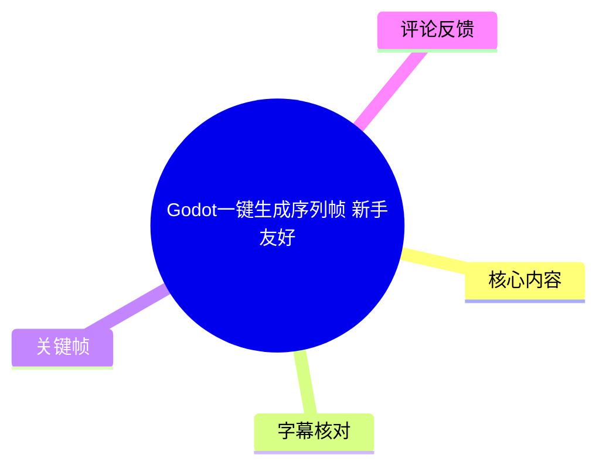
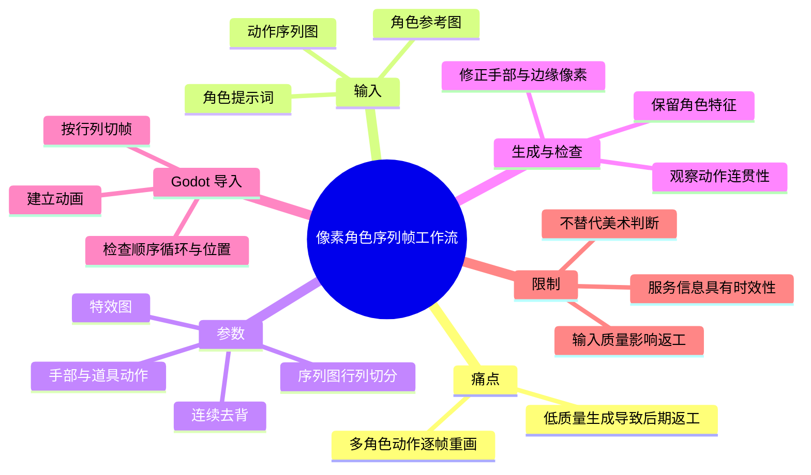
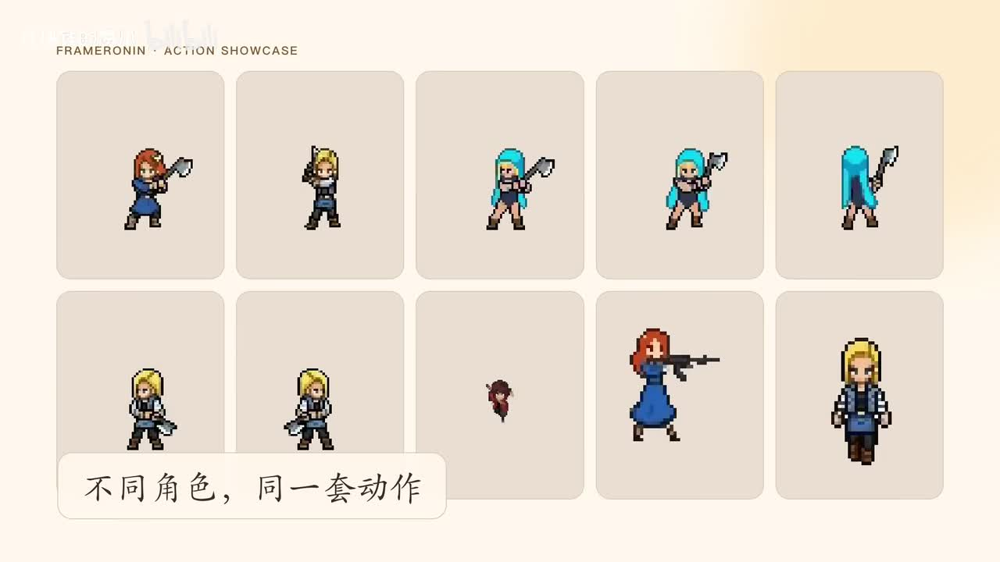
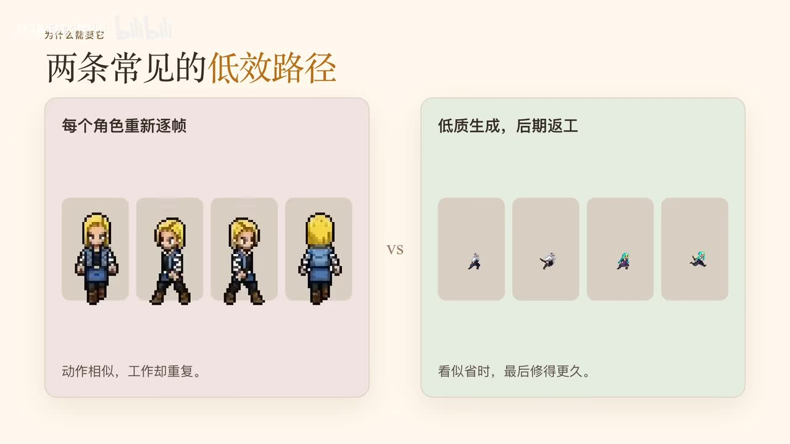
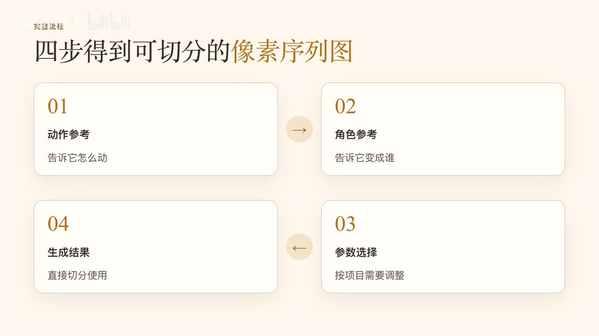
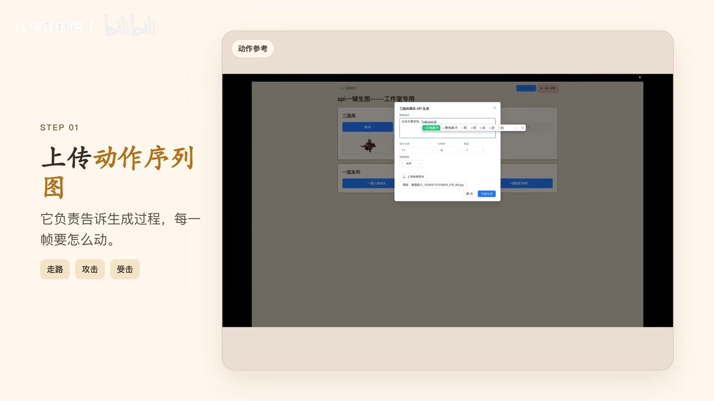

# Godot一键生成序列帧 新手友好

> 来源：[Bilibili 视频](https://www.bilibili.com/video/BV1MpNm6hEp8) 
> UP 主：八块钱的魔爪｜发布时间：2026-07-13｜视频时长：05:28｜分辨率：1920×1080

## 小结

视频介绍了一条面向像素风、2D 游戏角色动画制作的工作流：提供一张（或一组）**动作序列图**、一张**角色参考图**及角色描述，通过网站的 API 生成功能，把同一套动作结构转换为不同角色的、可切分使用的像素序列图（Sprite Sheet）。

其核心价值不在于完全自动化美术制作，而在于复用已经确定的动作结构。对于走路、攻击、受击等动作相近、但需要替换多个角色外观的项目，这能减少逐角色重画每一帧的重复工作。

流程可概括为四步：上传动作参考，上传角色参考并填写提示词，按项目需求配置特效/去背/手部道具等选项，最后设置序列图的行列切分方式并生成。下载后，在 Godot 中按同一行列规则切帧、建立动画，并检查播放顺序、循环和角色位置稳定性。

视频反复强调输入素材质量决定返工量：动作图与角色图应尽可能预先像素化，角色尺寸要相近、轮廓要清楚；提示词只需明确地用中文说明角色类型、服装及需保留的特征，避免加入互相冲突的要求。

生成结果不是“零修改”的最终资产。手部、武器边缘与局部像素可能仍有问题，适合逐帧进入精细调整；工具承担的是重复劳动，美术判断、局部修正和最终品质把控仍需人工完成。

视频末尾演示将结果导入 Godot 并放入游戏场景运行。其对外提供的网站地址在 ASR 中识别为 `srln.com`，且 UP 主称链接放在简介中；由于没有站内字幕和可验证网页材料，网址拼写、服务状态、免费范围、API 限额与具体模型能力均应以视频简介和网站实时页面为准。

## 思维导图

## 目录

- [问题背景：两类低效路径](#问题背景两类低效路径-0030)
- [整体流程：从参考图到可切分序列图](#整体流程从参考图到可切分序列图-0054)
- [步骤一：上传动作序列图](#步骤一上传动作序列图-0054)
- [步骤二：角色参考图与提示词](#步骤二角色参考图与提示词-0130)
- [步骤三：按项目需求配置生成选项](#步骤三按项目需求配置生成选项-0205)
- [步骤四：设置行列切分并生成](#步骤四设置行列切分并生成-0230)
- [生成结果与人工精修边界](#生成结果与人工精修边界-0310)
- [导入 Godot 与运行验收](#导入-godot-与运行验收-0420)
- [限制、适用范围与时效性](#限制适用范围与时效性-0400)
- [字幕比对](#字幕比对)
- [评论分析](#评论分析)
- [处理记录](#处理记录)

## 问题背景：两类低效路径 [00:30](https://www.bilibili.com/video/BV1MpNm6hEp8?t=30)

视频讨论的是像素游戏中“同一套动作、多个角色外观”的动画生产问题。UP 主的判断是，一个角色的走路、攻击、受击等动作完成后，若为另一个角色或角度重新制作，往往又要从头重复，容易成为纯体力劳动。

视频将低效做法归纳为两类：

1. **每个角色重新逐帧绘制**：动作相近，但每个角色都要单独制作完整帧序列，重复度高。
2. **直接依赖质量不稳定的 AI 生成**：表面看节约时间，但若动作不统一、轮廓或像素边缘不干净，后期修复反而耗时更长。

这里的替代思路是：固定“动作参考”所提供的姿势顺序和动作结构，只改变“角色参考”所指定的人物形象。视频中将其表述为用名为“Frame Running”的一键生成功能完成，但该名称仅来自 ASR 转写，未获站内字幕或网页材料交叉验证。

> 图：画面以多个不同外观的像素角色展示相似动作，明确说明本工作流的目标不是随机生成动作，而是将既有动作结构复用于不同角色。

> 图：画面把“每个角色重新逐帧”和“低质生成、后期返工”并列，帮助理解视频试图规避的两种成本来源。

## 整体流程：从参考图到可切分序列图 [00:54](https://www.bilibili.com/video/BV1MpNm6hEp8?t=54)

UP 主将获得可切分像素序列图的过程概括为四个环节：

1. **动作参考**：告诉生成过程“怎么动”，即走路、攻击、受击等动作，以及每一帧的排列与顺序。
2. **角色参考**：告诉生成过程“变成谁”，决定最终角色外观。
3. **参数选择**：按游戏项目实际需求配置特效、背景去除、手部和道具等选项。
4. **生成结果**：获得已经切分逻辑明确的像素序列图，后续可导入引擎使用。

> 图：关键帧直接列出“动作参考 → 角色参考 → 参数选择 → 生成结果”，是理解后续操作职责划分的总览图。

视频称该网站通过 API 生成序列图，但没有展示 API 文档、请求格式、鉴权方式、价格、调用限额或可用模型。因此，“通过 API”应理解为视频对服务工作机制的描述，不能据此推导出开发者可直接调用的具体接口。

## 步骤一：上传动作序列图 [00:54](https://www.bilibili.com/video/BV1MpNm6hEp8?t=54)

动作序列图是流程的第一个输入。它承担的任务是向生成过程传达：

- 角色应如何移动；
- 是否执行走路、攻击、受击等动作；
- 各姿势帧的动作顺序；
- 后续结果应沿用的动作结构。

如果暂时没有合适的动作参考，视频称网站内准备了一些质量相对稳定的序列图，可先用于测试。视频没有给出这些内置素材的具体数量、授权范围或下载方式。

实际准备动作图时，应特别关注其与后续切分参数的对应关系：序列图中的帧布局会决定最终的“几行几列”设置。若参考图帧数与切分设置不一致，导入 Godot 后还需要重新整理。

> 图：画面展示“STEP 01 上传动作序列图”，并标注走路、攻击、受击等用途；其价值在于明确动作参考不是角色外观图，而是动作时序的载体。

## 步骤二：角色参考图与提示词 [01:30](https://www.bilibili.com/video/BV1MpNm6hEp8?t=90)

### 角色参考图：决定“生成的是谁”

角色参考图决定最终生成角色的身份和视觉外观。视频给出的选择原则包括：

- 尽量使用**轮廓清楚**的图片；
- 使用**像素尺寸合适**的素材；
- 动作序列图和角色图都已经像素化时，后续人工调整通常会更少；
- 角色参考图的角色大小应尽可能接近动作参考图中的角色大小。

这组建议的本质是降低风格、比例和像素密度的转换难度。视频没有给出具体推荐尺寸、色板数量或透明背景格式，因此不能补充为固定规格。

### 提示词：作为参考图的补充说明

视频将提示词定位为补充信息：

- 角色参考图主要告诉系统“角色长什么样”；
- 提示词补充角色的类型、服装或必须保留的特征；
- 不需要使用专业术语，使用正常、明确的中文描述即可；
- 不要把互相冲突的要求全部塞入提示词。

可迁移的写法是把描述拆为清晰且不矛盾的视觉约束，例如“蓝色长发、深色短外套、保留手持武器特征”。这只是依据视频原则给出的表达形式，不是视频展示的原始提示词。

## 步骤三：按项目需求配置生成选项 [02:05](https://www.bilibili.com/video/BV1MpNm6hEp8?t=125)

角色与动作输入完成后，视频提到可按需要配置以下内容：

| 选项 | 视频说明 | 适用判断 |
| --- | --- | --- |
| 特效图 | 可根据需要加入 | 仅当项目需要攻击、魔法等特效表现时加入 |
| 连续去背 | 可选择是否连续去背 | 需结合最终游戏中背景、透明通道和素材组织方式决定 |
| 手部与道具 | 动作涉及武器或道具时，再决定手部是否带有相应动作 | 需要角色持握关系、武器姿态与动作一致时启用或重点检查 |
| 参数数量 | 不是越多越好 | 应以最终游戏资产需求为准，而非盲目叠加选项 |

视频没有说明“连续去背”的具体算法、透明度输出格式或对边缘质量的影响，也没有展示各选项的默认值。因此，这些选项的详细效果仍需在网站实际界面中核验。

## 步骤四：设置行列切分并生成 [02:30](https://www.bilibili.com/video/BV1MpNm6hEp8?t=150)

最后需要设置序列图的切分方式，即输出图中帧的**行数和列数**。这是视频明确指出的关键参数：

- 行列设置必须和动作参考相对应；
- 不对应时，后续导入引擎还要重新整理；
- 确认后即可开始生成。

视频没有给出具体的行数、列数、单帧尺寸、帧率或导出文件格式。实践时不应假设某种固定排列方式，而应先数清动作参考中的帧布局，再将同一布局带入生成和引擎导入环节。

生成过程中，UP 主在视频中跳过了等待。其建议的结果验收顺序是：

1. 先看动作是否连贯；
2. 再看角色特征是否保住；
3. 检查背景、手部道具、特效是否按先前设置处理。

## 生成结果与人工精修边界 [03:10](https://www.bilibili.com/video/BV1MpNm6hEp8?t=190)

UP 主展示的结果是：生成图沿用了参考序列图的动作结构，角色则替换为上传的参考角色；背景、手部道具和特效可以按前述配置处理。对于多个相近角色，这意味着不必反复重画同一套动作。

但视频也明确否定了“生成后完全不用改”的期待。可能需要人工处理的问题包括：

- 个别帧的手部；
- 武器的轮廓或边缘；
- 局部像素效果不理想；
- 角色在各帧中位置出现不自然跳动。

建议的修正方式是只对问题区域或问题帧进行精细调整，而不是推翻整个序列重做。视频对工具定位很明确：它用于减少重复工作，最终的细节完善仍由创作者完成。

## 导入 Godot 与运行验收 [04:20](https://www.bilibili.com/video/BV1MpNm6hEp8?t=260)

生成并下载序列图后，视频进入 Godot 导入阶段。其操作要求并不涉及特殊处理，重点是保持生成阶段与引擎阶段的切分规则一致：

1. 将下载的序列图导入 Godot；
2. 按此前设置的行数、列数切分帧；
3. 为相应动作建立动画；
4. 检查播放顺序；
5. 检查是否需要循环播放；
6. 检查角色在每一帧中的位置是否有明显跳动。

视频在游戏场景中展示了角色实际运行的效果：白天、黄昏、夜晚的光照会变化，但角色移动和动画保持连贯。这里证明的是该演示素材已被成功用于场景运行；并不意味着任何输入素材都能无调整地达到同等效果。

## 限制、适用范围与时效性 [04:00](https://www.bilibili.com/video/BV1MpNm6hEp8?t=240)

### 适用范围

这条流程适合以下情形：

- 像素风或 2D 游戏项目；
- 已经有一套可复用的动作模板；
- 需要快速制作多个外观相近、动作逻辑一致的角色；
- 能接受生成后进行局部像素修正；
- 最终使用 Godot，或可自行在其他引擎中处理 Sprite Sheet 的项目。

视频结尾也提到其网站支持 Godot 和 Unity，但这一点来自 UP 主热评，未在主体演示中展开 Unity 的具体导入方法。

### 关键限制

1. **素材质量前置**：动作图与角色图最好提前像素化，角色尺寸要尽量接近；素材越干净，后续返工越少。
2. **不能替代美术判断**：工具只压缩最耗时、重复度最高的部分，不能自动解决动作设计、角色辨识度、像素风格统一和局部构图问题。
3. **逐帧检查仍不可省略**：手、武器、边缘像素与角色位置都可能出现局部错误。
4. **行列参数必须一致**：生成切分与 Godot 导入切分不一致，会增加整理成本。
5. **未公开的技术细节**：视频未提供 API 规范、模型名、输入输出限制、费用、版权政策、隐私条款、并发限制和生成耗时，不能据此做工程能力承诺。

### 时效性说明

本视频发布于 2026-07-13，素材抓取于 2026-07-16。网站功能、域名可用性、免费策略、支持的引擎、生成质量和 API 能力都可能随时间调整。视频中的“免费开源”“超过 47 个实用功能”等说法来自 UP 主评论，应视为发布时的宣传或补充信息，而非本记录已独立验证的长期事实。

视频末尾口述的网站地址由 ASR 识别为 `srln.com`，且称链接位于简介。由于无站内字幕可供核对，建议使用前优先查看视频简介中的原始链接，而不要仅凭转写字符串访问。

## 字幕比对

| 字幕来源 | 完整性 | 专有名词 | 时间轴 | 主要问题 |
| --- | --- | --- | --- | --- |
| Bilibili 站内字幕 | 未提供可用字幕 | 无法核对 | 无法使用 | 素材中未提供站内字幕文件或有效文本 |
| 本次 ASR 字幕 | 覆盖 15 个语音段，语音覆盖约 216.95 秒，占全片约 66.16% | 存在误识别与不确定拼写 | 可用，具有毫秒级 SRT 起止时间 | 开场、转场和演示段存在无语音间隔；部分词语识别不稳 |

本次 ASR 使用 `medium` 模型，识别语言为中文，语言置信度为 `0.99658203125`；音频时长为 `327.936` 秒。诊断中**没有** `noAudioStream=true` 标记，说明源视频存在音轨，本次 ASR 是正常的音频识别结果，而非无音轨替代方案。

最终以本次 ASR 的 SRT 时间轴作为章节链接依据，所有时间点均按真实分段起始时间换算为秒数。由于缺少站内字幕，本记录不将 ASR 的疑似错误强行修正为确定事实：

| ASR 表述 | 处理方式 |
| --- | --- |
| “Frame Running” | 保留为 ASR 所识别的功能名；无站内字幕、网页或清晰画面文字可验证其准确拼写 |
| “角色参卡”“序练图”“序列针” | 根据上下文统一理解为“角色参考图”“动作序列图/序列图”“序列图”，但不将其视为界面正式术语 |
| “GODO” | 结合视频标题与明确上下文，校正为 Godot |
| “srln.com” | 保留为 ASR 识别结果，并标记为待以简介原始链接核对的网址 |
| “七辆处里多个角色”“反攻越少” | 结合语义整理为“批量处理多个角色”“返工越少”，原 ASR 存在同音或断词误差 |

关键帧提供了对“同一套动作”“两类低效路径”“四步流程”“上传动作序列图”等画面文字的辅助核验；但素材未提供完整界面高清细节，无法据此补出未在语音中明确的参数数值或网站功能名称。

## 评论分析

以下仅分析本次可获取的热评前三条，不将评论内容视为已独立验证的事实。

1. **前行开拓者（2 赞）**  
   评论询问：“多次抽卡，某一格有问题，你怎么处理有问题那一格”。  
   这指出了实际工作流中最关键的异常处理问题：批量或多次生成时，若仅个别帧错误，是否能局部重抽、局部重绘或单帧修复。视频主体的对应建议是对有问题的手部、武器边缘或局部像素进行精细调整，但没有展示网站是否支持“只重生成某一格”。该问题在现有素材中没有 UP 主回复，仍待确认。

2. **荻某人（1 赞）**  
   评论询问网址或群号。  
   这反映出观众希望获得工具入口与社群支持。视频口述称链接在简介里，但素材未给出简介中的实际链接内容，也没有提供群号，因此无法记录为确定联系方式。

3. **八块钱的魔爪（0 赞）**  
   UP 主补充称：“免费开源，网站超过 47 个实用功能支持 godot 和 unity”。  
   该评论补充了服务定位和引擎兼容性信息，但没有列出 47 个功能、开源仓库地址、许可证、免费条件或 Unity 的具体使用步骤。它可作为 UP 主的发布时说明，不应直接等同于已验证的产品规格。

## 处理记录

- Worker ID：`worker-mrj0wbly-5dc4e50c`
- 模型：`gpt-5.6-terra`
- ASR 模型：`medium`，CUDA / `float16`，自动识别语言为中文。
- 使用的素材工具结果：视频元数据、音频文件、ASR SRT 时间轴、ASR 分段诊断、关键帧、热评 JSON、站内字幕检索结果。
- 字幕选择：未提供可用 Bilibili 站内字幕；已检查本次 ASR，确认音轨存在且 ASR 含真实时间戳。因此采用 ASR SRT 的起止时间作为时间轴依据，并对明显同音/断词错误进行语义标注而非虚构校正。
- 关键帧选择依据：选用 `frames/frame-001.jpg` 展示多角色复用动作，`frames/frame-002.jpg` 展示两类低效路径，`frames/frame-003.jpg` 展示四步总流程，`frames/frame-004.jpg` 展示动作序列图上传步骤；均用于支撑正文中对应的可见信息。
- 缓存清理：未提供缓存清理执行日志；本记录不宣称已执行清理。
- 未解决问题：
  - “Frame Running”与 `srln.com` 的准确拼写缺少站内字幕或网页材料复核；
  - 未知该服务的 API 接入方式、价格、免费额度、隐私政策、版权规则与生成限制；
  - 未知是否支持异常单帧的局部重生成；
  - 视频未展示 Godot 的具体节点、资源类型、帧率或动画配置参数。
