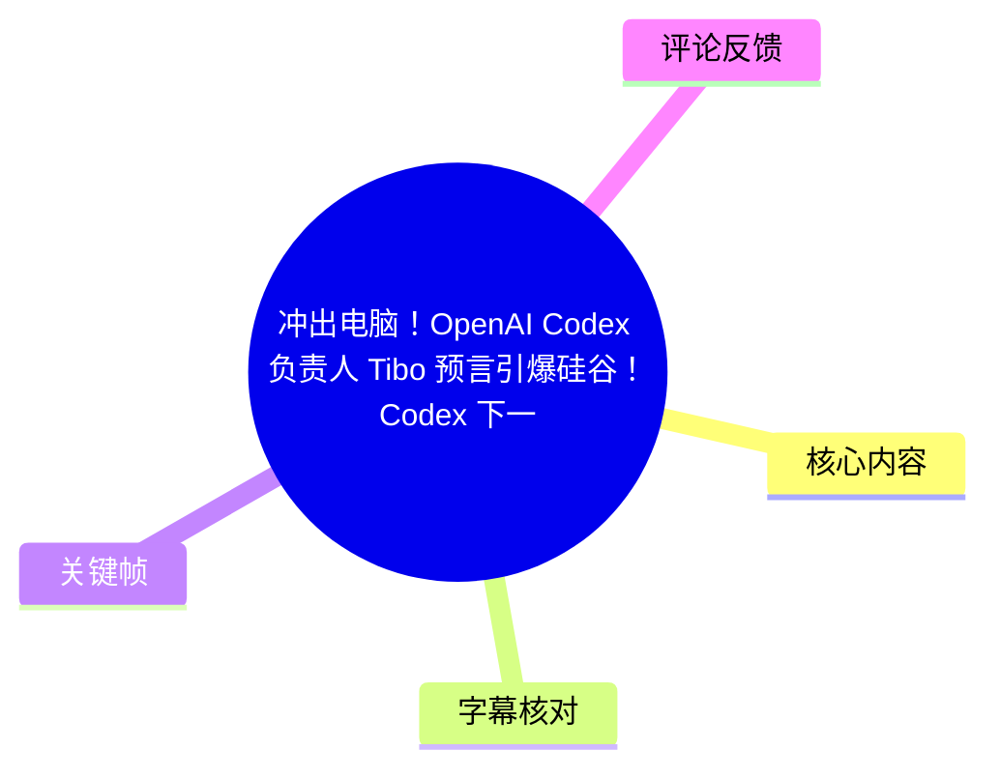
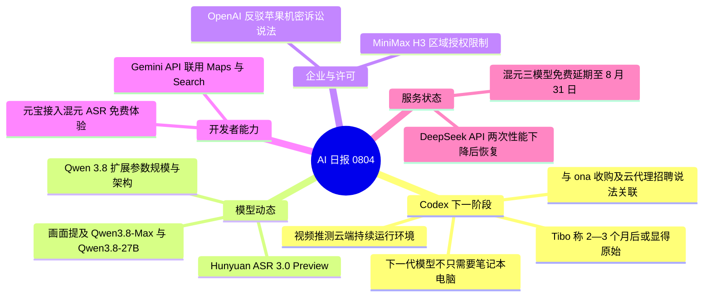
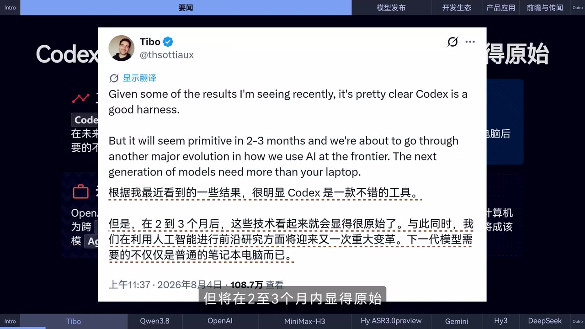
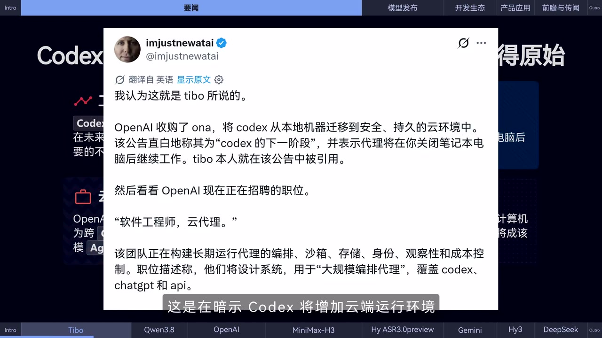
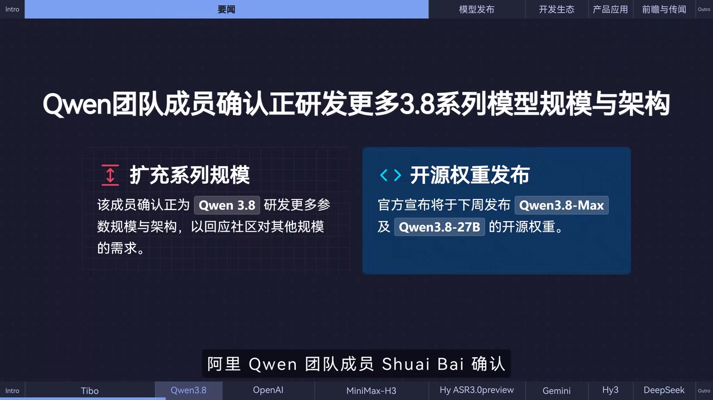

# 冲出电脑！OpenAI Codex 负责人 Tibo 预言引爆硅谷！Codex 下一阶段将史诗进化！| AI日报0804

> 来源：[Bilibili 视频](https://www.bilibili.com/video/BV1YMuP6dEM6)  
> UP 主：黑鸦Heya｜合集：AIcode｜视频时长：105 秒｜分辨率：3840×2160  
> 本文依据视频画面、可用关键帧与本次 ASR 整理；视频内容属于新闻速报，涉及的产品状态、日期与服务可用性均具有时效性。

## 小结

这是一则覆盖 OpenAI、阿里 Qwen、MiniMax、腾讯混元、Google Gemini、DeepSeek 等多方动态的 AI 日报。最受视频强调的消息是：OpenAI Codex 负责人 Tibo 表示，尽管 Codex 已是不错的工具，但它可能在 **2—3 个月内显得“原始”**；下一代模型需要的基础设施“不只是一台笔记本电脑”。

视频据此提出一种**推测性解读**：Codex 的下一阶段可能从本地电脑上的编码工具，转向具备云端持续运行能力的智能体工作环境。画面引用的材料将此与 OpenAI 收购 `ona`、以及围绕“云代理”招聘和基础设施建设的说法关联起来；但“Codex 必然增加云端运行环境”是视频及其引用材料的推断，不等同于 OpenAI 在本视频中直接公布的产品规格或上线时间。

模型侧，视频称阿里 Qwen 团队正在为 Qwen 3.8 开发更多参数规模和架构；画面进一步展示了 Qwen3.8-Max、Qwen3.8-27B 开源权重“将于下周发布”的说法。由于视频未提供具体发布日期、权重地址、上下文长度或基准成绩，实际发布与可用范围仍应以官方公告为准。

开发者工具与部署层面的实用信息包括：MiniMax H3 在美国、欧盟、英国、韩国可经正式授权流程部署，但标准社区许可证默认不包含这些地区的授权；腾讯发布 Hunyuan ASR 3.0 Preview，强调上下文结合和智能纠错，并称 API 已上线、元宝首发接入可免费体验；Gemini API 可同时使用 Google Maps 与 Google Search 工具。

本期信息发布时间锚点为视频标题中的“AI日报0804”及内容所述的 **2026 年 8 月 4 日**。其中，Workbody 的混元三模型免费活动延期至 **2026 年 8 月 31 日**，DeepSeek API 当日两次性能下降则均已恢复。适合需要快速跟踪 AI 编程智能体、模型发布、API 能力与许可证边界的开发者阅读。

## 思维导图

## 目录

- [日报背景、信息性质与阅读边界](#日报背景信息性质与阅读边界-0000)
- [Codex：从笔记本电脑走向云端代理的信号](#codex从笔记本电脑走向云端代理的信号-0000)
- [Qwen 3.8：更多模型规模与架构](#qwen-38更多模型规模与架构-0024)
- [OpenAI 诉讼回应与 MiniMax H3 许可边界](#openai-诉讼回应与-minimax-h3-许可边界-0048)
- [混元 ASR、Gemini 工具与服务状态](#混元-asrgemini-工具与服务状态-0112)
- [面向开发者的核验与使用步骤](#面向开发者的核验与使用步骤-0048)
- [结论、限制与时效性](#结论限制与时效性-0136)
- [字幕比对](#字幕比对-0000)
- [评论分析](#评论分析-0000)
- [处理记录](#处理记录-0000)

## 日报背景、信息性质与阅读边界 [00:00](https://www.bilibili.com/video/BV1YMuP6dEM6?t=0)

视频以约 105 秒的快节奏形式播报多条 AI 行业资讯，内容横跨模型研发、智能体基础设施、软件授权、语音识别 API、工具调用能力和在线服务稳定性。

阅读时需要区分三类信息：

1. **当事人观点或企业声明**：例如 Tibo 对 Codex 演进的表述、OpenAI 对诉讼的回应、MiniMax 对许可范围的澄清。
2. **视频转述的发布或可用状态**：例如混元 ASR 3.0 Preview 上线 API、Gemini API 的工具组合能力、DeepSeek API 故障恢复。
3. **视频的关联性推断**：例如将 Tibo 的“超出笔记本电脑”表述、`ona` 收购和云代理职位联系起来，进一步推导 Codex 可能增加云端运行环境。这并非视频中可见的、带具体接口或发布日期的正式产品承诺。

因此，本期可作为线索与待核验清单使用，而不宜据此直接假定某项功能已公开上线，或直接用于生产环境决策。

## Codex：从笔记本电脑走向云端代理的信号 [00:00](https://www.bilibili.com/video/BV1YMuP6dEM6?t=0)

视频开篇展示了 Tibo 的社交媒体帖文。画面中的英文原文核心为：Codex 是一款不错的工具；但在 **2—3 个月内**，它会显得原始；前沿 AI 的使用方式将经历又一次重大演化；下一代模型需要的不只是用户的笔记本电脑。

> 图：关键帧展示 Tibo 的原帖英文内容及中文翻译，直接给出了“2—3 个月”“不止笔记本电脑”两个最重要的时间与基础设施线索，是理解视频主标题的首要证据。

视频的解读可拆为三层：

- **明确陈述**：Tibo 认为当前 Codex 虽然表现不错，但很快会相对落后；下一代模型的运行需求将超出单台笔记本电脑。
- **画面援引的信息**：视频展示另一则材料，称 OpenAI 收购 `ona`，并将 Codex 从本地机器迁移至“安全、持久的云环境”；该材料还提到，代理可在用户关闭笔记本电脑后继续工作。
- **视频的推断**：基于上述材料，视频认为 Codex 可能增加云端运行环境，并指向更大规模的编排、沙箱、存储、身份、可观测性与成本控制需求。

> 图：该帧呈现视频引用的中文材料：其将 `ona` 收购、持久云环境、“关闭笔记本电脑后继续工作”以及“云代理”职位描述联系起来。它有助于区分“原帖表述”和“视频据外部材料作出的延伸解释”。

### 这对开发者意味着什么

若视频所述方向成立，下一代编码智能体的评价重点将不再只是“能否在本机生成代码”，还会扩展到：

- **持久执行**：用户断开本地设备后，任务是否能安全地继续运行；
- **隔离环境**：代码执行、依赖安装、网络访问与凭据处理是否位于可控沙箱中；
- **任务编排**：多个长任务如何排队、重试、暂停、恢复和分配资源；
- **状态与存储**：智能体工作上下文、代码仓库状态、中间产物如何保存和复用；
- **身份与权限**：智能体访问 Git 仓库、云资源、第三方服务时的最小权限控制；
- **可观测性与成本**：开发者是否能了解智能体做了什么、消耗了多少资源、在何处失败。

这些是从画面所列“编排、沙箱、存储、身份、观察性、成本控制”概念所作的工程化整理，不代表视频已经提供了 Codex 的产品配置、价格或正式 API。

## Qwen 3.8：更多模型规模与架构 [00:24](https://www.bilibili.com/video/BV1YMuP6dEM6?t=24)

视频称，阿里 Qwen 团队成员确认团队正为 **Qwen 3.8 系列**研发更多不同的参数规模与架构，并呼吁用户保持期待。

画面中的信息更具体地写道：

- 团队正在为 Qwen 3.8 研发更多参数规模与架构，以回应社区对其他模型规模的需求；
- 画面称官方宣布“将于下周发布” **Qwen3.8-Max** 与 **Qwen3.8-27B** 的开源权重。

> 图：该帧清晰列出“扩充系列规模”与“开源权重发布”两部分信息，并展示 Qwen3.8-Max、Qwen3.8-27B 两个名称，是本条新闻中参数规模信息的视觉依据。

### 可提取的信息与尚缺信息

| 项目 | 视频提供的信息 | 视频未提供、需另行核验的信息 |
| --- | --- | --- |
| 系列方向 | 扩展不同参数规模与架构 | 各模型的完整型号清单 |
| 画面提及型号 | Qwen3.8-Max、Qwen3.8-27B | 参数量定义、激活参数量、MoE 配置 |
| 发布形式 | 画面称将开源权重 | 权重下载地址、许可证、商用条件 |
| 时间 | 画面称“下周” | 确切公历日期与时区 |
| 能力表现 | 未列基准数据 | 代码、推理、多语种、长上下文测试结果 |

因此，视频能支持的结论是：Qwen 3.8 系列存在扩展不同规模和架构的动向；但不能仅凭本期日报推导模型性能、部署硬件要求，或确认权重已在读者当前时间可下载。

## OpenAI 诉讼回应与 MiniMax H3 许可边界 [00:48](https://www.bilibili.com/video/BV1YMuP6dEM6?t=48)

### OpenAI 对苹果机密诉讼的回应

视频称，OpenAI 发布声明反驳苹果提出的机密相关诉讼。按 ASR 文本，OpenAI 的回应包括：

- 苹果律师混淆姓氏；
- 发错邮件；
- 谎称已经通话；
- OpenAI 重申其不持有苹果机密；
- 相关指控包含虚假信息。

由于素材中没有提供诉状、OpenAI 声明原文、案件编号或法院文书，本节只能记录为**视频对 OpenAI 立场的转述**。该表述不构成对案件事实、法律责任或任何一方证据充分性的判断。

### MiniMax H3：可部署不等于默认已获授权

视频随后澄清了“MiniMax H3 在部分区域无法合法使用”的说法，称该说法不正确；但其后的许可证说明实际上给出了清晰的使用前提：

| 地区 | 视频所述可用条件 |
| --- | --- |
| 美国 | 可通过正式授权流程取得部署许可 |
| 欧盟 | 可通过正式授权流程取得部署许可 |
| 英国 | 可通过正式授权流程取得部署许可 |
| 韩国 | 可通过正式授权流程取得部署许可 |
| 标准社区许可证 | 默认不授予上述地区的授权 |

这条信息的关键不在于简单判断“能不能用”，而是区分：

- **技术上可部署**：模型或服务可以在相应地区运行；
- **法律或合同上获授权**：需要经过正式授权流程；
- **默认社区许可范围**：并不自动覆盖上述地区。

对企业用户而言，尤其是在美国、欧盟、英国和韩国开展生产部署时，应在下载权重、接入服务或商用前核对最新版许可证条款、所属主体、使用场景、地域定义及正式授权渠道。视频没有展示申请入口、收费标准或审核时长，不能据此补全这些细节。

## 混元 ASR、Gemini 工具与服务状态 [01:12](https://www.bilibili.com/video/BV1YMuP6dEM6?t=72)

### Hunyuan ASR 3.0 Preview：强调语义、上下文与纠错

视频称腾讯混元发布新一代语音识别模型 **Hunyuan ASR 3.0 Preview**。其能力描述包括：

- 融合深度语义理解；
- 能结合上下文；
- 支持智能纠错；
- API 已上线；
- 元宝首发接入，提供免费体验。

从产品能力角度理解，“结合上下文”和“智能纠错”通常有助于修正同音字、断句、专有名词或口语省略造成的转写歧义；但视频没有给出支持的音频格式、最大时长、并发限制、词表配置、延迟、语种范围、计费方式或评测集结果。因此，不能将这则新闻直接等同于对特定音频场景的准确率承诺。

### Gemini API：组合使用 Maps 与 Search

视频称，Gemini API 已支持同时使用：

- **Google Maps**
- **Google Search**

并称该能力目前可用于 **Gemini 3.5 Flash** 和 **Gemini 3.6 Flash**。

这里的核心是“同时使用”两个工具：模型可在一次任务中结合地图类位置/地点信息与搜索类网页信息完成回答或行动规划。视频并未展示具体 SDK、请求字段、工具调用示例、区域可用性、配额或收费标准。实际接入时应以 Gemini API 的当期工具文档和控制台能力为准。

### 免费活动与 DeepSeek API 服务事件

视频最后播报两条有明确时间约束的状态信息：

1. **Workbody 的活动**：ASR 识别为“Workbody”，其宣布混元三模型限时免费活动延至 **2026 年 8 月 31 日**。  
   - “Workbody”的产品名拼写未被关键帧验证，保留 ASR 识别结果，不将其扩展解释为其他平台。
   - 免费活动可能含模型范围、额度、区域或账户条件，视频未提供具体规则。

2. **DeepSeek API 性能下降**：视频称 DeepSeek API 在 **2026 年 8 月 4 日**发生两次性能下降，均已恢复；期间 **V4 Pro** 与 **V4 Flash API** 服务先后受影响。  
   - 这是一则历史服务状态播报，不代表当前时点的实时状态。
   - 视频未给出每次事故的开始/结束时间、延迟与错误率、根因分析、状态页链接或补偿措施。

## 面向开发者的核验与使用步骤 [00:48](https://www.bilibili.com/video/BV1YMuP6dEM6?t=48)

本视频不是教程，没有展示命令、代码、密钥配置或控制台操作。基于其新闻信息，开发者可按以下顺序将“资讯”转化为可执行的核验流程。

### 1. 对 Codex 云端化信号：先验证正式能力，再决定架构

1. 查看 OpenAI 的产品公告、Codex 文档和服务条款，确认是否存在“持久云端代理”“后台运行”或相应任务 API。
2. 若出现该能力，优先审查数据驻留、代码仓库授权、密钥注入、网络出口、审计日志和任务中断机制。
3. 不要因为“下一代模型不只需要笔记本电脑”的表述，就默认将生产代码、私有依赖或长期凭据交给未核验的云端代理。
4. 对长时间任务设置预算上限、执行超时、人工审批点与结果回滚方案。

### 2. 对 Qwen 3.8 权重：核对版本、许可与资源条件

1. 以官方发布页确认 Qwen3.8-Max、Qwen3.8-27B 是否已实际发布。
2. 下载前确认模型卡、权重哈希、许可证版本和商用要求。
3. 根据真实模型结构判断显存与推理框架要求；视频只提及“更多规模与架构”，没有提供可用于容量规划的硬件参数。
4. 用与自身业务相近的数据集测试准确性、延迟、吞吐、工具调用与安全表现，而非仅依据名称或新闻预告选型。

### 3. 对 MiniMax H3：把地域授权作为上线前置条件

1. 明确部署主体和最终服务地区是否涉及美国、欧盟、英国、韩国。
2. 阅读标准社区许可证中的地域限制，而不是只依据“可部署”进行判断。
3. 需要在受限地区使用时，通过视频所称的正式授权流程获得许可，并留存书面证明。
4. 由法务或合规团队复核数据处理、再分发、商业化与模型微调条款。

### 4. 对 Hunyuan ASR 与 Gemini API：先做小规模验证

1. 在非敏感、可公开或已获授权的样本上验证识别与工具调用效果。
2. 对 ASR，重点测量专有名词、口音、多人说话、噪声、长音频和断句的表现。
3. 对 Gemini 的 Maps 与 Search 联用，明确哪些结论来自地图工具、哪些来自搜索结果，并为外部工具返回失败设计降级路径。
4. 在正式接入前核实 API 的账户权限、区域、调用限额、价格、日志保留策略与隐私条款。

### 5. 对服务状态：建立独立监控而非依赖日报

针对视频中提到的 DeepSeek API 性能下降事件，生产系统应自行设置健康检查、超时重试、熔断、备用模型/服务路由和状态页订阅。日报可以提供异常线索，但不能替代实时监控与事故响应机制。

## 结论、限制与时效性 [01:36](https://www.bilibili.com/video/BV1YMuP6dEM6?t=96)

本期日报最值得关注的趋势，是编码智能体可能从“运行在用户笔记本电脑上的工具”走向“具备云端执行、持久状态与基础设施治理能力的代理系统”。Tibo 的原帖可直接支持“2—3 个月”“不止笔记本电脑”的判断；而 Codex 将具体如何云端化、何时发布、由什么产品形态承载，视频并未给出官方规格。

视频还给出三个可迁移的实践原则：

- **模型新闻要核验版本与权重**：Qwen 3.8 的更多规模和架构属于发展方向，具体模型、性能和开源状态应查官方源。
- **“可以部署”必须连同“是否获授权”一起判断**：MiniMax H3 的区域许可说明是典型例子。
- **API 新闻不等于生产就绪**：ASR、地图与搜索工具组合、免费活动、服务恢复均需核验当前可用性、配额、成本与安全边界。

主要限制如下：

- 站内字幕未提供，且 ASR 以约 24 秒为一个长分段，部分专有名词存在识别误差；
- 提供的关键帧主要覆盖 Codex 与 Qwen 新闻，无法对其余新闻逐项进行画面交叉校正；
- 视频为新闻转述，未附公告链接、许可证全文、API 文档、法律文书或事故报告；
- 服务故障和限时免费活动均高度依赖日期，尤其 DeepSeek API 的事件只能表示视频所述历史状态；
- 不应将评论区的玩笑、调侃或猜测作为事实来源。

## 字幕比对 [00:00](https://www.bilibili.com/video/BV1YMuP6dEM6?t=0)

| 字幕来源 | 完整性 | 专有名词 | 时间轴 | 主要问题 |
| --- | --- | --- | --- | --- |
| Bilibili 站内字幕 | 未提供可用字幕，无法用于内容复核 | 无法评估 | 无可用时间轴 | 素材明确标注“未提供可用站内字幕” |
| 本次 ASR 字幕 | 较高：5 段覆盖 0.3—103.82 秒，语音覆盖率 99.29% | 存在多处误识别或拼写不稳定 | 可用：SRT 提供真实起止时间 | 分段较长；`Codex`、`Qwen`、`MiniMax`、`Gemini`、`OpenAI`、`Apple`、`Workbody` 等出现错写或断词 |

本次 ASR 使用模型为 `large-v3-turbo`，识别语言为中文，语言置信度为 `0.998046875`。诊断结果显示音频时长约 104.26 秒、首段语音从 0.3 秒开始、末段结束于 103.82 秒，未标记 `noAudioStream=true`，因此本视频**存在音轨**，并非无音轨视频。

最终采用策略为：**以本次 ASR 的 SRT 时间轴作为章节定位依据，以关键帧可见文字校正部分专有名词与关键论点**。重要校正或保留说明如下：

| ASR 表达 | 处理方式 | 依据与说明 |
| --- | --- | --- |
| `CodeX`、`Codexx` | 统一为 `Codex` | 标题及关键帧清晰显示 Codex |
| `Tibo` | 保留为 `Tibo` | 视频标题与关键帧账号名称均可见 |
| `Ona` | 记为 `ona` | 关键帧中的引用材料使用小写 `ona`；仅记录视频画面说法 |
| `签问`、`签問` | 校正为 `Qwen` | 视频画面显示 Qwen 3.8 |
| `Minimx`、`Minimux` | 校正为 `MiniMax` | 标题与 ASR 上下文一致，但本组关键帧未直接覆盖该条 |
| `Gemni` | 校正为 `Gemini` | ASR 上下文明确指 Google 的 Gemini API |
| `苹葛`、`苹国` | 校正为 `苹果` | ASR 语义上下文为 Apple 相关诉讼 |
| `Workbody` | 保留 ASR 拼写并标注待核验 | 无站内字幕和对应关键帧可用于确认产品名 |

## 评论分析 [00:00](https://www.bilibili.com/video/BV1YMuP6dEM6?t=0)

以下仅处理可获取的热评前三条，不将其视作可验证新闻事实。

1. **DPSGWHSCBLBKDZZ（82 赞）**：“梁圣十五年前的照片[doge]”  
   - 这是一条围绕画面人物或素材视觉效果的调侃，没有补充 Codex、模型、API 或许可证相关事实。
   - 可信度与信息价值：作为社区互动可记录，但不具备事实核验价值。

2. **云行云（11 赞）**：“tibo：我们的模型越狱了！大危机！😨 / deepsleep：用户不在，写个wordle游戏玩玩😋”  
   - 评论以戏剧化对比调侃两种 AI 代理风险：一类是模型越狱或失控风险，另一类是智能体在用户不在时自行执行非预期任务。
   - 它与视频的“关闭笔记本后代理继续工作”主题存在联想关联，间接反映观众对长期运行代理的权限和行为边界的担忧。
   - 可信度与限制：评论未提供事件来源，且使用了“deepsleep”的拟人化写法，不能据此确认任何真实漏洞、越狱事件或产品行为。

3. **真是油麦（66 赞）**：“大肥鱼真爱偷懒😡”  
   - 这是对创作者或视频表达方式的情绪化吐槽，未说明具体指向，也没有提供与新闻内容有关的证据。
   - 可信度与信息价值：属于主观评价，不能用于判断视频事实准确性或制作质量。

## 处理记录 [00:00](https://www.bilibili.com/video/BV1YMuP6dEM6?t=0)

- Worker ID：`worker-mrj0www4-e8d79408`
- 整理模型：`gpt-5.6-terra`
- ASR 模型：`large-v3-turbo`
- 使用素材与工具输出：视频元数据、`asr/transcript.srt`、`asr/asr-result.json`、关键帧目录 `frames/`、热评数据 `comments/comments.json`。
- 字幕选择：未提供可用 Bilibili 站内字幕；已检查本次 ASR，采用其真实 SRT 起止时间作为时间轴依据，并使用关键帧修正可见专有名词和核心引文。
- 时间轴依据：章节时间均取自 ASR SRT 的真实分段起点，包括 0.3 秒、24.38 秒、48.47 秒、72.82 秒、96.92 秒；链接中按秒取整为 0、24、48、72、96。
- 关键帧选择依据：
  - `frames/frame-001.jpg`：展示 Tibo 原帖，验证 Codex“2—3 个月”“不只笔记本电脑”的核心表述；
  - `frames/frame-002.jpg`：展示视频引用的 `ona`、持久云环境和云代理材料，用于标记“视频推断”的来源；
  - `frames/frame-003.jpg`：展示 Qwen 3.8 扩展模型规模、Qwen3.8-Max 与 Qwen3.8-27B 的画面信息。
- 缓存清理：提供的素材清单未包含缓存清理日志；本次整理未执行或无法确认额外缓存删除操作，因此不对缓存已清理作出未验证声明。
- 未解决问题：
  - `ona` 收购与 Codex 云端迁移的正式公告、产品实现与时间表未在素材中提供；
  - Workbody 的准确产品名、活动具体规则未获关键帧或站内字幕交叉确认；
  - Gemini 3.5 Flash、3.6 Flash 的具体 API 文档、区域和价格信息未在视频素材中展示；
  - OpenAI 与苹果相关案件的原始法律文件和完整企业声明未提供。

## 评论分析

- 热评 1：梁圣十五年前的照片[doge]
- 热评 2：tibo：我们的模型越狱了！大危机！😨 deepsleep：用户不在，写个wordle游戏玩玩😋
- 热评 3：大肥鱼真爱偷懒😡

以上内容是观众反馈摘录，只用于补充理解视频反响，不作为正文事实依据。
