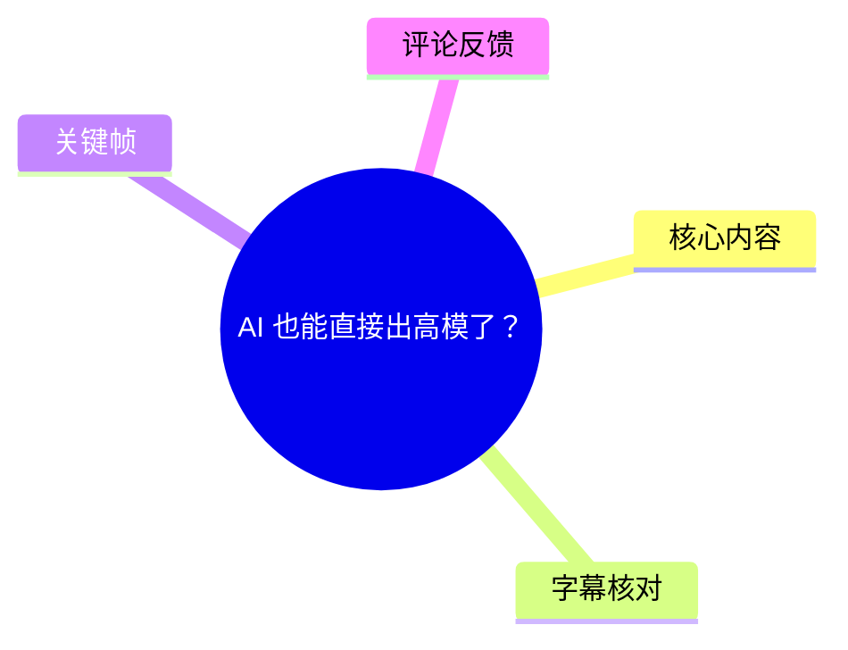
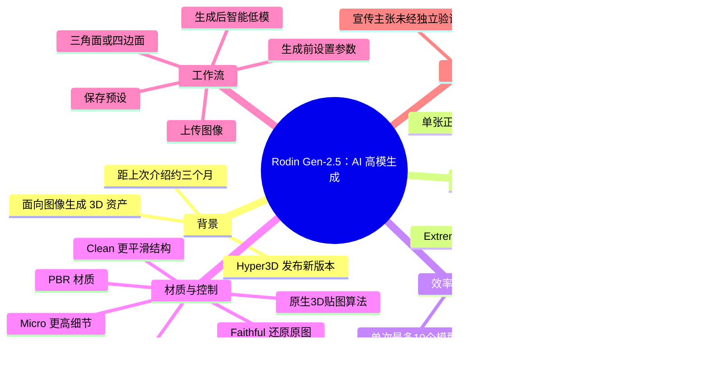
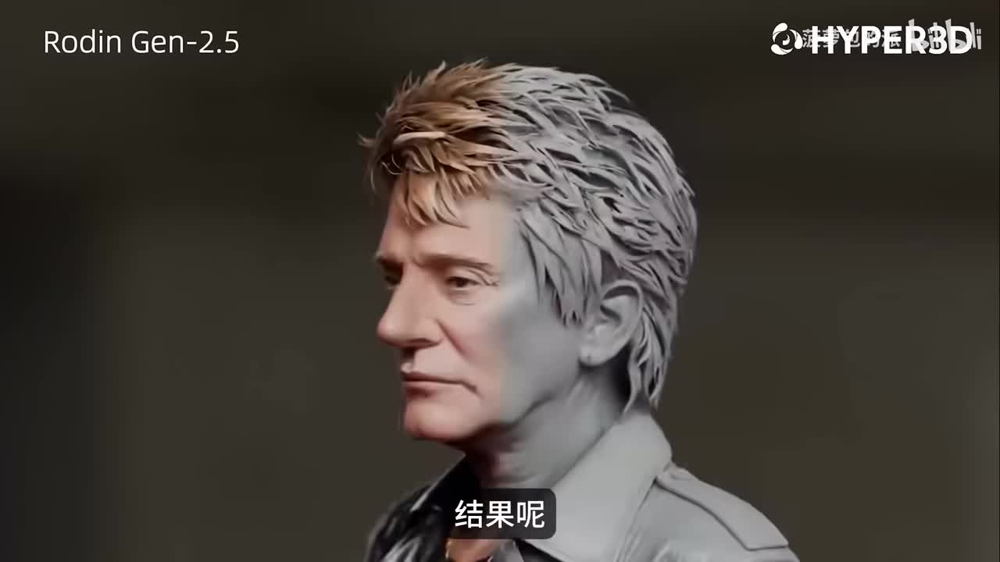
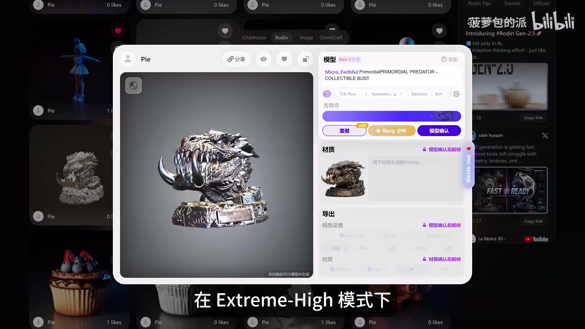
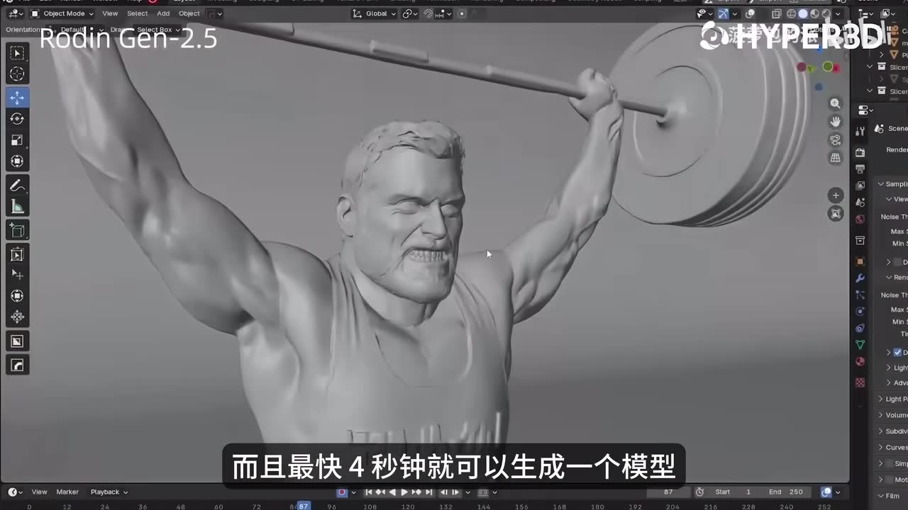
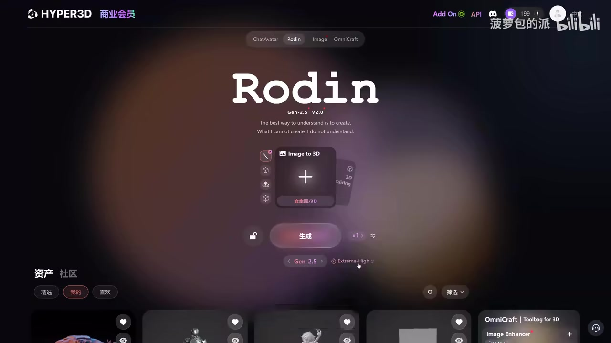

# AI 也能直接出高模了？

> 来源：[Bilibili 视频](https://www.bilibili.com/video/BV1YWVN6uEsV) 
> UP 主：菠萝包的派｜时长：2 分 46 秒｜分辨率：3840×2160 
> 标签：AI、3D、Rodin、Hyper3D、渲染、Blender、3D 渲染

## 小结

视频介绍了 Hyper3D 发布的 **Rodin Gen-2.5**（站内字幕写作“RODIN 真 2.5”）图像生成 3D 模型能力。UP 主称其核心升级是可生成“千万级面数”资产，并将其定位为能够用于数字雕刻的高模来源；这一“全球最强”“全球首款”等表述属于视频及产品侧主张，素材中没有提供独立测评或官方规格页，不能据此扩展为已独立验证的行业结论。

视频给出三个主要效率参数：**Extreme Low** 模式最快约 **4 秒**生成 Low Poly 初稿；**High** 模式约 **40 秒**生成结构、层次较丰富的模型；单次最多可并行运行 **10 个模型**。这些速度均应理解为视频所述的工具表现，实际耗时仍可能受输入、队列、账户方案、网络和服务版本影响。

在质量与材质方面，视频以龙雕像为例，称 **Extreme High** 可呈现较清晰的鳞片与皮肤肌理；模型还能从单张正面图补全背面结构与贴图。其技术解释为“原生 3D 贴图算法”，用于改善复杂结构、转折处的贴图拉伸，并支持 PBR 材质。视频展示了结果，但没有提供网格统计、贴图分辨率、UV 展开质量或导出后的完整生产验证，因此应将其视作演示能力而非质量保证。

实际工作流强调在上传图像时预先设定参数：需要贴近原图时选 **Faithful**，希望模型调整并优化轮廓时选 **Creative**；Extreme High 下还可在 **Micro**（更高细节）和 **Clean**（更平滑结构）之间选择。常用组合可以保存为预设，以减少重复设置。

视频还提到生成完成后可使用“智能低模模式”优化拓扑，支持三角面与四边面。它解决的是“从高模生成到可进一步使用”的一环，但不等于自动完成全部生产流程：拓扑是否适合绑定、UV 是否可用、烘焙结果、面数控制、规范命名和项目验收等，仍需在具体管线中检查。热评也集中指出，高模细化可能被自动化，但拓扑、UV、烘焙与性能优化仍是关键人工环节。

本视频具有明显时效性：内容围绕 2026 年 5 月发布时的 Rodin Gen-2.5 界面、模式与优惠信息展开。产品模型、参数名称、并发额度、价格与置顶评论优惠券均可能变更；观看者应以使用当日 Hyper3D 的实际页面、服务条款与套餐说明为准。

## 思维导图

## 目录

- [发布背景与核心主张](#发布背景与核心主张-0000)
- [高模细节与速度档位](#高模细节与速度档位-0028)
- [单图补全、贴图与 PBR 材质](#单图补全贴图与-pbr-材质-0108)
- [控制参数与预设工作流](#控制参数与预设工作流-0132)
- [智能低模与生产可用性](#智能低模与生产可用性-0206)
- [结论、限制与时效性](#结论限制与时效性-0220)
- [字幕比对](#字幕比对)
- [评论分析](#评论分析)
- [处理记录](#处理记录)

## [发布背景与核心主张 [00:00]](https://www.bilibili.com/video/BV1YWVN6uEsV?t=0)

视频开场称，距离上一次介绍 Rodin 仅过去约三个月，Hyper3D 又发布了 Rodin Gen-2.5。站内字幕将产品写作“RODIN 真 2.5”，而画面中的英文标题为 **Rodin Gen-2.5**，本文统一采用后者。

UP 主在 00:10—00:19 提出两项关键宣传主张：

1. Rodin Gen-2.5 是“全球最强的 3D 生成模型”；
2. 它是“全球首款实现千万级面数的 3D 生成模型”。

这两项均是视频陈述，素材未附测试基准、竞品对比口径或官方技术白皮书，因而不能据此判定其行业排名或“首款”身份。对使用者更可操作的信息是：视频将其目标能力定位为生成细节密度更高、可作为数字雕刻基础的 3D 资产。

> 图：画面左上角标注“Rodin Gen-2.5”，展示人物头部模型的形体、发型和面部细节。这张关键帧用于确认视频讨论的具体产品版本，并直观呈现其以高细节角色/雕塑模型为目标的示例方向。

## [高模细节与速度档位 [00:28]](https://www.bilibili.com/video/BV1YWVN6uEsV?t=28)

### Extreme High：面向高细节雕刻资产

从 [00:28](https://www.bilibili.com/video/BV1YWVN6uEsV?t=28) 起，UP 主以龙雕像为例说明 Extreme High 模式的表现：复杂鳞片与皮肤肌理更清晰，较少出现旧式 AI 3D 结果中“细节糊成一团”的塑料感。其结论是，千万级面数资产“可以当作数字雕刻的高模来用”。

这里要区分三个层次：

- **视频展示事实**：画面出现高细节生物/雕像类资产，且强调表面纹理与起伏。
- **视频作者判断**：该质量可作为数字雕刻高模使用。
- **仍待项目验证的部分**：面数是否稳定达到千万级、局部是否存在伪细节或破面、网格连续性、法线质量、导出文件大小、Blender/ZBrush 等软件的实际编辑性能。

> 图：该帧展示 Hyper3D 的模型预览窗口，中央为复杂怪兽雕像，并可见“Extreme-High”字幕。它将视频的“高细节模式”与实际界面及样例结果对应起来，但不能单凭截图验证实际面数或可编辑性。

### 速度与并行数量

视频随后给出不同需求对应的速度档位：

| 需求 | 模式/设置 | 视频所述耗时或能力 | 适用含义 |
| --- | --- | ---: | --- |
| 快速验证初稿 | Extreme Low | 最快约 4 秒 | 生成 Low Poly 模型，用于快速过方案 |
| 追求较高品质 | High | 约 40 秒 | 获得结构与层次更丰富的模型 |
| 高细节雕刻方向 | Extreme High | 未给出明确耗时 | 用于呈现更细的表面细节 |
| 同时比较方案 | 批量生成 | 单次最多 10 个模型 | 减少逐个等待，便于并行对比 |

视频没有给出 Extreme High 的具体生成时间，也没有说明 4 秒和 40 秒的测试输入、硬件/服务端条件、是否包含排队及下载时间。因此这些数字适合作为版本宣传中的参考量级，而非生产排期的固定承诺。

> 图：关键帧显示 Blender 界面里的举杠铃人物模型，并配有“最快 4 秒钟就可以生成一个模型”字幕。它的价值在于将速度宣传与可导入 DCC 软件查看的模型画面并置；但画面没有展示完整导出设置、面数或拓扑检查结果。

## [单图补全、贴图与 PBR 材质 [01:08]](https://www.bilibili.com/video/BV1YWVN6uEsV?t=68)

视频称，即使用户仅提供一张正面图，Rodin Gen-2.5 也能自动补齐背面结构和贴图。对于概念设计转 3D、商品快速打样或批量方案比较，这减少了多视图准备成本；但同时意味着不可见部分由模型推断，不能默认符合真实结构、机械装配关系或特定 IP 设定。涉及准确复刻时，仍应提供更多视角参考并人工复核背面。

UP 主将背面补全和贴图质量归因于“全新升级的原生 3D 贴图算法”，并称该算法解决了旧版 AI 贴图在复杂结构及转折处容易拉伸的问题，达到材质纹理“无死角覆盖”。视频还表示产品原生支持 **PBR（Physically Based Rendering，基于物理的渲染）材质**，因此表现力优于很多同类产品。

从素材可确认的是视频作出了上述功能说明；未能从素材确认的包括：

- PBR 输出含有哪些具体通道，例如 Base Color、Normal、Roughness、Metallic、AO；
- 贴图分辨率、UDIM 支持、UV 岛分布与接缝处理；
- 背面补全在角色服装、硬表面机械、透明物体或高度对称物体上的稳定性；
- “无死角覆盖”是否适用于所有输入和所有导出格式。

因此，合理的验证方法是：针对目标资产分别检查正反面、凹槽、尖角、关节和材质边界，并在目标渲染器中检查法线、拉伸和接缝。

## [控制参数与预设工作流 [01:32]](https://www.bilibili.com/video/BV1YWVN6uEsV?t=92)

### 参数的功能分工

视频说明 Gen-2.5 增加了更细的控制选项，具体含义如下：

| 参数 | 视频中的作用 | 选择建议 |
| --- | --- | --- |
| Faithful | 尽量老实还原原图 | 参考图轮廓、比例、设计元素必须尽量保留时使用 |
| Creative | AI 优化结构，使轮廓更圆润 | 接受模型进行形体再解释、希望改善轮廓时使用 |
| Micro | Extreme High 下提供更高细节 | 优先观察微小纹理、雕刻感时使用 |
| Clean | Extreme High 下提供更平滑的结构 | 希望减少表面噪声、获得相对干净形体时使用 |

Faithful 与 Creative 代表“还原程度—自动优化程度”的取舍；Micro 与 Clean 则是“微细节—平滑结构”的取舍。视频未解释这些选项能否叠加、各自是否影响面数/计费/时长，实际使用时需以产品界面为准。

### 视频所示操作顺序

1. 进入 Rodin 的图像转 3D 页面。
2. 上传输入图片。
3. **在上传图片阶段**设置生成模式及相关参数，而不是生成后再修改。
4. 依据目标在 Faithful/Creative 与 Micro/Clean 等选项间取舍。
5. 执行生成；若要比较方案，可利用最多同时运行 10 个模型的能力。
6. 将高频参数组合保存为预设。
7. 后续项目直接调用预设，减少重复配置。
8. 模型生成完成后，再进入智能低模/拓扑优化环节。

> 图：画面可见 Rodin Gen-2.5 首页、“Image to 3D”入口、“生成”按钮以及下方模式区域。这张关键帧用于说明视频的操作起点：用户先进入图像转 3D 流程，再在生成前完成相关设置。

视频特别肯定“参数可在上传图片时直接设定”和“可存为预设”这两个交互设计。对团队工作而言，预设的实际价值在于统一测试口径：例如为“概念草稿”“贴近原画”“高细节展示”“待低模优化”等用途建立不同预设，避免同一批资产因参数不一致而难以横向比较。

## [智能低模与生产可用性 [02:06]](https://www.bilibili.com/video/BV1YWVN6uEsV?t=126)

视频称模型生成完成后可使用“智能低模模式”，该功能能依据不同美术风格优化拓扑，并支持：

- **三角面（Triangles）**
- **四边面（Quads）**

UP 主认为，这使 AI 生成资产不再只是“乱七八糟的碎面”，而开始具备生产力。这个判断的积极意义是：视频已将讨论从单纯的高模观赏性，推进到网格组织和后续制作可用性。

不过，“支持三角面/四边面”不自动等于“全部生产环节可直接交付”。在实际游戏、动画、影视或 3D 打印流程中，至少仍要检查：

| 检查项 | 为什么重要 |
| --- | --- |
| 面数与密度分布 | 决定实时性能、烘焙效率与编辑负担；不应只看总面数 |
| 四边面流线 | 角色绑定、表情、布料变形等场景尤其依赖合理环线 |
| 三角面方向与长条面 | 影响实时渲染、变形和法线表现 |
| UV 展开与接缝 | 决定贴图绘制、烘焙及材质维护成本 |
| 高低模对应关系 | 烘焙法线、AO 等贴图时必须检查投射错误 |
| 非流形、穿插与薄壁 | 影响布尔、3D 打印、物理仿真和后续编辑 |
| 版权与输入素材权利 | AI 生成不消除用户对参考图、角色设定和商用授权的责任 |

因此，更稳妥的定位是：Rodin Gen-2.5 可用于加速概念到高模、提供初始资产或辅助方案探索；是否成为最终生产资产，要经由目标项目的拓扑、UV、烘焙、性能和法务验收。

## [结论、限制与时效性 [02:20]](https://www.bilibili.com/video/BV1YWVN6uEsV?t=140)

视频最终将产品进展归因于 Hyper3D 的“原生 3D 底层架构”，认为它同时推进了结构质量、生成速度与控制权，并认为高精度 3D 生成的生产力前景正在扩大。

可迁移的工作方法不是将 AI 输出视作终稿，而是把它嵌入分层流程：

1. 用 Extreme Low 快速批量试错、筛选构图和形体方向；
2. 对入选方案使用 High 或 Extreme High 获取更高质量基础；
3. 用 Faithful/Creative 控制对参考图的服从程度；
4. 在生成前保存可复用预设，保证同类资产的一致性；
5. 对单图生成的背面、隐蔽结构和材质转折进行人工检查；
6. 使用智能低模作为拓扑起点，但在 DCC/引擎中完成 UV、烘焙、性能及变形验证；
7. 在商业项目中另行确认输入图权利、平台许可和最终资产归属。

视频末尾提到 Hyper3D 官方在置顶评论提供专属优惠券。素材没有提供优惠券代码、适用套餐、有效期或使用限制，且该信息极易失效；本文不记录为可长期复用的优惠条件。产品模式、价格、并行额度和 UI 均可能在发布后变化，应以访问当日服务页面为准。

## 字幕比对

| 字幕来源 | 完整性 | 专有名词 | 时间轴 | 主要问题 |
| --- | --- | --- | --- | --- |
| Bilibili 站内字幕 | 完整，覆盖 00:00.460—02:44.800，分段细 | 较可靠：Hyper3D、RODIN、PBR、Faithful、Creative、Micro、Clean 等均较准确；“真 2.5”需结合画面校为 Gen-2.5 | 精细，可直接作为章节锚点依据 | 个别英文词中文化；“PBR”被写作“pp r”；“Hybrid3 d”应为 Hyper3D |
| 本次 ASR 字幕 | 覆盖高，诊断显示语音覆盖约 98.99%，覆盖 00:00.270—02:44.430 | 多处误识别：AI“进化”识别为“切换”；Rodin/Rodan、Gen-2.5、贴图、拓扑、资产等错误较多 | 有真实时间戳，但每段约 24 秒，粒度较粗 | 同音替换和专有名词错误明显，例如“江湖”应为“浆糊”、“托普”应为“拓扑”、“AR”应为“AI” |

### 最终字幕选择与校正

本次 ASR 已实际检查：语言为中文，识别模型为 `medium`，CUDA `float16` 推理；诊断未标记 `noAudioStream=true`，且音频语音覆盖率为 98.99%，说明源视频存在音轨并已被有效识别。

正文优先采用**站内 SRT** 的细粒度起止时间作为时间轴依据，并以本次 ASR 交叉确认语音覆盖和段落顺序。结合关键帧画面校正的重点词语如下：

- 画面标题显示 **Rodin Gen-2.5**：校正站内字幕“RODIN 真 2.5”及 ASR 的“Rodan Gen2.5 / Gen2.五”。
- 产品名称为 **Hyper3D**：校正站内字幕末段的“Hybrid3 d”及 ASR 中的拆分写法。
- “AI 进化速度”不能采用 ASR 的“AI 切换速度”。
- “一团浆糊”不能采用 ASR 的“一团江湖”。
- “原生 3D 贴图算法”“拓扑结构”“AI 生成的模型”不能采用 ASR 的“贴涂/贴徒”“托普”“AR”等误识别。
- “PBR 材质”采用常用技术缩写；站内字幕“物理的 pp r 材质”为分词/大小写问题。

## 评论分析

以下仅分析当前可获取的热评前三条；评论反映用户体验、预期或担忧，不构成对产品能力的验证。

1. **黑桃棋陶冶（18 赞）**  
   评论认为，AI 替代了建模中较有趣的高模与细化部分，却把“枯燥乏味”的拓扑、UV、烘焙和优化留给人工。  
   - **补充价值**：指出视频“高模生成”和“智能低模”之外仍存在完整资产管线，尤其强调 UV、烘焙与优化没有在视频中被展开。  
   - **可信度与边界**：这是对职业流程的主观看法，并未提供 Rodin Gen-2.5 实测案例；但与视频未展示 UV、烘焙和引擎验收的事实相吻合。

2. **奶酪大怪兽（2 赞）**  
   评论称“免费就好了”。  
   - **补充价值**：反映用户对工具价格与可及性的关注。  
   - **可信度与边界**：评论未提供定价、套餐或优惠细节。视频只提及置顶评论优惠券，未说明具体金额和有效期，因此不能据此推导当前费用或免费策略。

3. **墨染知白（2 赞）**  
   评论担心客户观看 AI 演示后，会将原本约 10 人日的工作压缩为 2 人日甚至更少。  
   - **补充价值**：提示 AI 演示效果可能改变客户对工期的预期，影响报价与项目管理。  
   - **可信度与边界**：属于对商业沟通风险的判断，不是产品性能数据。实践中应把“生成时间”与“资产验收时间”拆分报价，明确包含参考整理、生成迭代、拓扑/UV、烘焙、材质、导入、修复和审稿轮次。

## 处理记录

- **Worker ID**：`worker-mrj0wjed-b0c290ad`
- **模型**：`gpt-5.6-terra`
- **调用工具与素材**：任务提供的 Bilibili 元数据、站内字幕 `p01-ai-zh.srt`、本次 ASR 输出 `asr/transcript.srt` 与 `asr/asr-result.json`、热评数据、关键帧目录 `frames/`。
- **ASR 检查结果**：本次 ASR 使用 `medium` 模型，中文识别概率 `0.9990234375`，音频时长 `165.8369375` 秒，语音覆盖率 `0.9899`；未出现 `noAudioStream=true`，因此未将音轨问题归因于工具失败。
- **字幕选择**：以站内 SRT 为主，因为其分段更细、专有名词准确度更高；以本次 ASR 核实音频存在、语音覆盖与内容顺序，并对 ASR 的同音和专有名词误识别进行校正。
- **时间轴依据**：各正文时间轴均依据站内 SRT 的真实起止时间换算为秒数，而非按文字顺序推测；章节锚点分别采用 0、28、68、92、126、140 秒。
- **关键帧选择依据**：选用 `frame-001.jpg` 确认 Rodin Gen-2.5 版本与高细节人物样例；`frame-002.jpg` 对应 Blender 中模型与“4 秒”速度主张；`frame-003.jpg` 对应 Extreme High 怪兽雕像示例；`frame-004.jpg` 对应 Image to 3D 入口和生成界面。其余关键帧未在所给画面材料中提供可核验描述，未强行引用。
- **缓存清理**：未提供可执行的缓存清理日志或结果；本文不编造清理完成状态。
- **未解决问题**：素材未提供官方规格页、套餐与价格、优惠券内容、导出格式、实际面数统计、贴图通道、UV/烘焙结果、不同输入条件下的稳定性，以及智能低模的具体算法和质量基准。
