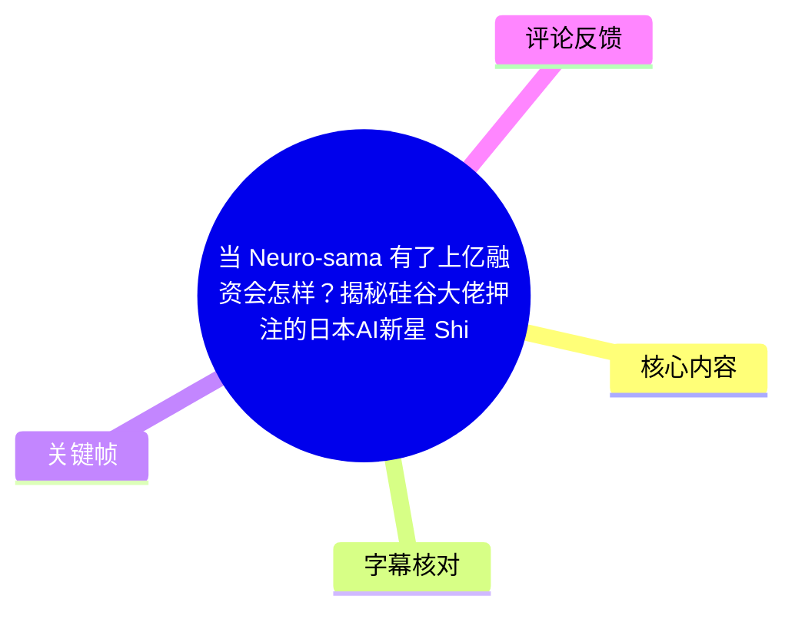
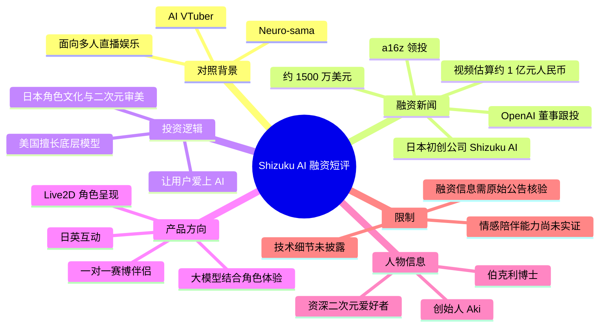
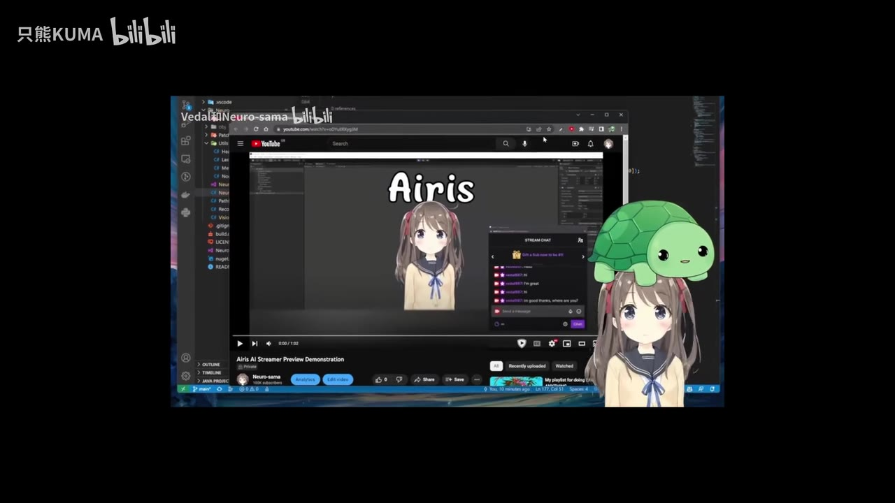
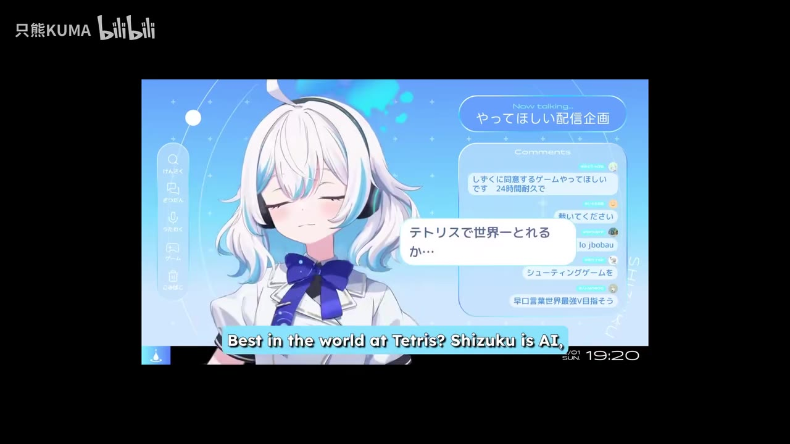
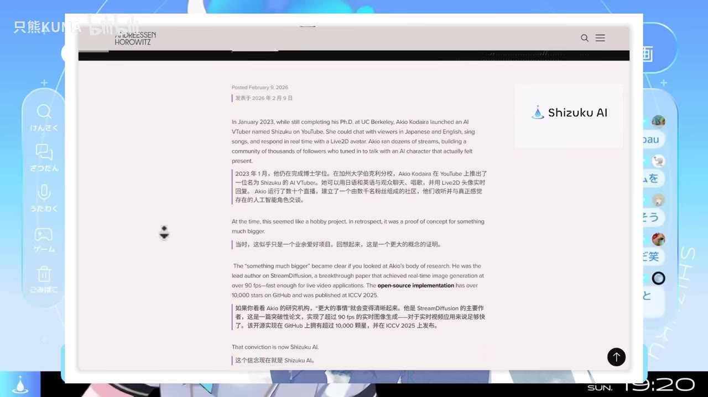
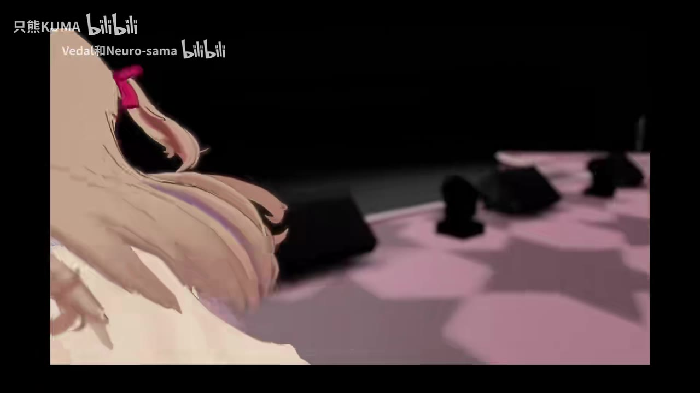

# 当 Neuro-sama 有了上亿融资会怎样？揭秘硅谷大佬押注的日本AI新星 Shizuku！

> 来源：[Bilibili 视频](https://www.bilibili.com/video/BV1ZgcbzwEku)  
> UP 主：只熊KUMA｜时长：1 分 55 秒｜分辨率：1920×1080  
> 视频定位：围绕日本 AI 虚拟角色项目 **Shizuku AI** 获融资的新闻短评，并以 Neuro-sama 作为对照案例。

## 小结

视频讨论的核心新闻是：据 UP 主转述，硅谷风投 **a16z** 领投日本初创公司 **Shizuku AI**，融资约 **1,500 万美元**，视频按当时汇率口径估算为约 **1 亿元人民币**；UP 主同时称，OpenAI 的一位董事参与了本轮跟投。该信息是视频中的新闻陈述，本文不将其自动视为已完成独立核验的公告事实。

UP 主用 Neuro-sama 说明现有 AI VTuber 的一种典型形态：由 Vedal（视频中称“龟龟”）开发、面向直播观众进行大规模娱乐互动。与之相比，视频将 Shizuku AI 的目标概括为更强调**一对一体验的“赛博伴侣”**，即以日本二次元审美、角色呈现和大模型能力共同构成产品差异。

视频对 a16z 投资逻辑的归纳是：美国在底层模型方面占优，而日本在“让人类爱上 AI”、角色文化与二次元审美上具有优势。这里应注意，这是 UP 主对投资逻辑的转述与解释，不等同于本文能从素材中验证的完整投资备忘录。

从技术角度看，视频只明确提到“最硬核的大模型技术”“Live2D 头像实时回应”等方向，没有披露模型名称、参数规模、训练数据、推理延迟、记忆机制、语音系统或商业化数据。因此，不能据此推断 Shizuku 已具备稳定情感陪伴、长期记忆或高拟人自治能力。

这是一则强时效性融资新闻。视频使用“就在昨天”的相对时间表述；结合元数据发布时间为 2026-02-11，画面中 a16z 页面日期为 2026-02-09，可将其理解为视频发布前后的新闻节点，但融资状态、产品能力与投资参与方均可能后续变化。

适合关注 AI 陪伴、AI VTuber、虚拟角色产品、二次元内容产业与风险投资动向的读者。若需要作投资判断或产品选型，应进一步查阅 a16z、Shizuku AI 及相关投资方的原始公告，而不能仅依据本视频。

## 思维导图

## 目录

- [背景：从 Neuro-sama 提问](#背景从-neuro-sama-提问)
- [融资新闻：a16z 领投 Shizuku AI](#融资新闻a16z-领投-shizuku-ai)
- [投资逻辑：模型能力与角色体验](#投资逻辑模型能力与角色体验)
- [产品定位：从多人直播到一对一伴侣](#产品定位从多人直播到一对一伴侣)
- [团队与愿景：技术背景并不等于产品成熟](#团队与愿景技术背景并不等于产品成熟)
- [可迁移的产品观察框架](#可迁移的产品观察框架)
- [结论、限制与时效性](#结论限制与时效性)
- [字幕比对](#字幕比对)
- [评论分析](#评论分析)
- [关键帧索引](#关键帧索引)
- [处理记录](#处理记录)

## 背景：从 Neuro-sama 提问 [00:00](https://www.bilibili.com/video/BV1ZgcbzwEku?t=0)

视频开头先播放 Neuro-sama 相关画面和英语片段，随后提出一个假设：如果 Neuro-sama 这类模式背后获得硅谷顶级资本、并拥有上亿元量级融资，会发展成什么样。

站内字幕在 00:00:05 起将 Neuro-sama 描述为由 Vedal（视频口语称“龟龟”）在地下室开发的“AI 女儿”，并称其已是 AI VTuber 的标杆。这里的“天花板”属于视频评价，而不是可量化的行业排名。

视频建立的对照关系如下：

| 维度 | Neuro-sama（视频中的描述） | Shizuku AI（视频中的设想/定位） |
| --- | --- | --- |
| 核心场景 | 在大屏幕上娱乐大量观众 | 面向个人的一对一陪伴 |
| 内容形态 | AI VTuber、直播互动 | 二次元角色化 AI 伴侣 |
| 叙事重点 | 独立开发者创造的项目 | 获顶级资本支持的创业公司 |
| 视频关注点 | 已有影响力的参照物 | 融资后能否扩大产品能力与体验 |

> 图：画面将编辑器、YouTube 页面、角色形象和直播聊天窗口并置，直观呈现视频用 Neuro-sama 代表的“AI 角色 + 直播互动”形态。它用于理解本片为何以 Neuro-sama 作为 Shizuku AI 的比较起点；画面本身不证明任何融资或技术指标。

## 融资新闻：a16z 领投 Shizuku AI [00:28](https://www.bilibili.com/video/BV1ZgcbzwEku?t=28)

站内字幕在 00:00:28.110—00:00:39.660 给出本片最关键的新闻信息：

1. UP 主称，a16z 宣布领投一家日本初创公司；
2. 公司名称在视频语音和站内字幕中被转写为“始祖库 AI”，结合标题及画面品牌，应记为 **Shizuku AI**；
3. 融资额约为 **1,500 万美元**；
4. UP 主换算为“差不多一个亿”人民币；
5. 视频称这也是 a16z “历史上第一次作为领投方正式进入日本市场”。

这里有三层需要区分：

- **金额**：1,500 万美元是视频明确提供的融资参数。
- **人民币换算**：“约 1 亿元”是视频采用的粗略换算，汇率随时间变化，不宜作为精确金额。
- **历史首次**：a16z 首次以领投方进入日本市场是视频的明确陈述，但素材中未提供原始公告或历史交易清单，需在外部研究时另行核验。

> 图：画面展示名为 Shizuku 的二次元角色、对话气泡、评论区和“Shizuku is AI”的英语字幕。这一关键帧使“融资的是角色化 AI 产品而非纯底层模型公司”的视频叙事更具体，也能辅助校正站内字幕中对公司名的误识别。

### 新闻时点与可验证边界 [00:29](https://www.bilibili.com/video/BV1ZgcbzwEku?t=29)

视频使用“就在昨天”描述融资公布时间。元数据标示视频发布于 2026-02-11，而关键帧中的 a16z 页面可见发布日期为 2026-02-09；两者在时间上与“近日公布”的表述大体一致。

但素材未提供以下内容，因此不能补写：

- 融资轮次名称；
- 全部投资方名单；
- 投前/投后估值；
- 融资资金用途与预算分配；
- 公司营收、用户规模、留存或付费数据；
- 本轮融资的正式法律交割状态。

## 投资逻辑：模型能力与角色体验 [00:56](https://www.bilibili.com/video/BV1ZgcbzwEku?t=56)

在 00:00:56.030—00:01:06.260，UP 主概括其看到的投资逻辑：美国擅长做底层模型，而日本在“如何让人类爱上 AI”方面具有“护城河”。这一观点可拆为两种不同能力：

1. **模型层能力**：语言理解、生成、推理、语音或多模态等底层 AI 能力。
2. **体验层能力**：角色设计、审美、表达方式、情绪传达、互动节奏与用户对角色的情感投射。

视频认为 Shizuku AI 的机会不只是把模型接入一个二次元立绘，而是让技术能力与日本二次元审美融合。这个判断指向 AI 陪伴产品的一个常见挑战：用户是否愿意持续使用，不只取决于模型能否回答问题，也取决于角色是否具有一致、自然且能被感知的“人格体验”。

> 视频没有展示模型架构、提示词系统、记忆系统、角色设定约束、审核机制或评测结果。因此，“日本审美 + 大模型”的说法应理解为产品方向，不能直接等同于已被技术或市场验证的竞争壁垒。

### Character.AI 对照的含义 [00:47](https://www.bilibili.com/video/BV1ZgcbzwEku?t=47)

视频以美国的 Character.AI 为例，提出“美国已有此类独角兽，为何还要投日本项目”的问题。其给出的答案不是模型性能对比，而是区域文化与角色体验的差异化。

这一段的有效信息是：视频将 Shizuku AI 置于全球 AI 角色/陪伴赛道中理解，而非只视作传统 VTuber 项目。需要避免的延伸是：素材没有提供 Shizuku AI 与 Character.AI 的用户规模、收入、模型效果或合规能力对比，因此不能得出其将超越后者的结论。

## 产品定位：从多人直播到一对一伴侣 [01:07](https://www.bilibili.com/video/BV1ZgcbzwEku?t=67)

00:01:07.300—00:01:21.300 是视频最明确的产品定位段落。UP 主将两者区分为：

- **Neuro-sama**：主要在大屏幕上娱乐成千上万名观众；
- **Shizuku AI**：希望做“一对一的、极致的赛博伴侣”。

这意味着视频设想的重点从公共直播场景转向私密、持续、以单个用户为中心的互动场景。对于此类产品，理论上需要解决的不只是生成回复，还包括：

| 产品环节 | 视频是否给出实现方案 | 可从视频确认的内容 |
| --- | --- | --- |
| 角色视觉呈现 | 部分给出 | 画面显示二次元角色与 Live2D 形态 |
| 语言互动 | 部分给出 | 画面中的文章称其可使用日语和英语与观众聊天 |
| 实时响应 | 部分给出 | 画面文章提到 Live2D 头像实时回应 |
| 长期记忆 | 未给出 | 未披露 |
| 情绪建模/关系演进 | 未给出 | 未披露 |
| 语音合成方案 | 未给出 | 未披露 |
| 内容安全与年龄保护 | 未给出 | 未披露 |
| 商业化机制 | 未给出 | 未披露 |

> 图：前景是 Shizuku 角色和评论/对话区域，叠加展示 a16z 网页。这张图同时连接“产品形态”和“融资新闻”两条线索，说明本片讨论的是具备虚拟角色界面的 AI 产品，但不能据此推断其完整功能清单或正式上线状态。

### 与“银翼杀手 Joy”“Her 萨曼莎”的距离 [01:37](https://www.bilibili.com/video/BV1ZgcbzwEku?t=97)

结尾中，UP 主将高融资的二次元 AI 伴侣与《银翼杀手 2049》中的 Joi、电影《Her》中的萨曼莎作类比，并表示“可能真的意味着……只差最后一步”。这是一种面向未来的修辞和乐观判断，而不是技术路线已经完成的证据。

现实产品距离电影式 AI 伴侣仍至少存在这些素材未回答的问题：

- 角色是否具备稳定的长期记忆和跨情境一致性；
- 对话是否有足够低的延迟与高可用性；
- 角色表达、声音、表情和语言模型是否协调；
- 是否能处理情感依赖、隐私、未成年人保护与有害内容风险；
- 产品能否在成本可控的前提下持续运营。

## 团队与愿景：技术背景并不等于产品成熟 [01:21](https://www.bilibili.com/video/BV1ZgcbzwEku?t=81)

视频称创始人 Aki 是伯克利博士，同时也是资深二次元爱好者；其叙事重点在于：既理解前沿技术，又理解目标用户文化的人，获得资本后可能更有机会将技术转化为角色产品。

关键帧中出现的 a16z 文章页面还展示了有关创始人和 Shizuku 项目的介绍。画面可见其提到：项目早期于 YouTube 以 AI VTuber 形式活动、可进行日语和英语聊天、唱歌，并通过 Live2D 头像实时回应。由于这些文字出现在视频画面中，可作为本片引用的背景材料；但画面分辨率与视频时长均有限，本文不从中扩展未清晰展示的技术指标。

> 图：网页画面可见 “Shizuku AI” 标识及项目介绍段落，是校正名称、确认视频引用来源类型的重要视觉依据。其价值在于为“项目并非仅由 UP 主口述提出”提供画面线索；但仍不替代访问原页面进行逐条核验。

## 可迁移的产品观察框架 [01:12](https://www.bilibili.com/video/BV1ZgcbzwEku?t=72)

本视频并非操作教程，没有命令、代码、部署步骤或可复现实验参数。不过，它提供了一个可用于观察 AI 角色产品的分析顺序。

### 1. 先分清互动规模

- **多人直播型**：重点是节目效果、即时反应、梗文化、聊天室互动与可传播性。
- **一对一陪伴型**：重点是角色一致性、持续关系、个人偏好、隐私与长期留存。

视频把 Neuro-sama 与 Shizuku 放在两端对照，提示不要只用“都是 AI VTuber”来理解产品。

### 2. 再拆开技术能力和体验能力

模型能回答问题，不代表用户会对角色建立情感联系；角色形象精美，也不代表其对话有足够的可信度和稳定性。视频的“模型 + 二次元审美”表述，本质上就是在强调两者需要共同成立。

### 3. 用公开证据核验融资叙事

面对“获得巨额融资”“顶级机构领投”这类说法，应优先检查：

1. 投资机构官网公告；
2. 公司官方新闻稿与融资轮次信息；
3. 投资方、创始人或公司账户的原始声明；
4. 产品公开演示是否与宣传能力一致；
5. 是否披露用户、留存、成本和安全机制。

视频本身只适合作为新闻线索，不能替代上述验证流程。

### 4. 不将融资额直接等同于产品能力

1,500 万美元融资反映投资方对团队和赛道的预期，但不自动证明：

- 模型更强；
- 角色更具情感；
- 产品已大规模可用；
- 商业模式已经成立；
- 用户体验必然优于独立开发的 AI VTuber。

融资是资源和预期，产品表现仍需通过公开演示、用户反馈及长期运营结果检验。

## 结论、限制与时效性 [01:37](https://www.bilibili.com/video/BV1ZgcbzwEku?t=97)

视频最有价值的不是预测 Shizuku AI 必然成功，而是提出了一个值得跟踪的赛道变化：当 AI VTuber/虚拟角色不再只是直播娱乐形式，而开始获得大型风投对“一对一 AI 伴侣”方向的支持时，技术、内容制作与角色文化可能进一步融合。

可以确认的素材层结论是：视频围绕 Shizuku AI 融资新闻，将其定位为日本二次元审美与大模型结合的 AI 伴侣项目，并以 Neuro-sama 作为直播型 AI 角色的参照。

应保留的限制包括：

- 融资事件、a16z 的历史首次性质及 OpenAI 董事跟投，均主要来自视频转述，本文未持有完整原始公告文本；
- 视频没有提供模型架构、模型参数、成本、准确率、响应延迟或安全方案；
- “极致赛博伴侣”“距离 Joi/萨曼莎只差最后一步”等均为愿景性表达；
- AI 陪伴产品的真实难点——人格一致性、长期记忆、情感边界、隐私与内容安全——没有在视频中展开；
- 新闻发生时间紧贴视频发布期，融资状态、投资方、产品能力及市场评价都具有明显时效性。

## 字幕比对

| 字幕来源 | 完整性 | 专有名词 | 时间轴 | 主要问题 |
| --- | --- | --- | --- | --- |
| Bilibili 站内字幕 | 高，覆盖 00:00:00.040—00:01:54.240 的主要口播与结尾英语 | 一般；将 Shizuku 转写为“始祖库/十足股”等，Neuro-sama 也有大小写和分词问题 | 高；分段细，可直接定位 | 开头和结尾含英语原句；中文音译不稳定，个别词语如“VIDO”疑为 Vedal 的误识别 |
| 本次 ASR（large-v3-turbo） | 中等；诊断为 84.24 秒语音、覆盖率 73.65%，且 00:00:05.320—00:00:30.300 出现约 24.98 秒大缺口 | 较差；出现“始祗库”“A16”“技�us”“影翼杀手”等乱码或误识别 | 有时间戳，但单段过长且与站内字幕相比漏掉大量口播 | 对连续中文长句合并严重；遗漏 5—30 秒的关键背景段；结尾英文截断 |

### 最终字幕选择

正文以**站内 SRT**作为主时间轴依据，原因是其覆盖完整、分段更细，且其 `HH:MM:SS,mmm --> HH:MM:SS,mmm` 时间戳可直接换算为链接秒数；本次 ASR 已完成检查，并用于交叉确认 00:00、00:30 之后的主要语音内容。

本次 ASR 诊断中**没有** `noAudioStream=true` 标记，且已识别出音频内容，因此不能将其缺段视为“视频没有音轨”。其主要问题是识别覆盖不完整和专名误识别，而非音轨缺失。

经标题、画面品牌文字、站内字幕上下文与 ASR 对照后，作如下规范化：

| 原始转写 | 正文采用写法 | 校正依据 |
| --- | --- | --- |
| 始祖库 AI、十足股、始祗库 | Shizuku AI | 视频标题、关键帧中的 “Shizuku AI” 品牌文字 |
| 牛肉 SAMA、NEUROSAMA | Neuro-sama | 视频标题标签与开头画面语境 |
| VIDO | Vedal | 站内字幕语境将其描述为 Neuro-sama 的开发者；该处为谨慎规范化 |
| 影翼杀手 | 《银翼杀手 2049》中的 Joi | 站内字幕“银翼杀手里的那个 joy”与影视作品常用译名 |

## 评论分析

以下仅处理可获取的热评前三条。评论是用户观点或个人观察，不作为已验证事实。

### 1. 纯洁的云云（197 赞）

> “1500w刀的融资还是给一个刚起步的初创企业……那牛肉的估值起码比这个数多得多……”

- **观点概括**：评论者认为，Shizuku AI 获得 1,500 万美元融资，说明类似 Neuro-sama 的项目可能具有更高的潜在估值。
- **补充信息**：其提到 Vedal 曾说有企业尝试以“七位数美刀”估值收购 Discord 群，但未成交。
- **可信度与边界**：这是对估值的推测，且有关收购报价的信息来自评论者转述，未附原始来源。融资额不等于公司估值，也不能据此推导 Neuro-sama 的实际估值。

### 2. 言知ことば（202 赞）

> “这个概念才是最初大家对虚拟主播的定义……随着这些年的发展慢慢的也摸到了可能的门槛……”

- **观点概括**：评论者将 AI 伴侣式虚拟角色看作虚拟主播概念的早期想象，认为过去受技术限制而偏向其他发展路径，如今技术与市场条件趋于成熟。
- **补充信息**：评论提到“超时空辉夜姬”的热度可能与这次投资构成时代背景。
- **可信度与边界**：这是行业感受和趋势判断，能够补充“技术、内容与市场时机”的观察维度；但“有关”“天时地利人和”均未给出可验证因果证据。

### 3. 零点上将（186 赞）

> “看了眼油管直播回放……性冷淡声线 TTS 再配一个面瘫脸 L2D……不是圈钱我吃”

- **观点概括**：评论者基于 YouTube 直播回放，对 Shizuku 的语音、表情与实时互动表现给出负面评价，认为其缺乏情绪变化。
- **补充信息**：其声称项目两年前曾开播、中间停更，近期才恢复，并质疑创始人的宣传行为。
- **可信度与边界**：这是有潜在价值的产品体验反馈，因为它直接针对视频未展示的直播质量；但评论语气强烈，且没有给出具体回放链接、时间点、测试环境或可复查指标。“圈钱”属于指控性判断，不能作为事实采纳。

## 关键帧索引

| 关键帧 | 正文用途 | 图片价值 |
| --- | --- | --- |
|  | Neuro-sama 背景与对照 | 同时出现开发环境、角色、视频平台与聊天室，帮助理解 AI VTuber 的直播互动语境 |
|  | 多人娱乐的视觉补充 | 舞台式画面呼应视频对“大屏幕上娱乐几万人”的描述，但未单独用于事实论证 |
|  | Shizuku AI 的产品形态 | 清楚显示 Shizuku 名称、角色形象、评论区和 “Shizuku is AI” 字样，可校正公司名称 |
|  | 融资新闻与团队背景 | 画面含 a16z 页面和 Shizuku AI 标识，说明视频引用了投资机构相关页面；适合辅助理解新闻来源类型 |

## 处理记录

- **Worker ID**：worker-mrj0wbly-5dc4e50c
- **模型**：gpt-5.6-terra
- **调用工具与素材**：视频元数据、站内字幕 `p01-ai-zh.srt`、本次 ASR 结果 `asr/asr-result.json` 与 `asr/transcript.srt`、12 张抽帧、热评数据 `comments/comments.json`。
- **ASR 检查结果**：本次 ASR 使用 `large-v3-turbo`，语言识别为中文，音频时长 114.3815 秒；未标记 `noAudioStream=true`，源视频存在音轨。ASR 语音覆盖率为 73.65%，存在 24.98 秒大缺口，因此未作为主字幕。
- **字幕选择**：采用站内 SRT 为主时间轴；以本次 ASR 交叉检查音频内容与漏识别情况。公司名按标题与画面统一为 Shizuku AI，未沿用站内字幕的音译错误。
- **时间轴依据**：所有章节定位均优先取自站内 SRT 的真实起止时间，并换算为 Bilibili 链接秒数；未按文字顺序臆测时间。
- **关键帧选择依据**：选择能直接展示 Neuro-sama 的直播/开发语境、Shizuku 的角色与聊天界面、以及 a16z 页面与品牌标识的帧；未将画面中无法清晰辨认的文字扩展为确定事实。
- **评论处理**：仅分析可获取热评前三条，分别保留其观点、可补充线索与未经核验的边界。
- **缓存清理**：未提供缓存清理执行日志；本文未将其编造成已完成操作。
- **未解决问题**：缺少融资公告原文、完整投资方清单、融资轮次、产品技术架构、公开性能指标及可复核直播链接；这些问题不能仅靠本视频素材解决。
