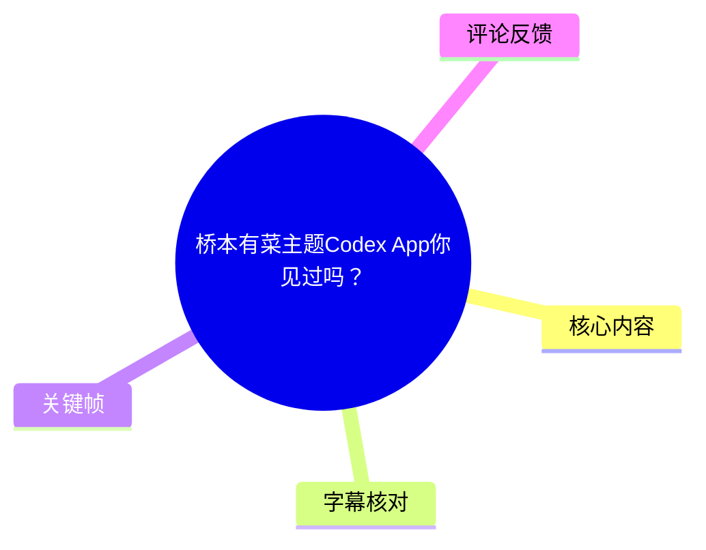
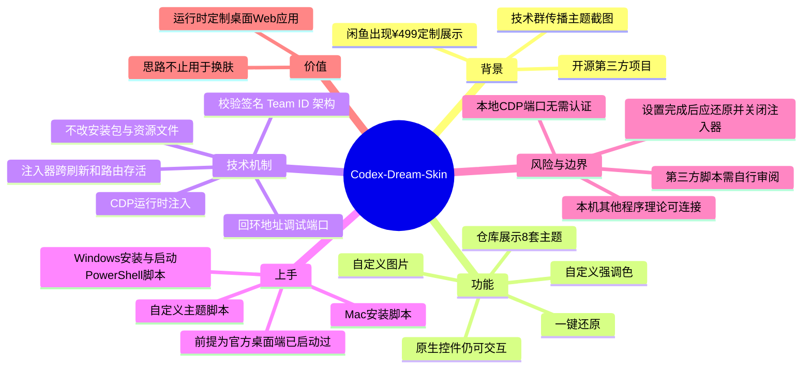

# 桥本有菜主题 Codex App 你见过吗？

> 来源：[Bilibili 视频](https://www.bilibili.com/video/BV1vNKJ6AEZZ) 
> UP 主：xhyovo｜视频时长：02:57｜分辨率：3840×2160 
> 项目仓库（视频简介提供）：[Fei-Away/Codex-Dream-Skin](https://github.com/Fei-Away/Codex-Dream-Skin)

## 小结

视频介绍了开源第三方换肤工具 **Codex-Dream-Skin**：它面向 Codex 桌面端提供主题定制，视频称仓库展示了 8 套主题，包括粉色、财神打工、红白科幻、紫夜限定、初音未来等，也可以使用自定义图片与强调色。画面强调，这不是仅覆盖一张背景图，侧栏、建议卡与项目选择等界面元素仍是可交互的原生控件。

其核心技术路径是通过 **CDP（Chrome DevTools Protocol，Chrome 开发者工具协议）**，在 Codex 运行时向预期渲染页面注入样式；视频称该方案不修改官方安装包、应用资源文件或代码签名。流程中会验证官方应用签名、Team ID 与架构，并将调试端口绑定在本机回环地址。

安装前提是已安装官方 Codex 桌面端且至少启动过一次。Mac（Apple Silicon、Intel）通过安装脚本操作；Windows 则按视频说法分别运行安装与启动两个 PowerShell 脚本。自定义主题需传入一张图片并设置强调色；不再使用时可运行还原脚本恢复官方外观。

最关键的限制是 CDP 的本地调试端口风险：视频明确说明，回环地址上的该端口不需要认证，因此注入器开启期间，本机其他程序理论上也可能连接、读取或修改页面内容。项目文档建议主题设置完成后执行还原、关闭注入器；用户还应在运行前自行审阅第三方脚本。

视频中提到“闲鱼标价 ¥499”的界面皮肤定制信息，以及“GitHub 已有 4,800+ Star”，均是视频制作时展示/陈述的时点信息，可能随商品下架、仓库更新或 Star 数变化而失效，不能视作当前实时状态。

## 思维导图

## 目录

- [背景：从整活截图到开源项目（00:00）](#背景从整活截图到开源项目0000)
- [功能与主题：可交互而非单纯壁纸（00:29）](#功能与主题可交互而非单纯壁纸0029)
- [技术原理：CDP 注入与应用校验（00:56）](#技术原理cdp-注入与应用校验0056)
- [安装、定制与还原流程（01:36）](#安装定制与还原流程0136)
- [安全边界：回环端口并非无风险（02:00）](#安全边界回环端口并非无风险0200)
- [观点、适用范围与时效性（02:36）](#观点适用范围与时效性0236)
- [关键帧索引](#关键帧索引)
- [字幕比对](#字幕比对)
- [评论分析](#评论分析)
- [处理记录](#处理记录)

## 背景：从整活截图到开源项目 [00:00](https://www.bilibili.com/video/BV1vNKJ6AEZZ?t=0)

视频开头称，多个技术群中突然出现了 Codex 桌面端主题截图，画面涉及粉色主题、桥本有菜相关定制、财神打工与初音未来等元素。UP 主最初将其判断为可能是 AI 生成图“整活”。

随后，视频称其在闲鱼发现有卖家将 Codex 界面皮肤定制上架，展示标价为 **¥499**，由此引出：相关主题并非只是一张概念图，而被包装为定制服务。画面中的文字为“一个 Codex 换肤项目，已经从群聊整活变成定制生意”。

> 图：该帧同时呈现“桥本有菜粉色定制”界面示意与“闲鱼挂价 ¥499”的商品页面截图，是理解视频选题来源和商业化现象的直接画面依据。商品价格仅代表视频展示时的信息，不代表当前有效报价。

在 [00:21](https://www.bilibili.com/video/BV1vNKJ6AEZZ?t=21) 至 [00:29](https://www.bilibili.com/video/BV1vNKJ6AEZZ?t=29)，视频确认其链接指向一个真实开源项目，并将后续内容分为四个问题：项目是什么、如何实现、如何安装、有哪些坑。

## 功能与主题：可交互而非单纯壁纸 [00:29](https://www.bilibili.com/video/BV1vNKJ6AEZZ?t=29)

视频将项目名称表述为 **Codex Dream Skin / Codex-Dream-Skin**，并强调它是与 OpenAI 官方无关的第三方换肤工具。根据视频陈述，制作时其 GitHub 仓库已有“4,800 多个 Star”。

### 视频展示的功能范围 [00:37](https://www.bilibili.com/video/BV1vNKJ6AEZZ?t=37)

视频称仓库公开展示了 **8 套主题**，提到的主题类型包括：

- 粉系定制；
- 财神打工版；
- 红白科幻；
- 紫夜限定；
- 初音未来；
- 以及其他未逐一在口播中命名的主题。

> 图：画面写明“8 套仓库公开展示主题”，并列出粉系、财神、红白科幻、紫夜、初音未来等类别；下方同时出现“4.8K+★”与“一键 Restore”。这为主题数量、仓库热度表述和还原功能提供了视频内视觉依据。

### “主题”与“壁纸”的差别 [00:45](https://www.bilibili.com/video/BV1vNKJ6AEZZ?t=45)

视频特别区分了界面主题与单纯贴背景图：

- 侧栏、建议卡、项目选择等元素仍为原生控件；
- 这些控件应保持可点击、可使用；
- 用户可替换为自己的图片；
- 支持常见图片格式；
- 强调色可以自定义；
- 不想继续使用时可一键还原为官方外观。

> 图：该帧直接写有“不是壁纸，是可交互的主题”“侧栏、建议卡、项目选择仍是原生控件”，并展示三个不同风格的 Codex 界面，因此适合用于解释换肤不等于静态截图覆盖。

需要注意，视频没有列出“常见图片格式”的具体扩展名，也没有演示每种主题在不同 Codex 版本上的兼容性；这些能力应以项目仓库当前文档为准。

## 技术原理：CDP 注入与应用校验 [00:56](https://www.bilibili.com/video/BV1vNKJ6AEZZ?t=56)

### 不修改官方安装文件 [00:56](https://www.bilibili.com/video/BV1vNKJ6AEZZ?t=56)

视频否定了“直接改客户端文件”的猜测，并归纳项目文档描述的边界：

1. 不修改官方安装包；
2. 不改动应用资源文件；
3. 不触碰代码签名；
4. 在应用运行期间完成界面样式定制。

视频将其实现方式归因于 **CDP**。CDP 是 Chrome DevTools Protocol 的缩写，即 Chrome 开发者工具协议。视频认为 Codex 桌面端采用 Web 技术，因此可以通过这一调试协议对渲染层进行操作。

### 视频描述的注入流程 [01:11](https://www.bilibili.com/video/BV1vNKJ6AEZZ?t=71)

按视频口播，流程如下：

1. **验证目标应用**：先校验官方应用的签名、Team ID 和架构，以确认目标是正版 Codex。
2. **拉起应用与调试能力**：通过系统的用户级启动服务启动相关组件。
3. **绑定本地端口**：将调试端口绑定到本机回环地址；按视频表述，只有本机可以访问该地址。
4. **限定注入对象**：只向预期的渲染页面注入样式。
5. **保持注入器运行**：即使页面刷新或前端路由切换，注入器仍保持存活，从而持续应用主题。

视频的概括是：官方应用“没有被改动”，只是在浏览器内核/渲染层面对界面“化妆”。这是对该项目机制的通俗说明，不应延伸理解为该方案对所有版本、所有安全环境都绝对无影响。

### 这里的技术价值 [02:40](https://www.bilibili.com/video/BV1vNKJ6AEZZ?t=160)

UP 主认为，该项目真正值得关注的不是主题本身，而是其运行时定制方式：

- 不直接修改二进制文件；
- 不破坏应用签名；
- 借助调试协议在运行时调整桌面 Web 应用的外观；
- 这种思路的潜在用途不局限于换肤。

这是视频作者的观点。对于其他桌面应用是否能直接复用，仍取决于应用是否暴露对应调试能力、平台启动机制、目标页面识别策略和安全策略，视频并未提供通用实现方案或兼容性清单。

## 安装、定制与还原流程 [01:36](https://www.bilibili.com/video/BV1vNKJ6AEZZ?t=96)

### 前置条件 [01:45](https://www.bilibili.com/video/BV1vNKJ6AEZZ?t=105)

使用前，视频明确给出一项必要条件：

- **官方 Codex 桌面端必须已经安装，并且至少成功启动过一次。**

视频没有提供 Codex 桌面端具体版本、系统最低版本、脚本文件名或下载包校验值。因此实际操作时，不能仅依据本视频判断环境是否一定兼容，应先阅读仓库 README 与脚本内容。

### Mac 操作路径 [01:36](https://www.bilibili.com/video/BV1vNKJ6AEZZ?t=96)

视频说明：

1. 下载项目仓库；
2. 适用于 Apple Silicon 与 Intel Mac；
3. 双击一个安装脚本完成安装。

视频没有展示脚本具体命令、所需权限或 macOS 安全提示处理方式。由于涉及启动服务与本地调试端口，建议运行前先检查脚本将创建哪些服务、监听何种地址与端口、是否申请额外权限。

### Windows 操作路径 [01:44](https://www.bilibili.com/video/BV1vNKJ6AEZZ?t=104)

视频说明 Windows 用户需要运行两个 PowerShell 脚本：

1. 一个用于安装；
2. 一个用于启动。

同样，视频未给出脚本文件名称、PowerShell 执行策略调整命令或管理员权限要求。不得据此擅自补全命令；应以仓库当前脚本和文档为准。

### 自定义与恢复 [01:50](https://www.bilibili.com/video/BV1vNKJ6AEZZ?t=110)

按视频说明，自定义主题的操作顺序为：

1. 运行自定义主题脚本；
2. 传入一张图片；
3. 配置一个强调色；
4. 应用到 Codex 界面。

恢复官方外观的方式为：

1. 双击还原脚本；
2. 停止主题注入并恢复官方“素颜”外观。

这里的“恢复”是视频对脚本功能的描述。视频后续补充，其还原操作也会在目标应用信息完全匹配时才执行，因此不应手动删除、替换或混用不明来源的配置文件，以免导致脚本无法正确识别目标状态。

## 安全边界：回环端口并非无风险 [02:00](https://www.bilibili.com/video/BV1vNKJ6AEZZ?t=120)

### CDP 能力与无认证风险 [02:01](https://www.bilibili.com/video/BV1vNKJ6AEZZ?t=121)

视频将这部分作为必须听完的风险提示。其核心逻辑是：

- CDP 原本用于浏览器调试，能力很强；
- 对页面中的内容可进行读取和修改；
- 当调试端口绑定到回环地址时，视频称其**不需要认证**；
- 因此注入器持续运行期间，本机上其他程序理论上也可以连接该调试端口。

“仅绑定回环地址”意味着端口不直接向外网暴露，但这不等于本机环境中的其他进程天然不构成风险。若本机已有恶意程序、未知工具，或不受信任的本地脚本，它们在理论上可能利用可访问的调试接口。

### 视频给出的缓解措施 [02:16](https://www.bilibili.com/video/BV1vNKJ6AEZZ?t=136)

视频援引项目文档建议：**主题设置完成后执行还原，关闭注入器。**

还提到两项项目设计：

1. 每次注入前，校验官方应用签名与 Team ID；
2. 还原时，只在应用信息完全匹配的情况下操作。

这些设计能够降低误操作或注入到错误目标的概率，但不等价于替用户审计脚本、隔离本机其他进程，或消除 CDP 接口本身的权限风险。

### 使用建议：将安全审阅放在运行之前 [02:31](https://www.bilibili.com/video/BV1vNKJ6AEZZ?t=151)

视频的最终建议是：项目终究是第三方项目，安装前应自行审阅脚本，这是开发者基本素养。结合视频内容，可将可执行的审阅重点整理为：

- 确认下载来源为视频简介指向的项目仓库，而非二次打包文件；
- 阅读安装、启动、还原和自定义主题脚本；
- 检查脚本是否仅针对官方 Codex 应用、是否确实校验签名与 Team ID；
- 关注调试端口的监听地址及其生命周期；
- 在主题设置完成后按项目建议执行还原，避免长期保留注入器；
- 若无法理解脚本行为，不应仅因主题效果而直接运行。

以上是基于视频风险提示作出的实践整理；视频没有提供安全审计报告、端口号、权限模型细节或第三方代码的独立安全验证结论。

## 观点、适用范围与时效性 [02:36](https://www.bilibili.com/video/BV1vNKJ6AEZZ?t=156)

UP 主的结论是：为编程工具换肤看起来像“整活”，但其可迁移价值在于展示了不改二进制、不破坏签名、以调试协议完成桌面应用运行时定制的做法。

适合阅读或尝试该项目的人群包括：

- 已安装并实际使用 Codex 桌面端的用户；
- 希望自定义开发工具视觉体验的用户；
- 对桌面 Web 应用、CDP 和运行时样式注入感兴趣的开发者；
- 能够审阅并承担第三方本地脚本风险的用户。

不适合直接照做的情形包括：

- 无法确认脚本来源或内容；
- 对本机调试端口开放、进程权限和本地安全风险没有基本判断能力；
- 生产环境或受组织软件合规政策约束的设备；
- 只根据视频片段、未核对当前仓库文档和版本兼容性就准备执行脚本的情况。

### 时效性说明

- 视频元数据显示发布时间为 **2026-07-17**。
- “GitHub 4,800+ Star”“公开展示 8 套主题”“闲鱼 ¥499 定制”均为视频中的历史展示或口播信息。
- 项目仓库、Codex 桌面端架构、脚本名称、可用主题数量、商家页面和价格都可能变化。
- 本文不对视频发布后项目仍可用、当前 Star 数、商品仍上架、主题人物素材的授权状态或脚本安全性作额外断言。

## 关键帧索引

| 时间段 | 关键帧 | 画面信息 | 正文使用价值 |
| --- | --- | --- | --- |
| 约 00:00 |  | 粉色 Codex 定制示意、闲鱼 ¥499 页面 | 说明选题由群聊传播与定制交易展示引出 |
| 约 00:29 |  | “8 套”主题、主题样例、4.8K+ Star、一键 Restore | 支撑视频对主题数量、主题类型和恢复能力的展示 |
| 约 00:45 |  | “不是壁纸，是可交互的主题” | 解释主题仍保留原生界面控件，而非静态背景覆盖 |

> 关键帧均选自所提供的实际帧文件。正文未把画面中无法辨认的小字、商品详情或界面效果外推为未经视频明确说明的技术事实。

## 字幕比对

| 字幕来源 | 完整性 | 专有名词 | 时间轴 | 主要问题 |
| --- | --- | --- | --- | --- |
| Bilibili 站内字幕 | 完整，覆盖 00:00:00.160—00:02:56.940 | 整体较好，但有“codex dream steam”“换服”“桥本”断句等识别/转写瑕疵 | 逐句分段，时间连续且与 177 秒视频时长相符 | 个别词错误或缺少连字符；“Team ID”被写作“tm id” |
| 本次 ASR（medium） | 文字覆盖主要口播，但首段从 00:00:28.860 才开始，诊断语音覆盖率为 82.08% | 误识别较多，如“巧本有菜”“换皮股”“桥式端口”“回还地址”“签字”等 | 仅 8 个长分段；首段时间与实际开场不匹配，无法用于精确定位 | 分段过粗、首段时间异常、多个技术术语和句意错误 |

### 最终字幕选择与校正

本文以 **Bilibili 站内字幕的逐句时间轴** 作为章节定位依据，并对照本次 ASR 的语义内容进行检查。原因是站内字幕从 00:00 起完整覆盖全片，而本次 ASR 虽检测到音轨并识别语言为中文（置信度 0.9990），却出现首段延后至 28.86 秒、文本被压缩为超长段落的问题。

本次 ASR 诊断**未标记 `noAudioStream=true`**，因此不能将其问题归因于源视频没有音轨；实际情况是 ASR 存在时间轴与专有名词识别质量不足。

经站内字幕、视频简介、关键帧文字和上下文交叉校正，本文统一采用：

- 项目名：**Codex-Dream-Skin**；
- 协议名：**CDP（Chrome DevTools Protocol）**；
- 身份字段：**Team ID**；
- 网络边界：**本机回环地址**；
- 主题人物名称：**桥本有菜**；
- 平台名：**GitHub、PowerShell、Apple Silicon、Intel**；
- 价格展示：**¥499**。

## 评论分析

仅处理本次可获取的热评前三条。评论属于用户表达，不作为项目事实或安全结论的证据。

1. **好喝的墨水**（4 赞）：`[笑哭]`  
   - 这是一条纯情绪反应，没有提供项目使用方法、技术补充或可验证信息。
   - 反映了观众对主题定制内容的娱乐化接受，但不构成任何事实判断。

2. **丶喃嗒**（0 赞）：`啊。。不能让gpt给自己写一个吗`  
   - 评论提出了“是否可让 GPT 自行编写类似主题工具”的设想。
   - 视频没有讨论用 GPT 生成该工具的可行性，也没有给出实现代码，因此不能据此推导自动生成脚本是安全或可行的。
   - 该问题反而提示：涉及 CDP、启动服务、签名校验和本机端口时，生成或运行脚本仍需要人工审阅。

3. **Endless-Blue-Sky**（0 赞）：`太bt了`  
   - 属于简短的主观感叹，可能是对主题视觉风格或定制程度的反应。
   - 未提供技术信息、使用反馈或争议细节，无法据此评估项目质量与安全性。

## 处理记录

- Worker ID：`worker-mrj0www4-e8d79408`
- 模型：`gpt-5.6-terra`
- 调用工具与素材：任务提供的 Bilibili 元数据、站内字幕 `p01-ai-zh.srt`、本次 ASR 结果 `asr/asr-result.json` 与 `asr/transcript.srt`、热评数据、关键帧目录及所提供关键帧画面。
- 字幕选择：检查了站内字幕与本次 ASR；最终采用站内 SRT 的逐句起止时间制作时间轴，利用 ASR 作交叉核对，并依据视频简介、上下文和关键帧修正专有名词。
- ASR 状态：ASR 使用 `medium` 模型、中文识别，音频时长 `176.96` 秒，未标记 `noAudioStream=true`；但首段起点与实际开场不一致且误识别较多，未作为时间轴主依据。
- 关键帧选择依据：选择 `frame-001.jpg` 说明 ¥499 定制展示来源，选择 `frame-003.jpg` 展示 8 套主题与 Restore 信息，选择 `frame-004.jpg` 解释“可交互主题”与原生控件；均与正文段落有直接对应关系。
- 缓存清理：本任务仅基于已提供素材生成文档，未执行额外下载、转码或缓存写入；无可报告的缓存清理操作。
- 未解决问题：未提供仓库当前版本的脚本全文、端口号、兼容性矩阵、独立安全审计结果或主题素材授权信息；本文不对这些未出现的信息作推断。
