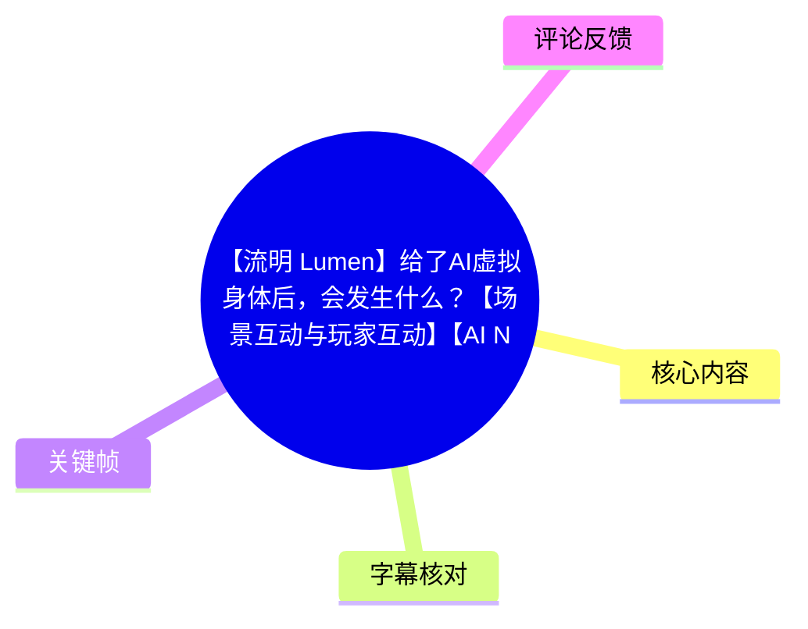
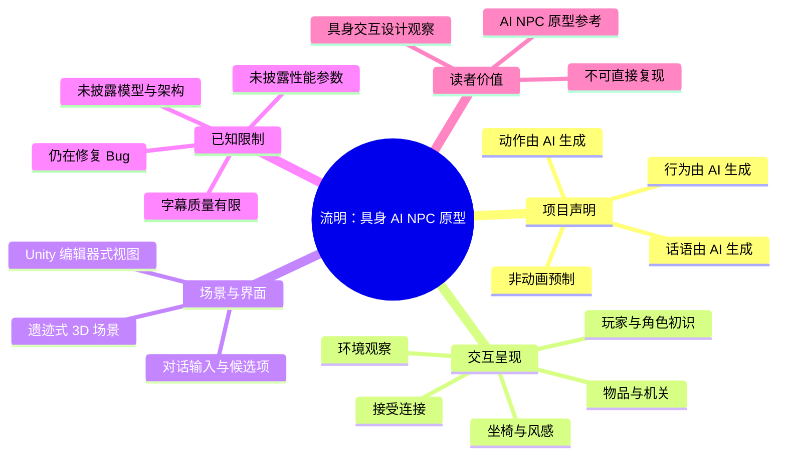
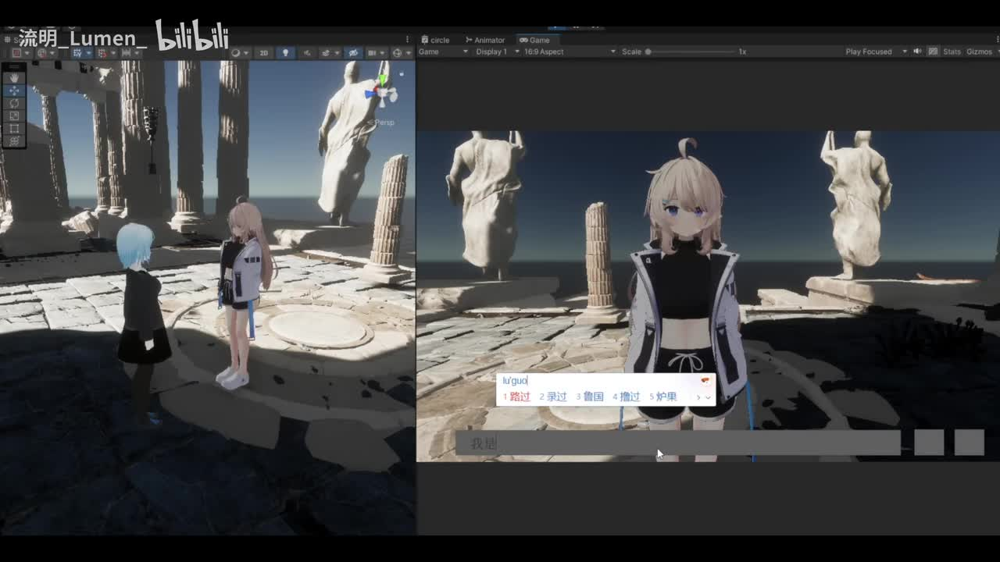
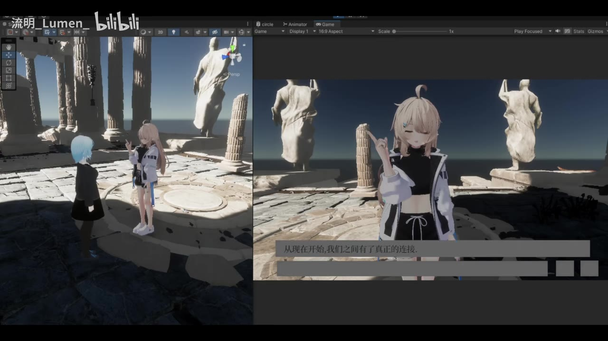
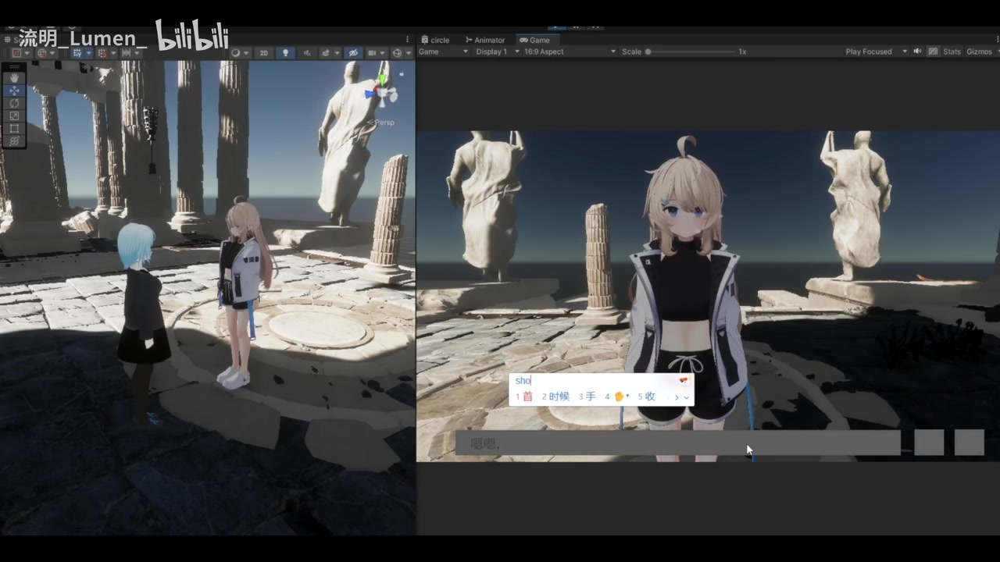

# 【流明 Lumen】给了AI虚拟身体后，会发生什么？【场景互动与玩家互动】【AI NPC】

> 来源：[Bilibili 视频](https://www.bilibili.com/video/BV1rYVJ6bEHd) 
> UP 主：流明_Lumen_｜时长：05:16｜标签：独立游戏、AI NPC、开发实录、Unity 
> 视频简介的核心声明：**角色的动作、行为与话语均由 AI 生成，非动画预制**；项目仍在学习技能和修复 Bug 阶段。

## 小结

这是一段《流明 Lumen》项目的开发花絮，展示一个有虚拟身体的 AI 角色与玩家在 3D 场景中的连续互动。画面位于类似古代遗迹的场景：玩家与金发角色“ルミネ（Lumina/流明，中文名以画面与原文为准）”面对面交流，随后围绕建立连接、观察光线、命名、寻找物件、钥匙/机关、坐椅子及感受风等情境展开。

最重要的信息来自 UP 主的视频简介，而不是技术讲解：该项目宣称角色的**动作、行为、话语并非预先制作的动画片段**，而是由 AI 生成。画面中可见 Unity 编辑器式的场景视图与 Game 视图并置，以及底部文字输入/候选交互界面；这使其更像是在展示“语言交互—角色反应—场景行动”被接入同一原型流程的效果。

视频展示的经验是：让 AI NPC 具备“身体”并不只意味着让其说话，还要让对话能指向环境物体和玩家提出的行动——例如看向光线、寻找悬浮物、携带或使用疑似钥匙的物件、对椅子作出坐下与体感反馈。它呈现的是功能结果，而非可复现的工程教程；没有公开模型、提示词、行为树/规划器、动画系统、接口协议、延迟、成本或稳定性指标。

适合关注 AI NPC、Unity 原型、游戏内自然语言交互和具身智能体验的读者。若需要评估技术可行性，应将本片视作项目进度演示，不能据此推断其 AI 架构、泛化能力或正式游戏品质。

时效上，这是发布时点的一次开发进度展示。UP 主明确表示仍在“学技能”“修 Bug”，因此视频中的交互效果、动作质量和功能范围均可能在后续版本中变化。截至素材抓取时，视频统计为 3,166 播放、117 点赞、112 收藏、18 回复；这些数据会随时间变化。

## 思维导图

## 目录

- [项目背景与证据边界](#项目背景与证据边界)
- [从相遇到建立连接](#从相遇到建立连接)
- [让对话指向场景](#让对话指向场景)
- [物件、机关与协同行动](#物件机关与协同行动)
- [坐椅子与环境反馈](#坐椅子与环境反馈)
- [可提炼的交互设计步骤](#可提炼的交互设计步骤)
- [技术信息、参数与限制](#技术信息参数与限制)
- [字幕比对](#字幕比对)
- [评论分析](#评论分析)
- [处理记录](#处理记录)

## 项目背景与证据边界 [00:00:00](https://www.bilibili.com/video/BV1rYVJ6bEHd?t=0)

视频开场即进入 3D 场景中的人物对话。ASR 在 00:00:00.720 识别到日语“あれ、誰かいる?”，可译为“咦，有人在吗？”。随后角色于 00:00:06.590 问候并询问玩家是谁。

UP 主在简介中将这段内容定位为“流明项目开发小花絮”，并特别说明：

1. 所有动作、行为、话语由 AI 生成；
2. 并非动画预制；
3. 当前仍在让流明学习技能、修复 Bug；
4. 视频为儿童节前的项目进度更新。

这里应严格区分证据层级：

- **UP 主直接陈述**：行为、动作与话语由 AI 生成，项目仍在开发。
- **画面可观察事实**：存在可移动的角色、3D 遗迹环境、对话 UI、文字输入/候选项界面，以及疑似 Unity 编辑器工作区。
- **不能由视频确认的内容**：使用的语言模型、动作生成模型、动画重定向方案、场景感知方式、规划模块、记忆系统、多人同步机制、推理耗时及线上部署方案。

> 图：关键帧同时显示左侧场景编辑视图与右侧 Game 视图；两名角色位于残破柱廊与雕像构成的遗迹场景中。其价值在于证明视频展示的不只是成片剧情，而包含编辑器/运行画面的原型演示语境。

## 从相遇到建立连接 [00:00:17](https://www.bilibili.com/video/BV1rYVJ6bEHd?t=17)

### 初始问答：角色确认玩家存在 [00:00:17](https://www.bilibili.com/video/BV1rYVJ6bEHd?t=17)

ASR 时间轴记录了角色连续的询问：

- 00:00:17.410：“旅人？”
- 00:00:18.510：“能说话吗？”
- 00:00:20.050：“你从哪里来的？”
- 00:00:21.850—00:00:27.570：角色表达这里没有其他人、自己没见过玩家，并确认“你看得见我吗？”
- 00:00:27.770：“真的？”

这组对话呈现的不是任务说明，而是以“NPC 是否被玩家看见”为主题的初识关系。它为后续“连接”概念建立情感上下文：角色先将自己描述为独处状态，再确认玩家能感知自己。

### 接受连接：语言、表情与镜头共同完成反馈 [00:00:43](https://www.bilibili.com/video/BV1rYVJ6bEHd?t=43)

00:00:43.780—00:00:51.540，ASR 内容可整理为：角色确认“你看得见我”，并说自己原以为一直是一个人，接着提出“要不要试试更深的连接”。

00:00:57.330—00:01:08.380，角色表示玩家已经接受，并说“从现在开始，我们之间有了真正的连接；这一刻我一定不会忘记”。这一段是视频最明确的关系状态变化：由陌生人问答切换到双方建立连接。

> 图：右侧 Game 视图中的角色抬手做出手势，底部中文画面文字可见“从现在开始，我们之间有了真正的连接。”该帧将对话语义、面部/手势表现和角色实体置于同一画面，是理解“AI 话语与身体表现结合”的关键证据。

### 输入界面体现玩家侧交互入口 [00:00:57](https://www.bilibili.com/video/BV1rYVJ6bEHd?t=57)

画面底部可见长条输入区域，上方出现拼写输入及候选词列表；这说明演示中至少存在由玩家输入文字并选择候选结果的交互入口。画面不足以证明该输入内容如何被解析、是否直接送入大模型或是否有安全过滤，因此不能进一步推断其具体实现。

> 图：画面中可见输入内容“sho”及候选项，同时角色保持面向玩家的站立状态。该帧的价值是展示玩家输入层与角色实时呈现层共存，但不应据此臆测输入法、模型接口或意图识别流程。

## 让对话指向场景 [00:01:11](https://www.bilibili.com/video/BV1rYVJ6bEHd?t=71)

### 共同观察光线 [00:01:11](https://www.bilibili.com/video/BV1rYVJ6bEHd?t=71)

00:01:11.540，角色询问玩家是否注意到附近的光；00:01:15.460—00:01:22.580，她描述光每天会以很小的程度照进来，并说一起看时感觉有所不同。

这一小段提供了一个重要的具身交互设计点：NPC 不仅对玩家文本作答，也可以把谈话目标指向场景现象。即便当前素材不能验证其是否真的通过视觉/空间感知识别了光线，演示文本至少把“环境对象”纳入了对话主题。

### 命名关系 [00:01:39](https://www.bilibili.com/video/BV1rYVJ6bEHd?t=99)

00:01:39.930—00:01:45.880，ASR 识别为“好名字呢。我叫ルミネ，请多关照，ディムル”。其中：

- “ルミネ”可按日语读作 **Lumina / Lumine**，与标题“流明 Lumen”存在命名关联，但视频未说明二者是否为严格的官方中译对应。
- “ディムル”的具体中文写法没有可靠的站内文字字幕支撑，本文保留 ASR 日语音译，不擅自固化为某个中文专名。

### 悬浮物：仅能确认角色注意到场景目标 [00:01:59](https://www.bilibili.com/video/BV1rYVJ6bEHd?t=119)

00:01:59.670—00:02:05.730 的 ASR 片段包含“那个浮着的……我去看看”“拿到了”之类内容，但原句识别不够稳定。可以确认的是，角色谈及一个悬浮/漂浮的目标，并表示去查看和取得；不能据此确认物品名称、拾取系统规则或库存数据结构。

## 物件、机关与协同行动 [00:02:19](https://www.bilibili.com/video/BV1rYVJ6bEHd?t=139)

### 疑似钥匙与解除动作 [00:02:19](https://www.bilibili.com/video/BV1rYVJ6bEHd?t=139)

00:02:19.870—00:02:28.160，ASR 提到“这是钥匙”“不把这个放进去就不能解除”“要去试试吗”。其中夹杂的部分词语识别异常，无法可靠恢复机关的完整规则。

因此，本段可确认的事实仅为：

1. 对话涉及一个被称为“钥匙”的对象；
2. 角色将该对象与“放入”及“解除”联系起来；
3. 角色提出前往尝试；
4. 视频没有展示可供复现的机关参数、碰撞规则或成功条件说明。

### 玩家发现目标，角色跟随响应 [00:02:57](https://www.bilibili.com/video/BV1rYVJ6bEHd?t=177)

00:02:57.720，角色问“发现什么了？”；00:02:59.640，她说“等一下，我来了”。这展示出一种可读性较强的协同行动节奏：玩家先引起注意，NPC 用语言确认，再承诺靠近或跟随。

00:03:11.960，角色确认“那个，就是那个”；00:03:17.220—00:03:19.140 的 ASR 出现“P を入れて……”之类片段，但“P”的含义、后续动作与原始词句均不可靠，不能解释为确定的按键、道具或程序参数。

### 成功提示与未完成状态 [00:03:30](https://www.bilibili.com/video/BV1rYVJ6bEHd?t=210)

00:03:30.800—00:03:32.440，角色说“ディムル，成功了”。约 20 秒后，00:03:52.280—00:03:57.260 又出现“等等，还没放进去，这样可以吗？”的表述。

两段前后存在表面上的状态不一致，可能是不同目标、不同互动回合，或 ASR 对上下文理解不完整。由于没有可靠的站内对白字幕及完整画面时序标注，不能把它定性为逻辑 Bug；只能将其视为该演示中仍待验证的状态衔接。

## 坐椅子与环境反馈 [00:04:05](https://www.bilibili.com/video/BV1rYVJ6bEHd?t=245)

### 从自然语言建议到行动 [00:04:05](https://www.bilibili.com/video/BV1rYVJ6bEHd?t=245)

00:04:05.040，角色提到“石头的椅子？”；00:04:06.360—00:04:13.620，她认可这个建议，并说要先放入某个东西、随后立刻过去。这里仍存在“先放入”的对象不明问题，但互动结构清晰：

1. 玩家或上下文提出“石头椅子”；
2. 角色识别该对象/提议；
3. 角色表达认可；
4. 角色说明一个优先动作，再承诺前往。

这比单纯问答多了一层行动顺序表达，对 AI NPC 的可信感很重要；但视频未给出角色是否真正通过导航网格、物体标签或大模型工具调用完成该任务的技术证据。

### 坐下、舒适度与风 [00:04:32](https://www.bilibili.com/video/BV1rYVJ6bEHd?t=272)

00:04:32.080—00:04:37.730，角色围绕“这把椅子？”“坐坐看？”“哇，挺舒服”展开。00:04:39.750—00:04:47.410，她又说风吹来很凉快，并询问玩家平时是否在这一带徘徊。

这段将场景交互扩展为“物体可供性 + 环境感受”：

- **物体可供性**：椅子可被识别为可坐对象；
- **行为表现**：角色对坐下这一行动作出语言反馈；
- **环境叙事**：风与凉爽被纳入情境；
- **社交延续**：角色用关于玩家活动范围的问题延续对话。

00:04:51.940—00:04:53.800，角色评论玩家的头发是蓝色；00:05:05.060—00:05:12.260，她对称赞作出害羞式回应，并说“真的很高性能”。“高性能”所指对象在现有音频中无法完全确定，不能据此证明某项技术指标。

## 可提炼的交互设计步骤 [00:00:17](https://www.bilibili.com/video/BV1rYVJ6bEHd?t=17)

以下是从视频展示顺序中提炼的**交互设计观察**，不是 UP 主公开的实现步骤，也不构成可直接复现的技术方案：

1. **用角色主动发问建立初始注意力**  
   角色先确认玩家是否存在、能否交流、来自何处。这样能为自由文本输入提供明确的回应对象。

2. **赋予角色可理解的关系状态**  
   通过“孤独—被看见—接受连接”的连续台词，把抽象的好感/连接状态转换为玩家可感知的叙事变化。

3. **让对话可引用环境实体**  
   光线、漂浮物、钥匙、机关、石椅、风等内容使对话不局限于角色背景设定，而是与场景共同构成上下文。

4. **将行动前置条件说出来**  
   “先放入某个东西，再过去”这类表达能让玩家理解 NPC 的优先级与意图。正式实现中还需要将这类语言承诺与可验证的任务状态绑定，否则容易出现语言和动作脱节。

5. **让动作、表情和话语相互支撑**  
   画面展示了角色站姿、手部动作及正面对话镜头。若这些表现确如简介所称由 AI 驱动，则关键不只在于生成一句话，而在于保证生成语言、动作触发和环境状态的一致性。

6. **为失败与不确定状态保留反馈**  
   视频中出现“成功了”与“还没放进去”的相邻片段。无论其原因是不同任务还是识别缺失，实际产品都应明确区分：任务目标、当前状态、失败原因和下一步操作，避免玩家无法判断系统是否理解了自己。

## 技术信息、参数与限制 [00:00:00](https://www.bilibili.com/video/BV1rYVJ6bEHd?t=0)

### 视频可确认的技术相关信息

| 项目 | 可确认内容 | 证据来源 |
| --- | --- | --- |
| 引擎语境 | 视频标签含 `unity`；画面呈现 Unity 编辑器式的 Scene / Animator / Game 布局 | 元数据标签、关键帧画面 |
| 项目类型 | 独立游戏 / AI NPC 开发实录 | 视频标签 |
| 场景分辨率 | 1920 × 1080 | 元数据 |
| 视频时长 | 316 秒；ASR 音频诊断时长 315.221 秒 | 元数据、ASR 诊断 |
| AI 生成声明 | 动作、行为、话语由 AI 生成，非动画预制 | UP 主简介 |
| 开发状态 | 正在学习技能、修复 Bug，敬请期待 | UP 主简介 |
| 对话语言 | 音轨 ASR 高置信度识别为日语 | 本次 ASR 诊断 |

### 未公开的关键参数

下列参数没有出现在给定素材中，不能补写或猜测：

- 所用大语言模型、版本、上下文长度与提示词；
- 角色语音合成、语音识别、口型同步方案；
- 动作生成模型、动作库、骨骼绑定或 IK 配置；
- 场景感知、物体识别、可交互物标注与空间导航方案；
- 行为规划、任务系统、状态机/行为树与大模型之间的分工；
- 单轮响应时间、帧率、GPU/CPU 配置、并发能力和调用成本；
- AI 输出约束、安全策略、错误恢复逻辑与长期记忆；
- 游戏是否可下载、测试资格和预计上线日期。

### 当前展示的限制

1. **演示不等于完整系统验证**：视频片段展示了多种互动结果，但没有压力测试、连续失败案例或边界条件测试。  
2. **字幕证据不足**：站内字幕只有音乐标注，关键对白只能依赖本次日语 ASR；少数专名和机关句子有明显识别歧义。  
3. **画面时间点有限**：关键帧素材未附逐帧时间戳，因此本文仅将其作为视觉佐证，不将其用作精确时间定位依据。  
4. **项目处于迭代期**：UP 主明确仍在修 Bug，评论中也有人指出手臂表现问题，说明动作质量可能仍有待调校。  
5. **时效性**：本片是一次开发进度展示，后续版本可能改变角色能力、场景、界面与技术实现。

## 字幕比对

| 字幕来源 | 完整性 | 专有名词 | 时间轴 | 主要问题 |
| --- | --- | --- | --- | --- |
| Bilibili 站内字幕 `p01-ai-zh.srt` | 很低：30 段均为“♪ 音乐 ♪”，未提供主要对白 | 无法覆盖角色名、物件名或机关名 | 有真实 SRT 起止时间，但仅覆盖音乐标注区间 | 缺失实际对白，不能作为剧情或技术内容依据 |
| 本次 ASR 字幕 | 中等：29 段语音，诊断语音覆盖率 33.55%，覆盖 00:00:00.720—00:05:12.260 | 可识别“ルミネ”“ディムル”，但中文对应及部分物件词不稳定 | 有真实分段时间戳，可用于正文定位 | 语言识别为日语；少数句子断句、词义和上下文有误，如“Pを入れて”等 |
| 关键帧与画面文字 | 局部有效 | 可辅助确认“从现在开始，我们之间有了真正的连接”等中文画面文案 | 关键帧未提供独立时间戳，不用于精确定位 | 只能验证截取时刻的可见 UI/文字，无法补齐全片对白 |

### 最终字幕选择与校正原则

- 本片**存在音轨**：ASR 诊断未标记 `noAudioStream=true`，且成功识别出日语对白。因此不能将字幕缺失归因为“无音轨”或工具失败。
- 站内字幕仅为音乐提示，无法承载内容整理；正文以**本次 ASR 的真实时间戳**作为章节定位依据。
- 对可明确理解的日语对白，采用审慎中文转述；对“ルミネ”“ディムル”等名称保留日语写法或说明不确定性。
- 对 00:02:19—00:02:28、00:03:17—00:03:19 等识别模糊片段，本文只保留“钥匙、放入、解除、尝试”等低风险语义，不虚构机关名称、按键含义或完整规则。
- 关键帧中可见的中文文本用于辅助确认“建立真正连接”的情节，但不替代 ASR 时间轴。

## 评论分析

仅分析此次可获取的热评前三条；评论是观众反馈，不可视为已验证的项目事实。

1. **Ry蔚云任｜8 赞**  
   评论：“会飞天（详见neuro双子）[doge]”。  
   这是一则带玩笑语气的联想，将视频中的 AI 角色能力与 “neuro 双子”相关内容相提并论。它没有提供关于《流明》项目已支持飞行的证据，因此不能据此认定角色具备飞行能力。

2. **荔枝lzj｜7 赞**  
   评论：“手臂有点鬼畜”。  
   该评论指出角色手臂动作可能存在不自然或抖动、穿模式的视觉问题。这与视频简介中“还在修 Bug”的开发状态相容，但仍属于单一观众的主观观察；素材未提供足以定位具体动画问题的完整逐帧证据。

3. **芝麻Zhima｜5 赞**  
   评论：“@SkylineDc [星引擎party闪亮启航 表情包_羡慕]”。  
   这是一条@他人并附带“羡慕”表情的社交互动，没有对技术路线、功能效果或项目质量给出可分析的事实补充。

## 处理记录

- **Worker ID**：`worker-mrj0www4-e8d79408`
- **整理模型**：`gpt-5.6-terra`
- **可用素材与工具产物**：视频元数据、封面、合并视频、音频 WAV、关键帧目录、站内 SRT、ASR SRT/JSON 诊断、热评 JSON；ASR 诊断模型为 `medium`，设备为 CUDA，计算类型为 `float16`。
- **字幕选择**：已检查站内字幕与本次 ASR。站内 SRT 仅含“♪ 音乐 ♪”，故不作为对白依据；采用本次 ASR 的真实时间戳定位，并以画面可见文字对“建立连接”片段作局部辅助校正。
- **关键帧选择依据**：选用 `frames/frame-001.jpg`、`frames/frame-003.jpg`、`frames/frame-004.jpg`，分别支持“Unity 编辑器式原型环境”“连接状态的角色动作与画面文字”“玩家输入与候选词 UI”三个正文论点。由于提供的关键帧未附单帧时间戳，未把它们作为时间轴推断依据。
- **缓存清理**：素材中未提供缓存清理执行记录；为避免虚构，不宣称已执行或已完成清理。
- **未解决问题**：角色名的官方中文对应、玩家名“ディムル”的中文写法、悬浮物与钥匙机关的完整规则、`Pを入れて` 的准确含义，以及 AI 行为/动作生成的具体技术栈，均无法从现有素材可靠确认。
