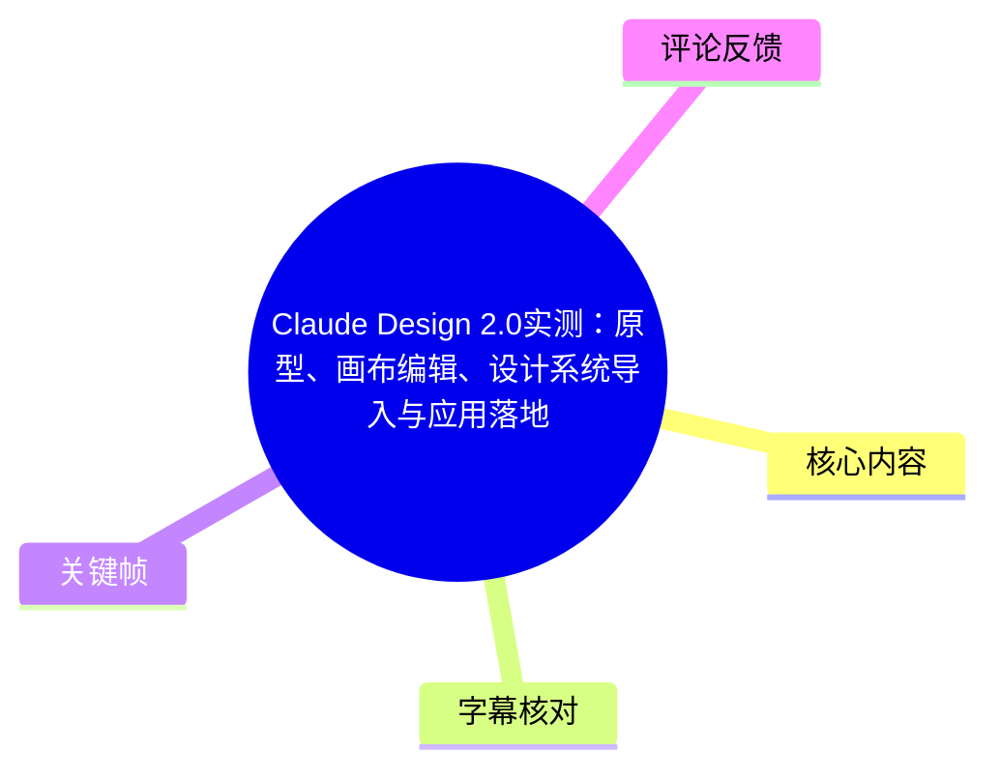
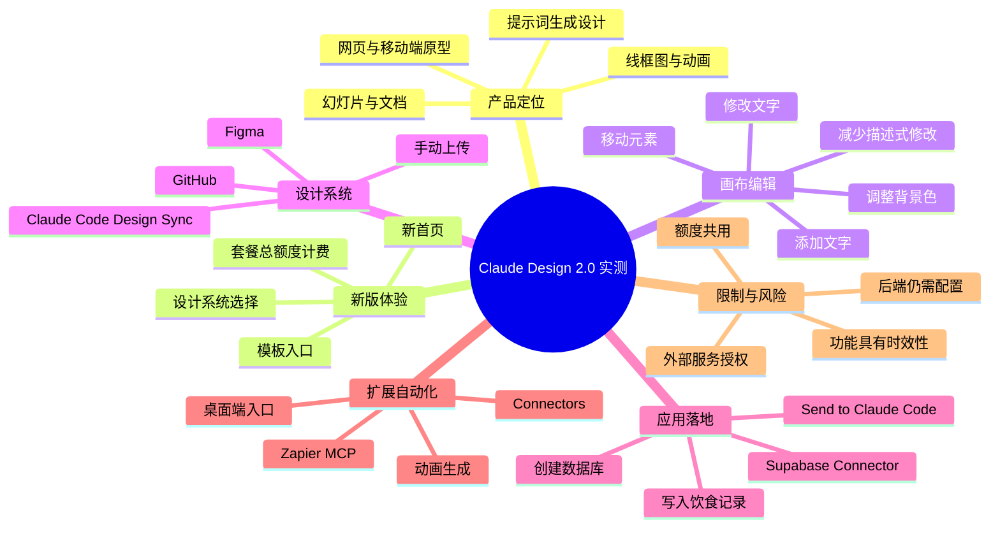
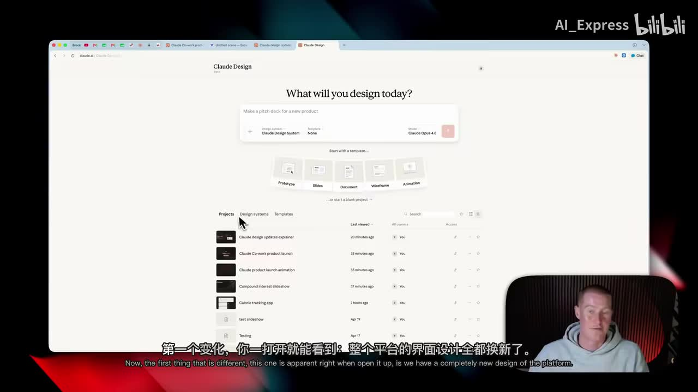
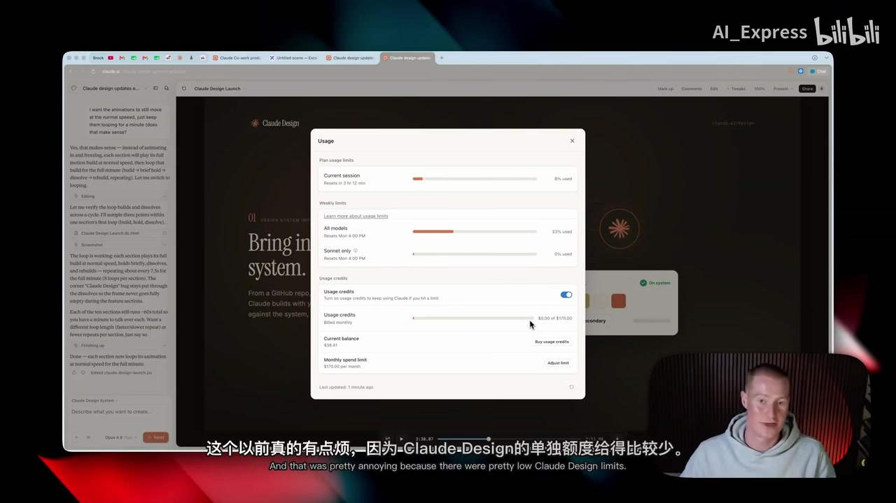
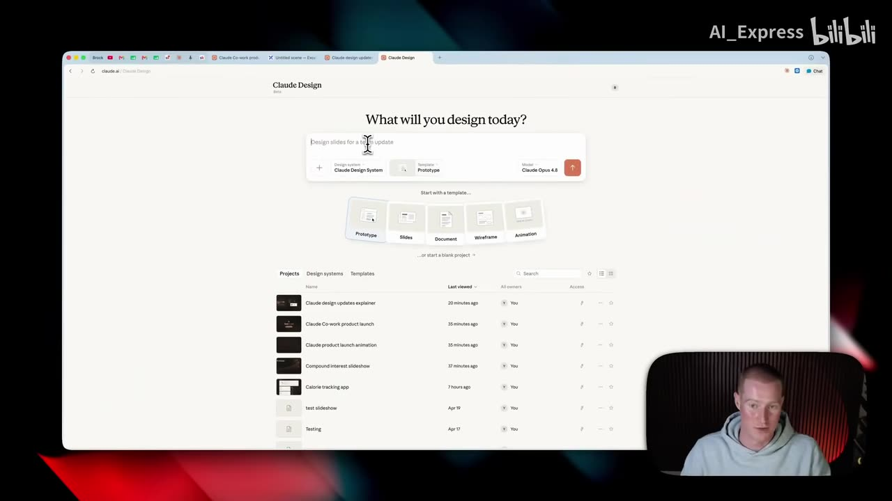

# Claude Design 2.0实测：原型、画布编辑、设计系统导入与应用落地

> 来源：[Bilibili 视频](https://www.bilibili.com/video/BV1JuTF6QEqH)<br>
> UP 主：AI_Express｜分区合集：AIcode｜视频页标注总时长：26:26<br>
> 视频包含两个分 P：**中配版**与**原声版**，每个分 P 时长均为 13:13；本文时间轴对应中配版的实际内容进度。

## 小结

Claude Design 被视频定位为 Anthropic 面向生成式设计与原型制作的工具：用户可通过提示词生成网页原型、移动端 App 原型、演示文稿、文档、线框图和动画。视频认为其工作方式可类比为“由提示词驱动的 Anthropic 版 Figma”，但这一比喻用于帮助理解，不代表两者功能完全等同。

本次演示关注四类更新与工作流：新版首页与模板入口、计费额度并入 Claude 套餐总额度、画布内逐元素编辑、设计系统导入与复用。尤其是画布编辑功能，使文字、位置、背景色等局部修改可以直接在设计稿中完成，减少反复用自然语言描述局部改动所带来的 token 消耗。

视频展示了一条从设计到应用的链路：先在 Claude Design 生成卡路里追踪 App 界面，再通过 **Share → Send to → Claude Code** 生成用于继续开发的提示词；随后在 Claude Code 中连接 Supabase Connector，让 AI 创建用于记录饮食信息的数据库，并验证新增早餐条目会写入数据库。该案例表明，单纯的设计稿不能保存数据，需补上后端后才成为可实际使用的应用。

对于已有组件库或品牌视觉规范的团队，视频重点推荐将 Claude Code 中的设计资产同步到 Claude Design。演示中，Design Sync 会读取并编译设计模块、组件等资产，再上传至 Claude Design；可用的创建路径还包括连接 Figma、GitHub 或手动上传。视频将其价值概括为：让不同原型、仪表盘与后续生成物保持视觉风格一致。

工具能力、套餐额度、连接器目录、MCP 配置界面均可能随 Anthropic、Supabase、Zapier 的产品更新而变化。视频中的“Claude Pro / Claude Max 共用额度”“可经 Zapier MCP 连接大量应用”等内容应理解为录制时的产品状态；实际使用前应以对应服务当前的官方套餐页、连接器权限和安全提示为准。

## 思维导图





## 目录

- [背景、定位与新版入口](#背景定位与新版入口)
- [用量规则：Claude Design 改为使用套餐总额度](#用量规则claude-design-改为使用套餐总额度)
- [画布内直接编辑：把局部修改从聊天移到元素操作](#画布内直接编辑把局部修改从聊天移到元素操作)
- [设计系统：从 Claude Code、Figma 或 GitHub 导入](#设计系统从-claude-codefigma-或-github-导入)
- [从设计稿到可用 App：发送 Claude Code 并连接 Supabase](#从设计稿到可用-app发送-claude-code-并连接-supabase)
- [桌面端、Connectors 与 Zapier MCP 扩展](#桌面端connectors-与-zapier-mcp-扩展)
- [动画模板演示与可迁移方法](#动画模板演示与可迁移方法)
- [实践流程、参数与限制](#实践流程参数与限制)
- [字幕比对](#字幕比对)
- [评论分析](#评论分析)
- [处理记录](#处理记录)

## 背景、定位与新版入口 [00:00](https://www.bilibili.com/video/BV1JuTF6QEqH?t=0)

视频开场称 Anthropic 发布了 Claude Design 2.0，并指出平台“整体重做”。作者随即上手测试，主观评价是新版较此前更强、更好用；这一评价属于作者体验，不应替代独立测试结论。

作者先回顾 Claude Design 的适用范围：

- 生成网页原型；
- 生成演示文稿；
- 生成移动 App 原型；
- 通过模板制作文档、线框图和动画；
- 将已有设计风格带入生成结果。

其核心输入方式是提示词：选择设计类型或模板后，描述想制作的内容，由工具生成初步设计。作者还提到曾用 Claude Design 生成“一整段动画视频”，但视频未提供该动画制作时的完整提示词、生成时长或质量指标。


> 图：画面以 “Design” 标识引出 Claude Design 的概念。这一帧适合作为产品定位的视觉锚点，帮助区分视频讨论的是设计/原型工作区，而非泛用聊天界面。

新版首页的可见结构包括：

1. 顶部输入框，用于输入设计需求；
2. 设计系统选择区域；
3. 模型选择区域，画面中显示为 Claude Opus 4.8；
4. 模板快捷入口；
5. 项目列表、设计系统列表与模板列表。

模板入口包括 **Prototype、Slides、Document、Wireframe、Animation**。视频建议的基础操作是：点击目标类型，例如 Prototype，再输入希望生成的内容。



> 图：该帧完整呈现 “What will you design today?” 首页、设计系统入口、模型选择及五类模板，是理解后续操作起点的关键界面证据。

## 用量规则：Claude Design 改为使用套餐总额度 [01:24](https://www.bilibili.com/video/BV1JuTF6QEqH?t=84)

作者将额度规则变化视为重要更新：Claude Design 不再采用独立的、较低的单独用量限制，而是改为消耗 Claude 套餐的总额度。视频明确举例称，Claude Code、Claude Work 与 Claude Design 会共用同一套额度；其中 “Claude Work” 的具体产品名称在 ASR 中存在识别不稳定，本文仅按视频语义记录为 Claude 的其他功能共用额度，不额外延伸其产品定义。

旧规则下的问题是：即使用户不是随意试用、而是希望把 Claude Design 用于实际产出，也可能较快碰到 Design 的单独上限。新规则的潜在好处是 Pro 或 Max 用户可以把总额度在不同 Claude 工作场景之间调配。

不过，这并不等于“额度无限”：

- Claude Design 的使用会占用总套餐额度；
- 设计生成与 Claude Code 开发可能相互竞争同一额度池；
- 视频未给出 Pro、Max 的具体限额数值、重置周期或不同模型的消耗系数；
- 画面仅展示 Usage 面板及使用状态，不能从中推出适用于所有账户的固定配额。



> 图：画面展示 Claude 的 Usage 面板。它为“查看用量、关注总额度”的讨论提供界面依据，但视频并未展示可通用的精确套餐数值，因此不应据此推算个人可用次数。

## 画布内直接编辑：把局部修改从聊天移到元素操作 [02:34](https://www.bilibili.com/video/BV1JuTF6QEqH?t=154)

作者认为最能节省 token 的更新之一，是 Claude Design 支持在画布中直接编辑。演示对象是一个后续将被开发为真实 App 的用户界面。

操作逻辑如下：

1. 点击右上角的 **Edit** 进入编辑状态；
2. 在画布中选中目标元素；
3. 直接修改、移动或添加元素；
4. 对文字内容直接输入替换值；
5. 选中元素后，通过其样式配置调整属性，例如背景颜色。

视频中的具体示例包括：

- 选中文字后拖动到希望的位置；
- 新增一段文字并输入类似 `Hello Coworker` 的内容；
- 将既有文字改为 `Brox Daily Macros`；
- 点击某个 DIV 对应的元素，直接将背景色改为红色。

作者将此模式比喻为两种交互方式的结合：

- 一方面，它仍有“在 Claude Design 项目中进行 vibe coding”的特征；
- 另一方面，它又类似 Canva 的画布操作：直接对可见对象动手修改。

这项能力的实际价值不在于取代全部提示词，而在于降低“为了改一个局部而写一大段描述”的必要性。例如，如果只想替换标签、调整位置或修改色块，逐元素编辑比重新描述页面整体状态更直接，也更不容易因模型重绘造成其他区域偏移。



> 图：该帧展示在输入框中写入设计需求、将类型设为 Prototype 的流程。它连接了“提示词生成初稿”与“随后进入画布做局部修订”这两个阶段。

## 设计系统：从 Claude Code、Figma 或 GitHub 导入 [05:00](https://www.bilibili.com/video/BV1JuTF6QEqH?t=300)

对于已有视觉资产的用户，视频强调 **Design System** 功能。作者在 Claude Design 中打开 Design System 后，展示了已经配置的多个设计系统，也说明可从零新建。

视频列出的设计系统创建来源有三类：

| 来源 | 视频所述用途 |
| --- | --- |
| Figma | 连接设计资产以建立设计系统 |
| GitHub | 导入项目中的设计资产 |
| 手动上传 | 自行上传各类设计资产 |
| Claude Code | 将由 Claude Code 产出的设计/组件同步进 Claude Design |

其中，Claude Code 同步特别适合基于 React 组件的设计。视频称，Claude Design 会给出一组操作说明，用户可在 Claude Code 中运行一个名为 **Design Sync** 的命令。该命令的工作目标是读取设计 kit，编译其中的模块和组件，并自动抓取、上传到 Claude Design，避免人工搬运。

> 视频没有展示完整命令文本、项目目录结构、认证方式、支持的 React 框架版本或同步冲突处理策略。因此，不能据此写出可直接执行的 CLI 命令，也不能假定所有 React 项目均可无配置同步。

作者以个人仪表盘和卡路里追踪应用为例说明效果：这些项目采用同一套 Claude 风格的设计系统，因此不同页面与生成物可以保持相对统一的视觉语言。其经验可概括为：**先建立可复用的组件/风格来源，再让生成式工具在这个约束下产出设计**，比每次从空白提示词重新要求“保持品牌一致”更稳定。

## 从设计稿到可用 App：发送 Claude Code 并连接 Supabase [07:05](https://www.bilibili.com/video/BV1JuTF6QEqH?t=425)

视频的关键实践案例是卡路里追踪应用。作者首先明确区分了两个层级：

- Claude Design 中的结果是“看起来漂亮”的前端设计稿；
- 如果没有数据库等后端能力，应用不能保存数据，也就不能真正用于记录与查询。

### 1. 从 Claude Design 发送到 Claude Code

作者在设计稿中执行以下操作：

1. 打开 **Share**；
2. 选择 **Send to**；
3. 在可发送目标中选择 Claude Code；
4. 系统生成一段用于配置项目的 prompt；
5. 回到 Claude 桌面应用中的 Claude Code；
6. 粘贴生成的 prompt，以导入并继续开发设计。

视频还提到 Send to 的其他可见目标包括 Canva、Miro；点击 **Add more** 后还可看到 Gamma 等工具。是否可用取决于当时账户、地区、产品集成状态和当前版本。

### 2. 在 Claude Code 中连接 Supabase

作者将 Supabase 说明为存放后端数据的平台，并以内容管理数据库为例：其中可以保存视频时长、点赞数、标题、URL 等信息。对于本案例，则使用数据库保存用户饮食记录。

演示中的连接步骤为：

1. 先注册 Supabase 账户；
2. 回到 Claude，打开左侧 **Customize**；
3. 进入 **Connectors**；
4. 点击 **Browse** 并搜索 `Supabase`；
5. 点击加号添加连接器；
6. 跳转至 Supabase 账户授权页；
7. 为此次连接选择可访问的 workspace / 组织；
8. 点击授权；
9. 回到 Claude，确认右侧出现 Supabase 连接状态；
10. 选中 Supabase，并选择“始终批准”（视频语义为减少后续读取或创建数据表时的重复弹窗确认）。

“始终批准”会提高工作流连续性，但也扩大了该连接器在已授权范围内可执行操作的便利程度。实际使用时，应遵循最小权限原则：只授权必要 workspace，先理解工具请求的权限，再决定是否开启持续批准。

### 3. 用自然语言要求创建可用应用

连接完成后，作者向 Claude 提出任务要求：将现有设计做成可用应用，通过 Supabase Connector 创建数据库，记录用户吃过的食物以及相关数据，并准确显示在应用中。

演示结果中，作者添加了一顿早餐，包含：

- 燕麦；
- 香蕉；
- 希腊酸奶；
- 炒鸡蛋等食物。

添加后，Breakfast 区域中的食物逐项进入列表；作者再回到名为 Foodlog 的数据库视图并刷新，确认这些条目已写入数据库。该验证至少说明视频演示环境中完成了“前端输入 → 数据库写入”的基本闭环。


> 图：项目列表中可见 `Calorie tracking app`，与后文“将卡路里追踪设计变为连接数据库的应用”案例相互印证。该帧的价值在于说明案例来自同一 Claude Design 工作区，而不是抽象流程图。

## 桌面端、Connectors 与 Zapier MCP 扩展 [10:15](https://www.bilibili.com/video/BV1JuTF6QEqH?t=615)

视频称 Claude Design 现在可直接从 Claude 桌面应用中打开：点击入口后会以独立界面进入设计工作区，无须像此前一样先在浏览器打开 `claude.ai`。作者认为这点实用，因为其日常主要在桌面端工作，浏览器中的 Claude Design 容易被忽略。

随后作者介绍 Connectors：

1. 点击账户头像；
2. 进入 **Connectors**；
3. 在此查看已配置的 Claude Connectors；
4. 点击 **Browse Directory** 浏览可添加的应用目录。

对于目录中没有的应用，作者提供的替代思路是使用 **Zapier MCP**。视频将 Zapier 描述为自动化平台，并将 MCP Server 解释为使 AI 接入外部应用的通用连接形式。作者声称可通过 Zapier 连接“9000 万元多个不同的应用”，其中 ASR 显然在数量词处识别异常；视频素材无法可靠确认准确数量，故不保留这一未经校正的数字。

Zapier MCP 的演示顺序为：

1. 在 Zapier 页面点击 **Get Started**；
2. 选择 **Add New MCP Server**；
3. 返回 Claude，将页面给出的第一段 prompt 粘贴到 Claude 桌面端；
4. 在弹出窗口中点击 **Connect**；
5. 回到 Zapier，复制另一段新的 prompt；
6. 完成配置后，回到聊天界面点击 Use；
7. 打开刚创建的 MCP Server，点击 Add；
8. 选择要接入该服务器的应用；
9. 选择所需 tools；
10. 点击 **Add Tool**，使 Claude Design 可经 Zapier 操作相应应用。

此处应重点关注权限与可控性：MCP 不是仅提供“信息读取”，而可能允许 AI 对外部应用执行操作。视频未展示具体连接了哪些业务应用、工具的读写范围、审计日志或撤销方式。使用者应逐个审查工具权限，不应因“全选所有 tools”方便而无差别授予生产环境访问权。

## 动画模板演示与可迁移方法 [12:02](https://www.bilibili.com/video/BV1JuTF6QEqH?t=722)

最后，作者用动画功能测试前述设计系统与模板能力的组合：

1. 在 Claude Design 选择一个 Template；
2. 点击选择 **Animation**；
3. 选择此前配置的 `Claude Design System`；
4. 输入需求：生成产品发布会风格的动画，主题是解释“负力”如何运作；
5. 回答系统后续提出的若干问题；
6. 等待数分钟后获得一支动画视频。

作者认为结果风格与前面展示的设计系统一致，且“效果挺酷”。这是主观质量判断；素材没有提供动画成片的逐帧内容、导出格式、分辨率、版权素材来源、可编辑程度或失败重试记录。

可迁移的方法不是复制这个特定主题，而是采用如下结构化输入：

```text
目标产物：动画 / 原型 / 幻灯片 / 线框图
视觉约束：选择既有 Design System
内容主题：说明什么概念或产品
叙事风格：如产品发布会风格
交互方式：先接受系统追问，再补足必要上下文
后续路径：画布编辑、Send to Claude Code 或外部工具连接
```

这种流程将“样式约束”和“内容意图”分开表达：前者通过设计系统控制一致性，后者通过提示词确定页面、动画或应用要传达的信息。

## 实践流程、参数与限制 [12:40](https://www.bilibili.com/video/BV1JuTF6QEqH?t=760)

### 推荐的端到端工作流

| 阶段 | 在视频中的操作 | 产出 | 注意事项 |
| --- | --- | --- | --- |
| 选择任务 | 在 Claude Design 首页输入需求，选 Prototype / Slides / Document / Wireframe / Animation | 初始生成任务 | 先明确产物类型，避免在不合适模板上反复修改 |
| 约束视觉风格 | 选择现有设计系统，或建立新系统 | 风格约束 | 已有组件库时优先同步，减少风格漂移 |
| 生成初稿 | 用提示词描述页面或动画内容 | 初步设计 | 生成会消耗 Claude 套餐总额度 |
| 局部修订 | Edit 后选择元素，改文字、位置、颜色、样式 | 更贴近需求的设计稿 | 局部修改优先画布操作，避免反复长篇聊天描述 |
| 转交开发 | Share → Send to → Claude Code，复制生成 prompt | 可继续开发的项目上下文 | 视频未展示导出代码质量与项目依赖细节 |
| 接入数据 | 在 Connectors 中授权 Supabase，要求创建数据库与读写逻辑 | 有后端能力的应用 | 审核授权范围，避免持久化高权限 |
| 验证闭环 | 输入示例数据并刷新数据库视图 | 数据写入验证 | 应继续测试异常输入、权限、删除/修改与数据隔离 |
| 扩展自动化 | 用 Connectors 或 Zapier MCP 添加应用工具 | 外部应用协作能力 | 逐工具授权，避免默认全量权限 |

### 视频中出现的关键名称与参数

| 类别 | 内容 | 说明 |
| --- | --- | --- |
| 模板类型 | Prototype、Slides、Document、Wireframe、Animation | 新首页可见的五个入口 |
| 设计系统来源 | Figma、GitHub、手动上传、Claude Code | 视频列举的创建/导入途径 |
| 同步命令名称 | Design Sync | 视频称在 Claude Code 中运行；未提供完整命令文本 |
| 开发交接入口 | Share → Send to → Claude Code | 将设计转交后续应用开发 |
| 后端服务 | Supabase Connector | 用于创建及访问数据库 |
| 自动化扩展 | Zapier MCP | 用于连接外部应用与工具 |
| 画布编辑样例 | `Hello Coworker`、`Brox Daily Macros`、背景改红 | 均为视频演示中的局部修改示例 |
| 示例业务 | 卡路里/饮食追踪应用 | 验证食物记录写入数据库 |
| 套餐相关 | Claude Pro、Claude Max | 视频称 Claude Design 改为消耗套餐总额度；未提供具体配额 |

### 明确限制与待验证项

1. **时间轴范围**：视频页有两个内容相同、语言不同的分 P；本文采用中配版约 793 秒的时间轴。页面显示的 26:26 是两个分 P 时长之和，不能直接作为单一内容线的时间参照。
2. **工具名称识别**：ASR 中多次把 Claude、Claude Design、Claude Code、Supabase、Zapier 等识别为近似拼写。本文根据标题、描述、画面与上下文统一规范名称，但不据此补造未展示的功能细节。
3. **额度信息不完整**：视频说明“共用总额度”的规则方向，但没有套餐价格、固定上限、模型倍率或重置机制，不能用于预算估算。
4. **后端功能仅做基本验证**：案例验证了新增食物记录和写库，未展示登录、行级权限、数据迁移、错误恢复、并发、生产部署或安全测试。
5. **连接器权限风险**：Supabase 的“始终批准”和 Zapier MCP 的工具选择都会影响外部系统访问范围；生产数据应避免直接采用宽泛授权。
6. **生成结果可控性有限**：视频展示了成功案例，但没有呈现失败样本、生成一致性统计、提示词迭代次数或 token 消耗，因此不能把单次演示外推为稳定产能。
7. **时效性**：本视频发布于 2026-06-30；Claude Design、桌面端入口、Connector 目录、模型名称与第三方集成状态可能已更新。

## 字幕比对

| 字幕来源 | 完整性 | 专有名词 | 时间轴 | 主要问题 |
| --- | --- | --- | --- | --- |
| Bilibili 站内字幕 | 与视频主题完全不匹配 | 未出现 Claude Design、Supabase、Zapier 等关键名词 | 未提供与本视频内容可用的时间戳 | 内容是关于“耳语”“简·古道尔博士”及儿童读物的文本，明显错配，不能用于本文整理 |
| 本次 ASR 字幕 | 覆盖了从新版介绍到动画演示的主要流程 | 存在大量音近误识别，但可结合标题、描述和画面校正 | 文本未附逐句时间戳；本文依据内容顺序、单分 P 时长及关键帧估算章节时间 | Claude/Cloud、Design/Design、Supabase、Zapier、MCP 等名称有混淆；部分数量词和产品名不可靠 |

### 字幕选择与校正原则

本次 **ASR 已执行**。由于站内字幕与视频主题、讲述内容均不一致，正文以本次 ASR 为主，并结合元数据描述、标题、关键帧中可见的界面文字进行校正。

重要校正包括：

| ASR 中的近似/错误形式 | 正文采用形式 | 校正依据 |
| --- | --- | --- |
| Clo-Design、Claw Design、Cloud Design、Code Design | Claude Design | 视频标题、描述、画面标题及上下文一致 |
| Cloud Code、Close the code、CodySign | Claude Code / Claude Design | 描述明确提到 Claude Code；上下文分别对应开发与设计工作区 |
| Suprbass、SuperBase | Supabase | 视频描述提供 Supabase 链接，标签含 Supabase |
| Zephyr MCP | Zapier MCP | 视频描述提供 Zapier MCP 链接，且 ASR 后续多次提到 Zapier |
| “9000万元多个不同的应用” | 不保留具体数字 | 数量词语义明显异常，缺少画面或元数据可验证依据 |
| “负力” | 保留为 ASR 所述主题，不解释技术含义 | 视频素材没有提供该词的英文原词、定义或画面校正依据 |

## 评论分析

可获取的热评不足三条：仅返回 **1 条**，因此只分析该条，不补写不存在的第二、第三条评论。

1. **Everything1336**（点赞 0）：“好用心的视频！”
   - **观点概括**：评论者对视频制作投入程度表达正向评价。
   - **补充信息**：未提供 Claude Design 的使用技巧、产品限制、报错信息或外部参考资料。
   - **可信度与边界**：这是一条主观观感评论，可反映单一观众的满意度，不能据此证明工具有效性、教程准确性或功能稳定性。

## 处理记录

- Worker ID：`worker-mrj0wjed-b0c290ad`
- 模型：`gpt-5.6-terra`
- 调用工具与素材：视频元数据、分 P 信息、站内字幕、本次 ASR 字幕、关键帧清单、热评返回结果；未提供可执行命令日志或额外网页抓取结果。
- 使用的应用工具：素材中涉及 Claude Design、Claude Code、Supabase Connector、Zapier MCP；本文仅整理视频所述流程，未实际替用户授权或操作这些服务。
- 字幕选择：已执行本次 ASR；站内字幕与主题完全错配，弃用。正文以 ASR 为主，结合标题、描述、关键帧和上下文对 Claude Design、Claude Code、Supabase、Zapier MCP 等名称进行校正。
- 关键帧选择依据：
  - `frames/frame-001.jpg`：展示 Claude Design 概念入口，适合说明产品定位；
  - `frames/frame-002.jpg`：展示新首页、模板和项目列表，适合说明生成入口与卡路里项目案例；
  - `frames/frame-003.jpg`：展示 Prototype 模板被选中及输入需求，适合说明原型创建起点；
  - `frames/frame-004.jpg`：展示 Usage 面板，适合对应额度讨论。
- 缓存清理：素材清单仅报告已生成 `merged.mp4`、音频、帧、字幕、ASR 与评论文件，未提供缓存清理执行记录；因此无法确认是否已清理缓存，本文不作“已清理”声明。
- 未解决问题：
  - 站内字幕错配的原因不可由现有素材判断；
  - ASR 无逐句时间戳，章节秒数为根据单分 P 内容顺序和时长进行的定位；
  - Design Sync 的完整命令、Supabase 数据表结构、Zapier MCP 实际可连接应用数量及权限细节均未在素材中完整展示。
