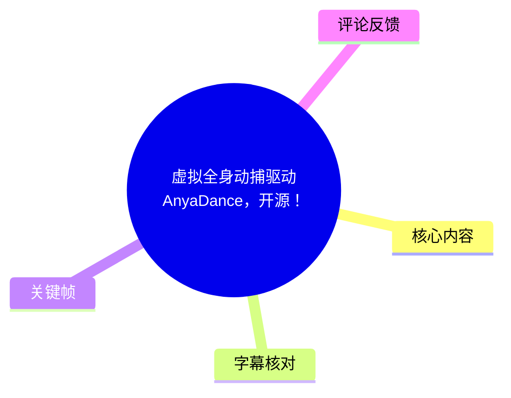
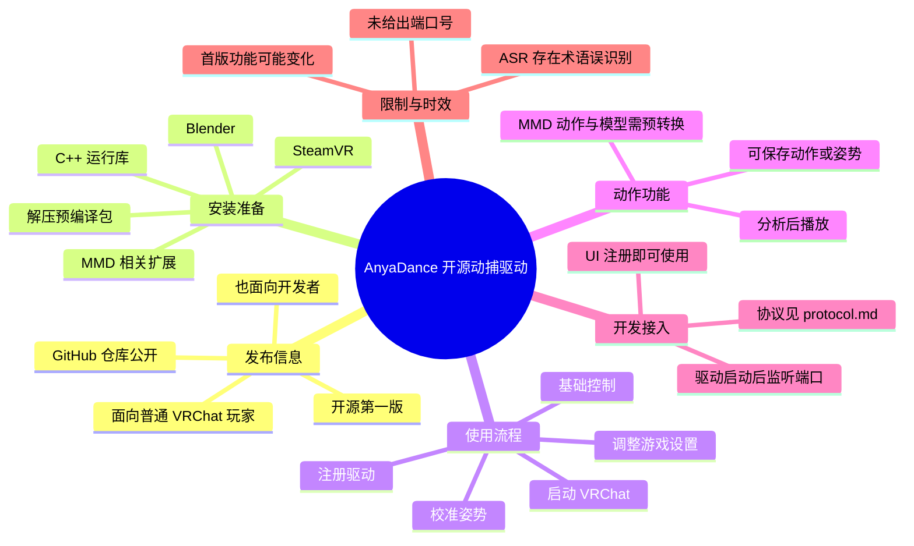
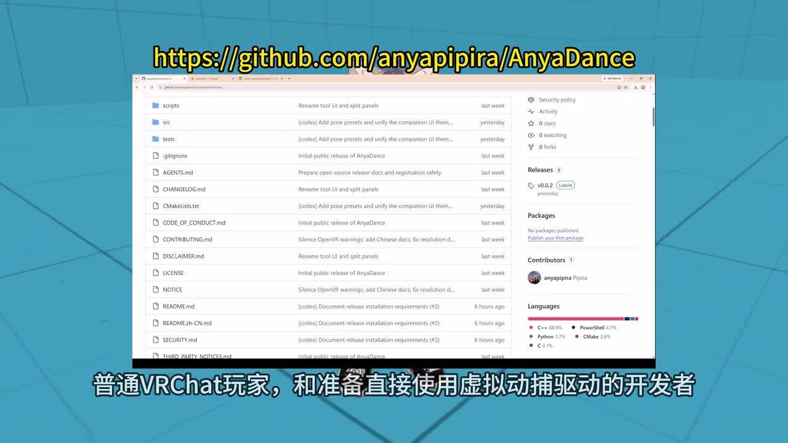
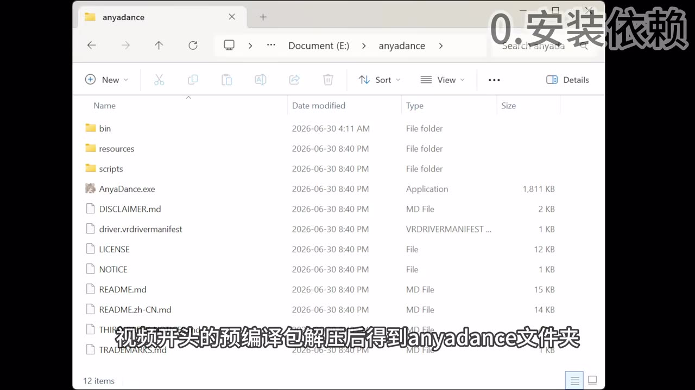
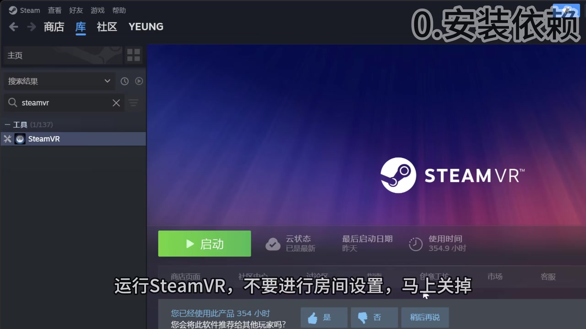

# 虚拟全身动捕驱动AnyaDance，开源！

> 来源：[Bilibili 视频](https://www.bilibili.com/video/BV1RXMF6LEwz)<br>
> UP 主：皮皮拉Pipiraピピラ｜时长：5 分 31 秒｜分辨率：3840×2160<br>
> 项目地址：<https://github.com/anyapipira/AnyaDance>

## 小结

视频发布了开源项目 **AnyaDance**：它被定位为可供普通 VRChat 玩家使用、也可供开发者接入的“虚拟全身动捕驱动”。视频以约 5 分钟的演示，给出从安装依赖、安装 SteamVR、注册驱动、启动游戏，到游戏内校准、基础控制和 MMD 动作播放的大致流程。

对一般使用者而言，核心路径是：解压预编译包 → 安装 C++ 运行库、Blender 与相关 MMD 扩展 → 安装并启动 SteamVR（不做房间设置）→ 在 AnyaDance 中注册驱动 → 启动 VRChat 并完成一次校准。视频称，后续启动通常只需在游戏内完成最后的校准步骤。

项目第一版已加入视频中称为“MMB 转换”的功能；结合后文“搜索 MMD 的动作和模型文件”“分析后播放”的表述，可确定其意图是让 MMD 动作经过预处理后用于播放。但 ASR 对具体功能名、格式名与个别菜单名识别不稳定，不能据此确认精确的文件格式、转换器名称或支持范围。

视频也面向开发者说明：如果不修改驱动本身，用户不必克隆仓库，可直接通过 UI 注册驱动；若要开发或接入，则可参考仓库内的 `protocol.md`。视频明确说驱动启动后会监听一个端口，但没有在给定素材中可靠识别出端口号，因此不能补写具体数值。

该教程具有明显时效性：视频发布时项目仍属“开源第一版”，画面中的仓库显示 Release `v0.0.2`，而 UP 主还提到正整理工程并准备迁移至新电脑。依赖版本、SteamVR/VRChat 界面、仓库文档、协议和功能都可能在后续更新中变化；实际操作应以仓库当前 README、中文文档与 Release 说明为准。

## 思维导图





## 目录

- [发布内容、适用对象与演示效果](#发布内容适用对象与演示效果)
- [安装依赖与运行环境](#安装依赖与运行环境)
- [注册驱动与 VRChat 启动设置](#注册驱动与-vrchat-启动设置)
- [游戏内校准与基础控制](#游戏内校准与基础控制)
- [MMD 动作播放与姿势保存](#mmd-动作播放与姿势保存)
- [开发者接入信息](#开发者接入信息)
- [完整操作清单](#完整操作清单)
- [参数、限制与时效性](#参数限制与时效性)
- [字幕比对](#字幕比对)
- [评论分析](#评论分析)
- [处理记录](#处理记录)

## 发布内容、适用对象与演示效果

### 开源项目与目标人群 [00:00](https://www.bilibili.com/video/BV1RXMF6LEwz?t=0)

视频开场说明，本期内容原本预计在上个视频发布一个月后才制作，但实际仅用一个周末完成并公开。UP 主将其定位为一套“虚拟全身动捕驱动”的使用引导，服务于两类人：

1. **普通 VRChat 玩家**：希望直接使用虚拟动捕驱动。
2. **准备直接使用或扩展该驱动的开发者**：可进一步查看代码仓库和协议资料。

视频给出的仓库地址为：

```text
https://github.com/anyapipira/AnyaDance
```

UP 主说代码仓库中有更详细的中文文档；喜欢自行研究的用户可以直接前往仓库，其他观众可依视频章节跳转。视频还提到，发布时预计将达到 500 粉，并将“500 粉福利”提前放入开源第一版；其中已添加一项被 ASR 识别为“MMB 转换功能”的功能。由于该缩写并未在可用画面中清晰确认，以下仅按视频语义将其归入 MMD 动作相关预转换流程，不将其扩展解释为某一特定标准或软件。



> 图：关键帧直接展示 `anyapipira/AnyaDance` GitHub 仓库及 Release 区域，是确认项目名称、公开地址和版本状态的重要视觉依据。画面中可见 `v0.0.2` 标记，但它仅反映录制时页面状态，不应视为当前最新版本。

### 虚拟全身动捕效果展示 [00:20](https://www.bilibili.com/video/BV1RXMF6LEwz?t=20)

视频以一个 VR 场景中的角色舞蹈画面展示驱动的预期效果：角色在场景中进行全身动作。该画面能够说明项目的应用方向是以虚拟身体动作为目标，但它**不能单独证明**动作精度、延迟、追踪方案、硬件需求或不同角色模型的兼容性。


> 图：该画面直观呈现 AnyaDance 面向虚拟角色全身动作驱动的使用情境，适合用于理解项目目标；不过画面未显示追踪器、设备列表或性能数据，不能据此推断具体技术指标。

## 安装依赖与运行环境

### 解压预编译包并安装依赖 [00:42](https://www.bilibili.com/video/BV1RXMF6LEwz?t=42)

视频的普通用户安装路径从“视频开头的预编译包”开始。解压后可得到 `anyadance` 文件夹；关键帧可见其中包括：

- `bin/`
- `resources/`
- `scripts/`
- `AnyaDance.exe`
- `driver.vrdrivermanifest`
- `README.md`
- `README.zh-CN.md`
- `LICENSE`
- `NOTICE`
- `DISCLAIMER.md`
- `THIRD_PARTY_NOTICES.md`

这些文件名说明该包包含可执行程序、资源与脚本目录、驱动清单及中英文说明文档。视频没有要求普通用户自行编译，因此在不开发驱动的场景下，应优先按预编译包及 README 操作，而非自行推断构建参数。



> 图：文件管理器画面能确认预编译包解压后的目录结构，并可见 `AnyaDance.exe` 与 `driver.vrdrivermanifest`。它有助于区分“直接运行包”与“源码仓库开发”两条路径。

视频按顺序要求安装以下环境：

| 项目 | 视频要求 | 用途或操作 |
| --- | --- | --- |
| C++ 运行库 | 下载并安装 | 为程序运行提供运行时依赖；视频未明确具体发行版或版本号。 |
| Blender | 下载并安装 | 用于后续 MMD 相关工作流。 |
| Blender 扩展 | 在“编辑 → 偏好设置 → 获取扩展”中安装 | ASR 将扩展名识别为“MMD2”，但专有名词不够可靠；应以仓库中文文档所列扩展为准。 |
| SteamVR | 在 Steam 库的“工具”列表安装 | 驱动运行的 VR 环境依赖。 |

### SteamVR 的启动注意事项 [01:10](https://www.bilibili.com/video/BV1RXMF6LEwz?t=70)

视频特别强调：从 Steam 库工具列表安装 SteamVR 后，运行 SteamVR，**不要进行房间设置，随后立即关闭**。画面中的字幕也清楚显示“运行 SteamVR，不要进行房间设置，马上关掉”。



> 图：Steam 客户端中选中了工具分类下的 SteamVR，配合画面字幕明确了安装入口与“不要做房间设置”的操作提醒。这是视频中少数由画面文字直接佐证的设置限制。

视频还提到，如果电脑连接了 VR 头显，需要修改某个“属性 → 启动选项”，设为“每次询问”，然后启动游戏并选择 SteamVR 模式。由于 ASR 在“选择 Steam……”之后截断，无法可靠确认该选项在何处设置、完整选项名称及最终应选择的全部文本。可确认的原则是：**头显已连接时，启动模式需要按视频提示进入可选择状态，并以 SteamVR 方式启动。**

## 注册驱动与 VRChat 启动设置

### 通过 AnyaDance 注册驱动 [01:30](https://www.bilibili.com/video/BV1RXMF6LEwz?t=90)

在完成环境准备后，视频进入 AnyaDance 的驱动注册环节。ASR 中出现“让我们注册一下驱动”，但界面字段、按钮名称和是否需要管理员权限均未在给定素材中可靠提供。

因此可归纳为以下**已确认操作意图**：

1. 打开 AnyaDance。
2. 在其 UI 内执行“注册驱动”。
3. 按前文说明启动 SteamVR 与游戏。
4. 若不改动驱动代码，后续可继续通过 UI 注册，不需要克隆仓库。

不应根据这段视频臆测注册表路径、命令行参数、安装目录或驱动加载机制。

### 进入游戏后的必要设置 [01:50](https://www.bilibili.com/video/BV1RXMF6LEwz?t=110)

视频表示启动游戏后，需要修改若干游戏内设置。操作从切换到“菜单姿势”开始，按下 `M` 键后进行菜单交互。ASR 中可辨识到的操作如下：

- 在菜单中按住鼠标中键移动左手光标。
- 使用 `Z` 键按下左手当前选中的项目。
- 在“舒适与安全”中关闭：
  - “舒适转向”（ASR 识别为“舒逊转向”，根据语义整理，原始文字仍有误识别可能）；
  - “第三人称全息移动”。
- 通过同时按住 `Z` 键与鼠标中键并上下移动来滚动菜单。
- 后续还需在某个与“动步”相关的设置区域继续配置，但可用 ASR 未完整识别菜单名及选项内容。

这些设置的目的，视频没有给出原理说明。合理且保守的理解是，它们与虚拟动捕下的游戏内移动/显示体验相关；不能进一步断言其会影响追踪精度或驱动识别。

## 游戏内校准与基础控制

### 校准动作与结束方式 [02:25](https://www.bilibili.com/video/BV1RXMF6LEwz?t=145)

完成菜单设置后，视频提示按 `M` 关闭完整菜单。随后选择“校准”并按 `Z` 键，再使用“重置为 T 姿势”（ASR 将姿势词识别为“踢姿势”，结合常见校准语境与上下文，此处保留“重置为 T 姿势”为**推定校正**）进行校准。

视频明确给出了结束校准的方法：

```text
同时按下 Z 键和 X 键，结束校准。
```

UP 主说明：以后每次启动，通常只需要在游戏内执行最后一步校准。这里的“通常”应理解为视频作者的使用流程描述，而不是对所有设备、角色或版本的绝对保证。

### 键鼠与手部控制 [02:50](https://www.bilibili.com/video/BV1RXMF6LEwz?t=170)

视频列出一组基础键鼠操作。下表区分了识别清楚的内容与存在歧义的内容：

| 类别 | 操作 | 视频信息与可靠性 |
| --- | --- | --- |
| 移动 | `WASD` | 明确用于移动。 |
| 转向 | `Q` / `E` | ASR 识别为“Q1转向”，按常见键位及语义整理为 `Q/E` 转向；该键位需要实操或文档复核。 |
| 跳跃 | 空格 | 明确用于跳跃。 |
| 某开关功能 | `V` | ASR 仅识别到“V开关脉……”，功能名不完整，不能确认。 |
| 部位操作 | 鼠标移至设备框内 | 可分别操作各个身体部位。 |
| 移动部位 | 鼠标左键 | 明确。 |
| 旋转部位 | 鼠标中键 | 明确。 |
| 手指开合 | 鼠标滚轮 | 视频说“滚轮控制手指开合”。 |
| 单根手指 | 长按数字键 | 可分别控制每根手指，但未给出“数字键—手指”的映射。 |
| 右手圆盘菜单 | 长按 `M` | 调出右手圆盘菜单；在空白处拖动进行选择。 |

视频还说明某些操作可以同时使用。对于需要精细摆姿势或录制动作的使用者，设备框内的局部移动、旋转与手指控制是本段最具操作价值的内容；但具体坐标轴方向、灵敏度、快捷键冲突和保存方式未在素材中提供。

## MMD 动作播放与姿势保存

### 动作预转换、分析与播放 [03:55](https://www.bilibili.com/video/BV1RXMF6LEwz?t=235)

视频说明，MMD 内容需要“经过预转换才能播放”，并建议用户自行搜索 MMD 的动作与模型文件。随后对素材进行“分析”，才能播放。按视频顺序可整理为：

1. 自行准备 MMD 动作文件和模型文件。
2. 对其进行视频所称的预转换。
3. 在工具中进行分析。
4. 分析完成后播放动作。
5. 可将分析后的舞蹈保存为某种文件。

其中第 5 步的目标文件类型被 ASR 识别为“存情恋爱文件”，无法辨认，不记录为确定格式。视频未说明受支持的 MMD 文件扩展名、模型约束、骨骼兼容性、分析耗时、失败处理或版权要求，实践前应查阅项目文档及素材原始授权。

### 暂停、微调和保存姿势 [04:18](https://www.bilibili.com/video/BV1RXMF6LEwz?t=258)

对于喜欢的舞蹈动作，视频指出可以：

1. 暂停动作；
2. 进行微调；
3. 将结果存为姿势。

这意味着该工具并非只做连续动作播放，也支持在动作片段上进行手动姿态编辑和保存。视频末尾同时提示仍有一些未讲解的小功能，留给使用者自行探索。因此，视频不构成全部功能的完整手册，仓库文档应作为补充来源。

## 开发者接入信息

### 无需开发与需要开发的分界 [04:40](https://www.bilibili.com/video/BV1RXMF6LEwz?t=280)

开发者时间中，UP 主明确划分了两种使用方式：

- **不对驱动本身进行开发**：不需要克隆仓库，可直接通过 UI 注册驱动。
- **需要开发或扩展**：欢迎开发者参与，并在仓库中贡献力量。

这一区分对使用路径很重要：普通用户不应将“GitHub 开源”误解为必须搭建源码编译环境；开发者则不能只依赖 UI 操作，应继续阅读协议与代码文档。

### 协议与端口监听 [05:02](https://www.bilibili.com/video/BV1RXMF6LEwz?t=302)

视频表示，驱动在相关 VR 环境启动后会监听一个端口；协议包的分析参考和包的具体定义可在 `protocol.md` 找到。

可确认的信息：

- 存在可供开发参考的 `protocol.md`。
- 驱动会监听端口。
- 视频将协议包定义与开发接入联系在一起。

不能确认的信息：

- 端口号；
- 使用 TCP、UDP 或其他传输机制；
- 包格式、字段含义、认证机制；
- 本地/远程访问范围；
- 是否存在安全风险或访问控制。

因此，开发者应直接以仓库中当前 `protocol.md` 为准，不应从这段视频推导网络实现细节。

## 完整操作清单

### 普通玩家路径

1. 从项目发布页获取视频所示的预编译包并解压。
2. 确认解压目录中存在 `AnyaDance.exe`、`driver.vrdrivermanifest` 与 README 文档。
3. 安装视频要求的 C++ 运行库；版本未在视频中给出时，以 README 为准。
4. 安装 Blender。
5. 在 Blender 的“编辑 → 偏好设置 → 获取扩展”中安装项目文档要求的 MMD 相关扩展。
6. 在 Steam 库的“工具”中安装 SteamVR。
7. 启动一次 SteamVR，但按视频要求不要进行房间设置，随后关闭。
8. 打开 AnyaDance，通过 UI 注册驱动。
9. 若连接了 VR 头显，按视频指示将游戏启动选项设为“每次询问”，并选择 SteamVR 方式启动；具体菜单文本以当前软件界面为准。
10. 进入游戏后，按 `M` 打开菜单姿势及相关菜单。
11. 使用鼠标中键移动左手光标、用 `Z` 确认选项；在“舒适与安全”中关闭视频提到的舒适转向和第三人称全息移动。
12. 选择校准并执行重置姿势；校准结束时同时按 `Z + X`。
13. 后续启动时，按视频所述完成最后的游戏内校准。
14. 使用 `WASD` 移动、空格跳跃，以及设备框内的鼠标/滚轮/数字键操作调整身体与手指。

### MMD 动作路径

1. 自行取得具有合法使用授权的 MMD 动作与模型素材。
2. 按项目文档完成视频所称的预转换与分析。
3. 分析完成后播放舞蹈动作。
4. 在需要的位置暂停并微调。
5. 将微调结果保存为姿势；具体保存文件名和格式应以软件实际界面与文档为准。

### 开发接入路径

1. 先明确是否真的需要修改驱动：不修改时优先使用 UI 注册。
2. 需要开发时，访问 GitHub 仓库。
3. 阅读 README、中文 README 与 `protocol.md`。
4. 在确认当前版本协议、端口和数据包定义后再实现接入。
5. 不要仅凭视频中的“监听端口”描述暴露端口或允许公网访问。

## 参数、限制与时效性

### 已明确的参数与快捷键

| 项目 | 值或操作 | 证据状态 |
| --- | --- | --- |
| 视频时长 | 331 秒 | 元数据明确。 |
| 视频分辨率 | 3840×2160 | 元数据明确。 |
| 项目仓库 | `github.com/anyapipira/AnyaDance` | 视频描述与关键帧共同确认。 |
| 画面中的 Release | `v0.0.2` | 仅确认录制画面中的状态。 |
| 菜单 | `M` | ASR 明确出现。 |
| 菜单确认 | `Z` | ASR 明确出现。 |
| 结束校准 | `Z + X` | ASR 明确出现。 |
| 移动 | `WASD` | ASR 明确出现。 |
| 跳跃 | 空格 | ASR 明确出现。 |
| 局部移动/旋转 | 左键/中键 | ASR 明确出现。 |
| 手指开合 | 鼠标滚轮 | ASR 明确出现。 |

### 素材未能确认的内容

以下事项在给定元数据、关键帧与 ASR 中均没有可靠答案：

- 所需 VR 头显、控制器、摄像头或外部追踪器型号；
- Windows、SteamVR、VRChat、Blender 与 C++ 运行库的准确版本；
- GPU、CPU、内存、帧率、延迟与追踪精度；
- `V` 键开关的完整功能；
- “MMD2”扩展的准确名称；
- “MMB 转换”的准确写法与技术含义；
- MMD 输入/输出格式、角色骨骼要求、版权规则；
- 驱动监听端口的端口号和网络协议；
- 注册驱动失败、校准失败或动作分析失败的排障办法。

### 时效性说明

元数据中的发布时间戳对应 2026-07-04（UTC）。采集时间为 2026-07-13。视频明确处在“开源第一版”阶段，并且 UP 主提到将更换旧电脑、迁移工程文件。因此：

- 画面中 `v0.0.2` 不等于当前最新版本；
- 仓库目录、Release、中文文档和协议可能已经更新；
- SteamVR、VRChat 的菜单位置与名称可能改动；
- 本文将视频内容作为历史操作记录，不替代当前项目文档。

## 字幕比对

| 字幕来源 | 完整性 | 专有名词 | 时间轴 | 主要问题 |
| --- | --- | --- | --- | --- |
| Bilibili 站内字幕 | 不可用 | 无法评估 | 无可用时间轴 | 素材获取时字幕工具报错：`Missing JSON resource URL`；未提供可用站内字幕。 |
| 本次 ASR 字幕 | 覆盖了从开场、安装、校准、动作播放到开发者说明的主要顺序 | 较弱，`AnyaDance`、MMD 相关扩展、转换功能名、菜单名和协议部分均有误识别或截断 | 未提供逐句时间戳，只能依视频顺序和总时长进行近似章节定位 | 存在繁简混用、词语替换、句子截断，例如“MMB”“MMD2”“踢姿势”“V开关脉……”等。 |

最终采用策略是：**以本次 ASR 作为唯一的文字转写来源，并用元数据、视频描述和关键帧进行保守校正。**未使用站内字幕，因为本次素材未获得可用站内字幕；但本次 ASR 已执行，满足对音频内容的独立转写要求。

重要校正与保留原则：

- `AnyaDance`：由视频标题、描述链接、仓库关键帧和解压目录中的 `AnyaDance.exe` 共同确认。
- GitHub 地址：由视频描述和关键帧共同确认。
- SteamVR：由 ASR 和 Steam 客户端关键帧共同确认。
- “T 姿势”：ASR 文字不可靠；依据“校准—重置姿势”的语境作推定性整理，已在正文中明确标注为推定，不能视为原句逐字转写。
- MMD 扩展名、转换功能名、端口号、协议细节：缺乏足够证据，保留不确定性，不做补全。

## 评论分析

仅处理本次可获取的热评前三条；评论反映的是用户反应，不构成项目功能或性能的验证。

1. **春蕾不觉晓｜20 赞**  
   评论：“首发是我的了”。  
   这是对抢到首评的互动性表达，没有补充任何技术信息，也不存在可供核验的功能主张。

2. **herfilex｜3 赞**  
   评论：“这玩意再加上ai聊天不就可以跑团了吗[doge]”。  
   评论者设想把虚拟动捕与 AI 聊天结合，用于跑团场景。这反映了观众对角色交互和虚拟陪伴用途的联想，但视频没有展示 AI 聊天、语音对话、剧情系统或跑团功能，因此该设想不能当作 AnyaDance 已支持的能力。

3. **chinosk｜3 赞**  
   评论：“@瑄25 快给我变猫娘！……”。  
   这是围绕虚拟形象的玩笑式互动，没有提供安装、兼容性、动作质量或开发接入方面的信息，也无实际争议可分析。

## 处理记录

- Worker ID：`worker-mrj0wjed-b0c290ad`
- 模型：`gpt-5.6-terra`
- 调用工具与素材：视频元数据、视频描述、关键帧列表、热评数据、本次 ASR 转写结果；素材产物包括 `merged.mp4`、`audio/audio.wav`、`frames/`、`comments/comments.json` 与 `asr/`。
- 字幕选择：站内字幕不可用，原因是字幕获取过程报错 `Missing JSON resource URL`；已执行本次 ASR，并以 ASR 为主、关键帧与上下文为辅进行保守整理。
- 关键帧选择依据：
  - `frames/frame-001.jpg`：显示 GitHub 仓库、项目地址及录制时 Release 信息，支撑开源项目与版本状态描述。
  - `frames/frame-002.jpg`：展示虚拟角色舞蹈场景，说明应用目标为虚拟全身动作驱动。
  - `frames/frame-003.jpg`：展示预编译包解压后的目录和 `AnyaDance.exe`，支撑普通用户直接使用包的安装路径。
  - `frames/frame-004.jpg`：展示 Steam 工具库内的 SteamVR，并有“不进行房间设置”的画面字幕，支撑 SteamVR 安装注意事项。
- 缓存清理：未提供缓存清理执行日志；不能声称已完成清理。已仅引用任务提供的相对路径关键帧与素材信息。
- 未解决问题：ASR 缺少逐句时间戳且包含专有名词误识别；具体端口、协议、硬件要求、MMD 格式、完整菜单项、准确 Blender 扩展名称和性能参数均无法从现有素材可靠确认。
